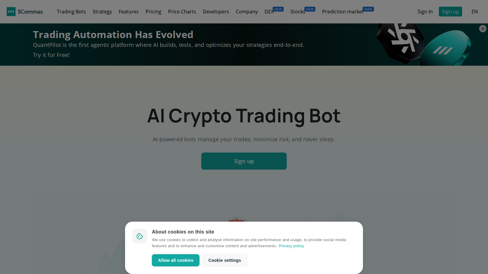
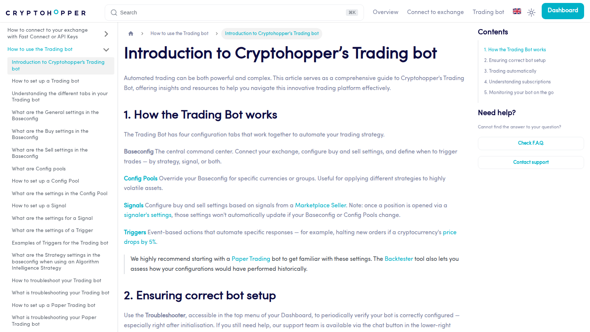

# 10 Best AI Crypto Trading Bots in 2026: Which Bots Actually Help Traders?

- Primary keyword: `best ai crypto trading bots`
- Slug: `/ai-trading/bots/best-ai-crypto-trading-bots-2026/`
- Meta title: `Best AI Crypto Trading Bots in 2026: Top 10 Bots`
- Meta description: `Compare the best AI crypto trading bots in 2026 by strategy support, automation, exchange coverage, pricing, and risk controls.`

## Schema

```json
{
  "@context": "https://schema.org",
  "@graph": [
    {
      "@type": "Article",
      "headline": "10 Best AI Crypto Trading Bots in 2026: Which Bots Actually Help Traders?",
      "description": "Comparison brief for AI crypto trading bots in 2026.",
      "mainEntityOfPage": "https://your-site.com/ai-trading/bots/best-ai-crypto-trading-bots-2026/"
    },
    {
      "@type": "ItemList",
      "name": "Best AI Crypto Trading Bots in 2026",
      "numberOfItems": 10
    }
  ]
}
```

If you are trying to choose the best AI crypto trading bots in 2026, the real problem is usually not feature count. The real problem is which tool gives you useful automation without hiding too much risk behind an `AI` label. Readers who need the alerting side of this workflow should also compare this page with our guide to the [best crypto AI signals](/ai-trading/signals/best-crypto-ai-signals-2026/).

That is why this article does not rank bots by marketing copy alone. We are looking at them through the lens of workflow depth, exchange support, control, and whether the product still looks useful once you stop treating `AI` as a promise of automatic performance.

> The best AI crypto trading bots in 2026 are the tools that help traders automate useful workflows, test strategies, control risk, and connect across exchanges without pretending to guarantee profits.

> Why you can trust this guide
>
> This article is based on live public product pages and current documentation reviewed in July 2026. Where a claim still depends on logged-in settings, paid tiers, exchange permissions, or a full end-to-end trading test, we mark that for final verification before publication.

## What are the best AI crypto trading bots in 2026?

The best AI crypto trading bots in 2026 are 3Commas, Cryptohopper, Pionex, Coinrule, WunderTrading, Bitsgap, Altrady, HaasOnline, Gunbot, and TradeSanta.

That list includes both AI-branded products and established automation platforms that now offer AI-assisted strategy creation, signal handling, or smarter execution layers. If the reader's real question is signal quality rather than bot execution, the better next read after this is [best crypto AI signals](/ai-trading/signals/best-crypto-ai-signals-2026/).

## Who this guide is for and how to use it

This guide is for traders comparing automation platforms, not for readers looking for guaranteed returns. The ranking favors usable workflow, exchange support, and risk controls over the loudest performance claims.

The important trust point is that most products here are better described as automation platforms with AI-assisted features rather than fully autonomous AI funds.

## What we checked ourselves before ranking these bots

To write this guide, we reviewed the live public product surfaces, official documentation, and visible workflow positioning of the shortlisted bot platforms. We did that so the article would not depend only on affiliate-style roundup writing.

That direct review does not replace a full funded trading test on every platform. But it does make one thing clear quickly: some bots are built for convenience first, some for control first, and some for strategy depth first.

What stood out immediately was not the number of features. It was where each product puts friction in the workflow. That matters more than most readers realize.

**Featured Image**
File: `../media/3commas-ai-trading-bot-2026-07-13.png`
Alt text: `3Commas AI trading bot page showing crypto automation workflow reviewed for this guide`
Caption: `3Commas AI trading bot page captured during our July 2026 review of crypto automation platforms.`



*3Commas AI trading bot page captured during our July 2026 review of crypto automation platforms.*

**Screenshot 1**
File: `../media/cryptohopper-trading-bot-2026-07-13.png`
Alt text: `Cryptohopper trading-bot documentation showing strategy and setup workflow`
Caption: `Cryptohopper trading-bot documentation captured during our July 2026 review of crypto bot workflows.`



*Cryptohopper trading-bot documentation captured during our July 2026 review of crypto bot workflows.*

## How we ranked AI crypto trading bots

| Factor | What we checked | Why it matters |
|---|---|---|
| Automation depth | Does the bot do more than place a basic order? | Real utility beats marketing copy |
| Strategy support | Can users test, adapt, or import logic? | Flexibility matters |
| Exchange coverage | Does it connect to major venues? | Integration decides usefulness |
| Risk controls | Stop-loss, trailing logic, portfolio limits, approvals | AI without guardrails is weak |
| UX and transparency | Can traders understand what the bot is doing? | Black-box risk is real |

## The 10 best AI crypto trading bots in 2026

### 1. 3Commas

3Commas ranks first because it still combines broad exchange support, automation, portfolio tooling, and current AI-assisted features more cleanly than many rivals. That is a strength if you want a broad all-round workflow. But it is a weakness if you want the lightest possible setup, because broader platforms also create more decisions and more room for user error.

### 2. Cryptohopper

Cryptohopper remains one of the strongest bot platforms for users who want a mature automation stack with strategy tooling, marketplace features, and extensive documentation. This is a strength if you value depth and documentation. But it is a weaker fit if your priority is the shortest path to simple execution.

### 3. Pionex

Pionex makes the list because exchange-native bots remain attractive to users who want a simpler workflow. Its signal and smart-trade layers also make it more flexible than a basic template platform. That is a strength if you want fewer moving parts. But it can be a weakness if you want the broadest external-platform flexibility.

### 4. Coinrule

Coinrule stays relevant because it is strong on rule-based automation and accessible strategy building. For many users, that is more valuable than chasing "AI" branding alone.

### 5. WunderTrading

WunderTrading belongs high on the list because it combines multi-exchange routing, terminal-style tools, and bot workflows that are useful for active traders.

### 6. Bitsgap

Bitsgap remains a common choice for grid and automation workflows. It is not the most AI-native platform, but it still matters in the category because many traders searching for AI bots really want execution convenience.

### 7. Altrady

Altrady earns a place because serious retail traders often need portfolio visibility and execution tooling as much as they need bot logic.

### 8. HaasOnline

HaasOnline stays on the list as one of the more technical bot environments. It is less beginner-friendly, but stronger for users who want deeper control.

### 9. Gunbot

Gunbot remains relevant because self-hosted or trader-controlled bot environments still appeal to users who distrust fully outsourced automation.

### 10. TradeSanta

TradeSanta rounds out the list as an easier-entry platform for traders who want automated strategies without a heavier technical stack.

## What an AI crypto trading bot can and cannot do

An AI trading bot can help structure decisions, automate entries and exits, integrate signals, and reduce manual execution time.

It cannot remove market risk, eliminate slippage, or turn a weak trading idea into a winning one. That difference matters, because too much bot marketing still implies performance that the product cannot guarantee. The important thing is not whether a bot says `AI`. The important thing is whether the workflow actually fits the trader using it.

## Which bots are best for different trader profiles

For beginners, Pionex and TradeSanta are easier starting points.

For intermediate multi-exchange users, 3Commas, Coinrule, and WunderTrading are stronger fits.

For more technical traders, Cryptohopper, HaasOnline, and Gunbot offer more control, but also demand more care.

Bottom line: the best bot depends more on workflow than on hype. If the reader wants the market-data side after this, the next internal step is [best crypto AI signals](/ai-trading/signals/best-crypto-ai-signals-2026/), not another bot list.

## What risks traders should understand before using AI bots

The largest risk is automation without supervision. A bot will execute bad logic as efficiently as good logic.

The second risk is exchange and API dependency. Even a solid bot becomes less useful if exchange connections, permissions, or supported features change.

The third risk is believing the "AI" label too easily. Many bots remain rules-based automation engines with a thin AI layer on top.

## Final verdict: which AI crypto trading bots stand out now

If you need the best all-round platform, 3Commas is still the strongest first answer. If you want a more documented and strategy-heavy experience, Cryptohopper is a strong alternative. If you want simpler exchange-native automation, Pionex stands out. If your real need is signal quality before automation, move next into [best crypto AI signals](/ai-trading/signals/best-crypto-ai-signals-2026/). If your real interest is more autonomous onchain behavior, compare this with [best onchain AI agents](/ai-agents/onchain-agents/best-onchain-ai-agents-2026/).

## FAQ

### What is the best AI crypto trading bot in 2026?

For most traders, 3Commas is the safest first pick because it balances features, exchange support, and workflow depth.

### Are AI crypto bots fully autonomous?

Usually not. Most products are better described as automation platforms with AI-assisted features.

### Should beginners use AI trading bots?

Only with small size, clear limits, and a strong understanding of the strategy the bot is running.

## Sources used in this guide

- [3Commas AI trading bot](https://3commas.io/ai-trading-bot)
- [Cryptohopper trading bot docs](https://docs.cryptohopper.com/docs/trading-bot/introduction-to-cryptohoppers-trading-bot)
- [Pionex bot center](https://www.pionex.com/en/bot)
- [Pionex Signal Bot guide](https://support.pionex.com/hc/en-us/articles/52606266734105-Signal-Bot)
- [Coinrule platform](https://coinrule.com/b/)
- [WunderTrading docs](https://wundertrading.com/docs)
