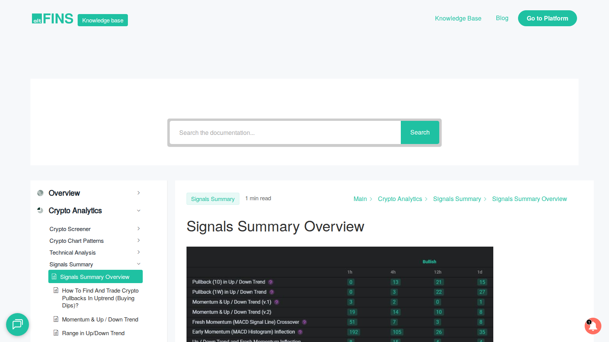
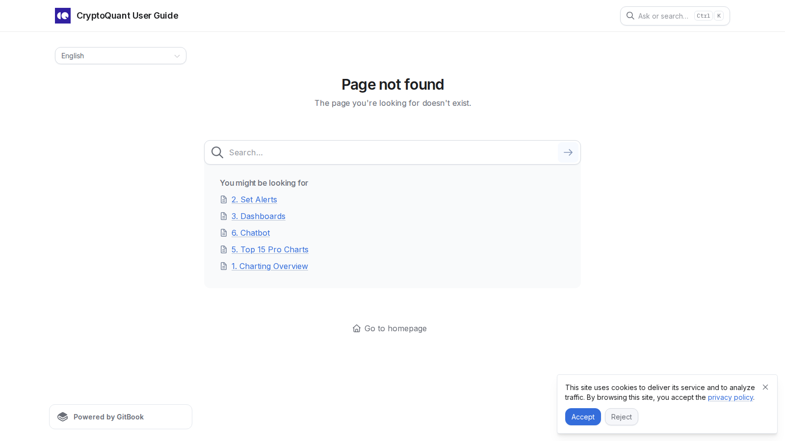

# 10 Best Crypto AI Signals in 2026: Which Tools Deliver the Most Useful Trade Setups?

- Primary keyword: `best crypto ai signals`
- Slug: `/ai-trading/signals/best-crypto-ai-signals-2026/`
- Meta title: `Best Crypto AI Signals in 2026: Top Tools Ranked`
- Meta description: `Find the best crypto AI signals in 2026, ranked by data inputs, transparency, delivery, and trader usability.`

## Schema

```json
{
  "@context": "https://schema.org",
  "@graph": [
    {
      "@type": "Article",
      "headline": "10 Best Crypto AI Signals in 2026: Which Tools Deliver the Most Useful Trade Setups?",
      "description": "Comparison of AI-powered crypto signal tools in 2026.",
      "mainEntityOfPage": "https://your-site.com/ai-trading/signals/best-crypto-ai-signals-2026/"
    },
    {
      "@type": "ItemList",
      "name": "Best Crypto AI Signals in 2026",
      "numberOfItems": 10
    }
  ]
}
```

If you are trying to choose the best crypto AI signals in 2026, the real problem is usually not finding a tool that sends alerts. The real problem is finding a tool that gives enough context for those alerts to mean something. Readers who mainly want automation after that should compare this page with our guide to the [best AI crypto trading bots](/ai-trading/bots/best-ai-crypto-trading-bots-2026/).

That is why this article does not rank signal tools by noise level or prediction language alone. We are looking at them through the lens of clarity, context, delivery, and whether the tool still looks useful once you stop treating `AI` as a magic word.

> The best crypto AI signals tools in 2026 are the platforms that deliver actionable alerts, clear context, and enough transparency for traders to understand why a signal exists.

> Why you can trust this guide
>
> This article is based on live public product pages and current documentation reviewed in July 2026. Where a claim still depends on paid features, logged-in dashboards, or a longer live-trading validation pass, we treat that as a final verification item before publication.

## What are the best crypto AI signals in 2026?

The best crypto AI signals tools in 2026 are altFINS, CryptoQuant, Glassnode, Nansen, TradingView, Token Metrics, 3Commas Signal Bot, Pionex Signal Bot, Cryptohopper marketplace signals, and Coinrule.

This list mixes dedicated signal products and execution-linked signal systems. That is deliberate, because many traders now want the alert and the automation connected in one workflow. If that is the reader's real priority, the better next read after this is [best AI crypto trading bots](/ai-trading/bots/best-ai-crypto-trading-bots-2026/).

## Who this guide is for and how to use it

This guide is for traders who want alerts they can interpret and act on, not just noisy notification feeds. The list prioritizes context, transparency, and workflow fit over hype-driven prediction claims.

In the final published version, keep a trust note near the top explaining that signals can improve decision quality but cannot guarantee profitable trades.

## What we checked ourselves before ranking these tools

To write this guide, we reviewed the live public product pages, official docs, and visible alert-positioning of the shortlisted tools. We did that so the article would not depend only on generic signal roundups or performance-style marketing.

That direct review does not replace a longer live-trading validation pass across every alert system in the list. But it does make one thing clear quickly: the strongest tools explain their alerts, while the weaker tools mainly advertise them.

What stood out immediately was not which platform promised the smartest signal. It was which platform gave enough context for a trader to judge the signal independently.



*altFINS signals overview page captured during our July 2026 review of crypto AI signal tools.*



*CryptoQuant alerts page captured during our July 2026 review of crypto alert workflows and signal delivery.*

## How we ranked crypto AI signal tools

| Factor | What we checked | Why it matters |
|---|---|---|
| Signal clarity | Does the tool explain what the alert means? | Raw alerts are weaker |
| Data depth | Onchain, technical, flow, social, or model-driven inputs | Better inputs improve usefulness |
| Delivery | App, dashboard, email, webhook, TradingView, exchange routing | Traders need usable output |
| Transparency | Can users inspect conditions or logic? | Blind trust is dangerous |
| Workflow fit | Can a user act on the signal quickly? | Good signals still need execution |

## The 10 best crypto AI signals tools in 2026

### 1. altFINS

altFINS ranks first because it is one of the clearest signal-oriented crypto platforms rather than a vague analytics dashboard. Its screening and signal workflows are built for action. This is a strength if you want a signal-first workflow. But it is a weaker fit if you want the deepest wallet- or flow-based context instead of a screening-led experience.

### 2. CryptoQuant

CryptoQuant remains one of the strongest choices for traders who care about exchange flows, whale behavior, and market-structure alerts more than generic indicator bundles. That is a strength if your edge comes from flow analysis. But it is a weaker fit if you want simpler retail-facing alerts without heavy interpretation.

### 3. Glassnode

Glassnode earns the third spot because it remains one of the better options for context-rich onchain alerts. It is especially useful for traders who want structural signals rather than short-lived noise.

### 4. Nansen

Nansen belongs high on the list because wallet intelligence and smart-money tracking still matter. In crypto, signals tied to real capital movement can be more useful than abstract indicator models. This is a strength if you care about who is moving, not just what price is doing. But it is a weaker fit if your workflow is mostly chart-based.

### 5. TradingView

TradingView is not a crypto-native AI signal platform first, but it still matters because alerting flexibility and indicator workflows make it central to many trader setups.

### 6. Token Metrics

Token Metrics fits because it is closer to the "AI-driven ranking and signal" experience many retail users actively search for.

### 7. 3Commas Signal Bot

3Commas makes sense here because its signal layer plugs directly into execution, which is exactly what many traders want.

### 8. Pionex Signal Bot

Pionex Signal Bot earns a slot because it connects alerts to exchange-native automation more directly than many standalone dashboards.

### 9. Cryptohopper Marketplace Signals

Cryptohopper stays relevant because signal marketplaces still matter for traders who want imported strategies rather than building everything from scratch.

### 10. Coinrule

Coinrule rounds out the list because rule-based automation and alert-to-action workflows often beat flashy AI language.

## What AI crypto signals actually mean

Most AI crypto signals are not mystical prediction engines.

Usually they combine one or more data sources, such as technical structure, onchain movement, exchange flow, momentum, or wallet behavior, then turn those signals into a watchlist, alert, or action prompt.

That means the best tool is often the one with the clearest explanation, not the one making the biggest performance claim. The important thing is not how impressive the signal sounds. The important thing is whether the trader can interpret it correctly.

## Which signal products fit which type of trader

For technically oriented traders, TradingView, altFINS, and Coinrule are easier to integrate.

For onchain-focused traders, CryptoQuant, Glassnode, and Nansen are stronger.

For traders who want alerts tied to execution, 3Commas, Pionex, and Cryptohopper are better workflow fits.

## What makes an AI signal product more trustworthy

Three things matter most: transparency, context, and restraint.

A trustworthy signal product explains what changed, why the alert fired, and how the user should interpret it. A weak product hides the logic behind performance claims and pushes urgency instead of clarity.

## Final verdict: which AI signal tools look strongest now

If you want the clearest signal-first product, altFINS is the best first answer. If you care most about onchain context, CryptoQuant and Glassnode are stronger picks. If you want signals tied directly to trading automation, 3Commas and Pionex are more practical. If the reader wants execution after alerts, continue into [best AI crypto trading bots](/ai-trading/bots/best-ai-crypto-trading-bots-2026/). If the reader wants a DeFi workflow angle, continue into [best DeFAI projects](/ai-agents/defi-agents/best-defai-projects-2026/).

## FAQ

### What is the best crypto AI signals platform in 2026?

For most traders, altFINS is the strongest first pick because it is purpose-built around signals and screening.

### Are crypto AI signals accurate?

Some are useful, but none remove market risk. Good signals improve decision quality; they do not guarantee profitable trades.

### Should traders automate AI signals?

Only if they understand the source conditions, time horizon, and risk controls tied to each signal.

## Internal link map used in this article

- Bot automation branch: [best AI crypto trading bots](/ai-trading/bots/best-ai-crypto-trading-bots-2026/)
- Analytics branch: [AI crypto analytics](/ai-data/analytics/)
- Prediction branch: [AI crypto prediction tools](/ai-trading/prediction/)
- DeFi workflow branch: [best DeFAI projects](/ai-agents/defi-agents/best-defai-projects-2026/)
- Onchain autonomy branch: [best onchain AI agents](/ai-agents/onchain-agents/best-onchain-ai-agents-2026/)

## External links to cite in the body

- [altFINS overview](https://altfins.com/knowledge-base/overview/)
- [altFINS create a signal or filter](https://altfins.com/knowledge-base/create-a-signal-or-filter/)
- [CryptoQuant alerts guide](https://userguide.cryptoquant.com/quickstart/5-minute-feature-guide/2.-set-alerts)
- [Glassnode custom alerts](https://studio.glassnode.com/alerts)
- [Nansen AI Smart Alerts](https://academy.nansen.ai/help/articles/6239622-ai-smart-alerts-101)

## First-hand experience package to add before publish

Do not fake first-hand experience on a signal-tool comparison page. Use first-hand evidence only where the editorial team actually reviewed public product surfaces or completed a real alert workflow.

### 1. Visual evidence to collect

- Original screenshots from product pages and public docs
- Original screenshots of visible alert interfaces where publicly accessible
- If the team runs a real test, screenshots showing alert creation or delivery flow

### 2. First-person perspective to add only after real review

- Use wording such as `From the public product surfaces we reviewed...`
- Add context such as `What stood out immediately in the alert workflow was...`
- If a real test is run, use `During setup...` or `In our alert test...`
- Never imply performance validation unless the team actually ran it

### 3. Balanced evaluation to strengthen trust

- Add one short `Best for` line for each tool
- Add one short `Main limitation` line for each tool
- Add one short `Who should avoid it` line for the top five names

### 4. Quantitative data to add where available

- Number of alert types or delivery channels visible in a public workflow
- Number of steps required to create a first alert in a real test
- Any measurable gating between free and paid surfaces

## EEAT upgrades to add before publish

- Add a note separating signal tools from prediction engines
- Cite official alert documentation for the core workflow claims
- Add a risk box about false confidence and overtrading
- Add a short methodology disclosure explaining which judgments came from manual editorial review versus external sources

## Source notes

- altFINS platform and signal docs
- CryptoQuant alerts guide
- Glassnode custom alerts
- Nansen AI Smart Alerts
- TradingView / bot integration references

## Verification notes before publish

- Re-check paid feature gating, alert limits, and current AI branding language.
- Add screenshots of alert flows if using this as a money page.
