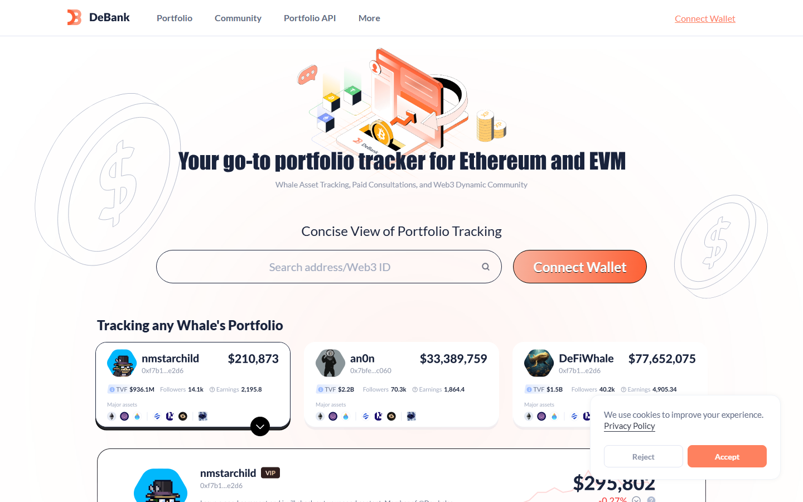
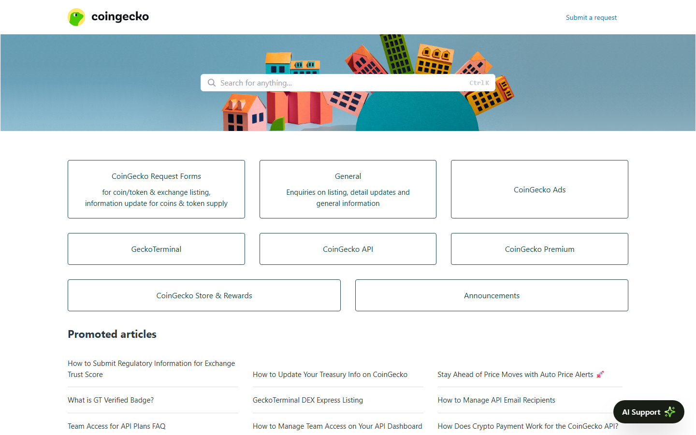
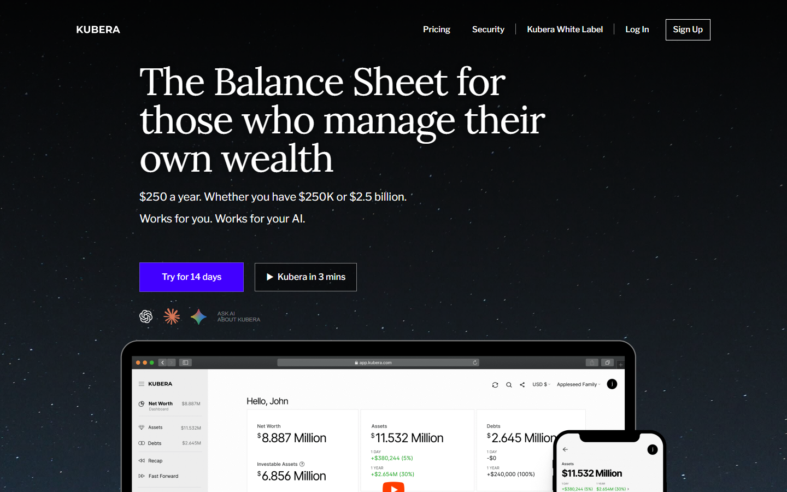
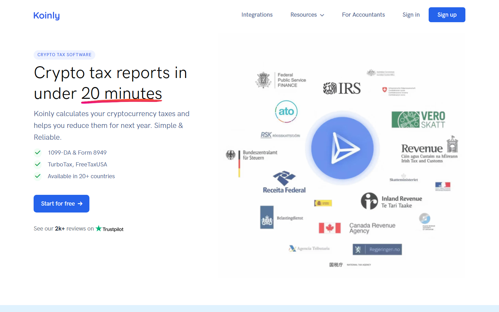

# Best Crypto Portfolio Trackers in 2026: 7 Tools Worth Using

The problem with most portfolio trackers is that they either try to do too much and end up breaking, or do too little and leave you typing transactions into a manual spreadsheet. When you connect five exchanges and ten wallets, you usually end up with broken API syncs, double-counted transfers, and missing tokens. 

This guide tested the leading options for setup friction, DeFi visibility, and sync stability. We compared the tools directly from a peer-to-peer perspective.

> Why you can trust this guide
>
> This article is based on live product pages and current public documentation reviewed in July 2026. We directly checked the public product surfaces, positioning, and supported workflow claims of the shortlisted tools. Where a claim still depends on a logged-in sync test, tax export, or full end-to-end portfolio import, we keep that limitation explicit instead of pretending it was fully verified.

**Quick take:** **Zerion/DeBank** for wallet-first portfolios, **CoinStats** for exchange plus wallet syncing, and **Koinly** for tax reporting.

## Quick comparison

Here is how the top tools shape up for different tracking needs:

| Tool | Best for | Main strength | Main tradeoff | Friction Score |
|---|---|---|---|---|
| **CoinStats** | All-around tracking | Broad exchange + wallet coverage | API syncs disconnect occasionally | 3/10 |
| **Delta** | Multi-asset investors | Clean traditional + crypto view | Weak DeFi protocol support | 5/10 |
| **Zerion** | Wallet-first DeFi users | Excellent mobile wallet tracking | No exchange API sync | 2/10 |
| **DeBank** | Onchain power users | Deep protocol and address intelligence | Friendly only for crypto-natives | 1/10 |
| **CoinGecko Portfolio** | Manual tracking | Simple, no connection required | No transaction syncing | 6/10 |
| **Kubera** | Full net-worth view | Combines traditional and crypto assets | Expensive for crypto-only use | 4/10 |
| **Koinly** | Tax reporting | Imports transactions and prepares tax reports | Reconciliation takes manual work | 7/10 |

The screenshots below show the public surfaces we could inspect without connecting accounts. Authenticated sync quality, tax exports, and account-level coverage still need a logged-in test.

*CoinStats homepage, July 2026 -- web interface showing direct wallet and exchange connection options before sign-in.*

---

## CoinStats

**Our pick for:** All-around portfolio management.

CoinStats is the most direct answer if you want to track exchange accounts and self-custody wallets in the same dashboard. It connects to over 70 wallets and exchanges, making it the most connected tool in this list. The interface is built to aggregate balances, monitor PnL, and set price alerts in one place.

* **Friction score:** 3/10. The initial connection is fast. But you will spend time fixing transaction labels if you move funds frequently.
* **Not recommended for:** Users who want zero sync maintenance or deep tax optimization.
On Reddit, a [r/CryptoCurrency thread about the CoinStats security incident](https://www.reddit.com/r/CryptoCurrency/comments/1dm903k/coinstats_app_hacked_sent_out_a_notification/) discussed an attack that targeted wallets created directly within CoinStats. CEX APIs and externally connected wallets were not impacted, but the discussion still highlighted the risk of using built-in software wallets instead of external self-custody options.

---

## Delta

**Our pick for:** Mainstream multi-asset investors.

Delta is the cleanest option if your crypto is just one part of a broader investment portfolio. Owned by eToro, Delta lets you track crypto, stocks, ETFs, and indices in the same app. The visual style is polished and prioritizes clean asset allocation over deep onchain data.

* **Friction score:** 5/10. Connecting major exchanges is straightforward. But if you have smaller tokens or use niche wallets, you will end up typing transactions manually.
* **Not recommended for:** Heavy DeFi users or onchain yield farmers.
On Reddit, an early [r/CryptoCurrency thread introducing Delta's desktop client](https://www.reddit.com/r/CryptoCurrency/comments/80naqt/delta_released_their_cryptocurrency_portofolio/) praised the visual polish but reported sync bugs where currency preferences such as GBP converted incorrectly during desktop transfers. Developers active on the thread resolved the issue, which gives Delta a useful record of responsive support.

*Delta by eToro homepage, July 2026 -- a landing screen built around tracking stocks and crypto in one portfolio.*

---

## Zerion

**Our pick for:** Wallet-first DeFi visibility.

Zerion is built for users who keep their funds in self-custody. You do not connect exchange APIs here; instead, you paste your EVM or Solana address, and the app reads the onchain data. The interface handles staking positions, NFT floors, and multichain assets cleanly.

* **Friction score:** 2/10. You just paste an address. No logins, no API keys, and no passwords required to view your public data.
* **Not recommended for:** Centralized exchange traders or users with legacy stock assets.
On Reddit, a [r/CryptoCurrency DeFi wallet breakdown](https://www.reddit.com/r/CryptoCurrency/comments/mdjsrj/defi_explained_defi_wallets/) pointed to Zerion as a useful interface for protocols such as Uniswap and Aave. Users also stressed the trade-off: keeping control of your keys removes a middleman, but leaves recovery-phrase responsibility with you.

*Zerion homepage, July 2026 -- a wallet explorer dashboard for multichain assets and DeFi positions.*

---

## DeBank

**Our pick for:** Onchain power users.

DeBank is the rawest and most powerful wallet explorer for DeFi. It tracks protocol positions across dozens of chains, showing exactly where your capital sits in lending pools, yield farms, and governance vaults. It is built for researchers and active onchain participants.

* **Friction score:** 1/10. Paste your address and you are done. The dashboard populates instantly.
* **Not recommended for:** Traditional finance tracking or heavy centralized exchange users.
On Reddit, a [r/DeFi discussion about portfolio trackers](https://www.reddit.com/r/defi/comments/1hl12kl/portfolio_trackers/) called DeBank "far and away the best DeFi portfolio tracker," while another user said it does not cover every pool. That split matches the live product impression: fast and deep for supported protocols, but not a complete accounting system.

*DeBank public homepage, July 2026 -- a wallet and DeFi analytics surface built around address-level positions rather than exchange accounts.*

---

## CoinGecko Portfolio

**Our pick for:** Lightweight manual tracking.

If you do not want to connect your wallets or exchanges to a third-party app, CoinGecko Portfolio is the most practical choice. You build watchlists, input your transaction prices manually, and track overall changes without sharing API keys or public addresses.

* **Friction score:** 6/10. You have to enter every trade yourself. If you trade daily, this is not a realistic workflow.
* **Not recommended for:** High-volume traders or users who want direct balance updates.

*CoinGecko support homepage, July 2026 -- the accessible support surface confirms where users can look for product help, but it does not prove portfolio sync behavior.*

The manual workflow is also the point Reddit users keep coming back to. In a [r/CryptoCurrency thread about CoinGecko portfolio performance](https://www.reddit.com/r/CryptoCurrency/comments/mzu02o/coingecko_portfolio_performance/), one user said the portfolio was easy to use but did not show enough information over time. Another used it mainly for a quick balance estimate, not a full performance record.

---

## Kubera

**Our pick for:** Broader net-worth context.

Kubera is a paid service built to track your entire net worth, including bank accounts, real estate, brokerage accounts, and crypto. It syncs with major banks via Plaid and connects to several crypto venues. The workflow makes more sense for a household balance sheet than for a wallet-only dashboard.

The useful distinction is refreshable coverage across different asset types. You can review cash, brokerage accounts, alternative assets, and crypto in one place, but that convenience depends on the quality of each account connection.

* **Friction score:** 4/10. Syncing traditional accounts takes a few minutes. Crypto wallet connections are simple but limited to major chains.
* **Not recommended for:** Active DeFi users who need real-time smart contract visibility.
On Reddit, the original poster in a [r/personalfinance thread about Kubera](https://www.reddit.com/r/personalfinance/comments/10t3i1k/anyone_using_kubera/) liked hitting refresh and having multiple aggregators populate the balance sheet, while commenters questioned the price. A separate [r/Fire comparison](https://www.reddit.com/r/Fire/comments/1i0lfbr/i_tried_every_net_worth_tracking_app_so_you_dont/) rated it good for alternative assets but limited for crypto, with sync issues as the main complaint.

*Kubera homepage, July 2026 -- a net-worth dashboard positioned across bank, brokerage, property, and crypto accounts.*

---

## Dedicated Tax Tools: Koinly

**Our pick for:** Tax-first reporting.

If your primary goal is tax filing and cost basis calculation, a dashboard tracker is rarely enough. Koinly is built specifically to import transaction history, reconcile transfers, and generate tax reports for multiple jurisdictions. It belongs at the end of the tracking stack, after your wallet and exchange history is complete.

The first pass is not glamorous: import the accounts, let Koinly match transfers, then inspect the exceptions. That extra review is where the tool earns its place, because an attractive dashboard cannot repair missing cost-basis data by itself.

* **Friction score:** 7/10. Normalizing years of cross-chain swaps and exchange withdrawals takes significant work. You will spend hours fixing missing purchase prices.
* **Not recommended for:** Daily portfolio monitoring or real-time price alerts.
On Reddit, users in a [r/ethereum comparison of crypto tax tools](https://www.reddit.com/r/ethereum/comments/1251rr6/koinly_vs_cointracker_vs_coinledger_whats_the/) described Koinly as their choice for Canadian taxes and said they liked the product, while still calling the price unpleasant. Another commenter said Koinly is stronger for international tax use, a useful distinction from US-focused alternatives.

*Koinly homepage, July 2026 -- tax software built around transaction imports, reconciliation, and reporting rather than live portfolio monitoring.*

---

## Risks to check before you connect

* **API Permissions:** When connecting centralized exchanges, always use read-only API keys. Never enable trade or withdrawal permissions.
* **Wallet Association:** Connecting all your self-custody wallets to a single tracker links those addresses in the tracker's database. If privacy is your priority, track addresses separately.
* **Cost Basis Drift:** Portfolio trackers show approximations. A missing transfer history can throw off your cost basis, meaning you should never trust a tracker's PnL page for final tax filing.

## Setup Recommendation

If you are setting up your tracking stack today, start simple:
1. Use **Zerion** or **DeBank** if your assets are mostly in metamask or phantom wallets.
2. Use **CoinStats** if you need to merge three exchange accounts and two wallets into one mobile dashboard.
3. Link a dedicated layer like **Koinly** at the end of the year to handle your tax calculations.

But here is what to watch for: every tracker becomes less trustworthy when transfers, bridges, or unsupported wallets enter the picture, so keep the original exchange exports and wallet history outside the app.

## FAQ

### Is a free crypto portfolio tracker safe?
Yes, most read-only trackers are safe because they do not have access to your private keys or withdrawal permissions.

### Why do my API syncs keep breaking?
Exchange APIs change regularly (such as Binance updating its endpoint security), which causes connections to fail until the tracker updates its integration.

### Can Zerion track my Binance balance?
No, Zerion is an onchain-only explorer. You will need a tool like CoinStats or Delta to track centralized exchanges.

## References

* [CoinStats Official Site](https://coinstats.app/)
* [Delta Investment Tracker](https://delta.app/en)
* [Zerion DeFi Wallet](https://zerion.io/)
* [DeBank Wallet Explorer](https://debank.com/)
* [CoinGecko Portfolio](https://www.coingecko.com/en/portfolio)
* [Kubera Net Worth Tracker](https://www.kubera.com/)
* [Koinly Crypto Tax](https://koinly.io/)
