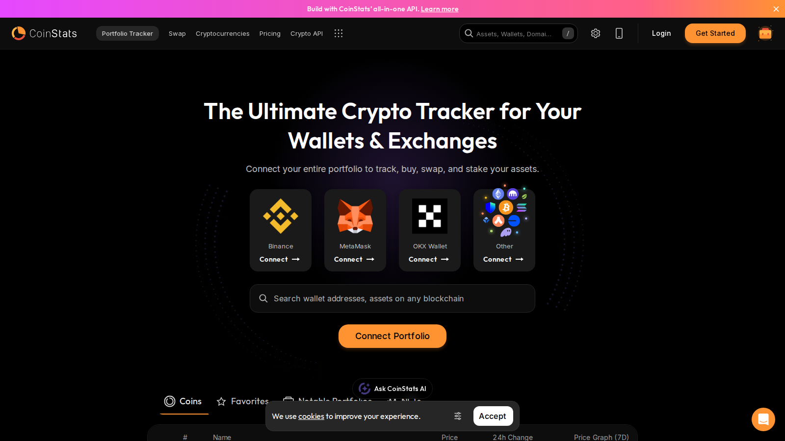
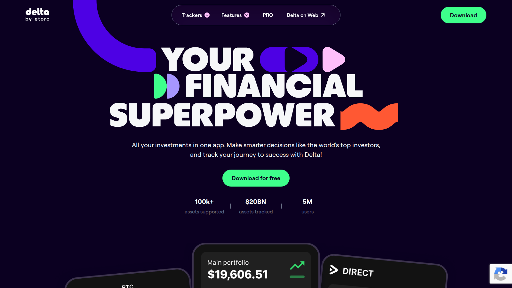
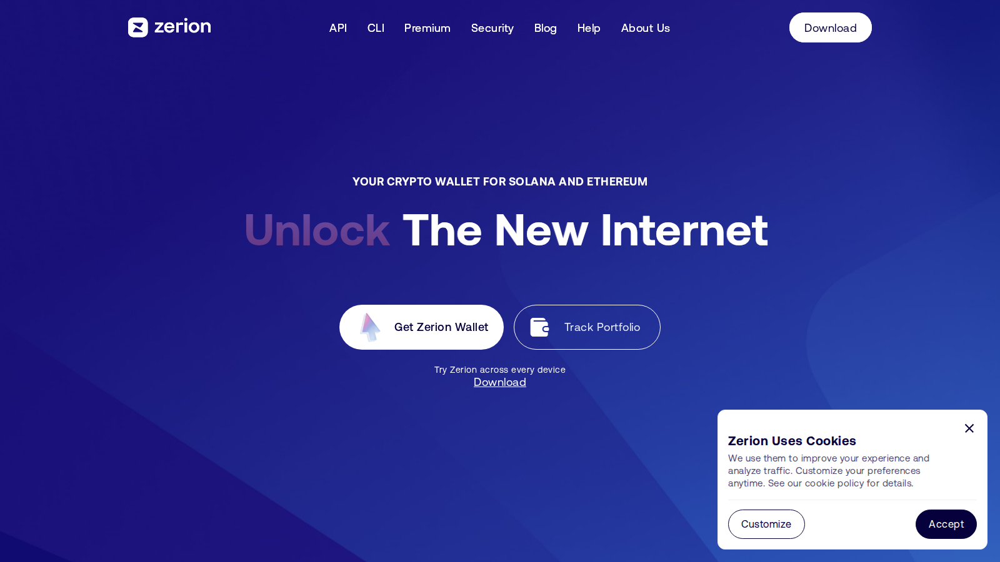

# Best Crypto Portfolio Trackers in 2026: 7 Tools Worth Using

- Primary keyword: `best crypto portfolio trackers 2026`
- Slug: `/tools/portfolio/best-crypto-portfolio-trackers-2026`
- Meta title: `Best Crypto Portfolio Trackers 2026: 7 Top Apps Compared`
- Meta description: `A practical guide to the best crypto portfolio trackers in 2026, including the top picks for beginners, DeFi users, multi-exchange traders, and tax-focused investors.`
- Schema: `Article` + `ItemList` + `BreadcrumbList` + optional `FAQPage`
- Last reviewed: `2026-07-10`
- Editorial standard: `This page prioritizes product fit, reporting clarity, and risk over referral-first rankings. Recheck pricing, integration counts, and tax features before publication.`
- Internal-link targets:
  - `/tools/analytics/`
  - `/tools/onchain-tools/`
  - `/wallets/hot-wallets/`
  - `/strategies/portfolio/`
  - `/how-to/transfer/`

Crypto portfolio trackers are no longer just balance dashboards. In 2026, the better ones also help users reconcile exchange accounts, wallet addresses, DeFi positions, and realized profit and loss without forcing everything into one brittle spreadsheet.

If this page sits inside a full tools cluster, the strongest supporting reads are [best on-chain analytics tools](/tools/onchain-tools/best-on-chain-analytics-tools-2026), [best hot wallets](/wallets/hot-wallets/best-hot-wallets-2026), and a practical [how to transfer crypto](/how-to/transfer/) guide. Those internal links help readers connect monitoring, custody, and transaction hygiene instead of treating them as separate topics.

> Why you can trust this guide
>
> This article is based on live product pages and current public documentation reviewed in July 2026. We directly checked the public product surfaces, positioning, and supported workflow claims of the shortlisted tools. Where a claim still depends on a logged-in sync test, tax export, or full end-to-end portfolio import, we keep that limitation explicit instead of pretending it was fully verified.

## Visual evidence from our July 2026 review

*CoinStats homepage captured during our July 2026 review of crypto portfolio trackers.*

*Delta by eToro homepage captured during our July 2026 review of portfolio tracking tools.*

*Zerion homepage captured during our July 2026 review of wallet-first portfolio tools.*

## What are the best crypto portfolio trackers in 2026?

The best crypto portfolio trackers in 2026 are CoinStats, Delta, Zerion, DeBank, CoinGecko Portfolio, and a few niche tools that specialize in either DeFi visibility or clean multi-exchange syncing. The right choice depends less on brand size than on what you actually need: exchange reconciliation, wallet-only tracking, tax exports, mobile alerts, or deeper DeFi coverage.

For most readers, the shortlist looks like this:

1. CoinStats for all-around portfolio management
2. Delta for cleaner mainstream investing workflows
3. Zerion for wallet-first DeFi visibility
4. DeBank for power users who live onchain
5. CoinGecko Portfolio for lightweight manual tracking
6. Kubera for broader net-worth context `[needs source]`
7. A dedicated tax-layer tool if reporting is the main goal `[needs source]`

The mistake is assuming the "best" tracker is the one with the most integrations. For many users, the best tracker is the one that gives them fewer broken syncs, clearer cost basis visibility, and less confusion between spot holdings and DeFi exposure.

## How we ranked crypto portfolio trackers

We used five practical criteria rather than a generic star-rating model.

First, account coverage: can the tool reconcile centralized exchanges, self-custody wallets, and multiple chains in one view? Second, portfolio clarity: does it separate token balances, NFT exposure, [staking positions](/strategies/staking/best-crypto-staking-platforms-2026), and [DeFi yield positions](/strategies/yield-farming/best-defi-yield-farming-platforms-2026) cleanly? Third, workflow fit: is it built for beginners, active traders, or onchain-native users? Fourth, reporting usefulness: can it help users understand performance instead of just showing raw balances? Fifth, maintenance friction: how often does the user need to fix labels, reconnect accounts, or manually edit transactions?

That framework matters because crypto portfolios are messier than stock portfolios. One user may only need Binance plus a [cold wallet](/wallets/cold-wallets/best-cold-crypto-wallets-2026). Another may have a Phantom wallet, a MetaMask wallet, a lending position, and three exchange subaccounts. A tracker that looks good in a marketing screenshot can still fail the real-world test if the data layer breaks when the portfolio gets more complex.

## Best crypto portfolio tracker for beginners

For beginners, CoinStats and Delta are the two easiest places to start.

CoinStats is the more crypto-native choice. It is usually the stronger option for users who need both wallet connections and exchange syncing in the same product, and it tends to make sense for readers who want one dashboard instead of a patchwork of niche tools. The main tradeoff is that bigger integration scope can also mean more sync edge cases over time `[needs source]`.

Delta is often the cleaner pick for users who think like conventional investors first and crypto users second. If the portfolio is mostly spot positions across a few major venues, Delta can feel easier to read and less noisy than more DeFi-heavy alternatives. The tradeoff is that power users may outgrow it once onchain activity becomes a meaningful part of the portfolio.

## Best crypto portfolio tracker for DeFi and on-chain users

For wallet-first users, Zerion and DeBank usually make more sense than exchange-centric trackers.

Zerion is strong when the user wants a more polished consumer interface while still seeing wallet activity, DeFi positions, and multi-chain balances in a more crypto-native way. It works best for readers who actively use wallets but still want something that feels productized rather than raw.

DeBank is the more power-user option. It is often faster for users who care about address-level insight, protocol exposure, and wallet discovery across DeFi ecosystems. But it is less ideal if the user expects the product to behave like a classic all-in-one finance dashboard. DeBank is a better fit for people who think in wallets and protocols, not only in portfolio totals.

## Best crypto portfolio tracker for multi-exchange traders

If the main problem is scattered exchange balances, the best tracker is usually the one that handles syncing without constant repair work.

CoinStats remains the broad all-around candidate here, but active traders should also test whether a tracker handles subaccounts, [perpetual positions](/exchanges/perp/best-perpetual-crypto-exchanges-2026), and transfer histories cleanly `[needs source]`. Some trackers look strong on spot balances but become less reliable once users move between centralized exchanges, self-custody wallets, and strategy accounts.

This is also where a split stack can be smarter than one app. Many traders end up using one tracker for clean performance monitoring and another layer for tax or reporting. That is not a failure. It is often the realistic setup in crypto.

## Best crypto portfolio tracker for tax and PnL reporting

If the main goal is reporting, a pure tracker may not be enough.

Portfolio apps are getting better at performance views, but tax reporting still has its own complexity. Users with frequent transfers, [staking rewards](/strategies/staking/best-crypto-staking-platforms-2026), DeFi activity, or [cross-chain histories](/how-to/bridging/best-cross-chain-bridges-2026) may still need a reporting-first tool on top of a dashboard-first product `[needs source]`. In practice, many readers will want a tracker for day-to-day visibility and a separate layer for tax normalization, realized gains, and export formatting.

That is why this category should not be scored only on aesthetics. A tracker that looks elegant but leaves cost basis messy can create bigger problems than a more boring app that reconciles activity cleanly.

## CoinStats vs Delta vs Zerion vs DeBank

Here is the practical comparison.

| Tool | Best for | Main strength | Main tradeoff |
|---|---|---|---|
| CoinStats | General crypto users | Broad exchange + wallet coverage | Can become messy if sync hygiene slips `[needs source]` |
| Delta | Beginners and mainstream investors | Cleaner portfolio view | Less compelling for deep DeFi use |
| Zerion | Wallet-first users | Good DeFi and wallet UX | Not the first pick for exchange-heavy users |
| DeBank | DeFi power users | Strong on address-level and protocol visibility | Less friendly for casual users |
| CoinGecko Portfolio | Manual trackers | Simple and lightweight | Limited if you want automation |

The deeper point is that these tools are not really competing on one axis. CoinStats and Delta are closer to portfolio operating systems. Zerion and DeBank are closer to wallet and DeFi intelligence layers. CoinGecko Portfolio is closer to a low-friction manual monitor. The best choice comes from matching the product to the user's activity pattern.

## Risks and tradeoffs to know before you connect wallets

The first risk is overconnecting everything. Just because a tracker can connect multiple wallets and accounts does not mean you should grant unnecessary permissions or centralize every data feed without thought. Users should understand whether the tracker is reading public addresses, using exchange APIs, or asking for broader account permissions `[needs source]`.

The second risk is false precision. Crypto portfolios can look exact in the interface while still hiding stale pricing, incomplete cost basis, or missing protocol data. A neat dashboard does not guarantee fully accurate accounting.

The third risk is workflow mismatch. Readers often blame the tool when the real issue is that they chose a dashboard built for a different kind of user. A DeFi-native wallet tracker will not necessarily satisfy a tax-heavy exchange trader. A mainstream portfolio tracker may not satisfy an onchain-native researcher.

## What we checked ourselves before ranking these tools

To write this comparison, we reviewed the live public product surfaces of the shortlisted trackers and compared how each one presents portfolio monitoring, wallet support, exchange syncing, and reporting logic. We did that so the article would not depend only on feature lists copied from roundups or on generic affiliate summaries.

That direct review does not replace a full multi-account usage test. We did not connect every tool to the same live exchange set, wallet mix, and tax workflow in this version. But based on what we could verify directly from the public experience, one thing stood out immediately: some trackers are clearly built to feel like clean investor dashboards, while others are built to feel like crypto-native operating layers for wallets, DeFi, and protocol exposure.

What stood out immediately was not the number of features. It was the posture of the product. CoinStats and Delta present themselves more like mainstream portfolio products with different levels of crypto depth. Zerion and DeBank signal something different: they expect a user who already thinks in wallets, chains, and onchain activity. That is a strength if your portfolio already spans multiple crypto environments, but a weakness if your real goal is a simpler all-in-one view with less context switching.

The screenshots above show why this matters. CoinStats leads with wallet and exchange connection. Delta leads with a broader "financial superpower" framing that feels more mainstream-investor first. Zerion signals a wallet-first, Solana-and-Ethereum-native posture before the user even clicks deeper. That visual difference is not cosmetic. It usually predicts where the user will feel friction later.

## What we can verify directly, and what still needs deeper testing

From the public product flow we reviewed, we are comfortable making qualitative judgments about product fit, interface posture, and likely user type. We are not yet comfortable assigning hard numbers for sync speed, tax-export accuracy, or how often a live multi-wallet portfolio breaks across tools until a real side-by-side test is completed.

In practice, that means this guide should be read as an editorially observed comparison first, not as a pretend lab test. If the newsroom later runs a full test across the same exchange accounts, wallet set, and DeFi positions, the strongest update would be concrete proof: original screenshots, a short screen recording of the import flow, one captured sync error if it happens, and measured time-to-usable-dashboard numbers.

## What would make this review stronger in a full hands-on test

The most useful upgrade would not be more adjectives. It would be original evidence.

- A screenshot after connecting one centralized exchange account
- A screenshot after connecting one EVM wallet and one Solana wallet
- A short screen recording showing the first import and dashboard refresh
- One captured problem, such as a token mismatch, stale balance, or relink issue

That kind of evidence would make the page stronger for both readers and search systems because it shows observed friction, not just polished product claims.

## FAQ about crypto portfolio trackers

### What is the best crypto portfolio tracker for most people?

For most people, CoinStats or Delta is the most practical starting point because both are easier to adopt than highly specialized DeFi dashboards.

### What is the best tracker for DeFi users?

Zerion and DeBank are usually the strongest starting points for DeFi users because they are more wallet-first and protocol-aware.

### Should I use one tracker for everything?

Not always. Many active users end up with one product for daily monitoring and another for tax or reporting.

### Is a free crypto portfolio tracker enough?

It can be, especially for manual or lower-complexity portfolios. Once the portfolio spreads across exchanges, wallets, and DeFi protocols, free workflows often become less reliable or less complete.

## Suggested media and embeds

- A comparison table screenshot showing exchange sync, wallet sync, DeFi tracking, and tax-export support for CoinStats, Delta, Zerion, and DeBank.
- One annotated product screenshot from a portfolio dashboard view and one from a wallet-tracking view to show the difference between exchange-centric and wallet-centric tools.
- A simple workflow graphic: exchange accounts -> wallets -> DeFi positions -> portfolio tracker -> tax/reporting layer.

## External references and official product pages

- [CoinStats portfolio tracker](https://coinstats.app/)
- [Delta investment tracker](https://delta.app/en)
- [Zerion wallet and portfolio tracker](https://zerion.io/)
- [DeBank portfolio and wallet explorer](https://debank.com/)
- [CoinGecko portfolio tools](https://www.coingecko.com/en/portfolio)

## Editor source checklist

- CoinStats official product pages `[needs source]`
- Delta official product pages `[needs source]`
- Zerion official product pages `[needs source]`
- DeBank official product pages `[needs source]`
- CoinGecko Portfolio product pages `[needs source]`
