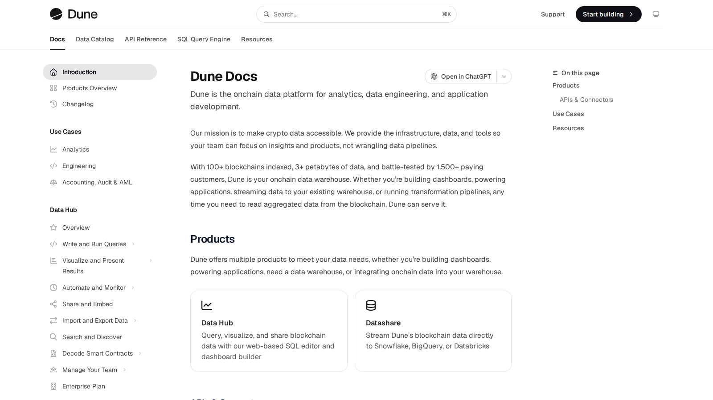
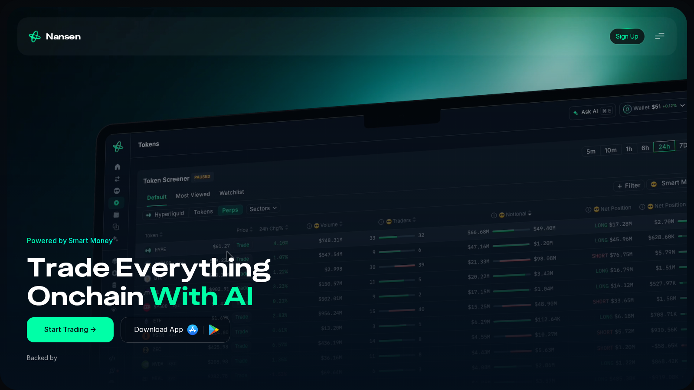
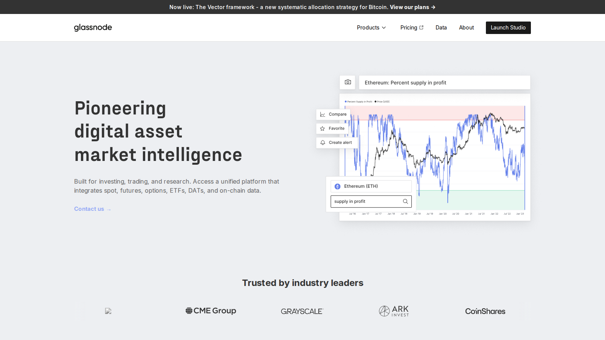
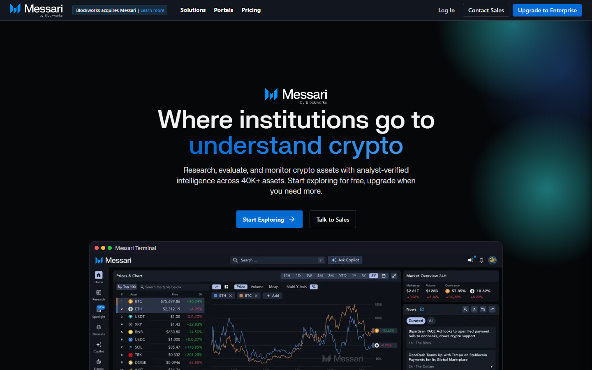

# Best On-Chain Analytics Tools in 2026 for Traders and Researchers

The problem with most onchain analytics tools is that they show you thousands of beautiful charts but leave you guessing what the data actually means. You can spend hours staring at exchange flows or active addresses, only to realize you are looking at raw wallet internal transfers rather than real market buying pressure.

This guide evaluated the top tools for data accuracy, setup friction, and analytical workflow. We compared them from a peer-to-peer researcher perspective.

> Why you can trust this guide
>
> This article is based on live product pages and current public documentation reviewed in July 2026. We directly reviewed the public product surfaces, workflow framing, and positioning of the shortlisted tools. Where a claim still depends on a paid tier, a logged-in workflow, or a deeper side-by-side test, we keep that limit explicit instead of pretending it was fully verified.

**Quick take:** **Dune** for open queries, **Arkham** for wallet investigation, and **Glassnode** for cycle-level market data.

## Quick comparison

Here is how the top tools shape up for different research workflows:

| Tool | Best for | Main strength | Main tradeoff | Friction Score |
|---|---|---|---|---|
| **Nansen** | Wallet intelligence | Labeled smart money flows | High subscription barrier | 4/10 |
| **Glassnode** | Macro market data | Clear institutional supply metrics | Less suited for individual coin tracking | 3/10 |
| **Dune** | Custom dashboards | Open SQL-based blockchain queries | Requires coding/SQL knowledge | 7/10 |
| **Arkham** | Wallet investigation | Entity-level transaction tracing | Focuses on raw data over research context | 1/10 |
| **Messari** | Fundamental research | Narrative reporting plus macro data | Expensive enterprise tiers | 4/10 |

The screenshots below show the public surfaces we could inspect without signing in. Paid dashboards, private queries, and authenticated wallet investigations still need a deeper account-level test.

*Dune documentation homepage, July 2026 -- showing data catalog and query reference guides for multichain analytics.*

---

## Nansen

**Our pick for:** Smart-money and labeled-wallet tracking.

Nansen is the industry standard for mapping out wallet ownership. Instead of looking at anonymous hex addresses, Nansen labels wallets based on behavior (like "Smart Money," "Flash Boys," or "VC funds"). This lets you track where early capital is moving before the rest of the market notices.

* **Friction score:** 4/10. Navigating the token flows is simple. But setting up custom smart-money alerts takes configuration.
* **Not recommended for:** Casual retail traders who do not actively monitor daily flows.
On Reddit, a [r/CryptoCurrency guide on spotting potential gems](https://www.reddit.com/r/CryptoCurrency/comments/n9cby0/not_every_new_coin_is_a_shitcoin_how_to_spot_the/) described Nansen's smart-money labels as useful for watching developer wallets and early holders. That is the practical advantage: labels turn an address list into a shortlist, but they still need a human check before you treat a wallet as a signal.

*Nansen homepage, July 2026 -- a wallet-intelligence surface focused on labeled flows and smart-money tracking.*

---

## Glassnode

**Our pick for:** Macro market structure.

Glassnode is built for cycle analysis and macro signals. It measures supply dynamics, miner behavior, and realized capitalization to help you determine if the market is in an accumulation or distribution phase. It is the tool you use to build a long-term investment thesis.

* **Friction score:** 3/10. Ready-made charts mean you do not have to write queries. But understanding the charts requires a background in economics.
* **Not recommended for:** Short-term traders looking for fast individual coin indicators.
On Reddit, a [r/CryptoCurrency post analyzing a market dip](https://www.reddit.com/r/CryptoCurrency/comments/lq32rh/psa_this_dip_was_most_likely_caused_by_a_3600_btc/) paired Glassnode and CryptoQuant miner-outflow data to explain a sudden correction. The useful lesson from that discussion is to read flows as context for price, not as a standalone buy or sell trigger.

*Glassnode homepage, July 2026 -- a market-intelligence surface built around supply metrics and cycle indicators.*

---

## Dune

**Our pick for:** Custom dashboards and open queries.

Dune lets you query raw blockchain data using SQL and turn it into custom dashboards. Because it is community-driven, you can find dashboards for almost any protocol, NFT project, or bridge flow for free. It is the most transparent data tool in crypto.

* **Friction score:** 7/10. Finding existing dashboards is simple. But building your own requires database knowledge and SQL coding.
* **Not recommended for:** Users who want prepackaged opinions without looking at the underlying queries.
On Reddit, a [r/CryptoCurrency list of educational resources](https://www.reddit.com/r/CryptoCurrency/comments/okyd1m/want_to_pursue_a_career_in_crypto_here_is_a/) recommended Dune as a practical way to learn onchain analysis. The user-facing benefit is easy to understand: you can inspect the query behind a chart instead of accepting a black-box metric.

---

## Arkham

**Our pick for:** Wallet-level investigation.

Arkham is a visualization platform that maps addresses to real-world entities. It is built like an investigative search engine, showing you the exact flow of funds between exchanges, known smart contracts, and individual wallets.

* **Friction score:** 1/10. Paste any address or search for a public entity (like an exchange or fund) and you get an instant graphic of their transactions.
* **Not recommended for:** High-level macro indicators or general market cycle analysis.
On Reddit, users tracking Satoshi's wallet balance pointed to [Arkham's entity-level dashboard](https://www.reddit.com/r/CryptoCurrency/comments/1nyy09z/satoshis_wallet_is_now_worth_over_135b_this_would/) for checking dormant addresses. That fits Arkham's role in this list, although its public site returned a Cloudflare challenge during our capture, so we did not treat the blocked page as visual evidence.

---

## Messari

**Our pick for:** Research-led market monitoring.

Messari combines fundamental data with research reports. It is the tool you use when you want to read a structured thesis on an ecosystem rotation, verify protocol revenue metrics, and track asset registries in the same workspace.

* **Friction score:** 4/10. The research feed is organized. But customizing the data screening tables requires setting up filters.
* **Not recommended for:** Raw wallet tracking or real-time mempool analysis.
On Reddit, users discussing research tools recommend Messari for governance tracking and structural reports, while warning that the most useful metrics sit behind premium annual pricing. That trade-off matters here: the public research layer is easy to inspect, but the paid workflow determines whether it replaces another data subscription.

*Messari homepage, July 2026 -- a research surface combining market data, asset profiles, and written analysis.*

---

## Common onchain analysis mistakes to avoid

* **Confusing internal transfers with sales:** Large transfers out of exchange wallets are often just the exchange rearranging its cold storage, not a whale preparing to sell.
* **Ignoring bridge volume context:** A spike in cross-chain bridge activity can reflect arbitrage bot loops rather than actual organic user interest.
* **Overestimating labeled wallets:** Labeled addresses are approximations. A wallet labeled as "Smart Money" can still make bad trades or lose key custody.

## Setup Recommendation

If you are building your research setup:
1. Start with **Dune** to find free, community-curated dashboards for specific protocols.
2. Use **Arkham** to trace individual wallets or watch exchange outflows.
3. Layer on **Glassnode** if you need cycle indicators to manage your macro portfolio allocation.

But here is what to watch for: no dashboard can tell you whether a wallet movement reflects a sale, internal exchange routing, or a bridge loop without context from the underlying transaction.

## FAQ

### Is Nansen worth the subscription cost?
Yes, but only if you manage enough capital to offset the premium tier price, or if you run a trading setup that actively executes based on smart-money flows.

### How does Dune get its data?
Dune ingests raw blockchain events, parses them into database tables, and exposes them via SQL query tools for analysts to build dashboards.

### Can Arkham identify who owns a wallet?
Arkham uses public database labeling and community submissions to associate addresses with entities, but many private wallets remain labeled only by algorithmic clustering behavior.

## References

* [Dune Official Site](https://dune.com/home)
* [Dune Documentation Portal](https://docs.dune.com/)
* [Nansen Blockchain Intelligence](https://www.nansen.ai/)
* [Glassnode Analytics](https://glassnode.com/)
* [Arkham Intelligence Platform](https://arkm.com/)
* [Messari Crypto Research](https://messari.io/)
