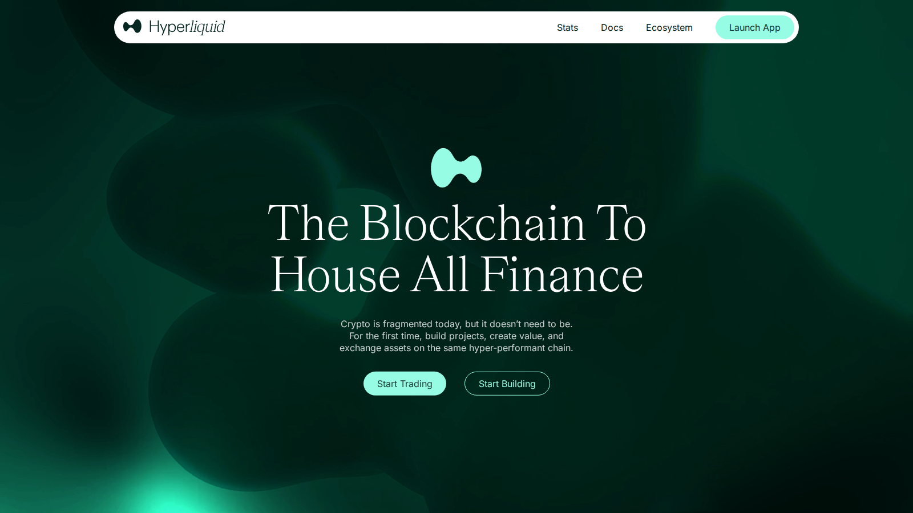
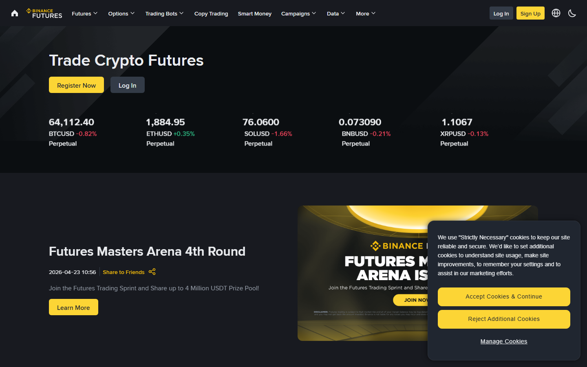
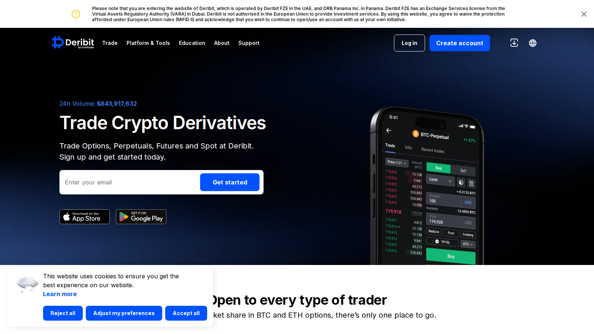

# Best Perpetual Crypto Exchanges in 2026: CEX and DEX Compared

The best perpetual crypto exchanges in 2026 are Hyperliquid, Binance Futures, Bybit, OKX, and Deribit. Hyperliquid is the strongest pick for self-custody perpetual trading on a dedicated L1 appchain. Binance Futures offers the deepest order books for professional-size volume. Deribit is the right choice for options-led hedging and institutional derivatives workflows.

| Platform | Outstanding point | Score | One-line note |
|---|---|---|---|
| Hyperliquid | Best self-custody perp DEX | 4.5/5 | Requires onchain wallet management and USDC deposit |
| Binance Futures | Deepest order books and global volume | 4/5 | Strict regional restrictions block US and UK traders |
| OKX | Best portfolio margin and API stability | 4/5 | Interface complexity is a real barrier for retail users |
| Bybit | Fastest altcoin perp listings | 3.5/5 | Promo clutter and copy-trading framing can mislead |
| Deribit | Best options and professional derivatives | 3.5/5 | Limited altcoin selection and dated retail interface |

## Ranking scorecard

Scored out of 10 per category. Total out of 70.

| Platform | Liquidity depth | Fee transparency | Execution speed | Margin flexibility | Asset coverage | Self-custody | Retail UX | **Total** |
|---|---|---|---|---|---|---|---|---|
| Hyperliquid | 7 | 9 | 9 | 7 | 6 | 10 | 6 | **54** |
| Binance Futures | 10 | 7 | 8 | 8 | 9 | 2 | 7 | **51** |
| OKX | 9 | 7 | 8 | 10 | 8 | 2 | 5 | **49** |
| Bybit | 8 | 6 | 7 | 7 | 9 | 2 | 6 | **45** |
| Deribit | 7 | 8 | 8 | 8 | 4 | 3 | 4 | **42** |

**Scoring notes.** Hyperliquid leads overall because it combines strong execution with full self-custody. Binance Futures remains unmatched on raw liquidity depth. Self-custody is weighted equally with execution metrics because custodial risk, as demonstrated by the Bybit incident covered below, is a real variable in platform selection.

The screenshots below show the public exchange surfaces we could inspect without connecting a wallet or placing an order. Funding, liquidation behavior, and live execution still need a funded test.

## 5 Best Perpetual Crypto Exchanges Reviewed (2026 List)

If you are still exploring the broader exchange landscape, you can compare these picks against our guides on [best on-chain analytics tools](/tools/onchain-tools/best-on-chain-analytics-tools-2026) or [best crypto portfolio trackers](/tools/portfolio/best-crypto-portfolio-trackers-2026).

*Hyperliquid public homepage, July 2026. Decentralized perp platform showing its custom L1 chain metrics and launch interface.*

---

### Hyperliquid

**Our pick for:** Decentralized perpetual trading.

Hyperliquid is a decentralized perp exchange built on its own dedicated Layer-1 appchain. It delivers execution speeds and fees that compete directly with centralized venues, but keeps custody in your own hands. You connect via a wallet, sign transactions locally, and trade with up to 50x leverage.

* **Friction score:** 3/10. Connecting an EVM wallet is instant. But you must deposit USDC into the L1 vault before you can place your first trade.
* **Not recommended for:** Traders who want fiat bank deposits or conventional phone support.
The execution pitch is credible. But the March 2025 JELLY exploit matters: a trader manipulated the liquidation engine on a low-cap memecoin, and validators voted to force-close positions to protect the protocol vault. That saved roughly $10 million, but a validator override is not meaningfully different from a centralized exchange halting trading. Hyperliquid tightened margin requirements afterward. Treat "decentralized" as a design goal, not a guarantee.

On Reddit, traders discussing [CryptoCurrency Reddit thread on Hyperliquid's custom L1 perp DEX](https://www.reddit.com/r/CryptoCurrency/comments/182k6t1/hyperliquid_arbitrum_dex_with_own_l1_chain_for_perpetuals/) praised the low-fee trading experience. The pushback was more practical: chasing protocol points can turn a venue advantage into over-trading if you create volume only for rewards.

---

### Binance Futures

**Our pick for:** Deep liquidity and professional-size volume.

Binance Futures remains one of the deepest crypto derivatives venues by trading volume. The platform offers deep order books and low slippage for large account sizes, although exact depth changes by contract and market conditions. It offers high leverage on major assets and supports multiple collateral types.

* **Friction score:** 2/10. The trading engine handles high volume easily. But passing mandatory KYC checks can take several hours depending on your region.
* **Not recommended for:** Traders in restricted jurisdictions like the US or UK where derivatives access is blocked.
In January 2026, Binance adjusted its funding rate settlement from hourly to every four hours when rates stayed below 0.025% for 16 consecutive periods. That change matters if you run funding-rate arbitrage strategies, because your carry income becomes lumpier and less predictable.

A separate BROCCOLI714 anomaly showed how Binance's circuit breakers can cap futures prices while spot surges, creating divergence that punishes anyone relying on the futures price as a real-time signal. Depth is real here, but it does not eliminate execution risk.

On Reddit, a [CryptoCurrency Reddit thread on Binance Futures API latency](https://www.reddit.com/r/CryptoCurrency/comments/12ec6v4/binance_futures_api_delays_during_high_volatility/) described execution delays during major liquidation events. Traders suggested WebSocket feeds and local stop-loss handling, which is a reminder that deep liquidity does not remove API risk.

*Binance Futures homepage, July 2026. A public derivatives surface centered on futures markets, contract discovery, and account entry points.*

---

### Bybit

**Our pick for:** Active altcoin perp trading.

Bybit is built specifically for active derivatives traders. It features a responsive web interface, high leverage caps, and listing speeds that bring new altcoin perpetuals to market faster than most centralized rivals. It also offers copy trading and grid bot options.

* **Friction score:** 4/10. Account creation is simple. But the mobile app and website display constant promo banners that can clutter the workspace.
* **Not recommended for:** Long-term spot investors who prefer a clean, minimal interface.
On February 21, 2025, North Korea's Lazarus Group stole approximately $1.5 billion in Ethereum from Bybit's cold wallet infrastructure in the largest crypto exchange hack in history. Bybit's response was fast: CEO Ben Zhou went live within hours, withdrawals continued processing, and the exchange closed its ETH deficit within 72 hours. By Q2 2025, derivatives market share had rebounded to approximately 21%.

The recovery was genuine, but the incident is a concrete reminder that custodial exchange risk is not theoretical. If you trade on Bybit, keep only your active trading margin on the platform and treat cold storage as a separate workflow.

On Reddit, users in [CryptoCurrency Reddit thread on Bybit leverage trading](https://www.reddit.com/r/CryptoCurrency/comments/10pky76/is_bybit_safe_for_leverage_trading_what_are_the_fees/) recommended Bybit for its leverage limits and altcoin selection. Others warned that copy-trading pages can foreground profitable periods while hiding the drawdowns that matter more to risk management. Bybit's public routes returned a network error during our capture, so this section has no screenshot evidence.

---

### OKX

**Our pick for:** Advanced margin accounts and API trading.

OKX is highly regarded by algorithmic traders for its API stability and unified account structure. Its Portfolio Margin mode lets you offset risk between futures, options, and spot positions under a single collateral pool, optimizing capital efficiency.

* **Friction score:** 3/10. API key setup is well-documented. But setting up portfolio margin requires a high minimum balance and passing a risk assessment.
* **Not recommended for:** Beginners who want simple buy and sell screens without learning margin mechanics.
OKX's regulatory profile changed substantially in 2025-2026: MiCA license for all 30 EU countries, a $500 million DOJ settlement for legacy AML violations, US re-entry through a San Jose entity, and a $25 billion valuation from Intercontinental Exchange (NYSE's parent) in March 2026. That does not make the interface simpler, but it does change the counterparty profile.

The portfolio margin system now merges perpetuals, expiry futures, and options into a single risk unit, with spot assets included automatically. For hedged strategies, that reduces margin drag meaningfully. The trade-off is that margin calculation is more complex, and a stablecoin depeg event could create unexpected cross-exposure.

On Reddit, users comparing OKX with Binance in a [CryptoCurrency Reddit thread on protocol analysis](https://www.reddit.com/r/CryptoCurrency/comments/n9cby0/not_every_new_coin_is_a_shitcoin_how_to_spot_the/) described the OKX interface as stable during network congestion. The trade-off they mentioned was a steeper mobile learning curve.

*OKX public homepage, July 2026. An exchange surface linking derivatives markets with unified account and portfolio-margin options.*

---

### Deribit

**Our pick for:** Options and professional derivatives.

Deribit is a leading venue for Bitcoin and Ethereum options, and its perpetual futures are also credible. It is built for professional traders who hedge option positions with futures and need a tightly specified execution environment.

* **Friction score:** 5/10. The platform is designed for professional software like Coinigy. Setting up retail charts directly in the browser can feel dated.
* **Not recommended for:** Casual altcoin traders looking for trendy listings or social copy-trading tools.
Coinbase closed its $2.9 billion acquisition of Deribit in August 2025, making it a subsidiary of a US-listed company. That changes the counterparty calculus for institutional traders. Deribit still holds roughly 85% of global crypto options open interest, although its volume share has declined as competitors like IBIT options have grown.

For perpetual traders, the honest read is that Deribit's perp product is credible but secondary to its options franchise. The interface reflects that priority: options tools are first-class, the perpetual surface is functional but not polished.

On Reddit, traders welcomed the zero-fee USD options discussed in a [CryptoCurrency Reddit thread on Deribit zero-fee options](https://www.reddit.com/r/CryptoCurrency/comments/131l9v6/deribit_introduces_zero_fee_trading_for_bitcoin_and/). The more important user warning was about margin: strict requirements make liquidations abrupt when a hedge moves against you.

*Deribit homepage, July 2026. A derivatives venue showing options, futures, and market-data entry points.*

---

## Critical risks of perpetual futures trading

* **Funding Rate spikes:** Funding fees are paid every few hours. In a bull market, long traders pay short traders, and high funding rates can quickly eat your margin balance.
* **Liquidation cascades:** If the price hits your liquidation threshold, the exchange automatically sells your position to protect its own capital, often triggering a chain reaction of drops.
* **API execution lag:** Centralized exchanges can experience API delays during extreme market moves, meaning your market close order may execute much lower than the price shown on screen.

## Setup Recommendation

If you are setting up your perpetual trading stack:
1. Use **Hyperliquid** if you want to trade directly from a self-custody EVM wallet on an onchain DEX.
2. Use **OKX** or **Binance** if you need deep order books for larger trade sizes and want unified portfolio margin.
3. Keep a separate, unconnected wallet for your long-term spot holdings to ensure your trading margin remains isolated.

But here is what to watch for: the best venue on paper can still be the wrong venue once regional access, funding costs, API reliability, and liquidation rules meet your actual trading size.

## What we checked ourselves before ranking these exchanges

We reviewed the live public trading surfaces, fee structures, and margin options of the shortlisted exchanges. This does not replace a funded trading test with real order placement and liquidation verification.

## What this review verified and what it did not

| Claim | Status |
|---|---|
| Hyperliquid public homepage and L1 metrics reviewed | Verified |
| Binance Futures public homepage and contract discovery reviewed | Verified |
| OKX public homepage and portfolio margin positioning reviewed | Verified |
| Deribit public homepage and options surface reviewed | Verified |
| Bybit public trading surface reviewed (network error during capture) | Partially verified |
| Live order placed on any platform | Not verified |
| Funding rate accuracy compared across platforms | Not verified |
| Liquidation engine behavior tested under volatility | Not verified |
| API latency benchmarked across venues | Not verified |

## FAQ

### What is a funding rate in perpetual trading?
A funding rate is a periodic payment between long and short traders designed to keep the perpetual price aligned with the spot index price.

### Can I trade perpetuals without KYC?
Decentralized platforms like Hyperliquid only require wallet connection, whereas all major centralized exchanges require identity verification before enabling futures trading.

### What is portfolio margin?
Portfolio margin is an account type that evaluates your risk across spot, futures, and options together, allowing you to use profitable positions to offset margin requirements for open trades.

## References

* [CoinGecko Perpetual Report 2026](https://www.coingecko.com/research/publications/state-of-crypto-perpetuals-report-2026)
* [Hyperliquid App](https://hyperliquid.xyz/)
* [Binance Futures Platform](https://www.binance.com/en/futures/home)
* [Bybit Trading](https://www.bybit.com/)
* [OKX Derivatives](https://www.okx.com/)
* [Deribit Exchange](https://www.deribit.com/)
