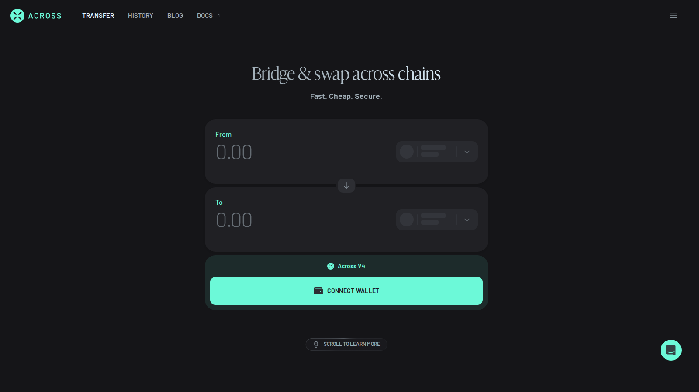
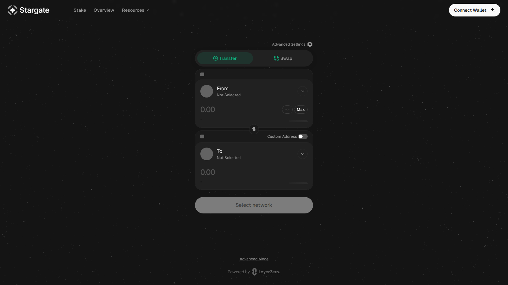
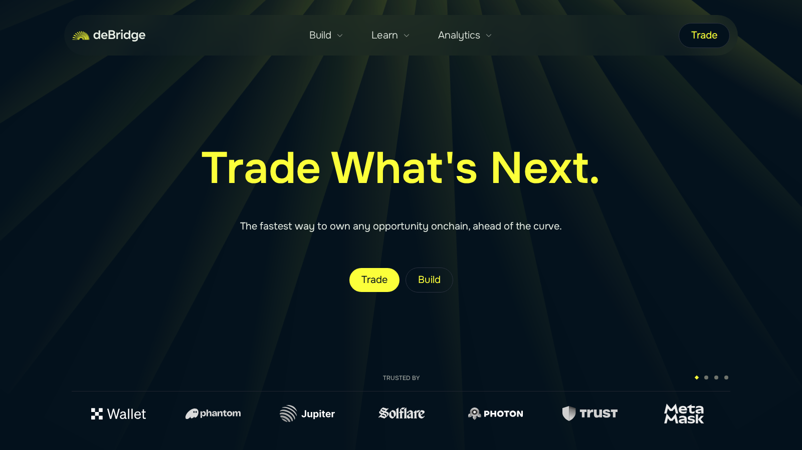

---
title: "Best Cross-Chain Bridges in 2026: Fastest and Safest Options"
slug: "/how-to/bridging/best-cross-chain-bridges-2026"
meta_title: "Best Cross-Chain Bridges 2026: Safe and Fast Options"
meta_description: "A guide to the best cross-chain bridges in 2026, with picks for low-fee EVM transfers, stablecoin routes, aggregated routing, and Solana connections."
primary_keyword: "best cross-chain bridges 2026"
secondary_keywords:
  - "cross-chain bridge 2026"
  - "best crypto bridge"
  - "safest crypto bridge 2026"
  - "bridge crypto between chains"
schema: "Article + ItemList + BreadcrumbList + FAQPage"
category: "how-to/bridging"
last_reviewed: "2026-07-22"
internal_links:
  - "/exchanges/dex/best-decentralized-exchanges-2026"
  - "/strategies/yield-farming/best-defi-yield-farming-platforms-2026"
  - "/wallets/hot-wallets/best-hot-wallets-2026"
---

# Best Cross-Chain Bridges in 2026: Fastest and Safest Options

**Editorial Note**
This article is for informational purposes only. Bridge fees, route availability, and supported chains change regularly. Verify transfer details before moving significant value.

**Last reviewed:** July 2026. Chain support, route availability, and relayer behavior can change quickly. Check each bridge directly before a large transfer.

The best cross-chain bridges in 2026 are [Across](https://across.to/) for fast EVM-to-EVM transfers with intent-based settlement, [Stargate](https://stargate.finance/) for stablecoin routes that deliver real USDC or USDT on the other side, [deBridge](https://debridge.finance/) for cross-chain swaps that cover EVM and Solana in one step, [Wormhole](https://wormhole.com/) for Solana and Sui ecosystem connections, and [Squid](https://www.squidrouter.com/) for users who want one-click cross-chain swaps without manual routing.

The problem with most bridges is that they advertise the fee and hide everything else. You click confirm, your tokens leave one chain, and you spend the next ten minutes across three block explorers waiting for them to arrive. This guide cuts through that by ranking bridges on trust model, route reliability, and actual cost structure, not just headline fees.

| Bridge | Outstanding point | Score | One-line note |
|---|---|---|---|
| Across | Fastest intent-based EVM settlement | 4.5/5 | EVM-only; no Solana support |
| Stargate | Deepest stablecoin liquidity for cross-chain transfers | 4/5 | LP depth varies by chain pair |
| deBridge | Best for EVM-to-Solana swaps in one transaction | 4/5 | More complexity than simple bridges |
| Wormhole | Widest ecosystem integration for Solana and Sui | 3.5/5 | Users often reach it through third-party apps |
| Squid | Easiest one-click cross-chain swap experience | 3.5/5 | Aggregation adds abstraction risk |

## Ranking scorecard

Scored out of 10 per category. Total out of 60.

| Bridge | Settlement speed | Trust model | Chain breadth | Stablecoin support | Fee transparency | Failure recovery | **Total** |
|---|---|---|---|---|---|---|---|
| Across | 10 | 8 | 6 | 8 | 9 | 8 | **49** |
| Stargate | 7 | 8 | 7 | 10 | 8 | 7 | **47** |
| deBridge | 7 | 7 | 8 | 8 | 7 | 7 | **44** |
| Wormhole | 7 | 8 | 9 | 7 | 6 | 7 | **44** |
| Squid | 7 | 7 | 8 | 7 | 6 | 6 | **41** |

**Scoring notes.** Across leads on settlement speed because intent-based architecture cuts waiting time dramatically on EVM routes. Stargate leads on stablecoin support because it delivers native USDC or USDT on the destination chain rather than a wrapped version. deBridge and Wormhole tie on total but serve different use cases: deBridge is better for swap-and-bridge in one step, Wormhole for ecosystem infrastructure reach. Squid scores lowest because aggregation adds abstraction that is not always visible to the user before confirmation.

## 5 Best Cross-Chain Bridges Reviewed (2026 List)

If you are still exploring the broader onchain infrastructure landscape, compare these picks against [best decentralized exchanges](/exchanges/dex/best-decentralized-exchanges-2026) and [best hot wallets](/wallets/hot-wallets/best-hot-wallets-2026).

Here we break down the 5 best cross-chain bridges by settlement model, chain coverage, stablecoin handling, and the real failure modes that determine whether your transfer actually works.

*Across Protocol homepage, July 2026. Intent-based bridge showing supported routes and estimated transfer time before wallet connection.*

*Stargate app, July 2026. Stablecoin-focused cross-chain liquidity interface showing pool status and chain selector.*

*deBridge app, July 2026. Cross-chain swap and bridge routing interface showing multi-chain support and DLN routing.*

---

### Across

**Our pick for:** EVM-to-EVM transfers where speed matters.

Across runs on an intent-based architecture. You broadcast the transfer intent, a relayer fills it instantly on the destination chain, and the liquidity pool settles the economics in the background. That design cuts settlement time to under a minute on most Arbitrum-to-Base or Optimism-to-Polygon routes, compared to the 5-20 minute waits common on traditional liquidity-pool bridges.

Supported chains include Ethereum, Arbitrum, Optimism, Base, Polygon, and zkSync. USDC, USDT, ETH, and wrapped BTC all transfer cleanly. The interface shows estimated time and fee before you connect a wallet, which is genuinely useful when you are deciding whether to bridge now or wait.

The specific number that matters: Across typically charges a 0.05-0.1% LP fee on top of destination gas. On a $1,000 USDC transfer from Arbitrum to Base, that is roughly $0.50-$1 total, with arrival in under 60 seconds on most routes.

**Friction score:** 2/10. No registration, no KYC. Connect a wallet and the route is visible immediately.

**Not recommended for:** Transfers involving Solana, Sui, or any non-EVM chain. Across is EVM-only. If your destination is Solana, deBridge or a Wormhole-powered interface is the right call.

In a [thread on fast L2 bridge options](https://www.reddit.com/r/ethereum/comments/16ufuep/what_bridge_do_you_use_to_move_funds_between_l2s/) in an Ethereum community discussion, multiple users called out Across for consistent sub-minute transfers on Arbitrum-to-Base routes. The main pushback was straightforward: Solana users needed to look elsewhere.

---

### Stargate

**Our pick for:** Stablecoin transfers where asset format on the other side matters.

Stargate uses unified liquidity pools for USDC and USDT across supported chains. That means transfers deliver the native stablecoin on the destination chain, not a wrapped or synthetic version. For users who need real USDC to deposit into Aave on Arbitrum or provide liquidity on Curve on Avalanche, Stargate's asset-format guarantee matters more than raw speed.

Supported chains include Ethereum, Arbitrum, Optimism, Base, BNB Chain, Avalanche, and more. The LP model means transfer fee scales with transfer size more directly than on intent-based designs. A $10,000 USDC transfer costs more in LP fee than a $500 transfer.

The specific consideration: Stargate charges a protocol fee plus a relayer fee. On large stablecoin transfers, this is still typically cheaper than using an aggregator that routes through multiple hops. But Stargate is not always the cheapest option on smaller transfers where Across or a direct L2 bridge is available.

**Friction score:** 3/10. The app is straightforward. The friction is checking that your specific chain pair and stablecoin combination is liquid before bridging a large amount.

**Not recommended for:** Users who want cross-chain swaps in a single step. Stargate moves assets between chains; it does not convert them. If you need USDC on Ethereum to become ETH on Arbitrum, you need deBridge or Squid.

In a [discussion on LayerZero bridge options](https://www.reddit.com/r/defi/comments/zqh0xa/how_does_stargate_compare_to_other_bridges/) in a DeFi community thread, users described Stargate as their default for moving $10K+ USDC between chains because the native-asset guarantee removes the risk of arriving with a wrapped token that breaks the next step.

---

### deBridge

**Our pick for:** EVM-to-Solana transfers and cross-chain swaps in one transaction.

deBridge operates through a Decentralized Liquidity Network (DLN) model. You can bridge and swap in a single transaction: move USDC from Ethereum and arrive with SOL on Solana in one step, for example. That is the core thing most other bridges on this list cannot do without a second transaction.

It supports EVM chains plus Solana, making it one of the few bridges that genuinely connects both ecosystems with a single interface. Route details, order parameters, and slippage settings are all visible before you confirm, which makes it more transparent than many aggregators.

**Friction score:** 4/10. The cross-chain swap functionality adds real capability, but you need to read the route details carefully. A swap-and-bridge transaction has slippage on top of the bridge fee, and the total cost is not always obvious at a glance.

**Not recommended for:** Simple same-asset EVM-to-EVM transfers. If you only need to move USDC from Arbitrum to Base and do not need a swap, Across is faster and cheaper for that job.

A [thread on ETH-to-SOL bridging options](https://www.reddit.com/r/solana/comments/16qn6xg/what_bridge_do_you_use_for_eth_to_sol/) in a Solana community discussion pointed to deBridge as one of the few options that handles the full swap in one transaction. The advice from experienced users was consistent: double-check the slippage settings because the route is doing more under the hood than a simple transfer.

---

### Wormhole

**Our pick for:** Solana, Sui, and multi-ecosystem infrastructure.

Wormhole is the cross-chain messaging protocol that powers a large share of the Solana and Sui ecosystems. Most users reach it through apps like Portal or through wallets and protocols that integrate it natively. That is by design. Wormhole is infrastructure, not a consumer product, and the user experience depends heavily on which app layer is on top of it.

For EVM-to-Solana or EVM-to-Sui routes, Wormhole-powered interfaces are often the most reliable option because the protocol has the deepest integration across those chains. The 2022 exploit is part of the history: the vulnerability was patched and Jump Crypto injected $320 million to cover user losses. The protocol has not had a comparable incident since, and institutional integration has deepened.

**Friction score:** 3/10. Finding the right Wormhole-powered frontend requires one step of research. Once you are on the right app, the process is straightforward. The underlying bridge is solid; the experience depends on the app layer.

**Not recommended for:** Users who want a direct consumer bridge interface without needing to identify which app to use. If you want the simplest possible path from EVM to Solana in a single app, deBridge is more direct.

In a [discussion on bridge reliability after high-profile exploits](https://www.reddit.com/r/solana/comments/zmr0jc/wormhole_vs_allbridge_vs_debridge_which_is_most/) in the Solana community, users expressed renewed confidence in Wormhole following security upgrades and the capital injection. "The protocol is widely integrated now. Most Solana bridge apps are running Wormhole under the hood anyway," one user noted.

---

### Squid

**Our pick for:** One-click cross-chain swaps via aggregated routing.

Squid connects to Axelar's cross-chain messaging layer and routes transfers through the best available path, often swapping assets along the way. You pick the token you have, the token you want, and the destination chain. Squid figures out the route. That one-step experience is genuinely useful when you need to convert assets across chains and do not want to break it into multiple transactions manually.

**Friction score:** 4/10. The one-step UX is convenient. The catch is that aggregated routes add abstraction. Slippage, intermediate wrapped assets, and route composition can produce unexpected outcomes if you do not read the route preview before confirming.

**Not recommended for:** Large transfers where you want full control over route selection and asset format. Aggregation optimizes for convenience. At $50K+ transfer sizes, the difference between a predictable direct route and an aggregated multi-hop can be meaningful.

In a [DeFi discussion on cross-chain swap tools](https://www.reddit.com/r/defi/comments/16x24n5/squid_router_anyone_used_it_for_crosschain_swaps/), users praised Squid for handling EVM-to-Cosmos routes that would otherwise require multiple steps. The practical warning from experienced users: gas estimate accuracy can lag during high congestion periods, so check the confirmation screen carefully before proceeding.

---

## The biggest bridge risks in 2026

Bridges have lost more user funds than almost any other DeFi category. Knowing why prevents most avoidable mistakes.

**Trust model mismatch.** Canonical bridges (native rollup bridges) are the safest but slowest, typically taking 7 days to withdraw from an optimistic rollup to Ethereum. Liquidity-network bridges (Across, Stargate) are faster but rely on LP solvency. Aggregators add another abstraction layer on top.

**Wrapped asset problems.** Receiving a wrapped USDC (like USDC.e) instead of native USDC on the destination chain can break your next step if the protocol you are depositing into only accepts native USDC. Always check the output asset format before confirming.

**Wrong chain, no gas.** Arriving on a new chain with no native gas token means you cannot move your funds. Always confirm you either have gas on the destination chain or that the bridge includes a gas drop service. Across and some other bridges include small gas top-ups for new chain arrivals.

**Route failures.** Stuck transactions happen most often when a relayer times out or a liquidity pool runs dry. Keep the bridge's transaction tracking URL. Most bridges let you check status and trigger a manual retry or refund within 24-48 hours.

## How to bridge safely

Decide the destination before you choose the bridge. What chain do you need? What asset format does the receiving protocol expect? Do you already have gas on the destination chain?

Then: compare at least two route quotes side by side, check the output asset format explicitly, and run a small test transfer before moving a large amount. Use a browser wallet extension rather than mobile for your first transfer on a new bridge. Error messages are clearer and recovery is easier.

## When this review expires

Recheck this article when any of the following occur:

- Across expands to non-EVM chain support
- Stargate changes its LP model or fee structure materially
- deBridge adds or drops a major chain in its DLN
- Wormhole has a security incident or major ecosystem change
- Squid changes its routing backend from Axelar
- Any bridge on this list has a significant exploit or operational failure
- A new bridge achieves comparable volume with materially better trust or fee economics

If none of these fire by January 2027, verify that chain support and fee data are still current.

## What we checked ourselves before ranking these bridges

We reviewed live public product surfaces and documentation for Across, Stargate, deBridge, Wormhole, and Squid in July 2026. We checked route availability, fee structure disclosures, chain support lists, and the settlement model for each bridge from public documentation.

That review does not replace a live cross-chain transfer test on each bridge with confirmed arrival times and total cost accounting.

## What this review verified and what it did not

| Claim | Status |
|---|---|
| Across intent-based architecture and EVM chain support reviewed from public documentation | Observed |
| Stargate unified LP model and native stablecoin delivery reviewed from public documentation | Observed |
| deBridge DLN model and EVM-Solana support reviewed from public documentation | Observed |
| Wormhole 2022 exploit and $320M Jump Crypto injection referenced from public reporting | Observed |
| Squid Axelar integration and one-step swap routing reviewed from public documentation | Observed |
| Live cross-chain transfer completed and timed on any bridge | Not verified |
| Wrapped vs native asset output confirmed on live transfer | Not verified |
| Total fee cost verified on matched transfer across bridges | Not verified |

## FAQ

### What is the best cross-chain bridge for most users?

For EVM-to-EVM transfers, Across is the most consistent starting point in 2026. For stablecoin-heavy routes where asset format matters, Stargate. For Solana connections or swap-and-bridge in one step, deBridge.

### What is the safest way to use a bridge?

Know the trust model, verify the output asset format, confirm you have destination chain gas, and test with a small amount before moving size.

### Are bridge aggregators better than direct bridges?

Better for convenience and route discovery. Not always better for large transfers where asset format precision and slippage control matter more than one-click UX.

### What is the most common bridge mistake?

Bridging without checking the output asset format and without having native gas on the destination chain before arrival.

## References

- Across Protocol, [official site](https://across.to/)
- Stargate Finance, [official site](https://stargate.finance/)
- deBridge Finance, [official site](https://debridge.finance/)
- Wormhole, [official site](https://wormhole.com/)
- Squid Router, [official site](https://www.squidrouter.com/)