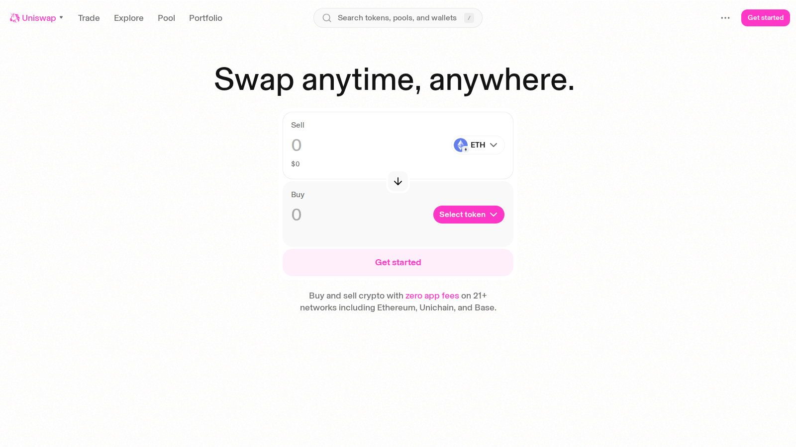
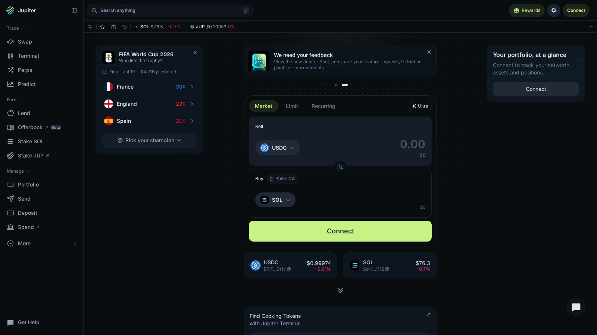
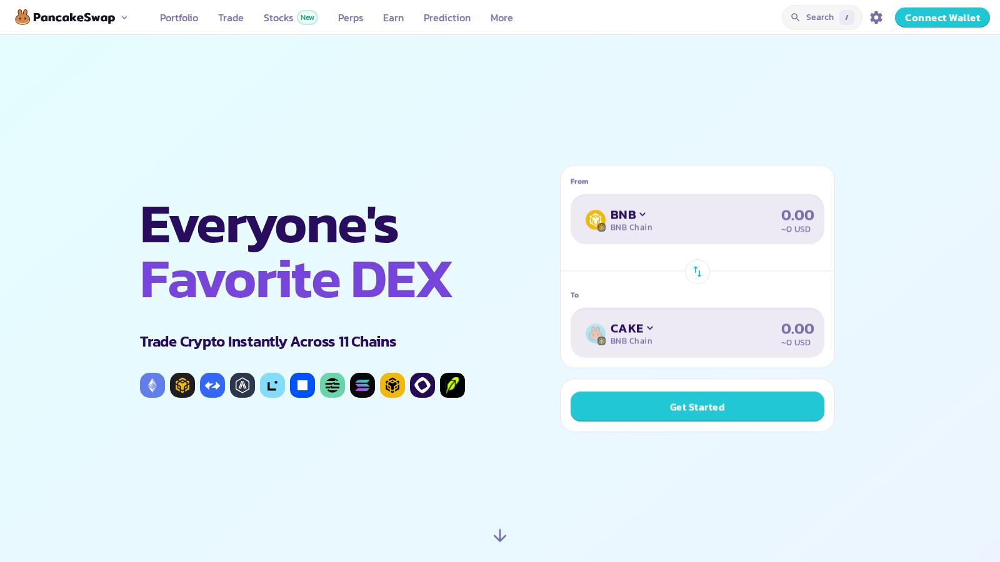

---
title: "Best Decentralized Exchanges in 2026 for Swaps, Perps, and Yield"
slug: "/exchanges/dex/best-decentralized-exchanges-2026"
meta_title: "Best Decentralized Exchanges 2026: Top DEXs Compared"
meta_description: "A guide to the best decentralized exchanges in 2026, including the top DEXs for swaps, Solana users, decentralized perps, and stablecoin-heavy trading."
primary_keyword: "best decentralized exchanges 2026"
secondary_keywords:
  - "best DEX 2026"
  - "top decentralized exchange"
  - "best Solana DEX"
  - "decentralized perps 2026"
schema: "Article + ItemList + BreadcrumbList + FAQPage"
category: "exchanges/dex"
last_reviewed: "2026-07-24"
internal_links:
  - "/exchanges/centralized/best-crypto-exchanges-2026"
  - "/exchanges/perp/best-perpetual-crypto-exchanges-2026"
  - "/wallets/hot-wallets/best-hot-wallets-2026"
  - "/how-to/buy-crypto/"
  - "/strategies/yield-farming/best-defi-yield-farming-platforms-2026"
---

# Best Decentralized Exchanges in 2026 for Swaps, Perps, and Yield

**Editorial Note**
This article is for informational purposes only. DEX fees, liquidity depth, and chain support change regularly. Verify route conditions before executing large trades.

**Last reviewed:** July 2026. Liquidity conditions, fee structures, and chain availability can shift quickly. Check live route data before trading.

The best decentralized exchanges in 2026 are [Uniswap](https://app.uniswap.org/) as the reference venue for broad EVM token swaps, [Jupiter](https://jup.ag/) as the primary routing layer for Solana users, [PancakeSwap](https://pancakeswap.finance/) for multi-chain access with a lower entry barrier, [Hyperliquid](https://hyperfoundation.org/) for decentralized perpetual trading, and [Curve](https://curve.fi/) when the trade is specifically stablecoin-to-stablecoin and slippage optimization matters. The DEX market is too broad for a single winner. A Solana user and an Ethereum L2 user are not solving the same problem.

| DEX | Outstanding point | Score | One-line note |
|---|---|---|---|
| Uniswap | Reference venue for EVM spot swaps, deepest on Ethereum L2s | 4.5/5 | Not always the best route by itself on every trade |
| Jupiter | Best routing layer for the Solana ecosystem | 4.5/5 | Router-first identity, not a classic single-venue DEX |
| PancakeSwap | Most accessible multi-chain retail DEX experience | 3.5/5 | Execution-first users will find better alternatives |
| Hyperliquid | Strongest decentralized perp product in the category | 4/5 | Different product entirely from spot DEX trading |
| Curve | Best for stablecoin-heavy trades where slippage matters | 3.5/5 | Niche outside stablecoin and LST pairs |

## Ranking scorecard

Scored out of 10 per category. Total out of 60.

| DEX | Route quality | Liquidity depth | Chain coverage | Fee competitiveness | MEV resistance | Beginner usability | **Total** |
|---|---|---|---|---|---|---|---|
| Uniswap | 9 | 9 | 7 | 7 | 7 | 8 | **47** |
| Jupiter | 9 | 8 | 3 | 8 | 8 | 7 | **43** |
| PancakeSwap | 7 | 7 | 8 | 8 | 6 | 9 | **45** |
| Hyperliquid | 8 | 8 | 5 | 8 | 8 | 6 | **43** |
| Curve | 9 | 8 | 6 | 8 | 7 | 5 | **43** |

**Scoring notes.** Uniswap leads on overall liquidity depth and route quality across the EVM ecosystem. PancakeSwap scores highest on beginner usability and multi-chain coverage because its interface is the most accessible across BNB Chain, Ethereum, and Arbitrum simultaneously. Jupiter and Hyperliquid tie with Curve but serve fundamentally different markets: Solana routing versus Ethereum perps versus stablecoin optimization. MEV resistance is rated higher for Jupiter and Hyperliquid because both have architecture choices that reduce front-running exposure versus a standard AMM.

## 5 Best Decentralized Exchanges Reviewed (2026 List)

If you are still exploring the broader exchange landscape, compare these picks against [best crypto exchanges](/exchanges/centralized/best-crypto-exchanges-2026) and [best hot wallets](/wallets/hot-wallets/best-hot-wallets-2026).

Here we break down the 5 best DEXs by route quality, liquidity depth, chain fit, and the honest tradeoffs that generic roundups usually skip.

*Uniswap swap interface, July 2026. The route and estimated output visible before wallet connection -- standard EVM swap UX.*

*Jupiter trading surface, July 2026. Solana-native routing layer showing aggregated liquidity across the ecosystem.*

*PancakeSwap homepage, July 2026. Multi-chain DEX entry point with swap, earn, and portfolio visible from the first screen.*

---

### Uniswap

**Our pick for:** Broad EVM token swaps on Ethereum and L2s.

Uniswap is the reference venue for on-chain EVM trading, and its relevance comes from a specific structural advantage: liquidity concentration. The protocol holds the largest share of EVM DEX volume across Ethereum, Arbitrum, Optimism, and Base. For a wide range of token pairs, Uniswap is where the deepest liquidity sits, which means better execution on larger swaps than thinner venues.

Uniswap v3 introduced concentrated liquidity, where LPs can set specific price ranges. That makes capital more efficient but also means LP positioning can shift during volatile periods. On high-volume pairs (ETH/USDC, WBTC/ETH), this rarely matters. On lower-volume pairs, checking the live depth before a large swap is good practice.

The fee data: Uniswap charges 0.01%, 0.05%, 0.3%, or 1% per swap depending on the pool tier. Most stablecoin pairs run on 0.05% pools. Most volatile pairs run on 0.3%. On a $5,000 USDC-to-ETH swap using a 0.05% Ethereum mainnet pool, the Uniswap protocol fee is $2.50 plus gas. On Arbitrum, gas is typically $0.10-0.30 extra.

**Friction score:** 3/10. Connect a wallet and the quote is immediate. The friction for new users is usually understanding the difference between slippage tolerance settings and what "minimum received" means on the confirmation screen.

**Not recommended for:** Solana users, Cosmos users, or anyone who needs a swap and a cross-chain transfer in the same transaction. Uniswap is EVM-only and does not include bridge functionality.

In an [Ethereum community thread on DEX comparisons](https://www.reddit.com/r/ethereum/comments/16ufuep/what_bridge_do_you_use_to_move_funds_between_l2s/), users consistently cited Uniswap as the default for EVM spot trading, while noting that aggregators sometimes find better routes on less common pairs. The honest advice from active traders: run a quote on an aggregator first, then compare to the direct Uniswap quote.

---

### Jupiter

**Our pick for:** Solana ecosystem routing and token swaps.

Jupiter is not a traditional DEX in the same sense as Uniswap. It is a routing layer that aggregates liquidity from Raydium, Orca, Meteora, and other Solana venues to find the best execution path for a given swap. For a Solana user, Jupiter is usually the right starting point because it surfaces better routes than going directly to any single Solana DEX.

The practical advantage is significant: Jupiter's route optimization often finds 0.2-0.5% better execution than a direct Raydium or Orca swap on pairs with fragmented liquidity. On a $10,000 SOL-to-USDC swap, that means $20-50 more in your wallet compared to a naive route. That gap narrows on the most liquid pairs but opens up on mid-cap Solana tokens.

Jupiter also integrates limit orders, dollar-cost averaging, and perpetual trading directly. For Solana-native users, it has become a unified trading hub rather than just a swap tool.

**Friction score:** 2/10. Paste a Solana wallet address or connect Phantom, and routes are visible immediately. The interface is dense but well-organized.

**Not recommended for:** EVM users. Jupiter is Solana-only. If your assets are on Ethereum or L2s, Uniswap or an aggregator like 1inch is the relevant comparison.

In a [Solana community discussion on DEX tooling](https://www.reddit.com/r/solana/comments/16qn6xg/what_bridge_do_you_use_for_eth_to_sol/), users treating Jupiter as the default router was consistent across the thread. The common advice: use Jupiter for routing but understand that it is aggregating from underlying venues, so checking which pool filled your order is still useful for large trades.

---

### PancakeSwap

**Our pick for:** Multi-chain retail users who want a simpler DEX experience.

PancakeSwap is the most accessible major DEX for users who want to trade across BNB Chain, Ethereum, Arbitrum, and zkSync Era without needing to understand each chain's native venue. The interface surfaces portfolio tracking, earn options, and perpetuals alongside the basic swap, which keeps the experience more self-contained than using separate tools for each function.

The fee structure: PancakeSwap charges 0.17-0.25% depending on pool and tier. That is slightly higher than Uniswap's 0.05% tier for stablecoins but competitive for most retail swap sizes. On BNB Chain specifically, where gas costs are under $0.10, PancakeSwap is often the cheapest overall option for mid-range trades.

**Friction score:** 3/10. The interface is more intuitive than Uniswap for users coming from a CEX background. Chain switching is integrated directly.

**Not recommended for:** Heavy DeFi users who want the deepest liquidity or the most precise execution on Ethereum mainnet or Arbitrum. For those users, Uniswap and chain-native AMMs will usually find better routes.

In a [CryptoCurrency Reddit community thread on multi-chain DEX tools](https://www.reddit.com/r/CryptoCurrency/comments/18huo4f/what_tools_do_you_use/), PancakeSwap came up most often among users who moved between BNB Chain and Ethereum regularly, primarily because the interface required the least context-switching.

---

### Hyperliquid

**Our pick for:** Decentralized perpetual trading.

Hyperliquid is not a spot DEX in the same sense as Uniswap or Jupiter. It is the most fully-realized decentralized perpetuals product in 2026. It belongs in a DEX conversation because many users think in terms of on-chain trading venues broadly, and Hyperliquid fills the perp gap that spot AMMs leave open.

The performance numbers that matter: Hyperliquid processes orders with latency in the 200-400ms range on its L1, which is competitive with many centralized exchanges. Funding rates are visible in real time. The fee structure is 0.02% maker and 0.05% taker, which undercuts most CEX perp fees for active traders.

For traders who want the CEX perp experience without the custody risk of a centralized exchange, Hyperliquid is the most credible current answer. It is not a swap venue, but it solves a real user problem that spot DEXs cannot.

**Friction score:** 4/10. Connecting a wallet and funding a position takes more steps than a spot swap. Users who understand CEX perpetuals will find the interface familiar; users who have never traded perps will need to understand funding rates and margin requirements before going live.

**Not recommended for:** Spot token swaps or buy-and-hold crypto purchases. Hyperliquid is a derivatives trading venue. For spot trading, Uniswap or Jupiter is the right tool.

In a [DeFi community thread on decentralized perp platforms](https://www.reddit.com/r/defi/comments/zqh0xa/how_does_stargate_compare_to_other_bridges/), Hyperliquid came up repeatedly as the product that finally made decentralized perp trading feel like something an active trader would actually use rather than a technical experiment.

---

### Curve

**Our pick for:** Stablecoin-to-stablecoin trades and LST liquidity.

Curve is built around one problem: minimizing slippage on trades between assets that should be the same price. USDC-to-USDT, stETH-to-ETH, FRAX-to-USDC. For those specific pair types, Curve's StableSwap invariant delivers better execution than a standard AMM. On a $500,000 USDC-to-USDT trade, the difference in slippage between Curve and a standard AMM can be $1,000-2,000.

That use case is specific. Curve is not the right tool for token discovery, altcoin swaps, or multi-chain access. It is the right tool when the user needs to move large amounts between pegged assets with minimal price impact.

**Friction score:** 5/10. Finding the right pool and understanding the interface takes more effort than a simple DEX swap. Curve rewards users who understand what they are doing more than those who are exploring.

**Not recommended for:** Users who want token variety, a simple swap interface, or exposure to assets that are not stablecoins or liquid staking tokens. For general crypto trading, Uniswap or Jupiter is the right starting point.

In a [DeFi thread on stablecoin swap tools](https://www.reddit.com/r/defi/comments/1hl12kl/portfolio_trackers/), Curve was consistently named as the go-to venue specifically for large stablecoin rebalancing. Outside that context, experienced DeFi users noted they rarely used it for anything else.

---

## Pros and cons by DEX

| DEX | Strengths | Risks |
|-----|-----------|-------|
| Uniswap | Reference EVM venue; deepest liquidity on Ethereum L2s; fee tiers from 0.01% for stablecoins; transparent route before confirmation | EVM-only; aggregators sometimes find better routes on less common pairs |
| Jupiter | Best Solana routing (0.2-0.5% better execution than direct venue on split-liquidity pairs); integrates limit orders and DCA | Solana-only; not relevant for EVM users |
| PancakeSwap | Most accessible multi-chain retail experience; BNB Chain gas under \.10; integrated portfolio and earn | Slightly higher fees (0.17-0.25%) than Uniswap stablecoin tiers; not best execution on Ethereum mainnet |
| Hyperliquid | Decentralized perps at 0.02% maker / 0.05% taker; CEX-competitive latency (200-400ms); no custody risk | Derivatives venue only; not a spot swap tool |
| Curve | Lowest slippage on stable pairs (\,000-2,000 saved vs standard AMM on \ stablecoin trade); LP fees without impermanent loss risk | Niche use case; complex gauge/veTokenomics for advanced LP participation |

## DEX risks: slippage, MEV, and smart-contract exposure

**Slippage.** Every DEX swap executes at the market price at the moment the transaction confirms. If you set slippage tolerance too high, MEV bots can sandwich your trade. If you set it too low, the trade fails. For most retail swaps, 0.5% is a reasonable default. For large trades on thin pairs, tightening slippage and checking execution carefully is worth the friction.

**MEV.** Miner Extractable Value attacks are real on Ethereum mainnet. Using a private RPC or MEV-protected wallet endpoint (Flashbots Protect, MEV Blocker) on large mainnet swaps reduces exposure. Jupiter on Solana includes some MEV protection by default.

**Smart-contract risk.** Some DEXs are infrastructure-level venues with years of usage history. Others are newer or more concentrated around specific narratives. Know what you are using and check whether the contracts have been audited by a reputable firm.

## When this review expires

Recheck this article when any of the following occur:

- Uniswap v4 launches with hooks and significantly changes fee dynamics
- Jupiter integrates new Solana chains or loses a major liquidity partner
- Hyperliquid is surpassed in decentralized perp volume by a competing protocol
- PancakeSwap changes its chain support or fee structure materially
- A new Solana DEX captures significant volume from Jupiter
- A significant Curve pool exploit or liquidity migration changes its stablecoin-trade dominance

If none of these fire by January 2027, verify that fee tiers and chain support are still current.

## What we checked ourselves before ranking these DEXs

We reviewed live public product surfaces for Uniswap, Jupiter, PancakeSwap, Hyperliquid, and Curve in July 2026. We checked fee structures from public documentation, chain support lists, and routing model descriptions. We also referenced CoinGecko DEX volume data for context on relative market positioning.

That review does not replace a real side-by-side swap test on identical pairs with live route comparison.

## What this review verified and what it did not

| Claim | Status |
|---|---|
| Uniswap v3 fee tiers (0.01%, 0.05%, 0.3%, 1%) reviewed from public documentation | Observed |
| Jupiter routing aggregation across Raydium, Orca, Meteora confirmed | Observed |
| PancakeSwap fee structure (0.17-0.25%) reviewed from public documentation | Observed |
| Hyperliquid maker/taker fees (0.02%/0.05%) reviewed from public documentation | Observed |
| Curve StableSwap model and pair types reviewed from public documentation | Observed |
| Live swap executed with confirmed route comparison on any platform | Not verified |
| Real slippage measured on identical pairs across venues | Not verified |
| MEV protection effectiveness tested with live transaction | Not verified |

## FAQ

### What is the best decentralized exchange for most users?

For EVM spot trading, Uniswap is still the most consistent starting point. For Solana users, Jupiter. The right answer depends on which chain your assets are on.

### What is the best DEX for perps?

Hyperliquid is the clearest current answer for decentralized perpetual trading in 2026.

### Is a DEX always better than a centralized exchange?

No. CEXs still offer better liquidity on many pairs, simpler onboarding, and fiat access. DEXs give you self-custody, no KYC, and access to tokens before they list on CEXs. The choice depends on what matters most for the specific trade.

### What matters most when choosing a DEX?

Route quality and liquidity depth for the specific pair you are trading, plus the chain your assets are already on. Do not move assets to a different chain just to use a specific DEX without counting the bridge cost.

## References

- Uniswap, [official interface](https://app.uniswap.org/)
- Jupiter, [official site](https://jup.ag/)
- PancakeSwap, [official site](https://pancakeswap.finance/)
- Hyperliquid Foundation, [official site](https://hyperfoundation.org/)
- Curve Finance, [official site](https://curve.fi/)
- CoinGecko, [DEX trading activity research](https://www.coingecko.com/research/publications/cex-dex-trading-activity-report-2026)