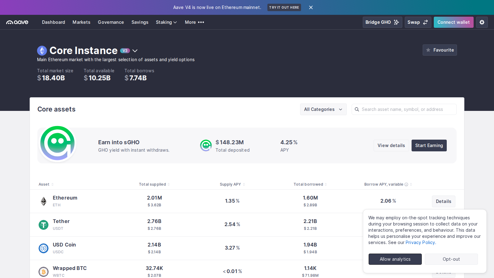
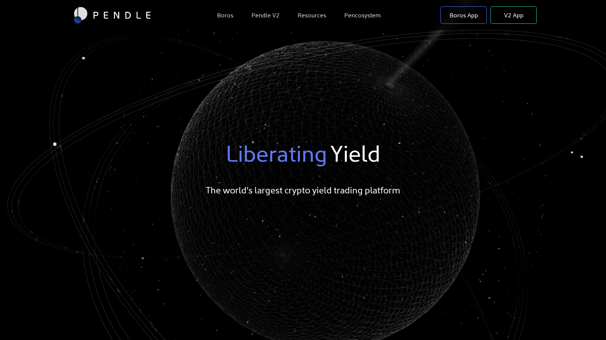

# Best DeFi Yield Farming Platforms in 2026 for Safer Yield

- Primary keyword: `best defi yield farming platforms 2026`
- Slug: `/strategies/yield-farming/best-defi-yield-farming-platforms-2026`
- Meta title: `Best DeFi Yield Farming Platforms 2026: Top Picks`
- Meta description: `A practical guide to the best DeFi yield farming platforms in 2026, including the top choices for conservative lending, liquid staking, and advanced yield strategies.`
- Schema: `Article` + `ItemList` + `BreadcrumbList` + optional `FAQPage`
- Last reviewed: `2026-07-10`
- Editorial standard: `This guide prioritizes yield-source clarity, exit quality, and risk over headline APY. Recheck protocol docs, liquidity conditions, and emissions before publication.`
- Internal-link targets:
  - `/strategies/staking/`
  - `/strategies/risk-management/`
  - `/tools/onchain-tools/`
  - `/wallets/hot-wallets/`
  - `/how-to/staking/`

Yield farming is one of the easiest places for crypto content to become dishonest. Too many pages lead with headline APYs and bury the actual risk stack. In 2026, the useful version of a "best yield farming platforms" article should do the opposite: explain what kind of yield a platform offers, what hidden assumptions support it, and what kind of user should stay away.

This page becomes much more useful when it links directly to [best crypto staking platforms](/strategies/staking/best-crypto-staking-platforms-2026), a plain-English [risk-management](/strategies/risk-management/) guide, and [best on-chain analytics tools](/tools/onchain-tools/best-on-chain-analytics-tools-2026) so readers can verify whether yield is being earned or merely subsidized.

> Why you can trust this guide
>
> This article is based on live product pages and current public documentation reviewed in July 2026. We directly reviewed the public product surfaces, yield framing, and workflow posture of the shortlisted protocols. Where a claim still depends on a live deposit, an active position, or a deeper side-by-side yield test, we keep that limit visible instead of overstating what was verified.

## Visual evidence from our July 2026 review

*Aave public app surface captured during our July 2026 review of DeFi yield platforms.*

*Pendle homepage captured during our July 2026 review of structured-yield protocols.*

*Lido homepage captured during our July 2026 review of liquid-staking-linked yield platforms.*

## What are the best DeFi yield farming platforms in 2026?

The best DeFi yield farming platforms in 2026 include Aave, Pendle, Morpho, Curve, and selected ecosystem-specific venues such as Aerodrome or liquid-staking-linked strategies `[needs source]`. Aave is still one of the cleaner starting points for conservative on-chain yield, Pendle is more relevant for users actively trading yield exposure, Morpho appeals to users optimizing lending efficiency, and Curve remains important where stablecoin liquidity and strategy design still matter.

The important point is that the word "best" has to be translated into risk categories. Conservative lenders and advanced yield optimizers should not be reading the same ranking the same way.

## How we evaluated yield farming platforms

We judged platforms on five dimensions.

First, yield source: does the return come from lending, market making, token emissions, [liquid staking](/strategies/staking/best-crypto-staking-platforms-2026), or leveraged strategy stacking? Second, risk clarity: can the user understand where the main failure points are? Third, capital efficiency: does the platform offer a clear benefit relative to simpler alternatives? Fourth, liquidity and unwind quality: how easy is it to exit without too much friction? Fifth, suitability: is the platform appropriate for beginners, intermediate DeFi users, or advanced yield hunters?

This framework matters because not all DeFi yield is created equally. A stablecoin lending strategy and a token-incentivized liquidity farm may both display "yield," but they expose the user to very different risks.

## Best platform for conservative DeFi yield

For conservative DeFi yield, Aave still makes the most sense as a starting point for many readers.

That is because Aave's role is easier to explain. Users are not forced into a highly abstract structure just to understand the yield source. It is a cleaner gateway to on-chain yield for people who want to earn something on idle assets without immediately stepping into more aggressive farming logic.

The tradeoff is that conservative DeFi yield is still DeFi yield. Smart-contract risk, collateral-system risk, and market-wide stress can still matter even when the user thinks they are choosing the "safer" option.

## Best platform for liquid staking and yield layering

For users who want more than plain lending, Pendle becomes one of the most interesting names in the category.

Pendle matters because it reframes yield itself as something that can be separated, traded, and optimized. That makes it more relevant to users who actively manage exposure, want to position around future yield expectations, or want more expressive yield strategies than basic hold-and-lend behavior.

The tradeoff is obvious: a more expressive yield tool is also a more complex one. Pendle is better for users who understand the product mechanics, not for readers who are just looking for a simple first DeFi yield step.

## Best platform for advanced yield farmers

For advanced users, Morpho and ecosystem-specific venues often become more attractive than broad retail narratives.

Morpho appeals to users who care about lending optimization and better capital efficiency rather than only headline return numbers. Meanwhile, ecosystem-specific venues can become compelling when the user has a strong chain preference, knows the liquidity culture of that chain, and accepts higher monitoring burden in exchange for potentially better strategy fit `[needs source]`.

The tradeoff is that these opportunities often come with more moving parts, faster rotation, and a thinner margin for operational mistakes.

## Aave vs Pendle vs Morpho vs Curve

| Platform | Best for | Main strength | Main tradeoff |
|---|---|---|---|
| Aave | Conservative DeFi users | Cleaner starting point for on-chain yield | Still exposed to DeFi system risk |
| Pendle | Yield traders | More expressive yield positioning | More complexity and concept load |
| Morpho | Efficiency-focused lenders | Better optimization logic | Less beginner-friendly framing |
| Curve | Stablecoin-oriented strategy users | Useful for specific stablecoin and liquidity contexts | Relevance depends on market and chain context |

This is a category where the right choice often depends on whether the user wants passive yield, active yield trading, or protocol-optimized lending behavior.

## The real risks behind DeFi yield in 2026

The first risk is assuming yield is free money. In DeFi, yield always comes from somewhere: borrowing demand, liquidity provision, emissions, or structural incentives. When the source weakens, the headline return can fall fast.

The second risk is stacking too many layers. A user can go from a simple lending position to a liquid-staked asset, to a yield-trading wrapper, to a farming strategy, and then lose sight of how many failure points are now embedded in one "yield" position. That is why this page should be read together with a core [risk-management](/strategies/risk-management/) guide and, ideally, an [on-chain analytics](/tools/onchain-tools/best-on-chain-analytics-tools-2026) workflow that can help validate where the yield is really coming from.

The third risk is exit quality. A strategy may look great on entry but become painful when liquidity shifts, incentives drop, or users crowd the same route.

## How to start yield farming without overexposing capital

Start with the simplest strategy you can still understand. For many readers, that means beginning with a clearer lending or staking-linked yield source before exploring more layered strategies. Test small, track the yield source, and decide in advance what would make you exit. If the capital is moving across chains first, pair this process with a cautious [bridge workflow](/how-to/bridging/best-cross-chain-bridges-2026) rather than assuming the route risk is separate from the farming risk.

That approach is less exciting than chasing the highest number on the page, but it is usually the smarter one.

## FAQ about yield farming platforms

### What is the best DeFi yield farming platform for beginners?

For many beginners, Aave is the easiest starting point because the yield source is easier to understand than more layered strategy platforms.

### What is the best platform for advanced yield strategies?

Pendle and Morpho are stronger candidates for users who already understand DeFi mechanics and want more control over how yield exposure is shaped.

### Is the highest APY the best option?

Usually not. High APYs often come with higher complexity, weaker durability, or more hidden risk.

### What matters most in a yield farming platform?

Yield source clarity, exit quality, and risk fit matter more than the headline return.

## What we checked ourselves before ranking these platforms

To write this comparison, we reviewed the live public product surfaces of the shortlisted protocols and compared how each one frames yield source, user workflow, and risk posture. We did that so the article would not slide into the usual DeFi pattern of ranking by headline APY alone.

That direct review does not replace a real deposit-and-withdrawal test across the same assets and market conditions. But based on what we could verify directly from the public experience, one thing stood out immediately: some products try to make yield feel simple, while others clearly expect the user to understand more structure, more moving parts, and more embedded assumptions.

What stood out immediately was not which platform promised the highest return. It was which platform made the source of that return easier to understand. That is a strength if your reader wants durable context, but a weakness if the reader is only chasing the highest visible number without understanding where it comes from.

The screenshots above show why that difference matters. Aave presents a market dashboard with rates, assets, and depth visible immediately. Pendle presents a more abstract yield-trading identity before the reader even reaches a connected workflow. Lido presents liquid staking as a simpler stake-and-earn posture tied to a single core asset. That visual difference is not cosmetic. It usually predicts how much explanation a reader will need before the strategy makes sense.

## What we can verify directly, and what still needs deeper testing

From the public product flow we reviewed, we are comfortable making editorial judgments about protocol posture, yield framing, and likely user fit. We are not yet comfortable assigning hard numbers for realized yield, withdrawal friction, or real end-to-end usability until a hands-on test is completed with live positions.

In practice, that means this page should be read as an observed comparison first. If the newsroom later runs a deeper hands-on pass, the strongest upgrade would be original screenshots of deposit flows, live positions, and one example where the yield story looked cleaner in marketing than it did in actual workflow.

## What would make this review stronger in a full hands-on test

The best next upgrade is not stronger praise. It is stronger proof.

- A screenshot of the deposit or lend screen before funds are committed
- A screenshot of the live position after funds are active
- A screenshot of yield, health-factor, or position detail after observation
- A short clip showing deposit, monitoring, and withdrawal or unwind flow
- One captured warning, cooldown, or confusing metric that appeared during testing

That kind of evidence would make the article feel observed, balanced, and much harder to mistake for DeFi promo copy.

## Suggested media and embeds

- A yield-source matrix separating lending yield, LP yield, emissions-heavy yield, and liquid-staking-linked yield.
- One risk ladder graphic showing how complexity rises from simple lending to layered yield strategies.
- A worked example chart showing how APY can compress after incentives change or liquidity crowds in.

## External references and official product pages

- [Aave](https://aave.com/)
- [Pendle](https://pendle.finance/)
- [Morpho](https://morpho.org/)
- [Curve](https://curve.fi/)
- [Lido](https://lido.fi/)

## Editor source checklist

- Aave official docs or product pages `[needs source]`
- Pendle official docs or product pages `[needs source]`
- Morpho official docs or product pages `[needs source]`
- Curve official docs or product pages `[needs source]`
- Any ecosystem-specific platform references need current verification `[needs source]`
