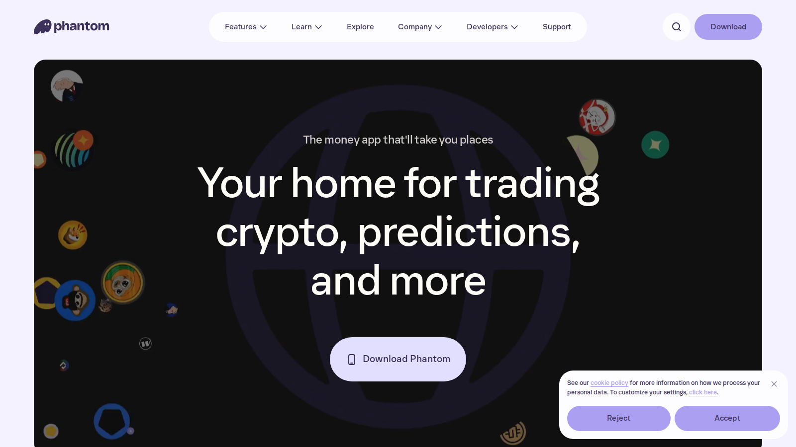
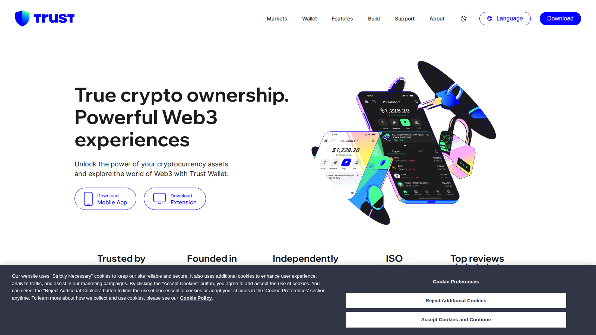
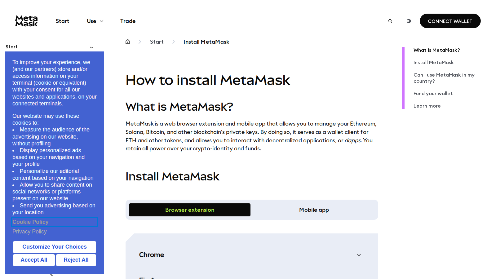

# Best Hot Wallets in 2026 for Everyday Crypto Use

- Primary keyword: `best hot wallets 2026`
- Slug: `/wallets/hot-wallets/best-hot-wallets-2026`
- Meta title: `Best Hot Wallets 2026: Top Crypto Wallets Compared`
- Meta description: `A practical guide to the best hot wallets in 2026, including the top picks for beginners, multi-chain users, Solana users, and DeFi power users.`
- Schema: `Article` + `ItemList` + `BreadcrumbList` + optional `FAQPage`
- Last reviewed: `2026-07-10`
- Editorial standard: `This guide evaluates daily usability, signing clarity, and custody hygiene over brand familiarity alone. Recheck chain support, extension behavior, and mobile feature scope before publication.`
- Internal-link targets:
  - `/wallets/cold-wallets/`
  - `/wallets/setup-guides/`
  - `/how-to/transfer/`
  - `/how-to/buy-crypto/`
  - `/exchanges/dex/`

Hot wallets are still the default way most people actually use crypto. Even if long-term storage belongs in colder custody, the wallet people open every day usually decides how they experience swaps, staking, airdrop hunting, app access, and cross-chain movement. That makes the best hot-wallet question practical, not theoretical.

This page should send readers deeper into the site through [best cold crypto wallets](/wallets/cold-wallets/best-cold-crypto-wallets-2026), [best decentralized exchanges](/exchanges/dex/best-decentralized-exchanges-2026), and a [how to transfer crypto](/how-to/transfer/) page so the wallet choice is tied to real usage and not just product branding.

> Why you can trust this guide
>
> This article is based on live product pages and current public documentation reviewed in July 2026. We directly reviewed the public wallet surfaces, onboarding posture, and positioning of the shortlisted products. Where a claim still depends on a live install, a signing test, or a deeper multi-chain usage pass, we keep that limit explicit instead of pretending it was fully verified.

## Visual evidence from our July 2026 review

*Phantom homepage captured during our July 2026 review of hot-wallet products.*

*Trust Wallet homepage captured during our July 2026 review of everyday crypto wallets.*

*MetaMask help-center install page captured during our July 2026 review of hot-wallet onboarding surfaces.*

## What are the best hot wallets in 2026?

The best hot wallets in 2026 are Rabby, Phantom, MetaMask, Trust Wallet, and Coinbase Wallet, with the best choice depending on chain preference, user experience, and how deeply the user participates in DeFi. Rabby is one of the strongest choices for serious EVM users, Phantom remains one of the cleanest consumer experiences for Solana-heavy users, MetaMask still matters because of ecosystem support, and Trust Wallet and Coinbase Wallet remain relevant as broader mainstream options.

The right answer depends on what the wallet is for. A beginner, a multi-chain DeFi user, and a Solana trader should not all choose the same tool by default.

## How to choose a hot wallet without compromising security

Choosing a hot wallet is less about brand familiarity than about exposure control.

Users should ask four questions. First, which chains and apps do I actually use? Second, do I want the cleanest beginner experience or more detailed transaction review and permissions visibility? Third, how much of my portfolio will ever sit in this wallet? Fourth, how comfortable am I with browser extensions, mobile-only flows, and signing behavior? Those answers should also shape whether the wallet needs to work smoothly with [DEX trading](/exchanges/dex/best-decentralized-exchanges-2026), [bridge transfers](/how-to/bridging/best-cross-chain-bridges-2026), or [staking workflows](/strategies/staking/best-crypto-staking-platforms-2026).

A better hot wallet reduces user error. That can matter just as much as raw feature count.

## Best hot wallet for beginners

For many beginners, Trust Wallet or Coinbase Wallet is easier to recommend than a more advanced wallet.

The main reason is not that they are universally superior. It is that onboarding, interface expectations, and mainstream wallet patterns are often easier for newer users to understand. Beginners usually need fewer moving parts and fewer scary prompts, not more.

The tradeoff is that power users may find those wallets less informative or less precise than alternatives built for heavier DeFi behavior.

## Best hot wallet for multi-chain users

For multi-chain EVM users, Rabby is one of the strongest answers.

Rabby is widely appreciated because it tries to make transaction review and chain context more explicit, which matters for users who regularly move through DeFi apps and interact with more than one network. That does not eliminate risk, but it can make the wallet feel more aligned with how an active user actually behaves, especially if that user also spends time on [DEXs](/exchanges/dex/best-decentralized-exchanges-2026) and [bridges](/how-to/bridging/best-cross-chain-bridges-2026).

The tradeoff is that a wallet built for more serious usage can feel less beginner-friendly.

## Best hot wallet for Solana users

For Solana users, Phantom is still one of the cleanest answers in the category.

Phantom benefits from strong product identity and a workflow that many users find easier to live with day to day. If the user is primarily interacting with Solana apps, collectibles, and swaps, a wallet that is deeply integrated with that ecosystem often feels better than a generalized multi-chain compromise.

The tradeoff is that chain-native excellence does not automatically make a wallet the best answer outside that ecosystem.

## Best hot wallet for DeFi power users

For DeFi power users, Rabby and MetaMask still dominate most practical conversations, but for different reasons.

Rabby often wins on transaction clarity and workflow feel. MetaMask still wins on compatibility and historical network effect. That is an important distinction. Many users do not love MetaMask because it is the best-designed wallet in every respect. They keep using it because it remains one of the most broadly supported interfaces across apps and chains.

The tradeoff is that broad support does not automatically equal the best daily experience.

## MetaMask vs Rabby vs Phantom vs Trust Wallet

| Wallet | Best for | Main strength | Main tradeoff |
|---|---|---|---|
| Rabby | Active EVM and DeFi users | Better transaction and chain context | Less beginner-oriented |
| Phantom | Solana users | Strong everyday UX in one ecosystem | Less of a universal answer |
| MetaMask | Compatibility-first users | Massive app support and familiarity | UX criticisms still matter `[needs source]` |
| Trust Wallet | Mainstream beginners | Easier consumer-style onboarding | Less power-user precision |
| Coinbase Wallet | Users who want a recognizable mainstream brand | Simpler bridge from mainstream exchange users | Not always the first pick for advanced DeFi workflows |

The right comparison is not "which wallet is best?" It is "which wallet reduces mistakes for the way I use crypto?"

## When a hot wallet stops being the right tool

A hot wallet is not the place to prove ideological commitment to self-custody while ignoring scale. Once balances become meaningful, users should think about separating active-use funds from long-term storage. The better hot-wallet habit is not to make the wallet do everything. It is to use it for active interaction and keep larger strategic balances under a colder custody setup, ideally paired with a dedicated [cold-wallet plan](/wallets/cold-wallets/best-cold-crypto-wallets-2026).

That split is less dramatic than social-media wallet culture makes it sound. It is just operational hygiene.

## FAQ about hot wallets

### What is the best hot wallet for most users?

For many users, the answer is Phantom, Rabby, or Trust Wallet depending on whether they are Solana-first, DeFi-heavy, or more beginner-oriented.

### Is MetaMask still worth using in 2026?

Yes, mainly because compatibility still matters. But it is no longer the only serious answer for active users.

### Is a hot wallet safe?

It can be safe enough for active-use funds if the user follows good security hygiene, but it should not automatically be the home for a full long-term portfolio.

### When should I move funds to a cold wallet?

When the funds are no longer needed for active daily interaction or when the amount is large enough that convenience should no longer dominate the decision.

## What we checked ourselves before ranking these wallets

To write this comparison, we reviewed the live public product surfaces of the shortlisted wallets and compared how each one frames onboarding, chain support, signing posture, and user workflow. We did that so the article would not collapse into a vague popularity ranking.

That direct review does not replace a full install-and-usage test across the same chains, dapps, and signing flows. But based on what we could verify directly from the public experience, one thing stood out quickly: some wallets are clearly trying to reduce friction for mainstream users, while others are trying to reduce mistakes for heavier DeFi users.

What stood out immediately was not which wallet looked the slickest. It was which wallet seemed to expect the user to think more carefully. That is a strength if your reader values transaction clarity and control, but a weakness if the real priority is the shortest path to basic everyday use.

The screenshots above show why that distinction matters. Phantom presents itself as a consumer crypto app with trading and exploration built into the pitch. Trust Wallet presents a broad ownership-and-Web3 framing that aims at mainstream users who still want app and extension coverage. MetaMask's public install help surface immediately reinforces its extension-first and self-directed setup identity. That visual difference is not cosmetic. It usually predicts how much hand-holding or caution the user will need later.

## What we can verify directly, and what still needs deeper testing

From the public product flow we reviewed, we are comfortable making editorial judgments about wallet posture, user fit, and whether the product behaves more like a beginner tool, a multi-chain control layer, or a DeFi-first wallet. We are not yet comfortable assigning hard numbers for install speed, signing clarity in practice, or how each wallet behaves across the same real dapp workflows until a hands-on test is completed.

In practice, that means this page should be read as an observed comparison first. If the newsroom later runs a deeper hands-on pass, the strongest upgrade would be original screenshots of onboarding, signing prompts, and one or two real friction points that appeared during use.

## What would make this review stronger in a full hands-on test

The best next upgrade is not more polished copy. It is more original evidence.

- A screenshot of onboarding or import flow
- A screenshot of a send, receive, or token-management view
- A screenshot of a contract-signing prompt with annotations
- A short video of wallet use, such as connecting to a DEX or switching chains
- One captured warning, failed signature, or confusing permission request

Wallet content becomes much more credible when readers can see real interaction points instead of only polished marketing surfaces.

## Suggested media and embeds

- A wallet-comparison table showing chain focus, browser-extension strength, mobile experience, and best-fit user.
- One screenshot of a signing screen with callouts for contract interaction, network check, and permissions review.
- A hot-wallet versus cold-wallet workflow graphic for active funds, long-term holdings, and transfer hygiene.

## External references and official product pages

- [Rabby Wallet](https://rabby.io/)
- [Phantom](https://phantom.com/)
- [MetaMask](https://metamask.io/)
- [Trust Wallet](https://trustwallet.com/)
- [Coinbase Wallet](https://www.coinbase.com/wallet)

## Editor source checklist

- Rabby official site or docs `[needs source]`
- Phantom official site or docs `[needs source]`
- MetaMask official site or docs `[needs source]`
- Trust Wallet official site or docs `[needs source]`
- Coinbase Wallet official site or docs `[needs source]`
