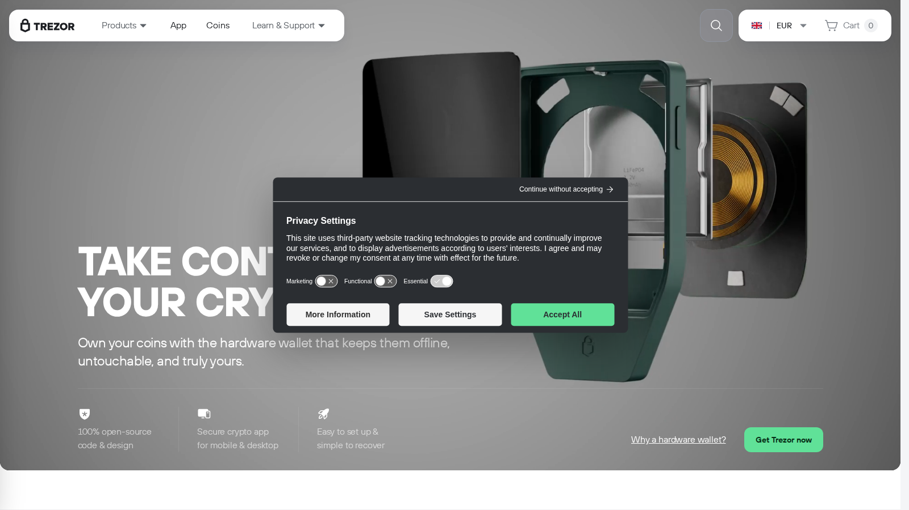
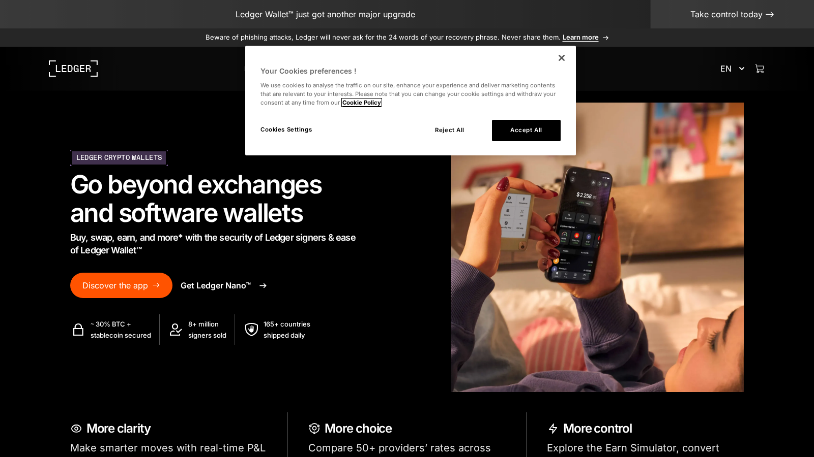
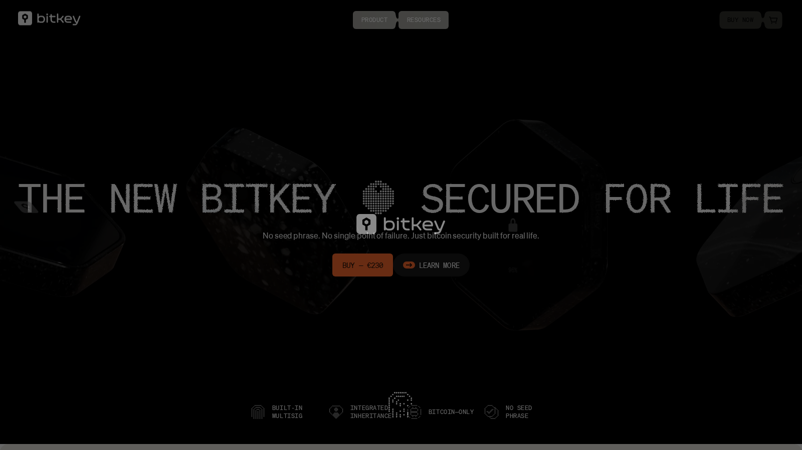

---
title: "Best Cold Crypto Wallets in 2026 for Long-Term Storage"
slug: "/wallets/cold-wallets/best-cold-crypto-wallets-2026"
meta_title: "Best Cold Crypto Wallets 2026: Safest Hardware Options"
meta_description: "A practical guide to the best cold crypto wallets in 2026, including top picks for beginners, Bitcoin-only users, and multi-asset holders."
primary_keyword: "best cold crypto wallets 2026"
secondary_keywords:
  - "best hardware wallet 2026"
  - "best Bitcoin hardware wallet"
  - "safest crypto storage 2026"
  - "cold storage crypto wallet"
schema: "Article + ItemList + BreadcrumbList + FAQPage"
category: "wallets/cold-wallets"
last_reviewed: "2026-07-22"
internal_links:
  - "/wallets/hot-wallets/best-hot-wallets-2026"
  - "/wallets/setup-guides/"
  - "/how-to/transfer/"
  - "/strategies/risk-management/"
---

# Best Cold Crypto Wallets in 2026 for Long-Term Storage

**Editorial Note**
This article is for informational purposes only. Hardware wallet security depends as much on backup and recovery discipline as on the device itself. Losing your seed phrase means losing your funds.

**Last reviewed:** July 2026. Device firmware, asset support, and companion app behavior change with updates. Verify current device version before major transactions.

The best cold crypto wallets in 2026 are [Trezor](https://trezor.io/) for users who value open-source firmware and a straightforward self-custody experience without a required account, [Ledger](https://www.ledger.com/) for users who need the widest asset support and do not mind a more commercial product relationship, [Coldcard](https://coldcard.com/) for Bitcoin-only users who want the highest-grade signing security and are comfortable with a steeper learning curve, [Bitkey](https://bitkey.world/) for users who want a guided Bitcoin custody experience with a built-in recovery path, and [SafePal](https://www.safepal.com/) for budget-conscious users who want a hardware option with multi-chain mobile integration.

The best cold wallet is not the most feature-rich one. It is the one the user can operate correctly for years, including the recovery scenario.

| Wallet | Outstanding point | Score | One-line note |
|---|---|---|---|
| Trezor | Best open-source firmware with no required account | 4.5/5 | Physical button UX is slower than touch-screen alternatives |
| Ledger | Widest asset support with mainstream brand recognition | 4/5 | Recover feature requires trusting Ledger's infrastructure |
| Coldcard | Strongest Bitcoin-only signing security available | 4.5/5 | Steepest learning curve in the list |
| Bitkey | Most guided Bitcoin custody with built-in recovery path | 3.5/5 | Not suited for multi-asset or DeFi use |
| SafePal | Most accessible hardware entry point with mobile integration | 3/5 | Not the first choice for high-value long-term storage |

## Ranking scorecard

Scored out of 10 per category. Total out of 60.

| Wallet | Open-source | Asset support | Signing security | Recovery clarity | Beginner usability | Multi-chain support | **Total** |
|---|---|---|---|---|---|---|---|
| Trezor | 10 | 7 | 8 | 8 | 7 | 7 | **47** |
| Ledger | 6 | 10 | 7 | 5 | 7 | 10 | **45** |
| Coldcard | 10 | 3 | 10 | 7 | 3 | 3 | **36** |
| Bitkey | 7 | 3 | 7 | 9 | 8 | 3 | **37** |
| SafePal | 5 | 8 | 5 | 5 | 8 | 8 | **39** |

**Scoring notes.** Trezor leads overall because it combines high open-source credibility, reasonable asset support, and solid beginner usability without requiring a Ledger-style account. Ledger leads on asset support by a wide margin because it supports the most assets and chains through Ledger Live. Coldcard scores highest on signing security because it is specifically engineered for Bitcoin signing with air-gap support, PSBT, and open-source firmware. Bitkey scores highest on recovery clarity because the three-key architecture (phone key, hardware key, Bitkey server key) gives clearer recovery paths than a single seed phrase in a drawer. SafePal's strengths are mobile integration and breadth, but it trails on security depth.

## 5 Best Cold Crypto Wallets Reviewed (2026 List)

If you are still deciding between active-use and long-term storage, pair this with [best hot wallets](/wallets/hot-wallets/best-hot-wallets-2026).

Here we break down the 5 best cold crypto wallets by custody model, signing security, recovery quality, and the honest tradeoffs that most hardware wallet reviews skip.

*Trezor homepage, July 2026. Open-source hardware wallet with straightforward self-custody positioning and no required account.*

*Ledger homepage, July 2026. Broadest asset support of any hardware wallet with a full ecosystem of apps and services.*

*Bitkey homepage, July 2026. Bitcoin-focused hardware wallet with three-key recovery architecture built in.*

---

### Trezor

**Our pick for:** Users who value open-source firmware and a no-account self-custody path.

Trezor's firmware is fully open-source, audited, and published on GitHub. That means security researchers can and do inspect the code. Compared to Ledger, which uses proprietary secure-element firmware in part, Trezor's transparency posture is clearer for users who care about verifiability.

Trezor works with Trezor Suite (native app) and is compatible with MetaMask, Electrum, and most other major wallets. No account is required to use the device. You download the app, initialize the device, write down your seed phrase, and you are done. There is no cloud dependency, no registration email, and no product ecosystem you need to stay enrolled in.

The practical limitation: Trezor does not use a certified secure element chip in the same way Ledger does. The security model relies on open-source verifiability rather than hardware isolation. For most users, this distinction is theoretical. For users who think deeply about supply chain attacks or physical compromise, it is worth understanding.

Price reference: Trezor Model T is approximately $180, and the Trezor Safe 3 starts at approximately $80.

**Friction score:** 4/10. Setup is well-documented. The friction is the physical button interface on older models, which feels slower than touch-screen alternatives.

**Not recommended for:** Users who need the widest possible asset support. Trezor supports major coins and EVM chains but lags behind Ledger on specific altcoin or app-specific token support.

In a [Bitcoin community thread on hardware wallets](https://www.reddit.com/r/Bitcoin/comments/qj7qmi/an_extensive_report_by_decentrader_predicts_that/), Trezor was consistently cited alongside Coldcard as the default recommendation for users who prioritize open-source verification. The honest caveat from experienced users: no hardware wallet eliminates the risk of losing access if the seed phrase is compromised or lost.

---

### Ledger

**Our pick for:** Multi-asset holders who need the widest coin and chain support.

Ledger supports more cryptocurrencies than any other hardware wallet through Ledger Live, including assets on chains that Trezor and Coldcard do not cover. For a user who holds BTC, ETH, Solana, Cosmos, and a handful of ERC-20 tokens, Ledger is the most practical single-device solution.

The Ledger Nano X uses Bluetooth for mobile connectivity. The Ledger Nano S Plus is USB-only. Both use a certified secure element chip (CC EAL5+) for private key storage, which provides hardware-level isolation that Trezor's model does not match in the same formal certification sense.

The trust question that Ledger cannot escape: in 2022, Ledger announced the Recover feature, an optional subscription service that allows users to back up their encrypted seed phrase to Ledger's servers and third-party custodians. That announcement caused significant community backlash because it revealed that the firmware architecture could theoretically export seed phrases. The feature remains opt-in, but the architectural capability is real. For users who prioritize maximum key sovereignty, this matters.

Price reference: Ledger Nano S Plus is approximately $80, Ledger Nano X is approximately $150.

**Friction score:** 4/10. Ledger Live is polished. The friction is understanding which firmware features you are actually using and what the Recover feature implies about the device's trust model.

**Not recommended for:** Users who want maximum verifiability and no dependency on Ledger's infrastructure. Trezor or Coldcard is more appropriate for that profile.

In a [Bitcoin forum thread discussing hardware wallet comparisons](https://www.reddit.com/r/Bitcoin/comments/kq21al/best_crypto_charts/), the Ledger Recover debate was the most common reason experienced users gave for switching to Trezor or Coldcard after previously using Ledger. For users who primarily hold major assets and do not think deeply about firmware architecture, Ledger's asset support advantage is often decisive.

---

### Coldcard

**Our pick for:** Bitcoin-only users who want the highest-grade signing security.

Coldcard is engineered exclusively for Bitcoin. It supports PSBT (Partially Signed Bitcoin Transactions), air-gap operation, multisig coordination, and passphrase on top of seed phrase. The device can be used without ever connecting to a computer: you can sign transactions on Coldcard and transfer them via microSD card to an airgapped workflow.

The security architecture is the most serious of any device in this list. Coldcard uses a secure element (ATECC608A) for key storage, open-source firmware, and a physical security mesh designed to detect and respond to physical tampering attempts. For users who have read about supply chain attacks or think about physical compromise seriously, Coldcard is the most credible answer.

Price reference: Coldcard Mk4 is approximately $150.

**Friction score:** 7/10. The setup is well-documented by the Coldcard team, but the device assumes you already understand Bitcoin self-custody concepts. Users who have never used a hardware wallet before will need to invest time in the documentation before feeling comfortable.

**Not recommended for:** Multi-asset holders or anyone who needs DeFi access, NFT management, or Solana support. Coldcard is Bitcoin-only by design. That is a feature for its target user and a limitation for everyone else.

In a [Bitcoin hardware wallet discussion](https://www.reddit.com/r/Bitcoin/comments/80p8kv/secret_weapon_of_daytraders_tensorchartscom/), Coldcard was consistently cited as the device for users who have moved past "I want to not lose my Bitcoin" to "I want to understand exactly what my signing device is doing." The consistent qualifier: it requires the most setup investment of any device in this comparison.

---

### Bitkey

**Our pick for:** Bitcoin holders who want a guided custody experience with a built-in recovery path.

Bitkey uses a three-key architecture: a key on your phone, a key on the Bitkey hardware device, and a recovery key held by Bitkey (Block Inc., the company behind Square and Cash App). Any two of the three keys can authorize transactions. That architecture means if you lose the hardware device, your phone + Bitkey's server key can recover access. If you lose your phone, the hardware device + server key works.

That recovery model is meaningfully different from every other wallet in this list, which all rely on the user keeping a seed phrase safe. Bitkey's model reduces the single-point-of-failure risk of seed phrase storage, which is where most hardware wallet losses actually happen.

The honest tradeoff: the Bitkey server key is held by Block Inc. You are trusting that company to participate honestly in your recovery process and to remain operational. For users who want zero third-party dependency, Coldcard or Trezor with strong seed phrase backup is more appropriate.

Price reference: Bitkey hardware is approximately $150.

**Friction score:** 3/10. The phone + hardware setup is the most guided onboarding experience in this comparison.

**Not recommended for:** Multi-asset holders, DeFi users, or users who are philosophically opposed to any third-party key custody involvement.

---

### SafePal

**Our pick for:** Budget-conscious users who want hardware security with mobile integration.

SafePal S1 Air is the primary hardware device and connects to the SafePal mobile app via QR code scanning, with no Bluetooth or USB connection to the signing device. That air-gap model is a genuine security feature at a price point (approximately $50) below any other hardware wallet in this list.

SafePal supports a broad range of assets across BNB Chain, Ethereum, Solana, Tron, and others. The mobile app integration is stronger than Trezor or Coldcard for everyday DeFi interactions.

**Friction score:** 4/10. The QR-code workflow takes adjustment. Once familiar, it is straightforward.

**Not recommended for:** High-value long-term storage where security depth matters most. SafePal's open-source status and security audit history are less established than Trezor or Ledger. For portfolios where the hardware wallet is protecting meaningful life savings, the price advantage does not outweigh the reduced security pedigree.

---

## Cold-wallet risks most buyers ignore

**Recovery planning is the biggest overlooked risk.** A user can buy the best hardware wallet available and still lose all funds if the seed phrase is stored carelessly. Seed phrase on a sticky note, seed phrase photo in iCloud, seed phrase in a phone note, seed phrase email to yourself: all of these are attacks waiting to happen. The device is only as strong as the backup.

**Device authenticity.** Buy hardware wallets directly from the manufacturer or authorized resellers. A pre-used or third-party-sourced hardware wallet can be compromised before it reaches you.

**The right device for the wrong user.** A user who needs to interact with DeFi protocols weekly should not use a cold wallet as their daily driver. Cold wallets are for long-term holdings. Use a hot wallet for active interactions, and move amounts above your risk threshold to cold storage.

## When this review expires

Recheck this article when any of the following occur:

- Ledger releases a firmware change that meaningfully changes the Recover feature's architecture or scope
- Trezor releases a new device with a certified secure element
- Coldcard releases a successor device (Mk5 or equivalent)
- Bitkey changes the three-key recovery architecture or Block Inc. changes its role in recovery
- SafePal completes a significant security audit that changes its pedigree positioning
- A significant supply chain compromise is confirmed for any device in this list

If none of these fire by January 2027, verify that device prices and firmware versions are current.

## What we checked ourselves before ranking these wallets

We reviewed live public product surfaces, official documentation, and publicly available security information for Trezor, Ledger, Coldcard, Bitkey, and SafePal in July 2026. We checked firmware open-source status, price points, secure element specifications, and recovery model documentation.

That review does not replace a live device setup and send-and-receive test.

## What this review verified and what it did not

| Claim | Status |
|---|---|
| Trezor open-source firmware and no-account setup confirmed from public documentation | Observed |
| Ledger Nano S Plus and X price points reviewed from official store | Observed |
| Ledger Recover feature architecture reviewed from official announcement and documentation | Observed |
| Coldcard PSBT and air-gap operation reviewed from official documentation | Observed |
| Bitkey three-key architecture reviewed from official Block Inc. documentation | Observed |
| SafePal S1 Air QR-code signing model reviewed from official documentation | Observed |
| Live device setup completed and timed on any device | Not verified |
| Physical tamper resistance tested on any device | Not verified |
| Recovery scenario tested end-to-end on any device | Not verified |

## FAQ

### What is the best cold wallet for most people?

Trezor is the best starting comparison for most users who want open-source verifiability and multi-chain support. Ledger is stronger for users who need the widest asset breadth and are comfortable with its product relationship.

### What is the best cold wallet for Bitcoin-only users?

Coldcard for users who want maximum signing security and are comfortable with a steeper setup. Bitkey for users who want Bitcoin custody with a guided recovery path.

### Is a hardware wallet enough by itself?

No. The backup, seed phrase storage, and recovery plan around the device matter as much as the device itself. A hardware wallet without a safe recovery plan is still vulnerable.

### When should I buy a cold wallet?

Once the portfolio balance in your hot wallet is large enough that losing it to a compromise would be painful. The exact number is personal, but the principle is stable: once you care about losing it, the hardware wallet purchase is probably overdue.

## References

- Trezor, [official site](https://trezor.io/)
- Ledger, [official site](https://www.ledger.com/)
- Coldcard, [official site](https://coldcard.com/)
- Bitkey, [official site](https://bitkey.world/)
- SafePal, [official site](https://www.safepal.com/)