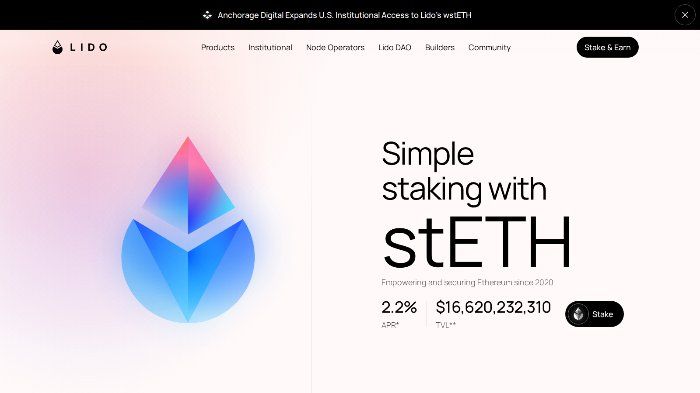
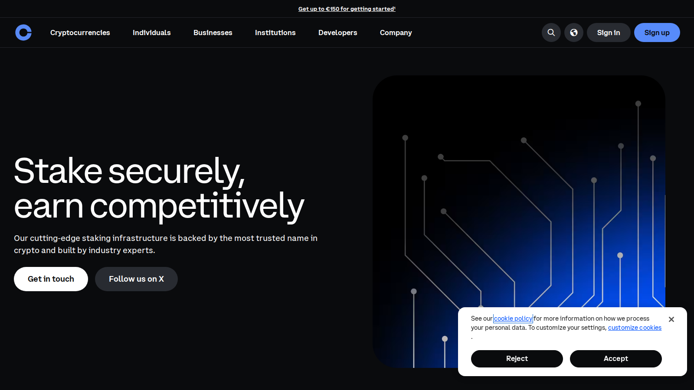

---
title: "Best Crypto Staking Platforms in 2026: Centralized and DeFi Options"
slug: "/strategies/staking/best-crypto-staking-platforms-2026"
meta_title: "Best Crypto Staking Platforms 2026: Top Options Ranked"
meta_description: "A practical guide to the best crypto staking platforms in 2026, with picks for simple custodial staking, liquid staking, and more flexible on-chain options."
primary_keyword: "best crypto staking platforms 2026"
secondary_keywords:
  - "best staking platform 2026"
  - "liquid staking 2026"
  - "best ETH staking 2026"
  - "crypto staking compared"
schema: "Article + ItemList + BreadcrumbList + FAQPage"
category: "strategies/staking"
last_reviewed: "2026-07-22"
internal_links:
  - "/how-to/staking/"
  - "/strategies/yield-farming/best-defi-yield-farming-platforms-2026"
  - "/strategies/risk-management/"
  - "/wallets/hot-wallets/best-hot-wallets-2026"
  - "/tools/portfolio/best-crypto-portfolio-trackers-2026"
---

# Best Crypto Staking Platforms in 2026: Centralized and DeFi Options

**Editorial Note**
This article is for informational purposes only and does not constitute investment or financial advice. Staking yields, lockup terms, and platform availability change regularly. Verify current rates and terms before staking.

**Last reviewed:** July 2026. Staking rates, lockup periods, and supported assets change with platform updates and network conditions. Check each platform directly before committing funds.

The best crypto staking platforms in 2026 are [Binance](https://www.binance.com/en) for users who want the most options in one place with minimal setup, [Coinbase](https://www.coinbase.com/) for users who prefer a regulated US-focused custodial staking experience, [Lido](https://lido.fi/) for ETH holders who want liquid staking that stays usable in DeFi, [Rocket Pool](https://rocketpool.net/) for users who want a more decentralized ETH staking option without trusting a centralized operator, and Binance or Coinbase exchange validators for users who want straightforward SOL, MATIC, or BNB staking without managing wallets.

The staking decision is about custody model, liquidity, and how much operational complexity you can tolerate, not just the headline yield.

| Platform | Outstanding point | Score | One-line note |
|---|---|---|---|
| Binance | Most staking options in one place with lowest friction | 4/5 | Custodial; all risks of exchange custody apply |
| Coinbase | Best regulated custodial staking for US users | 4/5 | Fees are taken as a percentage; Coinbase takes ~25% of rewards |
| Lido | Best liquid staking for ETH with DeFi composability | 4.5/5 | stETH carries smart-contract and protocol risk |
| Rocket Pool | Best decentralized ETH staking with rETH liquidity | 4/5 | Lower liquidity than Lido; requires more setup understanding |
| Native validator staking | Most direct on-chain sovereignty over your validator | 3.5/5 | 32 ETH minimum; highest technical and financial threshold |

## Ranking scorecard

Scored out of 10 per category. Total out of 60.

| Platform | Custody model | Yield competitiveness | Liquidity | Risk clarity | Beginner access | DeFi composability | **Total** |
|---|---|---|---|---|---|---|---|
| Binance | 4 | 8 | 7 | 5 | 9 | 4 | **37** |
| Coinbase | 5 | 6 | 6 | 7 | 9 | 3 | **36** |
| Lido | 8 | 7 | 8 | 7 | 8 | 10 | **48** |
| Rocket Pool | 9 | 7 | 6 | 8 | 5 | 8 | **43** |
| Native validator | 10 | 8 | 3 | 9 | 2 | 5 | **37** |

**Scoring notes.** Lido leads the scorecard because it combines strong custody (non-custodial with self-custody of stETH), competitive yield, and the highest DeFi composability of any option in this list. Rocket Pool scores second on the factors that matter for self-sovereign users because it offers a more decentralized architecture than Lido at the cost of lower liquidity and more setup complexity. Binance and Coinbase score well on access but poorly on custody model because all funds are held by the exchange. Native validator staking scores maximum on custody and sovereignty but minimum on beginner access and liquidity.

## 5 Best Crypto Staking Platforms Reviewed (2026 List)

If you are exploring the broader yield landscape, compare staking with [best DeFi yield farming platforms](/strategies/yield-farming/best-defi-yield-farming-platforms-2026) to understand where staking fits in the overall risk-return spectrum.

Here we break down the 5 best staking options by custody model, yield reality, liquidity, and the honest tradeoffs that headline yield comparisons always skip.

*Lido homepage, July 2026. Liquid staking entry point for ETH with stETH composability and daily reward accrual.*

*Rocket Pool homepage, July 2026. Decentralized ETH staking protocol with rETH as the liquid staking receipt.*

*Coinbase staking page, July 2026. Custodial staking interface showing supported assets and yield estimates.*

---

### Binance

**Our pick for:** Users who want the most staking options in one place without leaving their exchange account.

Binance offers custodial staking, flexible savings, and locked staking for a wider range of assets than any other platform in this list. The "Earn" section within the app covers ETH staking (via WBETH, Binance's liquid staking token), BNB, SOL, and dozens of other assets with both flexible (instant unstake) and locked (fixed-term) options.

The yield reality: Binance's custodial ETH staking currently shows approximately 2.5-3% APY on WBETH, which is below Lido's stETH (approximately 3-4%) because Binance takes a fee from staking rewards. For BNB, yields are typically 3-5% depending on the lock period.

The custody risk that most Binance staking articles understate: all staking on Binance means your assets are held by Binance. If Binance has a liquidity event, operational disruption, or regulatory restriction, access to staked funds can be affected before the lockup technically ends. The FTX collapse in 2022 is the most visible reminder of why custodial staking carries a platform risk that native staking does not.

**Friction score:** 2/10. Click Earn, pick an asset, choose flexible or locked. The lowest-friction staking entry point in this list.

**Not recommended for:** Users who prioritize custody control or who would be significantly affected if Binance restricted withdrawals during a market event. For those users, Lido or Rocket Pool is more appropriate.

In a [CryptoCurrency Reddit community thread on staking options](https://www.reddit.com/r/CryptoCurrency/comments/osmb00/several_resources_and_websites_to_help_you_dyor/), Binance staking came up most often in the context of convenience rather than yield optimization. The consistent community note: exchange staking is fine for assets you would hold on the exchange anyway, but not for funds you care about protecting at the custody level.

---

### Coinbase

**Our pick for:** US-based users who want regulated custodial staking with clear tax reporting.

Coinbase offers ETH staking (via cbETH, its liquid staking token), SOL staking, and a handful of other assets. The regulatory positioning is Coinbase's main advantage: it operates under clear US regulatory frameworks, which matters for institutional users and those who want a platform they can reference in a tax conversation.

The honest fee structure: Coinbase takes approximately 25-35% of staking rewards as its commission. Current cbETH yield is approximately 2-2.5% APY, which is materially below Lido's stETH or Rocket Pool's rETH. For users who value regulatory clarity and easy tax forms over yield optimization, that fee is the cost of convenience. For yield-focused users, it is not competitive.

**Friction score:** 3/10. Native integration in the Coinbase app. Tax reporting is the clearest of any platform in this list, which has real value for users in the US who file crypto gains.

**Not recommended for:** Yield-focused users or users outside the US who do not get the regulatory benefit. The commission structure makes Coinbase staking less competitive than self-custody options on pure yield terms.

---

### Lido

**Our pick for:** ETH holders who want liquid staking with maximum DeFi composability.

Lido converts your ETH into stETH. The current ETH network staking yield is approximately 3-4% annualized, and stETH accrues that yield automatically in the token balance daily. You keep control of stETH in your wallet. There is no lockup.

The composability advantage is real and specific: stETH can be supplied to Aave as collateral, deposited into Curve's stETH/ETH pool for additional LP fees, used in Pendle for fixed-yield positioning, or held in any EVM wallet. One staking position can be the foundation for multiple yield strategies simultaneously.

Lido controls approximately 28-32% of all staked ETH as of mid-2026. That concentration creates a specific systemic risk: if Lido had a governance attack, smart-contract exploit, or major slashing event, the scale of impact would be significant. The Ethereum community has actively discussed this concentration as a centralization concern.

**Friction score:** 3/10. Connect a wallet, click stake. The complexity comes in what you do with stETH after, not in the staking itself.

**Not recommended for:** Users who are concerned about Lido's market dominance, want validator-level control over their staking, or need to minimize protocol dependencies in their staking approach.

In a [DeFi community thread on liquid staking options](https://www.reddit.com/r/defi/comments/1hl12kl/portfolio_trackers/), Lido was the default reference point for liquid staking with DeFi composability. The concern raised consistently: the protocol concentration creates tail risk that smaller Lido stakers may not be thinking about.

---

### Rocket Pool

**Our pick for:** ETH stakers who want a more decentralized alternative to Lido.

Rocket Pool uses a permissionless node operator model: anyone with 8 ETH (reduced from 16 ETH in a protocol upgrade) can run a Rocket Pool minipool validator, combining their ETH with ETH from the protocol's deposit pool. Node operators stake their own RPL tokens as collateral, which creates an economic stake in behaving honestly.

rETH is Rocket Pool's liquid staking token. Unlike stETH's rebasing model, rETH appreciates in value as rewards accumulate rather than increasing in token balance. Both approaches achieve the same economic result; the difference is in how DeFi protocols handle each token.

The honest limitation: Rocket Pool's rETH has lower liquidity than stETH in DeFi. Fewer protocols accept rETH as collateral, and the DEX pools for rETH are smaller. For users who plan to actively use the liquid staking token in DeFi strategies, that liquidity gap matters.

**Friction score:** 4/10. Staking via Rocket Pool requires a wallet connection and understanding that rETH is what you receive, not ETH. For users who want to run a node, the technical threshold is significantly higher.

**Not recommended for:** Users who need the maximum liquid staking token liquidity for active DeFi strategies. For that use case, stETH via Lido is still more practical.

---

### Native validator staking (solo ETH staking)

**Our pick for:** Users who want maximum sovereignty and are willing to meet the 32 ETH threshold and technical requirements.

Running a native ETH validator means you control the validator key, the withdrawal key, and the validator itself. No third-party protocol holds any part of the stake. You receive 100% of the staking rewards with no protocol fee deducted. The current solo validator yield is approximately 3-4% APY.

The barrier is real: 32 ETH is the minimum to run a validator (approximately $80,000-$120,000 at most 2024-2025 price ranges). You also need to manage validator client software, maintain uptime, and understand slashing conditions.

**Friction score:** 9/10. The highest technical and financial threshold of any staking option in this list.

**Not recommended for:** Users below the 32 ETH threshold, users who are not comfortable with validator client management, or users who want liquid access to their staked position.

---

## The main risks of staking in 2026

**Custody vs yield tradeoff.** Exchange staking (Binance, Coinbase) offers the lowest friction but the worst custody. Native validator staking offers the best custody but the highest threshold. Liquid staking (Lido, Rocket Pool) sits between them but adds protocol risk.

**Lockup illusion.** "Flexible staking" on exchanges means flexible withdrawal from the exchange's perspective, subject to the exchange's operational status. If an exchange restricts withdrawals, flexible staking does not help. Lido's stETH is technically liquid on secondary markets, but if stETH de-pegs, exiting at parity requires a buyer.

**Slashing.** Validators that behave incorrectly (double-signing, being offline during slashing conditions) can have their ETH reduced. For custodial staking, the platform absorbs this risk in theory; in practice, users should check the provider's slashing coverage policy.

## When this review expires

Recheck this article when any of the following occur:

- Lido's market share of staked ETH crosses 33% (systemic risk threshold) or drops below 20% (competitive change)
- Rocket Pool changes its minipool collateral requirements or launches a major protocol upgrade
- Binance or Coinbase changes its staking fee structure or launches a new liquid staking token
- ETH network staking yield changes by more than 1% annualized from current levels
- A significant slashing event occurs at Lido or Rocket Pool
- A new liquid staking token achieves comparable rETH or stETH market depth

If none of these fire by January 2027, verify that yield rates and custody terms are still current.

## What we checked ourselves before ranking these options

We reviewed live public product surfaces for Binance, Coinbase, Lido, and Rocket Pool in July 2026. We checked staking yield ranges from public interfaces, fee disclosures, custody model documentation, and liquid token mechanics.

That review does not replace a live stake-and-unstake test or a real yield monitoring period.

## What this review verified and what it did not

| Claim | Status |
|---|---|
| Binance custodial staking model and WBETH yield range reviewed | Observed |
| Coinbase staking commission (approx 25-35%) reviewed from public documentation | Observed |
| Lido stETH yield range (3-4%) reviewed from public market interface | Observed |
| Rocket Pool minipool ETH requirement and rETH model reviewed from public documentation | Observed |
| Native validator 32 ETH minimum confirmed from Ethereum.org documentation | Observed |
| Live staking position monitored for yield accuracy on any platform | Not verified |
| Withdrawal process tested under high-utilization conditions | Not verified |
| Slashing coverage policies verified with platform support on any platform | Not verified |

## FAQ

### What is the best staking platform for beginners?

Binance or Coinbase for the lowest friction. The custody tradeoff is the price you pay for that convenience.

### What is the best platform for liquid staking?

Lido for DeFi composability and liquidity. Rocket Pool for users who want a more decentralized alternative.

### Is custodial staking better than DeFi staking?

Simpler, not better. Custodial staking trades custody control for convenience. DeFi staking (Lido, Rocket Pool) keeps custody with the user but adds protocol risk and more steps.

### What matters most when choosing a staking platform?

Custody model first, then liquidity, then yield. In that order. A staking platform that earns 0.5% more but holds your funds in a way you cannot access during market stress is not a better deal.

## References

- Binance, [official staking page](https://www.binance.com/en/earn)
- Coinbase, [official staking page](https://www.coinbase.com/earn)
- Lido Finance, [official site](https://lido.fi/)
- Rocket Pool, [official site](https://rocketpool.net/)
- Ethereum Foundation, [staking documentation](https://ethereum.org/en/staking/)