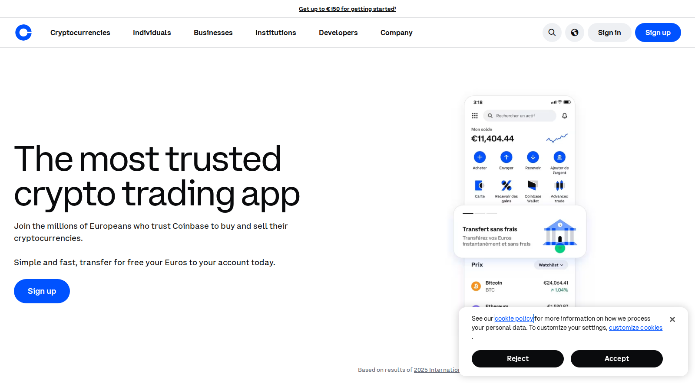
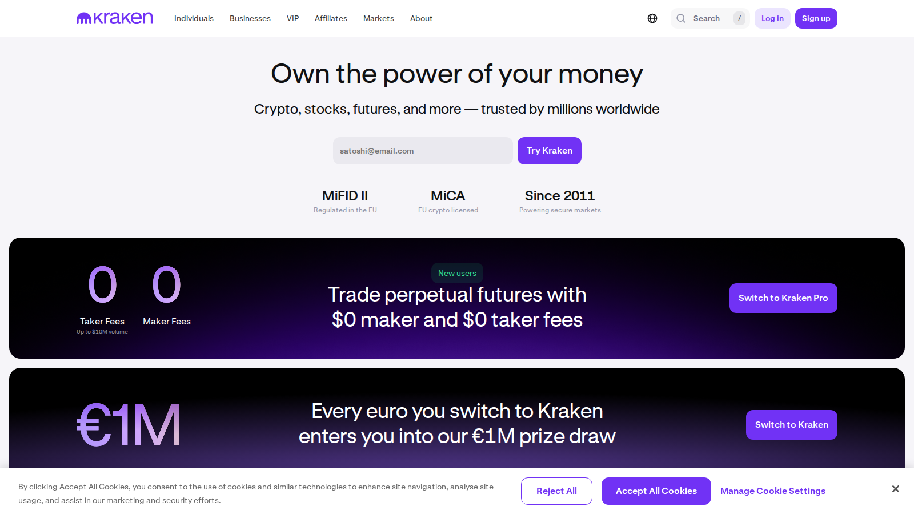
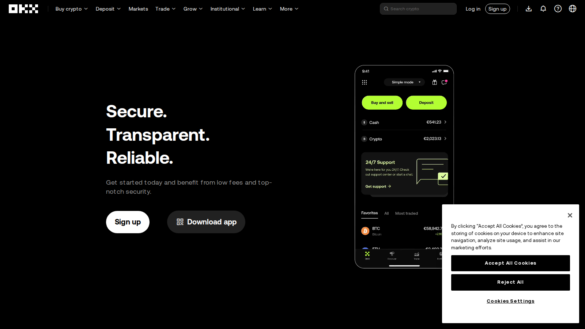

# Best Crypto Exchanges in 2026 for Beginners, Traders, and Altcoin Users

- Primary keyword: `best crypto exchanges 2026`
- Slug: `/exchanges/centralized/best-crypto-exchanges-2026`
- Meta title: `Best Crypto Exchanges 2026: Top Platforms Compared`
- Meta description: `A practical guide to the best crypto exchanges in 2026, including the top platforms for beginners, low fees, active traders, and broader altcoin access.`
- Schema: `Article` + `ItemList` + `BreadcrumbList` + optional `FAQPage`
- Last reviewed: `2026-07-10`
- Editorial standard: `This page ranks exchanges by user fit, trading depth, and custody practicality rather than by promotional copy. Recheck feature availability, local compliance posture, and fee tables before publication.`
- Internal-link targets:
  - `/exchanges/dex/`
  - `/exchanges/perp/`
  - `/how-to/buy-crypto/`
  - `/how-to/sell-crypto/`
  - `/wallets/hot-wallets/`

The crypto-exchange category is crowded, expensive to rank in, and full of affiliate copy that says the same thing. To be worth publishing in 2026, a "best crypto exchanges" page needs to do more than name familiar brands. It has to explain who each exchange is actually best for, what the user gives up in return, and why size is not the same as suitability.

To keep readers in-cluster, this page should link directly to [best decentralized exchanges](/exchanges/dex/best-decentralized-exchanges-2026), [best perpetual crypto exchanges](/exchanges/perp/best-perpetual-crypto-exchanges-2026), and [best hot wallets](/wallets/hot-wallets/best-hot-wallets-2026) so the exchange decision can transition into execution and custody guidance.

> Why you can trust this guide
>
> This article is based on live product pages and current public documentation reviewed in July 2026. We directly reviewed the public exchange surfaces, onboarding posture, and product framing of the shortlisted platforms. Where a claim still depends on logged-in trading, regional access, or a real deposit-and-withdrawal test, we keep that limit explicit instead of pretending it was fully verified.

## Visual evidence from our July 2026 review

*Coinbase homepage captured during our July 2026 review of centralized crypto exchanges.*

*Kraken homepage captured during our July 2026 review of crypto exchange platforms.*

*OKX homepage captured during our July 2026 review of exchange and trading platforms.*

## What are the best crypto exchanges in 2026?

The best crypto exchanges in 2026 include Binance, Coinbase, Kraken, Bybit, and OKX, with the right choice depending on whether the user values beginner simplicity, lower fees, broader altcoin selection, or more advanced trading tools. Binance remains central for broad market access, Coinbase remains strong for mainstream onboarding and brand familiarity, Kraken remains relevant for users who value an exchange with a more established trust-and-compliance reputation, and Bybit and OKX remain relevant for active traders who want broader product environments `[needs source]`.

There is no single best exchange for everyone. The useful answer is always segmented by user type.

## How we chose the best crypto exchanges

We evaluated exchanges through five filters.

First, ease of use: how quickly can a normal user understand funding, trading, and withdrawals? Second, product breadth: does the exchange support the trading style or asset access the user actually wants? Third, fee posture: not whether the fee is "low" in marketing terms, but whether the platform feels efficient for the intended user `[needs source]`. Fourth, trust posture: what does the exchange's brand, operating model, and user reputation imply? Fifth, exit logic: how easy is it to move assets out and not stay stuck inside the exchange as a permanent home? That last point is especially important if the user plans to withdraw into a [hot wallet](/wallets/hot-wallets/best-hot-wallets-2026) or move onward into a [DEX](/exchanges/dex/best-decentralized-exchanges-2026).

That last point matters because many exchange comparisons quietly assume users will keep too much on-platform for too long.

## Best exchange for beginners

For beginners, Coinbase and Kraken are often easier to recommend than the broadest trading venues.

That is because a beginner usually benefits from clearer onboarding and less visual overload. A simpler exchange can reduce user mistakes around order types, funding flows, and asset confusion. In many cases, the best beginner exchange is not the one with the largest market share. It is the one that makes the fewest avoidable mistakes likely.

The tradeoff is that beginners may eventually outgrow simpler exchange workflows once they care more about product breadth or fee sensitivity.

## Best exchange for low fees

For fee-conscious users, Binance, Bybit, and OKX often dominate the shortlist, though the exact answer depends on region, product, and trading behavior `[needs source]`.

This category should be read carefully. A low-fee exchange is not automatically the best value for every user. Someone who trades infrequently may care more about trust and ease of withdrawal than about shaving a small percentage off a trade. Meanwhile, active traders may care a lot about fee structure because it compounds over time.

That is why fee comparisons should always be paired with user-type segmentation.

## Best exchange for altcoin selection

For altcoin access, broader product venues usually matter more.

Users who care about narrative rotation, newer listings, or a deeper token catalog often rank exchanges differently from users who mainly buy large-cap assets. In that world, the exchange is not just a trading venue. It is a discovery environment. Binance, Bybit, and OKX stay relevant here because they are often discussed as product ecosystems rather than one-function apps `[needs source]`.

The tradeoff is that broader selection can also encourage weaker decision quality if users treat access as a reason to overtrade.

## Best exchange for active traders

For active traders, Bybit, Binance, and OKX usually make more sense than beginner-first platforms.

That is because active traders often care more about interface density, derivatives support, execution feel, and product flexibility than about simplified onboarding. They need an exchange that behaves like a serious trading environment.

The tradeoff is that a stronger trading environment is not automatically a stronger home for a beginner or a long-term buy-and-hold user.

## Binance vs Coinbase vs Kraken vs Bybit

| Exchange | Best for | Main strength | Main tradeoff |
|---|---|---|---|
| Binance | Broad crypto access | Wide product range and market relevance | Regional availability and custody questions |
| Coinbase | Beginners and mainstream users | Familiar brand and simpler entry path | Often not the first pick for cost-sensitive active traders |
| Kraken | Trust-oriented users | Cleaner trust posture and simpler environment | Less of a maximum-breadth trading ecosystem |
| Bybit | Active traders | Trader-centric product environment | Regional availability varies |
| OKX | Product-breadth users | Broad multi-product crypto platform | Can feel more complex for casual users |

The reason to compare exchanges this way is to stop readers from using the wrong standard. A beginner should not rank exchanges exactly like a derivatives-heavy trader.

## The biggest exchange risks in 2026

The first risk is custody complacency. Even the best exchange should not be treated as the permanent storage layer for a user's full portfolio.

The second risk is category confusion. Users often choose an exchange because it is "big" without asking whether it is actually a good fit for their behavior. A large exchange can still be the wrong home for a user who needs simpler onboarding or a user who wants more self-custody control. That is why this page should naturally connect readers to [perpetual-exchange decisions](/exchanges/perp/best-perpetual-crypto-exchanges-2026), [DEX decisions](/exchanges/dex/best-decentralized-exchanges-2026), and wallet custody decisions rather than presenting the CEX as the end of the workflow.

The third risk is jurisdiction blindness. Availability, product access, and even feature stability can vary by region, so a global list should always be read with a local-market check in mind.

## FAQ about crypto exchanges

### What is the best crypto exchange for most people?

For many people, Coinbase or Kraken is the easiest starting point, while Binance is more compelling for users who already know they want broader crypto-market access.

### What is the best exchange for low fees?

It is usually one of the broader trading venues such as Binance, Bybit, or OKX, but exact value depends on the user's location and trading style.

### Should I keep my crypto on an exchange?

Only to the extent needed for active trading or convenience. Strategic long-term holdings are usually better separated from exchange custody.

### What matters most when choosing an exchange?

Fit matters most: beginner ease, product breadth, trading depth, and trust posture should be weighted differently depending on the user.

## What we checked ourselves before ranking these exchanges

To write this comparison, we reviewed the live public product surfaces of the shortlisted exchanges and compared how each one frames onboarding, asset access, trading posture, and user workflow. We did that so the article would not collapse into a generic affiliate ranking where brand size does all the work.

That direct review does not replace a full deposit-trade-withdrawal test across the same user journey. But based on what we could verify directly from the public experience, one difference stood out immediately: some exchanges are trying to reduce friction for mainstream users, while others are clearly optimized for broader product depth and more active traders.

What stood out immediately was not just feature breadth. It was what kind of user each platform seems to expect. That is a strength if the reader already knows what kind of exchange experience they want, but a weakness if the page pretends one large platform is automatically right for everyone.

The screenshots above show why this matters. Coinbase presents itself as a trust-and-onboarding product first. Kraken presents a more regulation-and-market-access posture while still surfacing broader trading depth. OKX presents a more trading-oriented environment with low-fee and app-first cues visible early. That visual difference is not cosmetic. It usually tells you whether the exchange expects a beginner, a breadth-seeking trader, or a more active market participant.

## What we can verify directly, and what still needs deeper testing

From the public product flow we reviewed, we are comfortable making editorial judgments about exchange posture, user fit, and whether a platform feels more beginner-oriented, trader-oriented, or breadth-oriented. We are not yet comfortable assigning hard numbers for real fee burden, withdrawal friction, or end-to-end usability until a hands-on account test is completed.

In practice, that means this page should be read as an observed comparison first. If the newsroom later runs a deeper hands-on pass, the strongest upgrade would be original screenshots of onboarding, trade screens, withdrawal setup, and one or two examples where the real workflow felt worse than the surface suggested.

## What would make this review stronger in a full hands-on test

The best next upgrade is not stronger praise. It is stronger proof.

- A screenshot of signup or onboarding flow
- A screenshot of deposit, market-view, or order-entry flow
- A screenshot of withdrawal or transfer flow
- A short video showing the path from login to a placed order or prepared withdrawal
- One captured fee disclosure, warning prompt, or confusing UX element

That kind of evidence would make the article feel more like a real editorial buying guide and less like exchange directory copy.

## Suggested media and embeds

- A side-by-side table comparing beginner fit, active-trader fit, altcoin breadth, and custody tradeoffs across Binance, Coinbase, Kraken, Bybit, and OKX.
- One chart showing spot-versus-derivatives context or exchange-market-share context from a cited research source.
- An annotated "before you deposit" checklist graphic covering KYC, withdrawal rules, region support, and post-buy self-custody planning.

## External references and official product pages

- [Binance](https://www.binance.com/en)
- [Coinbase](https://www.coinbase.com/)
- [Kraken](https://www.kraken.com/)
- [Bybit](https://www.bybit.com/)
- [OKX](https://www.okx.com/)
- [Forbes Advisor crypto exchange guide](https://www.forbes.com/advisor/investing/cryptocurrency/best-crypto-exchanges/)

## Editor source checklist

- Binance official site or help center `[needs source]`
- Coinbase official site or help center `[needs source]`
- Kraken official site or help center `[needs source]`
- Bybit official site or help center `[needs source]`
- OKX official site or help center `[needs source]`
- Forbes Advisor best crypto exchanges page
