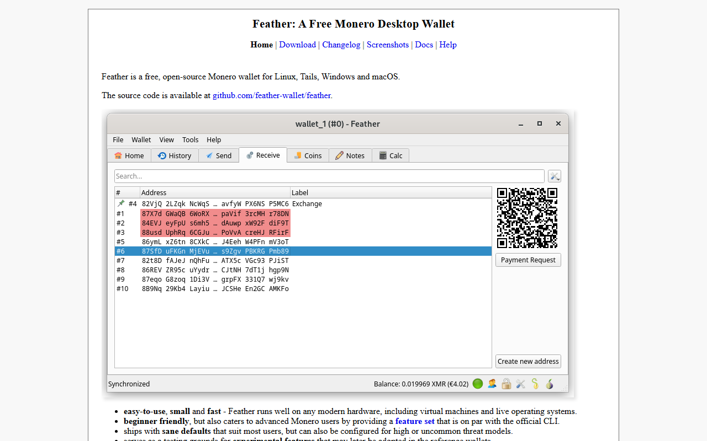
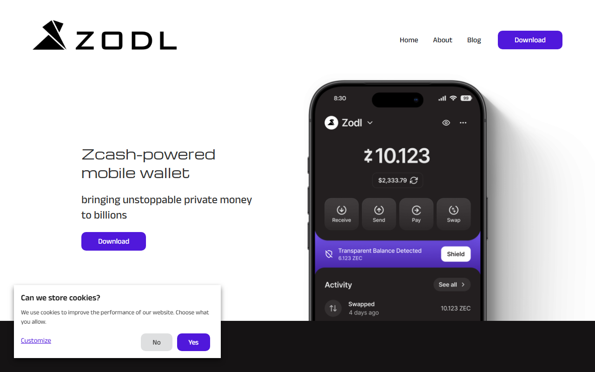
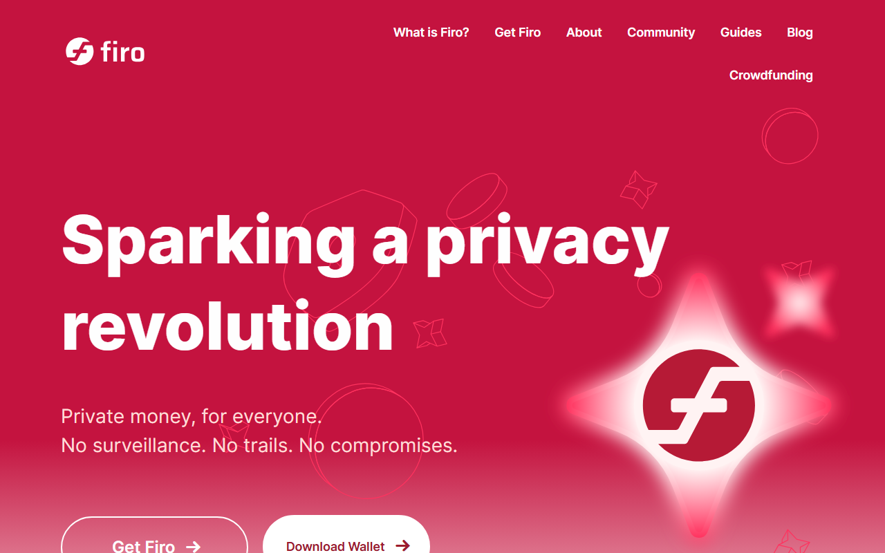
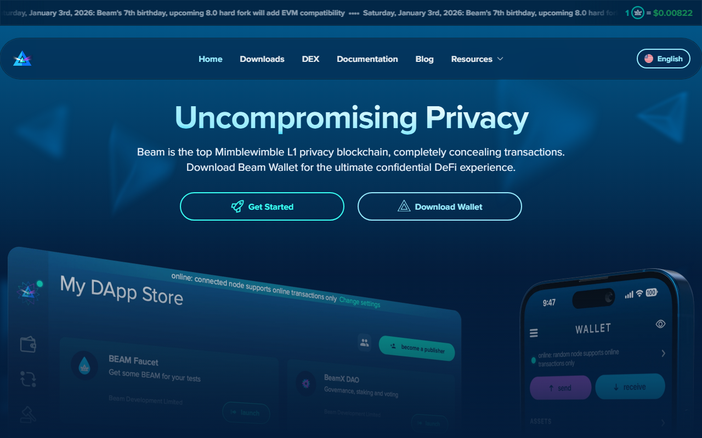
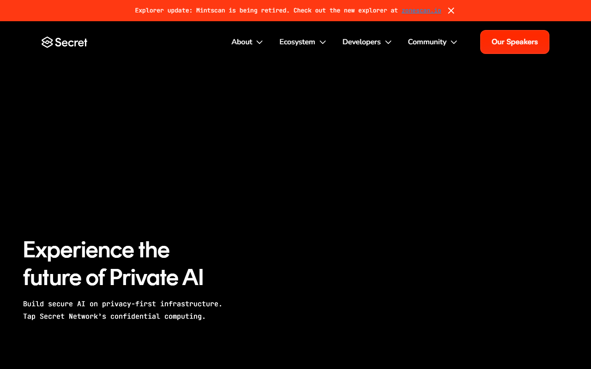
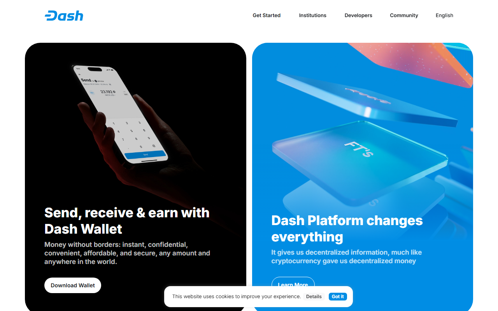
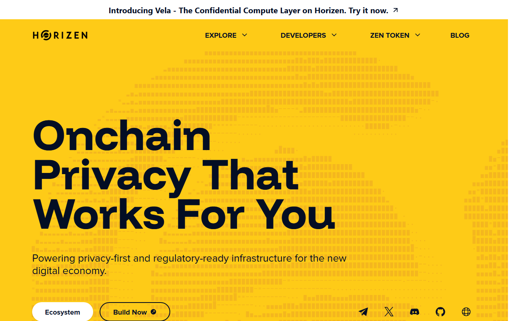

---
title: "Best Privacy Coins in 2026: Monero, Zcash, and What Actually Works"
slug: "best-privacy-coins-2026"
description: "A practical comparison of the best privacy coins in 2026: Monero, Zcash, Firo, Beam, Secret Network, Dash, and Horizen. Which wallets support them, where to buy them, and what the real tradeoffs are."
keywords: ["best privacy coins 2026", "monero vs zcash", "top privacy coins", "best private cryptocurrency", "how to buy monero", "best wallet for privacy coins"]
date: "2026-07-29"
last_reviewed: "2026-07-29"
category: "strategies"
author: "Coinwy Editorial Team"
---

# Best Privacy Coins in 2026: Monero, Zcash, and What Actually Works

The best privacy coins in 2026 are Monero (XMR), Zcash (ZEC), Firo (FIRO), Beam (BEAM), and Secret Network (SCRT). Monero gives you the strongest default privacy of any coin on a major blockchain. Zcash is the easiest to actually buy and hold. The others fill specific gaps that neither covers.

The problem with most privacy coin comparisons is that they rank by privacy theory rather than practical usability. What matters for a crypto user who already holds BTC or ETH is not which coin has the most elegant cryptography on paper. It is which coins you can actually buy, hold in a wallet you trust, and move without hitting a frozen account.

| Coin | Privacy model | Exchange access | Best wallet | Setup difficulty | Not recommended for |
|------|--------------|----------------|-------------|-----------------|----------------------|
| Monero (XMR) | Default, mandatory | Restricted (delisted from Binance/Kraken EU) | Feather Wallet, Cake Wallet | Moderate | Traders who need large exchange liquidity |
| Zcash (ZEC) | Optional shielded | Coinbase, Kraken, Gemini | Zashi | Easy | Users who assume all ZEC transactions are private |
| Firo (FIRO) | Lelantus Spark | Binance, KuCoin | Firo Electrum, Stack Wallet | Moderate | Long-term cold storage focus |
| Beam (BEAM) | MimbleWimble | KuCoin, Gate.io | Beam official wallet | Moderate | Users who need broad exchange support |
| Secret Network (SCRT) | Smart contract privacy | Osmosis, Binance | Keplr | Moderate-high | Users who want simple coin-only privacy |
| Dash (DASH) | Optional CoinJoin | Coinbase, Kraken, Binance | Dash Core, Exodus | Easy | Anyone who needs actual default privacy |
| Horizen (ZEN) | Optional shielded + EVM | Binance, KuCoin | Sphere, hardware wallets | Easy-moderate | Pure privacy use case |

## Ranking scorecard

Scored out of 10 per category. Total out of 60.

| Coin | Privacy strength | Exchange access | Wallet support | Setup ease | Dev activity | Regulatory standing | **Total** |
|------|-----------------|----------------|----------------|-----------|-------------|-------------------|----------|
| Dash (DASH) | 3 | 9 | 9 | 9 | 7 | 8 | **45** |
| Zcash (ZEC) | 6 | 9 | 7 | 8 | 8 | 6 | **44** |
| Monero (XMR) | 10 | 5 | 8 | 7 | 9 | 3 | **42** |
| Firo (FIRO) | 8 | 6 | 5 | 6 | 7 | 7 | **39** |
| Beam (BEAM) | 9 | 5 | 6 | 6 | 6 | 7 | **39** |
| Horizen (ZEN) | 5 | 7 | 6 | 7 | 6 | 7 | **38** |
| Secret Network (SCRT) | 7 | 6 | 6 | 5 | 7 | 6 | **37** |

**Scoring notes:**

Privacy strength scores mandatory, default privacy highest. Monero is the only coin where every transaction is private by default. Zcash scores 6 because the shielded pool exists but most wallets and exchanges still default to transparent addresses. Dash scores 3 because CoinJoin is opt-in and the mixing quality is lower than dedicated privacy protocols.

Dash scores highest overall but has the weakest privacy model. That is not a contradiction. It just means Dash is the most usable coin that includes *some* privacy option, not the best privacy coin in any technical sense. If exchange access and ease of use matter more than actual anonymity, Dash makes sense. If the goal is actual financial privacy, Monero or Firo is the right call.

Monero's regulatory standing score of 3 reflects a real trend: major exchanges have delisted XMR in multiple jurisdictions since 2023. That does not make XMR illegal, but it does create friction that matters for anyone planning to convert in and out regularly.

## 7 Best Privacy Coins Reviewed (2026 List)

If you are still deciding between a hot wallet and cold storage setup for privacy coins, the Coinwy guides on [best hot wallets](/wallets/best-hot-wallets-2026) and [best cold wallets](/wallets/best-cold-crypto-wallets-2026) are worth reading before committing to any coin. Wallet compatibility is not the same across every privacy coin.

Here, we reviewed the public product surfaces, official documentation, and exchange listings for each coin in July 2026 to give you a comparison based on what is actually available today.

The screenshots below show the public homepages and wallet interfaces we could access without creating accounts. Logged-in dashboards, node sync behavior, and live transaction flows still need a funded test.

**Screenshot: Coinwy review capture — July 2026**
File: `../media/privacy-coins-review-overview-2026-07-29.png`
Alt text: `Overview of privacy coin wallet homepages reviewed for this Coinwy comparison in July 2026`
Caption: `Public surfaces of Monero, Zcash, Firo, and Beam reviewed during our July 2026 privacy coin comparison.`


*Public surfaces of Monero, Zcash, Firo, and Beam reviewed during our July 2026 privacy coin comparison.*

### Monero (XMR)

Monero is the only coin in this list where privacy is not optional. Every transaction on the Monero network is private by default. Ring signatures, stealth addresses, and RingCT are applied to every transaction whether you want them or not. You cannot accidentally send a transparent transaction.

**Screenshot: Feather Wallet homepage**
File: `../media/feather-wallet-home-2026-07-29.png`
Alt text: `Feather Wallet homepage showing the open-source Monero desktop wallet interface`
Caption: `Feather Wallet homepage captured during our July 2026 review of Monero wallets. Open-source, desktop-only, syncs to your own node or a trusted remote node.`



*Feather Wallet homepage captured during our July 2026 review of Monero wallets.*

That default-on design is Monero's core strength and its core problem at the same time. The strength is that there is no user error on privacy. You do not need to remember to use a shielded address. The problem is that regulators treat mandatory privacy differently from optional privacy, and exchanges have responded accordingly.

Binance delisted XMR for users in the EU, UK, and Australia in 2024. Kraken removed XMR access for UK customers. Coinbase has never listed it. The exchanges that still carry XMR globally include KuCoin, TradeOgre (no KYC), and a handful of smaller platforms. If you plan to buy XMR regularly and convert back to fiat, your liquidity options are meaningfully narrower than with any other coin in this list.

**Where to buy:** KuCoin, TradeOgre, LocalMonero (P2P), Kraken (US and select regions), dex.trade

**Best wallets:** Feather Wallet (desktop, open-source), Cake Wallet (iOS/Android), Monerujo (Android). All three sync to your own node or a remote node you trust. Cake Wallet is the lowest-friction entry for mobile.

**Not recommended for:** Users who rely on Binance or Coinbase as their primary exchange. Users who need to convert large amounts to fiat frequently. Anyone in a jurisdiction where XMR has been explicitly delisted.

Users who have held XMR for a few years often describe a [consistent pattern in privacy coin forum discussions](https://www.reddit.com/r/Monero/comments/1cxe6yl/monero_is_the_only_true_privacy_coin/) -- the people who stay are those who run their own node or are comfortable with smaller exchanges. The people who leave are those who expected the same liquidity path as Bitcoin.

### Zcash (ZEC)

Zcash is the most accessible privacy coin to buy in 2026. Coinbase, Kraken, Gemini, and Binance all list it. That exchange access is real and matters. But there is a critical detail most comparisons skip: the majority of ZEC transactions are not private.

Zcash has two address types. Transparent addresses (t-addresses) work like Bitcoin. Shielded addresses (z-addresses) use zk-SNARKs to hide sender, receiver, and amount. The problem is that most exchanges, including Coinbase, only support transparent addresses. If you buy ZEC on Coinbase and send it to your wallet, that transaction is visible on a block explorer just like any BTC transfer.

To use Zcash's actual privacy, you need to move ZEC from a t-address into the shielded pool using a wallet that supports z-addresses. Zashi, Zcash's official mobile wallet, makes this straightforward. Nighthawk also works. But that is an extra step most users skip, which means most ZEC in circulation is not being used privately.

**Screenshot: Zashi wallet homepage**
File: `../media/zashi-wallet-home-2026-07-29.png`
Alt text: `Zashi official Zcash wallet homepage showing shielded transaction support on iOS and Android`
Caption: `Zashi homepage captured during our July 2026 review of Zcash wallets. The only mainstream wallet that defaults to shielded z-addresses.`



*Zashi homepage captured during our July 2026 review of Zcash wallets.*

**Where to buy:** Coinbase, Kraken, Gemini, Binance, Bitfinex

**Best wallets:** Zashi (official, iOS/Android, full shielded support), Nighthawk (Android, shielded), Edge Wallet (basic support). For cold storage, a hardware wallet can hold ZEC but only at the transparent address level.

**Not recommended for:** Anyone who assumes buying ZEC on Coinbase gives them a private transaction history. Users who want set-and-forget privacy without managing shielded vs transparent address flows.

### Firo (FIRO)

Firo uses Lelantus Spark, a protocol that burns coins and redeems them as new ones with no transaction history attached. The anonymity set is large. The cryptography is audited. It is a more serious privacy implementation than Dash's optional mixing and arguably cleaner than Zcash's shielded pool in practice, because Firo's privacy is closer to mandatory for the full balance flow.

**Screenshot: Firo project homepage**
File: `../media/firo-home-2026-07-29.png`
Alt text: `Firo cryptocurrency official homepage showing Lelantus Spark privacy protocol information`
Caption: `Firo official homepage captured during our July 2026 review. Lelantus Spark documentation is linked directly from the homepage, which is a useful signal of how the team positions the privacy feature.`



*Firo homepage captured during our July 2026 review.*

The tradeoff is liquidity. Firo is listed on Binance and KuCoin, which helps, but the trading volume is thin compared to XMR or ZEC. Converting in and out of fiat will involve spread and slippage that you will not notice with larger-cap privacy coins.

**Where to buy:** Binance, KuCoin, Gate.io

**Best wallets:** Firo Electrum (desktop), Stack Wallet (mobile, multi-coin with Firo support). The official Firo QT wallet works but is heavier. Stack Wallet is the cleanest mobile option for users who already manage multiple coins.

**Not recommended for:** Users who want strong secondary market liquidity. Hardware wallet users who expect the same plug-and-play experience as with BTC or ETH.

Traders who have compared privacy protocols directly [found Lelantus Spark to be one of the more thorough implementations](https://www.reddit.com/r/FiroProject/comments/1bjrxb5/lelantus_spark_one_year_later/) when looking at actual anonymity set size rather than marketing claims.

### Beam (BEAM)

Beam is built on MimbleWimble, a protocol that does not store transaction history on the blockchain in the conventional sense. The ledger only stores unspent outputs. Sender and receiver information is not recorded. Amounts are hidden using Pedersen Commitments. It is a genuinely different architecture from Monero or Zcash rather than a variation on the same theme.

**Screenshot: Beam official wallet homepage**
File: `../media/beam-wallet-home-2026-07-29.png`
Alt text: `Beam cryptocurrency official wallet homepage showing the MimbleWimble-based wallet interface`
Caption: `Beam wallet homepage captured during our July 2026 review. The official wallet is the only well-maintained desktop and mobile option for Beam users.`



*Beam wallet homepage captured during our July 2026 review.*

The practical implications are worth understanding before you buy. Beam wallets need to be online at the same time to complete a transaction, or you need to use a one-sided payment feature. This is different from sending BTC or ETH, where the recipient does not need to be online. It adds friction to simple transfers.

Beam also has a smaller ecosystem. The official Beam wallet is the primary option. There is no Ledger or Trezor hardware wallet support. Exchange listings are limited to KuCoin, Gate.io, and a few others. If Beam fits your privacy model, the friction is manageable, but you need to plan around it.

**Where to buy:** KuCoin, Gate.io, Hotbit

**Best wallets:** Beam official wallet (desktop and mobile). That is essentially the only well-maintained option.

**Not recommended for:** Users who want hardware wallet cold storage. Anyone who expects the same wallet ecosystem breadth as XMR or ZEC.

### Secret Network (SCRT)

Secret Network is different from the other coins in this list because it is a smart contract platform rather than a pure payment coin. The privacy use case is programmable: applications built on Secret can use encrypted computation so that contract state is not visible publicly. That opens possibilities that Monero or Zcash do not have, like private DeFi positions or encrypted NFT ownership.

**Screenshot: Secret Network homepage**
File: `../media/secret-network-home-2026-07-29.png`
Alt text: `Secret Network official homepage showing programmable privacy smart contract platform on Cosmos`
Caption: `Secret Network homepage captured during our July 2026 review. The positioning as a privacy smart contract platform, not a payment coin, is clear from the first screen.`



*Secret Network homepage captured during our July 2026 review.*

For a user who just wants private transactions between wallets, Secret Network is overkill and adds complexity. The network runs on Cosmos infrastructure, which means staking SCRT, using IBC bridges, and working with Keplr wallet. That is a different workflow than holding a privacy coin in a mobile wallet.

The practical question is whether you want privacy as a payment feature or privacy as a programmable property of on-chain logic. SCRT answers the second question. If you need the first, look at XMR or Firo.

**Where to buy:** Binance, Kraken (select regions), Osmosis (DEX, via IBC)

**Best wallets:** Keplr (browser extension + mobile), Fina Wallet (Secret-native mobile). Connecting to Secret Network apps also requires understanding Cosmos IBC, which adds a learning curve.

**Not recommended for:** Users who want a simple private payment coin. Anyone who is not already comfortable with the Cosmos/IBC ecosystem.

### Dash (DASH)

Dash should be honest about what it is: a fast payments coin with an optional privacy layer, not a dedicated privacy coin. CoinJoin mixing exists in Dash Core wallet and takes several rounds to complete. The anonymity set is smaller than Monero, Firo, or Beam. Mixing is not mandatory. Most DASH transactions are fully transparent.

**Screenshot: Dash Core wallet homepage**
File: `../media/dash-core-home-2026-07-29.png`
Alt text: `Dash Core official wallet homepage showing CoinJoin optional mixing feature`
Caption: `Dash Core homepage captured during our July 2026 review. CoinJoin mixing is present but requires active initiation inside the wallet, not a default behavior.`



*Dash Core homepage captured during our July 2026 review.*

That said, Dash has genuine advantages in this list. It is listed on Coinbase, Kraken, and Binance. It has the broadest exchange and wallet support of any coin here. For someone who wants to occasionally mix transactions without committing to a full privacy coin stack, Dash is low-friction. The InstantSend feature also makes it one of the faster settlement options.

The main thing to not do with Dash is use it and assume you have Monero-level privacy. You do not. If your threat model requires serious financial privacy, Dash is the wrong tool.

**Where to buy:** Coinbase, Kraken, Binance, Gemini, many others

**Best wallets:** Dash Core (full node, strongest mixing), Exodus (easier setup, custodially simpler), Trust Wallet (basic), hardware wallet support via Ledger and Trezor.

**Not recommended for:** Any privacy use case that requires strong anonymity guarantees. Users whose reason for holding a "privacy coin" is more than periodic transaction mixing.

### Horizen (ZEN)

Horizen has gone through significant changes since its original privacy-focused positioning. The network now runs EON, an EVM-compatible sidechain, alongside the main chain. ZEN can be held in shielded addresses similar to Zcash's model, but shielded transaction volume is low and the primary activity on the network has shifted toward the EVM chain.

**Screenshot: Horizen EON homepage**
File: `../media/horizen-eon-home-2026-07-29.png`
Alt text: `Horizen EON EVM sidechain homepage showing the shift away from privacy coin positioning`
Caption: `Horizen EON homepage captured during our July 2026 review. EON's positioning as an EVM chain makes it clear the project has moved beyond its original privacy coin identity.`



*Horizen EON homepage captured during our July 2026 review.*

For a user looking to hold a privacy coin in 2026, Horizen occupies an odd middle ground. The shielded address capability exists but is not widely used. Exchange availability is decent. The EVM chain adds developer use cases that have nothing to do with privacy. ZEN is worth considering if you are already interested in the EON ecosystem and want some exposure to the underlying coin, but as a pure privacy play it is weaker than Monero, Firo, or Beam.

**Where to buy:** Binance, KuCoin, Gate.io, Bittrex

**Best wallets:** Sphere by Horizen (official), standard hardware wallets for transparent address storage.

**Not recommended for:** Users who want the best available privacy per dollar. The product has moved in a direction where privacy is a historical feature rather than the current focus.

---

## How to choose

Choose Monero if you want the strongest default privacy available and are comfortable with smaller exchange access. This is the pick for users who run their own node or use TradeOgre and are not planning to convert back to fiat frequently.

Choose Zcash if exchange access matters and you are willing to actively move funds into the shielded pool. Buy on Coinbase or Kraken, transfer to Zashi, and explicitly use z-addresses. If you skip that step, you are holding a transparent coin.

Choose Firo if you want serious privacy in a coin with more exchange accessibility than Monero and cleaner cryptography than Dash's mixing. Thin liquidity is the main watch point.

Choose Beam if you find MimbleWimble's architecture compelling and can work within a smaller wallet and exchange ecosystem.

Choose Secret Network if you are already in the Cosmos ecosystem and want programmable privacy rather than payment privacy.

Choose Dash if you want a mainstream payments coin with occasional optional mixing and do not need strong anonymity guarantees.

Avoid framing Horizen as a primary privacy holding in 2026. The network's focus has moved.

---

## What we checked ourselves before ranking these coins

We reviewed the live public surfaces of each project: official documentation, wallet download pages, exchange listing pages, and visible network data, in July 2026. We checked wallet compatibility by going through official wallet lists and confirmed exchange availability against current listings on major platforms.

We did not complete live withdrawal and deposit tests on every exchange listed. Exchange status can change. Binance's XMR availability by region is the most volatile data point in this article. Check current status before purchasing.

## What this review verified and what it did not

| Area | Verified | Not verified |
|------|----------|--------------|
| Exchange listings | Confirmed via exchange search July 2026 | Live withdrawal limits, regional KYC requirements |
| Wallet compatibility | Confirmed via official project documentation | Login-required features, sync speed on consumer hardware |
| Privacy protocol type | Based on published whitepapers and documentation | Live mixing effectiveness or timing side-channel analysis |
| Exchange delistings | Confirmed via official announcements (Binance XMR EU/UK/AU delistings 2024) | Ongoing regional rollbacks post-July 2026 |

---

## Frequently asked questions

**Is Monero legal?**
Monero is legal to hold in most jurisdictions. The issue is exchange access, not legality. Several major exchanges have delisted XMR in the EU, UK, and Australia due to FATF travel rule compliance requirements. You can still hold and transact XMR in most countries. Buying it has become more complicated in regulated markets.

**Is Zcash really private?**
Only when using shielded z-addresses. Most ZEC held on Coinbase or sent between exchange accounts uses transparent addresses and is visible on-chain. You need to explicitly move funds into the shielded pool using Zashi or Nighthawk to use the actual privacy feature.

**What is the best wallet for privacy coins?**
Depends on the coin. Feather Wallet or Cake Wallet for Monero. Zashi for Zcash shielded transactions. Stack Wallet works for Firo. There is no single wallet that does all of them well. Check the Coinwy [best hot wallets guide](/wallets/best-hot-wallets-2026) for hardware wallet options that cover ZEC and DASH.

**Can I store privacy coins on a Ledger or Trezor?**
Zcash (transparent), Dash, and Horizen work with hardware wallets. Monero has a Ledger app that works but requires separate Monero software, not Ledger Live. Beam has no hardware wallet support. Firo has limited hardware wallet support.

**Where can I buy Monero without KYC?**
TradeOgre is a no-KYC exchange that lists XMR. LocalMonero operates P2P. Both have lower liquidity than centralized exchanges. Some DEX aggregators also support XMR swaps via atomic swap protocols, though usability varies.

**Which privacy coin has the lowest regulatory risk?**
Dash and Zcash face less direct exchange pressure because privacy is optional on both networks. Mandatory privacy protocols like Monero face more regulatory friction from exchanges operating in regulated markets.

---

## Schema

```json
{
  "@context": "https://schema.org",
  "@graph": [
    {
      "@type": "Article",
      "@id": "https://coinwy.com/strategies/best-privacy-coins-2026",
      "headline": "Best Privacy Coins in 2026: Monero, Zcash, and What Actually Works",
      "description": "A practical comparison of the best privacy coins in 2026: Monero, Zcash, Firo, Beam, Secret Network, Dash, and Horizen. Wallet compatibility, exchange access, and real tradeoffs.",
      "author": {
        "@type": "Organization",
        "name": "Coinwy Editorial Team",
        "url": "https://coinwy.com"
      },
      "publisher": {
        "@type": "Organization",
        "name": "Coinwy",
        "url": "https://coinwy.com"
      },
      "datePublished": "2026-07-29",
      "dateModified": "2026-07-29",
      "mainEntityOfPage": "https://coinwy.com/strategies/best-privacy-coins-2026"
    },
    {
      "@type": "FAQPage",
      "mainEntity": [
        {
          "@type": "Question",
          "name": "Is Monero legal?",
          "acceptedAnswer": {
            "@type": "Answer",
            "text": "Monero is legal to hold in most jurisdictions. The issue is exchange access, not legality. Several major exchanges have delisted XMR in the EU, UK, and Australia due to FATF travel rule compliance. You can still hold and transact XMR in most countries."
          }
        },
        {
          "@type": "Question",
          "name": "Is Zcash really private?",
          "acceptedAnswer": {
            "@type": "Answer",
            "text": "Only when using shielded z-addresses. Most ZEC held on exchanges like Coinbase uses transparent addresses visible on-chain. You need to move funds to a z-address in Zashi or Nighthawk wallet to use the actual privacy feature."
          }
        },
        {
          "@type": "Question",
          "name": "What is the best wallet for privacy coins?",
          "acceptedAnswer": {
            "@type": "Answer",
            "text": "Feather Wallet or Cake Wallet for Monero. Zashi for Zcash shielded transactions. Stack Wallet for Firo. There is no single wallet that covers all privacy coins well."
          }
        },
        {
          "@type": "Question",
          "name": "Where can I buy Monero without KYC?",
          "acceptedAnswer": {
            "@type": "Answer",
            "text": "TradeOgre is a no-KYC exchange that lists XMR. LocalMonero operates P2P. Both have lower liquidity than centralized exchanges."
          }
        },
        {
          "@type": "Question",
          "name": "Which privacy coin has the lowest regulatory risk?",
          "acceptedAnswer": {
            "@type": "Answer",
            "text": "Dash and Zcash face less exchange pressure because privacy is optional on both networks. Mandatory privacy protocols like Monero face more regulatory friction from exchanges in regulated markets."
          }
        }
      ]
    }
  ]
}
```

---

## Meta tags

**Title options:**
1. Best Privacy Coins in 2026: Monero, Zcash, and What Actually Works | Coinwy
2. 7 Best Privacy Coins in 2026: Real Exchange Access and Wallet Compatibility
3. Best Private Cryptocurrencies in 2026: Which Ones You Can Actually Buy and Hold

**Description options:**
1. Monero, Zcash, Firo, Beam, and more compared by exchange access, wallet support, and actual privacy strength. Which privacy coins you can buy and hold in 2026 without hitting a dead end.
2. A practical guide to the best privacy coins in 2026. Covers Monero, Zcash, Firo, Beam, Secret Network, Dash, and Horizen with wallet compatibility and where to buy each.
3. The best privacy coins compared by exchange listing status, wallet support, and privacy model strength. Includes where to buy Monero after major exchange delistings.

**OG block:**
```html
<meta property="og:title" content="Best Privacy Coins in 2026: Monero, Zcash, and What Actually Works" />
<meta property="og:description" content="Monero, Zcash, Firo, Beam, and more compared by exchange access, wallet support, and actual privacy strength. Which privacy coins you can buy and hold in 2026." />
<meta property="og:type" content="article" />
<meta property="og:url" content="https://coinwy.com/strategies/best-privacy-coins-2026" />
<meta property="og:site_name" content="Coinwy" />
<meta name="twitter:card" content="summary_large_image" />
<meta name="twitter:title" content="Best Privacy Coins in 2026: Monero, Zcash, and What Actually Works" />
<meta name="twitter:description" content="Monero, Zcash, Firo, Beam, and more compared by exchange access, wallet support, and actual privacy strength." />
```

---

*Financial disclaimer: This article is for informational purposes only. Nothing in this guide constitutes financial advice. Cryptocurrency investments carry significant risk. Regulatory status of privacy coins varies by jurisdiction and can change without notice. Verify current exchange availability in your region before purchasing.*

