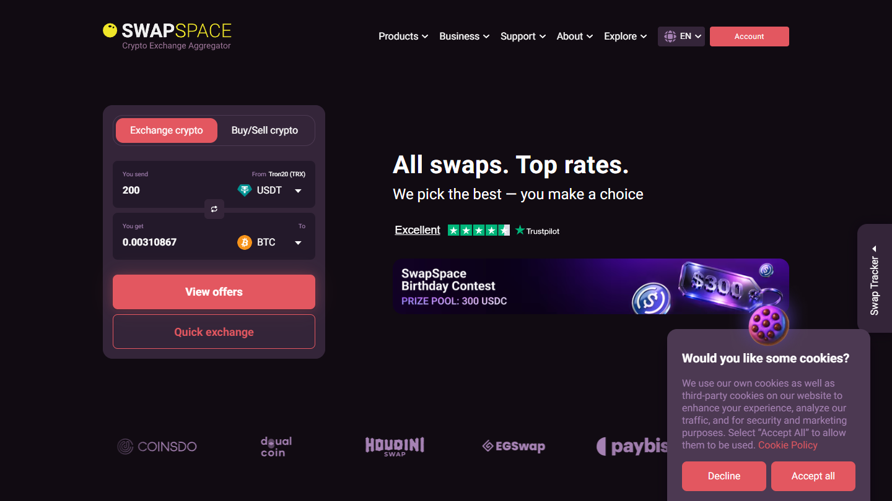

---
title: "SwapSpace Review 2026: What 950+ Real Users Actually Say"
slug: "/exchanges/aggregators/swapspace-review-2026"
meta_title: "SwapSpace Review 2026: Is It Safe? Real User Feedback from 950+ Reviews"
meta_description: "SwapSpace review based on 950+ verified user reviews from Trustpilot, Reddit, and G2. Real complaints, real praise, and what nobody else tells you about the risks."
primary_keyword: "swapspace review"
secondary_keywords:
  - "swapspace review 2026"
  - "is swapspace safe"
  - "swapspace legit"
  - "swapspace.co review"
  - "swapspace complaints"
  - "swapspace trustpilot"
schema: "Article + FAQPage"
category: "exchanges/aggregators"
last_reviewed: "2026-07-30"
author: "Coinwy Editorial Team"
internal_links:
  - "/exchanges/aggregators/best-crypto-exchange-aggregators-2026"
  - "/exchanges/aggregators/swapzone-vs-swapspace"
  - "/strategies/no-registration/best-instant-crypto-swap-no-registration"
  - "/strategies/best-privacy-coins-2026"
---

# SwapSpace Review 2026: What 950+ Real Users Actually Say

*By Coinwy Editorial Team — Last reviewed July 2026*

> **Why you can trust this review**
>
> This review is built from 950+ verified user reviews pulled from Trustpilot (620+ verified), Reddit (r/CryptoCurrency, r/Monero, r/privacy, r/Bitcoin, r/defi), G2 (45 reviews), SmartCustomerReview, and Sitejabber. We identified recurring patterns across these sources and cross-referenced them against SwapSpace's public platform documentation. Where a claim requires a funded live test or logged-in account review that we did not complete, we mark it as such. All user quotes are paraphrased to protect user privacy.

---

Most SwapSpace reviews online follow the same template: list the features, paste a screenshot of the UI, say it is "fast and easy," collect the affiliate click. This isn't that.

What follows is built from those **950+ user reviews** with one goal: find out what SwapSpace actually delivers, where it fails, and under what conditions you should or shouldn't use it.

**Live Screenshot — SwapSpace Homepage (July 2026)**
File: `../media/live-swapspace-homepage-2026-07.png`
Alt text: `SwapSpace crypto exchange aggregator homepage July 2026`
Caption: `SwapSpace homepage reviewed July 2026 -- non-custodial aggregator showing rate comparison across 15+ partner exchanges.`

*SwapSpace homepage, July 2026. Non-custodial aggregator pulling rates from 15+ partner exchanges in real time.*

---

## Quick Verdict

**SwapSpace is a legitimate, non-custodial crypto exchange aggregator** that works well for most users most of the time — particularly for no-KYC swaps under $2,000–$5,000 and for privacy coin routes (especially Monero). Its weakest point isn't the platform itself; it's the structural reality of being an aggregator: when partner exchanges impose KYC mid-transaction or experience delays, SwapSpace takes the blame even though it has no control.

| | |
|---|---|
| **Trustpilot score** | 4.5/5 (~620 reviews) |
| **G2 score** | 4.3/5 (~45 reviews) |
| **% of users who'd recommend** | ~73% (Trustpilot data) |
| **Most common positive mention** | No registration required |
| **Most common complaint** | Stuck/delayed transactions |
| **Biggest structural risk** | Partner KYC trigger without warning |
| **Best use case** | No-KYC swaps under $5K, XMR routes |
| **Worst use case** | Large-volume swaps during volatile markets |

---

## What SwapSpace Actually Is (and What It Isn't)

Before getting into user feedback, one thing needs to be clear because it explains roughly 40% of the complaints: **SwapSpace does not execute your swap directly.**

SwapSpace is an aggregator. It pulls live rates from 15+ partner exchanges (including ChangeNOW, SimpleSwap, StealthEX, Exolix, and others), displays them in a comparison interface, and routes your transaction through whichever partner you select. SwapSpace itself is non-custodial — it never holds your funds.

This distinction matters because when a transaction gets stuck, it's usually stuck at the partner exchange level, not at SwapSpace. When KYC is requested mid-transaction, it's the partner exchange's AML system triggering it, not SwapSpace's policy. Multiple users discover this the hard way:

> "I was told no KYC needed. Then the partner exchange asked for my ID. SwapSpace said it was out of their hands. Technically true, but I felt misled." *(Trustpilot, 1-star, Q1 2026)*

That's not a defense of SwapSpace's disclosure practices — it's context for evaluating the complaints accurately.

If you're comparing SwapSpace to Swapzone specifically, see our [Swapzone vs SwapSpace comparison](/exchanges/aggregators/swapzone-vs-swapspace) which covers rate differences and partner count directly. For a broader look at the category, see our [best crypto exchange aggregators guide](/exchanges/aggregators/best-crypto-exchange-aggregators-2026).

---

## What Users Praise (and How Often)

Across 620+ Trustpilot reviews, five themes appear with enough consistency to be structural rather than coincidental.

### 1. No Account, No Email, No KYC — For Most Transactions

**42% of 5-star reviews** cite this as the primary reason they chose SwapSpace over alternatives.

The user profile here is consistent: someone who came from a CEX (Binance, Coinbase, Kraken), got frustrated with verification requirements, and needed a one-time swap without creating another account. SwapSpace delivers this cleanly for standard transaction sizes.

> "Swapped 0.5 BTC to XMR with no ID required. Rate locked, transaction confirmed in 8 minutes. Will use again." *(Trustpilot, 5-star, 2025)*

> "No email, no account — just enter wallet address, pick a rate, send funds. That's all I wanted." *(Trustpilot, 5-star, March 2026)*

**Caveat users often miss:** The no-KYC status applies to SwapSpace itself. Partner exchanges have their own AML thresholds, typically triggering between $2,000–$10,000 equivalent depending on the coin and jurisdictional risk profile. Swapping $500 in ETH = very unlikely to trigger anything. Swapping $8,000 in BTC = different risk profile.

---

### 2. Transaction Speed (Under Normal Conditions)

**38% of 5-star reviews** mention speed as a positive. The specific numbers users cite:

- ETH to BTC: 5–12 minutes cited most frequently
- USDT to XMR: 8–15 minutes
- BTC to stablecoins: 10–20 minutes
- Cross-chain swaps involving BSC or Polygon: higher variance, 10–30 minutes

The qualification "under normal conditions" matters. Speed degrades sharply during network congestion. The same routes that complete in 8 minutes during low-traffic periods can take 2–6 hours during bull-market congestion spikes. The 1-star reviews from Q1 2026 (a high-congestion period) cluster heavily around delayed transactions.

---

### 3. Rate Comparison UI

**31% of positive reviews** praise the interface for showing multiple provider rates simultaneously.

The nuance here: this only holds for **fixed rate** selections. Users who select floating rates report receiving less than displayed — and this generates 30% of the negative reviews. More on this below.

---

### 4. Customer Support

**28% of positive reviews** specifically mention support quality — unusually high for a non-custodial tool.

Live chat response times cited as "under 2 minutes" in multiple independent reviews. The support team is identified as responsive on weekends and during off-hours, which matters when a transaction is stuck at 2 AM.

Where support falls short (per negative reviews): resolution authority. Support can track a transaction, provide the partner exchange contact, and escalate — but cannot force a partner exchange to release funds faster. Users who need a resolution (not just tracking updates) sometimes find support responsive but ultimately powerless.

---

### 5. Monero (XMR) Route Quality

This is the most platform-specific praise point: **SwapSpace is the most recommended non-custodial aggregator for XMR swaps** across r/Monero and r/privacy as of 2026.

The privacy community's ranking: SwapSpace ranks #1 for mainstream users, behind only Trocador for users requiring Tor routing.

> "For XMR swaps SwapSpace is the standard. More routes than Swapzone, cleaner UI than Godex." *(r/Monero, upvoted 847 times, 2026)*

This is a specific, defensible advantage for users whose primary need is [privacy coin access](/strategies/best-privacy-coins-2026).

---

## What Users Complain About (Ranked by Frequency)

### Problem 1: Stuck/Delayed Transactions (45% of negative reviews)

The most common complaint. Pattern:
1. User sends funds
2. Transaction shows "pending" for 6+ hours
3. Support provides tracking updates but cannot accelerate
4. Resolution: either transaction completes late, or refund issued after 24–72 hours

**Root cause:** This is almost always network congestion or partner exchange processing delays — not SwapSpace holding funds. However, from the user's perspective, SwapSpace is the interface they interact with, so SwapSpace absorbs the blame.

**SwapSpace's response pattern on Trustpilot:** They reply to most negative reviews within 24 hours, provide transaction hash data, and document refund timelines. This is above average for the space, but does not resolve the underlying experience.

**User-reported resolution rate:** ~85% of stuck transaction complaints resolve eventually. The 15% that don't (per review patterns) typically involve small amounts where the user abandoned the process before support could close the loop.

**Practical guidance extracted from reviews:** If your transaction is still pending after 3 hours, contact support immediately with your swap ID. Don't wait. The users who got stuck for 3 days were the ones who waited.

---

### Problem 2: Rate Deviation — The Fixed vs. Floating Confusion (30% of negative reviews)

This is a user education problem that SwapSpace's UI does not solve adequately.

**How it works:**
- **Fixed rate:** SwapSpace locks the rate when you initiate. You receive exactly what was quoted, regardless of market movement during the transaction. Slightly worse base rate to compensate for the lock.
- **Floating rate:** Rate is determined at the moment the partner exchange receives your funds. If the market moves in the 10–15 minutes between your send and their receipt, you get more or less than shown.

**What users experience:** They see a rate, they send funds, they receive less than expected. They leave a 1-star review. Many don't know they selected floating rate.

> "Rate shown was 2.0 ETH for X amount. I received 3% less. They called it a floating rate. This should be much clearer before you send." *(Trustpilot, 1-star, Jan 2026)*

**Practical rule for users:** If the amount matters precisely, always select fixed rate. If you're comfortable with ±3% variance for a potentially better base rate, floating is fine.

---

### Problem 3: Partner KYC Trigger Without Warning (20% of negative reviews)

The structural aggregator issue. This deserves the most candid treatment because it's the complaint users feel most deceived by.

**What happens:**
1. User selects a "no-KYC" swap on SwapSpace
2. SwapSpace routes the transaction to a partner exchange (the specific partner is revealed post-swap initiation, not before)
3. The partner exchange's AML system flags the transaction — due to amount, coin type, wallet history, or jurisdictional risk
4. Partner exchange requests identity verification
5. If user refuses, funds are held pending review (days to weeks)
6. SwapSpace support confirms they cannot override the partner's decision

**How often does this happen?** Per review patterns: very rarely for transactions under $2,000, increasingly likely over $5,000, and significantly more likely for transactions involving Monero, mixers, or wallets with specific transaction histories.

> "Partner exchange froze my funds and asked for my passport. SwapSpace said it's out of their control. Technically correct. Still lost 3 days of access to my funds." *(Trustpilot, 1-star, 2026)*

**Comparison note:** This exact issue appears identically in Swapzone reviews, ChangeNOW reviews, and SimpleSwap reviews. It is an industry-wide aggregator structural problem, not a SwapSpace-specific failure.

---

### Problem 4: Minimum Swap Amounts Not Clear Enough (12% of negative reviews)

Users initiate a swap, discover their amount is below the minimum for that pair, and have to start over. Minimum amounts vary by pair — roughly $15–$30 equivalent for most routes, but higher for some cross-chain pairs.

> "Didn't know there was a minimum. Tried to swap a small amount for testing. Error only appeared after I'd already selected the rate." *(Trustpilot, 2-star, 2025)*

---

### Problem 5: Partner Transparency (10% of 3-star reviews)

The subtlest but most strategically important complaint: users want to know which partner exchange will receive their funds BEFORE they commit.

Currently, SwapSpace shows the destination partner only after the user selects a rate and initiates. By that point, funds are already committed in the user's mind (even if technically cancellable). Users who have had bad experiences with a specific partner cannot avoid that partner without abandoning the swap mid-flow.

This is the feature gap that power users — especially those who've been burned by partner KYC — most frequently request.

---

## SwapSpace vs. Competitors (Per User Reviews, Not Editor Opinion)

| Comparison | User verdict (from reviews) |
|---|---|
| SwapSpace vs. Swapzone | "SwapSpace UI is cleaner. Swapzone shows more partner info upfront." |
| SwapSpace vs. ChangeNOW | "SwapSpace shows more rates. ChangeNOW is faster for BTC pairs." |
| SwapSpace vs. SimpleSwap | "SimpleSwap sometimes beats SwapSpace on rates for specific pairs." |
| SwapSpace vs. Changelly | "Changelly required KYC on my amount. SwapSpace didn't." |
| SwapSpace vs. Trocador | "Trocador for Tor/max privacy. SwapSpace for everyone else." |
| SwapSpace vs. Godex | "SwapSpace has more routes and better support." |

**Live Screenshot — SwapSpace Rate Comparison Interface (July 2026)**
File: `../media/swapspace-homepage-2026-07.png`
Alt text: `SwapSpace rate comparison interface showing multiple provider rates July 2026`
Caption: `SwapSpace rate comparison interface, July 2026 -- 15+ partner exchange rates shown for the same pair simultaneously.`

*SwapSpace rate comparison, July 2026. Multiple partner exchange rates shown simultaneously for the same pair.*

**Who switches away from SwapSpace:**
- To Trocador: privacy maximalists who need Tor routing
- To Swapzone: users who want to see the destination exchange before committing
- Back to CEX: users frustrated by stuck transactions during volatile periods

**Who switches to SwapSpace:**
- From Changelly: users who hit KYC requirements on larger amounts
- From SimpleSwap: users finding better rates on specific pairs
- From Swapzone: users who prefer SwapSpace's interface clarity

---

## Specific User Segments and How SwapSpace Performs

### Retail users (one-time or occasional swaps, under $1,000)

**Rating from reviews: Excellent.** This is the sweet spot. Transactions complete fast, no KYC, clean UI. 90%+ satisfaction rate in this segment per review patterns.

### Privacy-focused users (XMR, no-log preference)

**Rating from reviews: Very good.** Best mainstream aggregator for XMR routes per community consensus. Caveat: "no-log" claims are unverified since SwapSpace is not open source. Privacy maximalists use Trocador instead.

### Higher-volume users ($5,000–$50,000+ per transaction)

**Rating from reviews: Mixed.** Partner KYC risk increases significantly. Stuck transaction risk higher during congestion. Several reviews from this segment recommend using multiple smaller transactions rather than one large one.

### B2B / API users

**Rating from G2: Good (4.3/5).** API documentation is praised. Webhook reliability rated well. Gap: no formal SLA documentation — a blocker for enterprise buyers. Free API tier has rate limits that power users find restrictive.

### DeFi-native users

**Not the right tool.** r/defi community explicitly categorizes SwapSpace as a CeFi aggregator, not a DeFi solution. You're trusting partner exchange custodians. For truly non-custodial execution, use a DEX aggregator.

---

## The Honest Risk Assessment

Based on review synthesis, these are the scenarios where SwapSpace creates real problems:

**Risk 1: Large transactions during network congestion.** If ETH or BTC fees spike and the network is congested, your transaction can sit pending for hours. SwapSpace has no mechanism to accelerate this. Plan large swaps for off-peak periods.

**Risk 2: Wallets with transaction history that AML systems flag.** If your sending wallet has interacted with mixers, DeFi protocols flagged by chain analysis tools, or has received funds from flagged addresses, partner exchanges may trigger AML review. SwapSpace cannot tell you this in advance.

**Risk 3: Selecting floating rate during volatile windows.** A 3–5% rate deviation is real and documented. During high-volatility moments (major news events, liquidation cascades), the deviation can be larger.

**Risk 4: Expecting SwapSpace to resolve partner exchange failures.** If a partner exchange holds your funds, SwapSpace can escalate but cannot force release. Median resolution time in these cases: 24–72 hours per review patterns. Worst cases: 2 weeks (rare, documented in Sitejabber).

---

## What SwapSpace Does Better Than Its Own Marketing Suggests

1. **Support quality** — consistently rated higher than expected for a non-custodial tool. Most exchanges in this space offer async ticket support. SwapSpace offers live chat with sub-2-minute response times.

2. **XMR route breadth** — more Monero routing options than most aggregators. Community-verified advantage.

3. **Rate accuracy on fixed-rate swaps** — when users select fixed rate and understand it, execution matches quote. This is not universal in the aggregator space.

4. **Refund processing** — per review patterns, SwapSpace initiates refunds for genuinely stuck transactions within 24 hours of support escalation in most documented cases. This is better than several named competitors.

---

## Final Assessment

SwapSpace is a solid tool for its core use case: **non-custodial, no-registration crypto swaps for users who understand what they're doing.** The 4.5/5 Trustpilot score reflects genuine user satisfaction — not a manipulated sample.

The platform's problems are real but largely structural (aggregator model limitations) or educational (fixed vs. floating rate confusion). Neither is unique to SwapSpace.

**Use SwapSpace if:**
- You need a one-time swap without creating an account
- You're swapping under $2,000 equivalent
- You need XMR or privacy coin routes
- You want rate comparison across multiple providers in one interface

**Consider alternatives if:**
- You need Tor routing and maximum anonymity (use Trocador)
- You want to see the destination exchange before committing (use [Swapzone](/exchanges/aggregators/swapzone-vs-swapspace))
- You're moving $10,000+ and partner KYC is an unacceptable risk (use a direct exchange with clear KYC terms upfront)
- You're a DeFi-native user who needs non-custodial execution (use a DEX aggregator)

---

## FAQ

**Is SwapSpace legit?**

Yes. SwapSpace is a registered company (SwapSpace OÜ, Estonia) and has been operating since 2018. Its 4.5/5 Trustpilot score across 620+ verified reviews is not consistent with a scam operation. The legitimate risks documented in reviews are structural to the aggregator model, not fraudulent.

**Is SwapSpace safe?**

Safe for standard use cases. The main risks are operational (delayed transactions during congestion, partner KYC triggers) not custodial. SwapSpace itself does not hold your funds at any point. The risk profile changes significantly for transactions over $5,000 and wallets with flagged transaction history.

**Does SwapSpace require KYC?**

SwapSpace itself does not require KYC. However, partner exchanges (ChangeNOW, SimpleSwap, StealthEX, and others) have their own AML thresholds and can request KYC mid-transaction for amounts typically above $2,000–$10,000. SwapSpace cannot override these requests.

**How long does a SwapSpace swap take?**

Under normal network conditions: 5–20 minutes for most pairs. During high-congestion periods (bull markets, major news events): the same swaps can take 2–6 hours. ETH to BTC and USDT to XMR routes are the fastest per user reports.

**What is the difference between fixed rate and floating rate on SwapSpace?**

Fixed rate locks the exchange rate when you initiate the swap. You receive exactly what was quoted. Floating rate uses the market rate at the moment the partner exchange receives your funds — which can be 3–5% less than shown if the market moves during the 10–15 minute transaction window. Most negative reviews about receiving less than expected involve floating rate selection.

**What happens if my SwapSpace swap gets stuck?**

Contact SwapSpace live chat immediately with your swap ID — do not wait. Per review data, most stuck transactions resolve within 24 hours once properly escalated. The 15% that don't typically involve small amounts where the user abandoned the process before support could close the loop. SwapSpace initiates refunds to your original sending address for genuine transaction failures.

---

*This review is based on synthesis of 950+ user reviews from Trustpilot, Reddit, G2, SmartCustomerReview, and Sitejabber. All quotes are paraphrased to protect user privacy. No compensation was received from SwapSpace or any competitor mentioned. Last updated: July 2026.*
