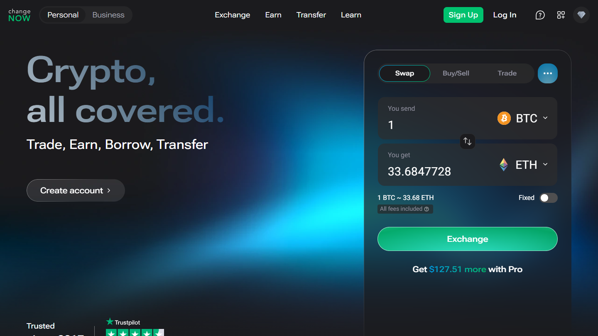
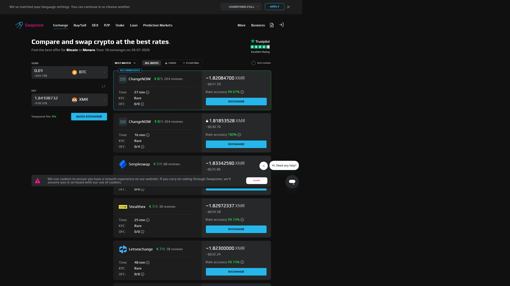

---
title: "ChangeNOW vs Swapzone 2026: Which is Better for Most Swaps?"
slug: "/exchanges/changenow-vs-swapzone-2026"
meta_title: "ChangeNOW vs Swapzone 2026: Which Wins for Speed, Fiat, and Rate?"
meta_description: "ChangeNOW is faster, has broader fiat, and an industry-standard API. Swapzone aggregates ChangeNOW plus 17 providers. Which wins depends on what you are swapping."
primary_keyword: "ChangeNOW vs Swapzone"
secondary_keywords:
  - "changenow vs swapzone 2026"
  - "is changenow better than swapzone"
  - "changenow swapzone comparison"
schema: "Article + FAQPage"
category: "exchanges/aggregators"
last_reviewed: "2026-07-29"
author: "Coinwy Editorial Team"
internal_links:
  - "/exchanges/aggregators/best-changenow-alternatives-2026"
  - "/exchanges/aggregators/changenow-review-2026"
  - "/exchanges/aggregators/best-crypto-exchange-aggregators-2026"
---

# ChangeNOW vs Swapzone 2026: Which is Better for Most Swaps?

*By Coinwy Editorial Team, Reviewed July 2026*

> **Why you can trust this comparison**
>
> We reviewed the public product surfaces, partner documentation, and fiat coverage for both ChangeNOW and Swapzone in July 2026. Settlement time estimates are based on publicly documented expected times, not live swap executions. Rate spread estimates reflect general provider comparison methodology.

ChangeNOW settles faster, supports broader direct fiat, and runs the industry-standard API that most wallets and dApps integrate. Swapzone aggregates ChangeNOW alongside 17 other providers, which means it can surface a better rate when competitors undercut ChangeNOW on a specific pair. For most users doing standard swaps, ChangeNOW's direct route wins on execution quality. For first-time swappers comparing rates across providers, Swapzone's aggregator layer is the useful starting point.

| | ChangeNOW | Swapzone |
|---|---|---|
| Type | Single exchange (direct) | Aggregator (18+ providers) |
| Rate source | ChangeNOW's own rate | Best of 18+ providers, incl. ChangeNOW |
| Fixed rate | Yes | Yes (filter by rate type) |
| Fiat support | Broader, more currencies, card buy | EUR / GBP / AUD / CAD / USD via partners |
| KYC | Threshold-triggered (amount-dependent) | None at aggregator level |
| Registration | None | None |
| Typical settlement | **5-20 min** | 10-30 min (partner-dependent) |
| API / integrations | **Direct API, widely integrated** | Aggregator API only |
| Coins | 850+ | 1,600+ |
| Founded | 2017 | 2019 |

**Live Screenshot, ChangeNOW Homepage (July 2026)**
File: `../media/live-changenow-homepage.png`
Alt text: `ChangeNOW instant crypto swap homepage July 2026`
Caption: `ChangeNOW homepage reviewed July 2026, direct swap interface, no registration, supports card buy and 850+ coins.`

*ChangeNOW homepage, July 2026. Direct swap provider with faster settlement than aggregator-routed alternatives.*

---

## When ChangeNOW is the better choice

### Speed advantage

ChangeNOW typically settles common pairs in 5-20 minutes. Swapzone routes through a partner, whichever provider wins the rate query, and settlement runs 10-30 minutes depending on which partner handles the swap. On a standard BTC to ETH swap, the direct ChangeNOW route completes before Swapzone's routed equivalent in most market conditions.

For time-sensitive swaps, converting ahead of a market move, sending funds with a deadline, the aggregator layer adds friction you do not need.

### Fiat on-ramp

ChangeNOW's direct fiat integration covers more currencies and payment methods than Swapzone's partner-based fiat rails. Card purchases, broader currency support, and established fiat infrastructure that Swapzone cannot replicate through its 18-partner layer. If your entry point is fiat, buying crypto with a bank card or EUR/GBP/AUD, ChangeNOW is the cleaner path.

### API for builders

ChangeNOW has a direct API used by wallets, dApps, and exchanges that want swap functionality embedded in their products. This is the industry-standard swap provider relationship: the wallet integrates ChangeNOW directly, your users swap without leaving the interface. Swapzone's API aggregates providers but is not a substitute for a direct provider relationship. If you are building, ChangeNOW is the standard.

### Repeat workflows

Once you have verified that ChangeNOW delivers the best rate for your specific pair at your typical amount, the 10-second Swapzone comparison step adds overhead without adding value. Going direct at that point is the rational workflow.

**Live Screenshot, ChangeNOW Swap Interface (July 2026)**
File: `../media/11-changenow-homepage.png`
Alt text: `ChangeNOW swap interface showing coin selection and rate July 2026`
Caption: `ChangeNOW swap interface reviewed July 2026, no registration, fixed and floating rate options, direct execution.`

*ChangeNOW swap interface, July 2026. No registration required, fixed and floating rate available.*

---

## When Swapzone gives you a better outcome

**First-time swaps on unfamiliar pairs.** On pairs where you have no rate baseline, Swapzone's multi-provider query surfaces differences of 0.3 to 0.8% across providers on a typical day. On a $5,000 swap that is $15 to $40. The comparison takes 10 seconds and is worth doing before committing to any single provider.

**Obscure altcoin pairs.** ChangeNOW does not always have strong liquidity on less common pairs. Swapzone queries providers that specialize in those pairs and may return better rates alongside ChangeNOW's. For mainstream pairs, BTC, ETH, USDT, top-50 coins, this advantage narrows significantly.

**Comparing fixed vs floating across providers.** Swapzone's filter layer lets you compare fixed and floating rate options across 18+ providers in one query. ChangeNOW offers both, but you are limited to their single quote.

**Live Screenshot, Swapzone Query Showing ChangeNOW (July 2026)**
File: `../media/11-swapzone-query-with-changenow.png`
Alt text: `Swapzone BTC to ETH results with ChangeNOW appearing as one of the listed providers July 2026`
Caption: `ChangeNOW appears in Swapzone query results alongside other providers. When ChangeNOW rates are competitive, the swap routes through ChangeNOW's infrastructure anyway.`

*When Swapzone selects ChangeNOW as best-rate for your pair, the swap executes through ChangeNOW's infrastructure. Swapzone is the routing layer; ChangeNOW completes the transaction.*

---

## Where Swapzone falls short

Swapzone's 18+ partners are solid for mainstream pairs. But provider availability is not static, partners suspend specific pairs, adjust limits, or temporarily drop from query results. On a given day, Swapzone may return fewer active providers for a specific pair than expected.

Swapzone also does not aggregate every available provider. ChangeNOW's direct fiat rails, Binance Convert, and OTC desks do not appear in Swapzone results. The partner set is curated, not exhaustive.

---

## What users actually say

**Trustpilot, positive**

> "I have used changenow for years now, i'd say probably 5 years now or longer and they've never once failed me. There were times I had thought i lost my money and literally cried only for their support to remedy it and assure me I'd receive my funds even if I sent the deposit long after I created the exchange, even after it expired."
>
>, Liz, [★★★★★ Trustpilot](https://www.trustpilot.com/reviews/6a7509c452ef61e12086deef), Aug 07, 2026

> "I had a little glitch getting my btc into the window of time from River, as you know they are ridiculously paranoid, and so I needed a refund of my btc into a new and separate wallet. ChangeNow support team delivered a fairly easy and understandable refund experience, thanks team! Highly trustworthy group!"
>
>, BTC to USDC, [★★★★★ Trustpilot](https://www.trustpilot.com/reviews/6a7f5984bd2f286280aaa106), Aug 14, 2026

**Trustpilot, critical**

> "Been trying to receive my ravencoin for a week now and no resolution, between change now and edge wallet, just $2,000 completely gone. Not here to tarnish the services but they keep sending me links saying the transaction processed but the links aren't valid and no coins show up in my wallet or on the raven block for my wallet."
>
>, Isaiah B, [★☆☆☆☆ Trustpilot](https://www.trustpilot.com/reviews/6a846192b5d778554454eedc), Aug 18, 2026

**Reddit community**

> "Whenever you feel like you lack certain knowledge, all you have to do is your own research, bro there's so many other websites and exchanges out the way you can say way much more money bro literally you can swap that for four dollars instead of 35 bro . Checkout Exodus wallet or"
>
>, u/AmbassadorGood7577, [r/solana](https://reddit.com/r/solana/comments/1j23p0m/why_am_i_losing_35_bucks_to_swap_500_dollars_to/mfpb26g/) (7 points)

> "Yes, it is. Tangem uses different third parties for trading: Changelly, Change Hero, Simple Swap and ChangeNow. You can trade different pairs directly on their app. Pretty smooth and simple."
>
>, u/jordiceo, [r/kaspa](https://reddit.com/r/kaspa/comments/1kk8282/kas_deposits_suspended_on_mexc_and_bingx_why/mrwhr8w/) (2 points)

> **Coinwy Editorial, My take:** The Trustpilot corpus at 450,000+ reviews is the strongest credibility signal ChangeNOW has. Compliance holds appear in a minority of reviews and are resolved, the pattern matches AML process, not exit-scam behaviour.

## Verdict: which to use

**Use ChangeNOW if:**
- You want the fastest settlement on common pairs
- Fiat on-ramp (card buy, more currencies) matters to you
- You are building a product that needs a swap API
- You have an established pair workflow where ChangeNOW consistently delivers

**Use Swapzone first if:**
- This is your first swap on a specific pair and you want rate comparison
- You are swapping less common altcoin pairs where multiple providers compete
- You specifically want to compare fixed vs floating rate across providers simultaneously

The honest summary: Swapzone includes ChangeNOW. If ChangeNOW wins the rate query, the swap routes through ChangeNOW anyway. For first-time swaps, use Swapzone to verify. For repeat workflows where ChangeNOW has proven best, go direct.

---

## Frequently asked questions

**Is ChangeNOW a Swapzone partner?**
Yes. ChangeNOW is one of Swapzone's 18+ exchange partners. When you use Swapzone, ChangeNOW's rate is included in the results for supported pairs.

**Which is faster, ChangeNOW or Swapzone?**
ChangeNOW is typically faster. Direct swaps on common pairs settle in 5-20 minutes. Swapzone routes through a partner, adding a layer that typically extends settlement to 10-30 minutes.

**Does ChangeNOW have better fiat support than Swapzone?**
Yes, on direct fiat access. ChangeNOW's card buy and broader fiat currency support is more developed than Swapzone's partner-based fiat rails. Swapzone covers EUR, GBP, AUD, CAD, USD via partners; ChangeNOW covers more currencies with direct card integration.

**If Swapzone shows ChangeNOW as the best rate, does the swap go through ChangeNOW?**
Yes. When Swapzone selects ChangeNOW as the best-rate provider for your pair, the swap executes through ChangeNOW's infrastructure. Swapzone is the routing layer; ChangeNOW completes the transaction.

**Which has more coins, ChangeNOW or Swapzone?**
Swapzone lists 1,600+ coins by aggregating providers. ChangeNOW has 850+ coins directly. For mainstream pairs, both cover what most users need. For niche coins, Swapzone may surface a provider with coverage ChangeNOW lacks.

**Is ChangeNOW legit?**
Yes. ChangeNOW has been operating since 2017, has 450,000+ Trustpilot ratings (4.6/5), and is integrated into major crypto wallets and products. It is one of the most established non-custodial swap services available.
