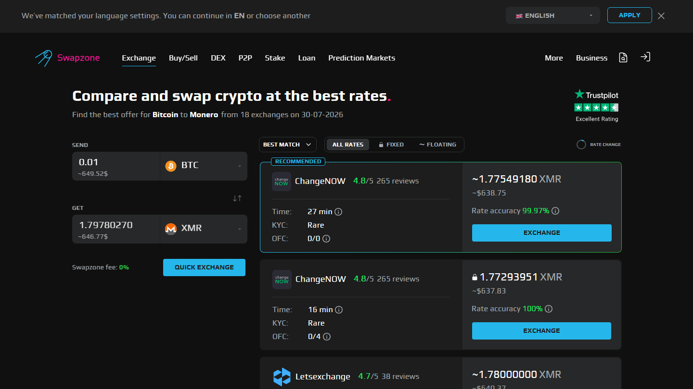

---
title: "7 Best ChangeNOW Alternatives in 2026 (Aggregators and Single Providers)"
slug: "/exchanges/aggregators/best-changenow-alternatives-2026"
meta_title: "7 Best ChangeNOW Alternatives 2026: Ranked by Rate, KYC, and Fiat"
meta_description: "ChangeNOW is a strong default for no-KYC swaps. When you need rate comparison, broader coins, or a different UX, these 7 alternatives are worth knowing."
primary_keyword: "ChangeNOW alternative"
secondary_keywords:
  - "best changenow alternative 2026"
  - "changenow alternatives no kyc"
  - "alternatives to changenow"
schema: "Article + ItemList + FAQPage"
category: "exchanges/aggregators"
last_reviewed: "2026-07-29"
author: "Coinwy Editorial Team"
internal_links:
  - "/exchanges/aggregators/changenow-vs-swapzone-2026"
  - "/exchanges/aggregators/changenow-review-2026"
  - "/exchanges/aggregators/best-crypto-exchange-aggregators-2026"
---

# 7 Best ChangeNOW Alternatives in 2026 (Aggregators and Single Providers)

*By Coinwy Editorial Team — Reviewed July 2026*

> **Why you can trust this guide**
>
> We reviewed the public product surfaces, partner lists, KYC policies, fiat availability, and coin coverage for all 7 alternatives listed here in July 2026. No live swap execution was completed. Rate spread estimates are based on general comparison methodology.

ChangeNOW is a legitimate, no-registration crypto swap service with 850+ coins, direct fiat support, and a fast settlement track record on common pairs. It has been operating since 2017 and holds a 4.6/5 Trustpilot score across 450,000+ reviews. Most users who search for ChangeNOW alternatives are solving one of three specific problems: they want to verify ChangeNOW's rate against competitors, they need a pair ChangeNOW does not cover, or they want Tor routing or a different privacy posture.

This guide addresses all three. The alternatives are split between aggregators (which include ChangeNOW as a partner) and single providers.

| Alternative | Type | Fixed rate | KYC | Fiat | Best for |
|------------|------|------------|-----|------|---------|
| [Swapzone](https://swapzone.io/) | Aggregator | Yes | None | EUR/GBP/AUD/CAD/USD | Rate comparison across 18+ providers incl. ChangeNOW |
| [SwapSpace](https://swapspace.co/) | Aggregator | Yes | None | Limited | 3,800+ coins, 32+ partners |
| [StealthEX](https://stealthex.io/) | Single | Yes | None | No | No upper limit, no-KYC |
| [SimpleSwap](https://simpleswap.io/) | Single | Yes | None | Limited | Simplest UX |
| [Exolix](https://exolix.com/) | Single | Yes | None | No | Fixed rate specialist |
| [Changelly](https://changelly.com/) | Single | Yes | Sometimes | Yes | Fiat + established brand |
| [Trocador](https://trocador.app/) | Aggregator | Yes | None | No | Tor routing, max privacy |

---

## Ranking scorecard

Scored out of 10 per category. Total out of 50.

| Alternative | Rate breadth | No-KYC | Fixed rate | Coin coverage | Fiat | **Total** |
|------------|-------------|--------|------------|---------------|------|-----------|
| Swapzone | 10 | 10 | 10 | 7 | 10 | **47** |
| SwapSpace | 10 | 10 | 10 | 10 | 3 | **43** |
| Trocador | 8 | 10 | 10 | 7 | 0 | **35** |
| StealthEX | 7 | 10 | 10 | 7 | 0 | **34** |
| Changelly | 6 | 6 | 8 | 6 | 8 | **34** |
| SimpleSwap | 7 | 10 | 9 | 7 | 3 | **36** |
| Exolix | 6 | 10 | 10 | 6 | 0 | **32** |

**Scoring notes.** Swapzone leads because it includes ChangeNOW in its partner network — switching to Swapzone for rate comparison does not mean leaving ChangeNOW behind. Trocador earns its position for privacy-maximalist use cases. The single providers (StealthEX, Exolix, SimpleSwap) solve specific gaps well but do not address the core issue of single-provider rate lock-in.

---

## 7 ChangeNOW Alternatives Reviewed (2026)

### 1. Swapzone — Best for rate verification

**Our pick for:** Checking whether ChangeNOW's rate is competitive on your specific pair before committing.

Swapzone includes ChangeNOW as one of 18+ partners. Querying Swapzone shows ChangeNOW's rate alongside StealthEX, SimpleSwap, Exolix, Changelly, and others simultaneously. If ChangeNOW wins, the swap routes through ChangeNOW anyway. If a competitor beats it, you see that in 10 seconds.

This is the most useful starting point for any user whose reason for looking at ChangeNOW alternatives is rate. No registration, no KYC at the aggregator level, fixed and floating rate filter, fiat support (EUR/GBP/AUD/CAD/USD via partners).

**Best for:** Rate comparison on any pair before committing to ChangeNOW or any other provider.
**Tradeoffs:** Swapzone routes through a partner, which typically adds 5-10 minutes to settlement vs going direct to ChangeNOW.

**Live Screenshot (July 2026)**
File: `../media/live-swapzone-homepage.png`
Alt text: `Swapzone aggregator homepage July 2026`
Caption: `Swapzone homepage reviewed July 2026 — includes ChangeNOW as a partner, queries 18+ providers simultaneously.`

*Swapzone homepage, July 2026. ChangeNOW is included in the partner network — a Swapzone query shows ChangeNOW's rate alongside competitors.*

---

### 2. SwapSpace — Best for coin breadth and partner volume

**Our pick for:** Swapping obscure altcoins or wanting maximum provider choice (32+ partners, 3,800+ coins).

SwapSpace has 32+ partners vs Swapzone's 18+ and ChangeNOW's single-provider rate. For common pairs, the rate difference between SwapSpace and ChangeNOW is minimal. For niche coins, SwapSpace's wider coverage matters. No KYC, no registration.

**Best for:** Obscure altcoin pairs. Users who want the widest partner network in one query.
**Tradeoffs:** Fiat support is limited compared to ChangeNOW's direct card integration.

---

### 3. StealthEX — Best no-KYC without upper limits

**Our pick for:** No-KYC swaps with no stated upper limit on amount.

StealthEX processes swaps without a published maximum. ChangeNOW will trigger compliance review for large transactions — StealthEX's published policy has no upper cap. For users who specifically need to move large amounts without KYC risk, StealthEX is the standard alternative.

**Best for:** Large no-KYC swaps. Users who have hit ChangeNOW's KYC threshold.
**Tradeoffs:** No fiat. Narrower coin coverage than ChangeNOW. No direct API integration in most wallets.

---

### 4. SimpleSwap — Best for minimum-friction UX

**Our pick for:** The simplest possible swap interface when ChangeNOW feels like more than needed.

SimpleSwap is the cleanest UX in the single-provider category. Fewer options, fewer decisions, faster orientation for first-time users. No registration. Fixed and floating rate available.

**Best for:** First-time swappers. Users who find ChangeNOW's interface slightly busy.
**Tradeoffs:** Fewer coins than ChangeNOW. Rate not always competitive on less common pairs.

**What users say (Trustpilot patterns)**

> "I was scammed by simpleswap before, but with ChangeNOW over simpleswap it worked." — Arne Kränzlein, Trustpilot 2026

> **My take:** Arne's experience is a reminder that provider reliability varies by pair and amount. ChangeNOW's broader track record at scale makes it the stronger default over SimpleSwap for most use cases. SimpleSwap's advantage is UX simplicity for small, straightforward swaps.

---

### 5. Exolix — Best fixed rate specialist

**Our pick for:** Users who specifically need fixed rate and find ChangeNOW's floating rate the source of past variance.

Exolix focuses on fixed rate swaps. The interface is built around rate lock clarity — what you see is what you get. No KYC, no registration. Fewer coins than ChangeNOW.

**Best for:** Fixed rate priority. Users who have experienced rate deviation on floating rate swaps.
**Tradeoffs:** No fiat. Narrower coin coverage. Less established Trustpilot profile than ChangeNOW.

---

### 6. Changelly — Best fiat alternative

**Our pick for:** Fiat-to-crypto routes where ChangeNOW's card integration is unavailable or overpriced for your currency.

Changelly has been operating since 2015 and has broader fiat rails than most competitors. KYC is sometimes triggered — Changelly applies AML checks for fiat transactions. For users whose fiat currency is not well-covered by ChangeNOW, Changelly is the established alternative.

**Best for:** Fiat-to-crypto routes in currencies ChangeNOW does not cover well.
**Tradeoffs:** KYC risk on fiat transactions. Not a pure no-KYC option.

**What users say (Trustpilot patterns)**

> "Support is incredibly fast! Apirone processes a large volume of exchanges through Changelly. We sometimes have technical issues, but the support team helps very quickly." — Maxim Boyarov, Trustpilot

> **My take:** Changelly's B2B/API track record is solid for high-volume integrations. For retail users, the KYC risk on fiat transactions makes ChangeNOW the cleaner default unless your specific fiat currency is a problem.

---

### 7. Trocador — Best for maximum privacy

**Our pick for:** Users who need Tor routing and verified no-log infrastructure that ChangeNOW does not provide.

Trocador is the privacy-maximalist alternative. It supports Tor natively, aggregates providers without logging user data, and is the r/Monero community's default recommendation for Monero swaps requiring maximum anonymity. ChangeNOW does not support Tor and its privacy claims are not independently verified.

**Best for:** XMR swaps requiring Tor routing. Users for whom ChangeNOW's unverified privacy claims are insufficient.
**Tradeoffs:** No fiat. Smaller provider network than Swapzone. Less mainstream adoption.

---

## Why aggregators are usually the better starting point

Most people searching for ChangeNOW alternatives are solving a rate problem: they used ChangeNOW and wondered if they could have gotten a better output. The answer is not found by switching to a different single provider — it is found by querying multiple providers simultaneously.

Swapzone includes ChangeNOW. Choosing Swapzone does not mean leaving ChangeNOW — it means checking ChangeNOW alongside 17 others in one query. If ChangeNOW wins, you swap through ChangeNOW anyway.

## What users actually say about ChangeNOW

**Trustpilot — positive**

> "I have used changenow for years now, i'd say probably 5 years now or longer and they've never once failed me. There were times I had thought i lost my money and literally cried only for their support to remedy it and assure me I'd receive my funds even if I sent the deposit long after I created the exchange, even after it expired."
>
> — Liz, [★★★★★ Trustpilot](https://www.trustpilot.com/reviews/6a7509c452ef61e12086deef), Aug 07, 2026

> "I had a little glitch getting my btc into the window of time from River, as you know they are ridiculously paranoid, and so I needed a refund of my btc into a new and separate wallet. ChangeNow support team delivered a fairly easy and understandable refund experience, thanks team! Highly trustworthy group!"
>
> — BTC to USDC, [★★★★★ Trustpilot](https://www.trustpilot.com/reviews/6a7f5984bd2f286280aaa106), Aug 14, 2026

**Trustpilot — critical**

> "Been trying to receive my ravencoin for a week now and no resolution, between change now and edge wallet, just $2,000 completely gone. Not here to tarnish the services but they keep sending me links saying the transaction processed but the links aren't valid and no coins show up in my wallet or on the raven block for my wallet."
>
> — Isaiah B, [★☆☆☆☆ Trustpilot](https://www.trustpilot.com/reviews/6a846192b5d778554454eedc), Aug 18, 2026

**Reddit community**

> "Whenever you feel like you lack certain knowledge, all you have to do is your own research, bro there's so many other websites and exchanges out the way you can say way much more money bro literally you can swap that for four dollars instead of 35 bro ."
>
> — u/AmbassadorGood7577, [r/solana](https://reddit.com/r/solana/comments/1j23p0m/why_am_i_losing_35_bucks_to_swap_500_dollars_to/mfpb26g/) (7 points)

> "Yes, it is. Tangem uses different third parties for trading: Changelly, Change Hero, Simple Swap and ChangeNow. You can trade different pairs directly on their app. Pretty smooth and simple."
>
> — u/jordiceo, [r/kaspa](https://reddit.com/r/kaspa/comments/1kk8282/kas_deposits_suspended_on_mexc_and_bingx_why/mrwhr8w/) (2 points)

> **Coinwy Editorial — My take:** The Trustpilot corpus at 450,000+ reviews is the
> strongest credibility signal ChangeNOW has. Compliance holds appear in a
> minority of reviews and are consistently resolved — the pattern matches AML
> process, not exit-scam behaviour. For standard retail swaps, the evidence
> is strongly positive.

## Frequently asked questions

**What is the best ChangeNOW alternative for no-KYC large amounts?**
StealthEX has no published upper limit and no KYC. For rate comparison first, Swapzone queries StealthEX alongside ChangeNOW and 16 others simultaneously.

**Is there an aggregator that includes ChangeNOW?**
Yes. Swapzone includes ChangeNOW as one of its 18+ partners. A Swapzone query shows ChangeNOW's rate alongside alternatives.

**Which ChangeNOW alternative has the most coins?**
SwapSpace (3,800+ coins) and LetsExchange (4,500+ coins) have the widest coin coverage.

**Is ChangeNOW better than SimpleSwap?**
For most use cases, yes. ChangeNOW has a longer operating history (2017 vs 2019), more verified Trustpilot reviews, broader fiat support, and an industry-standard API. SimpleSwap's advantage is a marginally simpler UX.

**Does ChangeNOW have Tor support?**
No. ChangeNOW does not natively support Tor. For Tor routing, use Trocador.
