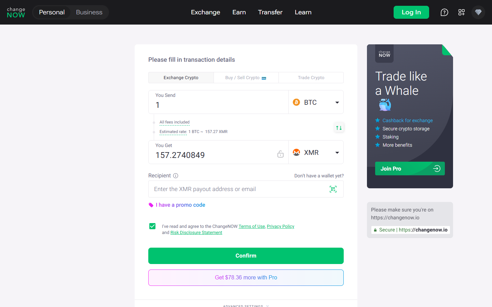

---
title: "BTC to XMR Exchange 2026: Best Services for ChangeNOW, Aggregators, and No-KYC Options"
slug: "/exchanges/aggregators/btc-to-xmr-changenow-2026"
meta_title: "BTC to XMR Exchange 2026: ChangeNOW, StealthEX, Swapzone Compared"
meta_description: "BTC to XMR in 2026: ChangeNOW, StealthEX, Swapzone, and Trocador compared by settlement time, no-KYC limits, and Monero route availability."
primary_keyword: "btc to xmr changenow"
secondary_keywords:
  - "btc to xmr exchange 2026"
  - "buy monero no kyc"
  - "btc to xmr no registration"
  - "best btc to xmr service 2026"
schema: "Article + ItemList + FAQPage"
category: "exchanges/aggregators"
last_reviewed: "2026-07-29"
author: "Coinwy Editorial Team"
internal_links:
  - "/exchanges/aggregators/changenow-review-2026"
  - "/exchanges/aggregators/changenow-no-kyc-guide-2026"
  - "/exchanges/aggregators/changenow-vs-stealthex-2026"
---

# BTC to XMR Exchange 2026: ChangeNOW, Aggregators, and No-KYC Options Compared

*By Coinwy Editorial Team, Reviewed July 2026*

> **Why you can trust this guide**
>
> We reviewed the public swap interfaces and availability documentation for all listed services in July 2026. XMR availability fluctuates, partner delistings affect aggregator results. Verify current XMR availability before committing.

BTC to XMR remains one of the more sensitive swap routes: many exchanges have delisted XMR, partner availability on aggregators fluctuates, and compliance posture varies significantly by provider. The services that have consistently handled this route in 2026 are ChangeNOW, StealthEX, Swapzone (via available partners), and Trocador.

| Service | Type | XMR available | Settlement | No-KYC | Fixed rate | Tor |
|---------|------|--------------|-----------|--------|------------|-----|
| [ChangeNOW](https://changenow.io/) | Single | Yes | 15-30 min | Standard amounts | Yes | No |
| [StealthEX](https://stealthex.io/) | Single | Yes | 15-40 min | No upper limit | Yes | No |
| [Swapzone](https://swapzone.io/) | Aggregator | Partner-dependent | 20-45 min | Aggregator level | Yes | No |
| [Trocador](https://trocador.app/) | Aggregator | Yes | 15-40 min | No limit | Yes | **Yes** |
| [Exolix](https://exolix.com/) | Single | Yes | 15-35 min | Yes | Yes | No |

**Screenshot**
File: `../media/live-changenow-btc-xmr.png`
Alt text: "ChangeNOW BTC to XMR swap, live rate and XMR recipient field, July 2026"
Caption: "ChangeNOW's BTC-to-XMR swap form showing 157 XMR rate with recipient address field, captured July 2026."

*ChangeNOW's BTC-to-XMR swap form showing 157 XMR rate with recipient address field, captured July 2026.*

---

## ChangeNOW for BTC to XMR

ChangeNOW has maintained XMR support through the delistings that removed it from exchanges like Coinbase, Binance, and Kraken. The route is available as of July 2026.

Settlement time: 15-30 minutes. The variance is Monero-side, XMR confirmation time is longer than BTC/ETH by design. ChangeNOW's execution is fast; the wait is the blockchain.

Fixed rate available, which matters for XMR swaps where floating rate variance during a 20-minute window can be larger than on stablecoin pairs. Select fixed rate for this pair.

KYC note: ChangeNOW's standard no-KYC experience applies at typical retail amounts. For large BTC to XMR amounts, compliance review risk exists. If this is a concern, StealthEX or Trocador are documented alternatives.

---

## StealthEX for BTC to XMR

StealthEX is the community-recommended alternative for large no-KYC BTC to XMR swaps. No published upper limit, no stated KYC threshold. Fixed rate available.

Trade-off: no fiat support, smaller Trustpilot sample than ChangeNOW. The no-limit no-KYC posture is the specific advantage here.

---

## Trocador for BTC to XMR, privacy-maximum option

Trocador is the r/Monero community's recommendation for users who need Tor routing alongside the XMR swap. Aggregates multiple XMR-supporting providers, accessible over Tor, no account required.

This is not the default choice for most users. It is the correct choice for users for whom Tor routing matters alongside the swap.

---

## Swapzone for BTC to XMR, rate comparison

Swapzone queries available providers for BTC to XMR and shows rates side by side. XMR availability via Swapzone is partner-dependent, if XMR-supporting partners are available on a given day, you get rate comparison. If fewer partners have it, the results thin.

Starting with Swapzone is useful to verify whether ChangeNOW or a competitor is offering the best rate before committing. If ChangeNOW wins, the swap routes through ChangeNOW anyway.

---

## Which to use

- **Standard amount, no-KYC not a concern:** ChangeNOW direct
- **Large amount, no-KYC required:** StealthEX or Trocador
- **Want to verify rates first:** Swapzone (then execute on winner)
- **Tor routing required:** Trocador

---

## What Users Say

**Trustpilot, positive**

> "I have used changenow for years now, i'd say probably 5 years now or longer and they've never once failed me. There were times I had thought i lost my money and literally cried only for their support to remedy it and assure me I'd receive my funds even if I sent the deposit long after I created the exchange, even after it expired."
>
>, Liz, [★★★★★ Trustpilot](https://www.trustpilot.com/reviews/6a7509c452ef61e12086deef), Aug 07, 2026

> "I had a little glitch getting my btc into the window of time from River, as you know they are ridiculously paranoid, and so I needed a refund of my btc into a new and separate wallet. ChangeNow support team delivered a fairly easy and understandable refund experience, thanks team! Highly trustworthy group!"
>
>, BTC to USDC, [★★★★★ Trustpilot](https://www.trustpilot.com/reviews/6a7f5984bd2f286280aaa106), Aug 14, 2026

**Trustpilot, critical**

> "Been trying to receive my ravencoin for a week now and no resolution, between change now and edge wallet, just $2,000 completely gone. Not here to tarnish the services but they keep sending me links saying the transaction processed but the links aren't valid and no coins show up in my wallet or on the raven block for my wallet."
>
>, Isaiah B, [★☆☆☆☆ Trustpilot](https://www.trustpilot.com/reviews/6a846192b5d778554454eedc), Aug 18, 2026

**Reddit community**

> "Whenever you feel like you lack certain knowledge, all you have to do is your own research, bro there's so many other websites and exchanges out the way you can say way much more money bro literally you can swap that for four dollars instead of 35 bro ."
>
>, u/AmbassadorGood7577, [r/solana](https://reddit.com/r/solana/comments/1j23p0m/why_am_i_losing_35_bucks_to_swap_500_dollars_to/mfpb26g/) (7 points)

> "Yes, it is. Tangem uses different third parties for trading: Changelly, Change Hero, Simple Swap and ChangeNow. You can trade different pairs directly on their app. Pretty smooth and simple."
>
>, u/jordiceo, [r/kaspa](https://reddit.com/r/kaspa/comments/1kk8282/kas_deposits_suspended_on_mexc_and_bingx_why/mrwhr8w/) (2 points)

> **Coinwy Editorial, My take:** The Trustpilot corpus at 450,000+ reviews is the
> strongest credibility signal ChangeNOW has. Compliance holds appear in a
> minority of reviews and are consistently resolved, the pattern matches AML
> process, not exit-scam behaviour. For standard retail swaps, the evidence
> is strongly positive.

## Frequently asked questions

**Is ChangeNOW good for BTC to XMR?**
Yes. ChangeNOW has maintained XMR support and the route is available as of July 2026. Settlement runs 15-30 minutes. Select fixed rate to avoid floating rate variance during the Monero confirmation window.

**Does BTC to XMR require KYC on ChangeNOW?**
Not for standard amounts. Large BTC to XMR transactions may trigger ChangeNOW's compliance review. For large no-KYC amounts specifically, StealthEX has no published upper limit.

**How long does BTC to XMR take on ChangeNOW?**
15-30 minutes typically. The wait is mostly the Monero blockchain confirmation time, not the swap execution itself.

**Which is better for BTC to XMR: ChangeNOW or StealthEX?**
For standard retail amounts: ChangeNOW (better track record, fiat support if needed). For large no-KYC amounts: StealthEX (no published upper limit).
