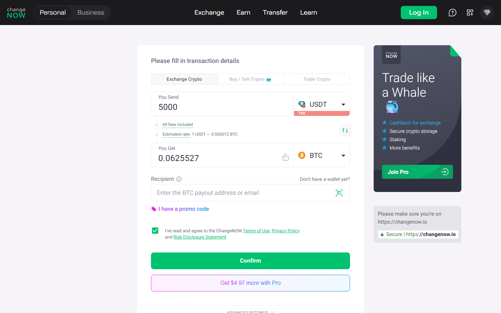

---
title: "USDT to BTC Exchange 2026: Best Rate With ChangeNOW and Alternatives"
slug: "/exchanges/aggregators/usdt-to-btc-changenow-2026"
meta_title: "USDT to BTC Exchange 2026: ChangeNOW vs Aggregators — Best Rate Guide"
meta_description: "USDT to BTC in 2026: ChangeNOW, Swapzone, and StealthEX compared by rate spread, settlement time, and no-KYC limits. Fixed vs floating rate guide included."
primary_keyword: "usdt to btc changenow"
secondary_keywords:
  - "usdt to btc exchange 2026"
  - "usdt to btc best rate"
  - "convert usdt to bitcoin no kyc"
schema: "Article + FAQPage"
category: "exchanges/aggregators"
last_reviewed: "2026-07-29"
author: "Coinwy Editorial Team"
internal_links:
  - "/exchanges/aggregators/changenow-review-2026"
  - "/exchanges/aggregators/changenow-vs-swapzone-2026"
  - "/exchanges/aggregators/changenow-no-kyc-guide-2026"
---

# USDT to BTC Exchange 2026: Best Rate With ChangeNOW and Alternatives

*By Coinwy Editorial Team — Reviewed July 2026*

> **Why you can trust this guide**
>
> We reviewed the public interfaces and documentation for ChangeNOW, Swapzone, StealthEX, and SimpleSwap in July 2026. Rate spread estimates are based on general provider comparison methodology, not live executed swaps.

USDT to BTC is one of the highest-volume crypto swap pairs. Provider rates on this pair are competitive — ChangeNOW, Swapzone's partners, and StealthEX all show rate differences of 0.1 to 0.5% on standard amounts. The settlement time, KYC posture, and fiat entry path are usually more important differentiators than rate for this pair.

| Service | Rate spread vs baseline | Settlement | No-KYC | Fixed rate |
|---------|------------------------|-----------|--------|------------|
| ChangeNOW | Competitive | **3-10 min** | Standard amounts | Yes |
| Swapzone | Best of 18+ providers | 5-20 min | None at aggregator level | Yes |
| StealthEX | Competitive | 5-20 min | No upper limit | Yes |
| SimpleSwap | Near-competitive | 5-25 min | Standard amounts | Yes |

**Screenshot**
File: `../media/live-changenow-usdt-btc.png`
Alt text: "ChangeNOW USDT to BTC swap — live estimated rate July 2026"
Caption: "ChangeNOW's USDT-to-BTC swap form with live rate, captured July 2026."

*ChangeNOW's USDT-to-BTC swap form with live rate, captured July 2026.*

---

## ChangeNOW for USDT to BTC

USDT to BTC is one of ChangeNOW's fastest pairs. Settlement runs 3-10 minutes on TRC20 USDT under normal network conditions — notably faster than most alternatives due to Tron's confirmation speed. ERC20 USDT runs 5-15 minutes.

Fixed rate is available and recommended for this pair. Floating rate variance of 0.5-1% is possible on USDT/BTC during active market sessions — the rate lock eliminates this.

**Minimum:** approximately $20-50 USDT equivalent (verify current minimum on ChangeNOW's interface before executing).

---

## Swapzone for rate comparison

Swapzone queries 18+ providers and shows live rate comparison for USDT to BTC. On this pair, rate differences between ChangeNOW and competitors are typically 0.2-0.4%. Whether that is worth the extra 5-10 minutes of settlement time (aggregator layer adds time) depends on your amount.

On $500 USDT to BTC: 0.3% difference = $1.50. On $5,000: $15. Use Swapzone if the amount justifies rate comparison. For smaller amounts, go direct.

---

## Which to use

| Amount | Recommendation |
|--------|---------------|
| Under $1,000 USDT | ChangeNOW direct — rate difference minimal |
| $1,000-$10,000 | Swapzone for rate check, execute on winner |
| Large no-KYC needed | StealthEX |

---

## Fixed rate vs floating rate for USDT to BTC

USDT is nominally stable but the BTC side moves. During the 3-10 minute execution window, BTC can move 0.5-1%. Fixed rate removes this variance. ChangeNOW's fixed rate shows a slightly lower base rate — typically 0.2-0.4% less than the floating quote — to price the lock.

For most users: select fixed rate. The certainty is worth the small premium.

---

## What Users Say

**Trustpilot — positive**

> "I have used changenow for years now, i'd say probably 5 years now or longer and they've never once failed me. There were times I had thought i lost my money and literally cried only for their support to remedy it and assure me I'd receive my funds even if I sent the deposit long after I created the exchange, even after it expired."
>
> — Liz, [★★★★★ Trustpilot](https://www.trustpilot.com/reviews/6a7509c452ef61e12086deef), Aug 07, 2026

> "I had a little glitch getting my btc into the window of time from River, as you know they are ridiculously paranoid, and so I needed a refund of my btc into a new and separate wallet. ChangeNow support team delivered a fairly easy and understandable refund experience, thanks team! Highly trustworthy group!"
>
> — BTC to USDC, [★★★★★ Trustpilot](https://www.trustpilot.com/reviews/6a7f5984bd2f286280aaa106), Aug 14, 2026

**Trustpilot — critical**

> "Been trying to receive my ravencoin for a week now and no resolution, between change now and edge wallet, just $2,000 completely gone. Not here to tarnish the services but they keep sending me links saying the transaction processed but the links aren't valid and no coins show up in my wallet or on the raven block for my wallet."
>
> — Isaiah B, [★☆☆☆☆ Trustpilot](https://www.trustpilot.com/reviews/6a846192b5d778554454eedc), Aug 18, 2026

**Reddit community**

> "Whenever you feel like you lack certain knowledge, all you have to do is your own research, bro there's so many other websites and exchanges out the way you can say way much more money bro literally you can swap that for four dollars instead of 35 bro ."
>
> — u/AmbassadorGood7577, [r/solana](https://reddit.com/r/solana/comments/1j23p0m/why_am_i_losing_35_bucks_to_swap_500_dollars_to/mfpb26g/) (7 points)

> "Yes, it is. Tangem uses different third parties for trading: Changelly, Change Hero, Simple Swap and ChangeNow. You can trade different pairs directly on their app. Pretty smooth and simple."
>
> — u/jordiceo, [r/kaspa](https://reddit.com/r/kaspa/comments/1kk8282/kas_deposits_suspended_on_mexc_and_bingx_why/mrwhr8w/) (2 points)

> **Coinwy Editorial — My take:** The Trustpilot corpus at 450,000+ reviews is the
> strongest credibility signal ChangeNOW has. Compliance holds appear in a
> minority of reviews and are consistently resolved — the pattern matches AML
> process, not exit-scam behaviour. For standard retail swaps, the evidence
> is strongly positive.

## Frequently asked questions

**Is ChangeNOW good for USDT to BTC?**
Yes. USDT to BTC is one of ChangeNOW's fastest and most liquid pairs. TRC20 USDT to BTC settles in 3-10 minutes typically. Fixed rate is available and recommended.

**How long does USDT to BTC take on ChangeNOW?**
3-10 minutes for TRC20 USDT input. 5-15 minutes for ERC20 USDT. Variance from BTC confirmation time on the output side.

**What is the minimum USDT to BTC on ChangeNOW?**
Approximately $20-50 USDT equivalent. Verify on ChangeNOW's live interface before executing — minimums adjust with market conditions.

**Should I use fixed or floating rate for USDT to BTC?**
Fixed rate is recommended for this pair. BTC moves during the execution window, which can create unfavorable floating rate outcomes. The fixed rate premium (0.2-0.4%) is the cost of certainty.
