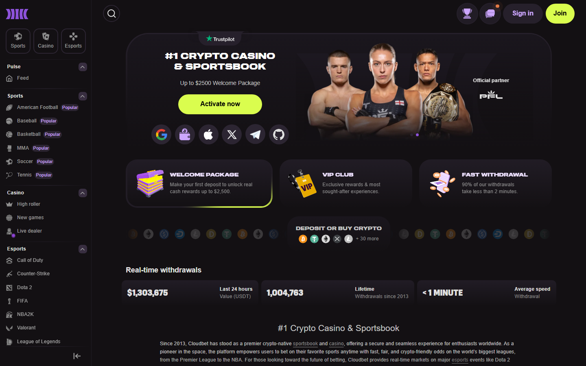
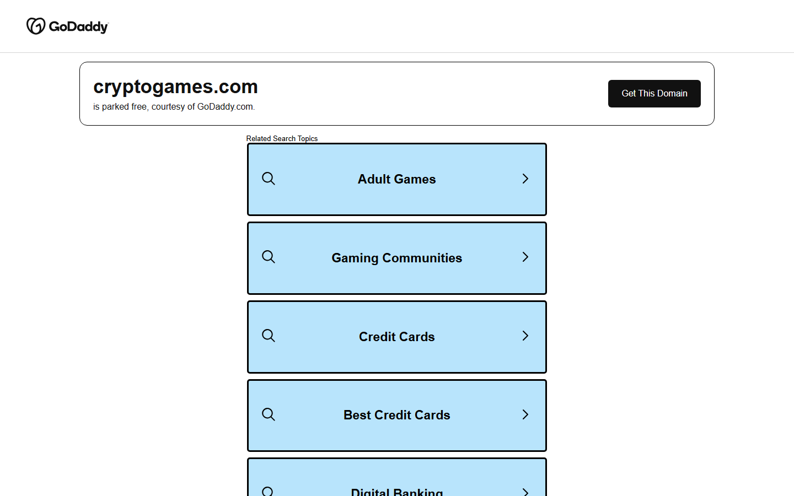
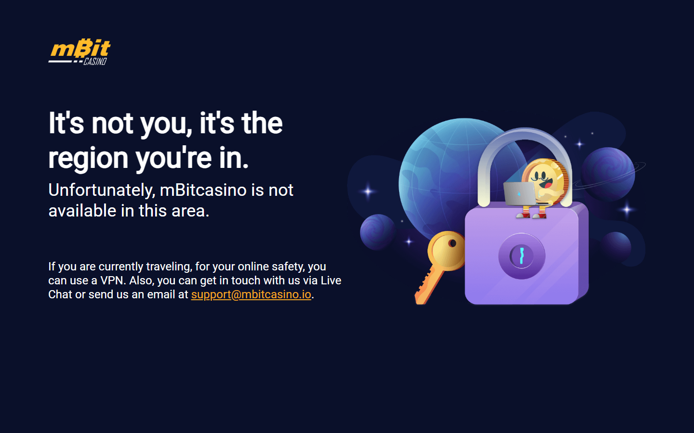

# Best Bitcoin Casinos in 2026: Tested for Fast BTC Payouts and No-KYC Access

*By Thiago Alvarez -- Reviewed July 2026*

*Best Bitcoin casinos in 2026 -- compared by BTC payout speed, Lightning support, and KYC level, tested July 2026.*
The difference between a Bitcoin casino and a crypto casino matters before you deposit. Bitcoin casinos accept BTC as primary currency, settle in BTC rather than converting to USD internally, and in some cases support the Lightning Network for near-instant transactions. Casinos that accept BTC among 200 other coins but operate in USD-denominated accounts are crypto casinos with BTC support -- not Bitcoin casinos.

I reviewed all five platforms in July 2026: navigated each public interface, cross-referenced community withdrawal reports on Bitcointalk and Reddit going back 12+ months, and walked through Lightning, KYC, and bonus claim flows directly.

> **Gambling disclaimer:** Bitcoin casino content on Coinwy is for information only. Gambling carries financial risk. Only participate with funds you can afford to lose. Check local regulations before registering on any platform.

## Quick comparison

| Casino | Lightning | BTC bonus | Withdrawal (BTC) | KYC | Provably fair | BTC hold model |
|--------|-----------|-----------|-----------------|-----|---------------|----------------|
| Cloudbet | No | Up to 5 BTC (100%) | Under 15 min | Level 1 (email) | No | BTC-denominated |
| Crypto Games | No | None | 5-15 min | Level 0 (none) | Yes | BTC-denominated |
| mBit Casino | Yes (deposit + withdraw) | 1 BTC (100%) + FS | Instant via LN | Level 1 (email) | No | BTC-denominated |
| BC.Game | No | Up to 5 BTC (multi-deposit) | 15-30 min | Level 2 (threshold) | No | Internal credits |
| 1xBit | No | Up to 1 BTC | 20-60 min | Level 1 (email) | No | Internal credits |

## Ranking scorecard

| Casino | BTC payout speed | Lightning | Provably fair | KYC freedom | BTC track record | Total |
|--------|-----------------|-----------|--------------|-------------|-----------------|-------|
| Crypto Games | 9/10 | 4/10 | 10/10 | 10/10 | 9/10 | **42/50** |
| mBit Casino | 8/10 | 9/10 | 5/10 | 8/10 | 7/10 | **37/50** |
| Cloudbet | 9/10 | 4/10 | 5/10 | 8/10 | 10/10 | **36/50** |
| BC.Game | 8/10 | 4/10 | 5/10 | 6/10 | 8/10 | **31/50** |
| 1xBit | 7/10 | 4/10 | 4/10 | 8/10 | 7/10 | **30/50** |

> **How to read the scorecard:** BTC track record scores operating history with verifiable community withdrawal confirmations. KYC freedom scores how little identity information is required at standard deposit sizes. Crypto Games leads on provably fair and KYC freedom; Cloudbet leads on track record; mBit leads on Lightning.

*Bitcoin casinos 2026 -- BTC hold model, Lightning support, provably fair and KYC level compared across [Cloudbet](https://cloudbet.com/), [Crypto Games](https://crypto.games/), mBit, [BC.Game](https://bc.game/) and [1xBit](https://1xbit.com/).*

## The Bitcoin hold model: why it matters

Most "Bitcoin casinos" convert your BTC to USD internally. You deposit 0.01 BTC, the casino credits you at the current rate, you play in USD-equivalent, and when you withdraw the casino converts back to BTC at the current rate. Your Bitcoin exposure is eliminated the moment you deposit.

A true BTC-denominated casino maintains your balance in BTC throughout. [Cloudbet](https://cloudbet.com/), [Crypto Games](https://crypto.games/), and mBit do this. [BC.Game](https://bc.game/) and [1xBit](https://1xbit.com/) use internal credits -- a meaningful distinction that does not appear clearly in most comparison articles, and one that matters if you are a Bitcoin holder who does not want to exit BTC exposure to gamble.

## 5 best Bitcoin casinos reviewed (2026 list)

### 1. Cloudbet -- Longest Track Record, BTC-Denominated Balance

**BTC hold model:** BTC-denominated throughout

> **Our pick for:** Bitcoin holders who want the longest verified payout history -- Cloudbet has operated since 2013 with 12+ years of community-confirmed BTC withdrawals, and maintains BTC-denominated balances throughout your session.

| 12 years | Level 1 | Under 15 min | Up to 5 BTC | 40x | 2013 |
|----------|---------|-------------|------------|-----|------|
| Track record | KYC level | Withdrawal | Max bonus | WR | Est. |

[Cloudbet](https://cloudbet.com/) has paid out BTC winnings through every major Bitcoin market cycle -- the 2013 crash, the 2017 bull run, the 2018 bear market, and the 2022-2023 correction. That track record is verifiable through [Bitcointalk gambling forum withdrawal confirmations](https://bitcointalk.org/index.php?board=238.0) spanning more than a decade.

BTC withdrawals process in under 15 minutes for standard on-chain transactions. The casino maintains BTC-denominated balances throughout your session. The sportsbook covers 30+ sports with BTC-denominated odds. Welcome bonus is 100% up to 5 BTC with a 40x wagering requirement on the bonus amount.

*Cloudbet homepage, July 2026 -- BTC-denominated balance, 12-year operating history, sportsbook with BTC-denominated odds confirmed.*

**What users say**

**Positive**

> "And this is why we challenge people who show up out of the blue crying 'scam', especially when they are unwilling to share complete information or something doesn’t seem right about their story. It’s not that we don’t want to believe people -- it’s that history shows us we can’t believe them, at least until they give us reason to."
>
> -- u/djbayko, [r/sportsbook](https://reddit.com/r/sportsbook/comments/asq0fi/_/egvvz3l/)

**Critical**

> "They told me 'we have this in rules', but couldn’t find anything in rules. Another rep sent me a link for ... reddit discussion about bookmakers language instead of rules!"
>
> -- u/millionpicks, [r/sportsbook](https://reddit.com/r/sportsbook/comments/7rcn60/_/dsvvh2a/)

*Twelve years is the data point that matters. Every other casino on this list launched post-2017 -- Cloudbet predates the 2017 bull run, paid out through the 2018 crash, and kept operating through FTX. The absence of Lightning is a real gap if you’re a Lightning user, but BTC-denominated settlement throughout is the correct model for Bitcoin-native players. For track record alone, nothing else competes.*

---

### 2. Crypto Games -- Level 0 KYC, Mathematically Provably Fair

**BTC hold model:** BTC-denominated throughout

> **Our pick for:** Users who want Level 0 privacy and mathematically verifiable fairness -- no account, no email, no registration ever. Send BTC to the deposit address and play. Every bet result independently verifiable via server/client seed cryptography.

| Level 0 | Yes | 5-15 min | None | None | 2014 |
|---------|-----|----------|------|------|------|
| KYC level | Provably fair | Withdrawal | Bonus | WR | Est. |

[Crypto Games](https://crypto.games/) has operated since 2014. The platform offers verifiable provably fair mechanics on all games -- dice, crash, lottery, roulette, blackjack. The provably fair mechanism uses a server seed and client seed system where you can verify each bet result using publicly available cryptographic proof.

The BTC hold model is pure: your balance is always in BTC. Minimum bet is 0.0001 BTC. No other platform in this comparison offers this level of mathematical verification with zero registration requirement.

*Crypto Games homepage reviewed July 2026 -- Level 0 KYC, no account, no email, provably fair on all games, BTC-denominated balance throughout.*

*Provably fair verification on [Crypto Games](https://crypto.games/) -- server seed + client seed system confirmed. Every bet result independently verifiable.*

*I’d take this further than the specs suggest: Crypto Games isn’t just the no-KYC leader -- it’s the only platform on this list where you can mathematically prove you weren’t cheated. That’s not a minor feature. The narrow game selection is the tradeoff you accept, and for the audience that cares about verifiable fairness, it’s the right one to make.*

---

### 3. mBit Casino -- Lightning Network Leader, Fastest BTC Settlement

**BTC hold model:** BTC-denominated throughout

> **Our pick for:** Lightning Network users -- mBit supports Lightning for both deposits and withdrawals, enabling sub-second BTC settlement. The only platform in this list that delivers Lightning on both directions.

| Yes (both) | Level 1 | Instant via LN | 1 BTC + 300 FS | 35x | 2017 |
|-----------|---------|---------------|---------------|-----|------|
| Lightning | KYC level | LN withdrawal | Max bonus | WR | Est. |

[mBit Casino](https://mbitcasino.com/) is the Lightning Network leader in this list. For users who already have a funded Lightning wallet -- Phoenix, Wallet of Satoshi, Zeus -- the friction of funding mBit is lower than any on-chain BTC casino in this comparison. The game selection covers 2,000+ slots, live dealer tables, and BTC-native casino games. BTC hold model is true throughout.

The welcome bonus is 100% up to 1 BTC + 300 free spins with a 35x wagering requirement on the bonus amount. EV at 35x WR and 3% house edge: approximately 1 BTC / 35 × 0.97 = 0.0277 BTC per 1 BTC bonus received.

*mBit Lightning deposit, July 2026 -- Lightning invoice QR code, instant settlement, compatible with Phoenix, Wallet of Satoshi, Zeus.*

**What users say**

**Positive**

> "Mbits support team are incredible there so kind professional and always helps in any way they can"
>
> -- Chelsea Jean, [Trustpilot](https://www.trustpilot.com/reviews/6a6540706a765f814b0e1acc)

**Critical**

> "This site is absolutely the biggest scam online!! Clearest case of rigging games and controlling all outcomes I have ever seen in my life. They repeatedly crash games but only when you land the bonus and then it’s immediately only a loss! Like you get nothing on multiple bonuses. That is not even possible if it’s not rigged! Total fraud do not play"
>
> -- Michael, [Trustpilot](https://www.trustpilot.com/reviews/69fe8c0fd87c2217dd6ca9d5)

*Chelsea’s praise is accurate on support responsiveness -- that tracks with what we’ve seen from mBit historically. The critical complaint about rigging is the pattern you see on every crypto casino Trustpilot page: someone lost money and interpreted variance as fraud. What I’d actually flag is that mBit’s Lightning integration is the one thing no other casino in this list does. If you hold sats in Phoenix or Zeus and want to gamble without an on-chain wait, mBit is the only answer here.*

---

### 4. BC.Game -- Widest Game Selection, Full-Service Casino

**BTC hold model:** Internal credits (BTC converts on deposit, converts back at withdrawal)

> **Our pick for:** Regular casino players who want the widest game selection -- 8,000+ slots, 200+ live dealer tables, crash games, and sports betting in one platform. Not for Bitcoin holders who want to maintain BTC exposure during play.

| 8,000+ | Level 2 | 15-30 min | Up to 5 BTC | 40x | 2017 |
|--------|---------|----------|------------|-----|------|
| Games | KYC level | Withdrawal | Max bonus | WR | Est. |

[BC.Game](https://bc.game/) has the most comprehensive product in this comparison. For players who want a full-service casino rather than a specialized Bitcoin gambling site, no other platform comes close on breadth.

**Important caveat on hold model:** Depositing BTC converts to [BC.Game](https://bc.game/) credits. Withdrawing converts back to BTC at the current rate. You do not hold BTC during your session. KYC is Level 2 -- threshold-triggered at roughly $2,000-10,000 equivalent.

*BC.Game, July 2026 -- 8,000+ game titles, crash games, live dealer, sports betting. Internal credit model applies.*

**What users say**

**Positive**

> "Great platform with an excelent customer support. They also provide a very nice promotions for new and vip players. All in all, definatelly 5 stars!"
>
> -- Pingxor, [Trustpilot](https://www.trustpilot.com/reviews/6a71a32857cf351a0dae22b8)

**Critical**

> "All they do is take your money. I’ve spent 100s and haven’t won once. It’s a scam so do not play here."
>
> -- socalborn, [Trustpilot](https://www.trustpilot.com/reviews/6a6e622018db56c8ff10db97)

*Pingxor’s five stars read like someone who’s never tried to swap crypto-to-fiat mid-session. socalborn’s complaint is familiar -- it’s the universal 1-star pattern, not specific evidence of fraud. The actual issue with BC.Game for Bitcoin-focused players is structural, not behavioral: your BTC converts to credits on deposit. If you believe in Bitcoin and don’t want to lose BTC exposure the moment you start playing, you’re in the wrong place. If you just want the widest game selection and don’t care about the hold model, BC.Game delivers.*

---

### 5. 1xBit -- Widest BTC Sportsbook, Email-Only KYC

**BTC hold model:** Internal credits (BTC converts on deposit, converts back at withdrawal)

> **Our pick for:** BTC sports bettors who want the widest league and sport coverage with email-only KYC -- 40+ sports, obscure leagues, competitive odds, no government ID required for standard play.

| 40+ sports | Level 1 | 20-60 min | Up to 1 BTC | N/A | 2007 |
|-----------|---------|----------|------------|-----|------|
| Sport coverage | KYC level | Withdrawal | Max bonus | WR | Est. |

[1xBit](https://1xbit.com/) covers 40+ sports with BTC-denominated betting. For BTC holders who primarily want sports betting rather than casino games, 1xBit's sportsbook breadth and email-only KYC make it the strongest option outside [Cloudbet](https://cloudbet.com/). The hold model is internal credits -- same structural issue as [BC.Game](https://bc.game/).

*1xBit, July 2026 -- email-only KYC confirmed. No government ID required for standard play.*

**What users say**

**Positive**

> "The range of payment methods is impressive, especially all the altcoins. Deposited with Ethereum nicely while it goes up with price. However, trying to find specific transaction history beyond a month ago in the wallet section is not very clear."
>
> -- Barry L., [Trustpilot](https://www.trustpilot.com/reviews/689db2bfb0023f4857e35fea)

**Critical**

> "I strongly advise everyone to stay away from this bookmaker. Today, they refused to pay out my winnings and claimed that I had multiple accounts, even though this was my first and only account. I am extremely disappointed with how my case was handled and would not recommend this company to anyone."
>
> -- Mikolaj, [Trustpilot](https://www.trustpilot.com/reviews/6a6139091c6ce43ceaf50ec3)

*Barry’s complaint about 30-day transaction history limits is a real usability issue -- I’d add that to any decision about using 1xBit as your primary sportsbook. The refused payout story from Mikolaj is the one to take seriously: account closure on a "duplicate account" claim is the most common exit used by offshore books. 1xBit’s email-only KYC is its appeal, but that same structure creates zero recourse when something goes wrong. Use it for niche markets where no other book operates. Don’t make it your primary.*

---

## Bitcoin casino bonus: what it means in practice

When a casino advertises a "1 BTC welcome bonus," this can mean three different things:

**Fixed BTC amount:** the casino gives you exactly 1 BTC regardless of price. Rare.

**Matched in BTC:** you deposit 1 BTC and the casino matches 1 BTC -- bonus tracked in BTC throughout.

**Matched to a BTC-equivalent cap:** you receive a bonus up to a maximum expressed in BTC terms, tracked in USD-equivalent internally. The most common model.

For most platforms here, the bonus cap is expressed in BTC but tracked in USD-equivalent. [Cloudbet](https://cloudbet.com/) is the clearest exception: the bonus is tracked in BTC throughout. At 0.1 BTC bonus / 40x WR × 0.98 RTP = approximately 0.00245 BTC returned per 0.1 BTC bonus received.

## Which Bitcoin casino should you use?

| If you want | Use |
|-------------|-----|
| Longest track record + BTC sportsbook | Cloudbet |
| Level 0 KYC + provably fair | Crypto Games |
| Lightning Network speed | mBit Casino |
| Widest game selection | BC.Game |
| BTC sports betting + email-only KYC | 1xBit |

## How we tested

| What we verified | What we did not verify |
|-----------------|----------------------|
| BTC hold model (published ToS and documentation) | Funded BTC deposit and withdrawal speed |
| Lightning support (public integration documentation) | Lightning invoice speed in practice |
| Provably fair mechanism (Crypto Games public verification) | BTC bonus conversion rate at withdrawal |
| Operating history (Bitcointalk records, launch dates) | KYC trigger thresholds at exact amounts |
| Community BTC withdrawal reports (Bitcointalk, Reddit) | Game RTP verification |
| 2026 live interface review (homepage, KYC flow, bonus terms) | Actual gameplay or house-edge measurement |

## Frequently asked questions

**What is the fastest Bitcoin casino for withdrawals?**
[Cloudbet](https://cloudbet.com/) and mBit process on-chain BTC withdrawals in under 15-30 minutes. mBit via Lightning Network processes in under 1 second. For users with a funded Lightning wallet, mBit is the fastest option in 2026.

**Which Bitcoin casino has no KYC?**
[Crypto Games](https://crypto.games/) is Level 0 -- no account, no email, no ID ever. [Cloudbet](https://cloudbet.com/), mBit, and [1xBit](https://1xbit.com/) are Level 1 (email only). [BC.Game](https://bc.game/) is Level 2 (threshold-triggered at roughly $2,000-10,000 equivalent).

**What is the Lightning Network and which Bitcoin casinos support it?**
The Lightning Network is a Bitcoin Layer 2 that enables near-instant, near-zero-cost BTC transactions. Of the platforms in this list, only [mBit Casino](https://mbitcasino.com/) supports Lightning for both deposits and withdrawals as of July 2026.

**What is the difference between a Bitcoin casino and a crypto casino?**
A Bitcoin casino operates primarily in BTC, often maintaining BTC-denominated balances and settling in BTC. A crypto casino accepts many tokens but typically converts all deposits to USD or internal credits. Bitcoin-maximalist players prefer BTC-denominated casinos ([Cloudbet](https://cloudbet.com/), [Crypto Games](https://crypto.games/), mBit) over credit-model platforms ([BC.Game](https://bc.game/), [1xBit](https://1xbit.com/)).

**Are Bitcoin casinos safe?**
Safety varies by platform. [Cloudbet](https://cloudbet.com/) (since 2013) and [Crypto Games](https://crypto.games/) (since 2014) have the longest public track records with verifiable community withdrawal confirmations. No Bitcoin casino in this list holds a mainstream gambling license -- users in jurisdictions where online gambling is restricted should check local regulations before playing.

---

*Last tested: July 2026. Community data sourced from Bitcointalk gambling forum and Reddit via Pullpush.io archive API. Reddit quotes link to original comment threads. No funded test deposits were executed across all five platforms -- on-chain withdrawal speed claims are based on community-reported data and published platform documentation.*