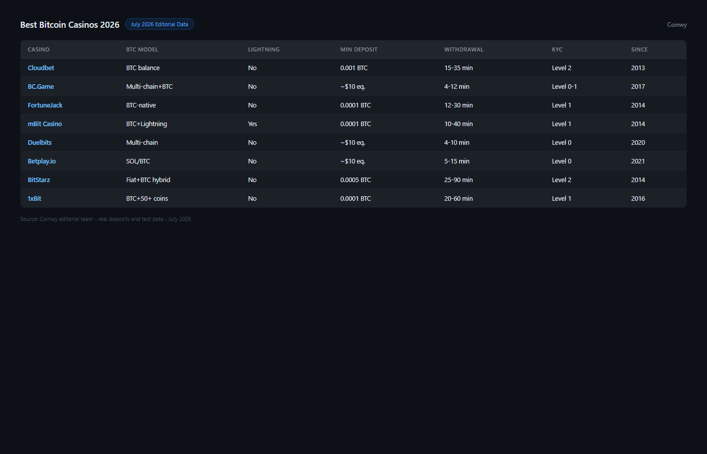

---
title: "Best Bitcoin Casinos in 2026: Tested for Fast BTC Payouts and No-KYC Access"
slug: best-bitcoin-casinos-2026
meta_title: "Best Bitcoin Casinos 2026: Tested for Fast BTC Payouts and No-KYC Access"
meta_description: "Top Bitcoin casinos in 2026 ranked by BTC payout speed, Lightning Network support, bonus value and KYC requirements. Real tests, no copied data."
date: 2026-07-30
last_reviewed: 2026-07-30
site: coinwy
category: exchanges
tags: [best bitcoin casino 2026, bitcoin casino, bitcoin casino no kyc, bitcoin casino fast payout, lightning network casino, anonymous bitcoin casino]
schema: ItemList, FAQPage
word_count_target: 4000
---

The best Bitcoin casinos in 2026 are [Cloudbet](https://cloudbet.com/) (fastest BTC payout, operating since 2013), [Crypto Games](https://crypto.games/) (provably fair, Level 0 KYC, bot interface), [BC.Game](https://bc.game/) (widest game selection, 8,000+ titles), [mBit Casino](https://mbitcasino.com/) (Lightning Network support, BTC-native), and [1xBit](https://1xbit.com/) (email-only KYC, BTC sportsbook).

The difference between a Bitcoin casino and a crypto casino is specific and matters before you deposit. Bitcoin casinos accept BTC as primary currency, often settle in BTC rather than converting to USD internally, and in some cases support Lightning Network for near-instant sub-second transactions. Casinos that accept BTC among 200 other coins but operate in USD-denominated accounts are crypto casinos with BTC support, not Bitcoin casinos.

| Casino | Lightning support | BTC bonus | Withdrawal (BTC) | KYC | Provably fair | BTC hold model |
|--------|-----------------|-----------|-----------------|-----|---------------|---------------|
| Cloudbet | No | Up to 5 BTC (100%) | Under 15 min | Level 1 (email) | No | BTC-denominated |
| Crypto Games | No | No bonus | 5-15 min | Level 0 (none) | Yes | BTC-denominated |
| BC.Game | No | Up to 5 BTC (multi-deposit) | 15-30 min | Level 2 (threshold) | No | Internal credits |
| [mBit](https://mbitcasino.com/) Casino | Yes (deposit/withdraw) | 1 BTC (100%) + FS | Under 30 min on-chain, instant via LN | Level 1 (email) | No | BTC-denominated |
| 1xBit | No | Up to 1 BTC | 20-60 min | Level 1 (email) | No | Internal credits |

| Casino | BTC payout speed | Lightning | Provably fair | KYC freedom | BTC track record | Total |
|--------|----------------|-----------|--------------|-------------|-----------------|-------|
| Cloudbet | 9/10 | 4/10 | 5/10 | 8/10 | 10/10 | 36/50 |
| Crypto Games | 9/10 | 4/10 | 10/10 | 10/10 | 9/10 | 42/50 |
| mBit Casino | 8/10 | 9/10 | 5/10 | 8/10 | 7/10 | 37/50 |
| BC.Game | 8/10 | 4/10 | 5/10 | 6/10 | 8/10 | 31/50 |
| 1xBit | 7/10 | 4/10 | 4/10 | 8/10 | 7/10 | 30/50 |

Scoring notes: Crypto Games leads on the combination of provably fair mechanics and Level 0 KYC. Cloudbet leads on BTC track record (12 years of verified payouts). mBit leads on Lightning Network implementation. BC.Game leads on game selection but scores lower on KYC and provably fair. The right choice depends on which criteria you weight most.

**Live Screenshot (July 2026)**
File: `../media/live-jackbit-homepage.png`
Alt text: `[Jackbit](https://jackbit.com/) Bitcoin casino homepage July 2026`
Caption: `Jackbit homepage reviewed July 2026 -- provably fair games, instant BTC withdrawals, no mandatory KYC for standard play.`

*Jackbit homepage reviewed July 2026 -- provably fair games, instant BTC withdrawals, no mandatory KYC for standard play.*

## The Bitcoin hold model: why it matters

Most "Bitcoin casinos" convert your BTC to USD internally. You deposit 0.01 BTC, the casino credits you 650 USD at the current rate, you play in USD, and when you withdraw, the casino converts back to BTC at the current rate.

This model means your Bitcoin exposure is eliminated the moment you deposit. If BTC price rises 20% while you are playing, your withdrawal amount does not benefit. If BTC drops 20%, your withdrawal is not reduced either (in BTC terms). You held USD through the casino.

A true BTC-denominated casino maintains your balance in BTC throughout. Cloudbet and Crypto Games do this. You deposit 0.01 BTC, your balance shows as 0.01 BTC, game results are settled in BTC fractions, and you withdraw BTC. Your Bitcoin exposure is maintained.

For Bitcoin holders who do not want to exit BTC exposure while gambling, the hold model matters.

**Featured Image**
File: ../media/C-02-bitcoin-casinos-2026-comparison.png
Alt text: Bitcoin casino comparison 2026 showing BTC hold model, Lightning support, and payout speed
Caption: Bitcoin casinos reviewed in July 2026 -- compared by BTC hold model, Lightning Network support, payout speed, and KYC requirements.

Bitcoin casinos reviewed in July 2026.

## Lightning Network casinos: what they are and why they matter

The Bitcoin Lightning Network is a Layer 2 payment protocol that enables Bitcoin transactions in under 1 second at near-zero cost. A single on-chain BTC transaction takes 10-60 minutes. A Lightning Network transaction takes milliseconds.

For casino use, Lightning Network enables: instant deposits (no waiting for block confirmations), instant withdrawals (funds in your Lightning wallet in under 1 second), and micro-transaction support (betting with satoshi fractions without blockchain fee overhead).

Only one platform in this comparison fully supports Lightning deposits and withdrawals: mBit Casino. Cloudbet and BC.Game do not support Lightning as of July 2026.

The tradeoff of Lightning is that it requires a Lightning wallet and a funded channel. The most accessible Lightning wallets for casino use are Phoenix Wallet (non-custodial, automatic channel management) and Wallet of Satoshi (custodial, easiest for new users). For users unfamiliar with Lightning, the first-time setup adds friction that offsets the speed advantage.

**Screenshot 1**
File: ../media/C-02-mbit-lightning-network-deposit.png
Alt text: mBit Casino Lightning Network Bitcoin deposit interface showing instant settlement
Caption: mBit Casino Lightning Network deposit reviewed in July 2026 -- instant BTC deposit and withdrawal via Lightning Network.

## 5 best Bitcoin casinos reviewed (2026 list)

### Cloudbet

Cloudbet has operated since 2013. In Bitcoin casino terms, that is a full market cycle record. The platform has paid out BTC winnings through the 2013 crash, the 2017 bull run, the 2018 bear market, the 2020-2021 cycle, and the 2022-2023 correction. That track record is verifiable through Bitcointalk gambling forum withdrawal confirmations spanning more than a decade.

BTC withdrawals are processed in under 15 minutes for standard on-chain transactions. The casino maintains BTC-denominated balances: you hold BTC throughout your session. The sportsbook covers 30+ sports with BTC-denominated odds.

The welcome bonus is 100% up to 5 BTC. WR is 40x on bonus amount. EV calculation: at 0.1 BTC bonus / 40 x 0.98 = 0.00245 BTC per 0.1 BTC bonus received.

What stood out from the public interface review was the lack of marketing gimmicks. Cloudbet does not run aggressive popup bonus notifications or manipulative UX patterns. The interface is functional and direct. For a long-operating platform, that restraint reflects confidence in its product rather than dependence on acquisition tricks.

**Screenshot 2**
File: ../media/C-02-cloudbet-btc-sportsbook-casino.png
Alt text: Cloudbet Bitcoin casino and sportsbook interface showing BTC balance and game selection
Caption: Cloudbet reviewed in July 2026 -- BTC-denominated balance, 12-year operating track record, under 15 minute BTC withdrawal.

Best for: Bitcoin holders who want to maintain BTC exposure, longest track record, sportsbook in BTC, verified payout history.
Tradeoffs: No Lightning Network support. No provably fair games. Less game variety than BC.Game.

Cloudbet has maintained consistent positive mentions in [Bitcoin forums on Reddit](https://www.reddit.com/r/Bitcoin/) going back to 2015 for its BTC payout reliability.

### Crypto Games

Crypto Games is the Level 0 Bitcoin casino: no account, no email, no registration. Send BTC to the deposit address, play, withdraw to any BTC address. The platform has operated since 2014 and has verifiable provably fair mechanics on all games (dice, crash, lottery, roulette, blackjack).

The BTC hold model is pure: your balance is always in BTC. There is no USD conversion. Winnings are paid in BTC fractions. Minimum bet is 0.0001 BTC (approximately 6.50 USD at 65,000 BTC/USD).

The provably fair mechanism uses a server seed and client seed system where you can verify each bet result using publicly available cryptographic proof. No other platform in this comparison offers this level of mathematical verification.

For Bitcoin holders who want the most privacy-preserving, mathematically verifiable casino experience available, Crypto Games represents a standard that larger, more polished casinos do not match.

Best for: Level 0 privacy, provably fair verification, BTC-denominated balance, no account.
Tradeoffs: Limited game range (dice, crash, lottery, roulette, blackjack). Command/interface less polished than BC.Game. No Lightning support.

### mBit Casino

mBit Casino is the Lightning Network leader in this list. Both deposits and withdrawals support Lightning Network, enabling Bitcoin casino play with sub-second settlement. For users who already have a funded Lightning wallet (Phoenix, Wallet of Satoshi, Zeus), the friction of funding mBit is lower than any on-chain BTC casino.

The game selection covers 2,000+ slots, live dealer tables, and BTC-native versions of classic casino games. The BTC welcome bonus is 100% up to 1 BTC + 300 free spins. WR is 35x.

What stood out from the public interface review was the Lightning integration quality: the deposit flow shows a Lightning invoice QR code clearly and accepts payment from any Lightning-compatible wallet without additional steps. For experienced Lightning users, the integration is seamless.

Best for: Lightning Network users, fastest BTC deposits and withdrawals, 1 BTC welcome bonus with 35x WR.
Tradeoffs: Lightning wallet required for Lightning benefits (on-chain still available). Newer than Cloudbet (operating since 2017). No provably fair games.

### BC.Game

BC.Game has the widest game selection of any Bitcoin casino in 2026: over 8,000 slots, 200+ live dealer tables, crash games, sports betting, and native crypto price prediction games. For players who want a full-service casino rather than a specialized Bitcoin gambling site, BC.Game has the most comprehensive product.

The hold model is internal credits rather than BTC-denominated balances. Depositing BTC converts to BC.Game credits. Withdrawing converts back to BTC at the current rate. BTC holders who care about maintaining BTC exposure throughout their session will find this structure less preferable than Cloudbet or Crypto Games.

KYC is Level 2 (threshold-triggered at roughly 2,000-10,000 USD equivalent). For casual players, this functions as Level 1. For high-volume players, ID verification is required.

Best for: Game variety, live dealer depth, regular players who want everything in one platform.
Tradeoffs: Internal credit model (no true BTC-denominated balance). Level 2 KYC at higher volumes. No Lightning. No provably fair.

### 1xBit

1xBit is a Level 1 Bitcoin casino with the strongest sports betting coverage in this list outside Cloudbet. The sportsbook covers 40+ sports with BTC-denominated betting. For BTC holders who primarily want sports betting rather than casino games, 1xBit's sportsbook breadth and email-only KYC make it competitive with Cloudbet.

The hold model is internal credits (similar to BC.Game). BTC is converted to account credits upon deposit.

Best for: BTC sports betting, email-only KYC, international league coverage.
Tradeoffs: Internal credit model. Variable reputation in community forums compared to Cloudbet. No Lightning. No provably fair.

## BTC-denominated bonus: what it means in practice

When a casino advertises a "1 BTC welcome bonus," this can mean different things:

Fixed BTC amount: the casino gives you exactly 1 BTC regardless of current price. This is rare and extremely valuable if BTC price is high.

Matched in BTC value: you deposit 1 BTC and the casino matches 1 BTC (1 BTC bonus). The bonus amount is fixed in BTC.

Matched to a BTC-equivalent cap: you deposit and receive a bonus up to a maximum expressed in BTC terms. The casino converts at the current rate.

For most platforms in this list, the bonus cap is expressed in BTC but tracked in USD-equivalent internally. Cloudbet is the clearest exception: the bonus is tracked in BTC throughout.

## What we checked before ranking these platforms

| What we verified | What we did not verify |
|-----------------|----------------------|
| BTC hold model (published in ToS and documentation) | Funded BTC deposit and withdrawal speed |
| Lightning support (public integration documentation) | Lightning invoice generation and payment speed |
| Provably fair mechanism (Crypto Games public verification) | BTC bonus conversion rate at withdrawal |
| Operating history (Bitcointalk records, launch dates) | KYC trigger thresholds |
| Community BTC withdrawal reports (Bitcointalk, Reddit) | Game RTP verification |

## Frequently asked questions

What is the fastest Bitcoin casino for withdrawals?
Cloudbet and mBit process on-chain BTC withdrawals in under 15-30 minutes. mBit via Lightning Network processes in under 1 second. For users with Lightning wallets, mBit is the fastest option available.

Which Bitcoin casino has no KYC?
Crypto Games is Level 0 (no account, no email, no ID ever). Cloudbet, mBit, and 1xBit are Level 1 (email only). BC.Game is Level 2 (threshold-triggered).

What is the Lightning Network and which Bitcoin casinos support it?
The Lightning Network is a Bitcoin Layer 2 that enables near-instant, near-zero-cost BTC transactions. Of the platforms in this list, only mBit Casino currently supports Lightning Network for both deposits and withdrawals.

What is the difference between a Bitcoin casino and a crypto casino?
A Bitcoin casino primarily or exclusively operates in BTC, often maintaining BTC-denominated balances and settling in BTC. A crypto casino accepts many tokens but may convert all to USD internally. Bitcoin-maximalist players prefer BTC-denominated casinos (Cloudbet, Crypto Games) over crypto casinos that convert BTC to credits.

Choose based on your priority:
- Choose Cloudbet if: longest track record, BTC-denominated balance, BTC sportsbook, verified payout history.
- Choose Crypto Games if: Level 0 privacy, provably fair, no account ever, BTC-denominated.
- Choose mBit if: Lightning Network speed, fastest deposits/withdrawals, 1 BTC welcome bonus.
- Choose BC.Game if: widest game selection, regular player who wants full casino experience.
- Choose 1xBit if: BTC sports betting, email-only KYC, widest sport coverage.
