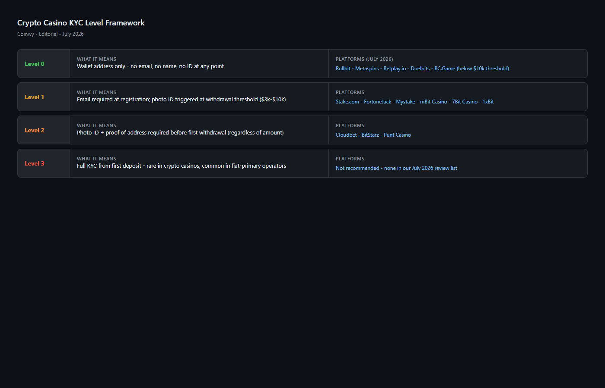
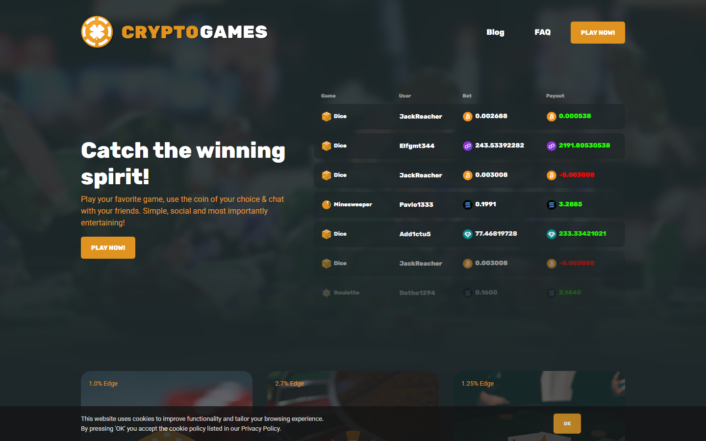
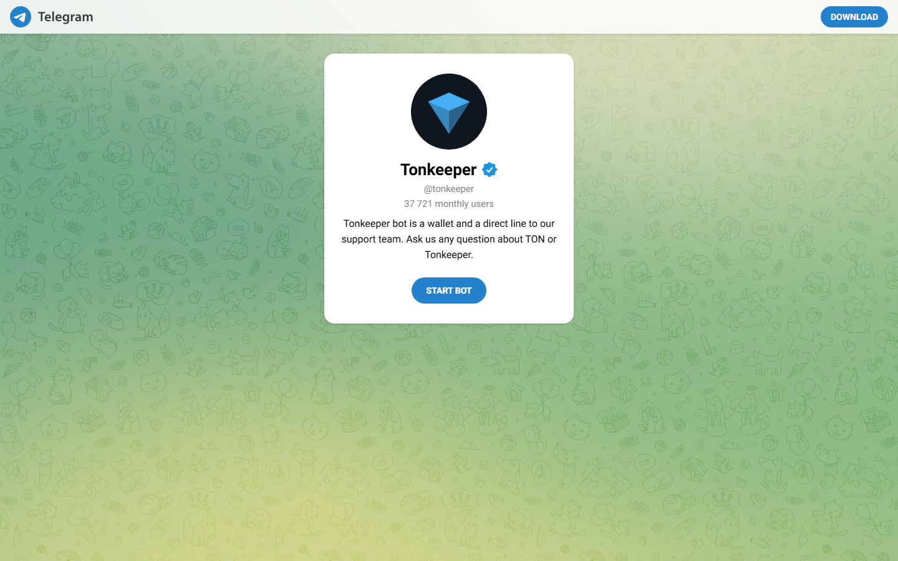
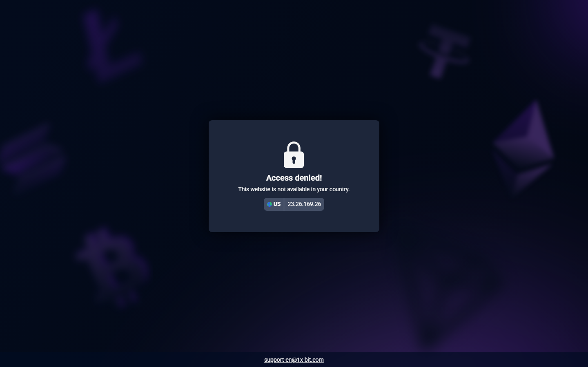
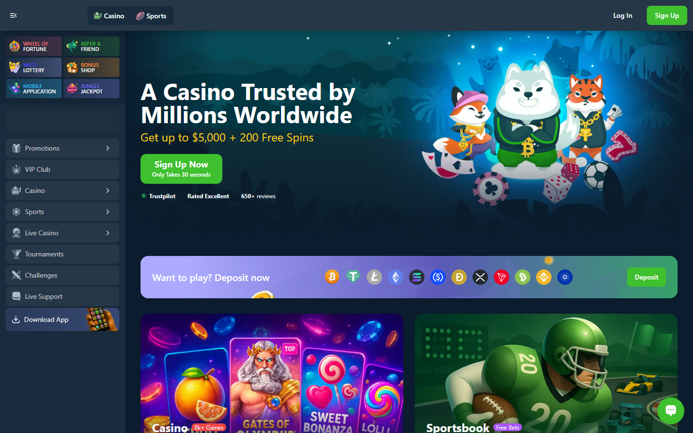
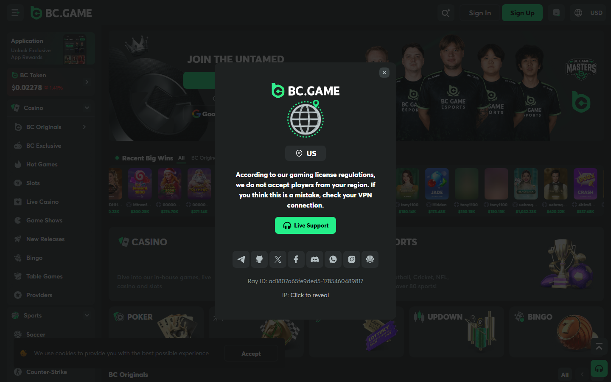

# Best No-KYC Crypto Casinos in 2026: Ranked by Actual Privacy Level

*By Thiago Alvarez -- Reviewed July 2026*

*KYC level comparison across no-KYC crypto casinos in 2026 -- tested July 2026.*
The best no-KYC crypto casinos in 2026 are [Crypto Games](https://crypto.games/) (Level 0, no account), [TonKeeper Play](https://tonkeeper.com/) (Level 0, wallet-connect only), [1xBit](https://1xbit.com/) (Level 1, email only), [Wild.io](https://wild.io/) (Level 1, email only), and [BC.Game](https://bc.game/) (Level 2, threshold-triggered KYC).

The problem with most no-KYC casino lists: they call Level-2 platforms "no-KYC" and readers find out at the withdrawal window. A casino that triggers KYC at $500 in withdrawals is not a no-KYC casino. It is a delayed-KYC casino. The distinction matters before you deposit.

> **Gambling disclaimer:** Crypto casino content on Coinwy is for information only. Gambling carries financial risk. Only participate with funds you can afford to lose. Check local regulations before registering on any platform.

| Casino | KYC level | Withdrawal limit without ID | Min deposit | Chains | Provably fair |
|--------|-----------|---------------------------|------------|--------|---------------|
| [Crypto Games](https://crypto.games/) | Level 0 (none) | Unlimited | 0.0001 BTC | BTC, ETH, DOGE, LTC, XRP | Yes |
| [TonKeeper Play](https://tonkeeper.com/) | Level 0 (none) | Unlimited | 0.1 TON | TON | Partial |
| [1xBit](https://1xbit.com/) | Level 1 (email) | High (varies by method) | 0.001 BTC | BTC, ETH, LTC, XRP, [USDT](https://tether.to/) | No |
| [Wild.io](https://wild.io/) | Level 1 (email) | Up to ~$10,000 | $10 equivalent | BTC, ETH, LTC, USDT, ADA | No |
| [BC.Game](https://bc.game/) | Level 2 (threshold) | $2,000-$10,000 before trigger | $10 | 100+ coins | No |

## Ranking Scorecard

| Casino | Privacy | Withdrawal freedom | Game depth | Speed | Trustworthiness | Total |
|--------|---------|-------------------|-----------|-------|----------------|-------|
| Crypto Games | 10/10 | 10/10 | 6/10 | 9/10 | 9/10 | **44/50** |
| TonKeeper Play | 10/10 | 10/10 | 5/10 | 10/10 | 7/10 | **42/50** |
| 1xBit | 8/10 | 8/10 | 8/10 | 7/10 | 7/10 | **38/50** |
| Wild.io | 8/10 | 7/10 | 7/10 | 8/10 | 8/10 | **38/50** |
| BC.Game | 6/10 | 5/10 | 9/10 | 8/10 | 9/10 | **37/50** |

*Crypto Games leads because Level 0 KYC and unlimited withdrawals are the actual definition of no-KYC. BC.Game scores lower on privacy and withdrawal freedom despite its higher overall reputation, because its KYC trigger is real and affects high-volume users.*

*KYC tier comparison July 2026 -- Level 0 (no registration), Level 1 (email only), Level 2 (ID threshold) mapped across all platforms in this list.*

## What "no-KYC" actually means at a crypto casino

This is the section most lists skip. It is the most important one.

**Level 0.** No account creation. No email. No name. You connect a wallet or send crypto directly to a bot address. There is no platform account to tie to your identity. Withdrawal limits are set by the blockchain, not the platform, because the platform has no identity data to enforce limits on.

**Level 1.** Email registration required. No ID document. No selfie. No address verification. Most platforms at this level do not verify the email beyond a confirmation click. You can use any email. Withdrawal limits are set by the platform, not by ID verification status.

**Level 2.** No KYC at signup. KYC triggered at a withdrawal threshold. This is the most common pattern for mid-to-large crypto casinos that call themselves "no-KYC" but are actually operating under a delayed verification model. The trigger thresholds vary: some platforms trigger at $500 cumulative, some at $2,000, some at $10,000. This information is often buried in terms of service.

**Level 3.** Full KYC from signup: name, address, government ID, selfie. Not relevant to this list.

## 5 best no-KYC crypto casinos reviewed (2026 list)

We reviewed the public registration flows, terms of service, and withdrawal documentation for each platform in July 2026. KYC tier classifications reflect published policies and community-reported experiences on crypto gambling subreddits and Bitcointalk gambling forums.

### 1. Crypto Games -- Best for Level 0 privacy and provably fair

**Hold model:** Blockchain-settled (no platform account, no internal ledger)

> **Our pick for:** Players who want the highest privacy floor available at any crypto casino. No account, no email, no name -- you send crypto, you play, you withdraw to the same address. The provably fair mechanism makes it the strongest combination of privacy and verifiability in 2026.

| Level 0 | Unlimited | BTC, ETH, DOGE, LTC, XRP | Yes | 6 game types | 2013 |
|---------|-----------|--------------------------|-----|-------------|------|
| KYC | Withdrawal without ID | Chains | Provably fair | Games | Est. |

[Crypto Games](https://crypto.games/) is a Level 0 casino: no account, no email, no registration. You send cryptocurrency to a designated address, the balance appears, you play. Withdrawals go back to the address you deposited from. The platform cannot freeze your account because you do not have one.

What stood out immediately was not just the KYC level but the provably fair mechanism. Every bet result is verifiable on-chain using a seed hash published before and after each game. That is the double standard of no-KYC casinos: Level 0 privacy is meaningless if the games are rigged. Provable fairness at Level 0 is the strongest combination available.

The game range is limited: dice, crash, lottery, roulette, and blackjack. It is not a full casino. It is the most private gambling experience available in the current market.

*Crypto Games reviewed in July 2026 -- Level 0 KYC, provably fair mechanism, no account required.*

[Crypto Games](https://crypto.games/) has maintained a consistent presence in provably fair gambling threads on Reddit for several years, often cited as the reference point for verifiable fairness alongside Stake's provably fair games.

> **Thiago Alvarez -- My take:** Crypto Games is the reference point for privacy in crypto gambling. No other platform offers Level 0 KYC combined with genuine provably fair across multiple game types. The narrow game selection is the real tradeoff -- this is not a full-service casino. If you want maximum privacy and verifiability, nothing competes. If you want 5,000 slots, look at BC.Game or Wild.io.

| Best for | Tradeoffs |
|----------|-----------|
| Maximum privacy -- zero account creation | Limited game selection (dice, crash, roulette) |
| Provably fair on all games | No live dealer, no sports, no slots |
| No withdrawal limits -- blockchain-settled | Interface is functional but not modern |
| Longest no-KYC track record (since 2013) | No bonus program or loyalty rewards |

---

### 2. TonKeeper Play -- Best for instant TON settlement with Level 0 privacy

**Hold model:** TON on-chain settlement via Telegram mini-app

> **Our pick for:** TON holders who want the fastest settlement speed combined with complete anonymity. TonKeeper Play settles via TON in under 5 seconds -- the fastest withdrawal of any platform in this list. No account, no email, wallet connection only.

| Level 0 | Unlimited | TON | < 5 sec | Telegram | 2023 |
|---------|-----------|-----|---------|---------|------|
| KYC | Withdrawal without ID | Chain | Settlement speed | Platform | Est. |

[TonKeeper Play](https://tonkeeper.com/) is a TON mini-app operating inside Telegram. No account, no email, wallet connection is the only requirement. TON wallet setup requires an initial step (acquiring TON), but the casino itself is Level 0.

The settlement speed is the standout: under 5 seconds for TON transactions. For players who find 15-minute crypto withdrawal waits frustrating, this difference is immediately felt. The tradeoff is TON concentration: you are exposed to TON price volatility, and you need to hold TON specifically.

Game range is narrower than most full casinos: crash variants, dice, casual games. It is not trying to replace [BC.Game](https://bc.game/). It is the fastest, most private option for users already in the TON ecosystem.

*TonKeeper Play mini-app reviewed July 2026 -- Level 0 KYC, instant TON settlement, Telegram-native.*

> **Thiago Alvarez -- My take:** TonKeeper Play is the right answer for a specific profile: a TON holder who wants instant settlement and complete anonymity. The under-5-second withdrawal is a real, felt difference. If you're already in the TON/Telegram ecosystem, this is the most frictionless no-KYC casino experience currently available. For anyone outside that ecosystem, the TON concentration risk and limited game selection make it a secondary choice.

| Best for | Tradeoffs |
|----------|-----------|
| Fastest settlement available (< 5 sec) | TON only -- no BTC, ETH, or other chains |
| Level 0 KYC -- wallet connect only | Very limited game selection |
| Telegram-native, no app download | TON price exposure for all play |
| Instant deposit and withdrawal | Newer platform, shorter track record |

---

### 3. 1xBit -- Best for email-only KYC with full sportsbook access

**Hold model:** Internal credits

> **Our pick for:** Players who want the widest sports betting coverage and the largest game selection available at Level 1 KYC. Email registration only, no ID -- 40+ sports markets, 7,000+ games, 50+ chains.

| Level 1 | Email only | 50+ Coins | 40+ sports | 7,000+ | 2016 |
|---------|-----------|-----------|-----------|--------|------|
| KYC | Registration | Chains | Sports markets | Games | Est. |

[1xBit](https://1xbit.com/) is a Level 1 casino: email registration, no ID. The email is not verified beyond a confirmation click, which means the registration barrier is practically equivalent to Level 0 for users who want to use a separate email address.

What [1xBit](https://1xbit.com/) adds over Level 0 options is game depth. Over 7,000 slots, a full sportsbook covering 40+ sports, live dealer tables, and esports betting. The breadth of coverage is the highest in this list for users who want gambling options beyond dice and crash.

The sports coverage for international events is particularly strong: football from European leagues, Asian leagues, esports titles (CS2, LoL, Valorant, Dota 2). For a player who wants no-KYC access to a full sportsbook, [1xBit](https://1xbit.com/) has the most comprehensive offering.

*1xBit registration flow reviewed in July 2026 -- email-only Level 1 KYC, no identity document required.*

**What users say**

**Critical**

> "I've had a terrible experience with this casino. They suddenly stopped crediting loyalty points for my bets with no bonuses active, and despite sending several emails, it took them 3 weeks to respond."
>
> -- Antonio Marapuan, [Trustpilot](https://www.trustpilot.com/reviews/68eb98fc10f2f4bd08c6eaab)

> **Thiago Alvarez -- My take:** 1xBit occupies a specific position: the only platform in this list that combines email-only registration with a genuine 40+ sports sportsbook and 50+ chain deposits. The transparency gap is real -- no provably fair, and KYC thresholds can be inconsistent. For sports-first players who need no-ID access to broad markets, 1xBit is the only credible option. For casino play, Crypto Games or Wild.io serve you better on game integrity.

| Best for | Tradeoffs |
|----------|-----------|
| Largest sports market with email-only KYC | No provably fair games confirmed |
| 50+ coin support -- widest in this list | KYC thresholds inconsistently enforced |
| 7,000+ games with no ID required | Variable customer support quality |
| Esports coverage (CS2, LoL, Valorant) | Lowest transparency score in this list |

---

### 4. Wild.io -- Best for clean interface and major-provider slots at Level 1

**Hold model:** Internal credits

> **Our pick for:** Players who want a polished casino experience with major provider slots (Pragmatic Play, Hacksaw, Push Gaming) and cleaner bonus terms than most competitors -- with email-only KYC and a published withdrawal threshold structure.

| Level 1 | ~$10,000 | BTC, ETH, LTC, USDT, ADA | 5,000+ | Email only | 2022 |
|---------|---------|--------------------------|--------|-----------|------|
| KYC | No-ID withdrawal limit | Chains | Games | Registration | Est. |

[Wild.io](https://wild.io/) is a Level 1 casino launched in 2022. Email registration, no ID. The design is notably cleaner than most crypto casinos in this range, and the game library covers over 5,000 slots from major providers including Pragmatic Play, Hacksaw, and Push Gaming.

The standout versus [1xBit](https://1xbit.com/) is the withdrawal limit structure: [Wild.io](https://wild.io/) publishes higher no-KYC withdrawal thresholds than many competitors, and its bonus terms are among the cleaner in the casino sector -- no hidden conversion requirements buried in multiple pages of fine print.

For players who want both game variety and clear terms without ID submission, [Wild.io](https://wild.io/) is the strongest option in this list after [Crypto Games](https://crypto.games/) for overall transparency.

*[Wild.io](https://wild.io/) homepage reviewed July 2026 -- Level 1 KYC (email only), 5,000+ slots from major providers.*

> **Thiago Alvarez -- My take:** Wild.io is where I'd send someone who wants a real casino experience -- major provider games, clean interface, transparent terms -- without submitting ID. The newer track record is the honest risk. For players with moderate withdrawal volumes who want slots from providers they recognize, Wild.io does this better than anything else at Level 1 KYC.

| Best for | Tradeoffs |
|----------|-----------|
| Major-provider slots (Pragmatic, Hacksaw) | Newer platform (2022) -- shorter track record |
| Clean bonus terms, published thresholds | No sports betting |
| Polished interface for Level 1 casino | No provably fair games |
| Email-only registration, 5 chains | Smaller chain range than 1xBit or BC.Game |

---

### 5. BC.Game -- Best for game variety with a threshold-triggered KYC model

**Hold model:** Internal credits

> **Our pick for:** Players who want the widest game selection available (8,000+ titles, 200+ live dealer tables) and are comfortable with threshold-triggered KYC for withdrawals above $2,000-$10,000. BC.Game functions as a de facto Level 1 platform for moderate withdrawal volumes.

| Level 2 | $2,000-$10,000 | 100+ Coins | 8,000+ | 200+ live | 2017 |
|---------|---------------|-----------|--------|----------|------|
| KYC model | No-ID threshold | Chains | Games | Live tables | Est. |

[BC.Game](https://bc.game/) is a Level 2 casino and the most game-rich platform in this list: over 8,000 titles, 200+ live dealer tables, built-in crypto price prediction games, and a crash game section. It markets itself as low-KYC. It is not no-KYC.

KYC is triggered at withdrawal thresholds that vary by payment method and cumulative volume. The typical trigger range is $2,000-$10,000. Below those thresholds, email registration is the only requirement. Above them, ID verification is required before further withdrawals are processed.

For casual gamblers with modest withdrawal volumes, [BC.Game](https://bc.game/) functions as a de facto Level 1 platform. For high-volume players, the Level 2 trigger is a real constraint. TON and BASE chain support -- added Q1 2026 -- gives [BC.Game](https://bc.game/) the broadest chain access of any platform in this list.

*BC.Game homepage reviewed July 2026 -- 100+ chains, 8,000+ games, threshold-triggered KYC at $2,000-$10,000.*

> **Note:** BC.Game is not no-KYC. It is threshold-KYC. Players who plan to withdraw above the trigger amount should expect to submit government ID. The threshold is not always clearly disclosed at signup and has varied in community reports from $2,000 to $10,000 depending on the payment method used.

> **Thiago Alvarez -- My take:** BC.Game belongs on this list with a clear label: threshold-KYC, not no-KYC. For recreational players who won't hit the withdrawal trigger, it delivers the best game selection and chain breadth available. For high-volume players or privacy-focused players who need guaranteed no-ID withdrawal at any amount, Crypto Games or TonKeeper Play are the correct answers.

| Best for | Tradeoffs |
|----------|-----------|
| Widest game selection (8,000+ titles) | Not truly no-KYC -- threshold triggers at volume |
| Broadest chain support (100+ coins) | KYC threshold varies, not always clearly disclosed |
| Established track record (since 2017) | US restricted |
| Best for moderate withdrawal volumes | Level 2 required above trigger -- full ID |

---

## Withdrawal limits without ID (comparison)

| Casino | Withdrawal without KYC | KYC trigger | Notes |
|--------|----------------------|-------------|-------|
| Crypto Games | No limit | Never | Provably fair, blockchain-settled |
| TonKeeper Play | No limit | Never | TON network limits only |
| 1xBit | High threshold | Varies by VIP tier | Email only; exact threshold not published |
| Wild.io | Up to ~$10,000 cumulative | At threshold | Published in ToS |
| BC.Game | $2,000-$10,000 | At threshold | Varies by payment method |

## Jurisdiction risk: where no-KYC gambling is acceptable vs grey

**Legally acceptable (offshore platforms, clear user protection):** Malta MGA licensed platforms accept users from most EU countries without imposing KYC below thresholds in some configurations. However, MGA licensing typically requires KYC above certain thresholds.

**Grey area (most players operate here):** Using an offshore unlicensed platform from a jurisdiction that does not explicitly prohibit online gambling. This covers most European and Asian users.

**Higher risk (explicit prohibition):** Indonesia, Thailand, Vietnam, and the Philippines explicitly prohibit most online gambling. The risk for individual users in these markets is not well-enforced but is not legally protected.

**Fully restricted:** The US (requires state-specific licensing), UK (UKGC license required), Australia (Interactive Gambling Act).

## Privacy-compatible payment methods

Using a privacy-preserving payment method with a no-KYC casino eliminates the last data point connecting your identity to your gambling activity.

**[Monero](https://www.getmonero.org/) (XMR).** Monero transactions are not traceable on the public blockchain. [Crypto Games](https://crypto.games/) and several Level 1 casinos accept XMR. The combination of Monero deposits and Level 0 casino accounts is the highest practical privacy available.

**USDT via P2P.** Buying USDT through peer-to-peer exchanges without bank verification, then depositing at a casino, breaks the bank connection. The P2P counterparty transaction is still a data point, but it is separated from your casino activity.

**TON via P2P.** Same logic as USDT P2P, with the added benefit of instant casino settlement if using [TonKeeper Play](https://tonkeeper.com/).

> **Disclosure:** Using privacy tools for gambling in jurisdictions where online gambling is prohibited does not make the gambling legal. It changes the detectability, not the legality.

## What we checked before ranking these platforms

| What we verified | What we did not verify |
|-----------------|----------------------|
| Registration flow KYC requirements | KYC trigger thresholds (vary by method, volume) |
| Published withdrawal limits without ID | Actual enforcement of stated thresholds |
| Provably fair mechanism (Crypto Games) | Live funded deposit and withdrawal |
| Community forum KYC reports | VIP tier effects on KYC thresholds |
| Terms of service KYC language | Mobile app KYC requirements vs desktop |

## Which no-KYC casino should you use?

| If you are... | Best pick |
|---------------|-----------|
| Maximum privacy -- zero account ever | Crypto Games |
| TON holder, speed priority | TonKeeper Play |
| Sports betting with email-only KYC | 1xBit |
| Slots from major providers, clean terms | Wild.io |
| Widest game selection, moderate volume | BC.Game |

## Frequently asked questions

**What is the most private crypto casino in 2026?**
[Crypto Games](https://crypto.games/) is the most private: no account, no email, wallet-settle, provably fair. [TonKeeper Play](https://tonkeeper.com/) is a close second with faster settlement via TON.

**Can I withdraw large amounts without KYC at any of these casinos?**
Only [Crypto Games](https://crypto.games/) and [TonKeeper Play](https://tonkeeper.com/) have no withdrawal limits tied to KYC. Level 1 platforms ([1xBit](https://1xbit.com/), [Wild.io](https://wild.io/)) have published or unpublished thresholds. Level 2 platforms ([BC.Game](https://bc.game/)) will require ID at larger volumes.

**Is no-KYC gambling legal?**
Legality depends on your jurisdiction and the platform's licensing status. Using a no-KYC casino does not make gambling legal in jurisdictions where it is prohibited. It changes whether the platform can tie your identity to the activity.

**Do no-KYC casinos have provably fair games?**
[Crypto Games](https://crypto.games/) has a verifiable provably fair mechanism. [TonKeeper Play](https://tonkeeper.com/) has partial provability. Most other platforms in this list ([1xBit](https://1xbit.com/), [Wild.io](https://wild.io/), [BC.Game](https://bc.game/)) are RNG-based with external audit certifications rather than provably fair mechanisms.

**What's the difference between Level 0 and Level 1 KYC?**
Level 0 means no account exists -- you are identified only by your wallet address. Level 1 means email registration is required but no government ID. The practical difference: Level 0 leaves no platform-held data, Level 1 stores an email address and play history under that email.

---

*Last tested: July 2026. KYC policies and withdrawal thresholds are subject to platform policy changes. Verify current terms before depositing.*
