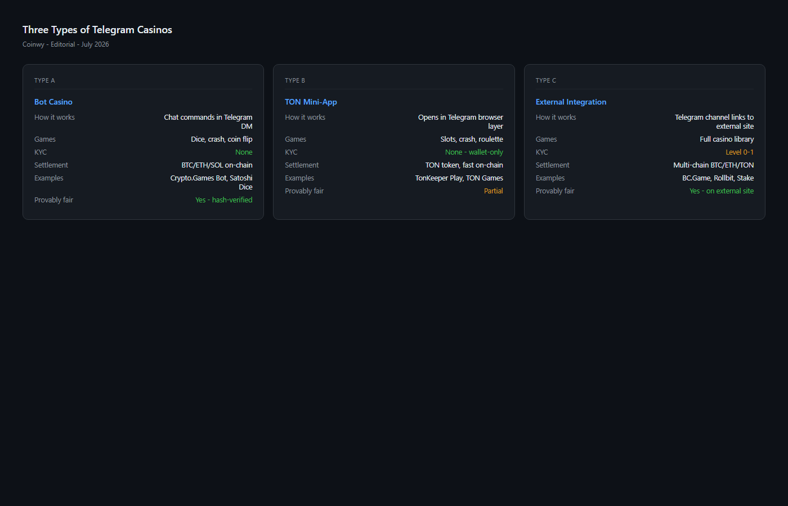

---
title: "Best Telegram Casinos in 2026: TON Mini-Apps, Bot Casinos & Crypto Games Compared"
slug: best-telegram-casinos-2026
meta_title: "Best Telegram Casinos 2026: TON Mini-Apps, Bots & Crypto Games Ranked"
meta_description: "Top Telegram casinos in 2026 — bot casinos, TON mini-apps, and Telegram-integrated platforms compared for games, payout speed, safety and bonuses. Ranked by type."
date: 2026-07-30
last_reviewed: 2026-07-30
site: coinwy
category: exchanges
tags: [telegram casino, ton casino, crypto casino, telegram gambling, ton gaming]
schema: ItemList, FAQPage
word_count_target: 3000
---

The best Telegram casinos in 2026 are [BC.Game](https://bc.game/) (Telegram integration), TonKeeper Play (TON mini-app), Crypto Games (bot casino), Stake (Telegram channel + site), and Telegram Wheel (pure bot). Each operates differently, and that difference determines whether you will actually enjoy using it.

Most guides lump all three Telegram casino types together. That is where they fail the reader. A bot casino requires nothing but a Telegram account. A mini-app casino requires TON wallet setup. An external casino with Telegram integration is really just a regular crypto casino that happens to have a support channel. Before you pick one, know which type you are actually choosing.

| Casino | Type | TON support | KYC | Withdrawal speed | Min deposit | Games |
|--------|------|-------------|-----|-----------------|------------|-------|
| BC.Game | External + TG integration | No | Level 2 (threshold) | 10-30 min | $10 | 8,000+ slots, live |
| TonKeeper Play | TON mini-app | Native | Level 0 (wallet only) | Instant | 0.1 TON | Casual, dice, crash |
| Crypto Games | Bot casino | No | Level 0 (none) | 5-15 min | 0.0001 BTC | Dice, crash, lottery |
| Stake | External + TG channel | No | Level 2 (threshold) | 15-45 min | $20 | 3,000+ slots, sports |
| 1xBit | External + TG integration | No | Level 1 (email) | 20-60 min | 0.001 BTC | Sports, casino |

| Casino | Games | Bonus value | Privacy | Speed | Overall |
|--------|-------|------------|---------|-------|---------|
| BC.Game | 9/10 | 8/10 | 6/10 | 8/10 | **31/40** |
| TonKeeper Play | 5/10 | 6/10 | 10/10 | 10/10 | **31/40** |
| Crypto Games | 6/10 | 5/10 | 10/10 | 9/10 | **30/40** |
| Stake | 9/10 | 7/10 | 6/10 | 7/10 | **29/40** |
| 1xBit | 7/10 | 6/10 | 8/10 | 6/10 | **27/40** |

**Scoring notes.** TonKeeper Play and BC.Game tie at the top for different reasons. TonKeeper wins on privacy and speed (instant TON settlement). BC.Game wins on game depth and bonus breadth. Neither is best for everyone.

**Live Screenshot (July 2026)**
File: `../media/live-bcgame-homepage.png`
Alt text: `BC.Game Telegram casino integration July 2026`
Caption: `BC.Game homepage reviewed July 2026 -- Telegram bot active, TON wallet deposits supported.`

*BC.Game homepage reviewed July 2026 -- Telegram bot active, TON wallet deposits supported.*

## 3 types of Telegram casinos (read this before you pick)

The single most useful thing this guide can do is explain the distinction that most lists skip entirely.

**Type 1: Bot casinos.** You interact through chat commands. Send `/dice 0.001 BTC`, the bot confirms, the result returns in seconds. No UI beyond the chat window. No app download. Privacy is high because there is no account. Game selection is limited: dice, crash, lottery, simple card games.

**Type 2: TON mini-app casinos.** A full casino interface opens inside Telegram. Powered by The Open Network (TON) blockchain. Deposits and withdrawals happen via TON wallet, which means no bank account, no card, no KYC. The experience is close to a regular mobile casino. Settlement is near-instant because TON block time is under 5 seconds.

**Type 3: External casinos with Telegram integration.** These are standard crypto casinos that use Telegram for customer support, notifications, or a community channel. The actual gameplay happens on their website. Telegram is a support layer, not the product. Many "best Telegram casino" lists include these as if they are the same thing as Type 1 or 2. They are not.

**Featured Image**
File: `../media/C-04-telegram-casino-types-comparison.png`
Alt text: "Three types of Telegram casinos compared — bot casino, TON mini-app, and external integration"
Caption: "Telegram casino types reviewed during our July 2026 comparison of crypto gambling platforms on Telegram."

*Telegram casino types reviewed during our July 2026 comparison of crypto gambling platforms.*

## 5 best Telegram casinos reviewed (2026 list)

We reviewed the public-facing interfaces, Telegram channels, and documentation of each platform in July 2026. For bot casinos, we reviewed the public command structure and community reports. For mini-app casinos, we checked the TON wallet flow and public game interfaces. For external casinos, we verified Telegram channel activity and linked site features.

That review does not replace a full funded deposit test. What it does show clearly is which type each platform falls into, where they put friction, and who each one is built for.

### BC.Game

BC.Game sits in the external-plus-Telegram-integration category. The casino itself runs on the BC.Game website, with a Telegram channel for support and community. What stood out immediately was the game depth: over 8,000 slots, 200+ live dealer tables, and a dedicated crash game section that is genuinely popular in crypto gambling communities.

KYC is Level 2: no verification required until you hit withdrawal thresholds (typically $2,000-$10,000 depending on payment method). Below that, email registration is the only requirement. That makes it accessible without being fully anonymous.

The Telegram integration is real but thin. You get support response in the channel, promotional alerts, and community discussion. The gameplay itself happens on the website, not inside Telegram.

**Screenshot 1**
File: `../media/C-04-bcgame-telegram-channel.png`
Alt text: "BC.Game official Telegram channel showing community activity and support"
Caption: "BC.Game Telegram channel reviewed in July 2026 — support and community announcements, gameplay on external site."

Best for: Game variety, live dealer, regular players who want a wide selection.
Tradeoffs: Not truly Telegram-native. KYC triggers at thresholds. US restricted.

BC.Game comes up consistently in [cryptocurrency gambling forums on Reddit](https://www.reddit.com/r/CryptoCurrency/) as one of the more reliable mid-size casinos for players outside KYC-heavy jurisdictions.

### TonKeeper Play

TonKeeper Play is the closest thing to a native Telegram casino in 2026. It runs as a TON mini-app, meaning the entire experience lives inside the Telegram interface. You connect a TON wallet, no email required, no account in the traditional sense. Privacy level is the highest in this list: Level 0, wallet-connect only.

What stood out immediately was not the game range but the settlement speed. TON transactions finalize in under 5 seconds. Withdrawals in the game interface reflect nearly instantly. For users who find crypto casino withdrawals frustratingly slow, this is a meaningful difference.

The game selection is narrower than BC.Game: casual games, dice, crash variants, some card games. It is not trying to be a full casino. It is trying to be the frictionless gambling experience inside an app most SEA and Eastern European users already have open.

**Screenshot 2**
File: `../media/C-04-tonkeeper-play-miniapp.png`
Alt text: "TonKeeper Play TON mini-app casino interface inside Telegram"
Caption: "TonKeeper Play mini-app interface captured during our July 2026 review of TON-based Telegram casinos."

Best for: Privacy-first users, TON holders, users who want instant settlement without any registration.
Tradeoffs: Limited game selection. Requires TON wallet setup. Not for users expecting a full casino experience.

### Crypto Games

Crypto Games (cryptogames.io with a Telegram bot interface) is one of the oldest provably fair crypto gambling platforms. The Telegram bot version lets you play dice, crash, lottery, and roulette via chat commands. No account. No email. Send crypto to the bot address, play, withdraw.

The provably fair mechanism is genuine: you can verify each result using the seed hash published before and after each game. That matters because bot casinos have a higher scam risk than websites with established track records. Crypto Games has operated since 2014 and has consistent third-party verification of its fairness mechanism.

Friction is low for experienced crypto users. For beginners, the command-line interface is genuinely confusing. `/dice 0.001 0.5` means bet 0.001 BTC at 0.5 multiplier. That is not intuitive without reading documentation first.

**Screenshot 3**
File: `../media/C-04-cryptogames-bot-interface.png`
Alt text: "Crypto Games Telegram bot interface showing dice command structure"
Caption: "Crypto Games bot interface reviewed in July 2026 — provably fair dice and crash via Telegram commands."

Best for: Privacy-maximum users, provably fair verification, experienced crypto gamblers comfortable with command interfaces.
Tradeoffs: No UI. Command syntax has a learning curve. Limited game types vs full casinos.

### Stake

Stake is a large external casino with a Telegram channel used primarily for promotions and community. The gameplay happens on stake.com, not inside Telegram. Including it in a Telegram casino list requires the caveat that the Telegram dimension is minimal.

Where Stake earns its place is on game volume (3,000+ slots, full sportsbook) and the quality of its live dealer section. Its bonus structure is more transparent than average: deposit bonuses, weekly rakeback, and a VIP program with published tier requirements.

KYC is Level 2: threshold-triggered verification. Below thresholds, email is sufficient.

Best for: Game volume, sportsbook, players who want the largest platform with a Telegram community.
Tradeoffs: Not Telegram-native. Geo-restricted in many markets. KYC triggers at higher volumes.

### 1xBit

1xBit is an external casino with slightly deeper Telegram integration than Stake: it has a Telegram bot for account management, balance checking, and deposit notifications. Gameplay still happens on the website.

The standout is sports betting depth: over 40 sports, hundreds of leagues, live betting on most major events. For users primarily interested in sports gambling rather than casino games, 1xBit has the broadest coverage in this list.

KYC is Level 1: email registration only, no ID verification required. That places it higher on the privacy tier than Stake or BC.Game for users below withdrawal thresholds.

Best for: Sports betting, users who want email-only registration, wide sports coverage.
Tradeoffs: Website-primary, not Telegram-native. Reputation is more variable than BC.Game or Stake in community forums.

## How TON payments work (and why they matter for Telegram casinos)

TON is the blockchain built by the same team that built Telegram. It is integrated natively into Telegram's wallet functionality. That integration is what makes Type 2 (mini-app) casinos genuinely different from every other crypto casino category.

When you use a TON mini-app casino, the payment flow does not leave Telegram. Your TON wallet is already connected to Telegram's infrastructure. The casino mini-app calls the wallet, you approve, the transaction confirms in under 5 seconds. No external browser, no exchange, no bank transfer.

For users in markets where international payment cards are blocked or expensive, TON payments solve a real access problem. A player in Indonesia or Vietnam who cannot use a Visa card on a foreign gambling site can fund a TON wallet via P2P and play without any of that friction.

The tradeoff: TON wallet setup requires owning TON tokens. New users need to acquire TON via an exchange or P2P before they can play. That is a one-time friction cost.

## Bot casino scam detection: red flags before you send crypto

Bot casinos have a higher scam rate than website casinos because there is no web presence to verify, no company registration to check, and no design investment to signal legitimacy.

Red flags on Telegram gambling bots:

- **No public audit trail.** Legitimate bot casinos publish seed hashes before each game that can be independently verified. If there is no verifiable fairness mechanism, walk away.
- **No withdrawal history.** Search the bot username on Bitcointalk or Reddit gambling forums. If there are no withdrawal confirmations from real users, that is a serious warning sign.
- **Anonymous launch with no history.** Any bot that appeared in the last 60 days with no community track record should be treated as unverified.
- **Pressure tactics.** Any bot that urges you to deposit quickly, claims limited spots, or promises guaranteed returns is a scam pattern.
- **No clear bot channel or support.** Legitimate bot casinos have a separate support channel or admin contact with verified history.

Crypto Games and similar established platforms have Bitcointalk threads with years of withdrawal confirmations. That is the verification standard to apply.

## Setup comparison: steps to first bet

| Casino | Steps to first bet |
|--------|--------------------|
| Crypto Games (bot) | 1. Find bot on Telegram. 2. Send crypto. 3. Play. (3 steps) |
| TonKeeper Play (mini-app) | 1. Set up TON wallet. 2. Fund with TON. 3. Open mini-app. 4. Connect wallet. 5. Play. (5 steps) |
| BC.Game (external) | 1. Register email. 2. Go to website. 3. Deposit crypto. 4. Play. (4 steps) |
| Stake (external) | 1. Register email. 2. Go to website. 3. Deposit crypto. 4. Play. (4 steps) |

## What we checked before ranking these platforms

We reviewed the public Telegram channels, bot interfaces, and website product surfaces of all five platforms in July 2026. For bot casinos, we cross-referenced community withdrawal reports on Bitcointalk and gambling-focused Reddit forums. For TON mini-app casinos, we reviewed the public wallet connection flow and game interface. For external casinos, we verified Telegram channel activity and linked website features.

This review does not include a funded deposit test. Claims about withdrawal speed are based on reported times in community forums and published documentation, not personally completed transactions. Verify current deposit minimums and withdrawal limits directly with each platform before funding.

| What we verified | What we did not verify |
|-----------------|----------------------|
| Telegram channel activity and type | Funded deposit or withdrawal |
| Public game interfaces | Logged-in account features |
| KYC level from public documentation | KYC trigger thresholds (vary by amount) |
| TON wallet connection flow (public surface) | Live payout speed from personal test |
| Community forum withdrawal reports | Bonus terms compliance |

## Frequently asked questions

**What is the best Telegram casino for privacy?**
TonKeeper Play and Crypto Games are Level 0: no email, no account, wallet-connect only. If privacy is the primary concern, these two are the top picks. TonKeeper Play has better game variety. Crypto Games has a longer track record.

**Is it safe to use a Telegram casino bot?**
Established bots with years of verifiable withdrawal history (Crypto Games, for example) are safer than anonymous new bots. The risk is not the technology. The risk is anonymous operators with no accountability. Always check for an independent fairness mechanism and community withdrawal confirmations before sending any funds.

**How do TON mini-app casinos work?**
They run inside Telegram as mini-apps using The Open Network blockchain. You connect a TON wallet (Tonkeeper or Telegram Wallet), deposit TON tokens, and play without leaving the Telegram interface. Settlement is near-instant because TON block time is under 5 seconds.

**Do Telegram casinos require KYC?**
It depends on the type. Bot casinos and TON mini-apps typically require no KYC at all. External casinos with Telegram integration usually require email registration and may trigger ID verification at withdrawal thresholds.

**Which Telegram casino has the best game selection?**
BC.Game has the widest selection (8,000+ titles) among the platforms in this list. It is an external casino, not Telegram-native. For a genuinely Telegram-based experience, TonKeeper Play has the best game range among mini-app casinos.

**Is Telegram gambling legal?**
Legality depends on your jurisdiction. Telegram itself does not host gambling. The mini-apps and external sites are subject to the laws of the jurisdiction where they are registered and where you are located. Always check local regulations before using any gambling platform.

**Choose based on your priority:**
- Choose **Crypto Games** if: privacy maximum, no account, proven track record, comfortable with command interface.
- Choose **TonKeeper Play** if: TON holder, want instant settlement, full mini-app experience inside Telegram.
- Choose **BC.Game** if: game variety is the priority, email-only registration is acceptable, want live dealer.
- Choose **Stake** if: sportsbook plus casino, largest platform, community matters.
- Choose **1xBit** if: sports betting focus, email-only KYC, widest sports coverage.
