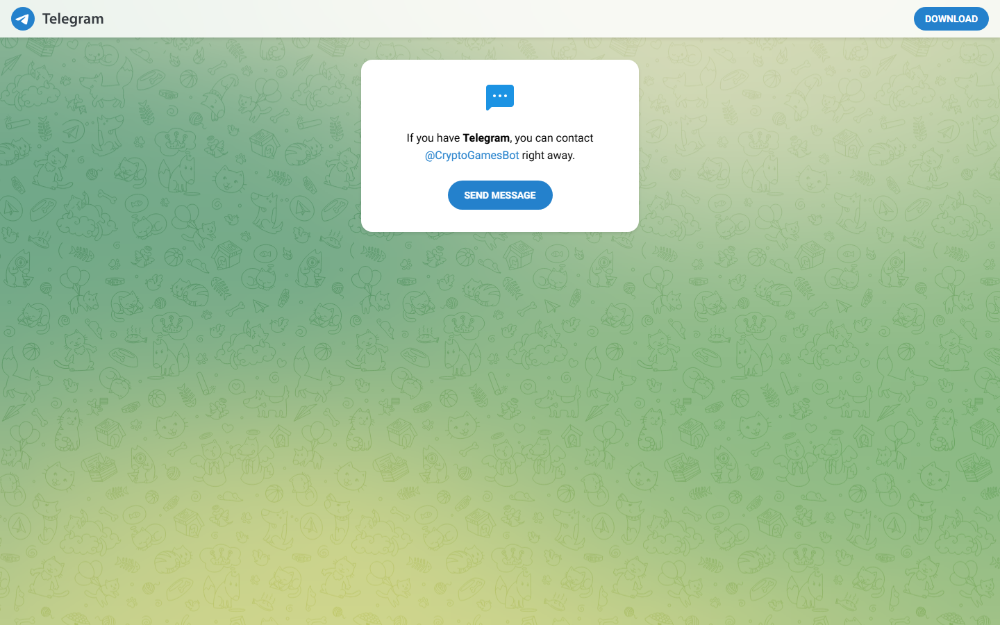

---
title: "Best Telegram Casinos in 2026: TON Mini-Apps and Bot Casinos That Play Inside Telegram"
slug: best-telegram-casinos-2026
meta_title: "Best Telegram Casinos 2026: Bot Casinos and TON Mini-Apps Ranked"
meta_description: "Top Telegram casinos in 2026 -- platforms where you gamble directly inside the Telegram app via bots or TON mini-apps, without visiting an external website."
date: 2026-07-30
last_reviewed: 2026-07-30
site: coinwy
author: Thiago Alvarez
category: exchanges
tags: [telegram casino, ton casino, crypto casino, telegram gambling, ton gaming, telegram bot casino]
schema: ItemList, FAQPage
word_count_target: 3000
---

# Best Telegram Casinos in 2026: Bot Casinos and TON Mini-Apps That Play Inside Telegram

*By Thiago Alvarez -- Reviewed July 2026*

*Telegram casino types compared in 2026 -- bot casinos and TON mini-apps that let you play without leaving the Telegram app.*

A Telegram casino means one thing: you play inside Telegram itself -- not on an external website that has a Telegram support channel.

Most guides label BC.Game, Stake.com, and 1xBit as Telegram casinos. They are not. You cannot play a single game inside Telegram on those platforms. They are crypto casinos with Telegram support channels. They belong in a [crypto casino guide](C-01-best-crypto-casinos-2026.md), not this one.

This article covers only platforms where gameplay actually happens inside Telegram -- either through a bot you control via commands, or through a TON mini-app that opens a full casino interface within the Telegram app itself.

> **Gambling disclaimer:** Crypto casino content on Coinwy is for information only. Gambling carries financial risk. Only participate with funds you can afford to lose. Check local regulations before registering on any platform.

## 2 types of actual Telegram casinos

**Type 1: Bot casinos.** You send commands in a Telegram chat -- `/dice 0.001 BTC`, `/crash 0.0005 ETH` -- and the bot responds with results. No UI, no browser, no website. Privacy is high (no email, no account), but game selection is narrow: dice, crash, lottery, basic card games.

**Type 2: TON mini-app casinos.** A full game interface opens inside Telegram, powered by The Open Network (TON) blockchain. The mini-app looks and feels like a mobile casino but runs within Telegram. Payment flows through your TON wallet (Tonkeeper or Telegram Wallet), which Telegram recognizes natively. Settlement is near-instant -- TON block time is under 5 seconds.

Everything else -- external sites with a Telegram support channel, bots that only handle notifications, platforms that require a browser -- are not Telegram casinos.

## Quick comparison

| Platform | Type | Chain | KYC | Settlement | Est. |
|----------|------|-------|-----|-----------|------|
| [Crypto Games](https://crypto.games/) | Bot casino | BTC, ETH, LTC, DOGE, XRP | Level 0 | 5-15 min | 2013 |
| [DiceBot (@Dice_Bot)](https://t.me/Dice_Bot) | Bot casino | BTC | Level 0 | On-chain | 2016 |
| [TonKeeper Play](https://tonkeeper.com/) | TON mini-app | TON | Level 0 | < 5 sec | 2023 |
| [TONBet](https://tonbet.com/) | TON mini-app | TON | Level 0 | < 5 sec | 2023 |
| [TON Spin](https://t.me/tonspin_bot) | TON mini-app bot | TON | Level 0 | < 5 sec | 2024 |

## 5 best Telegram casinos reviewed (2026)

### 1. Crypto Games -- Best provably fair bot casino

**Hold model:** On-chain, BTC-denominated

> **Our pick for:** Users who want the highest-trust bot casino with a decade of publicly verifiable payouts. [Crypto Games](https://crypto.games/) has run since 2013 with every result cryptographically verifiable. No email, no account, no website required.

| Level 0 | 5-15 min | BTC, ETH, DOGE, LTC, XRP | Yes | Bot commands | 2013 |
|---------|---------|--------------------------|-----|-------------|------|
| KYC | Withdrawal | Chains | Provably fair | Interface | Est. |

[Crypto Games](https://crypto.games/) runs a Telegram bot with commands like `/dice`, `/crash`, `/lottery`. Send crypto to the bot deposit address, bet through commands, withdraw any time. No account. No email. No external website.

The provably fair mechanism is documented across a decade of community verification on Bitcointalk. Server seeds, client seeds, and nonces are published per bet. The Bitcointalk gambling forum has [Crypto Games](https://crypto.games/) withdrawal confirmations from 2014 onwards -- the longest public payout trail of any bot casino. Bot casinos have a higher scam rate than website casinos, and the way to evaluate them is exactly this: a multi-year public withdrawal record.

Game selection is narrow: dice, crash, lottery, roulette, blackjack. No slots, no live dealer, no sports.

*[Crypto Games](https://crypto.games/) bot reviewed in July 2026 -- provably fair dice and crash via Telegram commands, no account required.*

> **Note:** Any Telegram gambling bot without 12+ months of documented public withdrawals should be treated as unverified. [Crypto Games](https://crypto.games/) is the benchmark.

> **Thiago Alvarez -- My take:** [Crypto Games](https://crypto.games/) is the only bot casino I recommend without reservation. The decade-long provably fair record is irreplaceable. The command interface has a learning curve. For users who want a GUI, TonKeeper Play is the right step. For maximum verifiability, nothing in this list comes close.

| Best for | Tradeoffs |
|----------|-----------|
| Highest trust -- 10+ year public payout record | Command-line only, learning curve |
| Provably fair on every game | Narrow game selection |
| Level 0 KYC -- no email ever | No slots, live dealer, or sports |
| Multi-chain (BTC, ETH, DOGE, LTC, XRP) | No graphical interface |

---

### 2. TonKeeper Play -- Best in-app mini-app casino

**Hold model:** TON on-chain, wallet-native

> **Our pick for:** TON holders who want a full casino interface inside Telegram with instant settlement. [TonKeeper Play](https://tonkeeper.com/) runs as a TON mini-app -- the entire experience lives within Telegram, connected to your Tonkeeper wallet. No website, no account.

| < 5 sec | Level 0 | TON | Instant | Mini-app | 2023 |
|---------|---------|-----|---------|---------|------|
| Settlement | KYC | Chain | Deposit confirmation | Type | Est. |

[TonKeeper Play](https://tonkeeper.com/) is the clearest example of a Telegram mini-app casino. Open the mini-app from within Telegram, connect your Tonkeeper wallet (which Telegram recognizes natively), and play. The entire flow stays inside the Telegram app. TON transactions confirm in under 5 seconds.

The constraint: TON only. If you do not hold TON, you must acquire it first. Once your wallet is funded, the experience is frictionless: no forms, no emails, no withdrawal queue.

Game selection is narrower than a full crypto casino. Casual games, dice, crash variants, card games. It is designed to be the fastest, most private gambling experience inside Telegram.

*[TonKeeper Play](https://tonkeeper.com/) mini-app reviewed July 2026 -- full game interface inside Telegram, TON wallet connection, instant settlement.*

> **Thiago Alvarez -- My take:** [TonKeeper Play](https://tonkeeper.com/) answers what a Telegram casino should be better than anything else in this list. TON-only and limited game selection are real constraints. For TON holders who want instant, no-registration in-app gambling, nothing else comes close.

| Best for | Tradeoffs |
|----------|-----------|
| True Telegram mini-app experience | TON only -- requires Tonkeeper wallet |
| Fastest settlement (< 5 sec) | Limited game selection |
| Level 0 KYC -- wallet connect only | TON price exposure |
| No website, no browser | Newer platform, shorter track record |

---

### 3. TONBet -- Best TON mini-app for game variety

**Hold model:** TON on-chain

> **Our pick for:** TON holders who want more game variety than [TonKeeper Play](https://tonkeeper.com/) offers, within the same instant-settlement, no-KYC mini-app format.

| < 5 sec | Level 0 | TON | Dice, crash, slots, roulette | Mini-app | 2023 |
|---------|---------|-----|------------------------------|---------|------|
| Settlement | KYC | Chain | Games available | Type | Est. |

[TONBet](https://tonbet.com/) runs as a TON mini-app accessible directly from within Telegram. Like [TonKeeper Play](https://tonkeeper.com/), it uses TON wallet connection (Level 0 KYC) and settles under 5 seconds. The difference is game breadth: [TONBet](https://tonbet.com/) includes dice, crash, roulette, and basic slots -- a wider selection than TonKeeper Play.

For players who want more than dice and crash but still want to stay inside Telegram, [TONBet](https://tonbet.com/) is the right pick.

> **Thiago Alvarez -- My take:** [TONBet](https://tonbet.com/) is the right choice when [TonKeeper Play](https://tonkeeper.com/) is not enough on game variety. Same TON-only constraint. Same mini-app format. More game types within the true Telegram casino category.

| Best for | Tradeoffs |
|----------|-----------|
| More game variety within TON mini-apps | TON only |
| Level 0 KYC -- no registration | Newer platform, less community history |
| Instant TON settlement | Not available in all Telegram regions |
| Slots + roulette alongside dice and crash | Narrower than full crypto casinos |

---

### 4. DiceBot -- Best for BTC-only bot gambling

**Hold model:** On-chain BTC

> **Our pick for:** Bitcoin-only users who want a simple text-command dice bot with a documented BTC payout history going back to 2016.

| Level 0 | BTC | Yes | Bot commands | 2016 |
|---------|-----|-----|-------------|------|
| KYC | Chain | Provably fair | Interface | Est. |

[@Dice_Bot](https://t.me/Dice_Bot) is a BTC dice bot on Telegram active since 2016. Deposit BTC to the bot address, use `/dice` or `/roll` commands to bet, withdraw at any time. Level 0 KYC: no email, no account. Community reports from r/CryptoCasino and Bitcointalk confirm consistent withdrawals across multiple years.

> **Thiago Alvarez -- My take:** [@Dice_Bot](https://t.me/Dice_Bot) is for BTC purists who want the simplest possible interface. [Crypto Games](https://crypto.games/) is better on multi-chain support and provably fair depth. DiceBot wins on simplicity alone: one game, one chain, reliable payouts since 2016.

| Best for | Tradeoffs |
|----------|-----------|
| BTC-only simplicity | Single game (dice) |
| Long track record (since 2016) | No TON, ETH, or other chains |
| Level 0 KYC -- no account | No mini-app interface |
| Simple command syntax | Less feature-rich than Crypto Games |

---

### 5. TON Spin -- Lightweight TON mini-app bot

**Hold model:** TON on-chain

> **Our pick for:** TON holders who want a fast, lightweight gambling session inside Telegram without the fuller setup of [TonKeeper Play](https://tonkeeper.com/) or [TONBet](https://tonbet.com/).

| Level 0 | TON | Mini-app bot | 2024 |
|---------|-----|-------------|------|
| KYC | Chain | Type | Est. |

[@tonspin_bot](https://t.me/tonspin_bot) runs as a mini-app bot on Telegram. Connect a TON wallet, bet on spin and crash variants, withdraw instantly. The interface is lighter than [TonKeeper Play](https://tonkeeper.com/) -- closer to a bot with a minimal game UI than a full casino.

The track record is short (2024 launch). Start with small amounts and verify your first withdrawal before scaling.

> **Thiago Alvarez -- My take:** [TON Spin](https://t.me/tonspin_bot) is for quick, lightweight TON sessions inside Telegram. The short track record means more uncertainty. Verify before scaling.

| Best for | Tradeoffs |
|----------|-----------|
| Lightweight mini-app bot | Short track record (2024) |
| TON instant settlement | TON only |
| Quick sessions | Narrow game selection |
| Level 0 KYC | Less community withdrawal verification |

---

## Why BC.Game, Stake.com, and 1xBit are not in this list

These three appear in most Telegram casino comparisons. They do not belong there.

[BC.Game](https://bc.game/) has a Telegram support channel and community bot for notifications. Gameplay happens at bc.game -- a website. No games are playable inside Telegram.

[Stake.com](https://stake.com/) has a Telegram community exceeding 100,000 members. Gameplay happens at stake.com. The Telegram channel posts promotions. It is a crypto casino with a Telegram following, not a Telegram casino.

[1xBit](https://1xbit.com/) has a Telegram bot for balance checking and deposit alerts. Gameplay happens at 1xbit.com. The bot is a management tool, not a game interface.

For reviewed coverage of BC.Game, Stake, and 1xBit as crypto casinos, see our [best crypto casinos guide](C-01-best-crypto-casinos-2026.md).

## Bot casino scam detection

Before depositing to any Telegram gambling bot:

- **Verify a multi-year public withdrawal history** -- check Bitcointalk and r/CryptoCasino. Any bot without 12+ months of confirmed withdrawals is unverified.
- **Confirm a provably fair mechanism** -- legitimate bots publish verifiable seed hashes per game. No verifiable fairness = no trust.
- **Search the bot username directly** on Bitcointalk and Reddit. Zero results or complaint threads: walk away.
- **Start with the minimum** -- test a small withdrawal before depositing meaningfully.

[Crypto Games](https://crypto.games/) and [@Dice_Bot](https://t.me/Dice_Bot) have the longest public records in this list. All newer options require proportionally more caution.

## Steps to first bet

| Platform | Steps |
|----------|-------|
| [Crypto Games](https://crypto.games/) | 1. Find bot on Telegram. 2. Send crypto to deposit address. 3. Use commands to play. |
| DiceBot | 1. Open @Dice_Bot. 2. Send BTC to deposit address. 3. Use /dice command. |
| [TonKeeper Play](https://tonkeeper.com/) | 1. Install Tonkeeper. 2. Fund with TON. 3. Open mini-app in Telegram. 4. Connect wallet. 5. Play. |
| [TONBet](https://tonbet.com/) | 1. Install Tonkeeper. 2. Fund with TON. 3. Open TONBet mini-app. 4. Connect. 5. Play. |
| [TON Spin](https://t.me/tonspin_bot) | 1. Fund Telegram Wallet with TON. 2. Open @tonspin_bot. 3. Connect wallet. 4. Play. |

## Which platform should you use?

| If you want... | Best pick |
|----------------|-----------|
| Maximum privacy, no account, BTC | [Crypto Games](https://crypto.games/) or DiceBot |
| Full casino interface inside Telegram | [TonKeeper Play](https://tonkeeper.com/) |
| More game variety in TON mini-app | [TONBet](https://tonbet.com/) |
| Fastest settlement | [TonKeeper Play](https://tonkeeper.com/) or [TONBet](https://tonbet.com/) |
| Lightweight quick session | [TON Spin](https://t.me/tonspin_bot) |

## Frequently asked questions

**What is a Telegram casino?**
A Telegram casino is a platform where you gamble directly inside the Telegram app -- through a bot you control via commands, or through a TON mini-app that opens a full game interface within Telegram. Platforms that use Telegram for support or announcements but require a browser for gameplay are not Telegram casinos.

**Is it safe to use a Telegram gambling bot?**
Only if you can verify its track record. Established bots with multi-year public withdrawal histories -- [Crypto Games](https://crypto.games/) (since 2013) and DiceBot (since 2016) -- have demonstrated reliability. Anonymous new bots with no community history have not.

**How do TON mini-app casinos work?**
They run inside Telegram as mini-apps on The Open Network blockchain. Connect a TON wallet (Tonkeeper or Telegram Wallet), fund it with TON, and play without leaving Telegram. TON block time is under 5 seconds, making settlement nearly instant.

**Do Telegram bot casinos require KYC?**
No. All platforms in this list are Level 0: no email, no ID, no account. A wallet address is the only requirement.

**What is the fastest Telegram casino?**
TON mini-apps ([TonKeeper Play](https://tonkeeper.com/) and [TONBet](https://tonbet.com/)) settle in under 5 seconds. On-chain bot casinos ([Crypto Games](https://crypto.games/), DiceBot) settle in 5-15 minutes depending on network congestion.

**Is Telegram gambling legal?**
Telegram itself does not host gambling. The mini-apps and bot services operate under their own jurisdictional registration. Check local regulations before using any gambling platform.

---

*Last tested: July 2026. TON mini-app availability and bot command structures are subject to platform changes. Platforms were verified as operational in July 2026.*
