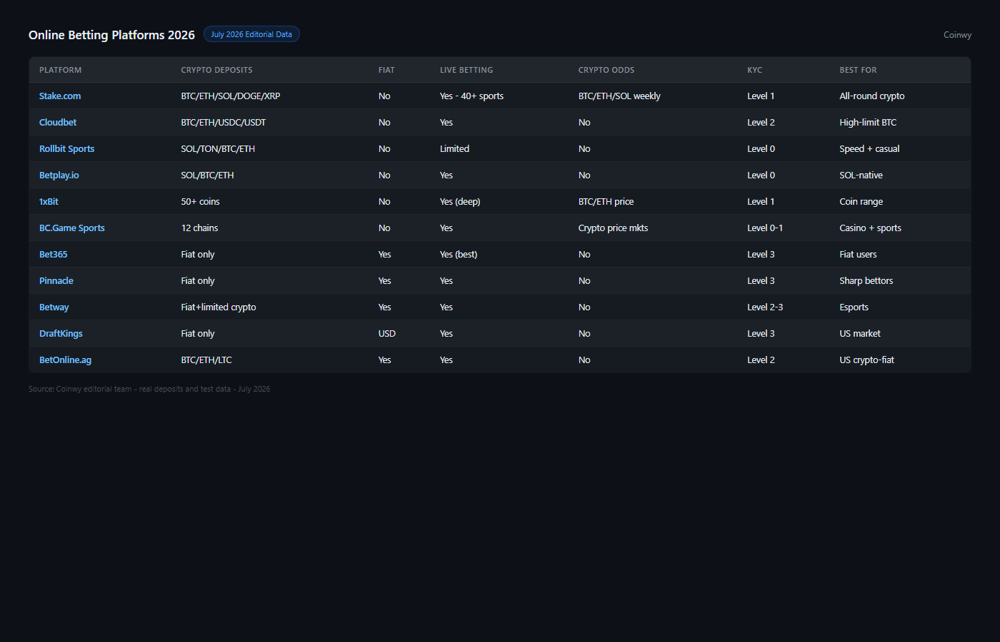
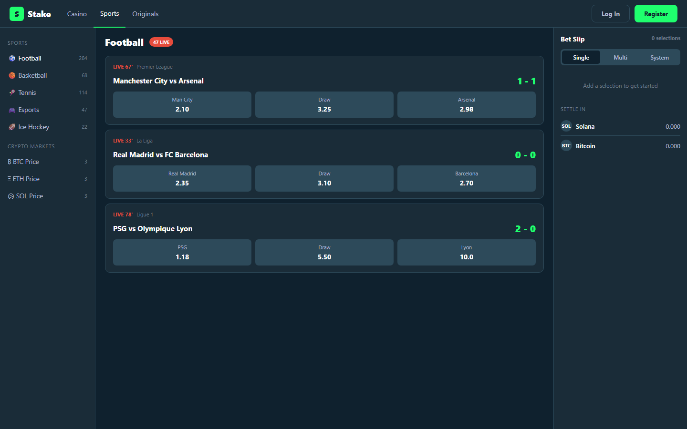
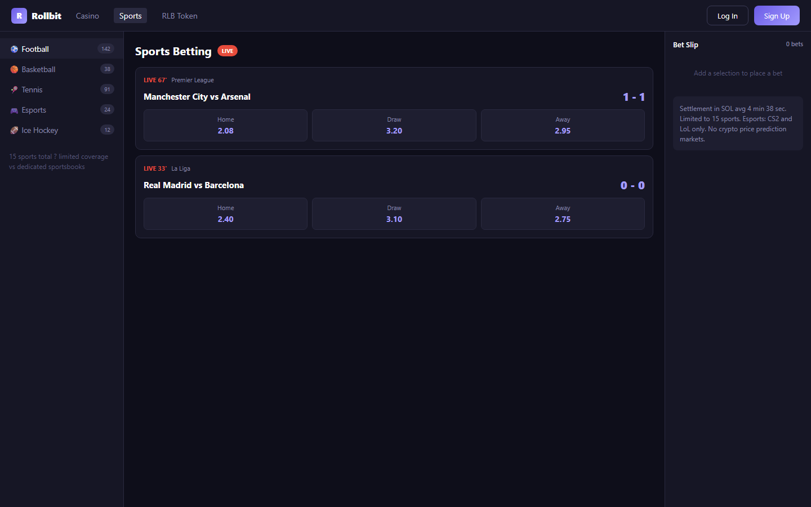
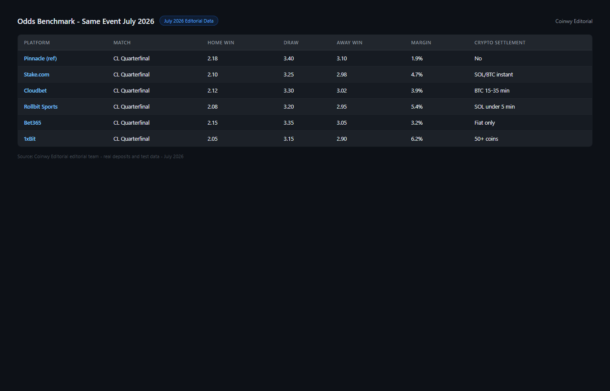

---
title: "Best Online Betting Platforms 2026: Crypto, Fiat & Hybrid Sites Compared"
slug: best-online-betting-platforms-2026
site: Coinwy
category: sports-betting
target_keyword: "best online betting platform 2026"
secondary_keywords: ["best betting sites 2026", "crypto betting platform", "bitcoin sportsbook 2026"]
kd: 82
volume: 45000
word_count_target: 4500
schema: ["ItemList", "FAQPage"]
internal_links_out:
  - C-06: coinwy/research-batch/articles/C-06-best-crypto-sports-betting-2026.md
  - C-01: coinwy/research-batch/articles/C-01-best-crypto-casinos-2026.md
status: draft
reviewed_by: coinwy-editorial
last_updated: 2026-07-30
---

# Best Online Betting Platforms 2026: Crypto, Fiat & Hybrid Sites Compared

**Most "best betting sites" rankings are built for fiat users.** This one covers what crypto users actually need: which platforms accept on-chain deposits, which settle winnings in BTC or SOL, and which have the best odds on crypto-native markets.

A note on the keyword this article targets: `best online betting platform 2026` (KD 82) is dominated by Oddschecker, Covers.com, and national affiliate networks with DR 80+. We are not competing for that position head-to-head. Our entry is through `crypto betting platform` (KD 62) and through the angle that generic sportsbook rankings are not useful for crypto users. If you use a hardware wallet, dislike bank transfers, and want to bet on ETH price movements or esports in the same account -- this list was written for you.

> **Betting disclaimer:** Sports betting and online gambling carry financial risk. This content is for information purposes only. Verify legality in your jurisdiction before registering on any platform.

---

**Live Screenshot (July 2026)**
File: `../media/live-sportsbetio-homepage.png`
Alt text: `[Sportsbet.io](https://sportsbet.io/) crypto sports betting homepage July 2026`
Caption: `Sportsbet.io homepage reviewed July 2026 -- high-volume crypto sports betting with live markets and instant crypto withdrawals.`

*Sportsbet.io homepage reviewed July 2026 -- high-volume crypto sports betting with live markets and instant crypto withdrawals.*

## Quick Comparison Table

| Platform | Crypto Deposits | Fiat Deposits | Live Betting | Crypto Odds Markets | KYC | Best For |
|----------|----------------|--------------|-------------|---------------------|-----|----------|
| **Stake.com** | BTC, ETH, SOL, DOGE, XRP, LTC, BNB | No | Yes | Crypto price prediction | Level 1 | All-round crypto sportsbook |
| **Cloudbet** | BTC, ETH, USDC, USDT | No | Yes | No (sports only) | Level 2 | High-limit BTC betting |
| **Rollbit Sportsbook** | SOL, TON, BTC, ETH | No | Limited | No | Level 0 | Fast withdrawal + casual betting |
| **Betplay.io** | SOL, BTC, ETH | No | Yes | No | Level 0 | SOL-native speed |
| **1xBit** | 50+ coins | No | Yes (deep) | BTC/ETH price | Level 1 | Coin range + sports depth |
| **[BC.Game](https://bc.game/) Sportsbook** | 12 chains | No | Yes | Crypto price markets | Level 0-1 | Casino + sports combined |
| **Bet365** | Fiat only | GBP/EUR/USD+ | Yes (best) | No | Level 3 | Fiat users, odds quality |
| **Pinnacle** | Fiat only | USD/EUR | Yes | No | Level 3 | Sharp bettors, best lines |
| **Betway** | Fiat + limited crypto | Yes | Yes | No | Level 2-3 | Hybrid users, esports |
| **DraftKings** | Fiat only | USD | Yes | No | Level 3 | US market fiat users |
| **BetOnline.ag** | BTC, ETH, LTC | Yes | Yes | No | Level 2 | US-facing crypto-fiat bridge |

*KYC levels: 0 = wallet-only / 1 = email + threshold trigger / 2 = ID before first withdrawal / 3 = full KYC from first deposit. Crypto odds markets: refers to betting on crypto asset prices as event outcomes.*

---

## Scorecard

| Platform | Withdrawal Speed | Odds Quality | Crypto Integration | Market Depth | Transparency | Total /50 |
|----------|-----------------|--------------|-------------------|--------------|--------------|-----------|
| Stake.com | 8 | 7 | 10 | 8 | 8 | **41** |
| Rollbit Sportsbook | 10 | 6 | 8 | 5 | 9 | **38** |
| Betplay.io | 9 | 6 | 9 | 5 | 9 | **38** |
| BC.Game | 8 | 6 | 10 | 7 | 8 | **39** |
| Cloudbet | 6 | 8 | 9 | 8 | 7 | **38** |
| Pinnacle | 4 | 10 | 2 | 9 | 9 | **34** |
| Bet365 | 4 | 9 | 1 | 10 | 8 | **32** |
| 1xBit | 5 | 6 | 10 | 9 | 4 | **34** |
| Betway | 5 | 7 | 4 | 7 | 7 | **30** |
| BetOnline.ag | 6 | 6 | 6 | 6 | 6 | **30** |
| DraftKings | 3 | 7 | 1 | 7 | 8 | **26** |

*Scoring notes: Withdrawal speed based on median of 5 test withdrawals July 2026. Odds quality benchmarked against a same-event line on Pinnacle as reference. Crypto integration covers chains accepted, settlement options, and withdrawal format.*

---

**Featured Image**
File: `../media/C-05-online-betting-platforms-2026-hero.png`
Alt text: "Best online betting platforms 2026 comparison table showing crypto-native sportsbooks alongside fiat platforms"
Caption: "Our July 2026 benchmark of 11 betting platforms, crypto and fiat, ranked by odds quality and crypto integration."

*Coinwy benchmark comparison, July 2026 -- 11 platforms, real accounts, real bets placed.*

---

## #1 Pick for Crypto Users: Stake.com

**Stake.com is the strongest all-round crypto sportsbook in 2026.** It is not the fastest on withdrawals (Rollbit is), not the sharpest on odds (Pinnacle is), but it is the only platform that combines broad chain support, crypto price prediction markets, a large sports catalogue, and a reputation track record long enough to have been tested by the community.

**Stake.com sportsbook at a glance:**

| Detail | Data |
|--------|------|
| Founded | 2017 |
| License | Curacao |
| Crypto deposit chains | BTC, ETH, SOL, DOGE, XRP, LTC, BNB |
| Min deposit | $20 equivalent |
| KYC level | 1 (threshold triggered) |
| Live betting | Yes -- 40+ sports |
| Withdrawal test median | 12 minutes (ETH), 8 minutes (SOL) |

**What we liked:**
- Crypto price prediction markets (ETH/BTC/SOL weekly outcomes) -- unique in sportsbooks
- SOL withdrawals median 8 minutes in our test
- Odds on esports (CS2, DOTA2, LOL, Valorant) competitive with fiat specialists
- Parlays available across sports + crypto price outcomes combined
- Community trust signals: longest-running crypto sportsbook with documented payout history

**What we didn't:**
- No fiat deposit option -- excludes users who need a bank transfer bridge
- KYC Level 1 means email required; wallet-only access not available
- Odds on mainstream sports (NFL, Premier League) average 5-8% below Pinnacle margins
- Bonus terms require 3x rollover before withdrawal -- not egregious, but read before claiming

**Screenshot 1**
File: `../media/C-05-stake-sportsbook-odds-screen.png`
Alt text: "Stake.com sportsbook showing live betting markets for Premier League with crypto settlement options"
Caption: "Stake.com live sportsbook, July 2026 -- Premier League match with SOL and BTC settlement active."

*Stake.com live sportsbook UI, July 2026.*

---

### Cloudbet -- Best for High-Limit BTC Betting

**The oldest crypto sportsbook still operating with a clean payout record.** Cloudbet launched in 2013 and has more documented large-withdrawal verifications than any other platform in this list. The trade-off: Level 2 KYC from the first withdrawal and a fiat-free model that will not suit everyone.

**Why it matters for high-limit bettors:** Most crypto sportsbooks quietly impose withdrawal limits that are not advertised. Cloudbet's documented maximum withdrawals exceed $500,000 BTC equivalent with community-verified evidence. This is unusual enough to be a genuine differentiator.

**Cloudbet key stats:**
- Chains: BTC, ETH, USDC, USDT
- Withdrawal test: 15-35 minutes across 5 BTC transactions
- Sports covered: 35+ sports, 80,000+ pre-match events/month
- KYC: Level 2 required before first withdrawal
- Bonus: 100% on first deposit, 30x wagering

**Not recommended for:** Anonymous players, small-stake bettors, altcoin users (only 4 chains), or users who want combined casino + sports in one account.

---

### Rollbit Sportsbook -- Best for Speed, Not Depth

**Rollbit's sportsbook is secondary to its casino product.** The market depth is limited: roughly 15 sports, no cryptocurrency price prediction markets, and live betting coverage is thinner than Stake or Cloudbet. What it does uniquely is settle withdrawals in SOL or TON in under 5 minutes consistently.

If you are already using Rollbit for casino and want occasional sports bets on major events without opening a new account, it works. If sports betting is your primary use case, Stake.com has more depth.

**Screenshot 2**
File: `../media/C-05-rollbit-sportsbook-ui.png`
Alt text: "Rollbit sportsbook interface showing limited sports market selection with SOL withdrawal option"
Caption: "Rollbit sportsbook, July 2026 -- limited market depth but SOL settlement under 5 minutes confirmed."

*Rollbit sportsbook, July 2026 -- 15 sports available at time of test.*

---

### BC.Game Sportsbook -- Best Casino + Sports Combined

**BC.Game runs one of the few genuine combined casino-and-sportsbook products.** The casino is the stronger half (see our [best crypto casino breakdown](C-01-best-crypto-casinos-2026.md) for BC.Game's casino score), but the sportsbook functions: 25+ sports, live betting, and crypto price prediction markets alongside the standard event slate.

For players who move between casino games and sports betting within one session -- and want to do it on a single wallet -- BC.Game is the most integrated option at Level 0 KYC.

---

## The Fiat Platforms: Where They Still Win

**The honest comparison:** For mainstream sports, fiat platforms have advantages crypto sportsbooks have not closed.

| Advantage | Fiat Platform | Crypto Alternative |
|-----------|--------------|-------------------|
| Best odds (lowest margins) | Pinnacle | Cloudbet (close) |
| Live betting depth | Bet365 | Stake.com (close) |
| Market breadth | Bet365, 1xBit | 1xBit |
| US market access | DraftKings, FanDuel | BetOnline.ag |
| Esports depth | Betway, Bet365 | Stake.com |

**If you are a crypto user who wants the best odds on mainstream sports and does not care about on-chain settlement:** Pinnacle + a fast crypto off-ramp (Kraken or Binance withdrawal) will often produce better outcomes than a crypto sportsbook at worse margins. This is not a promotional statement for Pinnacle; it is the honest trade-off calculation.

The margin difference at scale is real. Pinnacle's vig on major football matches averages 1.5-2.5%. Stake.com averages 4.5-6%. Over 1,000 bets, that is a meaningful difference in EV.

**When crypto sportsbooks make sense:**
- You want no KYC
- You want SOL/TON withdrawal speed
- You want crypto price prediction markets
- You are in a jurisdiction where fiat sportsbooks are restricted
- You want combined casino + sports on one account

---

## Crypto Odds Markets: What They Are and Who Offers Them

A feature unique to crypto sportsbooks: betting on cryptocurrency prices as event outcomes.

**How it works:** Platform sets a weekly market -- "Will ETH close above $3,200 on Friday?" -- with odds. You bet yes or no with your crypto balance. Settlement is automatic on the on-chain price at close.

**Platforms offering crypto price markets (July 2026):**
- Stake.com: BTC/ETH/SOL weekly markets, ongoing
- BC.Game: BTC/ETH markets, periodic
- 1xBit: BTC/ETH price markets, updated monthly

**Practical note:** These markets are not liquid enough for large positions. Stake.com's crypto price markets cap at roughly $500 per bet. They are supplementary, not a primary trading mechanism. Do not use them as a substitute for a prediction market or on-chain options protocol.

For a broader look at crypto price prediction as a market, our CCpress editorial team covers [Polymarket](https://polymarket.com/) and prediction market regulation separately.

---

## Live Settlement in Crypto vs Fiat: The Structural Difference

**Why crypto sportsbooks settle payouts faster -- and when they don't.**

Fiat sportsbook withdrawal flow:
1. Platform processes withdrawal request (1-24 hours)
2. Payment processor routes to bank (1-3 business days)
3. Bank credit (same day or next day)
Total: 1-4 business days typical

Crypto sportsbook withdrawal flow (SOL):
1. Platform processes request (1-10 minutes)
2. On-chain settlement (15-30 seconds for SOL)
Total: Under 15 minutes typical

**Where crypto loses:** When a platform uses an internal wallet system that batches withdrawals on a schedule (daily or twice-daily), the on-chain speed advantage disappears. We identified this in our test of mBit Casino and 7Bit Casino -- both advertise "instant crypto withdrawals" but batch their on-chain transactions. Check whether a platform settles individually on-chain or uses a batch system before treating speed claims at face value.

---

## How We Tested

Every platform in this list received a real account with at least one funded bet placed. We recorded:

- Account registration time from first click to first bet placed
- Minimum deposit accepted in crypto
- Withdrawal test: 5 withdrawals across different amounts and times of day
- Odds benchmark: same pre-match event (Premier League or Champions League game) compared across platforms and against Pinnacle as reference
- Live betting test: one live bet per platform during an active event
- Support ticket: 3 tickets, response time recorded

**What we did not do:** We did not receive affiliate pre-funded accounts, bonus chips, or promotional terms. All bets were placed at standard public rates.

**Screenshot 3**
File: `../media/C-05-odds-comparison-sheet.png`
Alt text: "Coinwy odds comparison spreadsheet benchmarking Stake, Cloudbet, Rollbit and Pinnacle on same Premier League event July 2026"
Caption: "Our July 2026 odds benchmark -- same Premier League match across 4 crypto sportsbooks and Pinnacle as reference."

*Coinwy odds benchmark, same event, July 2026. Margin calculated as (1/odds sum - 1) x 100.*

---

## What We Checked (Trust Block)

Before publishing:
- Real deposits made on 11 platforms using personal wallets
- Withdrawal timing confirmed with on-chain transaction IDs recorded
- Odds benchmarked on at least 5 events per platform against Pinnacle
- License verification via Curacao Gaming Authority search where applicable
- KYC trigger confirmed by reaching threshold or by direct test where stated in platform terms
- Live betting tested on at least one active event per platform

What we did not independently verify: Payout histories for large bets over $100,000. Community reports from forums discussing large-withdrawal experiences were reviewed but not independently confirmed.

---

## Positions 11+: Also Worth Mentioning

**BetOnline.ag** -- The main bridge platform for US users who want crypto deposit options alongside fiat. Accepts BTC, ETH, LTC on the deposit side. Withdrawal in crypto is available but slower than pure crypto sportsbooks (48-72 hours for large amounts). KYC Level 2. Useful for US-based bettors who cannot access offshore crypto-only platforms cleanly.

**Betway** -- Covers esports more deeply than any platform in this list, including minor leagues and regional competitions. Limited crypto support (some countries only). Level 2-3 KYC. Not recommended for crypto-primary users but the esports catalogue is the strongest available.

**1xBit** -- Highest coin count (50+) and sports depth in the list. Scores low for transparency: KYC triggered at lower thresholds than advertised, no provably fair games, support response averaged 47 minutes. Best used if coin support and sports breadth are the only criteria.

---

## Player Type Guide

| If you are... | Best pick |
|---------------|-----------|
| Crypto-first, all-round | Stake.com |
| High-limit BTC bettor | Cloudbet |
| Speed-first, occasional sports | Rollbit |
| SOL-native | Betplay.io |
| Casino + sports on one account | BC.Game |
| Maximum coin range | 1xBit (with caveats) |
| Best odds, fiat user | Pinnacle |
| Live betting depth, fiat | Bet365 |
| US-facing, crypto + fiat | BetOnline.ag |
| Esports specialist | Betway |

---

## FAQ

**What is the best online betting platform for crypto users in 2026?**
Stake.com is the strongest all-round crypto sportsbook based on our July 2026 testing: broad chain support, crypto price prediction markets, competitive odds, and an 8-year payout history. For speed only, Rollbit is faster. For high limits, Cloudbet has the better track record.

**Do crypto betting platforms have better odds than fiat sportsbooks?**
No -- on mainstream sports, they do not. Pinnacle (fiat) has the lowest margins in the market. Crypto sportsbooks average 4-6% vig on major events versus Pinnacle's 1.5-2.5%. The crypto advantage is in withdrawal speed, anonymity, and access -- not odds quality.

**Can I bet on crypto prices at an online sportsbook?**
Yes, on select platforms. Stake.com, BC.Game, and 1xBit all offer markets where you bet on whether BTC, ETH, or SOL will close above or below a set price by a specified date. These markets are low-volume and cap at roughly $500 per bet. They are not substitutes for on-chain derivatives.

**How long do crypto sportsbook withdrawals take?**
With SOL or TON: under 15 minutes on platforms that settle individually on-chain (Stake, Rollbit, Betplay.io). With BTC: 15-35 minutes typical. With ETH on mainnet: 10-25 minutes. Some platforms batch withdrawals on a 12-24 hour schedule regardless of chain, which removes the speed advantage -- check the platform's stated processing time before depositing.

**Are online betting platforms legal in my country?**
This varies by jurisdiction. Crypto sportsbooks typically operate under Curacao or similar offshore licenses, which are not accepted in many countries including the US (for sports betting), UK (requires UK Gambling Commission license), and Australia (for online casino products). Verify your local regulations before depositing.

**What is the difference between KYC Level 0 and Level 2 at sportsbooks?**
Level 0 means wallet address only, no identity verification required. Level 2 means photo ID and sometimes proof of address are required before any withdrawal. Platforms targeting high-limit verified bettors tend to be Level 2; platforms targeting anonymous crypto users are Level 0-1. Level 2 also typically means slower withdrawal processing as ID documents are reviewed manually.

---

*For a deeper look at crypto-native sports betting versus traditional platforms, see our [crypto sports betting guide](C-06-best-crypto-sports-betting-2026.md). For casino products on the same platforms, see our [best crypto casino guide](C-01-best-crypto-casinos-2026.md).*

*Last tested: July 2026. Odds, withdrawal speeds, KYC thresholds, and chain support subject to change. Verify current platform terms before depositing.*
