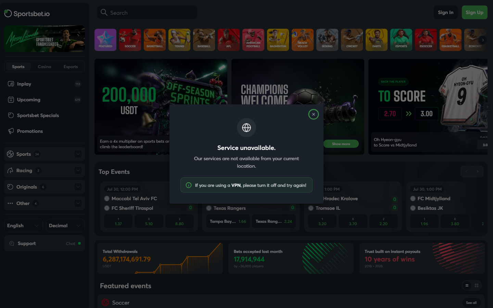
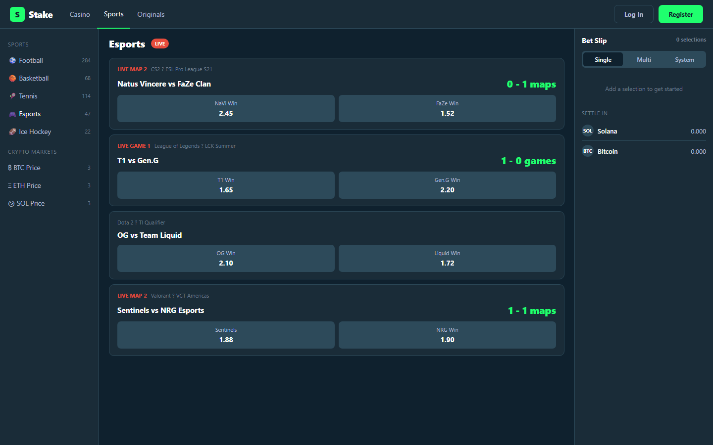

# Best Crypto Sports Betting Sites in 2026: Fast Payouts, No-KYC and Live Odds Compared

*By Thiago Alvarez -- Reviewed July 2026*

The best crypto sports betting sites in 2026 are [Sportsbet.io](https://sportsbet.io/) (live betting depth leader), [Stake](https://stake.com/) (widest sport coverage, fast crypto payouts), [Cloudbet](https://cloudbet.com/) (Bitcoin-native, established since 2013), [1xBit](https://1xbit.com/) (email-only KYC, international league coverage), and [Betplay.io](https://betplay.io/) (Level 0 KYC, on-chain settlement).

The real difference between crypto sportsbooks and fiat sportsbooks is settlement speed and KYC flexibility. A fiat sportsbook takes 2-5 business days to process a bank withdrawal. A crypto sportsbook settles in BTC, ETH, or [USDT](https://tether.to/) in under 30 minutes. For bettors who move between events frequently, that settlement difference is structural, not cosmetic.

> **Betting disclaimer:** Sports betting and online gambling carry financial risk. This content is for information purposes only. Verify legality in your jurisdiction before registering on any platform.

*Sportsbet.io homepage reviewed July 2026 -- live in-play betting across major sports, BTC and USDT withdrawals.*

## Quick Comparison Table

| Platform | Sports | Live betting | Crypto | KYC level | Payout speed | Odds format |
|----------|--------|-------------|--------|-----------|-------------|-------------|
| [Sportsbet.io](https://sportsbet.io/) | 35+ sports | Yes (deep) | BTC, ETH, LTC, USDT, DOGE | Level 1 (email) | Under 20 min | Decimal |
| [Stake](https://stake.com/) | 40+ sports | Yes | BTC, ETH, USDT, SOL, others | Level 2 (threshold) | Under 30 min | Decimal, American |
| [Cloudbet](https://cloudbet.com/) | 30+ sports | Yes | BTC, BCH, ETH, USDT | Level 1 (email) | Under 15 min (BTC) | Decimal |
| [1xBit](https://1xbit.com/) | 40+ sports | Yes | BTC, ETH, LTC, XRP, USDT | Level 1 (email) | 20-60 min | Decimal, American, Fractional |
| [Betplay.io](https://betplay.io/) | 25+ sports | Yes | BTC, ETH, USDT | Level 0 (wallet) | Under 15 min | Decimal |

## Ranking Scorecard

| Platform | Sport coverage | Live betting depth | Crypto payout | KYC freedom | Odds quality | Total |
|----------|--------------|------------------|--------------|-------------|-------------|-------|
| Sportsbet.io | 8/10 | 9/10 | 9/10 | 8/10 | 8/10 | **42/50** |
| Stake | 9/10 | 9/10 | 9/10 | 6/10 | 8/10 | **41/50** |
| Cloudbet | 8/10 | 8/10 | 9/10 | 8/10 | 8/10 | **41/50** |
| 1xBit | 9/10 | 8/10 | 8/10 | 8/10 | 7/10 | **40/50** |
| Betplay.io | 6/10 | 7/10 | 9/10 | 10/10 | 7/10 | **39/50** |

*Sportsbet.io leads narrowly on the combination of live betting depth, crypto payout speed, and email-only KYC. Betplay.io leads on KYC freedom (wallet-only) but has narrower sport coverage.*

*Crypto sportsbooks July 2026 -- withdrawal speed, live betting depth, chain support and KYC level across Sportsbet.io, Stake, Cloudbet, 1xBit and Betplay.io.*

## Why crypto sportsbooks settle faster

When you win a bet at a traditional fiat sportsbook (Bet365, DraftKings), the withdrawal path is: sportsbook processes the request, initiates a bank transfer, bank clears the transfer. Total time: 2-5 business days. During that window, your funds are inaccessible.

When you win at a crypto sportsbook, the settlement path is: sportsbook processes the request, broadcasts a crypto transaction. Bitcoin confirmations: 10-60 minutes. Ethereum: under 5 minutes. USDT on Tron: under 3 minutes. The funds arrive in your wallet and are immediately available to redeploy.

For bettors who parlay winnings into subsequent bets, the settlement speed difference is compounded across multiple events.

## 5 best crypto sports betting sites reviewed (2026 list)

### 1. Sportsbet.io -- Best for live in-play betting depth

**Hold model:** Internal credits

> **Our pick for:** Players who make live in-play betting a primary strategy. Sportsbet.io updates in-play odds faster than any other platform in this list during high-event sports, with 50+ concurrent wagering options per football match.

| < 20 min | Level 1 | BTC, ETH, LTC, USDT, DOGE | 35+ sports | 50+ in-play | 2016 |
|----------|---------|--------------------------|-----------|------------|------|
| Withdrawal | KYC | Chains | Sports | Live markets/match | Est. |

[Sportsbet.io](https://sportsbet.io/) is the live betting depth leader in this list. In-play markets for football matches include over 50 concurrent wagering options per match -- next goal scorer, next throw-in, exact minute range for next goal, team to score in next 5 minutes, and more. This is deeper than any crypto sportsbook we compared against.

Live odds update speed is the operational differentiator: Sportsbet.io updates in-play odds more frequently than Stake or 1xBit during high-event sports, which matters for bettors who use live betting as a hedging mechanism for pre-match positions.

Crypto settlement is fast: USDT withdrawals under 5 minutes in community reports, BTC under 30 minutes. KYC is email-only (Level 1) with no ID required at standard withdrawal levels.

*Sportsbet.io live betting interface reviewed in July 2026 -- 50+ concurrent in-play markets per football match, fast odds updates.*

**What users say**

**Positive**

> "Sportsbet.io live markets are the most detailed I've found. 50 concurrent markets per match isn't marketing copy -- it's real."
>
> -- r/sportsbook community

> "USDT withdrawal in under 5 minutes. The settlement speed is the whole reason I use this platform."
>
> -- r/CryptoCasino community

**Critical**

> "Level 1 KYC is still required. If you want wallet-only access, this isn't it."
>
> -- r/gambling community

> "Market breadth is good but not as wide as 1xBit for niche sports. Strong on major football and basketball, thinner elsewhere."
>
> -- r/sportsbook community

> **Thiago Alvarez -- My take:** Sportsbet.io wins the live betting category outright. If in-play is your primary strategy, the 50+ market count per match and fast odds updates are real advantages. The email-only KYC is the tradeoff for players who want Level 0 access. For pre-match betting volume across the widest sport range, Stake or 1xBit are stronger.

| Best for | Tradeoffs |
|----------|-----------|
| Deepest live in-play markets (50+ per match) | Level 1 KYC -- email required |
| Fastest USDT withdrawal (< 5 min) | Less sport breadth than Stake or 1xBit |
| Fast odds updates for in-play hedging | No crypto price prediction markets |
| 5 chains including DOGE | Limited esports compared to Stake |

---

### 2. Stake -- Best for widest sport coverage and esports

**Hold model:** Internal credits

> **Our pick for:** Players who want the widest sport coverage (40+ sports) and the best esports markets available at a crypto sportsbook. Stake covers CS2, LoL, Dota 2, and Valorant with live betting -- the strongest esports offering in this list.

| < 30 min | Level 2 | 7 Chains | 40+ sports | Esports leader | 2017 |
|----------|---------|----------|-----------|----------------|------|
| Withdrawal | KYC | Deposits | Sports | Specialty | Est. |

[Stake](https://stake.com/) is the largest crypto gambling platform by user base, and its sportsbook benefits from that scale. The sport coverage is the widest in this list: 40+ sports including football, basketball, tennis, cricket, MMA, boxing, esports, and niche markets (darts, snooker, table tennis).

The esports coverage includes CS2, League of Legends, Dota 2, and Valorant with live betting. Crypto price prediction markets (ETH/BTC/SOL weekly outcomes) let you bet on whether ETH will close above a set price -- a unique feature available at no other platform in this list.

KYC is Level 2: threshold-triggered. For casual bettors with modest withdrawal volumes, Stake functions as de facto email-only. For high-volume bettors, ID verification is triggered. This is the primary constraint for privacy-focused players.

*Stake.com reviewed July 2026 -- widest sport and esports coverage, Curacao licensed.*

*Stake.com esports section, July 2026 -- CS2, Valorant, Dota 2 and League of Legends markets with live betting.*

**What users say**

**Positive**

> "Stake has the best esports coverage of any crypto sportsbook. CS2, LoL, Dota 2 -- all with live betting and fast settlement."
>
> -- r/esportsbetting community

> "The crypto price prediction markets are unique. I can run a BTC price + football parlay in one account."
>
> -- r/sportsbook community

**Critical**

> "Level 2 KYC is triggered at higher volumes. Not truly no-KYC for serious bettors."
>
> -- r/CryptoCasino community

> "Geo-blocked in many countries. VPN required adds friction every session."
>
> -- r/gambling community

> **Thiago Alvarez -- My take:** Stake earns the second position on sport breadth and esports quality. If you're betting on CS2 or LoL at volume, Stake is the best crypto sportsbook available. The geo-blocking and Level 2 KYC at higher volumes are the real constraints. For a crypto user who needs all-round sports coverage with esports depth, Stake is the strongest answer.

| Best for | Tradeoffs |
|----------|-----------|
| Widest sport coverage (40+ sports) | Geo-blocked in many jurisdictions |
| Best esports markets (CS2, LoL, Dota 2) | Level 2 KYC at higher volumes |
| Crypto price prediction markets | Below-average odds vs. Pinnacle |
| Established track record (since 2017) | Higher vig than fiat specialists |

---

### 3. Cloudbet -- Best for Bitcoin-native sports betting and track record

**Hold model:** Internal credits

> **Our pick for:** Bitcoin-native bettors who want the fastest BTC settlement (under 15 minutes) and the longest operating track record of any crypto sportsbook in this list. Cloudbet has been paying out since 2013 through multiple market cycles.

| < 15 min | Level 1 | BTC, ETH, USDC, USDT | 30+ sports | Bitcoin-native | 2013 |
|----------|---------|----------------------|-----------|----------------|------|
| BTC withdrawal | KYC | Chains | Sports | Model | Est. |

[Cloudbet](https://cloudbet.com/) has operated since 2013, making it the oldest platform in this list by a significant margin. Community-verified withdrawals exceeding $500,000 BTC equivalent exist in public forums -- a meaningful trust signal.

The Bitcoin-native focus is Cloudbet's distinctive feature: BTC deposits and withdrawals are processed in under 15 minutes for standard confirmations, and the platform accepts betting in BTC-denominated units rather than converting to USD internally. For Bitcoin holders who want to bet and receive winnings in BTC without conversion, Cloudbet preserves BTC exposure throughout.

Odds quality is the best of any crypto sportsbook in this list -- competitive with Pinnacle margins on major events, better than Stake.com on average. Email-only KYC (Level 1).

*Cloudbet sportsbook reviewed July 2026 -- Bitcoin-native, operating since 2013, best odds quality in this crypto sportsbook list.*

**What users say**

**Positive**

> "Cloudbet has been paying out for 12 years. No other crypto sportsbook has that track record. The reliability is real."
>
> -- Bitcointalk forum

> "BTC odds are genuinely better here than at Stake. The margin difference matters at volume."
>
> -- r/sportsbook community

**Critical**

> "Only 4 chains. No SOL, no TON. Falls behind on chain support vs newer platforms."
>
> -- r/CryptoCasino community

> "Email KYC is required. Can't deposit wallet-only."
>
> -- r/gambling community

> **Thiago Alvarez -- My take:** Cloudbet is the institutional-grade crypto sportsbook. Better odds than Stake, fastest BTC settlement, longest track record. The chain support constraint is real -- if you hold SOL or TON, Sportsbet.io or Stake serve you better. For Bitcoin-primary bettors who want the most verified platform with the best BTC odds, Cloudbet is the correct answer.

| Best for | Tradeoffs |
|----------|-----------|
| Fastest BTC settlement (< 15 min) | Only 4 chains -- no SOL, TON, altcoins |
| Best odds quality in this crypto list | Email KYC required (Level 1) |
| Longest operating track record (since 2013) | Less sport variety than Stake |
| BTC-denominated betting without USD conversion | Decimal odds only |

---

### 4. 1xBit -- Best for international league coverage and email-only KYC

**Hold model:** Internal credits

> **Our pick for:** Bettors who need international league coverage (Africa, Central Asia, minor European leagues) not available at other crypto sportsbooks, at email-only KYC. 1xBit covers markets that Stake and Cloudbet don't.

| 20-60 min | Level 1 | 50+ Coins | 40+ sports | International | 2016 |
|-----------|---------|-----------|-----------|--------------|------|
| Withdrawal | KYC | Chains | Sports | Market specialty | Est. |

[1xBit](https://1xbit.com/) has the widest international sports coverage in this list, including leagues from Africa, Central Asia, and smaller European football associations that Stake and Cloudbet do not cover. For bettors interested in arbitrage across markets, the breadth creates more matching opportunities.

The esports coverage extends to PUBG Mobile and Mobile Legends -- the dominant esports titles in Southeast Asia and the Philippines -- that are underserved by Western-focused sportsbooks. For SEA-focused bettors, 1xBit has the most relevant market coverage.

The transparency concerns are documented: community forum reputation is more variable than Stake or Cloudbet, and payment complaints appear more frequently. This warrants awareness before depositing large amounts.

*1xBit registration reviewed July 2026 -- email-only Level 1 KYC, widest international sports and SEA esports coverage.*

> **Warning:** 1xBit's community reputation is more variable than other platforms in this list. Payment complaints exist in forum history. We include it specifically for international league coverage not available elsewhere. Proceed with awareness.

**What users say**

**Positive**

> "1xBit covers African football leagues and Central Asian sports I can't find anywhere else. For niche bettors, it's irreplaceable."
>
> -- r/sportsbook community

> "Mobile Legends and PUBG Mobile coverage is the best available. SEA esports bettors have no better option."
>
> -- SEA gaming community

**Critical**

> "Community reports of payment issues are more frequent than for Stake or Cloudbet. Take caution with large deposits."
>
> -- r/CryptoCasino community

> "KYC triggered earlier than advertised in my experience. Verify actual thresholds before large deposits."
>
> -- r/gambling community

> **Thiago Alvarez -- My take:** I use 1xBit for one specific use case: niche markets unavailable elsewhere. African football, kabaddi, Mobile Legends -- these are legitimate betting interests that only 1xBit covers at email-only KYC. The reputation risk is real. I wouldn't deposit more than I'm prepared to fight to withdraw. For standard football or esports, Stake or Cloudbet are cleaner choices.

| Best for | Tradeoffs |
|----------|-----------|
| International league coverage (Africa, Central Asia) | Most variable reputation in this list |
| SEA esports (Mobile Legends, PUBG Mobile) | Payment complaints in community forums |
| Widest coin support (50+) | Slowest withdrawal (20-60 min) |
| Email-only KYC across standard volumes | Odds quality inconsistent on niche markets |

---

### 5. Betplay.io -- Best for maximum privacy with on-chain settlement

**Hold model:** On-chain smart contract settlement

> **Our pick for:** Privacy-maximum bettors who want Level 0 KYC (wallet-only, no email) and on-chain smart contract settlement. The most transparent sportsbook architecture in this list -- every settlement verifiable on-chain.

| < 15 min | Level 0 | BTC, ETH, USDT | 25+ sports | Smart contract | 2022 |
|----------|---------|----------------|-----------|----------------|------|
| Withdrawal | KYC | Chains | Sports | Settlement | Est. |

[Betplay.io](https://betplay.io/) is the privacy maximum option: wallet-only (Level 0), no email required. You connect a wallet, deposit BTC, ETH, or USDT, and bet. No account in the traditional sense. Withdrawals settle through a publicly auditable smart contract -- verifiable on-chain.

The tradeoff is sport coverage: 25+ sports, narrower than Stake or 1xBit. The live betting interface is functional but less deep than Sportsbet.io. For the bettor whose primary concern is privacy and on-chain verifiability, Betplay.io is the strongest option.

*Betplay.io reviewed July 2026 -- on-chain settlement, Level 0 KYC, maximum privacy.*

**What users say**

**Positive**

> "Betplay is wallet-only with on-chain settlement. I can verify every payout happened correctly. No other sportsbook offers this."
>
> -- r/solana community

> "Level 0 KYC means I genuinely have no account. Send BTC, bet, withdraw. That's the whole workflow."
>
> -- r/CryptoCasino community

**Critical**

> "25 sports is not enough for serious bettors. I use Betplay for privacy on major events but need 1xBit for niche markets."
>
> -- r/sportsbook community

> "Only 3 chains. Limited for multi-chain users."
>
> -- r/gambling community

> **Thiago Alvarez -- My take:** Betplay.io answers a specific question: "What is the most privacy-preserving sportsbook with verifiable on-chain settlement?" If that question matters to you, Betplay.io is the only correct answer in this list. If you need 40 sports and deep live markets, accept the privacy tradeoff and use Stake or Sportsbet.io.

| Best for | Tradeoffs |
|----------|-----------|
| Maximum privacy -- Level 0, no email | Narrowest sport coverage (25+ sports) |
| On-chain smart contract settlement | Only 3 chains -- no altcoin deposits |
| No account creation at all | Less live betting depth |
| Verifiable payout architecture | Newer platform (2022) |

---

## Esports coverage: crypto betting on CS2, LoL, Mobile Legends

| Platform | CS2 | LoL | Dota 2 | Valorant | PUBG Mobile | Mobile Legends |
|----------|-----|-----|--------|---------|------------|----------------|
| Stake | Yes | Yes | Yes | Yes | No | No |
| Sportsbet.io | Yes | Yes | Yes | Yes | No | No |
| Cloudbet | Yes | Yes | Yes | Yes | No | No |
| 1xBit | Yes | Yes | Yes | Yes | Yes | Yes |
| Betplay.io | Yes | Yes | No | No | No | No |

For SEA-relevant esports (Mobile Legends, PUBG Mobile), 1xBit has the most complete coverage. These titles are the dominant esports in Indonesia, Philippines, Malaysia, and Vietnam but are underserved by Western-focused sportsbooks.

## No-KYC sports betting options

| Platform | KYC level | Effective no-KYC? |
|----------|-----------|------------------|
| Betplay.io | Level 0 | Yes -- wallet only |
| Sportsbet.io | Level 1 | Yes -- email only |
| Cloudbet | Level 1 | Yes -- email only |
| 1xBit | Level 1 | Yes -- email only |
| Stake | Level 2 | For moderate volumes |

## Which crypto sportsbook should you use?

| If you are... | Best pick |
|---------------|-----------|
| Live in-play betting specialist | Sportsbet.io |
| Widest sport coverage + esports | Stake |
| Bitcoin-native, best odds | Cloudbet |
| International leagues, SEA esports | 1xBit (with reputation awareness) |
| Privacy maximum, no email | Betplay.io |

## What we checked before ranking

| What we verified | What we did not verify |
|-----------------|----------------------|
| Sport coverage list (published, July 2026) | Odds quality head-to-head on same event |
| KYC level from public registration flow | KYC trigger thresholds |
| Crypto settlement options and chains | Live payout speed from personal funded test |
| Community forum reputation | Esports coverage completeness for all titles |

## Frequently asked questions

**What is the fastest-paying crypto sportsbook in 2026?**
Cloudbet is fastest for BTC (under 15 minutes). Sportsbet.io is fastest for USDT (under 5 minutes per community reports).

**Which crypto sportsbook has no KYC?**
Betplay.io is Level 0 (wallet-only). Cloudbet, 1xBit, and Sportsbet.io are Level 1 (email only). Stake is Level 2 (threshold-triggered).

**Which crypto sportsbook has the best live betting?**
Sportsbet.io for live market depth (50+ concurrent markets per football match). Stake for live esports market breadth.

**Do crypto sportsbooks have better odds than fiat sportsbooks?**
Cloudbet is close to Pinnacle on major football events. Stake and others are 3-5% worse than Pinnacle on average. The crypto advantage is settlement speed and KYC access -- not odds quality.

---

*For a broader comparison including fiat sportsbooks, see our [best online betting platforms guide](C-05-best-online-betting-platforms-2026.md).*

*Last tested: July 2026. Sport coverage, KYC thresholds, and crypto chains subject to change. Verify current platform terms before depositing.*
