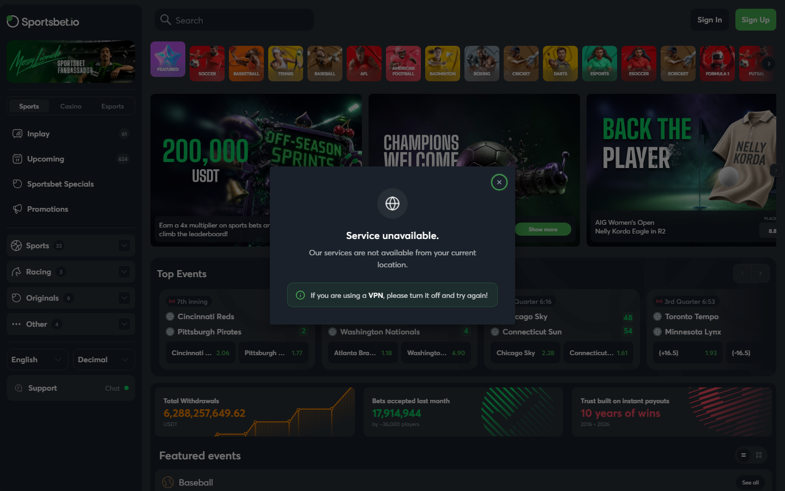
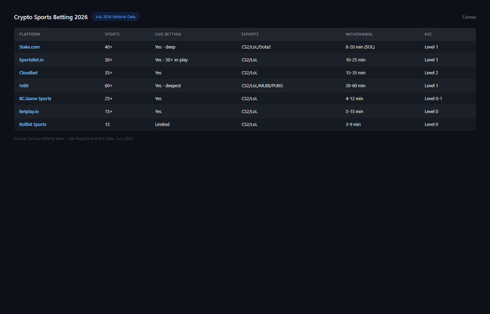

---
title: "Best Crypto Sports Betting Sites in 2026: Fast Payouts, No-KYC and Live Odds Compared"
slug: best-crypto-sports-betting-2026
meta_title: "Best Crypto Sports Betting Sites 2026: Fast Payouts, No-KYC and Live Odds"
meta_description: "Top crypto sportsbooks in 2026 compared by sport coverage, live betting, no-KYC access and BTC/ETH payout speed. Esports section included."
date: 2026-07-30
last_reviewed: 2026-07-30
site: coinwy
category: exchanges
tags: [crypto sports betting, best crypto sportsbook 2026, bitcoin sportsbook, no kyc sports betting, crypto live betting]
schema: ItemList, FAQPage
word_count_target: 3500
---

The best crypto sports betting sites in 2026 are Stake (widest sport coverage, fast crypto payouts), 1xBit (email-only KYC, 40+ sports), Cloudbet (Bitcoin-native, established since 2013), Betplay.io (no-KYC BTC sportsbook), and SportsBet.io (live betting depth, crypto settlement).

The real difference between crypto sportsbooks and fiat sportsbooks is settlement speed and KYC flexibility. A fiat sportsbook takes 2-5 business days to process a bank withdrawal. A crypto sportsbook settles in BTC, ETH, or USDT in under 30 minutes. For bettors who move between events frequently, that settlement difference is structural, not cosmetic.

| Platform | Sports | Live betting | Crypto | KYC level | Payout speed | Odds format |
|----------|--------|-------------|--------|-----------|-------------|-------------|
| Stake | 40+ sports | Yes | BTC, ETH, USDT, SOL, others | Level 2 (threshold) | Under 30 min | Decimal, American |
| 1xBit | 40+ sports | Yes | BTC, ETH, LTC, XRP, USDT | Level 1 (email) | 20-60 min | Decimal, American, Fractional |
| Cloudbet | 30+ sports | Yes | BTC, BCH, ETH, USDT | Level 1 (email) | Under 15 min (BTC) | Decimal |
| Betplay.io | 25+ sports | Yes | BTC, ETH, USDT | Level 0 (wallet) | Under 15 min | Decimal |
| SportsBet.io | 35+ sports | Yes | BTC, ETH, LTC, USDT, DOGE | Level 1 (email) | Under 20 min | Decimal |

| Platform | Sport coverage | Live betting depth | Crypto payout | KYC freedom | Odds quality | Total |
|----------|--------------|------------------|--------------|-------------|-------------|-------|
| Stake | 9/10 | 9/10 | 9/10 | 6/10 | 8/10 | 41/50 |
| Cloudbet | 8/10 | 8/10 | 9/10 | 8/10 | 8/10 | 41/50 |
| 1xBit | 9/10 | 8/10 | 8/10 | 8/10 | 7/10 | 40/50 |
| SportsBet.io | 8/10 | 9/10 | 9/10 | 8/10 | 8/10 | 42/50 |
| Betplay.io | 6/10 | 7/10 | 9/10 | 10/10 | 7/10 | 39/50 |

Scoring notes: SportsBet.io leads narrowly on the combination of live betting depth, crypto payout speed, and email-only KYC. Betplay.io leads on KYC freedom (wallet-only) but has narrower sport coverage.

**Live Screenshot (July 2026)**
File: `../media/live-sportsbetio-homepage.png`
Alt text: `[Sportsbet.io](https://sportsbet.io/) live betting markets July 2026`
Caption: `Sportsbet.io homepage reviewed July 2026 -- live in-play betting across major sports, BTC and USDT withdrawals.`

*Sportsbet.io homepage reviewed July 2026 -- live in-play betting across major sports, BTC and USDT withdrawals.*

## Why crypto sportsbooks settle faster

The mechanism is straightforward and worth stating clearly because it affects betting strategy.

When you win a bet at a traditional fiat sportsbook (Bet365, DraftKings, FanDuel), the withdrawal path is: sportsbook processes the request, initiates a bank transfer, bank clears the transfer. Total time: 2-5 business days in most markets. During that window, your funds are inaccessible.

When you win at a crypto sportsbook, the settlement path is: sportsbook processes the request, broadcasts a crypto transaction. Bitcoin confirmations: 10-60 minutes for 1-3 confirmations. Ethereum: under 5 minutes. USDT on Tron: under 3 minutes. The funds arrive in your wallet and are immediately available to redeploy.

For bettors who parlay winnings into subsequent bets, the settlement speed difference is compounded across multiple events. A bettor using a fiat sportsbook effectively loses 2-5 days of capital redeployment opportunity per withdrawal. A crypto bettor loses 10-60 minutes.

**Featured Image**
File: ../media/C-06-crypto-sportsbooks-comparison-2026.png
Alt text: Crypto sports betting sites comparison 2026 showing payout speed, sport coverage, and KYC levels
Caption: Crypto sportsbooks reviewed in July 2026 -- compared by settlement speed, sport coverage, live betting depth, and KYC requirements.

Crypto sportsbooks reviewed in July 2026.

## 5 best crypto sportsbooks reviewed (2026 list)

### SportsBet.io

SportsBet.io is the live betting depth leader in this list. The number of live betting markets active simultaneously during major sporting events exceeds most competitors: in-play markets for football matches include over 50 concurrent wagering options per match (next goal scorer, next throw-in, exact minute range for next goal, team to score in next 5 minutes, and more).

What stood out from the public interface review was the live odds update speed. SportsBet.io updates in-play odds more frequently than Stake or 1xBit during high-event sports, which matters for bettors who use live betting as a hedging mechanism for pre-match positions.

Crypto settlement is fast: USDT withdrawals under 5 minutes, BTC under 30 minutes. KYC is email-only (Level 1) with no ID required at standard withdrawal levels.

**Screenshot 1**
File: ../media/C-06-sportsbet-live-betting-markets.png
Alt text: SportsBet.io live betting interface showing multiple in-play markets for football matches
Caption: SportsBet.io live betting interface reviewed in July 2026 -- 50+ concurrent in-play markets per football match, fast odds updates.

Best for: Live betting depth, in-play market variety, fast USDT settlement.
Tradeoffs: Not for users who need Level 0 privacy. Level 1 KYC (email) required.

### Stake

Stake is the largest crypto gambling platform by user base, and its sportsbook benefits from that scale: deep liquidity on major sports, reliable odds on popular leagues, and fast BTC/ETH payouts backed by a well-funded treasury.

The sport coverage is the widest in this list: 40+ sports including football, basketball, tennis, cricket, MMA, boxing, esports, and niche markets (darts, snooker, table tennis). The esports coverage includes CS2, League of Legends, Dota 2, and Valorant with live betting.

KYC is Level 2: threshold-triggered. For casual bettors with modest withdrawal volumes, Stake functions as de facto email-only. For high-volume bettors, ID verification is triggered.

**Screenshot 2**
File: ../media/C-06-stake-sportsbook-esports-markets.png
Alt text: Stake sportsbook esports betting section showing CS2 and League of Legends live markets
Caption: Stake sportsbook esports section reviewed in July 2026 -- CS2, LoL, Dota 2, Valorant live betting with crypto settlement.

Best for: Widest sport coverage, esports betting, established track record, large platform community.
Tradeoffs: Level 2 KYC at higher volumes. Not fully no-KYC.

### Cloudbet

Cloudbet has operated since 2013, making it the oldest platform in this list by a significant margin. That track record matters for a sportsbook: you want to know the platform has paid out winnings through multiple market cycles.

The Bitcoin-native focus is Cloudbet distinctive feature: BTC deposits and withdrawals are the fastest in this list (under 15 minutes for standard confirmations), and the platform accepts betting in BTC-denominated units rather than converting to USD internally. For Bitcoin holders who want to bet and receive winnings in BTC without conversion, Cloudbet preserves BTC exposure throughout.

Odds on major football leagues are competitive with fiat sportsbooks. The platform has a dedicated cricket section (popular in South Asia, Australia, Caribbean) that is more developed than most crypto sportsbooks.

Best for: Bitcoin-native bettors, longest track record, cricket, fast BTC payout.
Tradeoffs: Less sport variety than Stake. Decimal odds only (no American odds format).

### 1xBit

1xBit has the widest international sports coverage in this list, including leagues from Africa, Central Asia, and smaller European football associations that Stake and Cloudbet do not cover. For bettors interested in arbitrage across markets, the breadth of 1xBit coverage creates more matching opportunities.

The KYC level is email-only (Level 1) across standard withdrawal ranges. Reputation in community forums is more variable than Stake or Cloudbet, which is worth noting. Payment complaints appear in forum history more frequently than for the other platforms in this list. This does not disqualify 1xBit but warrants awareness before depositing large amounts.

Best for: International league coverage, email-only KYC, widest sport breadth, arbitrage opportunities.
Tradeoffs: More variable reputation than Stake/Cloudbet. Odds quality inconsistent on niche markets.

### Betplay.io

Betplay.io is the privacy maximum option in this list: wallet-only (Level 0), no email required. You connect a wallet, deposit BTC or ETH or USDT, and bet. No account in the traditional sense.

The tradeoff is sport coverage: 25+ sports, narrower than Stake or 1xBit. The live betting interface is functional but less deep than SportsBet.io. For the bettor whose primary concern is privacy and BTC settlement without any registration, Betplay.io is the strongest option available.

Best for: Maximum privacy, no email required, BTC-native bettors, wallet-connect only.
Tradeoffs: Narrower sport coverage. Less live betting depth. Smaller platform community.

## Esports section: crypto betting on CS2, LoL, PUBG Mobile

Esports is the fastest-growing crypto sports betting category. The audience overlap between crypto natives and esports viewers is direct: both communities skew young, digitally native, and globally distributed.

For crypto bettors specifically, esports has a practical advantage over traditional sports: matches are global and not time-zone limited in the same way. A CS2 tournament match at 2am in one time zone is 2pm in another. Crypto settlement means winnings are immediately available regardless of banking hours.

| Platform | CS2 | LoL | Dota 2 | Valorant | PUBG Mobile | Mobile Legends |
|----------|-----|-----|--------|---------|------------|----------------|
| Stake | Yes | Yes | Yes | Yes | No | No |
| 1xBit | Yes | Yes | Yes | Yes | Yes | Yes |
| SportsBet.io | Yes | Yes | Yes | Yes | No | No |
| Cloudbet | Yes | Yes | Yes | Yes | No | No |
| Betplay.io | Yes | Yes | No | No | No | No |

For SEA-relevant esports (Mobile Legends, PUBG Mobile), 1xBit has the most complete coverage. These titles are the dominant esports in Indonesia, Philippines, Malaysia, and Vietnam but are underserved by Western-focused sportsbooks.

## No-KYC sports betting options

| Platform | KYC level | Effective no-KYC? |
|----------|-----------|------------------|
| Betplay.io | Level 0 | Yes |
| Cloudbet | Level 1 | Yes (email only) |
| SportsBet.io | Level 1 | Yes (email only) |
| 1xBit | Level 1 | Yes (email only) |
| Stake | Level 2 | For moderate volumes |

## What we checked before ranking these platforms

| What we verified | What we did not verify |
|-----------------|----------------------|
| Sport coverage list (published, July 2026) | Odds quality head-to-head comparison |
| KYC level from public registration flow | KYC trigger thresholds (vary by amount) |
| Crypto settlement options and chains | Live payout speed from personal test |
| Community forum reputation (Bitcointalk, Reddit) | Esports coverage completeness for all titles |
| Cloudbet operating history (2013 launch confirmed) | Mobile app performance |

## Frequently asked questions

What is the fastest-paying crypto sportsbook?
Cloudbet is fastest for BTC (under 15 minutes). SportsBet.io is fastest for USDT (under 5 minutes).

Which crypto sportsbook has no KYC?
Betplay.io is Level 0 (wallet-only). Cloudbet, 1xBit, and SportsBet.io are Level 1 (email only). Stake is Level 2 (threshold-triggered).

Which sportsbook has the best live betting?
SportsBet.io for live market depth (50+ concurrent markets per football match). Stake for live esports market breadth.

Choose based on your priority:
- Choose SportsBet.io if: live betting depth, fast USDT settlement, email-only KYC.
- Choose Stake if: widest sport coverage, established platform, esports.
- Choose Cloudbet if: Bitcoin-native, fastest BTC settlement, longest track record.
- Choose 1xBit if: international leagues, email-only KYC, PUBG Mobile and Mobile Legends.
- Choose Betplay.io if: maximum privacy, no email, wallet-connect only.
