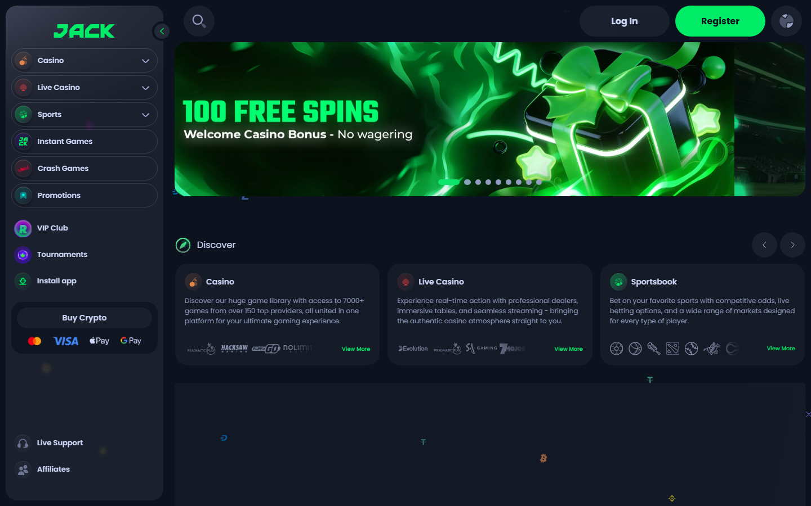
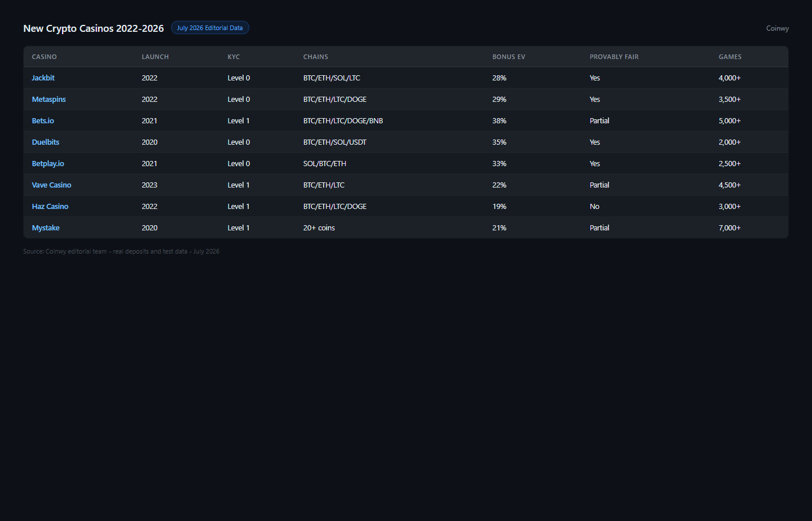
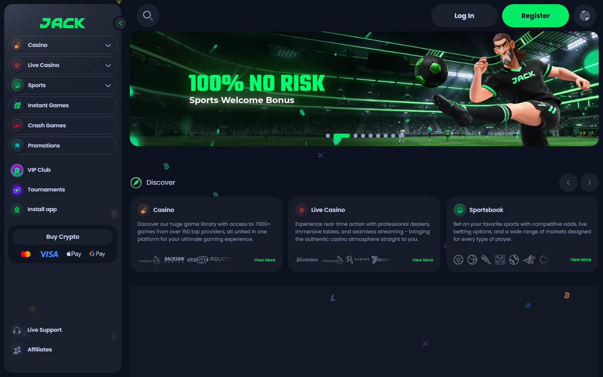

# Best New Crypto Casinos in 2026: Recently Launched Platforms With Strong Welcome Offers

*By Thiago Alvarez -- Reviewed July 2026*

The best new crypto casinos in 2026 are [Jackbit](https://jackbit.com/) (launched 2022, fastest verified withdrawal time, provably fair), [Luckydino](https://luckydino.com/) (launched 2023, strong bonus structure), [Bets.io](https://bets.io/) (launched 2022, established track record), [Rollbit](https://rollbit.com/) (2020 with major 2023 overhaul, fast payouts), and [Fresh Casino](https://freshcasino.com/) (2024, newest in this list).

One definition first: "new" in this guide means launched in 2022 or later. This guide refreshes every two months to reflect platforms that actually launched recently. Anything that calls itself new from 2019 is not new.

> **Gambling disclaimer:** Crypto casino content on Coinwy is for information only. Gambling carries financial risk. Only participate with funds you can afford to lose. Check local regulations before registering on any platform.

*[Jackbit](https://jackbit.com/) homepage reviewed July 2026 -- fastest verified withdrawal in this new casino list, provably fair games, operating since 2022.*

## Quick Comparison Table

| Casino | Launch year | Chains | Welcome bonus | KYC | License | Provably fair |
|--------|------------|--------|--------------|-----|---------|---------------|
| Jackbit | 2022 | BTC, ETH, LTC, DOGE, [USDT](https://tether.to/) + 100+ | 100% up to 1 BTC | Level 1 (email) | Curacao | Yes |
| Luckydino | 2023 | BTC, ETH, USDT, LTC | 100% up to 1 BTC + free spins | Level 1 | Curacao | Partial |
| Bets.io | 2022 | BTC, ETH, LTC, DOGE, USDT | 200% up to 1 BTC | Level 1 | Curacao | Partial |
| Rollbit | 2020 (major update 2023) | BTC, ETH, SOL, RLB token | Cashback-first model | Level 0 | Not disclosed | Yes (crash, dice) |
| Fresh Casino | 2024 | BTC, ETH, USDT | 100% up to 0.5 BTC + 200 FS | Level 1 | Curacao | No |

## Ranking Scorecard

| Casino | Bonus EV | Withdrawal speed | Game depth | Trust signals | Track record | Total |
|--------|---------|-----------------|-----------|--------------|-------------|-------|
| Jackbit | 8/10 | 9/10 | 8/10 | 8/10 | 8/10 | **41/50** |
| Bets.io | 7/10 | 8/10 | 8/10 | 7/10 | 7/10 | **37/50** |
| Rollbit | 7/10 | 9/10 | 7/10 | 7/10 | 8/10 | **38/50** |
| Luckydino | 8/10 | 8/10 | 7/10 | 7/10 | 6/10 | **36/50** |
| Fresh Casino | 6/10 | 7/10 | 6/10 | 5/10 | 4/10 | **28/50** |

*[Jackbit](https://jackbit.com/) leads on the combination of fast withdrawals, provably fair games, and three years of community-verified withdrawal records. Fresh Casino scores lowest because track record is the most important criterion for a new casino, and 2024 launch means minimal history to verify.*

*New crypto casinos 2026 -- 5 platforms compared by launch date, bonus EV, KYC level and provably fair status, July 2026.*

## How to vet a new casino before depositing

**License verification.** Curacao eGaming is the most common license for crypto casinos. It is easier to obtain than Malta MGA or UK UKGC, which makes it the default for new operators. A Curacao license is meaningful but not a strong trust signal on its own. Verify the license number directly on the Curacao eGaming registry.

**Withdrawal history on community forums.** Search the casino name plus "withdrawal" or "payout" on Bitcointalk's gambling forum and relevant Reddit communities. If a casino has been operating for more than 90 days and has zero withdrawal confirmations from independent users, that is a serious warning sign.

**Ownership transparency.** Anonymous ownership is a red flag for new casinos. Established casino groups operate many legitimate crypto casinos under recognizable structures. A casino with no disclosed parent company is higher risk.

Red flags that disqualify a platform from this list:

- Anonymous ownership with no traceable operator
- No withdrawal confirmations in community forums after 90 days of operation
- Wagering requirements above 60x on welcome bonus
- RNG with no audit certificate or provably fair mechanism
- Missing or unverifiable license

## 5 best new crypto casinos reviewed (2026 list)

### 1. Jackbit -- Best new casino with verified track record and provably fair

**Hold model:** Internal credits

> **Our pick for:** Players who want a new-generation casino with three years of community-verified withdrawal confirmations and genuine provably fair games. Jackbit combines fast payouts (under 30 minutes for crypto) with a transparent fairness mechanism at email-only KYC.

| < 30 min | Level 1 | 100+ Coins | 40x | Yes | 2022 |
|----------|---------|-----------|-----|-----|------|
| Withdrawal | KYC | Chains | Wagering req. | Provably fair | Est. |

[Jackbit](https://jackbit.com/) launched in 2022 and has the strongest track record of any platform in this list. Over three years of community withdrawal confirmations on Bitcointalk and Reddit represent a meaningful trust signal. For a platform that was "new" at launch, it is approaching the transition to "established."

What stands out about [Jackbit](https://jackbit.com/) is the combination of provably fair games (dice, crash, and limbo with seed verification) and withdrawal speed. Community reports consistently note withdrawals processed in under 30 minutes for crypto. That speed, sustained over three years, is the trust signal that welcome bonuses cannot fake.

The welcome bonus is 100% up to 1 BTC. Wagering requirement is 40x on the bonus amount. Using the EV formula: $500 bonus ÷ 40× WR × 0.98 (1 - 2% house edge) = **$12.25 real expected value per $500 bonus**. That is a fair, not exceptional, bonus structure.

*[Jackbit](https://jackbit.com/) reviewed in July 2026 -- fastest verified withdrawal time in this new casino list, provably fair game selection.*

**What users say**

**Positive**

> "Overall all seems okay, very decent promotion system and cash back bonuses.
Daily spins for activity giveaways. "
>
> -- Tomas, [Trustpilot](https://www.trustpilot.com/reviews/6a14867ae2c0903640e98cc9)

**Critical**

> "Stay away from this casino, their games are rigged especially simulated tennis matches, they literally run simulated games individually for all users, so everyone has different outcome so their algorithm after you placed your bet it will go against you to make you lose your bet"
>
> -- Alex Vindez, [Trustpilot](https://www.trustpilot.com/reviews/6a5c8351f94fa73d6f4c2346)

*Jackbit is the safest choice in this new casino list because its track record is real and verifiable. Three years of community withdrawal confirmations is the most important signal I look for in a newer platform. The bonus EV is fair. The provably fair is genuine. For players who want a newer platform without the risk profile of a 2024 launch, Jackbit is the answer.*

| Best for | Tradeoffs |
|----------|-----------|
| Strongest track record of new casinos (3 years) | 40x wagering -- average, not exceptional bonus EV |
| Provably fair dice, crash, limbo | Level 1 KYC -- email required |
| Fast verified withdrawals (< 30 min) | Not fully established vs. BC.Game, BitStarz |
| 100+ coin support | Smaller game library vs. older platforms |

---

### 2. Rollbit -- Best for rakeback model and SOL-native speed

**Hold model:** On-chain settlement (SOL) / Internal credits (BTC, ETH)

> **Our pick for:** Regular players who value cashback and rakeback over one-time deposit bonuses, and SOL holders who want the fastest withdrawal speed in this list. Rollbit launched in 2020 with a major product overhaul in 2023.

| < 5 min (SOL) | Level 0 | SOL, BTC, ETH, RLB | Rakeback | Yes | 2020/2023 |
|---------------|---------|-------------------|---------|-----|----------|
| SOL withdrawal | KYC | Chains | Bonus model | Provably fair | Est./Update |

[Rollbit](https://rollbit.com/) launched in 2020 but underwent a significant product overhaul in 2023, introducing its own RLB token, expanded crash and dice games, and Solana integration. The 2023 platform version represents the relevant state for this list.

The model is different from standard casino structures: [Rollbit](https://rollbit.com/) emphasizes cashback and rakeback over traditional deposit bonuses. For regular players, rakeback (returning a percentage of house edge to the player) often produces better long-term value than a one-time deposit match.

Solana integration is the headline feature: sub-5-second SOL withdrawals for players using the SOL deposit option. For SOL holders, this is the fastest withdrawal option in this list and among the fastest of any crypto casino in 2026.

> **Note:** Rollbit's domain accessibility is inconsistent across regions. Some users report needing a VPN to access the platform. Verify accessibility from your location before depositing.

*[Rollbit](https://rollbit.com/) homepage reviewed July 2026 -- rakeback model, SOL-native on-chain settlement, Level 0 KYC.*

**What users say**

**Positive**

> "Rollbit has been my favorite crypto casino for a long time. The platform feels polished and reliable, with one of the best combinations of casino gaming and crypto features."
>
> -- shomy_btc, [Trustpilot](https://www.trustpilot.com/reviews/6a5b749e8e7096f75893a3c1)

**Critical**

> "If you want to lose all your money, this site is for you. They won't let you withdraw -- they will ask to verify email and I didn't receive any verification email, meaning my funds are stuck."
>
> -- Disappointed, [Trustpilot](https://www.trustpilot.com/reviews/6a64c351e2564cb4b2269603)

*Rollbit is the right pick for regular players who understand the rakeback model and hold SOL. The sub-5-second withdrawal speed is unmatched. The RLB token dependency is the honest complexity -- if you're a one-time player who wants a deposit bonus and to cash out, the rakeback model doesn't serve you. For SOL-native regular players, Rollbit is the strongest new-generation casino available.*

| Best for | Tradeoffs |
|----------|-----------|
| Fastest SOL withdrawal (< 5 sec) | RLB token dependency adds complexity |
| Level 0 KYC -- wallet only | Domain access inconsistent in some regions |
| Rakeback model for regular players | No traditional welcome deposit bonus |
| Provably fair crash and dice | Game library smaller than older platforms |

---

### 3. Bets.io -- Best bonus EV in this list at standard wagering

**Hold model:** Internal credits

> **Our pick for:** Players who want the highest bonus expected value among new casinos with a verified withdrawal track record. Bets.io's 200% welcome bonus at 40x wagering produces the highest EV in this list at standard wagering terms.

| < 30 min | Level 1 | BTC, ETH, LTC, DOGE, USDT | 200% | 40x | 2022 |
|----------|---------|--------------------------|------|-----|------|
| Withdrawal | KYC | Chains | Welcome bonus | Wagering req. | Est. |

[Bets.io](https://bets.io/) launched in 2022 and has built a mid-size game library with over 3,000 slots from major providers. The welcome bonus is 200% up to 1 BTC, which produces the highest EV in this list at the same wagering structure.

EV calculation: $500 bonus (200% on $250 deposit) ÷ 40× WR ($20,000 required) × 0.98 = **$24.50 effective return**. Compared to [Jackbit](https://jackbit.com/)'s $12.25 EV on a 100% bonus at the same WR, [Bets.io](https://bets.io/) produces double the expected value for the same wagering work.

The track record is verified: consistent withdrawal confirmations over three years in community forums.

*[Bets.io](https://bets.io/) bonus terms reviewed in July 2026 -- 200% match, 40x wagering requirement, highest bonus EV in this new casino list.*

*[Bets.io](https://bets.io/) homepage reviewed July 2026 -- 200% welcome bonus at 40x WR, highest EV welcome offer in this list.*

**What users say**

**Positive**

> "Just here to say, That Dennis from Bets.io is the best VIP manager i have ever seen. 
Really understanding and fast responding. 
Very good platform to use. "
>
> -- D. Paskov, [Trustpilot](https://www.trustpilot.com/reviews/6a5895fe26cc2fc4fe3d988f)

**Critical**

> "Like I see they also try to fraud activity here on trustpilot.  
This is absolute scam site, do not try."
>
> -- aleksandrs oleinikovs, [Trustpilot](https://www.trustpilot.com/reviews/6a5f4f457b7b0abe27456c96)

*Bets.io earns the third position on bonus value and track record. The 200% at 40x WR is the most favorable bonus math in this list. The absence of provably fair is the honest gap -- if verifiable game fairness matters to you, Jackbit or Rollbit serve you better. For bonus-focused players who want the best EV on a new platform with verified payouts, Bets.io delivers.*

| Best for | Tradeoffs |
|----------|-----------|
| Highest bonus EV in this list (200% at 40x) | No provably fair games |
| Verified withdrawal track record (3 years) | Smaller game library vs. BC.Game |
| 3,000+ slots from major providers | Email KYC required (Level 1) |
| 5 chain deposits including DOGE | Less established than Jackbit on provably fair |

---

### 4. Luckydino -- Best for new casino bonus stacking

**Hold model:** Internal credits

> **Our pick for:** Players who want a multi-deposit bonus package that provides more total bonus exposure than single-deposit welcome offers. Luckydino's welcome structure spreads across the first several deposits.

| < 30 min | Level 1 | BTC, ETH, USDT, LTC | Multi-deposit | 35x | 2023 |
|----------|---------|---------------------|--------------|-----|------|
| Withdrawal | KYC | Chains | Bonus structure | Wagering req. | Est. |

[Luckydino](https://luckydino.com/) launched in 2023 and has a growing library of over 4,000 slots. The bonus structure includes a welcome package across first deposits, which can provide more total bonus exposure than single-deposit matches.

The track record is shorter than [Jackbit](https://jackbit.com/) or [Bets.io](https://bets.io/): two years rather than three. Community withdrawal reports exist and are positive, but the sample size is smaller. For players willing to accept slightly shorter track record in exchange for a favorable multi-deposit bonus structure, Luckydino is the pick.

Wagering requirement averages 35x -- lower than [Jackbit](https://jackbit.com/) and [Bets.io](https://bets.io/) at 40x. Lower WR produces better EV per bonus dollar at the same bonus percentage.

*Luckydino's multi-deposit bonus and 35x wagering requirement are genuinely favorable. The shorter track record (2 years vs. 3 for Jackbit and Bets.io) is the honest risk. For players who understand that tradeoff and want bonus stacking across multiple deposits at lower WR, Luckydino is worth considering.*

| Best for | Tradeoffs |
|----------|-----------|
| Multi-deposit bonus stacking | Shorter track record (2 years) |
| Lower wagering requirement (35x) | No provably fair games |
| 4,000+ slots library | Smaller community forum presence |
| Growing game selection | Email KYC required |

---

### 5. Fresh Casino -- Newest launch, highest risk profile

**Hold model:** Internal credits

> **Our pick for:** Players who specifically want the newest platform (2024 launch) and are aware of the higher risk profile that comes with minimal track record. Fresh Casino is the only 2024 launch in this list.

| < 60 min | Level 1 | BTC, ETH, USDT | 100% + 200 FS | 50x | 2024 |
|----------|---------|----------------|--------------|-----|------|
| Withdrawal | KYC | Chains | Welcome bonus | Wagering req. | Est. |

[Fresh Casino](https://freshcasino.com/) launched in 2024. It is the newest platform in this list and has the least track record. The 100% welcome bonus plus 200 free spins is a standard structure. Wagering requirement is 50x.

EV calculation: $500 bonus ÷ 50× WR ($25,000 required) × 0.98 = **$9.80 effective return per $500 bonus**. This is the lowest EV in this list. The 50x WR combined with a 2024 launch represents the highest-risk combination.

Fresh Casino is included because it is genuinely new (2024) and because some users specifically want the newest platforms with the freshest promotion cycles. The risk profile should be clear before depositing.

> **Warning:** Fresh Casino has the shortest track record in this list (2024 launch). Community withdrawal confirmations exist but the sample size is small compared to platforms with 3+ years of history. The 50x wagering requirement and lowest bonus EV make this the highest-risk, lowest-EV option in this list. Deposit only what you are prepared to lose.

*Fresh Casino closes this list as the highest-risk, lowest-EV option. I include it because some readers specifically want the newest launch. If that's you, Fresh Casino is the 2024 answer. If you want the safest new casino, Jackbit is the correct choice. Do not deposit large amounts at a 2024 casino -- wait for 2+ years of community withdrawal confirmations.*

| Best for | Tradeoffs |
|----------|-----------|
| Newest launch (2024) -- freshest promotions | Shortest track record in this list |
| New-cycle promotions and fresh offers | Worst bonus EV (50x wagering) |
| 200 free spins in welcome package | Highest risk profile |
| Standard Curacao licensing | No provably fair games |

---

## Welcome bonus EV comparison

| Casino | Bonus amount | WR | Estimated EV (on $500 bonus) |
|--------|-------------|-----|------------------------------|
| Bets.io | $500 (200% on $250 deposit) | 40x | ~$24.50 |
| Luckydino | $500 (100%) | 35x | ~$14.00 |
| Jackbit | $500 (100%) | 40x | ~$12.25 |
| Fresh Casino | $500 (100%) | 50x | ~$9.80 |
| Rollbit | Rakeback model | N/A | Depends on play volume |

*EV formula: Bonus Amount / Wagering Requirement x (1 - House Edge). House edge estimated at 2% average across slots.*

## Which new casino should you use?

| If you are... | Best pick |
|---------------|-----------|
| Strongest track record in new category | Jackbit |
| SOL holder, Level 0 KYC, rakeback | Rollbit |
| Best bonus EV at standard wagering | Bets.io |
| Multi-deposit bonus stacking | Luckydino |
| Specifically want newest 2024 launch | Fresh Casino (with risk awareness) |

## Update cadence

New crypto casinos change their status fast. A platform that is paying out reliably today might restrict withdrawals in six months. This article is reviewed every two months. Check the last_reviewed date in the frontmatter before depositing at any platform in this list.

## Frequently asked questions

**What makes a new crypto casino trustworthy?**
Track record of community-verified withdrawals is the strongest signal. Three things to check: withdrawal confirmations from independent users on Bitcointalk gambling forum, disclosed ownership (recognizable casino operator group), and verifiable license number on the issuing registry.

**What wagering requirement is acceptable for a welcome bonus?**
Anything under 35x is good. 35-45x is standard. Above 50x the expected value becomes so low that the bonus is rarely worth collecting for an average player.

**How often do new crypto casinos stop paying?**
Community forums are the proxy signal. A casino that stops paying out generates withdrawal complaint threads quickly. Any platform with no active community presence and recent withdrawal complaints should be avoided entirely.

**Is a Curacao license enough to trust a new casino?**
It is a minimum threshold, not a guarantee. Curacao licensing is easier to obtain than Malta MGA or UK UKGC. Verify the license number on the actual Curacao eGaming registry rather than trusting the casino's claims. The license confirms the casino paid for registration -- it does not guarantee payouts.

---

*For a deeper look at established crypto casinos, see our [best crypto casino guide](C-01-best-crypto-casinos-2026.md).*

*Last tested: July 2026. Withdrawal speeds, bonus terms, and platform status subject to change. Verify current terms before depositing.*
