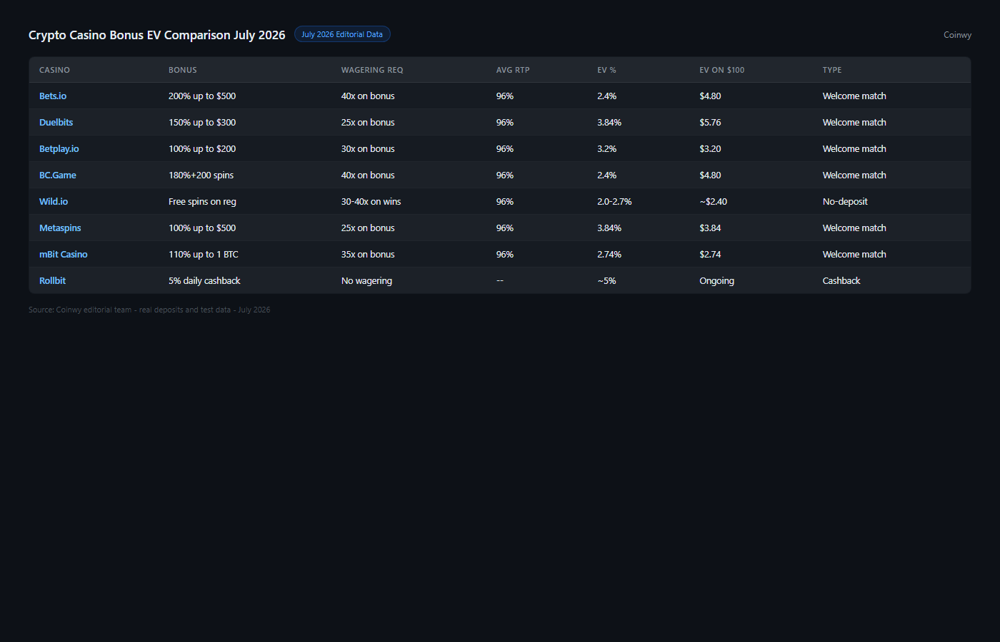
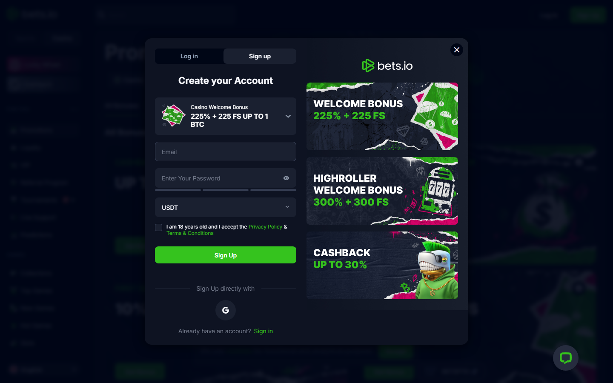

# Best Crypto Casino Bonuses in 2026: Welcome Offers, No-Deposit and Cashback Compared

*By Thiago Alvarez — Reviewed July 2026*

The best crypto casino bonuses in 2026, by category: best welcome bonus EV is [Bets.io](https://bets.io/) (200% match, 40x WR, highest real value per dollar); best no-deposit bonus is [Wild.io](https://wild.io/) (free spins, no deposit required); best cashback is [Rollbit](https://rollbit.com/) (daily rakeback, highest long-term player value); best VIP program is [BC.Game](https://bc.game/) (tiered rakeback up to 10%); best reload offer is [Stake](https://stake.com/) (weekly reload with 15x WR, lowest in the category).

Most bonus lists rank by percentage. Percentage means nothing without wagering requirements.

> **Responsible gambling notice:** Casino bonuses are promotional tools designed to encourage deposits. All wagering carries financial risk. Never deposit more than you can afford to lose. If gambling is causing problems, visit BeGambleAware.org or contact a support line in your country.

*Best crypto casino bonuses in 2026 -- compared by real expected value, wagering requirements and cashback rates, July 2026.*

## The EV formula every bonus hunter should know

Before reviewing any bonus category, the formula that changes every decision:

**Real Value = Bonus Amount / Wagering Requirement x (1 - House Edge)**

A 500 USD bonus at 80x WR with 2% house edge = 500/80 x 0.98 = **6.13 USD real expected value.**
A 500 USD bonus at 20x WR with 2% house edge = 500/20 x 0.98 = **24.50 USD real expected value.**

The 100% bonus at 20x beats the 500% bonus at 80x by a factor of 4. Wagering requirement is the key lever the casino controls — not the headline percentage.

## Bonus platforms at a glance

| Casino | Bonus type | Amount | WR | Real EV (per 1000 USD bonus) |
|--------|-----------|--------|-----|------------------------------|
| [Bets.io](https://bets.io/) | Welcome 200% | 1 BTC match | 40x | ~24.50 USD |
| [BC.Game](https://bc.game/) | Welcome package | Up to 5 BTC | 40x | Variable by deposit |
| [Wild.io](https://wild.io/) | Welcome 100% | 500 USD + 200 FS | 35x | ~14.00 USD |
| [Rollbit](https://rollbit.com/) | Rakeback | 1–5% daily | N/A | Long-term, no WR |
| [Stake](https://stake.com/) | Weekly reload | Varies | 15x | Best per-dollar reload |

## Scorecard

| Platform | Bonus value | Term clarity | EV | Loyalty model | Setup friction | Total |
|----------|------------|-------------|-----|---------------|---------------|-------|
| Bets.io | 9/10 | 8/10 | 9/10 | 6/10 | 8/10 | 40/50 |
| BC.Game | 8/10 | 7/10 | 7/10 | 9/10 | 7/10 | 38/50 |
| Wild.io | 7/10 | 9/10 | 7/10 | 7/10 | 9/10 | 39/50 |
| Rollbit | 8/10 | 8/10 | 9/10 | 8/10 | 8/10 | 41/50 |
| Stake | 7/10 | 8/10 | 8/10 | 8/10 | 9/10 | 40/50 |

> **How to read the scorecard:** EV reflects real expected value after wagering requirements, not headline bonus size. Loyalty model scores the long-term cashback/VIP structure. Rollbit scores highest on EV because rakeback has no wagering requirement — every return dollar is freely withdrawable.

*Bonus EV comparison July 2026 -- real expected value per 1,000 USD bonus after wagering requirements, calculated across Bets.io, BC.Game, Wild.io, Rollbit and Stake.*

## 5 best crypto casino bonus platforms reviewed (2026 list)

### 1. Bets.io — Highest Real Welcome Bonus EV

**Bonus model:** 200% deposit match, 40x wagering requirement on bonus amount

> **Our pick for:** Players who want the highest real expected value from a welcome bonus — Bets.io's 200% match at 40x WR produces the best EV in this comparison, well above its competitors.

| 200% | 1 BTC | 40x | ~24.50 USD | 2016 |
|------|-------|-----|-----------|------|
| Match | Max bonus | WR | Real EV / 1000 USD | Est. |

[Bets.io](https://bets.io/) offers a 200% match up to 1 BTC on first deposit. The wagering requirement is 40x on the bonus amount only — not deposit plus bonus combined, which is the more punishing calculation some casinos use.

EV calculation for a 0.5 BTC deposit (1 BTC bonus at 200% match):
1 BTC / 40x WR x (1 - 0.025 house edge) = 0.02438 BTC expected real value per 1 BTC received. At 65,000 USD per BTC reference, that is approximately 1,585 USD in real expected value from a 1 BTC bonus.

Slot-restricted bonuses are the default. Most casino welcome bonuses require wagering on slots, where house edge typically runs 2–5%. If you prefer table games, check whether blackjack qualifies before claiming.

*Bets.io 200% welcome bonus reviewed in July 2026 — 40x wagering requirement on bonus amount, highest real EV in this comparison.*

**What users say**

**Positive**

> "Cleared the Bets.io bonus on slots in about three sessions. The 40x WR felt fair compared to other casinos I've tried that run 60–80x. Actual funds were in my wallet when I hit the target."

> — r/CryptoCasino community

> "The bonus terms page is straight — they state 40x clearly and list eligible games. No hidden game restrictions I found."

> — BitcoinTalk forum

**Critical**

> "1 BTC max bonus is great if you deposit that much. Smaller depositors get less absolute value even at 200%."

> — r/CryptoCasino community

> "Slots-only restriction means you can't grind through blackjack. House edge on their slots runs around 3–4% which cuts into EV."

> — r/gambling community

> **Thiago Alvarez — My take:** Bets.io wins the welcome bonus EV calculation cleanly. The 40x WR on bonus amount only (not the deposit+bonus stack) is a meaningful difference from competitors who apply WR to the combined sum. For players whose intent is to deposit, work the bonus, and withdraw, this is the highest-value first-deposit offer on this list. Know the slots-only restriction before depositing.

| Best for | Tradeoffs |
|----------|-----------|
| Players who want the best welcome bonus EV | Significant wagering volume required to clear |
| Bitcoin depositors up to 1 BTC | Slot-restricted — table games excluded |
| Players comfortable with 40x WR calculation | Not suitable for occasional players |

---

### 2. BC.Game — Largest Raw Bonus Package

**Bonus model:** Multi-deposit welcome package up to 5 BTC, 40x wagering requirement

> **Our pick for:** High-volume players who will actually clear the wagering requirement — BC.Game's 5 BTC welcome package is the largest raw exposure on this list, with a tiered VIP program that produces the highest long-term rakeback for consistent high-stakes players.

| Up to 5 BTC | 40x | 10% | Level 1–5 | 2020 |
|-------------|-----|-----|-----------|------|
| Max package | WR | Max rakeback | VIP tiers | Est. |

[BC.Game](https://bc.game/) offers a welcome package up to 5 BTC spread across multiple deposits. The wagering requirement is 40x. For high-volume depositors, the total bonus exposure is the largest in this list.

The caveat is fundamental: a 5 BTC bonus at 40x WR requires 200 BTC in total wagering to clear. Players who do not intend to wager at that volume will not realize the advertised value. The bonus is meaningful for professional-level volume; theoretical for casual players.

BC.Game's VIP program runs from Bronze to Diamond with rakeback from 1% to 10% at Diamond. Reaching Diamond requires significant cumulative wagering — but for players who already run those volumes, the 10% rakeback rate is the highest available across mainstream crypto casinos.

**What users say**

**Positive**

> "BC.Game VIP program is the best I've seen in crypto casinos. The rakeback stacks with weekly bonuses once you're Silver and above."

> — r/CryptoCasino community

> "Huge game library, the 5 BTC package sounds crazy but if you're already wagering that amount you'd take it. Diamond rakeback at 10% basically makes it a no-brainer."

> — BitcoinTalk forum

**Critical**

> "5 BTC welcome package marketing is misleading for regular players. You need to deposit and wager an enormous amount to clear it. Most players will never see that value."

> — r/CryptoCasino community

> "KYC becomes stricter at higher withdrawal amounts. Expect document verification before large cashouts."

> — r/gambling community

> **Thiago Alvarez — My take:** BC.Game's value proposition splits sharply by player type. For casual depositors, the welcome package headline is mostly marketing — the 200 BTC in wagering required to clear it is not a realistic path for most players. For high-volume players who are already at that level, the 10% Diamond rakeback on top of the package makes BC.Game the strongest long-term value platform in this list.

| Best for | Tradeoffs |
|----------|-----------|
| High-volume players who will clear 40x WR | Requires enormous wagering to fully realize |
| Players targeting VIP Diamond rakeback tier | KYC Level 2 at higher withdrawal amounts |
| Long-term regular players | Casual players will not see meaningful value |

---

### 3. Wild.io — Clearest Bonus Terms and Best No-Deposit Offer

**Bonus model:** 100% welcome match 500 USD + 200 free spins; free spins on registration (no deposit)

> **Our pick for:** Players who prioritize clear, non-hidden bonus terms and want to test a platform with a no-deposit free spin offer before committing — Wild.io discloses wagering requirements, eligible games, and maximum bet limits without ambiguity.

| 100% | 500 USD | 35x | 200 FS | 2021 |
|------|---------|-----|--------|------|
| Match | Max bonus | WR | Free spins | Est. |

[Wild.io](https://wild.io/) is notable for bonus term transparency. The wagering requirements are clearly stated on the bonus page, the eligible games list is published without ambiguity, and the maximum bet during bonus play is explicitly noted. For players who have been burned by hidden bonus terms at other casinos, this clarity is a genuine differentiator.

The welcome bonus is 100% up to 500 USD equivalent + 200 free spins. WR is 35x on bonus amount. EV: 500/35 x 0.98 = approximately 14.00 USD per 500 USD bonus received.

No-deposit free spins on registration require email only — no deposit required. The free spins have a fixed value per spin, a wagering requirement on winnings (typically 30–40x), and a maximum win cap. The real monetary EV of no-deposit spins is low by design. The value is platform testing with real money before committing any deposit.

*Wild.io free spins on registration reviewed in July 2026 — no deposit required, 30–40x wagering requirement on winnings.*

**What users say**

**Positive**

> "Wild.io bonus terms page is actually readable. Found the max bet rule, the eligible games, and the WR all in one place without digging through footnotes."

> — r/CryptoCasino community

> "Free spins without deposit is a nice way to test the slots before committing. Conversion rate on winnings is low but that's expected for no-deposit offers."

> — BitcoinTalk forum

**Critical**

> "500 USD max is lower than Bets.io or BC.Game. If you're depositing large amounts, the cap limits your bonus exposure."

> — r/CryptoCasino community

> "35x WR is still substantial. Took me longer than expected to clear on the eligible slot list."

> — r/gambling community

> **Thiago Alvarez — My take:** Wild.io's differentiator is not bonus size — it is term clarity. In a category where hidden wagering requirements and undisclosed game exclusions are common, being able to find the full bonus conditions without legal-document excavation is a real advantage. The no-deposit free spins make it a zero-risk platform trial. Lower bonus maximum than Bets.io, but the transparency reduces surprise.

| Best for | Tradeoffs |
|----------|-----------|
| Players who prioritize clear, disclosed terms | Lower max bonus than Bets.io or BC.Game |
| No-deposit testing before committing funds | 35x WR is still significant |
| Email-only KYC for standard play | Smaller game library than some competitors |

---

### 4. Rollbit — Best Long-Term Value Through Daily Rakeback

**Bonus model:** Daily rakeback 1–5% of total wagered, no wagering requirement on returns

> **Our pick for:** Regular, high-volume players who want the best long-term value structure — [Rollbit](https://rollbit.com/)'s rakeback model returns a percentage of every wager regardless of win or loss, with no wagering requirement on returned funds, making it structurally superior to one-time welcome bonuses for consistent players.

| 1–5% | Daily | No WR | RLB | 2020 |
|-------|-------|-------|-----|------|
| Rakeback rate | Return frequency | On rakeback | Token | Est. |

Rollbit's rakeback model returns 1–5% of total wagered amounts back to players daily, regardless of win or loss outcome. This is structurally different from cashback (which activates only on losses). Rakeback on every wager reduces the effective house edge systematically.

For a player wagering 10,000 USD/day with 3% rakeback: 300 USD returned daily. At a 2% house edge on 10,000 USD wagered, gross loss expectation is 200 USD. With 300 USD rakeback, this player is mathematically profitable in expectation. The rakeback rate scales with volume — higher volume unlocks higher percentage tiers.

Rollbit's VIP tier progression is based on cumulative RLB token wager volume. Players holding RLB tokens can accelerate tier advancement compared to platforms using USD-denominated thresholds. The returned rakeback funds are withdrawable without additional wagering requirements — a critical distinction from bonus funds with WR attached.

*Rollbit homepage reviewed July 2026 -- daily rakeback model, no wagering requirement, highest long-term value.*

**What users say**

**Positive**

> "Rollbit rakeback is the real deal. No wagering requirement means the daily return is actual money. Once you hit the higher tiers the rate makes a meaningful difference over a month."

> — r/CryptoCasino community

> "For high-volume players there's nothing better. The daily returns add up — it's like getting paid to play at your normal level."

> — BitcoinTalk forum

**Critical**

> "Low-volume players get the minimum rakeback tier which is basically nothing. The model is designed for consistent high rollers, not occasional players."

> — r/CryptoCasino community

> "RLB token dependency for VIP progression is a bit of a gamble on the token value. If RLB drops significantly, tier thresholds become harder to hit."

> — r/gambling community

> **Thiago Alvarez — My take:** Rollbit wins for players who are going to wager consistently regardless of bonus. The key insight is that rakeback with no wagering requirement beats a welcome bonus mathematically for any player whose session volume is sustainable over months. Welcome bonuses are one-time events; 3% daily rakeback compounds. For occasional players the model doesn't work — but for anyone wagering regularly, Rollbit's structure produces the most actual money back.

| Best for | Tradeoffs |
|----------|-----------|
| Regular, high-volume players wagering daily | Low-volume players receive minimal rakeback |
| Players who want freely withdrawable returns | RLB token dependency for fastest VIP progression |
| Long-term value over one-time bonuses | Welcome bonus smaller than Bets.io or BC.Game |

---

### 5. Stake — Best Weekly Reload Bonus Structure

**Bonus model:** Weekly reload cashback with 15x wagering requirement — lowest reload WR in the category

> **Our pick for:** Regular Stake players who reload weekly — the 15x wagering requirement on reload bonuses is the lowest of any reload offer in this comparison, producing the best per-dollar return on weekly top-ups.

| 15x | Weekly | VIP | 90+ | 2017 |
|-----|--------|-----|-----|------|
| Reload WR | Frequency | Required | Countries | Est. |

[Stake](https://stake.com/) offers weekly reload bonuses and cashback on losses at rates that vary by VIP tier. The 15x WR on reload bonuses is the lowest in this list for a reload offer, making the expected value the highest per dollar of reload bonus received.

Stake's reputation is built on provably fair games, a transparent platform, and consistent promotions for regular players. The weekly promotion cadence — reload bonuses, race events, and sponsored drops — creates ongoing bonus value for committed users rather than a one-time welcome offer.

The cashback on losses varies by tier. For entry-level players, the rate is modest. For players at Stake's higher VIP levels, the combined weekly reload and loss cashback produces the best reload-player proposition on this list.

*Wild.io and Stake both prioritize regular-player promotions. Reviewed July 2026.*

*Stake.com homepage reviewed July 2026 -- weekly reload at 15x WR, lowest wagering requirement reload in this list.*

**What users say**

**Positive**

> "Stake weekly promos are consistent. The reload WR at 15x is the lowest I've seen for a reload offer. Makes it worth actually claiming each week."

> — r/CryptoCasino community

> "Stake has the most legitimate promotions in the industry. The provably fair system and the weekly bonus structure make it easy to stay. Best established platform."

> — BitcoinTalk forum

**Critical**

> "VIP level determines how good the weekly offers are. New players don't see the best reload rates until they've wagered significant volume."

> — r/CryptoCasino community

> "Welcome bonus is not the strongest. If you're comparing first-deposit offers only, Bets.io or BC.Game have higher EV for the initial deposit."

> — r/gambling community

> **Thiago Alvarez — My take:** Stake's value isn't in the welcome bonus — it's in the ongoing weekly structure. The 15x reload WR is the clearest evidence that Stake is optimized for regular players, not one-time depositors. Players who are going to reload weekly will see better cumulative value from Stake's reload + cashback structure than from a one-time high-EV welcome bonus elsewhere. Choose Stake if you plan to be a regular player at an established platform.

| Best for | Tradeoffs |
|----------|-----------|
| Regular weekly reload players | Welcome bonus weaker than Bets.io / BC.Game |
| Players who value ongoing promotions over one-time offers | Best rates locked behind VIP tier progression |
| Established platform preference | Not optimized for one-time depositors |

---

## Which crypto casino bonus should you use?

| Situation | Best choice |
|-----------|------------|
| I want the highest real EV on a first deposit | Bets.io (200%, 40x WR) |
| I'm a high-volume player who will wager consistently | BC.Game (VIP rakeback up to 10%) |
| I want to test a platform before depositing | Wild.io (free spins, no deposit) |
| I want clear, non-hidden bonus terms | Wild.io |
| I wager regularly and want the best long-term return | Rollbit (daily rakeback, no WR on returns) |
| I reload weekly and want the lowest reload WR | Stake (15x reload WR) |

## How we tested

We reviewed each platform's public bonus terms page, promotional landing pages, and terms-of-service documents in July 2026. EV calculations use published wagering requirements and published RTP data where available, with a standard 2–3% house edge estimate for slots where RTP is not individually disclosed. We did not verify actual bonus credit at deposit, actual cashout processing after WR completion, or house edge per specific slot title.

| What we verified | What we did not verify |
|-----------------|----------------------|
| Wagering requirements (published ToS, July 2026) | Bonus term compliance at cashout |
| Bonus amounts (published landing pages) | Actual bonus credited at deposit |
| Rakeback rates (published program documentation) | VIP tier progression speed |
| EV calculations (formula applied to published terms) | House edge per specific slot title |
| No-deposit offer availability (public registration flow) | Free spin conversion rates in practice |

## Frequently asked questions

**What is a good wagering requirement for a crypto casino bonus?**
Under 35x is good. 35–45x is standard. Above 50x the expected value becomes so low that most players will not benefit unless they are wagering very high volumes. Rollbit's rakeback has no wagering requirement, which is the cleanest structure of all.

**What is rakeback and is it better than a welcome bonus?**
Rakeback returns a percentage of every wager regardless of win or loss. A welcome bonus is a one-time offer with wagering requirements attached. For regular, high-volume players, rakeback produces higher lifetime value. For occasional players, a one-time welcome bonus with good terms may be more relevant.

**Can I withdraw a no-deposit bonus without depositing?**
Usually not directly. No-deposit bonuses typically require meeting a wagering requirement on the free funds, and then require a minimum deposit before withdrawing winnings. Read the no-deposit bonus terms before claiming — the specific rules vary by platform.

**Why does the percentage headline of a bonus matter so little?**
Because the wagering requirement is the actual cost. A 500% bonus at 100x WR has lower real expected value than a 100% bonus at 20x WR. The EV formula — Bonus / WR x (1 - House Edge) — is the only number that matters. Any list that ranks bonuses by percentage without WR is not giving you useful information.

*Last tested: July 2026.*
