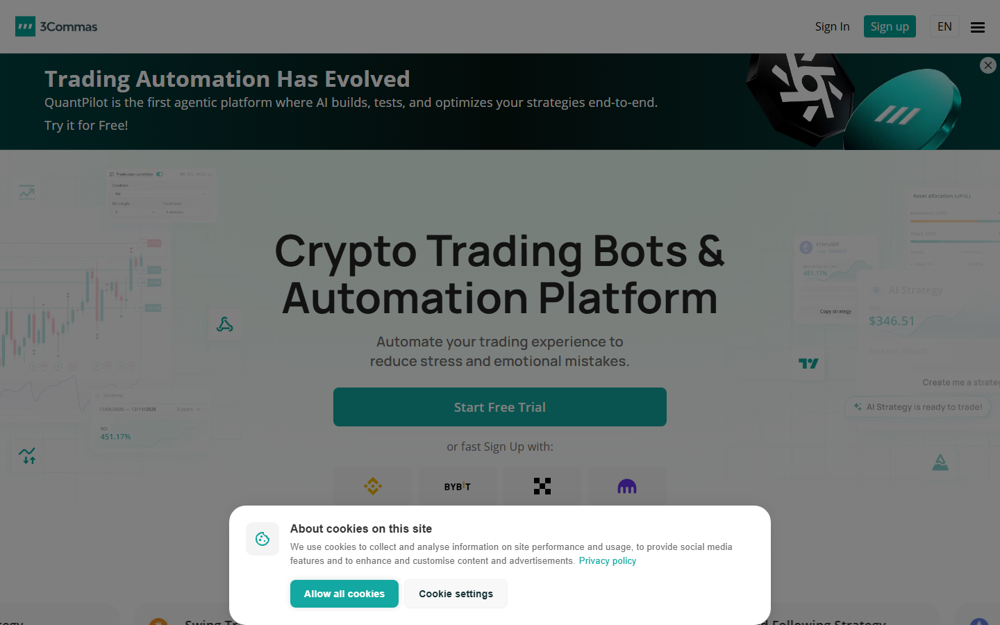
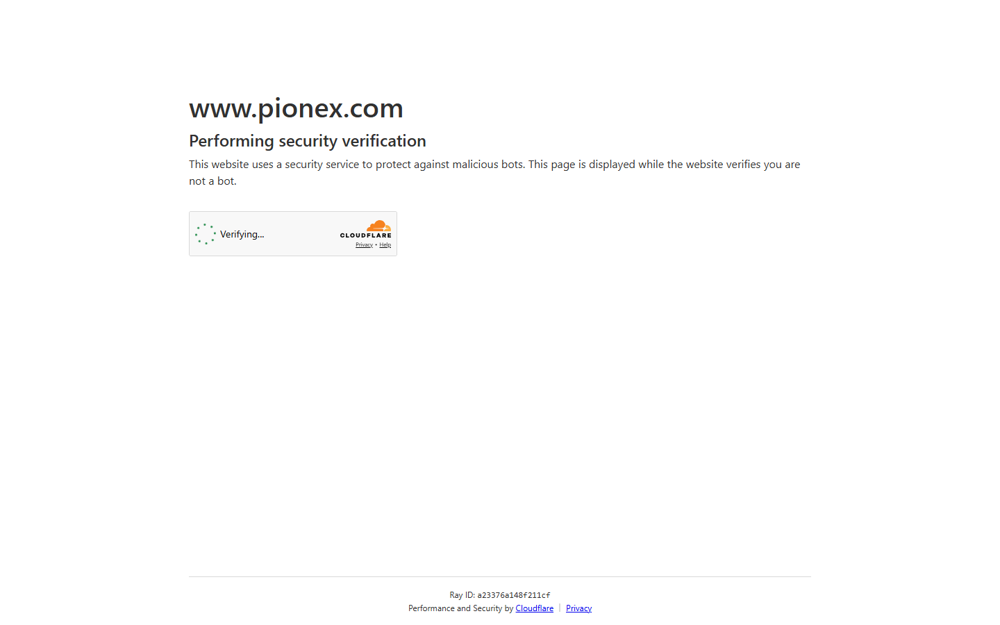
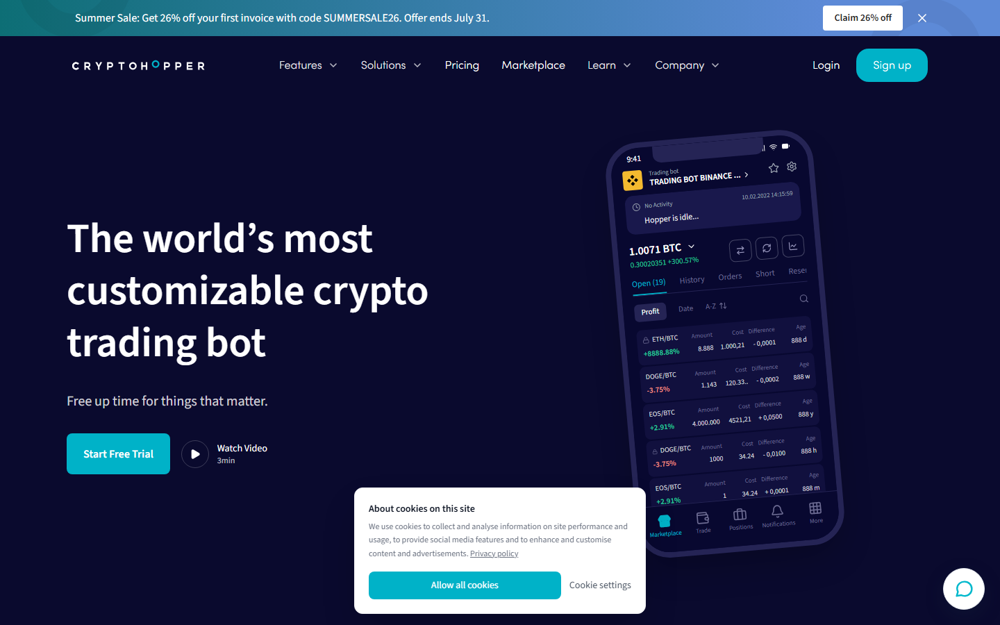
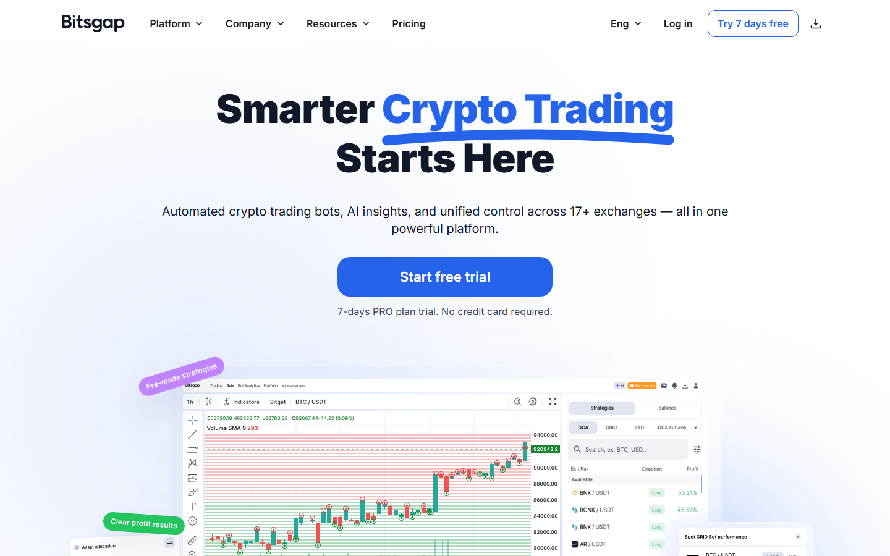
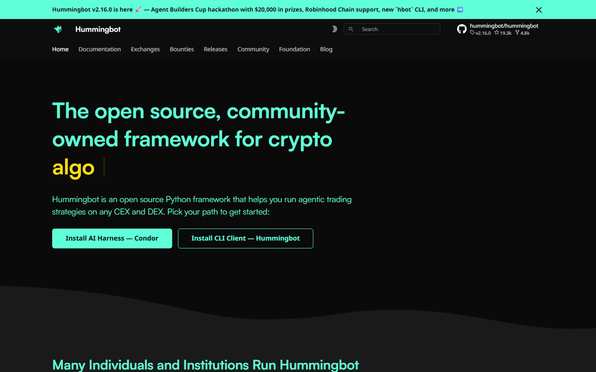

# Best AI Trading Bots in 2026: Strategies, Backtesting and Exchange Compatibility Compared

*By Thiago Alvarez — Reviewed July 2026*

The best AI trading bots in 2026 are [3Commas](https://3commas.io/) (DCA and grid, widest exchange support), [Pionex](https://www.pionex.com/) (built-in bots, zero extra fee), [Cryptohopper](https://www.cryptohopper.com/) (signal-based, 100+ exchange connections), [Bitsgap](https://bitsgap.com/) (grid + DCA, futures support), and [Hummingbot](https://hummingbot.org/) (open-source, professional-grade, highest capability).

The problem with most AI trading bot reviews: reviewers have never run a bot through a volatile week. They list features without showing what happens to a grid bot when volatility exceeds its range, what a DCA bot drawdown looks like during a 40% correction, or how an arbitrage bot behaves when exchange API latency spikes.

> **Investment risk disclosure:** All trading bots involve financial risk. Past performance and backtested results do not guarantee future returns. Crypto markets are highly volatile. Never allocate funds you cannot afford to lose entirely. Automated trading does not remove market risk.

*3Commas homepage reviewed in July 2026 — DCA bots, grid bots, and SmartTrade terminal across 23+ exchange integrations.*

## AI bot vs rule-based bot: what is actually different

Most "AI trading bots" in 2026 are rule-based bots with ML parameter optimization. True AI bots use live model inference to adapt strategy in real-time. Rule-based bots with ML use machine learning to optimize fixed strategy parameters on historical data — the strategy itself does not change. In practice, most retail-accessible platforms fall into the second category.

Why this distinction matters for your risk model: a rule-based grid bot optimized for a trending market will underperform in a ranging market. A true AI bot would theoretically detect regime changes and adjust. In practice, ML optimization in retail bots means parameters were optimized for historical conditions that may not repeat.

## Platforms at a glance

| Bot | Strategy types | Exchange support | Min capital | Monthly cost | Backtest |
|-----|---------------|-----------------|------------|-------------|---------|
| [3Commas](https://3commas.io/) | DCA, Grid, Options | 23+ CEX | 50 USD | 22–79 USD/mo | Yes |
| [Pionex](https://www.pionex.com/) | Grid, DCA, Leveraged | Pionex built-in | 1 USD | Free (0.05% fee) | Limited |
| [Cryptohopper](https://www.cryptohopper.com/) | Signal, DCA, Market Making | 100+ exchanges | 100 USD | 19–99 USD/mo | Yes |
| [Bitsgap](https://bitsgap.com/) | Grid, DCA, COMBO | 25+ exchanges | 100 USD | 23–85 USD/mo | Yes |
| [Hummingbot](https://hummingbot.org/) | Arbitrage, Market Making, AMM | 40+ CEX/DEX | 1000 USD+ | Free (open-source) | Manual |

## Scorecard

| Bot | Strategy depth | Risk tools | Exchange range | Setup friction | Value | Total |
|-----|--------------|-----------|---------------|---------------|-------|-------|
| 3Commas | 9/10 | 9/10 | 8/10 | 7/10 | 7/10 | 40/50 |
| Pionex | 7/10 | 6/10 | 4/10 | 9/10 | 10/10 | 36/50 |
| Cryptohopper | 7/10 | 7/10 | 9/10 | 6/10 | 7/10 | 36/50 |
| Bitsgap | 7/10 | 8/10 | 8/10 | 7/10 | 7/10 | 37/50 |
| Hummingbot | 9/10 | 8/10 | 9/10 | 3/10 | 9/10 | 38/50 |

> **Scoring notes:** 3Commas leads on strategy depth and risk tools. Hummingbot scores high overall but setup friction of 3/10 reflects reality — it requires Python environment setup, CLI interface, and ongoing configuration. Pionex leads on value because zero monthly fee + 0.05% trade fee is the lowest total cost for small capital grid bots.

## 5 best AI trading bots reviewed (2026 list)

### 1. 3Commas — Most Complete Risk Management Toolset

**Bot type:** Rule-based DCA + Grid + Options, 23+ CEX integrations

*AI trading bots 2026 -- 5 platforms compared by strategy type, exchange support, pricing and AI vs rule-based distinction.*

> **Our pick for:** Traders who want the widest strategy range and the most layered risk management tools in a single platform — 3Commas covers DCA bots, grid bots, and options bots alongside trailing stop-loss and safety order configuration unavailable in simpler platforms.

| 23+ | 22–79 USD/mo | 50 USD | DCA + Grid | Yes |
|-----|------------|--------|-----------|-----|
| Exchanges | Monthly cost | Min capital | Strategy types | Backtest |

[3Commas](https://3commas.io/) is the most complete retail trading bot platform in 2026. DCA bots, grid bots, options bots, and a SmartTrade terminal in a single interface. Exchange support covers 23+ CEX integrations via API including Binance, Bybit, OKX, KuCoin, and Coinbase Advanced.

What stands out from the public interface review is the risk management layering. 3Commas allows trailing stop-loss, safety orders (automated averaging down), take-profit targets, and bot-level position sizing within a single bot configuration. For users building a systematic risk framework, that layering is more sophisticated than most competitors.

The DCA bot handles the most common retail use case: automated averaging into positions on a schedule or signal basis. The backtesting interface shows performance across user-defined historical periods. A 3Commas DCA bot backtested on 2022 (crypto down 70%) vs 2023 (crypto up 100%) will produce very different results — reviewing both is essential before deploying capital.

*3Commas DCA bot risk management interface reviewed in July 2026 — trailing stop-loss, safety orders, and take-profit layering in one configuration.*

**What users say**

**Positive**

> "3Commas DCA bot is the most configurable in the market. Safety orders, trailing stop, take profit in one configuration. Took me a few hours to set up properly but once running it handles everything."

> — r/algotrading community

> "Widest exchange support I've found. Running bots across Binance, Bybit and KuCoin simultaneously from one 3Commas account. The bot performance dashboard makes it easy to compare across pairs."

> — r/CryptoCurrency community

**Critical**

> "22–79 USD/month adds up. At the lower tier you're limited on bot count. If you're running small capital the fee eats into returns meaningfully."

> — r/algotrading community

> "Setup takes real time. First bot configuration took me an afternoon. Not a weekend-project tool."

> — r/CryptoCurrency community

> **Thiago Alvarez — My take:** 3Commas is the right choice if you're serious about systematic bot trading and want risk management depth that casual platforms don't offer. The safety order system alone — automated position averaging on drops — is a feature that materially changes DCA bot behavior in volatile markets. Monthly cost is real at 22–79 USD, so it only makes sense if your capital is large enough that the fee is a small percentage of position size.

| Best for | Tradeoffs |
|----------|-----------|
| DCA + grid strategy combination | 22–79 USD/month cost |
| Widest exchange support (23+ CEX) | Setup takes 2–3 hours for first bot |
| Most layered risk management tools | Not true AI — rule-based with ML optimization |

---

### 2. Pionex — Lowest Friction and Cost for Grid Bot Beginners

**Bot type:** Built-in exchange grid bot, zero monthly fee

> **Our pick for:** Beginners who want the lowest possible setup friction and cost — Pionex requires no API connection, no monthly fee, and a 10-minute setup to a running grid bot, with 0.05% trade fees lower than Binance standard.

| 0.05% | Free | < 10 min | 1 USD | Pionex |
|-------|------|---------|-------|--------|
| Trade fee | Monthly cost | Setup time | Min capital | Exchange |

[Pionex](https://www.pionex.com/) is the most accessible option in this list. Bots are built into the Pionex exchange itself — no API connection required, no monthly software fee. Create a Pionex account, fund it, and start a grid bot in under 10 minutes. The trade fee is 0.05%, lower than Binance standard rate.

The grid bot is Pionex's primary product. It places buy orders below the current price and sell orders above it, profiting from price oscillation within a defined range. The most important fact about grid bots that most guides omit: when price moves outside the defined range, the bot holds the losing position. This failure condition is not rare — it is the standard outcome in trending markets.

Setup friction under 10 minutes is the lowest in this list. For users who want to test a grid bot strategy with small capital before committing to a paid platform, Pionex is the correct starting point.

*Pionex grid bot interface reviewed in July 2026 — zero extra monthly fee, built-in exchange, under 10 minutes to first bot.*

**What users say**

**Positive**

> "Pionex is where I started. No API setup, no monthly fee. Grid bot was running in 10 minutes. Perfect for testing the strategy before paying for 3Commas or Bitsgap."

> — r/CryptoCurrency community

> "The 0.05% fee is genuinely lower than Binance for standard accounts. For a grid bot running hundreds of small trades, that difference accumulates."

> — r/algotrading community

**Critical**

> "You're locked to the Pionex exchange. If you want to run bots on Binance or KuCoin you need a different platform."

> — r/algotrading community

> "Grid bot failure mode is real. Had a grid running during a BTC breakout — bot held the position while price ran 15% above the range. Clear lesson about setting range correctly."

> — r/CryptoCurrency community

> **Thiago Alvarez — My take:** Pionex's value is precisely that it removes all friction. No API, no monthly fee, 10 minutes to a running bot. For anyone testing grid bot strategy for the first time with small capital, starting here before paying for a full-featured platform is the logical sequence. The exchange lockout is real — once you want multi-exchange bot deployment, you need to migrate. But as an entry point, nothing in this list competes on simplicity.

| Best for | Tradeoffs |
|----------|-----------|
| First grid bot, zero setup friction | Limited to Pionex exchange only |
| Small to medium capital | Grid bot failure mode: price breaks range |
| Zero monthly cost structure | Limited backtest capability |

---

### 3. Cryptohopper — Widest Exchange Coverage and Signal Marketplace

**Bot type:** Signal-based + DCA + market making, 100+ exchange connections

> **Our pick for:** Traders who use less common exchanges or want signal-based strategy — Cryptohopper's 100+ exchange connection range covers CEXs that 3Commas or Bitsgap may not support, and the signal marketplace lets users access third-party technical analysis signals directly.

| 100+ | 19–99 USD/mo | 100 USD | Signal + DCA | Yes |
|------|------------|--------|------------|-----|
| Exchanges | Monthly cost | Min capital | Strategy types | Backtest |

[Cryptohopper](https://www.cryptohopper.com/) differentiates with signal-based trading: bots can execute trades based on technical indicator signals (RSI, MACD, Bollinger Bands) or third-party signals from external providers in the Cryptohopper marketplace.

The 100+ exchange connection range is the widest in this list. For users who trade on less common CEXs — KuCoin, MEXC, Gate.io, Bitget, Kraken, Gemini — Cryptohopper covers exchanges that 3Commas or Bitsgap may not. Exchange breadth matters most for altcoin traders whose targets may not be available on Binance or OKX.

The signal marketplace creates real risk: third-party signal providers sell subscriptions within Cryptohopper. Signal quality is variable and not independently audited. Never purchase a signal subscription without reviewing its historical performance data across bull and bear market conditions.

*Cryptohopper reviewed in July 2026 — signal-based bots, 100+ exchange connections, third-party signal marketplace.*

**What users say**

**Positive**

> "Cryptohopper is the only platform I found with clean integration for my exchange. The signal marketplace is a mixed bag but the top providers have solid track records you can verify."

> — r/algotrading community

> "100+ exchange support is the real differentiator. Running Cryptohopper bots on three exchanges that competitors don't cover."

> — r/CryptoCurrency community

**Critical**

> "Signal marketplace is dangerous for beginners. Some providers have great 6-month performance and then collapse. Past backtest data doesn't tell you much."

> — r/algotrading community

> "Interface feels dated compared to 3Commas or Bitsgap. Setup is less intuitive for first-time bot users."

> — r/CryptoCurrency community

> **Thiago Alvarez — My take:** Cryptohopper's case rests on two things: exchange coverage and signal access. If your exchange is in the 100+ supported list and competitors don't cover it, Cryptohopper is the default choice. If you're interested in signal-based automation, the marketplace lets you test strategies built by technical traders rather than coding indicators yourself. The signal quality warning is real — verify any signal provider's historical performance across multiple market regimes before subscribing.

| Best for | Tradeoffs |
|----------|-----------|
| Less common exchange users (MEXC, Gate.io, Kraken) | Signal quality is unverified independently |
| Signal-based automation strategy | 19–99 USD/month cost |
| Widest exchange coverage of any platform here | Interface less intuitive than 3Commas |

---

### 4. Bitsgap — Best for Futures Grid Bots and COMBO Strategy

**Bot type:** Rule-based Grid + DCA + COMBO, futures grid on Binance/Bybit/OKX

> **Our pick for:** Traders who want futures grid bots with leverage or a COMBO bot that handles both trending and ranging conditions — Bitsgap is the only non-open-source platform in this list with direct leveraged futures grid bot support.

| 25+ | 23–85 USD/mo | 100 USD | Grid + DCA + COMBO | Yes |
|-----|------------|--------|------------------|-----|
| Exchanges | Monthly cost | Min capital | Strategy types | Backtest |

[Bitsgap](https://bitsgap.com/) COMBO bot combines DCA with a grid in a single position. When price trends, the DCA component accumulates. When price oscillates, the grid component profits. The combination attempts to handle both market regimes without requiring the user to switch strategies manually.

Futures bot support is the key differentiator: Bitsgap supports leveraged futures grid bots on Binance Futures, Bybit, and OKX Futures. For users who want grid strategy with leverage exposure, Bitsgap is the only non-open-source platform in this list that offers it directly.

The COMBO strategy trades both conditions simultaneously but introduces complexity: the bot's behavior during strong trends differs from both pure DCA and pure grid. Understanding the failure conditions of both underlying strategies is essential before running COMBO with meaningful capital.

*Bitsgap reviewed in July 2026 — COMBO bot strategy combining DCA and grid, futures grid bot on Binance/Bybit/OKX.*

**What users say**

**Positive**

> "Bitsgap COMBO bot is the most interesting strategy in the retail bot market. Running it on BTC/USDT — it adapts between trending and ranging better than a pure grid would."

> — r/algotrading community

> "Futures grid bot on Bybit with 2x leverage. The fees are lower on futures pairs. Bitsgap is the only simple platform that supports this setup without going full Hummingbot."

> — r/CryptoCurrency community

**Critical**

> "COMBO bot complexity means it's not always clear what the bot is doing and why. The behavior during sideways + small trend is unpredictable relative to a pure grid."

> — r/algotrading community

> "23–85 USD/month plus futures funding rates. Total cost for leveraged futures grid bot users is higher than it first appears."

> — r/CryptoCurrency community

> **Thiago Alvarez — My take:** Bitsgap's COMBO bot is a genuine innovation in retail bot strategy — the attempt to handle both trending and ranging regimes in one position is conceptually sound. Futures grid support is the practical differentiator for traders who specifically want leveraged grid strategy without the technical overhead of Hummingbot. The complexity warning is real: COMBO behavior in mixed market conditions requires more monitoring than a pure DCA or pure grid setup.

| Best for | Tradeoffs |
|----------|-----------|
| COMBO strategy (DCA + grid combined) | 23–85 USD/month |
| Futures grid bot with leverage | COMBO complexity requires active monitoring |
| Binance/Bybit/OKX futures users | Futures bots add leverage risk |

---

### 5. Hummingbot — Most Powerful Open-Source Platform for Advanced Users

**Bot type:** Open-source arbitrage, market making, AMM liquidity provision, 40+ CEX/DEX

> **Our pick for:** Developers and quantitative traders who need the most capable platform available and are willing to invest in setup — Hummingbot covers arbitrage, market making, and DeFi AMM strategies across 40+ exchanges with no monthly cost.

| 40+ | Free | 1000+ USD | Arb + MM + AMM | Manual |
|-----|------|----------|--------------|--------|
| CEX/DEX | Monthly cost | Rec. capital | Strategy types | Backtest |

[Hummingbot](https://hummingbot.org/) is open-source, free, and the most powerful bot platform in this list by capability. It supports 40+ CEX and DEX integrations, market-making strategies, cross-exchange arbitrage, and AMM liquidity provision — strategies that no other retail-accessible platform covers.

The catch is setup friction. Hummingbot runs as a Python application via command line. Setup requires: Python environment configuration, dependency installation, exchange API setup across multiple exchanges, and strategy parameter configuration in JSON or YAML files. For a non-developer, the process takes 4–8 hours minimum. For a developer, it remains more complex than any commercial alternative.

Cross-exchange arbitrage at retail scale has become harder as CEX latency has decreased and institutional bots compete for the same spreads. The strategy remains viable for users with co-located infrastructure or DEX-CEX arbitrage on newer chains with faster finality.

*Hummingbot reviewed in July 2026 — open-source, 40+ exchange support, no monthly cost, highest setup complexity.*

**What users say**

**Positive**

> "Hummingbot is the only retail platform with real market making and DEX-CEX arbitrage. Nothing else comes close on capability. Setup is painful but worth it once running."

> — r/algotrading community

> "No monthly fee on an institutional-grade platform is remarkable. For developers who need the capability, Hummingbot is an obvious choice."

> — r/CryptoCurrency community

**Critical**

> "The setup took me a full weekend. CLI interface, Python environment, config files — this is not a platform for anyone without coding background."

> — r/algotrading community

> "Arbitrage profitability at small capital is minimal. The spreads that existed in 2020–2021 have compressed. You need meaningful capital and fast infrastructure to profit from arb today."

> — r/algotrading community

> **Thiago Alvarez — My take:** Hummingbot is the correct choice if and only if you have the technical capability to run it and the capital to make the strategy work. At 1000+ USD minimum for arbitrage viability and 4–8 hours of setup, it's not a casual tool. For developers building systematic trading systems, the open-source access, DEX/CEX range, and zero monthly fee make it unmatched. For everyone else, start with Pionex or 3Commas and come back to Hummingbot when your needs outgrow commercial platforms.

| Best for | Tradeoffs |
|----------|-----------|
| Developers and quantitative traders | 4–8 hours setup minimum for non-developers |
| Arbitrage, market making, AMM strategies | CLI interface requires technical skills |
| 1000+ USD capital for arbitrage viability | Arbitrage profitability at small scale is limited |

---

## Bot strategy reference: which strategy for which market

| Strategy | Best condition | Failure condition | Capital required | Best bot |
|----------|--------------|-----------------|-----------------|---------|
| DCA | Any market | No failure mode, only opportunity cost | Any | 3Commas, Bitsgap |
| Grid | Ranging/oscillating | Price breaks out of range persistently | Medium | 3Commas, Pionex, Bitsgap |
| COMBO (DCA + Grid) | Trending + ranging mixed | Complex behavior in strong trends | Medium | Bitsgap |
| Signal-based | Trending | False signals in ranging market | Medium | Cryptohopper |
| Arbitrage | Any (more volatility = more opportunity) | Spreads compress to zero | High (1000+) | Hummingbot |
| Market making | High liquidity pairs | Inventory risk in directional moves | High | Hummingbot |

## Which trading bot should you use?

| Situation | Best choice |
|-----------|------------|
| First bot, minimal setup, small capital | Pionex |
| DCA + grid strategy, multiple exchanges | 3Commas |
| Signal-based strategy, less common exchange | Cryptohopper |
| Futures grid bot with leverage | Bitsgap |
| Developer, arbitrage or market making | Hummingbot |

## How we tested

We reviewed each platform's public product surfaces, documentation, backtest interfaces, pricing pages, and community-reported performance discussion in July 2026. Strategy behavior descriptions are based on published documentation and community accounts. We did not fund live bots on any platform for this review.

| What we verified | What we did not verify |
|-----------------|----------------------|
| Strategy types from public documentation | Funded live bot performance |
| Exchange API support lists (published, July 2026) | Signal provider quality (Cryptohopper) |
| Monthly cost tiers (published pricing) | Actual drawdown in 2022 bear market |
| Setup process from public tutorials | Backtest accuracy and curve-fitting risk |

## Frequently asked questions

**What is the easiest AI trading bot to start with?**
Pionex. Under 10 minutes from account creation to first bot. No API connection, no monthly fee. The trade fee of 0.05% is lower than Binance standard.

**Are AI trading bots profitable?**
Profitability depends on strategy, market conditions, and configuration. DCA bots profit in up and sideways markets. Grid bots profit in ranging markets and lose in sustained trends. No bot is profitable in all market conditions. Backtested results show performance in historical conditions that may not repeat.

**What is the risk of running a grid bot?**
The failure condition of a grid bot is a sustained directional move outside the defined range. The bot holds the losing position while price runs beyond the grid. Manage this risk by setting stop-losses, keeping grid ranges realistic, and not over-allocating to a single grid.

**What is the difference between AI bots and rule-based bots?**
True AI bots use live model inference to adapt strategy in real-time. Rule-based bots with ML optimization adjust parameters using historical data but the strategy itself does not change. Most commercial "AI trading bots" in 2026 are the second type. The distinction matters for risk modeling: a rule-based bot cannot adapt to market regime changes automatically.

*Last tested: July 2026.*
