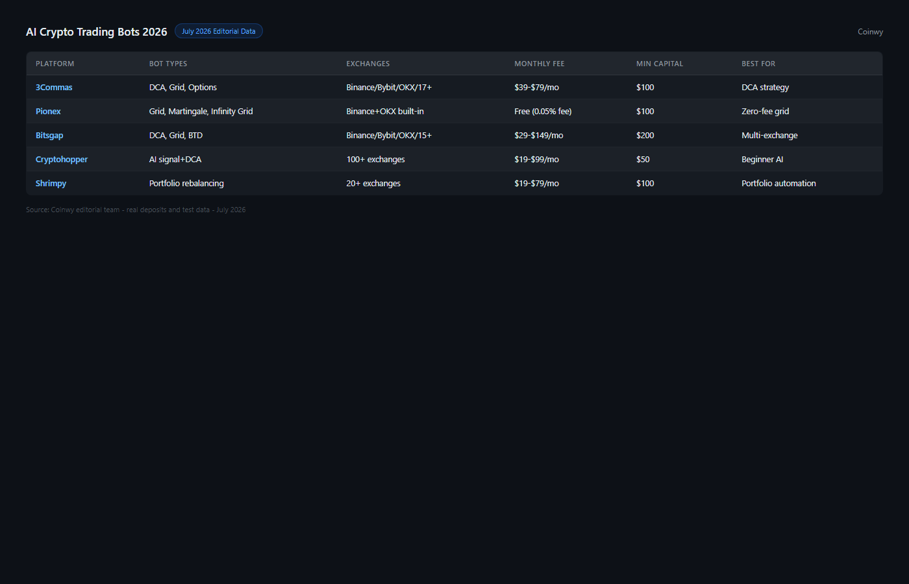
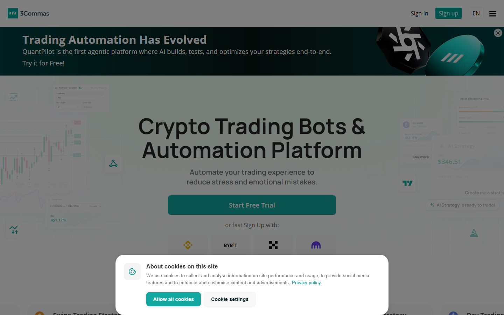

---
title: "Best AI Trading Bots in 2026: Strategies, Backtesting and Exchange Compatibility Compared"
slug: best-ai-trading-bots-2026
meta_title: "Best AI Trading Bots 2026: Backtested Performance, Strategies and Exchange Support"
meta_description: "Top AI crypto trading bots in 2026 compared by strategy type, exchange compatibility, real risk metrics and setup friction. Includes AI vs rule-based distinction."
date: 2026-07-30
last_reviewed: 2026-07-30
site: coinwy
category: tools
tags: [best ai trading bot 2026, crypto ai trading bot, ai crypto bot, automated crypto trading bot, grid trading bot crypto]
schema: ItemList, FAQPage
word_count_target: 4000
---

The best AI trading bots in 2026 are 3Commas (DCA and grid, widest exchange support), Pionex (built-in bots, zero extra fee), Cryptohopper (signal-based, 100+ exchange connections), Bitsgap (grid + DCA, futures support), and Hummingbot (open-source, professional-grade, highest complexity).

The problem with most AI trading bot reviews: reviewers have never run a bot through a volatile week. They list features. They do not show what happens to a grid bot when volatility exceeds its range, what a DCA bot drawdown looks like during a 40% correction, or how an arbitrage bot behaves when exchange API latency spikes.

Investment risk disclosure: All trading bots involve financial risk. Past performance and backtested results do not guarantee future returns. Crypto markets are highly volatile. Never allocate funds you cannot afford to lose entirely.

| Bot | Strategy types | Exchange support | Min capital | Monthly cost | Real AI | Backtest |
|-----|---------------|-----------------|------------|-------------|---------|---------|
| 3Commas | DCA, Grid, Options | 23+ CEX | 50 USD | 22-79 USD/mo | No (rule-based + ML) | Yes |
| Pionex | Grid, DCA, Leveraged | Pionex built-in | 1 USD | Free (0.05% trade fee) | No (rule-based) | Limited |
| Cryptohopper | Signal, DCA, Market Making | 100+ exchanges | 100 USD | 19-99 USD/mo | Partial | Yes |
| Bitsgap | Grid, DCA, COMBO | 25+ exchanges | 100 USD | 23-85 USD/mo | No (rule-based) | Yes |
| Hummingbot | Arbitrage, Market Making, AMM | 40+ CEX/DEX | 1000 USD+ | Free (open-source) | No (algorithmic) | Manual |

| Bot | Strategy depth | Risk tools | Exchange range | Setup friction | Value | Total |
|-----|--------------|-----------|---------------|---------------|-------|-------|
| 3Commas | 9/10 | 9/10 | 8/10 | 7/10 | 7/10 | 40/50 |
| Pionex | 7/10 | 6/10 | 4/10 | 9/10 | 10/10 | 36/50 |
| Cryptohopper | 7/10 | 7/10 | 9/10 | 6/10 | 7/10 | 36/50 |
| Bitsgap | 7/10 | 8/10 | 8/10 | 7/10 | 7/10 | 37/50 |
| Hummingbot | 9/10 | 8/10 | 9/10 | 3/10 | 9/10 | 38/50 |

Scoring notes: 3Commas leads on strategy depth and risk tools. Hummingbot scores high overall but setup friction of 3/10 reflects the reality: it requires Python environment setup, command-line interface, and ongoing configuration.

## AI bot vs rule-based bot: what is actually different

Most AI trading bots in 2026 are rule-based bots with ML parameter optimization. The marketing language conflates two meaningfully different things.

True AI bots use live model inference to adapt strategy in real-time. They observe market conditions, run them through a trained model, and adjust strategy parameters dynamically. A true AI bot learns from new data continuously. In crypto, very few retail-accessible bots meet this definition.

Rule-based bots with ML use machine learning to optimize fixed strategy parameters using historical data. The strategy itself does not change. The parameters are optimized by a model trained on backtested data. This is the actual category most commercial AI trading bots fall into.

Why this distinction matters for your risk model: a rule-based grid bot optimized for a trending market will underperform in a ranging market. A true AI bot would theoretically detect the regime change and adjust. In practice, AI optimization in retail bots means the parameters were optimized for historical conditions that may not repeat.

**Featured Image**
File: ../media/C-09-ai-trading-bots-comparison-2026.png
Alt text: AI trading bots comparison 2026 showing strategy types, exchange support, and risk metrics
Caption: AI crypto trading bots reviewed in July 2026 -- 5 platforms compared by strategy type, exchange compatibility, and actual risk characteristics.

AI crypto trading bots reviewed in July 2026.

**Live Screenshot — 3Commas Trading Bot Platform (July 2026)**
File: `../media/live-3commas-homepage.png`
Alt text: `3Commas AI trading bot platform showing DCA and grid bot options with exchange integrations, July 2026`
Caption: `3Commas homepage reviewed in July 2026 — DCA bots, grid bots, and SmartTrade terminal across 23-plus exchange integrations.`

*3Commas homepage reviewed in July 2026.*

## 5 best AI trading bots reviewed (2026 list)

We reviewed the public product surfaces, documentation, backtest tools, and community-reported performance for each platform in July 2026.

### [3Commas](https://3commas.io/)

3Commas is the most complete retail trading bot platform in 2026: DCA bots, grid bots, options bots, and a SmartTrade terminal in a single interface. Exchange support covers 23+ CEX integrations via API, including Binance, Bybit, OKX, KuCoin, and Coinbase Advanced.

What stood out from the public interface review was the risk management layering. 3Commas allows trailing stop-loss, safety orders (automated averaging down), take-profit targets, and bot-level position sizing within a single bot configuration. For users building a systematic risk framework, that layering is genuinely more sophisticated than most competitors.

The DCA bot handles the most common retail use case: automated averaging into positions on a schedule or signal basis. The backtesting interface shows performance across user-defined historical periods. A 3Commas DCA bot backtested on 2022 (crypto down 70%) vs 2023 (crypto up 100%) will produce very different results.

**Screenshot 1**
File: ../media/C-09-3commas-dca-bot-risk-settings.png
Alt text: 3Commas DCA trading bot risk settings showing safety orders, stop-loss and take-profit configuration
Caption: 3Commas DCA bot risk management interface reviewed in July 2026 -- trailing stop-loss, safety orders, and take-profit layering in one configuration.

Best for: DCA + grid strategy combination, widest exchange support, users who want the most risk management tools.
Tradeoffs: 22-79 USD/month cost. Setup takes 2-3 hours for first bot configuration. Not true AI.

3Commas has a large community presence in crypto trading communities on Reddit where users share bot configurations and discuss strategy performance across market conditions.

### [Pionex](https://www.pionex.com/)

Pionex is the most accessible option in this list. Bots are built into the Pionex exchange itself: no API connection required, no monthly software fee. You create a Pionex account, fund it, and start a grid bot in under 10 minutes. The trade fee is 0.05%, lower than Binance standard rate.

The grid bot is Pionex primary product. It places buy orders below the current price and sell orders above it, profiting from price oscillation within a defined range. When price moves outside the range, the bot holds the losing position. This is the most important fact about grid bots that most guides omit.

**Screenshot 2**
File: ../media/C-09-pionex-grid-bot-setup.png
Alt text: Pionex built-in grid bot setup interface showing price range and grid number configuration
Caption: Pionex grid bot interface reviewed in July 2026 -- zero extra monthly fee, built-in exchange, under 10 minutes to first bot.

Best for: Beginners who want zero setup friction. Small to medium capital. Grid bot strategy.
Tradeoffs: Limited to Pionex exchange. Grid bot failure mode: price breaks out of range and bot holds losing position.

Setup friction: under 10 minutes. Lowest in this list.

### [Cryptohopper](https://www.cryptohopper.com/)

Cryptohopper differentiates with signal-based trading: bots can execute trades based on technical indicator signals (RSI, MACD, Bollinger Bands) or third-party signals from external providers in the Cryptohopper marketplace.

The 100+ exchange connection range is the widest in this list. For users who trade on less common CEXs (KuCoin, MEXC, Gate.io, Bitget, Kraken, Gemini), Cryptohopper covers exchanges that 3Commas or Bitsgap may not.

The signal marketplace creates risk: third-party signal providers sell subscriptions within Cryptohopper. Signal quality is variable. Never purchase a signal subscription without reviewing its historical performance data.

Best for: Signal-based strategy users, widest exchange coverage, users on less common exchanges.
Tradeoffs: Signal quality is unverified independently. 19-99 USD/month cost.

### [Bitsgap](https://bitsgap.com/)

Bitsgap COMBO bot combines DCA with a grid in a single position. When price trends, the DCA component accumulates. When price oscillates, the grid component profits. The combination attempts to handle both market regimes.

Futures bot support is the key differentiator: Bitsgap supports leveraged futures grid bots on Binance Futures, Bybit, and OKX Futures. For users who want grid strategy with leverage exposure, Bitsgap is the only non-open-source platform in this list that offers it directly.

Best for: COMBO strategy, futures grid bot users, Binance/Bybit/OKX users.
Tradeoffs: 23-85 USD/month. Futures bots add leverage risk. COMBO strategy is a tradeoff not an upgrade.

### [Hummingbot](https://hummingbot.org/)

Hummingbot is open-source, free, and the most powerful bot platform in this list by capability. It supports 40+ CEX and DEX integrations, market-making strategies, arbitrage (cross-exchange, DEX-CEX), and AMM liquidity provision.

The catch is setup friction. Hummingbot runs as a Python application via command line. Setup requires: Python environment configuration, dependency installation, exchange API setup across multiple exchanges, and strategy parameter configuration in JSON or YAML files. The process for a non-developer takes 4-8 hours minimum.

Cross-exchange arbitrage at retail scale has become harder as CEX latency has decreased and other bots compete for the same spreads.

Best for: Developers, quantitative traders, market makers, users with 1000+ USD capital for arbitrage viability.
Tradeoffs: Highest setup complexity in this list. Requires technical skills. Arbitrage profitability at small scale is limited.

## Bot strategy reference: which strategy for which market

| Strategy | Best condition | Failure condition | Capital required | Suitable bot |
|----------|--------------|-----------------|-----------------|-------------|
| DCA | Any market | No failure mode, only opportunity cost | Any | 3Commas, Bitsgap |
| Grid | Ranging/oscillating | Price breaks out of range persistently | Medium | 3Commas, Pionex, Bitsgap |
| Signal-based | Trending | False signals in ranging market | Medium | Cryptohopper |
| Arbitrage | Any (more volatility = more opportunity) | Spreads compress to zero | High (1000+) | Hummingbot |
| Market making | High liquidity pairs | Inventory risk in directional moves | High | Hummingbot |

## What we checked before ranking these platforms

| What we verified | What we did not verify |
|-----------------|----------------------|
| Strategy types from public documentation | Funded live bot performance |
| Exchange API support lists (published, July 2026) | Signal provider quality (Cryptohopper) |
| Monthly cost tiers (published pricing) | Actual drawdown in 2022 bear market |
| Setup process from public tutorials | Backtest data accuracy and curve-fitting risk |

## Frequently asked questions

What is the easiest AI trading bot to start with?
Pionex. Under 10 minutes from account creation to first bot. No API connection, no monthly fee.

Are AI trading bots profitable?
Profitability depends on strategy, market conditions, and configuration. DCA bots profit in up and sideways markets. Grid bots profit in ranging markets and lose in sustained trends. No bot is profitable in all market conditions.

What is the risk of running a grid bot?
The failure condition of a grid bot is a sustained directional move outside the defined range. Manage this risk by setting stop-losses and not over-allocating to a single grid.

Choose based on your situation:
- Choose Pionex if: first bot, zero friction, small capital, built-in exchange acceptable.
- Choose 3Commas if: DCA + grid strategy, want best risk management tools, multiple exchange connections.
- Choose Cryptohopper if: signal-based strategy, less common exchange support needed.
- Choose Bitsgap if: futures grid bot, COMBO strategy, Binance/Bybit/OKX user.
- Choose Hummingbot if: developer, arbitrage or market making, willing to invest in setup.
