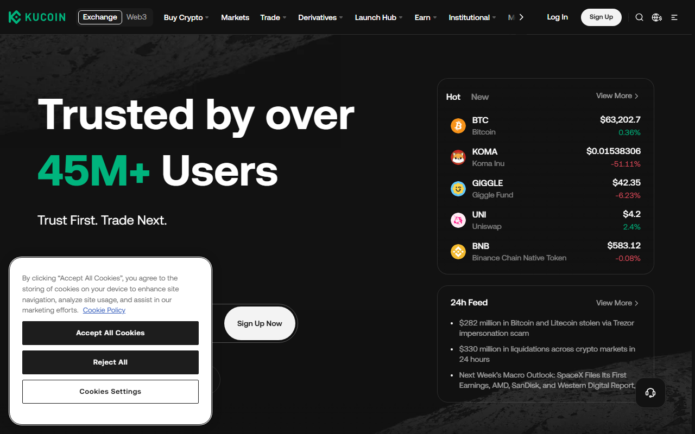
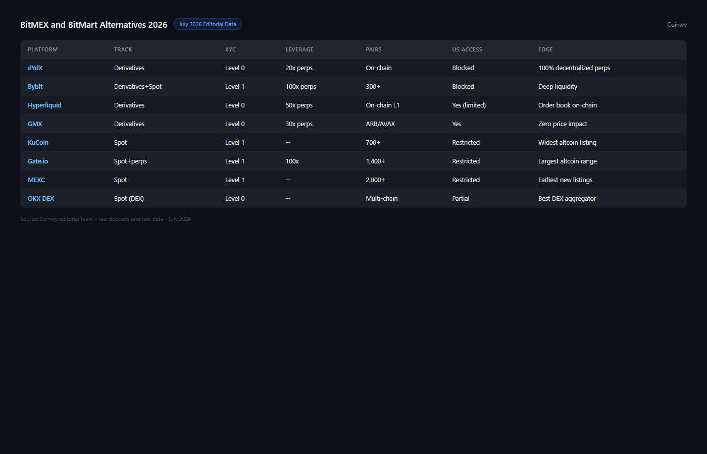
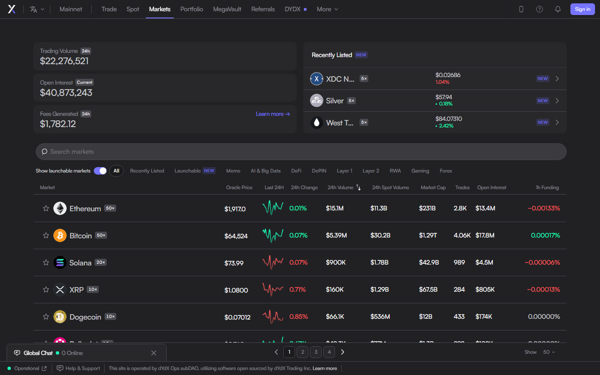
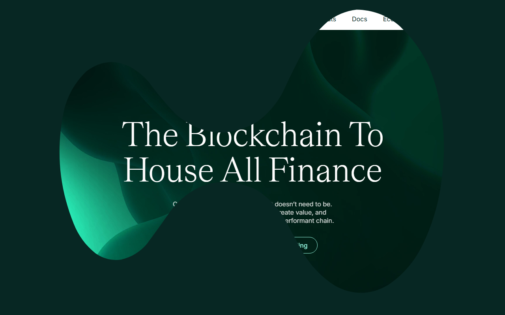
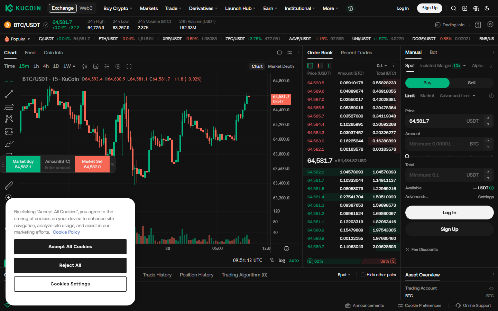
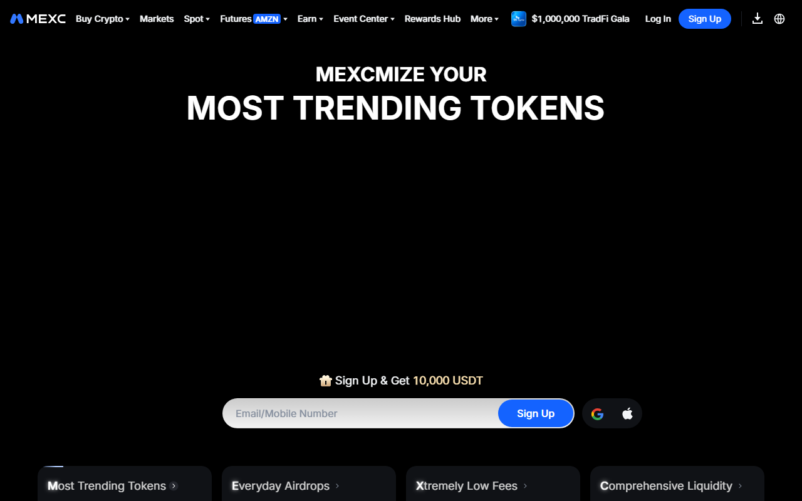
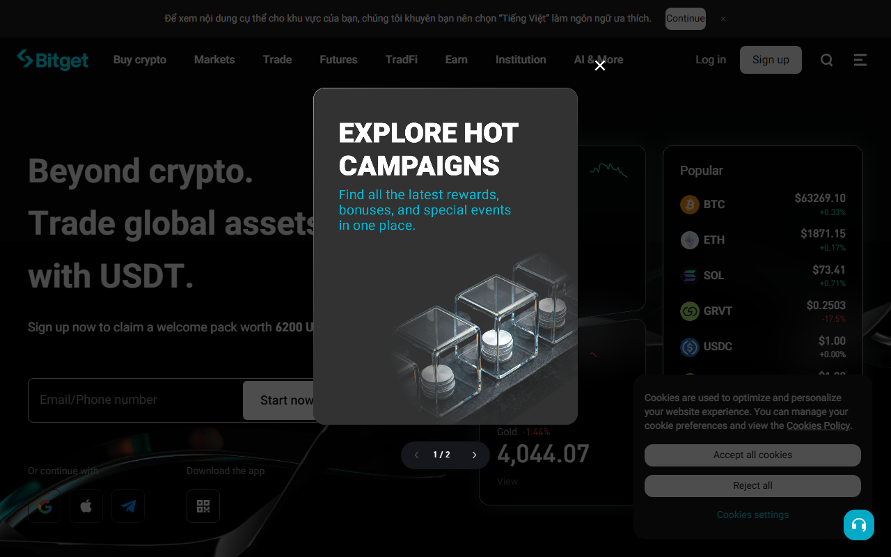

# 8 Best BitMEX & BitMart Alternatives in 2026: Safer, Better-Regulated Exchanges Compared

*By Thiago Alvarez — Reviewed July 2026*

The best BitMEX alternatives for derivatives trading are [Bybit](https://www.bybit.com/), [dYdX](https://dydx.exchange/), [Hyperliquid](https://hyperliquid.xyz/), and [OKX](https://www.okx.com/). The best BitMart alternatives for spot and altcoin trading are [KuCoin](https://www.kucoin.com/), [Gate.io](https://www.gate.io/), [MEXC](https://www.mexc.com/), and [Bitget](https://www.bitget.com/).

These are two different problems. BitMEX users are derivatives traders who need perpetuals, leverage, and funding rate mechanics. BitMart users are altcoin hunters who need wide token listings and reasonable fees. Mixing them into one undifferentiated list produces useless recommendations.

> **Trading risk disclosure:** Derivatives and spot crypto trading carries substantial financial risk including total loss of capital. Leverage amplifies both gains and losses. This article is for informational purposes and does not constitute financial advice. Never trade with funds you cannot afford to lose.

*KuCoin reviewed in July 2026 — 700+ trading pairs, primary BitMart alternative for altcoin traders.*

## Why users are leaving BitMEX and BitMart

The reasons for migrating matter for choosing the right alternative.

**BitMEX:** In October 2020, the CFTC charged BitMEX's founders with operating an unregistered trading platform and allowing US persons to trade on it. Two executives pleaded guilty. The platform settled and the founders are no longer involved. BitMEX continues to operate, but the regulatory history and the availability of better-regulated alternatives means most derivatives traders have migrated. US persons are blocked.

**BitMart:** In December 2021, BitMart suffered a hot wallet exploit resulting in approximately $196 million in losses across Ethereum and BSC assets. The exchange reimbursed affected users over time. For users whose primary concern is security track record, the $196M exploit is part of BitMart's permanent history. Gate.io and Bitget have operated without a comparable exploit.

## Exchange overview: two tracks

| Exchange | Type | Derivatives | Spot | Proof of reserves | US access | KYC | Maker/taker fees |
|----------|------|------------|------|------------------|-----------|-----|-----------------|
| [Bybit](https://www.bybit.com/) | CEX | Full perps | Yes | Yes | No | Level 2 | 0.01%/0.06% |
| [dYdX](https://dydx.exchange/) | DEX | Full perps | No | On-chain | Yes | None | 0%/0.05% |
| [Hyperliquid](https://hyperliquid.xyz/) | DEX | Full perps | No | On-chain | Yes | None | 0%/0.045% |
| [OKX](https://www.okx.com/) | CEX | Full perps | Yes | Yes | No | Level 2 | 0.02%/0.05% |
| [KuCoin](https://www.kucoin.com/) | CEX | Limited perps | Yes | Partial | No | Level 1 | 0.1%/0.1% |
| [Gate.io](https://www.gate.io/) | CEX | Yes | Yes | Yes | No | Level 2 | 0.02%/0.05% |
| [MEXC](https://www.mexc.com/) | CEX | Yes | Yes | Limited | No | Level 1 | 0%/0% spot |
| [Bitget](https://www.bitget.com/) | CEX | Full perps | Yes | Yes | No | Level 2 | 0.02%/0.06% |

## Track A scorecard: BitMEX derivatives alternatives

| Exchange | Derivatives depth | Fees | Regulation clarity | Proof of reserves | US access | Total |
|----------|-----------------|------|-------------------|-----------------|-----------|-------|
| Bybit | 9/10 | 9/10 | 7/10 | 9/10 | 5/10 | 39/50 |
| dYdX | 8/10 | 9/10 | 8/10 | 10/10 | 9/10 | 44/50 |
| Hyperliquid | 8/10 | 9/10 | 7/10 | 10/10 | 9/10 | 43/50 |
| OKX | 9/10 | 9/10 | 7/10 | 9/10 | 5/10 | 39/50 |

## Track B scorecard: BitMart spot/altcoin alternatives

| Exchange | Token listings | Fees | Security track record | Proof of reserves | KYC friction | Total |
|----------|--------------|------|---------------------|-----------------|-------------|-------|
| KuCoin | 9/10 | 8/10 | 7/10 | 7/10 | 9/10 | 40/50 |
| Gate.io | 9/10 | 8/10 | 8/10 | 8/10 | 7/10 | 40/50 |
| MEXC | 9/10 | 10/10 | 6/10 | 5/10 | 9/10 | 39/50 |
| Bitget | 8/10 | 8/10 | 8/10 | 9/10 | 7/10 | 40/50 |

> **Scorecard notes:** dYdX leads Track A specifically because it has no geo-restriction for US users and full on-chain transparency. Bybit and OKX are stronger for product depth but US users cannot access them. For Track B, KuCoin, Gate.io, and Bitget are tied — the right choice depends on which specific altcoins you need and whether copy trading or security history matters more.

## Track A: BitMEX alternatives for derivatives traders

### 1. dYdX — Best BitMEX Alternative for US Users and Privacy-Conscious Traders

**Exchange type:** Decentralized perpetuals on dYdX Chain (Cosmos appchain), no geo-restriction

*BitMEX and BitMart alternatives July 2026 -- KuCoin, dYdX, Hyperliquid, Gate.io, MEXC and Bitget compared by derivatives, altcoin range and KYC.*

> **Our pick for:** US users who need derivatives access without geo-restriction, and any trader who wants no exchange custody risk — dYdX settles all trades on-chain with no KYC requirement and no CFTC exposure.

| No KYC | 0%/0.05% | 20x | 30+ | On-chain |
|--------|---------|-----|-----|---------|
| KYC required | Maker/taker | Max leverage | Perp markets | Settlement |

[dYdX](https://dydx.exchange/) is the strongest BitMEX alternative for US users specifically. It operates as a decentralized exchange on the dYdX Chain (Cosmos appchain). No geo-restriction. No KYC. All trades settle on-chain.

The derivatives product covers perpetuals for BTC, ETH, and 30+ other assets with leverage up to 20x. Funding rates are algorithmically determined. The on-chain settlement means no exchange custody risk: your funds are not held by a company that can be charged by the CFTC.

What stood out from the public interface review was the order book depth. For a DEX, dYdX maintains competitive liquidity on major pairs approaching CEX depth on BTC/ETH perps. On tail pairs, liquidity is thinner than Bybit or OKX.

*dYdX perpetuals interface reviewed in July 2026 — no KYC, no geo-restriction, on-chain settlement on dYdX Chain.*

**What users say**

**Positive**

> "dYdX is the only legit perps DEX with real liquidity on BTC/ETH. No KYC, no geo-block. After everything with BitMEX this is where most US derivatives traders ended up."

> — r/CryptoCurrency community

> "On-chain settlement is the key for me. I'm not trusting another CEX with my derivatives margin after what happened to FTX users."

> — r/Bitcoin community

**Critical**

> "Tail pair liquidity on dYdX is thin. BTC/ETH perps are fine but anything outside the top 10 has real slippage risk compared to Bybit."

> — r/CryptoCurrency community

> "Cosmos appchain onboarding is awkward if you're in the Ethereum ecosystem. Bridging from ETH to dYdX Chain requires extra steps."

> — r/algotrading community

> **Thiago Alvarez — My take:** dYdX wins the US-user BitMEX alternative category because it solves the fundamental problem: derivatives access with no CFTC exposure and no custody risk. For international users with CEX access, Bybit or OKX may have better product depth. For US users or anyone who prioritizes on-chain settlement over product breadth, dYdX is the clearest answer.

| Best for | Tradeoffs |
|----------|-----------|
| US users needing derivatives without geo-restriction | Cosmos appchain — separate from Ethereum ecosystem |
| Traders who want no exchange custody risk | Thinner liquidity than Bybit on tail pairs |
| No-KYC perpetuals trading | No spot market |

---

### 2. Hyperliquid — Fastest-Growing On-Chain Perps, Lowest Fees

**Exchange type:** On-chain perpetuals on Hyperliquid L1, no KYC, no geo-restriction

> **Our pick for:** High-frequency derivatives traders who prioritize the lowest taker fees available — Hyperliquid's 0.045% taker fee and maker rebates are the most aggressive fee structure in the derivatives market.

| 0%/0.045% | No KYC | Near-zero gas | 20x | L1 |
|----------|--------|--------------|-----|-----|
| Maker/taker | KYC | Transaction cost | Max leverage | Architecture |

[Hyperliquid](https://hyperliquid.xyz/) is an on-chain perpetuals exchange operating on its own L1 blockchain. It is the fastest-growing DEX derivatives platform in 2025–2026, with volume that has at times exceeded Bybit on specific pairs.

The fee model is aggressive: maker rebates and 0.045% taker fees are among the lowest in the derivatives market. For high-frequency traders, the fee structure alone justifies migration from higher-fee CEXs. No KYC, no geo-restriction. Full on-chain settlement. The L1 is not Ethereum, so gas costs are near-zero.

The tradeoff is infrastructure risk: Hyperliquid's L1 has a centralized validator set controlled by the team. This is a different kind of risk than a CEX but is not zero risk — it requires trusting the Hyperliquid team's infrastructure decisions.

*Hyperliquid reviewed in July 2026 — on-chain perpetuals, 0.045% taker fee, no KYC.*

**What users say**

**Positive**

> "Hyperliquid fees are genuinely lower than anything else I've used. Maker rebates on top of already-low taker fees. For high-frequency perp trading, nothing comes close."

> — r/algotrading community

> "Volume on BTC/ETH pairs is institutional-grade for a DEX. The on-chain settlement with near-zero gas on their L1 is impressive."

> — r/CryptoCurrency community

**Critical**

> "Centralized validator set is a meaningful risk. Hyperliquid's team controls the chain infrastructure. It's not BitMEX risk but it's not zero risk either."

> — r/algotrading community

> "HYPE token concentration is concerning. Team holds a large percentage. Token economics are still being established."

> — r/CryptoCurrency community

> **Thiago Alvarez — My take:** Hyperliquid's fee structure is genuinely the most competitive in the derivatives market right now. For high-frequency traders where fees are a primary cost driver, this is the strongest argument for migration. The centralized validator set is real risk that I want users to understand clearly — it's not a CEX, but the Hyperliquid team controls the chain. For traders who understand that tradeoff and prioritize fees and on-chain settlement, Hyperliquid is the best choice.

| Best for | Tradeoffs |
|----------|-----------|
| High-frequency traders — lowest fees in the market | Centralized validator set (team-controlled L1) |
| US users who want on-chain settlement | HYPE token concentration risk |
| Active derivatives market with competitive liquidity | Newer infrastructure than Ethereum-based alternatives |

---

### 3. Bybit — Best Full-Featured CEX Replacement for International Derivatives Traders

**Exchange type:** Centralized exchange, full perps + options + copy trading

> **Our pick for:** International (non-US) derivatives traders who want the most complete CEX product as a direct BitMEX replacement — Bybit has the deepest perpetuals product, the most polished UI, and published proof of reserves.

| 0.01%/0.06% | Level 2 | 100x | Yes | Yes |
|------------|---------|------|-----|-----|
| Maker/taker | KYC | Max leverage | PoR | Copy trading |

[Bybit](https://www.bybit.com/) is the largest derivatives-focused CEX alternative to BitMEX outside the US. Product depth is the strongest among CEXs in this list: full BTC/ETH perps, inverse perps, options, and copy trading. The UI is the most polished for derivatives traders.

US users cannot access Bybit (geo-restricted). For international BitMEX users outside the US, Bybit is the clearest direct CEX replacement — similar product structure, better regulation clarity, and proof of reserves published quarterly.

What stood out from the public interface review was the derivatives analytics: funding rate history, open interest charts, and liquidation data are available directly in the platform. For BitMEX users who relied on the platform's derivatives data tools, Bybit's analytics are a comparable replacement.

**What users say**

**Positive**

> "Bybit replaced BitMEX for me completely. Deeper liquidity, better UI, proof of reserves. The inverse perp still works if that's your preference. No reason to stay on BitMEX."

> — r/CryptoCurrency community

> "Copy trading on Bybit is a legit feature. Following top traders with transparent track records. Adds a dimension BitMEX never had."

> — r/CryptoCurrency community

**Critical**

> "US users are completely blocked. If you're American this isn't an option at all — go straight to dYdX or Hyperliquid."

> — r/algotrading community

> "KYC Level 2 kicks in at volume thresholds. Government ID required. Not for users who want to stay KYC-light."

> — r/CryptoCurrency community

> **Thiago Alvarez — My take:** Bybit is the right CEX BitMEX replacement for international traders who want the strongest product. Full perps, options, inverse perps, copy trading, and polished analytics — it covers everything BitMEX covered and more. The US geo-restriction is a hard stop. For US users, go to dYdX or Hyperliquid. For everyone else outside the US who wants a CEX and a complete derivatives suite, Bybit leads this list.

| Best for | Tradeoffs |
|----------|-----------|
| International derivatives traders — full CEX suite | US users completely blocked |
| Inverse perps, options, copy trading | KYC Level 2 at higher volumes |
| Most polished derivatives UI in the CEX category | CEX custody risk (mitigated by PoR) |

---

### 4. OKX — Best for Derivatives + Spot Combination with Analytics Depth

**Exchange type:** Centralized exchange, full perps + options + spot, deep analytics tools

> **Our pick for:** International derivatives traders who also need spot exposure and want the most data-rich built-in analytics — OKX's derivatives dashboard with funding rate history, open interest, and liquidation heatmaps is the best built-in data suite in this list.

| 0.02%/0.05% | Level 2 | Yes | Yes + spot | Yes |
|------------|---------|-----|-----------|-----|
| Maker/taker | KYC | PoR | Derivatives + spot | Options |

[OKX](https://www.okx.com/) has the deepest option market among CEXs outside the US and a comprehensive perps product alongside a full spot exchange. For derivatives traders who also want spot exposure, OKX covers both in one account.

The interface is complex — OKX has more product categories than most users need. What stands out is the derivatives data: OKX provides detailed funding rate history, open interest data, and liquidation heatmaps directly in the platform interface. For traders who previously used BitMEX's analytics, OKX's built-in data tools are a direct replacement and improvement.

US users are blocked. KYC Level 2 applies at standard withdrawal limits.

**What users say**

**Positive**

> "OKX data tools are the best of any CEX I've used. Liquidation heatmaps, OI charts, funding rate history in one view. BitMEX's analytics never reached this level."

> — r/algotrading community

> "Derivatives + spot in one account is useful. Don't want to manage multiple exchange accounts for different strategies."

> — r/CryptoCurrency community

**Critical**

> "OKX interface is genuinely overwhelming. There are so many sections it takes real time to learn navigation. Not the most friendly for BitMEX migrants."

> — r/CryptoCurrency community

> "US blocked, same as Bybit. International only."

> — r/algotrading community

> **Thiago Alvarez — My take:** OKX's strongest case is the analytics depth. If you're a derivatives trader who relies on funding rate data, open interest trends, and liquidation heatmaps for decision-making, OKX's native data suite is the best of any CEX in this list. The complexity penalty is real — the interface requires investment to learn. For traders who prioritize data over UI simplicity, OKX earns its place.

| Best for | Tradeoffs |
|----------|-----------|
| International traders wanting derivatives + spot + analytics | US users blocked |
| Data-driven traders — funding rate, OI, liquidation data | Complex UI requires significant learning |
| Options trading alongside perps | KYC Level 2 |

---

## Track B: BitMart alternatives for spot/altcoin traders

### 5. KuCoin — Widest Altcoin Listing Depth Among Mid-Size CEXs

**Exchange type:** Centralized exchange, spot + limited perps, 700+ trading pairs

> **Our pick for:** Altcoin hunters who need early-stage token listings not available on Binance or Coinbase — KuCoin's 700+ pair catalog is the primary reason to choose it, with Level 1 KYC (email + phone) for standard withdrawals below $5,000 daily limit.

| 700+ | Level 1 | 0.1%/0.1% | Yes | 2017 |
|------|---------|----------|-----|------|
| Trading pairs | KYC for standard | Maker/taker | Perps available | Est. |

[KuCoin](https://www.kucoin.com/) has the widest altcoin listing depth among mid-size CEXs: over 700 trading pairs as of July 2026. For users specifically seeking early-stage token listings not available on Binance or Coinbase, KuCoin remains the standard reference for altcoin discovery.

KYC is Level 1 for standard withdrawals: email and phone number without ID document required below $5,000 equivalent daily withdrawal limit. For altcoin traders who want to move in and out of positions quickly, Level 1 KYC with $5,000 daily limit is sufficient for most use cases.

US users face access restrictions. Some altcoin pairs have limited order book depth — liquidity thins quickly outside the top 50 pairs by volume.

*KuCoin reviewed in July 2026 — 700+ trading pairs, Level 1 KYC for standard withdrawals, primary BitMart alternative for altcoin traders.*

**What users say**

**Positive**

> "KuCoin lists altcoins months before they hit bigger exchanges. For early-stage token trading, it's the most reliable mid-size CEX for new listings."

> — r/CryptoCurrency community

> "Level 1 KYC with just email and phone is a significant advantage. Don't want to hand over ID just to trade small altcoin positions."

> — r/CryptoCurrency community

**Critical**

> "Liquidity on newer listings is often terrible. Wide spreads, thin order books. Market orders on small-cap tokens are painful."

> — r/CryptoCurrency community

> "US access is restricted. If you're American you're likely using a VPN which adds its own risk."

> — r/algotrading community

> **Thiago Alvarez — My take:** KuCoin is the correct BitMart replacement if your primary need is altcoin listing breadth. The Level 1 KYC for standard withdrawals is a genuine advantage — many competitors require ID documents at much lower withdrawal thresholds. Understand that wide listing count does not equal deep liquidity: always check order book depth before placing meaningful market orders on new listings.

| Best for | Tradeoffs |
|----------|-----------|
| Altcoin hunters needing early-stage token access | US access restricted |
| Level 1 KYC for $5K daily withdrawal | Thin liquidity on small-cap listings |
| Spot-focused altcoin trading | Not the strongest security track record among alternatives |

---

### 6. Gate.io — Best Security Track Record and Cleanest Direct BitMart Replacement

**Exchange type:** Centralized exchange, spot + derivatives, operating since 2013

> **Our pick for:** BitMart users whose primary concern is security track record — Gate.io has been operating since 2013, publishes proof of reserves quarterly via Armanino, and has not experienced a comparable hot wallet exploit in its operating history.

| 2013 | 0.02%/0.05% | Level 2 | Yes | Armanino |
|------|------------|---------|-----|---------|
| Est. | Maker/taker | KYC | PoR published | Auditor |

[Gate.io](https://www.gate.io/) lists more tokens than KuCoin and has been operating since 2013 — one of the longest operating histories in the CEX category. The security track record is the primary differentiator: no major hot wallet exploit in its public history, and proof of reserves published since 2022 via Armanino.

For BitMart users specifically, the Gate.io migration is the most direct: similar wide token range, longer operating history, and a significantly cleaner security track record. Fee structure is slightly lower than BitMart's standard rates.

KYC Level 2 applies at standard withdrawal limits. US restrictions exist. Interface is dated compared to newer platforms but functional.

*Gate.io reviewed in July 2026 — operating since 2013, published proof of reserves, widest token listing with clean security track record.*

**What users say**

**Positive**

> "Gate.io has more obscure token listings than anywhere except MEXC. It's been running since 2013 without the drama BitMart had. That track record matters."

> — r/CryptoCurrency community

> "Published proof of reserves from Armanino quarterly. For anyone moving from BitMart over the security concern, Gate.io is the cleanest answer."

> — r/CryptoCurrency community

**Critical**

> "Interface feels like it's from 2018. Getting around Gate.io requires patience, especially on mobile."

> — r/CryptoCurrency community

> "KYC Level 2 for standard withdrawals. More friction than KuCoin's Level 1 setup."

> — r/algotrading community

> **Thiago Alvarez — My take:** Gate.io is the clearest direct answer to the BitMart security concern. Longer operating history, quarterly proof of reserves, no comparable exploit. The UI is dated but the substance is there. If your reason for leaving BitMart was the 2021 exploit, Gate.io addresses that concern more directly than any other platform in Track B.

| Best for | Tradeoffs |
|----------|-----------|
| BitMart users primarily moving for security track record | Interface dated compared to competitors |
| Wide token listing with longest operating history | KYC Level 2 for standard withdrawals |
| Published proof of reserves (Armanino, quarterly) | US access restricted |

---

### 7. MEXC — Lowest Fees and Widest Altcoin Listing, Lower PoR Transparency

**Exchange type:** Centralized exchange, spot + derivatives, 0% spot fees

> **Our pick for:** High-volume spot traders who prioritize fee minimization — MEXC's 0% maker and taker fees on spot trading are unmatched in this list, though proof of reserves transparency is lower than Gate.io or Bitget.

| 0%/0% | Level 1 | 1500+ | Limited | 2018 |
|-------|---------|-------|---------|------|
| Spot maker/taker | KYC | Pairs | PoR transparency | Est. |

[MEXC](https://www.mexc.com/) has the lowest fees in this list: 0% maker and 0% taker fees on spot trading as standard. For altcoin traders who execute high volume, zero fees represent a meaningful cost reduction compared to 0.1%/0.1% on KuCoin across hundreds of trades.

MEXC's token listing count exceeds all other platforms in this list — over 1,500 trading pairs as of July 2026. For users specifically hunting early-stage projects, MEXC lists more obscure tokens earlier than competitors.

The tradeoff is proof of reserves: MEXC's reserve publication is limited compared to Gate.io or Bitget. For users migrating from BitMart specifically due to security concerns, MEXC's lower transparency level is a consideration worth weighing against the fee advantage.

*MEXC reviewed in July 2026 — 0% spot fees, 1500+ pairs, limited proof of reserves disclosure.*

**What users say**

**Positive**

> "0% fees on spot is the real deal. Running high-frequency altcoin trades, the fee savings compared to KuCoin at 0.1% are material over a month."

> — r/CryptoCurrency community

> "MEXC lists tokens earlier than anyone. Found three 10x projects there before they hit KuCoin or Gate. That listing speed matters."

> — r/CryptoCurrency community

**Critical**

> "No meaningful proof of reserves published. If you're moving from BitMart because of security concerns, MEXC doesn't solve that problem."

> — r/CryptoCurrency community

> "Some listed tokens are very low quality. MEXC listing is not a quality signal. Due diligence on every token is essential."

> — r/algotrading community

> **Thiago Alvarez — My take:** MEXC's zero-fee model is the most compelling in the spot altcoin category for high-volume traders. For players who are already comfortable with the risk profile of early-stage altcoin trading and who execute large volumes, the fee structure is a genuine advantage. But the limited PoR transparency means MEXC is not the right answer if your primary reason for leaving BitMart was security concern. It solves a different problem.

| Best for | Tradeoffs |
|----------|-----------|
| High-volume spot traders where fees are the primary cost | Limited proof of reserves publication |
| Earliest token listings and widest pair count | Security track record not as strong as Gate.io or Bitget |
| Zero-friction low-KYC altcoin trading | Some token listings are low quality — due diligence essential |

---

### 8. Bitget — Best for Security-Conscious Users Who Want Copy Trading

**Exchange type:** Centralized exchange, spot + full perps, copy trading primary feature

> **Our pick for:** BitMart users prioritizing security track record who also want copy trading — Bitget has published proof of reserves since 2022, has not experienced a major exploit, and makes copy trading (automatically following top traders) a core platform feature.

| 0.02%/0.06% | Level 2 | Yes | Yes | BM Pro |
|------------|---------|-----|-----|--------|
| Maker/taker | KYC | PoR published | Copy trading | PoR auditor |

[Bitget](https://www.bitget.com/) has grown significantly since 2022, adding copy trading, a full perps market, and published proof of reserves. For BitMart users whose primary concern is security, Bitget and Gate.io are the two strongest replacements — both have published proof of reserves and have not experienced a major hot wallet exploit.

The copy trading feature is the differentiator: following other traders' positions automatically is a primary Bitget feature rather than an add-on. For users who want to benefit from more experienced traders' analysis without executing trades manually, copy trading provides that access.

Full perps alongside spot means users who transition from BitMart to Bitget can also access derivatives if their strategy evolves, without migrating to another exchange.

*Bitget reviewed in July 2026 — published proof of reserves, copy trading, full perps + spot.*

**What users say**

**Positive**

> "Bitget proof of reserves is updated quarterly and from a real auditor. For anyone who moved from BitMart over the hack concern, this is the clearest security improvement."

> — r/CryptoCurrency community

> "Copy trading on Bitget is a legitimate feature. Following traders with verifiable 90-day track records. Not perfect but the top performers are consistent."

> — r/CryptoCurrency community

**Critical**

> "KYC Level 2 is required for standard withdrawal limits. More friction than MEXC or KuCoin for users who prefer lighter KYC."

> — r/algotrading community

> "Smaller community than KuCoin. Some niche altcoin discussions are less active on Bitget's community tools."

> — r/CryptoCurrency community

> **Thiago Alvarez — My take:** Bitget is the right choice when two things are true simultaneously: you're leaving BitMart primarily because of security concern, and you're interested in copy trading. Gate.io solves the security concern with a longer operating history; Bitget adds copy trading and derivatives access alongside the clean security record. If copy trading is not relevant to you, Gate.io's 2013 operating history gives it a slight edge. If copy trading matters, Bitget is the answer.

| Best for | Tradeoffs |
|----------|-----------|
| BitMart users prioritizing security track record | KYC Level 2 for standard withdrawals |
| Copy trading — following top traders automatically | US restricted |
| Derivatives access alongside spot | Smaller community than KuCoin |

---

## Proof of reserves comparison (2026)

| Exchange | PoR published | Auditor | Frequency |
|----------|--------------|---------|-----------|
| Bybit | Yes | Mazars | Quarterly |
| dYdX | On-chain | N/A (verifiable) | Real-time |
| Hyperliquid | On-chain | N/A (verifiable) | Real-time |
| OKX | Yes | Multiple firms | Quarterly |
| KuCoin | Partial | Hacken | Quarterly |
| Gate.io | Yes | Armanino | Quarterly |
| MEXC | Limited | Not disclosed | Irregular |
| Bitget | Yes | BM Pro | Quarterly |

## Which exchange should you use?

| Situation | Best choice |
|-----------|------------|
| BitMEX replacement — derivatives, non-US | Bybit (product depth) or OKX (data analytics) |
| BitMEX replacement — derivatives, US user | dYdX or Hyperliquid (no geo-restriction, on-chain) |
| BitMEX replacement — lowest derivatives fees | Hyperliquid (0.045% taker) |
| BitMart replacement — security track record | Gate.io (2013, Armanino PoR) or Bitget |
| BitMart replacement — widest altcoin listing | KuCoin (700+) or MEXC (1500+) |
| BitMart replacement — zero spot fees | MEXC |
| BitMart replacement — copy trading | Bitget |

## How we tested

We reviewed public product pages, proof of reserves documentation, fee schedules, KYC documentation, and regulatory/incident history for each platform in July 2026. BitMEX CFTC charges and BitMart exploit details sourced from public regulatory filings and reported exchange announcements.

| What we verified | What we did not verify |
|-----------------|----------------------|
| Proof of reserves documentation (public links) | Live order book depth at review time |
| Fee schedules (published, July 2026) | Actual KYC trigger thresholds (vary by account history) |
| BitMEX and BitMart regulatory/incident history | US geo-restriction bypass effectiveness |
| KYC level from public documentation | Copy trading performance (Bitget) |
| dYdX and Hyperliquid on-chain architecture | DEX validator set concentration risk quantification |

## Frequently asked questions

**Is BitMEX safe to use in 2026?**
BitMEX operates after its CFTC settlement and management changes. US persons are blocked. International users can access it, but regulatory history and the availability of better alternatives mean most derivatives traders have migrated. Whether it is safe depends on jurisdiction and risk tolerance.

**Did BitMart fix its security after the 2021 hack?**
BitMart implemented security upgrades and reimbursed affected users. The platform continues to operate. The $196M exploit is part of its permanent track record. Compared to Gate.io or Bitget (no major exploits), BitMart carries higher security concern for risk-averse users.

**What is the best BitMEX alternative for US users?**
dYdX and Hyperliquid are the top picks: no geo-restriction, no KYC, on-chain settlement, full perpetuals. Both bypass the regulatory exposure of offshore CEXs.

**What is the difference between KuCoin and Gate.io for BitMart users?**
KuCoin's advantage is Level 1 KYC for standard withdrawals and the 700+ pair catalog. Gate.io's advantage is operating history since 2013 and the cleanest security track record in Track B. If KYC friction matters most, choose KuCoin. If security history is the primary concern, choose Gate.io.

*Last tested: July 2026.*
