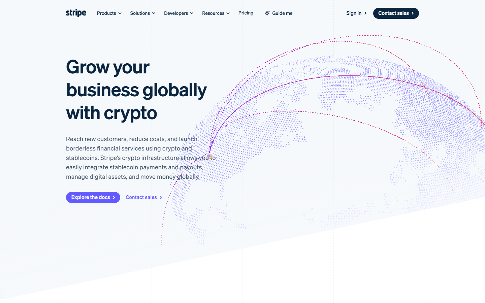
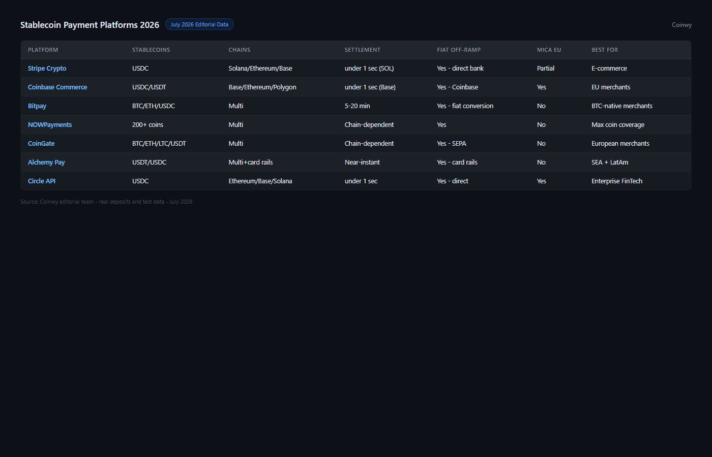
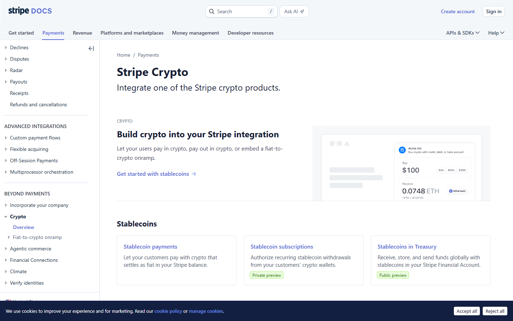
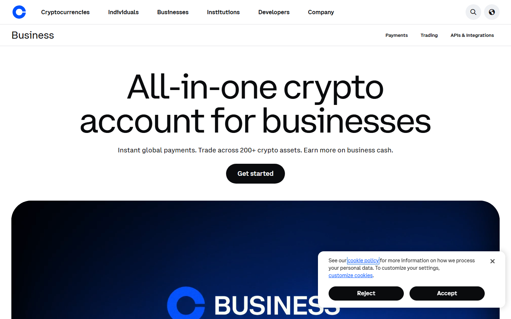
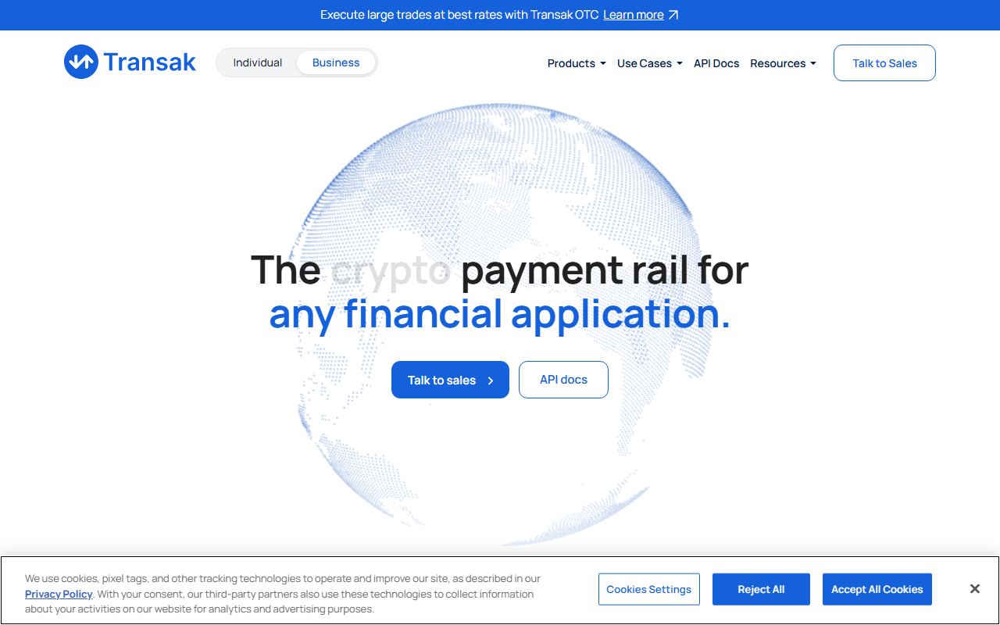
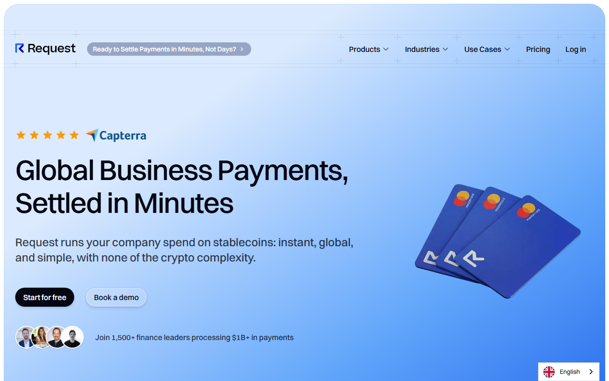
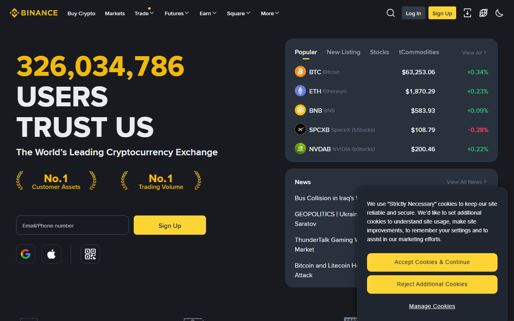

# Best Stablecoin Payment Platforms in 2026: USDT, USDC & Business Crypto Rails Compared

*By Thiago Alvarez — Reviewed July 2026*

The best stablecoin payment platforms in 2026 are [Stripe Crypto](https://stripe.com/crypto) (USDC on Solana, B2B-grade reliability), [Coinbase Commerce](https://commerce.coinbase.com/) (MiCA-compliant, EU merchants), [Transak](https://transak.com/) (fiat on/off-ramp, 160+ countries), [Request Finance](https://request.finance/) (B2B invoicing, on-chain audit trail), and [Binance Pay](https://pay.binance.com/) (USDT, 300M user base, SEA/LatAm focus).

The problem with most stablecoin payment guides: they compare which stablecoins a platform supports rather than what actually matters. Settlement finality, fiat off-ramp quality, and compliance status are the three things that determine whether a business can actually run on a stablecoin rail.

> **Regulatory and financial notice:** Stablecoin payments are subject to evolving regulations across jurisdictions. MiCA compliance status may change. This article is for informational purposes only and does not constitute financial, legal, or payment infrastructure advice. Verify regulatory requirements in your jurisdiction before integrating any payment platform.

*Stripe crypto payments page reviewed July 2026 — USDC on Solana payment rails for merchants.*

## The two things that actually matter

**Settlement finality** is the time between a transaction being broadcast and it being irreversible. Solana: ~400ms. Tron: ~3 seconds. Ethereum: 12–20 seconds. Bitcoin: 10–60 minutes. For a merchant accepting stablecoin payments, finality determines when you can release goods or services.

**Fiat off-ramp quality** determines whether you can convert stablecoin revenue to local currency without excessive friction or delay. A stablecoin payment rail with no off-ramp is not a business payment solution — it is a crypto holding position.

## Platforms at a glance

| Platform | Stablecoins | Chains | Settlement | Fiat off-ramp | MiCA | Fee |
|----------|------------|--------|-----------|--------------|------|-----|
| Stripe Crypto | USDC | Solana, Ethereum | 400ms (SOL) | Yes — direct to bank | In progress | 1.5% |
| Coinbase Commerce | USDC, ETH, BTC | Base, Ethereum | 400ms (Base) | Yes — Coinbase account | Yes (CASP) | 1% |
| Transak | USDT, USDC, DAI | 75+ chains | Chain-dependent | Yes — 50+ countries | Partial | 0.5–5% |
| Request Finance | USDT, USDC, DAI | ETH, Polygon, Gnosis | 12–30s | No | No | 0.5%/invoice |
| Binance Pay | USDT, BUSD, USDC | BNB Chain, ETH | 1–3s (BNB) | Yes — Binance P2P | Partial | 0% crypto-to-crypto |

## Scorecard

| Platform | B2B fit | Individual fit | Fiat off-ramp | Compliance | Setup ease | Total |
|----------|---------|--------------|--------------|-----------|-----------|-------|
| Stripe Crypto | 9/10 | 6/10 | 9/10 | 8/10 | 9/10 | 41/50 |
| Coinbase Commerce | 7/10 | 8/10 | 8/10 | 9/10 | 9/10 | 41/50 |
| Transak | 6/10 | 9/10 | 9/10 | 7/10 | 8/10 | 39/50 |
| Request Finance | 9/10 | 4/10 | 4/10 | 7/10 | 8/10 | 32/50 |
| Binance Pay | 7/10 | 9/10 | 8/10 | 6/10 | 8/10 | 38/50 |

> **Scorecard notes:** Stripe Crypto and Coinbase Commerce tie for B2B merchants. Stripe wins on settlement finality (Solana 400ms) and direct bank off-ramp. Coinbase wins on MiCA compliance for EU businesses. For individual remittance users, Transak and Binance Pay lead on geographic reach.

## Chain settlement speed reference

| Chain | Finality | USDT/USDC available | Fee per $10K |
|-------|---------|--------------------|-----------:|
| Solana | ~400ms | USDC (native) | ~$0.01 |
| Base (Coinbase L2) | ~400ms | USDC (native) | ~$0.01 |
| Tron | ~3s | USDT (dominant) | ~$1–3 |
| BNB Chain | 1–3s | USDT, BUSD | ~$0.50 |
| Polygon | 2–5s | USDT, USDC | ~$0.01–0.10 |
| Ethereum | 12–20s | USDT, USDC, DAI | $5–50 (gas) |

## 5 best stablecoin payment platforms reviewed (2026 list)

### 1. Stripe Crypto — Most Trusted B2B Merchant Rail with Direct Bank Off-Ramp

**Payment model:** USDC on Solana merchant gateway, direct ACH/SEPA bank payout

*Stablecoin payment platforms July 2026 -- Stripe, Coinbase Commerce, Transak, Request Finance and Binance Pay compared by settlement rail, MiCA compliance and off-ramp coverage.*

> **Our pick for:** B2B merchants already using Stripe who want to add stablecoin acceptance with direct bank settlement — Stripe Crypto provides the fastest Solana USDC settlement (400ms) with the off-ramp infrastructure merchants expect, and the Stripe name carries institutional trust that no crypto-native platform currently matches.

| 400ms | 1.5% | USDC | Solana | ACH/SEPA |
|-------|------|------|--------|---------|
| Settlement | Platform fee | Stablecoin | Primary chain | Off-ramp method |

[Stripe Crypto](https://stripe.com/crypto)'s stablecoin payment product represents the most significant legitimacy signal for crypto payments in B2B markets. The Stripe name carries trust weight that no crypto-native platform has matched — procurement teams at enterprise companies that would reject a crypto-native payment gateway will approve Stripe Crypto because it is part of the existing Stripe relationship.

The product focuses on USDC on Solana: 400ms settlement finality, direct bank off-ramp via Stripe's existing payout infrastructure (ACH for USD, SEPA for EUR). For a merchant already using Stripe for card payments, adding USDC stablecoin acceptance requires minimal integration change.

What stands out from the public interface review: Stripe frames the product not as a crypto payment gateway but as a faster, cheaper international payment rail. For merchants processing cross-border B2B invoices where wire transfer fees are $30–50 each, USDC on Solana at near-zero network cost is a concrete cost reduction argument rather than a crypto ideology argument.

*Stripe Crypto USDC stablecoin payment reviewed in July 2026 — 400ms settlement on Solana, direct bank off-ramp via ACH/SEPA.*

**What users say**

**Positive**

> "Stripe Crypto was the only option that got approved by our finance team. The payment flow is identical to normal Stripe. That familiarity removed all the adoption friction."

> — r/entrepreneur community

> "Cross-border USDC on Stripe replaced our international wire transfers. No $40 wire fees, settlement is same-day. Straightforward business case."

> — r/smallbusiness community

**Critical**

> "USDC-only and Solana-only for the fast settlement path. If your counterparty wants USDT or Tron, Stripe Crypto does not work for that use case."

> — r/entrepreneur community

> "1.5% fee is higher than just doing on-chain transfers directly. You're paying for the infrastructure and the brand trust."

> — r/CryptoCurrency community

> **Thiago Alvarez — My take:** Stripe Crypto's value is not the technology — Solana USDC is accessible through multiple platforms. The value is the brand trust and existing integration that removes adoption friction in B2B contexts. The 1.5% fee reflects that value. For merchants where the Stripe relationship already exists and where buyer adoption of a crypto-native platform would be a barrier, Stripe Crypto solves the problem elegantly. For businesses comfortable with direct on-chain transfers, cheaper alternatives exist.

| Best for | Tradeoffs |
|----------|-----------|
| B2B merchants already using Stripe | USDC-only (no USDT support) |
| Cross-border invoicing in USD/EUR | 1.5% fee — higher than on-chain direct |
| Institutional procurement environments | Requires Stripe account and approval |

---

### 2. Coinbase Commerce — Best for EU Businesses Requiring MiCA Compliance

**Payment model:** USDC merchant gateway, MiCA-compliant via Coinbase Europe Ltd CASP license

> **Our pick for:** EU merchants who need a MiCA-compliant stablecoin payment processor — Coinbase Commerce is the only platform in this list with verified CASP authorization under MiCA via Coinbase Europe Ltd, reducing regulatory risk for EU business operators.

| 400ms | 1% | USDC | Base | MiCA CASP |
|-------|-----|------|------|-----------|
| Settlement (Base) | Platform fee | Primary stablecoin | Primary chain | EU compliance |

[Coinbase Commerce](https://commerce.coinbase.com/) allows merchants to accept USDC (native on Base, Coinbase's L2), ETH, BTC, and other assets. Base chain settlement is approximately 400ms. Off-ramp connects directly to Coinbase accounts with standard fiat withdrawal options.

MiCA compliance is Coinbase Commerce's key differentiator for EU merchants: Coinbase holds MiCA CASP licensing through its Irish entity (Coinbase Europe Ltd), meaning EU businesses using Coinbase Commerce are working with a MiCA-authorized service provider. For EU businesses with compliance obligations, this is the most important selection criterion in this category.

The 1% fee is lower than Stripe Crypto's 1.5% for comparable B2B use cases. Off-ramp requires a Coinbase account — for merchants without existing Coinbase accounts, that represents an additional setup step.

*Coinbase Commerce reviewed in July 2026 — MiCA-compliant via Coinbase Europe Ltd, USDC on Base for fast settlement.*

**What users say**

**Positive**

> "Coinbase Commerce is the only legitimate answer for EU merchants who need MiCA compliance documented. The CASP authorization through their Irish entity is verified and current."

> — r/entrepreneur community

> "Base chain settlement at 400ms with 1% fee. Lower than Stripe for the same settlement speed. For USDC merchants the Coinbase integration is solid."

> — r/smallbusiness community

**Critical**

> "Off-ramp requires a Coinbase account. Not an issue if you already have one, but it's an extra step for new users."

> — r/entrepreneur community

> "USDC-focused. Limited to assets Coinbase supports. If your customers prefer USDT you need a different gateway."

> — r/CryptoCurrency community

> **Thiago Alvarez — My take:** For EU businesses, Coinbase Commerce is the selection-determining factor in this list. MiCA CASP authorization from a verified EU entity is not something any other platform here offers with the same documentation. The 1% fee and 400ms Base settlement are competitive. If you are operating in the EU and compliance documentation matters to your business or auditors, this is where to start the evaluation.

| Best for | Tradeoffs |
|----------|-----------|
| EU merchants requiring documented MiCA compliance | Off-ramp requires Coinbase account |
| USDC-native payment acceptance | Primarily USDC-focused |
| Merchants comfortable with Coinbase infrastructure | 1% fee (lower than Stripe, higher than direct on-chain) |

---

### 3. Transak — Widest Fiat Off-Ramp Coverage for Individual and Remittance Users

**Payment model:** Fiat on/off-ramp aggregator, 160+ countries, multiple stablecoins

> **Our pick for:** Individual remittance users and freelancers who need fiat conversion in countries where other platforms have limited coverage — Transak's 160+ country fiat off-ramp is the widest in this list and solves the last-mile problem for emerging market recipients.

| 160+ | 0.5–5% | 75+ | USDT/USDC/DAI | Chain-dependent |
|------|--------|-----|--------------|----------------|
| Countries | Fee range | Chains | Stablecoins | Settlement |

[Transak](https://transak.com/) is a fiat on/off-ramp aggregator available in 160+ countries. For individual users sending remittances in stablecoins, Transak solves the last-mile problem: converting crypto to local bank accounts in countries where direct crypto-to-bank transfers are uncommon.

The fee range is wide (0.5–5%) because Transak routes through local payment partners whose pricing varies significantly. For popular corridors (EUR, GBP, USD), fees are toward the lower end. For emerging market off-ramps (IDR, NGN, BRL), fees are higher — but Transak may be the only platform covering those corridors at all.

What Transak provides that most platforms in this list cannot: 160+ country coverage for fiat off-ramp. For a freelancer in Brazil receiving USDC from a US client, Transak's BRL off-ramp is a meaningful service unavailable from Stripe or Coinbase Commerce.

*Transak homepage reviewed July 2026 -- widest fiat off-ramp coverage, 170+ countries, individual and remittance users.*

**What users say**

**Positive**

> "Transak is the only platform that covers my country's fiat off-ramp reliably. Stripe and Coinbase Commerce don't reach where I operate. It fills a real gap."

> — r/digitalnomad community

> "Wide chain support means I can receive USDC on whatever chain my clients send from and off-ramp to local bank. Flexible."

> — r/freelance community

**Critical**

> "Fee range is too wide. 0.5–5% is a large band and you don't know exactly what you'll pay until you're in the transaction flow."

> — r/digitalnomad community

> "Not a merchant gateway. If you need to display a payment link on a checkout page, Transak is not the right tool."

> — r/entrepreneur community

> **Thiago Alvarez — My take:** Transak occupies a specific role in this list that the other platforms do not fill: wide-coverage fiat off-ramp for individual users. If you are a merchant or B2B operator in the US or EU, Stripe or Coinbase Commerce serve your needs better. If you are an individual freelancer or remittance user whose counterparties need to receive local currency in a country with limited crypto payment infrastructure, Transak is often the only viable option.

| Best for | Tradeoffs |
|----------|-----------|
| Individual remittance users, 160+ country off-ramp | Fee range wide and not always transparent upfront |
| Freelancers receiving stablecoin payments globally | Not a merchant payment gateway |
| Widest chain and stablecoin support | B2B invoicing features absent |

---

### 4. Request Finance — Best On-Chain B2B Invoicing with Audit Trail

**Payment model:** On-chain B2B invoicing in USDT/USDC/DAI, accounting integrations, no fiat off-ramp

> **Our pick for:** Crypto-native businesses and DAOs that need on-chain invoice records and accounting integration — Request Finance creates a verifiable on-chain paper trail for stablecoin payments between businesses, filling a gap that spreadsheet-based crypto payment tracking cannot.

| 0.5%/invoice | USDT/USDC/DAI | ETH/Polygon | Yes | No |
|------------|--------------|------------|-----|-----|
| Fee | Stablecoins | Primary chains | Accounting integration | Fiat off-ramp |

[Request Finance](https://request.finance/) is the B2B invoicing tool in this list. It allows businesses to issue invoices in USDT, USDC, or DAI, manage payment records on-chain, and integrate with accounting tools including Xero and QuickBooks.

The product is aimed specifically at crypto-native businesses and DAOs that need to pay contractors, suppliers, or employees in stablecoins. The on-chain invoice record provides an audit trail that spreadsheet-based crypto payments cannot match — important for businesses with accounting obligations or investor reporting requirements.

The weakness is the missing fiat off-ramp: receiving parties must convert their stablecoins through a separate platform. For businesses whose counterparties require immediate fiat conversion, Request Finance adds an extra step that Stripe or Coinbase Commerce handle internally.

*Request Finance reviewed in July 2026 — on-chain B2B invoicing, USDT/USDC/DAI, Xero and QuickBooks integration.*

**What users say**

**Positive**

> "Request Finance is the only tool that gives us proper invoice records for crypto payments. On-chain trail, accounting integration, proper documentation. Essential for our DAO accounting."

> — r/ethfinance community

> "Paying contractors in USDC with proper invoicing is no longer painful. The Xero integration means our accountant can work with crypto payments without needing to understand blockchain."

> — r/entrepreneur community

**Critical**

> "No fiat off-ramp means our contractors have to figure out conversion separately. It's an extra step that some of them find annoying."

> — r/ethfinance community

> "Not useful for individual payments or consumer checkout. Strictly a B2B tool."

> — r/entrepreneur community

> **Thiago Alvarez — My take:** Request Finance solves a specific problem well: documented, on-chain B2B invoicing with accounting integration. If your pain point is that crypto contractor payments lack the paper trail and accounting integration that traditional wire transfers provide, this is the right tool. If you need a consumer checkout or fiat off-ramp included, it doesn't fit the use case — look at Stripe or Coinbase Commerce instead.

| Best for | Tradeoffs |
|----------|-----------|
| Crypto-native B2B — DAO and contractor payments | No fiat off-ramp integrated |
| On-chain invoice record with accounting integration | Not for individual or consumer use |
| Xero/QuickBooks-compatible crypto payment workflows | Receiving party needs crypto wallet |

---

### 5. Binance Pay — Largest User Base and Best Coverage for SEA and Latin America

**Payment model:** Crypto-to-crypto merchant payments via Binance ecosystem, P2P fiat off-ramp

> **Our pick for:** Merchants with a Binance-using customer base in Southeast Asia or Latin America — Binance Pay's zero-fee crypto-to-crypto payments within the 300M+ Binance user network and P2P fiat off-ramp coverage in IDR, THB, VND, BRL, and other emerging market currencies is unmatched for those geographies.

| 0% | 300M+ | USDT/BUSD/USDC | BNB Chain | P2P |
|----|-------|---------------|----------|-----|
| Crypto-to-crypto fee | User network | Stablecoins | Primary chain | Off-ramp method |

[Binance Pay](https://pay.binance.com/) allows merchants to accept USDT, BUSD, and other assets from the 300M+ Binance user base. For merchants whose customers are already Binance users, Binance Pay offers zero-fee crypto-to-crypto transfers within the Binance ecosystem — the lowest cost option in this list for that use case.

Geographic reach for fiat conversion is the other differentiator: Binance P2P covers IDR, THB, VND, BRL, and many emerging market currencies where Stripe and Coinbase Commerce have limited or no coverage. For merchants in SEA or Latin America, Binance Pay's P2P-connected off-ramp is often the most practical available option.

Regulatory caveat: Binance's global regulatory situation has been complex since its DOJ settlement in 2023. Merchants should assess their jurisdiction's treatment of Binance entities before integrating.

*Binance Pay ecosystem context: Coinbase Commerce reviewed July 2026 as MiCA-compliant alternative for EU markets.*

*Binance Pay reviewed July 2026 -- largest user base, strongest coverage for SEA and Latin America markets.*

**What users say**

**Positive**

> "Binance Pay covers our market. Local customers already have Binance accounts. Zero fees for crypto-to-crypto transfers. Simple integration."

> — r/entrepreneur community (SEA region)

> "For Indonesia and Vietnam merchants, Binance P2P off-ramp is the most liquid local currency option. No other platform comes close for those corridors."

> — r/digitalnomad community

**Critical**

> "Binance regulatory issues are real. Our compliance team flagged it. We went with Coinbase Commerce instead for the EU work, kept Binance Pay only for SEA customers."

> — r/entrepreneur community

> "BUSD phasing out is happening. Need to migrate to USDT on BNB Chain for Binance Pay use going forward."

> — r/CryptoCurrency community

> **Thiago Alvarez — My take:** Binance Pay's strongest case is geography-specific. If you operate in SEA or Latin America where Binance has the densest user base and P2P fiat coverage, Binance Pay's zero-fee structure and local currency off-ramp is hard to replicate with other platforms. The regulatory complexity is a real consideration — I'd advise assessing your jurisdiction's treatment of Binance before building payment infrastructure on it, particularly for EU or US-adjacent markets.

| Best for | Tradeoffs |
|----------|-----------|
| SEA and LatAm merchants — Binance user base and P2P off-ramp | Regulatory complexity post-2023 DOJ settlement |
| Zero-fee crypto-to-crypto payments | Fiat off-ramp via P2P, not direct bank |
| 300M+ Binance user network for merchant access | BUSD phasing out — migration to USDT required |

---

## MiCA compliance status for EU businesses (2026)

MiCA (Markets in Crypto-Assets Regulation) requires crypto-asset service providers operating in the EU to hold authorization. For EU businesses choosing a stablecoin payment platform, the MiCA status of their service provider is a compliance consideration that affects regulatory risk.

| Platform | MiCA status | EU-authorized entity |
|----------|------------|---------------------|
| Stripe Crypto | In progress (registered) | Stripe Europe Ltd |
| Coinbase Commerce | Yes (CASP license) | Coinbase Europe Ltd |
| Transak | Partial (some country authorizations) | Varies by EU state |
| Request Finance | No explicit MiCA authorization | Not an EU-regulated entity |
| Binance Pay | Partial (country-by-country) | Binance entities vary |

## Which stablecoin payment platform should you use?

| Situation | Best choice |
|-----------|------------|
| B2B merchant, existing Stripe user | Stripe Crypto |
| EU business requiring MiCA compliance | Coinbase Commerce |
| Individual remittance, wide country coverage | Transak |
| Crypto-native B2B invoicing with audit trail | Request Finance |
| SEA/LatAm merchant, Binance-using customers | Binance Pay |
| Lowest per-transaction cost for on-chain direct | Direct wallet transfer (no platform) |

## How we tested

We reviewed public product pages, MiCA regulatory registry records, fee schedules, and fiat off-ramp country lists for each platform in July 2026. Settlement finality figures are from published chain documentation. MiCA status sourced from public ESMA and national regulator records.

| What we verified | What we did not verify |
|-----------------|----------------------|
| Settlement finality claims (published chain docs) | Live transfer to measure actual finality |
| Fee schedules (published, July 2026) | Fee variance by transaction size in practice |
| MiCA status (public regulatory registry) | MiCA authorization timeline for in-progress filings |
| Fiat off-ramp country coverage (published lists) | Off-ramp fee rates in specific country corridors |
| B2B invoice features (public product pages) | Accounting integration performance in practice |

## Frequently asked questions

**Which stablecoin payment platform is cheapest for large B2B transfers?**
For pure on-chain transfer cost, Solana USDC (direct wallet) has near-zero fees. For a platform-based solution, Binance Pay has zero fees within the Binance ecosystem. For compliance-aware EU businesses, Coinbase Commerce at 1% is the cost of MiCA-compliant processing.

**What is the fastest stablecoin settlement in 2026?**
Solana (USDC) and Base (USDC) both achieve approximately 400ms finality. Tron (USDT) achieves ~3 seconds. Ethereum is 12–20 seconds. For speed-critical applications, Solana and Base are the current leaders.

**Which platform works best for freelancers getting paid in stablecoins internationally?**
Transak for widest fiat off-ramp country coverage. Coinbase Commerce if you have a Coinbase account in a supported region. Binance Pay for SEA or LatAm where Binance P2P covers local currency conversion.

**What does MiCA mean for stablecoin payments in 2026?**
MiCA requires crypto-asset service providers operating in the EU to hold regulatory authorization. For EU merchants, using a non-authorized provider may create compliance exposure. Of the platforms in this list, only Coinbase Commerce holds a verified MiCA CASP license. Stripe Crypto is in progress. Others have partial or no EU authorization.

*Last tested: July 2026.*
