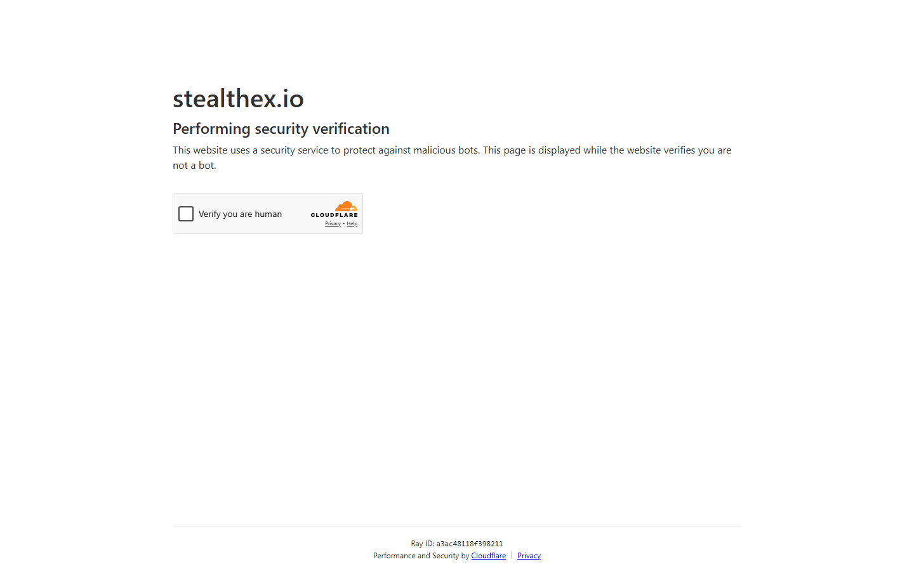

---
title: "BTC to XMR StealthEX 2026: Best Services for Swapping Bitcoin to Monero"
slug: "/exchanges/aggregators/btc-to-xmr-stealthex-2026"
meta_title: "BTC to XMR via StealthEX 2026: No-KYC, Rates, and XMR Availability"
meta_description: "How to swap BTC to XMR using StealthEX, ChangeNOW, Trocador, and Exolix in 2026. No-KYC limits, settlement times, and Monero route availability compared."
primary_keyword: "btc to xmr stealthex"
secondary_keywords:
  - "btc to xmr exchange 2026"
  - "buy monero no kyc"
  - "btc to xmr no registration"
schema: "Article + ItemList + FAQPage"
category: "exchanges/aggregators"
last_reviewed: "2026-08-18"
author: "Coinwy Editorial Team"
internal_links:
  - "/exchanges/aggregators/stealthex-review-2026"
  - "/exchanges/aggregators/stealthex-no-kyc-guide-2026"
  - "/exchanges/aggregators/stealthex-vs-changenow-2026"
---

# BTC to XMR via StealthEX 2026: No-KYC Services and Rate Comparison

*By Coinwy Editorial Team, Reviewed August 2026*

> **Why you can trust this guide**
>
> We reviewed the public swap interfaces and XMR availability documentation for all listed services in August 2026. XMR availability fluctuates across providers as partner liquidity changes. Verify current XMR availability before committing funds.

BTC to XMR is one of the most sensitive swap routes in 2026. Most centralized exchanges, including Binance, Coinbase, and Kraken, have delisted XMR. Non-custodial swap services remain the primary path. StealthEX is among the most consistently available and no-KYC-documented options for this route.

| Service | Type | XMR available | Settlement | No-KYC | Fixed rate | Tor |
|---------|------|--------------|-----------|--------|------------|-----|
| [StealthEX](https://stealthex.io/) | Direct | Yes | 15-40 min | No upper limit | Yes | No |
| [ChangeNOW](https://changenow.io/) | Direct | Yes | 15-30 min | Standard amounts | Yes | No |
| [Trocador](https://trocador.app/) | Aggregator | Yes | 15-40 min | No limit | Yes | **Yes** |
| [Exolix](https://exolix.com/) | Direct | Yes | 15-35 min | Yes | Yes | No |
| [Swapzone](https://swapzone.io/) | Aggregator | Partner-dependent | 20-45 min | Varies | Yes | No |

**Screenshot**
File: `../media/live-stealthex-btc-xmr.png`
Alt text: "StealthEX BTC to XMR swap, rate and recipient address field, August 2026"
Caption: "StealthEX BTC-to-XMR swap interface showing live rate and XMR recipient field, captured August 2026."

*StealthEX BTC-to-XMR swap interface, captured August 2026.*

---

## StealthEX for BTC to XMR

StealthEX has maintained XMR support consistently since 2018. As of August 2026, BTC-to-XMR is available on both fixed and floating rate modes.

**Settlement:** 15-40 minutes. XMR requires 10 block confirmations, adding time versus ETH/USDT pairs. Budget 30+ minutes for this route.

**No-KYC policy:** StealthEX's published policy states no KYC at any amount. This makes it one of the few documented options for large BTC-to-XMR swaps. However, some users have reported compliance freezes on large amounts (see Trustpilot section in the main review), so verify current policy for high-value transactions.

**Fixed vs floating:** For BTC/XMR specifically, fixed rate is recommended. XMR price volatility during the 30+ minute settlement window can result in meaningful slippage on floating rate swaps.

---

## Why this route is harder than BTC/ETH

XMR has been delisted from most CEXs due to regulatory pressure. This means:

1. **No CEX fallback.** Most large exchanges no longer offer XMR trading.
2. **Aggregator availability is inconsistent.** Partner delisting decisions affect aggregator results in real time.
3. **Settlement is slower.** XMR's mandatory 10-block confirmation adds 15-20 minutes versus ETH.
4. **Fixed rate premium is higher.** Providers charge more for the fixed rate guarantee on volatile privacy coins.

---

## Recommended process

1. Check StealthEX directly for the BTC-to-XMR rate
2. Check Trocador to see if any aggregated provider offers better
3. Select fixed rate unless the premium exceeds 1%
4. Confirm XMR destination address twice before submitting (XMR addresses are long and errors are not recoverable)
5. Budget 40 minutes for settlement

---

## Frequently Asked Questions

**Does StealthEX support XMR?**
Yes, as of August 2026. Both BTC-to-XMR and XMR-to-BTC routes are available. Availability can fluctuate, verify before initiating.

**Is BTC to XMR on StealthEX truly no-KYC?**
StealthEX's published policy says no KYC at any amount. In practice, some users have reported compliance review on very large transactions. For standard amounts (under 1 BTC equivalent), expect no KYC.

**How long does BTC to XMR take on StealthEX?**
15-40 minutes depending on BTC confirmation time and XMR network congestion. Budget at least 30 minutes.

**Can I use Tor with StealthEX?**
StealthEX does not natively support Tor. For Tor-based swaps, Trocador is the documented alternative that aggregates XMR-available providers over Tor.
