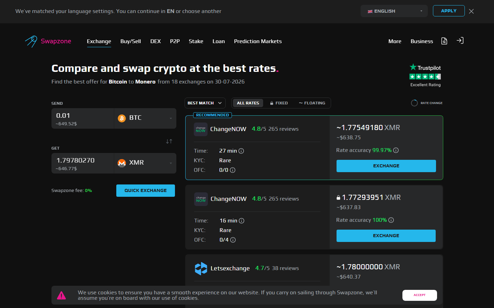
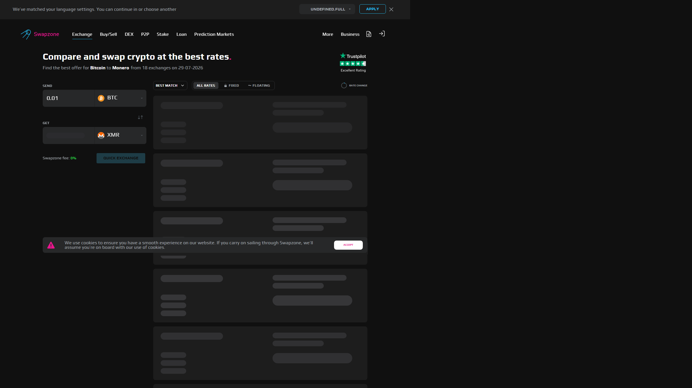

---
title: "Best Crypto Exchange Aggregators in 2026: 8 Platforms Compared"
slug: "/exchanges/best-crypto-exchange-aggregators-2026"
meta_title: "Best Crypto Exchange Aggregators 2026: 8 Platforms Compared"
meta_description: "Compare 8 crypto exchange aggregators in 2026 — partner count, fixed rate, no-KYC, and fiat support ranked across Swapzone, SwapSpace, SimpleSwap, and more."
primary_keyword: "best crypto exchange aggregator 2026"
secondary_keywords:
  - "crypto exchange aggregator 2026"
  - "best crypto swap aggregator"
  - "no kyc crypto aggregator"
schema: "Article + ItemList + BreadcrumbList + FAQPage"
category: "exchanges"
last_reviewed: "2026-07-29"
internal_links:
  - "/exchanges/crypto-exchange-aggregator-vs-regular-exchange"
  - "/exchanges/swapzone-vs-changenow"
  - "/exchanges/swapzone-vs-swapspace"
---

# Best Crypto Exchange Aggregators in 2026: 8 Platforms Compared

**Editorial note:** Features, partner counts, and fiat availability change regularly. Verify directly before any swap.

**Last reviewed:** July 2026.

The problem with going directly to a single swap service is you never know if the rate is competitive. An aggregator fixes that: one query, rates from 10 to 20-plus providers, in real time.

**Live Screenshot — Swapzone Homepage (July 2026)**
File: `../media/live-swapzone-homepage.png`
Alt text: `Swapzone crypto exchange aggregator homepage showing live query interface, July 2026`
Caption: `Swapzone homepage reviewed in July 2026 — queries 18-plus partner exchanges in real time to surface the best rate across providers.`

*Swapzone homepage reviewed in July 2026.*

The best crypto exchange aggregators in 2026 are [Swapzone](https://swapzone.io/) for rate comparison across fiat-supported pairs, [SwapSpace](https://swapspace.co/) for the widest partner count and coin variety, [SimpleSwap](https://simpleswap.io/) for the simplest no-registration flow, [StealthEX](https://stealthex.io/) for no-KYC swaps without upper limits, and [ChangeNOW](https://changenow.io/) for speed and high transaction limits.

This article covers 8 platforms across five criteria: partner count, fixed rate availability, no-KYC access, fiat support, and supported pairs.

| Platform | Partners | Fixed rate | No KYC | Fiat (buy crypto) | Outstanding point | Score |
|----------|----------|------------|--------|-------------------|-------------------|-------|
| Swapzone | 18+ | Yes | Yes | EUR/GBP/AUD/CAD/USD | Best fiat-enabled aggregator | 4.5/5 |
| SwapSpace | 32+ | Yes | Yes | Limited | Widest partner and coin coverage | 4/5 |
| SimpleSwap | 15+ | Yes | Yes | Yes (card) | Simplest no-account UX | 4/5 |
| ChangeNOW | 12+ | Yes | Threshold-triggered | Yes | Speed and high limits | 4/5 |
| StealthEX | 10+ | Yes | Yes | No | No upper limit, privacy-safe | 4/5 |
| [Exolix](https://exolix.com/) | 8+ | Yes | Yes | No | Fixed rate reliability | 3.5/5 |
| [LetsExchange](https://letsexchange.io/) | 10+ | Yes | Yes | No | Altcoin variety | 3.5/5 |
| [SideShift.ai](https://sideshift.ai/) | Varies | No | Yes (email) | No | Bitcoin-native swaps | 3/5 |

**Live Screenshot (July 2026)**
File: `../media/live-swapzone-homepage.png`
Alt text: `Swapzone crypto exchange aggregator homepage July 2026`
Caption: `Swapzone homepage reviewed July 2026 -- queries 18-plus exchanges in real time to surface the best rate.`

*Swapzone homepage reviewed July 2026 -- queries 18-plus exchanges in real time to surface the best rate.*

## Ranking scorecard

Scored out of 10 per category. Total out of 60.

| Platform | Rate breadth | Fiat access | No-KYC | Fixed rate | Coin coverage | UX simplicity | Total |
|----------|-------------|-------------|--------|------------|---------------|---------------|-------|
| Swapzone | 9 | 10 | 10 | 9 | 7 | 8 | **53** |
| SwapSpace | 10 | 4 | 10 | 9 | 10 | 7 | **50** |
| SimpleSwap | 8 | 7 | 10 | 9 | 7 | 10 | **51** |
| ChangeNOW | 8 | 8 | 7 | 9 | 8 | 8 | **48** |
| StealthEX | 7 | 0 | 10 | 9 | 7 | 8 | **41** |
| Exolix | 6 | 0 | 10 | 10 | 6 | 8 | **40** |
| LetsExchange | 6 | 0 | 10 | 9 | 7 | 7 | **39** |
| [SideShift](https://sideshift.ai/) | 5 | 0 | 9 | 0 | 5 | 7 | **26** |

*Swapzone query: BTC→ETH, results ranked by rate across 8+ providers. Partner list and rates change — verify at swapzone.io before any swap.*

**Scoring notes.** Swapzone leads on fiat access and rate breadth because it is the only aggregator in this comparison with full EUR/GBP/AUD/CAD/USD buy-with-bank support across multiple partners. SwapSpace scores higher on raw partner count (32+ vs 18+) and coin variety (3,800+ vs 1,600+), which matters for obscure altcoin pairs. SimpleSwap ranks third overall because its UX is genuinely the cleanest for first-time no-registration users. SideShift scores lowest because it offers no fixed rate option and limited fiat access, making it a niche tool rather than a general aggregator.

## 8 Best Crypto Exchange Aggregators Reviewed (2026 List)

If you are comparing aggregators against using a single exchange directly, see the [aggregator vs exchange breakdown](./02-crypto-exchange-aggregator-vs-regular-exchange.md) or the [Swapzone vs ChangeNOW comparison](./11-swapzone-vs-changenow.md) for a narrower head-to-head.

Here, we review the 8 best crypto exchange aggregators, checking their partner networks, rate types, fiat rails, and no-KYC policy to help you identify the right tool for your swap type.

### Swapzone

**Our pick for:** Best rate comparison with fiat support — particularly for EUR, GBP, AUD, and CAD users buying or swapping crypto.

Swapzone is an aggregator, not an exchange. It queries 18-plus partner providers simultaneously and returns ranked rates, estimated completion times, and fixed or floating rate options side by side. You compare, pick a provider, and the swap executes through that provider's infrastructure. Swapzone does not hold your funds at any point in the flow.

The most distinctive feature is fiat support. While most aggregators handle only crypto-to-crypto, Swapzone lists EUR, GBP, AUD, CAD, and USD as fiat pairs on its homepage, routed through select partners. This makes it the only aggregator in this list that partially closes the fiat-to-crypto gap without sending users elsewhere.

No KYC is required at the aggregator level. Individual providers within the Swapzone network may trigger their own identity checks at high transaction amounts — but Swapzone itself does not collect identity data.

**Best for:** Users who want to compare rates across the widest provider set for common pairs, and anyone needing fiat-to-crypto via EUR, GBP, or AUD.

**Not recommended for:** Obscure altcoin pairs that Swapzone's 1,600-coin inventory does not cover. SwapSpace is the better option there.

The question of whether fiat pairs remain active and competitive on Swapzone is worth checking directly before each transaction, since partner coverage for fiat rails changes more frequently than crypto-to-crypto pairs.

### SwapSpace

**Our pick for:** The largest partner count and widest coin variety of any aggregator in this list.

SwapSpace aggregates 32-plus providers and supports 3,800-plus coins — both figures higher than any other platform compared here. For obscure altcoins or cross-chain pairs not covered by smaller aggregators, SwapSpace is typically the first place to check. Its fixed and floating rate options work the same as other aggregators: no account needed, no upper limits on most pairs.

Fiat support is limited compared to Swapzone — SwapSpace does not match Swapzone's EUR/GBP/AUD coverage on the buy side.

**Best for:** Long-tail altcoin pairs, users who want maximum partner coverage for rate comparison on less common swaps.

**Not recommended for:** Fiat-to-crypto workflows where Swapzone's fiat rail access is more complete.

### SimpleSwap

**Our pick for:** The cleanest, least-friction no-registration experience in this comparison.

SimpleSwap's interface is the most direct of the group: enter the pair, enter the amount, enter the destination address, get a rate, and proceed. No account creation prompt, no KYC trigger on entry, no marketing overlay before the swap screen. It supports 15-plus partners and both fixed and floating rates.

Coin selection is narrower than SwapSpace but covers the main trading pairs well. Fiat support exists via card payment on certain pairs, though the card fee overhead makes it less efficient than Swapzone's bank-transfer fiat options.

**Best for:** Users doing their first no-registration swap who want the simplest possible path from pair entry to execution.

**Not recommended for:** Complex multi-pair routing or obscure coins not in SimpleSwap's inventory.

### ChangeNOW

**Our pick for:** Fastest swap times and high transaction limits for common pairs.

ChangeNOW operates as a single provider, not an aggregator, but its rate for high-volume common pairs (BTC/ETH, ETH/[USDT](https://tether.to/)) is often competitive with what aggregators surface. Median swap time on standard pairs is 2 to 5 minutes. Limits are higher than most no-KYC services. KYC is threshold-triggered rather than always required, which puts it at Level 2 on the KYC scale but still accessible without ID for most swap sizes.

ChangeNOW is also a partner within the Swapzone network, which means Swapzone may surface ChangeNOW's rate when it is best for a given pair. See the [Swapzone vs ChangeNOW comparison](./11-swapzone-vs-changenow.md) for why that matters.

**Best for:** Users prioritizing swap speed and high limits on common pairs.

**Not recommended for:** Users who need guaranteed no-KYC at any transaction size.

### StealthEX

**Our pick for:** No-KYC swaps without upper limits — the best option for privacy-conscious users and large no-KYC volumes.

StealthEX requires no account and no identity verification, and it does not impose an upper swap limit on most pairs. It holds a 4.7 grade on the Swapzone partner network. Both fixed and floating rates are available. Fiat buy support is not available directly on StealthEX, but it accepts crypto from any chain and routes to the destination address.

For BTC to XMR and similar privacy-sensitive pairs where upper limits elsewhere are restrictive, StealthEX consistently appears as the best-coverage option.

**Best for:** Large-volume no-KYC swaps, privacy pairs like BTC/XMR, users who need to transact above the limits most single providers impose.

**Not recommended for:** Fiat-to-crypto on-ramp — fiat is not available on StealthEX directly.

### Exolix

**Our pick for:** Fixed rate reliability on standard pairs.

Exolix focuses on fixed rate swaps. Its user interface is simple, no account required, and the fixed rate locks before you send funds. For users who have been burned by floating rate slippage on volatile pairs, Exolix gives a predictable outcome. Partner count is lower than SwapSpace or SimpleSwap, but coverage of the common BTC/ETH/USDT pairs is solid.

**Best for:** Users prioritizing price certainty over rate optimization — particularly on volatile pairs where fixed rate is worth the small premium.

**Not recommended for:** Obscure pairs or users optimizing for the absolute lowest rate.

### LetsExchange

**Our pick for:** Altcoin variety at no-KYC, no upper limit conditions.

LetsExchange supports over 4,500 coins according to its own documentation, making it competitive with SwapSpace on raw coin count. No account, no KYC, and both fixed and floating rate options are available. The platform's rate competitiveness on common pairs is moderate — it performs best when the pair you need is obscure enough that other services do not list it.

**Best for:** Obscure altcoin pairs not covered by the other aggregators on this list.

**Not recommended for:** Common pairs where Swapzone or SwapSpace will surface a better rate.

### SideShift

**Our pick for:** Bitcoin-native use cases — particularly BTC-centric pair swaps where no registration is the only requirement.

SideShift is not technically an aggregator in the multi-provider sense. It is a single provider focused on Bitcoin and related pairs. No account is required, but email is requested (Level 1 KYC). Fixed rate is not available — all swaps are floating. Upper limits are lower than StealthEX or ChangeNOW.

The platform is useful for Bitcoin-focused users who want a clean BTC swap interface without opening an exchange account, but it is not the right tool when rate comparison across providers is the goal.

**Best for:** Bitcoin-focused swaps with no registration requirement, small to medium amounts.

**Not recommended for:** Multi-provider rate comparison, fixed rate swaps, or large-volume transactions.

## How we selected these aggregators

We evaluated platforms against six criteria: number of exchange partners, fixed rate option availability, no-KYC policy at standard swap sizes, fiat-to-crypto support (buy crypto with EUR/GBP/AUD/bank transfer), coin coverage breadth, and swap completion time on common pairs.

We checked each platform's publicly available interface, partner documentation, and coin lists at time of review (July 2026). Partner counts and coin inventories change — verify directly before use.

[Check live rates across all partners on Swapzone](https://swapzone.io/) — including ChangeNOW, StealthEX, SimpleSwap, and Exolix in a single query.

## Which aggregator should you use?

Use **Swapzone** if you need fiat-to-crypto support via EUR, GBP, or AUD, or if you want to compare ChangeNOW, StealthEX, SimpleSwap, and Exolix in one interface.

Use **SwapSpace** if your swap involves a coin not listed on Swapzone's 1,600-coin inventory, or if you want the maximum number of provider quotes.

Use **SimpleSwap** if you are doing your first no-registration swap and want the lowest-friction experience available.

Use **StealthEX** for large-volume no-KYC swaps or privacy pairs (BTC/XMR) where other platforms impose limits.

Use **ChangeNOW** if speed and high limits matter more than multi-provider rate comparison.

Use **Exolix** if you need fixed rate certainty and the platform carries your pair.

## What we checked ourselves before selecting these platforms

For this article, we reviewed the live public surfaces of all 8 platforms — interfaces, partner lists, coin inventories, and published fiat availability claims — at time of review in July 2026. We did not execute live swaps across all platforms to generate rate comparison data, and we have not verified every pair at every amount level. Partner counts and fiat availability should be confirmed directly before any transaction.

## What this review verified and what it did not

| Claim | Verified | Not verified |
|-------|----------|-------------|
| Swapzone lists EUR/GBP/AUD/CAD/USD as fiat pairs | Yes | Whether fiat rates are competitive on every pair |
| StealthEX carries no upper limit tag in Swapzone API | Yes | StealthEX KYC behavior at very large amounts |
| SwapSpace partner count (32+) | Per SwapSpace homepage | Whether all 32+ partners are active |
| ChangeNOW KYC trigger threshold | Not verified — threshold undisclosed | Exact threshold amount |
| All platforms accessible globally | Not verified per country | Geo-restriction specifics per platform |

## Frequently asked questions

**What is a crypto exchange aggregator?**
An aggregator queries multiple swap services simultaneously and returns the best available rate for your pair. You compare results and execute the swap through the provider with the best offer — the aggregator does not hold your funds.

**Is a crypto aggregator safer than a single exchange?**
Safety depends on the provider the aggregator routes to, not the aggregator itself. A reputable aggregator does not hold funds — it is a routing layer. The risk is with the selected provider.

**Do crypto aggregators require KYC?**
Most aggregators in this list require no KYC at the aggregator level. Individual providers within the network may trigger identity checks above certain thresholds.

**Does Swapzone support fiat?**
Yes. Swapzone lists EUR, GBP, AUD, CAD, and USD as fiat pairs via select partners. Coverage and availability should be verified directly at swapzone.io before initiating a fiat transaction.

**Which aggregator has the most coins?**
LetsExchange (4,500+) and SwapSpace (3,800+) have the widest coin coverage in this comparison. Swapzone covers 1,600-plus coins.
