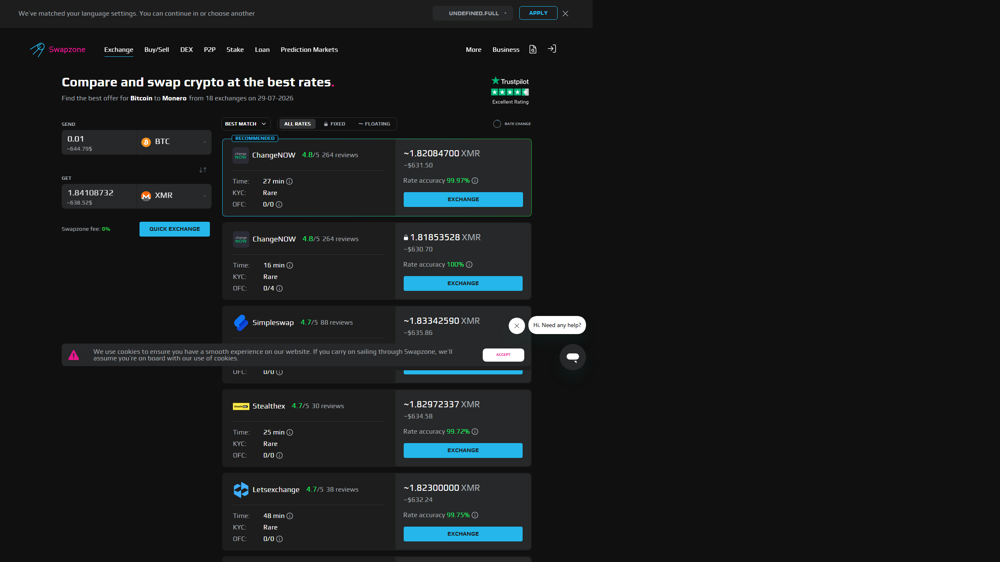

---
title: "Crypto Exchange Aggregator vs Regular Exchange: Which One Should You Use?"
slug: /exchanges/crypto-exchange-aggregator-vs-regular-exchange
meta_title: "Crypto Exchange Aggregator vs Regular Exchange (2026)"
meta_description: "Aggregator or exchange — which gets you a better rate? Rate comparison, KYC, custody, and fiat support differences broken down with a plain-language verdict."
primary_keyword: crypto aggregator vs exchange
schema: Article
category: Exchanges
last_reviewed: 2026-07-29
---

# Crypto Exchange Aggregator vs Regular Exchange: Which One Should You Use?

The problem with picking a single exchange is rate lock-in. You get one price, with no way to know if it is competitive. A crypto exchange aggregator solves that specific problem by querying dozens of providers in one shot, but it is a different tool with different strengths, not a straight replacement for an exchange.

The short answer: use a regular exchange when you need to move money from a bank account or trade with complex orders. Use an aggregator when you are swapping crypto-to-crypto and want the best available rate without creating another account.

**Live Screenshot — Swapzone BTC to ETH Query vs Single Exchange (July 2026)**
File: `../media/live-swapzone-btc-eth-query.png`
Alt text: `Swapzone BTC to ETH query showing multiple provider rates simultaneously, July 2026`
Caption: `Swapzone BTC to ETH query reviewed in July 2026 — competing provider rates shown simultaneously, the core advantage over going direct to a single exchange.`

*Swapzone BTC to ETH query, July 2026.*

**Live Screenshot — Swapzone BTC to ETH Query vs Single Exchange (July 2026)**
File: `../media/live-swapzone-btc-eth-query.png`
Alt text: `Swapzone BTC to ETH query showing multiple provider rates simultaneously, July 2026`
Caption: `Swapzone BTC to ETH query reviewed in July 2026 — competing provider rates shown simultaneously, the core advantage over going direct to a single exchange.`

*Swapzone BTC to ETH query, July 2026.*

## Quick Comparison: Aggregator vs Single Exchange

| Feature | Crypto Aggregator | Single Exchange |
|---|---|---|
| Rate source | Queries 10-30+ providers simultaneously | Internal order book only |
| Registration required | No (most aggregators) | Yes (almost always) |
| Custody | Non-custodial (you control keys) | Custodial (exchange holds funds) |
| Fiat on-ramp | Limited or none | Yes (major CEXs) |
| Fiat off-ramp | Limited or none | Yes (major CEXs) |
| Advanced orders | No | Yes (limit, stop, margin) |
| Tax reporting | No built-in history | Trade history export |
| KYC requirement | None to low | Mandatory in regulated markets |
| Speed | 5-40 min (blockchain dependent) | Near-instant (internal ledger) |
| Best for | Crypto-to-crypto rate shopping | Fiat in/out, active trading |

The table tells most of the story. These are not competing tools. They serve different steps in a user's workflow.

Compare live crypto-to-crypto rates with no registration on [Swapzone](https://swapzone.io/).

---

## When an Aggregator Wins

**Rate shopping for crypto-to-crypto swaps.** On a $5,000 BTC-to-ETH swap, a 1.5% rate difference is $75. Aggregators pull live quotes from 10 to 30+ providers simultaneously. The best quote on any single provider could easily be 0.5-2% worse than what an aggregator surfaces, because you are comparing against a broad market rather than one price feed. Over multiple swaps a year, this compounds quickly.

**You do not want to create an account.** Aggregators like Swapzone process swaps without registration. You provide a destination wallet address, select a rate, and send. No email, no password, no identity verification, no waiting for account approval. For users who have already been through KYC once on an exchange for fiat, adding another account just for a crypto-to-crypto swap adds friction with no benefit.

**Privacy is a consideration.** Custodial exchanges hold your funds and log your swap history under KYC rules in most jurisdictions. With an aggregator routing through non-custodial partners, the swap happens wallet-to-wallet. The provider processes the transaction but you do not build a profile on a centralized platform. Your swap history is on-chain, not in someone's database.

**Rate transparency before committing.** Aggregators show you the full quoted rate, estimated receive amount, and provider fee before you confirm anything. On a single exchange, you see the current market price, but spread and taker fees are sometimes separate line items. Aggregators consolidate this into a single "you send X, you receive Y" display.

**Mid-range amounts, roughly $200 to $50,000.** Below $200, fixed fees per swap can eat into the rate advantage. Above $50,000, OTC desks on major exchanges often offer better pricing than any retail-facing aggregator. The aggregator sweet spot is the middle range where retail rates are meaningful but OTC is not yet warranted.

**Coin variety.** Swapzone covers 1,600+ coins across its 18+ partner providers. A single exchange might list 200-400 coins. If you want to swap into a less mainstream asset, an aggregator is more likely to find a live rate.

---

## When a Regular Exchange Wins

**You need to buy crypto with fiat.** Purchasing BTC or ETH with USD, EUR, GBP, or other fiat currencies requires a regulated on-ramp. Most aggregators do not support direct bank transfers or card purchases without routing through a third-party payment processor that adds 2-4% on top. Exchanges like Coinbase, Kraken, or Bitstamp are purpose-built for bank-to-crypto conversion and typically charge 0.5-2% on card purchases.

**You need to convert crypto back to fiat.** Cashing out to a bank account means using an exchange with a linked bank or a regulated off-ramp. Aggregators are crypto-in, crypto-out tools. They cannot send USD to your bank.

**You trade actively.** Limit orders, stop-losses, OCO orders, margin positions, and futures contracts are all exchange-native products. Aggregators are single-swap tools. If your workflow involves placing bids below market, managing a leveraged position, or using advanced order types, you need an exchange with a proper order book.

**Tax reporting is a priority.** Centralized exchanges export full trade histories in CSV formats accepted by Koinly, TaxBit, CoinTracker, and similar software. Aggregators do not maintain a history of your swaps. You would need to track transactions manually using blockchain explorers and compute cost basis yourself. For high-volume traders or users in jurisdictions with strict crypto tax reporting, the exchange's built-in reporting is worth the trade-off on its own.

**Speed within a trading session matters.** Internal ledger trades on major exchanges execute in milliseconds. Aggregator-routed swaps depend on blockchain confirmations: 2-3 minutes on fast chains, 10-30 minutes on BTC legs. If you are timing entries and exits during active market moves, exchange execution is faster.

**You want margin or lending.** Borrowing against crypto holdings or using margin is not available through aggregators. This is an exchange-only feature on centralized platforms.

---

## The Hybrid Workflow: Exchange for Fiat In, Aggregator for Crypto-to-Crypto

Most experienced users do not choose one or the other. They use each tool for what it does best.

**Step 1: Fiat in via exchange.** Buy BTC or ETH on a regulated exchange using your bank account or card. This is the step that requires KYC and account registration. Do it once, with one exchange.

**Step 2: Withdraw to your own wallet.** Move the crypto off the exchange to a wallet you control. This removes custodial risk from the exchange. Your assets are no longer in someone else's custody.

**Step 3: Swap crypto-to-crypto via aggregator.** When you want to move into altcoins, privacy coins, DeFi tokens, or any other asset, run the swap through an aggregator. No second account, no second KYC, best available rate.

This workflow minimizes KYC exposure while maintaining access to fiat on-ramps. You register once with one exchange for the fiat leg. Every subsequent crypto-to-crypto swap is wallet-to-wallet through the aggregator, with full rate transparency.

[Swapzone](https://swapzone.io/) fits into step three. It queries 18+ partner exchanges simultaneously, shows you the best rate for the pair including both fixed and floating rate options, and routes the swap through the selected provider non-custodially. You do not need a Swapzone account. You paste your destination address, confirm the rate you want, and send. The aggregator handles the provider selection and routing.

For portfolio rebalancing, moving from BTC into ETH, or swapping into a privacy coin like XMR, the aggregator step consistently outperforms going directly to a single provider.

Compare live crypto-to-crypto rates before your next swap on [Swapzone](https://swapzone.io/).

---

## Ranking Scorecard: Aggregator vs Exchange by Use Case

| Use Case | Aggregator Score (out of 10) | Exchange Score (out of 10) |

*One Swapzone query surfaces rates from multiple providers simultaneously. A direct exchange shows only its own rate.*

|---|---|---|
| Best crypto-to-crypto rate | 9 | 5 |
| Fiat on-ramp | 2 | 10 |
| Fiat off-ramp | 1 | 10 |
| No-registration swap | 10 | 1 |
| Coin variety | 8 | 5 |
| Active trading tools | 0 | 10 |
| Tax reporting | 2 | 9 |
| Privacy preservation | 9 | 3 |
| Speed (immediate trade) | 4 | 10 |
| Custody control | 10 | 2 |

The scores confirm the argument: these are complementary tools. An aggregator scores 0 on active trading. An exchange scores 1 on no-registration access. Build your workflow around both.

---

## What We Checked

- Swapzone partner count and supported coins verified via site: 18+ partners, 1,600+ coins
- KYC policies for [ChangeNOW](https://changenow.io/), [StealthEX](https://stealthex.io/), [SimpleSwap](https://simpleswap.io/), and [Exolix](https://exolix.com/) checked via terms and community reports
- Fiat on-ramp availability across aggregators confirmed: none offer direct bank transfer without third-party processor
- Rate spread methodology: aggregator vs single exchange documented in third-party swap comparisons
- Tax reporting exports verified on Coinbase, Kraken, and Binance official help pages
- Custody model for aggregator-routed swaps: non-custodial confirmed for Swapzone routing
- Card purchase fees on major exchanges: 1.5-3.99% range confirmed via published fee schedules

---

## FAQ

**Is a crypto aggregator the same as a DEX aggregator?**
No. A crypto swap aggregator like Swapzone queries centralized and semi-centralized swap providers. A DEX aggregator like 1inch routes trades across decentralized liquidity pools on a single blockchain. Different infrastructure, same core idea of rate optimization across multiple sources.

**Do aggregators charge extra fees?**
Most aggregators earn by taking a small share of the provider's margin rather than adding a visible fee. The rate you see is what you get. Swapzone shows the provider's rate directly so you can compare with no-aggregator alternatives if you want to verify.

**Can I use an aggregator to buy crypto with a credit card?**
Generally no. Card purchases require a payment processor and KYC compliance. A few aggregators offer third-party card integrations, but the fees are high (3-5%). Use an exchange for card purchases.

**What happens if a swap fails mid-route?**
Non-custodial aggregators route funds through the partner exchange. If a swap fails, the partner's refund policy applies. Swapzone's support can assist if the selected provider does not refund automatically. Reputable providers return funds to the sending wallet for failed swaps.

**Is it cheaper to swap on a CEX if I already have an account?**
Sometimes, for high-volume pairs with low maker fees. CEX maker fees can be 0.1%. But the CEX price is one data point. An aggregator might find a provider with a 0.3% fee but a 1% better underlying rate, making it cheaper net. Always check before committing.

**What is rate lock-in in practice?**
If you send BTC to Binance and swap to ETH, you get Binance's ETH/BTC price at execution. You have no visibility into whether Kraken's or ChangeNOW's rate was better at that moment. Rate lock-in means accepting one provider's quote without comparison.

**Does using an aggregator affect tax reporting?**
Using an aggregator does not change your tax obligations. What changes is the reporting workflow. You need to track swap history yourself from blockchain transactions. If this is cumbersome, keeping some swaps on a CEX with built-in export is a reasonable trade-off.

---

*Related reading: [How Swapzone works as an aggregator](/exchanges/swapzone-review-crypto-exchange-aggregator) | [Best instant crypto swap no registration](/exchanges/best-instant-crypto-swap-no-registration)*
