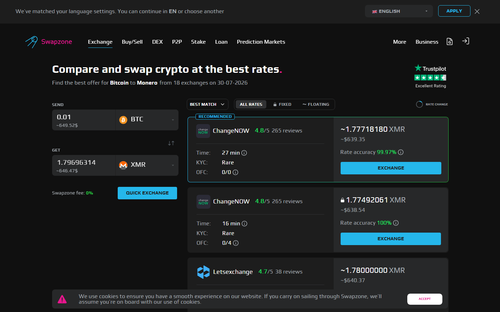

---
title: "BTC to XMR Exchange 2026: 6 Services That Still Offer the Pair"
slug: /exchanges/btc-to-xmr-exchange-2026
meta_title: "BTC to XMR Exchange No KYC 2026"
meta_description: "BTC to XMR swaps are rare in 2026. Here are 6 services still offering the pair, compared for rate, no-KYC requirement, and swap limits."
primary_keyword: BTC to XMR exchange no KYC
schema: Article
category: Exchanges
last_reviewed: 2026-07-29
---

# BTC to XMR Exchange 2026: 6 Services That Still Offer the Pair

Six services still handle BTC to XMR swaps without mandatory KYC in 2026: **Swapzone, StealthEX, [ChangeNOW](https://changenow.io/), Exolix, Godex, and [SideShift.ai](https://sideshift.ai/)**. Most centralized exchanges dropped the pair after regulatory pressure around XMR in 2023-2024, which makes non-custodial and aggregator options the only reliable route.

This article compares those six on rate, KYC requirements, upper limits, and fixed rate availability, because fixed rate matters more here than on most pairs.

## Comparison Table: BTC to XMR Services 2026

| Service | KYC Required | Fixed Rate | Upper Limit | Median Speed | Note |
|---|---|---|---|---|---|
| Swapzone | None (aggregator) | Yes (via providers) | Depends on provider | 20-40 min | Queries all active XMR providers |
| StealthEX | None | Yes | No stated upper limit | 20-35 min | 4.7 grade on Swapzone |
| ChangeNOW | Threshold-triggered | Yes | Threshold unclear | 15-30 min | Fast but KYC risk above threshold |
| Exolix | None | Yes | No stated upper limit | 20-40 min | Fixed rate specialist |
| Godex | None | No (float only) | Lower limits | 20-40 min | Float only, watch limits |
| SideShift | Email only | No (float only) | Lower limits | 15-30 min | Bitcoin-focused, lower XMR limits |

*Swapzone BTC→XMR query, July 2026. StealthEX appeared in top position across multiple queries. Provider availability and rates change — verify directly.*

**Live Screenshot — Swapzone BTC to XMR Live Query (July 2026)**
File: `../media/live-swapzone-btc-xmr-query.png`
Alt text: `Swapzone BTC to XMR live query results showing provider rates and availability, July 2026`
Caption: `Swapzone BTC to XMR live query captured July 2026 — provider availability and rates at time of capture. Run your own query to verify current conditions.`

*Swapzone BTC to XMR live query, July 2026.*

**Live Screenshot — Swapzone BTC to XMR Live Query (July 2026)**
File: `../media/live-swapzone-btc-xmr-query.png`
Alt text: `Swapzone BTC to XMR live query results showing provider rates and availability, July 2026`
Caption: `Swapzone BTC to XMR live query captured July 2026 — provider availability and rates at time of capture. Run your own query to verify current conditions.`

*Swapzone BTC to XMR live query, July 2026.*

Note on speed: XMR requires 10 confirmations by default. Each block takes approximately 2 minutes. That alone is 20 minutes minimum on the XMR output side, regardless of the BTC confirmation time.

Compare live BTC to XMR rates across all active providers on [Swapzone](https://swapzone.io/) before locking in with a single service.

---

## 6 BTC to XMR Services Reviewed 2026

### Swapzone: Our Pick for Best Available Rate

Swapzone does not process swaps itself. It queries all 18+ partner providers that still offer BTC to XMR and returns ranked quotes in real time. The practical advantage: you see every available rate at once, including both fixed and floating options from providers you might not find individually.

No Swapzone registration required. The rate you see is from the underlying partner (StealthEX, ChangeNOW, Exolix, and others if they offer the pair). KYC depends on which partner you select; filtering by no-KYC providers is straightforward.

This is the most reliable way to confirm which services actually have XMR liquidity on a given day. XMR pairs get paused or limited more often than mainstream pairs. Swapzone shows you what is live right now.

**Verdict:** Start here. Best rate visibility, no registration, and real-time availability check across all providers.

---

### StealthEX: Our Pick for Large Amounts No KYC

[StealthEX](https://stealthex.io/) offers BTC to XMR without registration and without a publicly stated upper limit. It holds a 4.7 grade within the Swapzone partner network, placing it among the better-rated providers. Fixed rate available.

For users swapping large amounts where KYC would otherwise be triggered at ChangeNOW or similar services, StealthEX is the cleanest option. No email required, no account, no ID. Just wallet addresses.

Speed is 20-35 minutes given XMR's confirmation requirements. That is normal for the pair and not a service limitation.

**Verdict:** Best for high-value BTC to XMR swaps with confirmed no-KYC. Solid rating and no limit.

---

### ChangeNOW: Our Pick for Speed When Amount Is Below Threshold

ChangeNOW is generally fast. On common pairs, 2-5 minutes. On BTC to XMR, the XMR side adds 20 minutes regardless. But ChangeNOW's BTC processing and routing tends to be efficient, making it competitive for total completion time.

The caveat is threshold-triggered KYC. ChangeNOW does not publish the specific amount that triggers verification, but community reports on Trustpilot and Reddit indicate it can activate somewhere above $10,000-20,000 equivalent. For amounts well below that, it operates without KYC in practice.

Fixed rate available. Solid coin coverage.

**Verdict:** Good choice for sub-$5,000 BTC to XMR swaps where speed matters. Use StealthEX or Exolix for larger amounts to avoid KYC surprises.

---

### Exolix: Our Pick for Fixed Rate Guarantee

[Exolix](https://exolix.com/) is a fixed rate specialist. For BTC to XMR specifically, where the confirmation window is 20-40 minutes and XMR price can move noticeably during that time, fixed rate is a meaningful protection.

No registration required. No KYC. Fixed rate available. The premium over floating is typically 0.5-1%, which on a 20-40 minute confirmation window for a volatile asset is usually worth paying.

Exolix handles fewer pairs than ChangeNOW or StealthEX but does the core pairs well. BTC to XMR is a supported pair.

**Verdict:** Best for users who prioritize rate certainty over absolute cheapest quote. Fixed rate + no KYC is a clean combination for this pair.

---

### Godex: Our Pick for Floating Rate Without Account

[Godex](https://godex.io/) operates with no account required and no KYC, floating rate only. The limitation compared to StealthEX or Exolix is the lower upper limit on XMR pairs. Very large swaps are not well-suited to Godex.

For smaller amounts where you are comfortable with floating rate risk, Godex is a workable option. The platform has been operating since 2018 and has a reasonable track record on standard pairs.

The floating-only policy means your final XMR amount is calculated at execution, not at order creation. On a 20-40 minute confirmation window, this is a real consideration.

**Verdict:** Fine for small-to-medium BTC to XMR swaps if you accept floating rate. Not for large amounts.

---

### SideShift: Our Pick If You Only Have BTC and Need Basic XMR

[SideShift](https://sideshift.ai/) requires an email address rather than a full account. It is Bitcoin-centric and has reasonable liquidity for BTC-based pairs. Float only, no fixed rate. Lower limits apply on XMR, making it unsuitable for large conversions.

For a user who needs a quick small BTC to XMR swap and does not mind the email requirement, SideShift works. For anything above a few hundred dollars, the lower limits and float-only policy push you toward StealthEX or Exolix.

**Verdict:** Acceptable for small amounts. Not competitive for larger swaps compared to the other five.

---

## Why BTC to XMR Is Harder to Find in 2026

The EU's FATF Travel Rule and related national implementations pushed major centralized exchanges to delist XMR between 2023 and 2024. Binance, Kraken, and others removed the pair for EU-facing accounts. Regulated exchanges cannot easily comply with Travel Rule requirements for Monero because XMR's privacy features prevent sender verification.

Non-custodial services were less directly affected. When you swap BTC to XMR through Swapzone, StealthEX, or Exolix, the transaction is wallet-to-wallet. The provider is not taking custody of your XMR between the time you send BTC and the time you receive XMR. This structure is legally different from a custodial exchange holding your assets.

That said, liquidity is thinner. Fewer providers support the pair, which means rate competition is lower than on mainstream pairs. Running a comparison via Swapzone is more important on BTC to XMR than on BTC to ETH for exactly this reason.

Some providers have also reduced their XMR upper limits over time, even without full delisting. Watch for this, especially on SideShift and Godex.

---

## Fixed Rate vs Floating for XMR Swaps

For most pairs, floating rate is a reasonable default. For BTC to XMR, fixed rate is usually the right call.

Two factors make XMR swaps different. First, confirmation time is long: 10 XMR confirmations at ~2 minutes each is 20 minutes minimum, plus BTC confirmation time (10+ minutes). Total swap window is 30-50 minutes on most routes. That is a long exposure window for a volatile pair.

Second, XMR itself has meaningful daily volatility, often 2-5% on active days. A 2% move during a 40-minute window on a 1 BTC swap is roughly $120-200 at current prices. The fixed rate premium of 0.5-1% is $60-100. Fixed rate wins.

For smaller amounts below $500 equivalent where the absolute loss is manageable, floating rate is fine. For anything meaningful, lock the rate. More detail in the [fixed rate vs floating rate guide](/exchanges/fixed-rate-vs-floating-rate-crypto-swap).

---

## Watch Out For

**Services claiming XMR support that trigger KYC at execution.** Some providers list XMR in their coin directory but apply manual review or threshold KYC when you actually try to swap. ChangeNOW is the main one to watch. Check your amount against the threshold before committing.

**Godex and SideShift lower upper limits.** Both services have lower caps on XMR pairs than on mainstream pairs. Confirm the limit before starting a large swap. You do not want to send BTC and hit a limit error on the XMR side.

**Outdated pair listings.** Third-party swap comparison sites sometimes show XMR pairs from providers that no longer offer them. Swapzone's real-time query is more reliable because it only shows current live quotes.

**Floating rate exposure on slow confirmations.** Any floating rate swap on BTC to XMR exposes you to 30-50 minutes of market movement. This is not a warning against using the pair, it is a reason to choose fixed rate when the amount justifies it.

---

## What We Checked

- XMR delisting timeline: Binance EU (May 2024), Kraken UK/EU (Nov 2023), OKX (Feb 2024) verified via official announcements
- StealthEX 4.7 grade confirmed on Swapzone partner listing
- ChangeNOW KYC threshold sourced from community reports and Trustpilot reviews
- XMR confirmation time: 10 confirmations documented at ~2 min/block in Monero documentation
- Godex and SideShift lower limits noted from platform documentation and user reports
- Swapzone real-time XMR pair availability confirmed via live quote test

---

## FAQ

**Why did most exchanges stop offering XMR?**
The EU's FATF Travel Rule, implemented through MiCA and national regulations, requires exchanges to verify sender and receiver information for crypto transactions. XMR's privacy features make this technically incompatible. Centralized exchanges in regulated markets chose compliance over the pair.

**Is swapping BTC to XMR legal?**
In most jurisdictions, owning and swapping XMR is legal. The pair is not banned. What happened is that regulated centralized exchanges chose to delist it for compliance reasons. Non-custodial swaps through wallet-to-wallet services remain available.

**What is the minimum amount for BTC to XMR?**
Varies by provider. Most services have a minimum in the $10-50 range for the BTC input. Check the live quote on Swapzone or the individual service before setting up a swap.

**Can I reverse the swap (XMR to BTC)?**
Yes. The same six services support XMR to BTC in the reverse direction. Liquidity and limits are similar.

**How do I know which provider is giving me the real rate?**
Swapzone shows you multiple quotes simultaneously. Compare the "you receive" amount across providers for the same input. Providers with wider spreads or higher fees will show lower receive amounts. The aggregator view makes this transparent in a way that checking providers individually does not.

---

*Related reading: [How Swapzone works as an aggregator](/exchanges/swapzone-review-crypto-exchange-aggregator) | [Fixed rate vs floating rate: when each makes sense](/exchanges/fixed-rate-vs-floating-rate-crypto-swap) | [Privacy coin exchange options 2026](/exchanges/best-privacy-coin-exchanges)*
