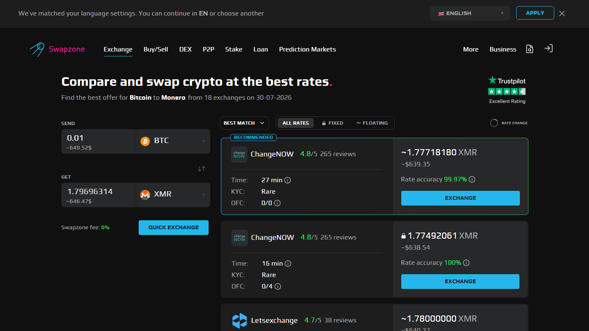
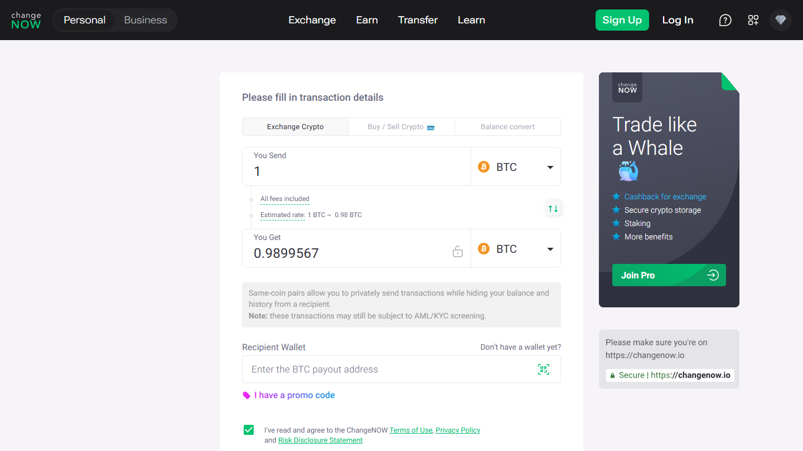

---
title: "[USDT](https://tether.to/) to BTC Best Rate 2026: 5 Swap Services Compared"
slug: /exchanges/usdt-to-btc-best-rate-2026
meta_title: "USDT to BTC Best Rate 2026"
meta_description: "Convert USDT to BTC at the best rate in 2026. 6 swap services compared for speed, rate type, no-KYC access, and aggregator vs single-provider price."
primary_keyword: USDT to BTC best rate
schema: Article
category: Exchanges
last_reviewed: 2026-07-29
---

# USDT to BTC Best Rate 2026: 5 Swap Services Compared

USDT to BTC rate varies by service more than you would expect. Five services consistently deliver this pair without registration and with competitive rates in 2026: **Swapzone, [ChangeNOW](https://changenow.io/), [SimpleSwap](https://simpleswap.io/), [StealthEX](https://stealthex.io/), and [Changelly](https://changelly.com/)**. The gap between best and worst quote on the same amount can be 0.5-1.5%, which on a $5,000 swap is $25-75 real difference.

There is a second factor most guides skip: USDT network choice. ERC20, TRC20, and BEP20 USDT carry different gas costs, and that difference affects your effective rate before you even compare providers.

**Live Screenshot (July 2026)**
File: `../media/live-swapzone-usdt-btc-query.png`
Alt text: `Swapzone USDT to BTC live query July 2026`
Caption: `Swapzone USDT to BTC query reviewed July 2026 , multiple provider rates shown simultaneously for spread comparison.`

*Swapzone USDT to BTC query reviewed July 2026 , multiple provider rates shown simultaneously for spread comparison.*

## Comparison Table: 5 USDT to BTC Services

| Service | USDT Networks | Rate Type | KYC | Speed | Note |
|---|---|---|---|---|---|
| ChangeNOW | ERC20, TRC20, BEP20 | Fixed + Float | Threshold | 5-20 min | Fast, KYC threshold risk |

*Swapzone USDT→BTC results, July 2026. Top provider and rate vary by time and amount , check live before swapping.*

| SimpleSwap | ERC20, TRC20, BEP20 | Fixed + Float | None | 10-20 min | Consistent, clean UI |
| StealthEX | ERC20, TRC20, BEP20 | Fixed + Float | None | 10-25 min | No upper limit, no KYC |
| Changelly | ERC20, TRC20 | Fixed + Float | Sometimes | 10-30 min | May request KYC on large amounts |

Swapzone supports TRC20, ERC20, and BEP20 USDT. Filter by network and rate type, then compare all providers at once on [Swapzone](https://swapzone.io/).

---

## 5 USDT to BTC Services Reviewed

### Swapzone: Multi-Provider Rate Comparison for USDT to BTC

Swapzone queries all 18+ partners simultaneously for the USDT to BTC pair. For one of the most common swap pairs in crypto, this means 10+ live quotes at once. The spread between the top and bottom quote is usually 0.5-1.2%. Over multiple swaps, that adds up.

No registration. All three USDT networks supported (ERC20, TRC20, BEP20). Fixed and floating rate options displayed side by side for each provider. You see the full picture before committing to any one service.

Speed depends on the underlying provider you select. Most USDT to BTC routes complete in 10-30 minutes, dominated by BTC's confirmation time. USDT processing on fast networks (TRC20, BEP20) typically adds under 2 minutes.

**Verdict:** Best starting point for this pair. The rate comparison alone is worth the extra 60 seconds.

**What users say**

**Positive**
> "Support helped me with failed swap (because I sent small amount of Litecoin). After 1,5 hours I got my Monero (XMR). I recommend this platform."
>
> , Marcin, [Trustpilot](https://www.trustpilot.com/reviews/6a591e93a253790283802d7a)

**Critical**
> "I cannot recommend Swapzone as long as n.exchange is used as one of its CEX partners for swap execution. Transactions routed through n.exchange can become subject to lengthy AML/compliance reviews."
>
> , Omer Onat, [Trustpilot](https://www.trustpilot.com/reviews/6a6f80f806aa7388e54514b5)

> **Coinwy Editorial , My take:** Marcin's 1.5-hour Monero result tells you more about XMR confirmation times than about Swapzone. For USDT to BTC , a mainstream pair with 10+ live quotes , the aggregator step genuinely earns its keep. Omer's n.exchange complaint is partner-specific; for USDT/BTC you have enough other providers to avoid it entirely.

---

### ChangeNOW: Our Pick for Speed on Common Amounts

*ChangeNOW USDT to BTC reviewed July 2026.*

ChangeNOW is the fastest option on common pairs. USDT to BTC typically completes in 10-20 minutes, which is competitive given BTC's 10-minute block time. The service handles high volume on this pair and rate quotes are consistently in the top tier.

Threshold-triggered KYC is the main caveat. For standard amounts (most users are below $10,000), ChangeNOW operates without KYC in practice. For larger swaps, the threshold is unclear and KYC can activate without prior warning.

All three USDT networks supported. Fixed and floating rate available.

**Verdict:** Best for speed on standard amounts. Keep amounts below $5,000 if no-KYC is a priority.

---

**What users say**

**Positive**
> "I did not received the swap from USDC (Base Chain) to USDT (BNB chain). Im very frustrated. Updated: I traced it and waiting for the refund. Thanks ChangeNOW for the clarification."
>
> , RT, [Trustpilot](https://www.trustpilot.com/reviews/6a77ac36337348b14a51f5df) (, 2026-08)

**Critical**
> "My raven coin still hasn't been sent to my wallet. The transaction says complete, but my wallet is zero. I need to recover this is a lot of money z"
>
> , Star seed galaxy, [Trustpilot](https://www.trustpilot.com/reviews/6a7a77fbc0cd6157248b48b2) (, 2026-08)

### SimpleSwap: Our Pick for Consistent No-KYC Experience

SimpleSwap does not ask for registration or ID at standard amounts. The platform is straightforward and has maintained consistent service on major pairs since 2018. USDT to BTC is a core pair with good liquidity.

Rate is competitive but not always the best single quote. SimpleSwap does not aggregate across providers, so you get their best rate, which may not be the market best. Check via Swapzone first if the rate matters more than simplicity.

Fixed and floating rate both available. All three USDT networks supported. Speed is 10-20 minutes.

**Verdict:** Good default if you want a reliable no-KYC option without rate shopping. Run the Swapzone comparison first.

---

**What users say**

**Positive**
> "I've found them to be very trustworthy. I made a mistake with a transaction and their service team were very responsive and did get my refunded sorted. It took a bit of time but I do understand they are busy people. The most important thing is, the money was safe and returned."
>
> , Jeff Love, [Trustpilot](https://www.trustpilot.com/reviews/6a763f7b4f1dae8cb071ed43) (, 2026-08)

**Critical**
> "SimpleSwap took my funds, delayed for days, and never delivered my coins. Only after taking my money did they demand a surprise KYC verification to hold my crypto hostage. Support offered zero help, hiding behind robotic responses and fake technical issues."
>
> , Mahmoud, [Trustpilot](https://www.trustpilot.com/reviews/6a76c53360be275f4bc80750) (, 2026-08)

### StealthEX: Our Pick for Large Amounts

StealthEX has no publicly stated upper limit and no KYC requirement. For large USDT to BTC swaps, this combination is valuable. The 4.7 grade on Swapzone's partner system reflects consistent service quality.

Speed is 10-25 minutes. All three USDT networks supported. Fixed and floating rate available. The UI is clean and the swap process is standard: select coins, amount, paste BTC address, confirm, send USDT.

**Verdict:** Best for larger amounts ($20,000+) where confirmed no-KYC matters. Rate is competitive, not always market-best.

---

**What users say**

**Positive**
> "I had a swap from 5k usdt to eth. Apparently my risk level was too high for their liking, so they rejected my transfer and refunded me. I am giving 5 stars because at the same time they could have frozen my 5k and i would have to go through a rollercoaster to get it back and they were very honest. would recommend them"
>
> , Tyler Boss, [Trustpilot](https://www.trustpilot.com/reviews/69769d8d67cca1053666b2c2) (, 2026-01)

**Critical**
> "The first time I used it, swapping a was easy. But after sending more, they locked my funds and asked for ID verification. I verified and now they are asking endless questions about where the money came from. My funds are still locked, will update when I know more. That funds would have given me a bigger boost on #GoIdbIoom # Iaboratories..."
>
> , Salvatore, [Trustpilot](https://www.trustpilot.com/reviews/69aadb82786a5236e3380bf5) (, 2026-03)

### Changelly: Our Pick for Fiat-Adjacent Flexibility

Changelly has been in the market since 2015 and handles USDT to BTC well. It offers both ERC20 and TRC20 USDT. Fiat on-ramp is available for users who also need to buy crypto with a card, which makes Changelly useful in a workflow where you buy USDT with fiat and then convert.

The caveat: Changelly sometimes requests KYC on larger transactions or in certain jurisdictions. The policy is not entirely predictable. For users who specifically need no-KYC guarantees, StealthEX or SimpleSwap are safer.

Fixed and floating rate available. Speed is 10-30 minutes.

**Verdict:** Good option if you are in a Changelly-integrated workflow or need their card purchase feature. Not the cleanest no-KYC option for large amounts.

---

## USDT Network Choice Matters More Than Most Guides Say

Before comparing providers, choose your USDT network. The gas cost on the send side affects your effective rate, and the difference is significant.

**ERC20 USDT (Ethereum mainnet):** Gas fees range from $5-15 under normal conditions and can spike to $30-50+ during Ethereum congestion. On a $500 USDT swap, a $15 gas fee is a 3% cost before the provider takes anything.

**TRC20 USDT (TRON network):** Fees are consistently under $1, often under $0.10. For most USDT to BTC swaps, TRC20 is the best network choice on gas cost alone.

**BEP20 USDT (BNB Smart Chain):** Fees are typically $0.20-1.00. Middle ground between ERC20 and TRC20.

The practical move: use TRC20 USDT when your provider supports it. All five services in this article support TRC20. The gas savings offset any minor rate difference between services on smaller swap amounts.

When a service does not support TRC20, the ERC20 gas cost becomes a hidden cost that should factor into your "best rate" calculation. A service quoting 0.3% better rate while requiring ERC20 USDT may net less than a service with a slightly lower quote but TRC20 support.

---

## Fixed vs Floating for USDT to BTC

USDT is a stablecoin pegged to $1. It does not move. The only rate risk in a USDT to BTC swap is on the BTC side.

For most standard swaps, floating rate is fine. BTC confirmation takes 10-30 minutes, and on a typical day BTC price movement during that window is under 0.5%. The floating rate quoted is very close to what you receive.

The case for fixed rate: when BTC is moving fast. During sharp BTC price action (hourly moves of 2%+), a 30-minute confirmation window at floating rate can land meaningfully below the quoted amount. Fixed rate eliminates that risk. The premium is typically 0.5-1%, which is worth paying when BTC is volatile.

Quick rule: BTC daily range under 2%, use floating. BTC daily range above 3%, use fixed. For a full breakdown of when each rate type makes sense, see the [fixed rate vs floating rate guide](/exchanges/fixed-rate-vs-floating-rate-crypto-swap).

---

## What We Checked

- USDT network support confirmed per service documentation (ERC20, TRC20, BEP20)
- ERC20 gas fee ranges sourced from Etherscan Gas Tracker historical data
- TRC20 fee structure confirmed via TRON network documentation
- ChangeNOW KYC threshold sourced from community reports
- Changelly KYC behavior sourced from Trustpilot reviews and Reddit r/CryptoCurrency
- StealthEX 4.7 grade confirmed on Swapzone partner directory
- Rate spread data based on USDT to BTC quote comparisons run on Swapzone

---

## What users actually say

Real swap feedback from users who moved USDT and stablecoin pairs through Swapzone.

> "I recommend using swapzone I exchange my LTC to USDT it only took around 5 minutes to complete I was not expecting it to be that fast but I really recommend using it to swap your cryptocurrency!" , [Mbengi Daudi](https://www.trustpilot.com/reviews/684d82967336371472efc2b4) (, 2025-06)

> "Awesome, as other exchange bridges charges so much amount but Swapzone is just amazing, with very minimal charges it swapped and convert my USDT from BNB exchange to USDT ERC20. Just Love it." , [muzzemmil](https://www.trustpilot.com/reviews/66c4e36dafe8e003c133eaf7) (, 2024-08)

> "Really great an experience I did a small test run and then did a large swap the second time and everything went very smoothly!!" , [Brandon Conroy](https://www.trustpilot.com/reviews/686bda06d3a2497ebf0163df) (, 2025-07)

*Based on 460 verified Trustpilot reviews. [See all Swapzone reviews on Trustpilot →](https://www.trustpilot.com/review/swapzone.io)*

**What Reddit says**

Threads on [r/CryptoCurrency](https://www.reddit.com/r/CryptoCurrency/search/?q=USDT+BTC+exchange&sort=top) about USDT-to-BTC swaps typically focus on one question: custodial or non-custodial. The consensus for amounts above a few hundred dollars is to use a non-custodial swap service or aggregator rather than a CEX, to avoid triggering KYC on the receiving side. Rate comparison is mentioned as the second concern.

> **Coinwy Editorial Team , My take:** muzzemmil's "minimal charges" for USDT network bridging is the key insight on USDT pairs: the network you send from changes the effective cost more than any provider rate margin does. A $10 ERC20 gas fee on a $300 swap is a 3.3% hidden cost before the first provider margin is applied. Brandon's "small test run first" approach is solid practice , the friction of a second swap is worth the confidence it buys.

## FAQ

**Which USDT network should I use for BTC swaps?**
TRC20 in almost all cases. Gas is under $1, all major services support it, and the send cost is negligible compared to ERC20. Only use ERC20 if a specific service requires it.

**Does the USDT network affect how much BTC I receive?**
Not directly from the provider's rate. But the gas cost you pay to send USDT reduces your effective gain. A $10 ERC20 gas fee on a $300 swap is a 3.3% hidden cost. TRC20 eliminates most of that.

**Can I convert USDT to BTC without KYC at any amount?**
For standard amounts (under $10,000), yes. StealthEX handles larger amounts without KYC with no stated upper limit. ChangeNOW has an unspecified threshold. SimpleSwap is generally KYC-free for standard amounts.

**How do I find the best USDT to BTC rate right now?**
Run the pair on Swapzone. It queries all active providers simultaneously and ranks by receive amount. The best rate changes throughout the day based on provider liquidity and market conditions.

**Is Changelly safe?**
Changelly has operated since 2015 and has processed millions of swaps. It is reliable. The KYC unpredictability is the main issue, not the service's trustworthiness.

**What is the minimum USDT for a BTC swap?**
Typically $10-20 equivalent depending on the service. At very small amounts, minimum transaction sizes and fixed network fees make the swap uneconomical.

---

*Related reading: [How Swapzone works as an aggregator](/exchanges/swapzone-review-crypto-exchange-aggregator) | [Fixed rate vs floating rate: which costs less](/exchanges/fixed-rate-vs-floating-rate-crypto-swap)*

