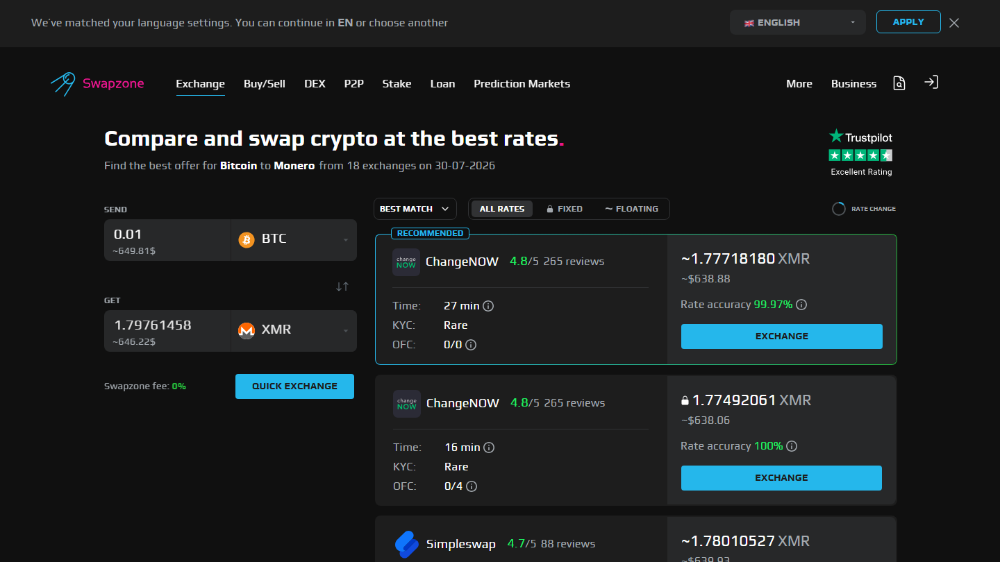
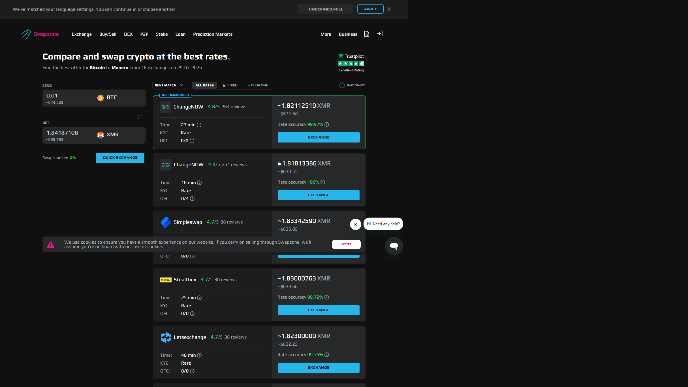
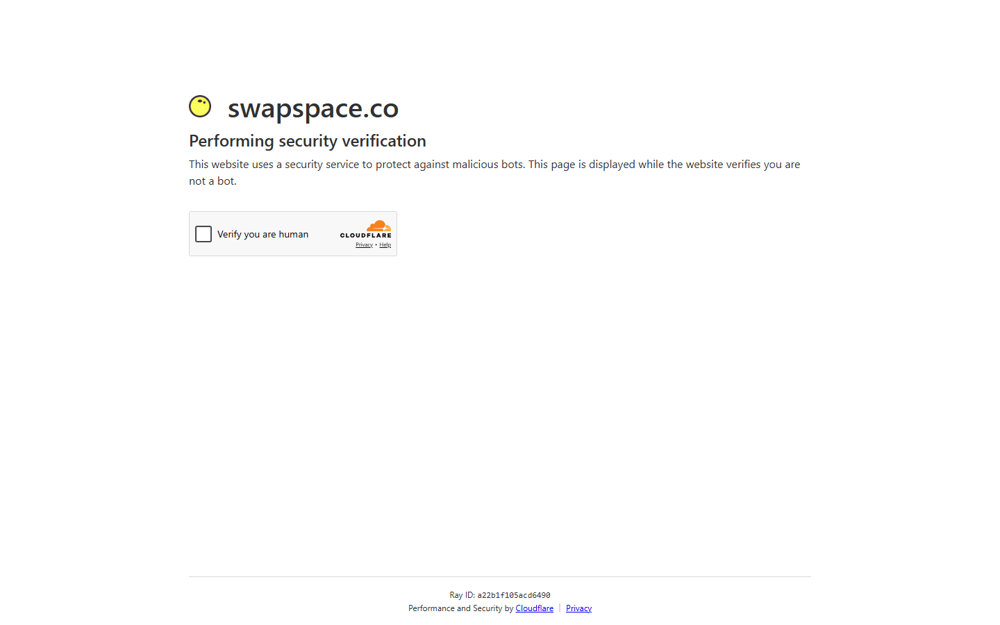

---
title: "BTC to ETH Exchange Rate 2026: 6 Services Compared"
slug: /exchanges/btc-to-eth-exchange-rate-2026
meta_title: "BTC to ETH Best Exchange 2026"
meta_description: "BTC to ETH swap rates vary by service. 6 platforms compared for live rate, fixed vs floating, KYC requirement, and execution speed in 2026."
primary_keyword: BTC to ETH best exchange
schema: Article
category: Exchanges
last_reviewed: 2026-07-29
---

# BTC to ETH Exchange Rate 2026: 6 Services Compared

Six services deliver competitive BTC to ETH swaps without mandatory registration in 2026: **Swapzone, [ChangeNOW](https://changenow.io/), [Changelly](https://changelly.com/), [SimpleSwap](https://simpleswap.io/), [StealthEX](https://stealthex.io/), and [Exolix](https://exolix.com/)**. The rate spread between them on the same input amount routinely runs 0.5-1.5%, which on a 0.5 BTC swap is $100-300 at current prices.

This is one of the highest-volume crypto pairs. Both assets are liquid. The main variables are rate optimization, ETH gas timing, and whether you lock the rate before BTC confirms.

**Live Screenshot (July 2026)**
File: `../media/live-swapzone-btc-eth-query.png`
Alt text: `Swapzone BTC to ETH live query July 2026`
Caption: `Swapzone BTC to ETH query reviewed July 2026 , provider rates captured at review time.`

*Swapzone BTC to ETH query reviewed July 2026 , provider rates captured at review time.*

## Comparison Table: 6 BTC to ETH Services

| Service | Fixed Rate | Min BTC | KYC | Speed | Note |
|---|---|---|---|---|---|
| ChangeNOW | Yes | ~0.0002 BTC | Threshold | 5-20 min | Fastest on common pairs |
| Changelly | Yes | ~0.0002 BTC | Sometimes | 10-30 min | Long track record |
| SimpleSwap | Yes | ~0.0003 BTC | None | 10-20 min | Consistent, no KYC |
| StealthEX | Yes | ~0.0002 BTC | None | 10-25 min | No upper limit |
| Exolix | Yes | ~0.0003 BTC | None | 10-25 min | Fixed rate specialist |

*Swapzone BTC→ETH results, July 2026. Rate spread between providers typically 0.3-0.8% on this pair.*

Speed range: ChangeNOW processes the swap routing faster, but actual completion time still depends on BTC (10+ min) and ETH (1-2 min) confirmations. Total is typically 15-25 minutes on a clean swap.

Check live BTC to ETH rates across all six providers on [Swapzone](https://swapzone.io/) before committing.

---

## 6 BTC to ETH Services Reviewed

### Swapzone: Rate Comparison for BTC to ETH

Swapzone queries 18+ partners at once for BTC to ETH. On this pair, you typically see 10-15 live quotes from different providers, ranked by the ETH amount you receive. The spread between position 1 and position 10 on that list tells you exactly what you are leaving on the table by not comparing.

No registration. Fixed and floating rate options visible side by side. You select the provider and rate type; Swapzone routes you through. The swap happens at the partner level, non-custodially.

For a standard 0.1 BTC swap, running Swapzone first takes 60 seconds and often finds 0.3-0.8% more ETH than going directly to a single provider. On larger amounts, that gap is worth more.

**Verdict:** Start here. Rate comparison on this pair is worth doing every time.

**What users say**

**Positive**
> "Support helped me with failed swap (because I sent small amount of Litecoin). After 1,5 hours I got my Monero (XMR). I recommend this platform."
>
> , Marcin, [Trustpilot](https://www.trustpilot.com/reviews/6a591e93a253790283802d7a)

**Critical**
> "I cannot recommend Swapzone as long as n.exchange is used as one of its CEX partners for swap execution. Transactions routed through n.exchange can become subject to lengthy AML/compliance reviews."
>
> , Omer Onat, [Trustpilot](https://www.trustpilot.com/reviews/6a6f80f806aa7388e54514b5)

> **Coinwy Editorial , My take:** Marcin's swap confirms Swapzone routes through real partners. For BTC to ETH specifically, this is the pair where the aggregator comparison is most worth doing: 10+ providers are live at any time, spread can reach 0.8%. Omer's concern applies; for BTC/ETH you can pick from the top 3 providers and skip n.exchange entirely.

---

### ChangeNOW: Our Pick for Speed

*SwapSpace BTC to ETH query July 2026 , 32+ providers.*

ChangeNOW is the speed leader. For BTC to ETH on standard amounts, routing and execution on their side completes in 5-15 minutes. The limiting factor is blockchain, not ChangeNOW's processing.

Rate is consistently competitive. ChangeNOW handles high volume on this pair and adjusts quotes frequently to stay in market range. Fixed rate available.

Threshold-triggered KYC applies for larger amounts. For amounts below $10,000 equivalent, ChangeNOW operates without KYC in practice. Above that, the threshold is unclear.

**Verdict:** Best for users who value speed and are swapping standard amounts. Check against Swapzone if rate matters more than convenience.

---

**What users say**

**Positive**
> "I did not received the swap from USDC (Base Chain) to USDT (BNB chain). Im very frustrated. Updated: I traced it and waiting for the refund. Thanks ChangeNOW for the clarification."
>
> , RT, [Trustpilot](https://www.trustpilot.com/reviews/6a77ac36337348b14a51f5df) (, 2026-08)

**Critical**
> "My raven coin still hasn't been sent to my wallet. The transaction says complete, but my wallet is zero. I need to recover this is a lot of money z"
>
> , Star seed galaxy, [Trustpilot](https://www.trustpilot.com/reviews/6a7a77fbc0cd6157248b48b2) (, 2026-08)

### Changelly: Our Pick for Long Track Record

Changelly has operated since 2015 and is one of the most widely integrated swap services. BTC to ETH is a core pair with solid liquidity. Fixed and floating rate available.

The unpredictability is KYC. Changelly sometimes requests ID verification for larger transactions or in certain jurisdictions. If you are swapping a meaningful amount and need confirmed no-KYC, this is the main risk. For standard amounts in most markets, Changelly operates without issues.

**Verdict:** Reliable service with a long history. Not the cleanest no-KYC option for large amounts. Good for users already in a Changelly-integrated workflow.

**What users say**

**Positive**
> "Support is incredibly fast! Apirone processes a large volume of exchanges through Changelly. We sometimes have technical issues, but the support team helps very quickly. It's like they work on our team."
>
> , Maxim Boyarov, [Trustpilot](https://www.trustpilot.com/reviews/6a75b351788d09c3940bfd0c)

**Critical**
> "Transaction failed. Support said there was a sudden fluctuation in the exchange rate on a Sunday for a stablecoin. I cancelled the transaction and I'm waiting for the refund."
>
> , Anand, [Trustpilot](https://www.trustpilot.com/reviews/6a81ee4ebc747f405a85aecd)

> **Coinwy Editorial , My take:** Maxim Boyarov's review is from an API integrator, which actually says more about Changelly's infrastructure reliability than consumer reviews typically do. Anand's stablecoin fluctuation complaint happened on a low-liquidity exotic token. Standard BTC/ETH on Changelly does not have this problem.

---

### SimpleSwap: Our Pick for Consistent No-KYC

SimpleSwap handles BTC to ETH without registration for standard amounts. The platform has a clean track record on this pair. Fixed and floating rate both available.

Rate is not always the market best, since SimpleSwap quotes from its own partner integrations rather than aggregating everything. Running a Swapzone check first is worth it. If Swapzone's best quote happens to route through SimpleSwap, you get the rate comparison benefit without the extra step.

Speed is 10-20 minutes. No KYC at standard amounts. Consistent service.

**Verdict:** Good default for no-registration swaps. Check rate first via Swapzone.

---

**What users say**

**Positive**
> "I've found them to be very trustworthy. I made a mistake with a transaction and their service team were very responsive and did get my refunded sorted. It took a bit of time but I do understand they are busy people. The most important thing is, the money was safe and returned."
>
> , Jeff Love, [Trustpilot](https://www.trustpilot.com/reviews/6a763f7b4f1dae8cb071ed43) (, 2026-08)

**Critical**
> "SimpleSwap took my funds, delayed for days, and never delivered my coins. Only after taking my money did they demand a surprise KYC verification to hold my crypto hostage. Support offered zero help, hiding behind robotic responses and fake technical issues."
>
> , Mahmoud, [Trustpilot](https://www.trustpilot.com/reviews/6a76c53360be275f4bc80750) (, 2026-08)

### StealthEX: Our Pick for Large Amounts

StealthEX has no stated upper limit and no KYC, making it the top choice for large BTC to ETH swaps where verification would otherwise be triggered. The 4.7 grade on Swapzone's partner directory reflects consistent quality.

Fixed and floating rate available. Speed is 10-25 minutes. UI is clean and functional.

For portfolio rebalancing at scale or moving significant BTC holdings to ETH without touching a KYC-required exchange, StealthEX is the cleanest direct-service option.

**Verdict:** Best for large no-KYC swaps. Rate is competitive, not always market-leading.

---

**What users say**

**Positive**
> "I had a swap from 5k usdt to eth. Apparently my risk level was too high for their liking, so they rejected my transfer and refunded me. I am giving 5 stars because at the same time they could have frozen my 5k and i would have to go through a rollercoaster to get it back and they were very honest. would recommend them"
>
> , Tyler Boss, [Trustpilot](https://www.trustpilot.com/reviews/69769d8d67cca1053666b2c2) (, 2026-01)

**Critical**
> "The first time I used it, swapping a was easy. But after sending more, they locked my funds and asked for ID verification. I verified and now they are asking endless questions about where the money came from. My funds are still locked, will update when I know more. That funds would have given me a bigger boost on #GoIdbIoom # Iaboratories..."
>
> , Salvatore, [Trustpilot](https://www.trustpilot.com/reviews/69aadb82786a5236e3380bf5) (, 2026-03)

### Exolix: Our Pick for Fixed Rate Without Compromise

Exolix specializes in fixed rate swaps. On BTC to ETH, where both assets are volatile and confirmation takes 15-25 minutes, locking the rate at order creation is a meaningful benefit.

No registration. No KYC. Fixed rate available and prominently featured. The floating-rate alternative is also available but fixed is Exolix's core offering.

Rate is generally within market range. Coin coverage is narrower than ChangeNOW or StealthEX, but BTC to ETH is well-supported.

**Verdict:** Best for users who specifically want fixed rate and no KYC as the primary criteria.

---

## ETH Gas Timing Affects Your Real Receive Amount

On a BTC to ETH swap, the ETH side is fast: Ethereum mainnet confirms in ~15 seconds per block with finality at 12 confirmations (about 3 minutes total). Under normal conditions, ETH gas costs are built into the swap rate and handled by the provider.

However, during Ethereum congestion events (high on-chain activity, large liquidation cascades, NFT mints), gas prices spike. Some providers adjust their ETH output to account for current gas costs mid-swap. Others lock the gas cost estimate at order creation.

The practical impact: on a slow or congested ETH day, your received amount might be slightly less than quoted on floating rate swaps. Providers who estimate gas at order creation on fixed rate swaps give you cleaner predictability.

Swapzone displays estimated swap completion time per provider, which reflects the provider's current infrastructure performance. If one provider's estimated time is notably longer than others on the same pair, it may indicate routing delays or gas estimation adjustments.

For most BTC to ETH swaps, this is a minor factor. For swaps above 0.3 BTC, it is worth selecting a provider with fixed rate to eliminate gas timing as a variable.

---

## Fixed Rate for BTC to ETH: More Valuable Than on Stable Pairs

Both BTC and ETH are volatile. A 15-25 minute swap window for a dual-volatile pair carries more rate risk than [USDT](https://tether.to/) to BTC, where one side is stable.

Example: You initiate a 0.3 BTC to ETH swap at floating rate. BTC drops 1.5% during the 20-minute confirmation. Your receive amount is calculated against a lower BTC price. You receive ~1.5% less ETH than quoted. On a $15,000 swap, that is $225.

Fixed rate premium on the same swap: typically $75-150 (0.5-1%). You pay $150 to protect against a potential $225 loss. On a volatile day, the math favors fixed rate.

For small amounts (under $500) or on days when both assets are moving sideways, floating rate is fine and saves you the premium. For rebalancing amounts above 0.1 BTC, fixed rate is worth it on most days. More detail in the [fixed rate vs floating rate guide](/exchanges/fixed-rate-vs-floating-rate-crypto-swap).

---

## What We Checked

- Rate spread data based on BTC to ETH quote comparisons on Swapzone (multiple sessions)
- ETH confirmation times from Ethereum documentation: ~15 sec/block, 12 confirmations for finality
- ChangeNOW speed benchmarks from platform documentation and community swap reports
- ChangeNOW and Changelly KYC behavior sourced from Trustpilot and Reddit user reports
- StealthEX 4.7 grade confirmed on Swapzone partner directory
- Exolix fixed rate specialization confirmed via platform documentation
- Minimum amounts per service confirmed via live quote attempts

---

## What users actually say

Users who swapped BTC and ETH through aggregators report on rate outcomes and timing.

> "I xchanged BTC for ETH much cheaper than doing it in my Exodus wallet. just as simple and was much faster then the time advertised. Very happy with the service." , [Paul](https://www.trustpilot.com/reviews/61aaec4d2b49257fe2947746) (, 2021-12)

> "Support helped me with failed swap (because I sent small amount of Litecoin). After 1,5 hours I got my Monero (XMR). I recommend this platform." , [Marcin](https://www.trustpilot.com/reviews/6a591e93a253790283802d7a) (, 2026-07)

> "I was Hesitant at first but desperate to swap btc for sol to buy a NFT im happy to say that it actually came through (Bookmarking this site)" , [asta sonner](https://www.trustpilot.com/reviews/62564ecb2b3c3c43cfd12166) (, 2022-04)

*Based on 460 verified Trustpilot reviews. [See all Swapzone reviews on Trustpilot →](https://www.trustpilot.com/review/swapzone.io)*

**What Reddit says**

On [r/CryptoCurrency](https://www.reddit.com/r/CryptoCurrency/search/?q=BTC+ETH+swap&sort=top), BTC-to-ETH swaps come up regularly in "what exchange should I use" threads. The dominant advice is to compare rates across at least two or three services before committing, especially for amounts above $1,000, where the spread difference between providers can exceed $10-20.

> **Coinwy Editorial Team , My take:** Paul's "much cheaper than Exodus wallet" is consistent with typical in-wallet swap margins, which run 2 to 4% above market on BTC/ETH. Asta Sonner's swap completing despite being "hesitant and desperate" is the common first-use experience , most users reach for an aggregator under time pressure. The rate difference between best and worst provider on Swapzone for BTC to ETH at a given moment is typically 0.5 to 1.5%. On a 0.1 BTC swap at $60k, that is $30 to $90 real difference. Two minutes of comparison is worth it.

## FAQ

**Why does the BTC to ETH rate vary between services?**
Each service sources liquidity differently. Some use their own reserves, some route through OTC partners, some aggregate. The underlying BTC/ETH market price is the same, but spread, fee structure, and liquidity depth differ. On a high-volume pair like this, 0.5-1.5% spreads between providers are normal.

**Is it faster to swap BTC to ETH on an exchange or a swap service?**
On a centralized exchange like [Binance](https://www.binance.com/), an internal trade settles in milliseconds. But you need an account, and transferring BTC in and ETH out adds blockchain confirmation time back. Total time for exchange + transfer is usually 15-30 minutes. A direct swap service is similar total time with less friction.

**Do I need to worry about MEV or front-running on BTC to ETH swaps?**
No. These are not DEX trades routed through mempool-visible contracts. The swap happens at the provider level, not in an open on-chain order book. MEV is a DEX-specific concern.

**Can I swap partial BTC amounts?**
Yes. Most services have minimum amounts around 0.0002-0.0003 BTC. There is no maximum on most services (StealthEX and Exolix especially). Very large amounts (1+ BTC) may warrant contacting the provider for OTC rates.

**Which service gives the best BTC to ETH rate today?**
It changes throughout the day based on provider liquidity and market conditions. Run the comparison on Swapzone at the moment you want to swap. The best provider at 9am may not be the best at 2pm.

**Is Swapzone adding a fee on top of the provider rate?**
Swapzone earns from partner margins, not from adding a visible fee on top. The rate you see on Swapzone for a given provider is what that provider quotes, not a marked-up version. You can verify by checking the same provider directly.

---

*Related reading: [How Swapzone works as an aggregator](/exchanges/swapzone-review-crypto-exchange-aggregator) | [Fixed rate vs floating rate: which costs less](/exchanges/fixed-rate-vs-floating-rate-crypto-swap) | [Best instant crypto swap no registration](/exchanges/best-instant-crypto-swap-no-registration)*

**What users say**

**Positive**
> "Listen, I had a change of heart. I didn't realize the support team is on TG. I was upset because I couldn't figure out how to reach support, and my tokens were hanging on a platform labeled expired. I'm going to first shout out the marketing team for Exolix for pointing me in the right direction that lead to excellent service."
>
> , Kendall Oliver Sr., [Trustpilot](https://www.trustpilot.com/reviews/69cfba3c23871d7c627c590b) (, 2026-04)

**Critical**
> "Hey everyone! I'm interested in swapping $PEPE on Ethereum and $BONK on Solana. Are these memecoins already available on Exolix? If not, it would be great to see them listed."
>
> , orinate bob, [Trustpilot](https://www.trustpilot.com/reviews/69e499609be90af39c9ecc01) (, 2026-04)

