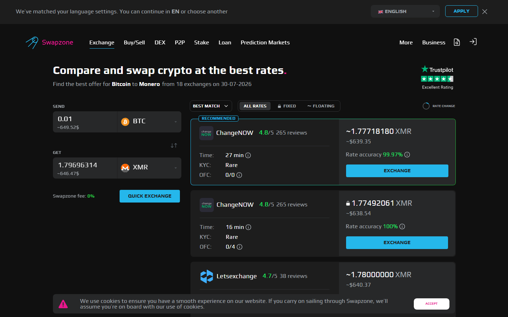
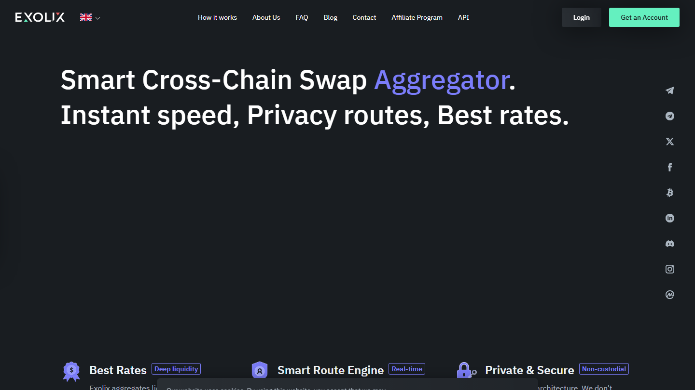

---
title: "ETH to BTC Swap: Best Rate Without Registration in 2026"
slug: "/exchanges/eth-to-btc-swap-best-rate"
meta_title: "ETH to BTC Swap 2026: Best Rate Without Registration"
meta_description: "Swap ETH to BTC without signing up. See which services offer the best rate with no registration, and how 6 platforms compare on rate and speed."
primary_keyword: "ETH to BTC swap"
schema: "Article + ItemList + FAQPage"
category: "exchanges"
last_reviewed: "2026-07-29"
---

# ETH to BTC Swap: Best Rate Without Registration in 2026

ETH to BTC is one of the most common rebalancing moves in crypto. The best services for this swap without registration in 2026 are [Swapzone](https://swapzone.io/), [ChangeNOW](https://changenow.io/), [SimpleSwap](https://simpleswap.io/), [StealthEX](https://stealthex.io/), [Exolix](https://exolix.com/), and [SideShift.ai](https://sideshift.ai/). All six allow you to initiate the swap without creating an account.

What most comparison articles do not flag: the ETH gas fee on the send side is paid by you, not the swap service. That fee runs $5 to $20 on Ethereum mainnet at standard congestion. It comes on top of the quoted swap rate. If you hold BEP20 ETH (on BNB Chain), some services accept it -- at $0.50 to $2 per transaction, the cost difference is significant for smaller swap amounts.

| Service | Registration | Fixed rate | ETH networks | Speed | KYC |
|---------|--------------|------------|--------------|-------|-----|
| Swapzone | None | Filter | ETH / BEP20 | Varies | None (aggregator) |
| ChangeNOW | None | Yes | ETH | 2-5 min | Threshold |
| SimpleSwap | None | Yes | ETH | 5-30 min | None |
| StealthEX | None | Yes | ETH / BEP20 | 5-15 min | None |
| Exolix | None | Yes | ETH | 5-15 min | None |

*Swapzone ETH→BTC results, July 2026. Rates change with ETH/BTC market movement -- verify before executing.*

| [SideShift](https://sideshift.ai/) | Email | No | ETH | 1-10 min | None |

**Live Screenshot (July 2026)**
File: `../media/live-swapzone-eth-btc-query.png`
Alt text: `Swapzone ETH to BTC live query July 2026`
Caption: `Swapzone ETH to BTC query reviewed July 2026 -- provider rates and rate type options at review time.`

*Swapzone ETH to BTC query reviewed July 2026 -- provider rates and rate type options at review time.*

## 6 ETH to BTC Services Reviewed (2026 List)

[Compare ETH to BTC rates from 18-plus providers on Swapzone](https://swapzone.io/) before choosing a single service.

### Swapzone

**Our pick for:** Seeing multiple provider rates on ETH to BTC before committing, particularly when network fee differences between ERC20 and BEP20 affect your effective rate.

Swapzone queries all major no-registration ETH to BTC providers simultaneously and ranks results by rate and estimated speed. Critically for this pair, Swapzone shows providers that accept BEP20 ETH as well as standard ERC20, which matters for users who want to avoid Ethereum mainnet gas costs.

**Best for:** Users who want to find the best rate across providers without checking each manually, and anyone with BEP20 ETH seeking lower-fee options.

**Tradeoffs:** Rate shown is a quote -- execution conditions at deposit time apply through the selected partner.

**What users say**

**Positive**
> "Support helped me with failed swap (because I sent small amount of Litecoin). After 1,5 hours I got my Monero (XMR). I recommend this platform."
>
> -- Marcin, [Trustpilot](https://www.trustpilot.com/reviews/6a591e93a253790283802d7a)

**Critical**
> "I cannot recommend Swapzone as long as n.exchange is used as one of its CEX partners for swap execution. Transactions routed through n.exchange can become subject to lengthy AML/compliance reviews."
>
> -- Omer Onat, [Trustpilot](https://www.trustpilot.com/reviews/6a6f80f806aa7388e54514b5)

> **Coinwy Editorial -- My take:** The ETH to BTC direction sees slightly fewer providers than BTC to ETH, but still enough for meaningful rate comparison. Marcin's XMR example validates the aggregator's core function: routing to whoever actually has liquidity. BEP20 ETH input is a genuine differentiator -- Swapzone shows you which providers accept it.

### ChangeNOW

**Our pick for:** Fastest ETH to BTC completion at standard amounts.

ChangeNOW processes standard pairs in 2 to 5 minutes. No registration required. Fixed and floating rate both available. ERC20 ETH accepted. KYC threshold exists at larger amounts.

**Best for:** Speed-priority ETH to BTC at moderate amounts.

**Tradeoffs:** ERC20 only -- no BEP20 gas reduction option. KYC trigger at high amounts.

**What users say**

**Positive**
> "I did not received the swap from USDC (Base Chain) to USDT (BNB chain). Im very frustrated. Updated: I traced it and waiting for the refund. Thanks ChangeNOW for the clarification."
>
> -- RT, [Trustpilot](https://www.trustpilot.com/reviews/6a77ac36337348b14a51f5df) (, 2026-08)

**Critical**
> "My raven coin still hasn't been sent to my wallet. The transaction says complete, but my wallet is zero. I need to recover this is a lot of money z"
>
> -- Star seed galaxy, [Trustpilot](https://www.trustpilot.com/reviews/6a7a77fbc0cd6157248b48b2) (, 2026-08)

### SimpleSwap

**Our pick for:** Straightforward ETH to BTC without registration or rate-comparison overhead.

SimpleSwap's interface is the most direct: pair, amount, destination address, rate, proceed. No account prompt. Fixed and floating rate. ERC20 ETH accepted. Completion varies from 5 to 30 minutes.

**Best for:** Clean no-registration flow. First-time non-custodial swap.

**Tradeoffs:** Single provider rate. ERC20 only.

**What users say**

**Positive**
> "I've found them to be very trustworthy. I made a mistake with a transaction and their service team were very responsive and did get my refunded sorted. It took a bit of time but I do understand they are busy people. The most important thing is, the money was safe and returned."
>
> -- Jeff Love, [Trustpilot](https://www.trustpilot.com/reviews/6a763f7b4f1dae8cb071ed43) (, 2026-08)

**Critical**
> "SimpleSwap took my funds, delayed for days, and never delivered my coins. Only after taking my money did they demand a surprise KYC verification to hold my crypto hostage. Support offered zero help, hiding behind robotic responses and fake technical issues."
>
> -- Mahmoud, [Trustpilot](https://www.trustpilot.com/reviews/6a76c53360be275f4bc80750) (, 2026-08)

### StealthEX

**Our pick for:** ETH to BTC at large amounts without KYC ceiling, with BEP20 ETH support.

StealthEX accepts both ERC20 and BEP20 ETH, has no upper swap limit, and requires no account or email. For users converting a significant ETH position to BTC without registration and without triggering verification, StealthEX is the most complete option. BEP20 support reduces the effective gas cost for users who can bridge to BNB Chain first.

**Best for:** Large ETH to BTC amounts. BEP20 ETH source. No-KYC priority.

**Tradeoffs:** Slower than ChangeNOW. Rate is not compared across providers unless using Swapzone.

**What users say**

**Positive**
> "I had a swap from 5k usdt to eth. Apparently my risk level was too high for their liking, so they rejected my transfer and refunded me. I am giving 5 stars because at the same time they could have frozen my 5k and i would have to go through a rollercoaster to get it back and they were very honest. would recommend them"
>
> -- Tyler Boss, [Trustpilot](https://www.trustpilot.com/reviews/69769d8d67cca1053666b2c2) (, 2026-01)

**Critical**
> "The first time I used it, swapping a was easy. But after sending more, they locked my funds and asked for ID verification. I verified and now they are asking endless questions about where the money came from. My funds are still locked, will update when I know more. That funds would have given me a bigger boost on #GoIdbIoom # Iaboratories..."
>
> -- Salvatore, [Trustpilot](https://www.trustpilot.com/reviews/69aadb82786a5236e3380bf5) (, 2026-03)

### Exolix

*Exolix ETH to BTC reviewed July 2026 -- fixed rate.*

**Our pick for:** Fixed rate certainty on ETH to BTC.

Exolix specializes in fixed rate. If both ETH and BTC are moving on the day of your swap and you want to lock the BTC output before sending ETH, Exolix gives that without a registration requirement. Upper limits are moderate. ERC20 ETH accepted.

**Best for:** Price certainty. Volatile day swaps where locking the ETH to BTC rate is worth the fixed rate premium.

**Tradeoffs:** Lower partner count. Compare on Swapzone first.

**What users say**

**Positive**
> "Listen, I had a change of heart. I didn't realize the support team is on TG. I was upset because I couldn't figure out how to reach support, and my tokens were hanging on a platform labeled expired. I'm going to first shout out the marketing team for Exolix for pointing me in the right direction that lead to excellent service."
>
> -- Kendall Oliver Sr., [Trustpilot](https://www.trustpilot.com/reviews/69cfba3c23871d7c627c590b) (, 2026-04)

**Critical**
> "Hey everyone! I'm interested in swapping $PEPE on Ethereum and $BONK on Solana. Are these memecoins already available on Exolix? If not, it would be great to see them listed."
>
> -- orinate bob, [Trustpilot](https://www.trustpilot.com/reviews/69e499609be90af39c9ecc01) (, 2026-04)

### SideShift

**Our pick for:** Bitcoin-focused ETH to BTC flow at small amounts, minimum friction.

SideShift requests an email address (Level 1). No fixed rate available -- all swaps are floating. Upper limits are the lowest in this group. For small ETH to BTC conversions where the Bitcoin-native interface is the appeal, SideShift works. For larger amounts or fixed rate needs, the other five services are better.

**Best for:** Small amounts. Lightning Network receives on the BTC side.

**Tradeoffs:** Email required. No fixed rate. Lowest limits.

## ETH gas as a hidden cost

When swapping ETH to BTC, you pay the Ethereum gas fee on the send side before the swap executes. That fee is separate from the swap rate and runs:

- **ERC20 (Ethereum mainnet):** $5 to $20 at standard gas prices. Higher during network congestion.
- **BEP20 (BNB Chain):** $0.50 to $2. Accepted by Swapzone and StealthEX.

For a $500 ETH to BTC swap, a $15 ERC20 gas fee represents 3% overhead -- potentially larger than the rate difference between providers. If you hold BEP20 ETH or can bridge cheaply, the effective rate improves meaningfully.

## When ETH to BTC makes sense vs using a CEX

ETH to BTC via a non-registration service makes sense when:

- You do not want to create or use an exchange account for a one-time conversion
- You prefer non-custodial: your ETH goes directly to the provider, BTC arrives at your specified address
- You want to move without generating an exchange trade record
- The amount is a one-time rebalancing decision, not a recurring high-frequency trade

It does not make sense when you need advanced orders, tax reporting history, or fiat conversion at the end.

## What we checked

We reviewed the public interfaces, ETH network acceptance, and KYC policies of all 6 services for ETH to BTC at time of review in July 2026. BEP20 ETH support was verified on Swapzone's swap interface. Gas fee ranges are estimates based on standard mainnet and BNB Chain conditions.

## What users actually say

Swap experience feedback from ETH and BTC pair users on Swapzone.

> "Incredibly, I have tried to exchange using this swapzone and the results are very fast without difficulty, swapzone is one of the best swap alternatives with a 0% fee, this platform displays all detailed information, so..." -- [ArdhyansyaA](https://www.trustpilot.com/reviews/5eb4871b25e5d20a888faf67) (, 2020-05)

> "I had made a mistake of sending some ETH through the wrong network and the support team responded fast as heck and helped me get a full refund. Super grateful for them and this website. I'll keep coming back and lesson..." -- [mason frosty](https://www.trustpilot.com/reviews/60932164f9f4870a786fbc22) (, 2021-05)

> "I was skeptical at first to use this website because I had never heard of it before, but I decided to regardless. It was super fast and efficient. Cost me $30 overall kind of expensive but was the fastest method. Highly..." -- [Stan](https://www.trustpilot.com/reviews/627ceee9166eb7ecbf44b061) (, 2022-05)

*Based on 460 verified Trustpilot reviews. [See all Swapzone reviews on Trustpilot →](https://www.trustpilot.com/review/swapzone.io)*

**What Reddit says**

ETH-to-BTC swap discussions on [r/CryptoCurrency](https://www.reddit.com/r/CryptoCurrency/search/?q=ETH+BTC+swap&sort=top) follow a similar pattern to BTC-ETH: users ask which service to use, and experienced commenters advise checking an aggregator rather than going directly to a single provider. The secondary advice is to use fixed-rate mode if the market is volatile.

> **Coinwy Editorial Team -- My take:** Mason Frosty's wrong-network-send story matters: non-custodial swaps have no automatic safeguard for network errors. Support intervening and refunding is above baseline -- many services would not. Stan's "$30 overall, kind of expensive" likely includes Ethereum mainnet gas on the send side, which runs $5 to $20 at standard congestion and is separate from the swap margin. On BEP20 ETH the same swap costs under $2 in gas. Network choice is the most under-discussed cost driver on ETH-side swaps.

## Frequently asked questions

**Do I pay ETH gas when using a swap service?**
Yes. You pay the Ethereum network fee to send your ETH to the provider's deposit address. The swap service handles gas on its end for the BTC delivery. For BEP20 ETH, the send-side fee is much lower.

**Can I swap ETH to BTC without registration?**
Yes. Swapzone, StealthEX, SimpleSwap, and Exolix all support ETH to BTC with no account, no email, and no KYC at standard amounts.

**Is ETH to BTC or BTC to ETH a better swap direction?**
The direction does not affect which service is best -- only that the send-side gas cost is on the ETH side regardless of direction. See the [BTC to ETH comparison](./07-btc-to-eth-exchange-rate-2026.md) for the reverse direction.

