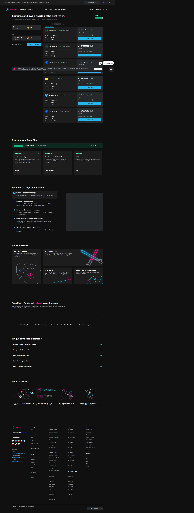
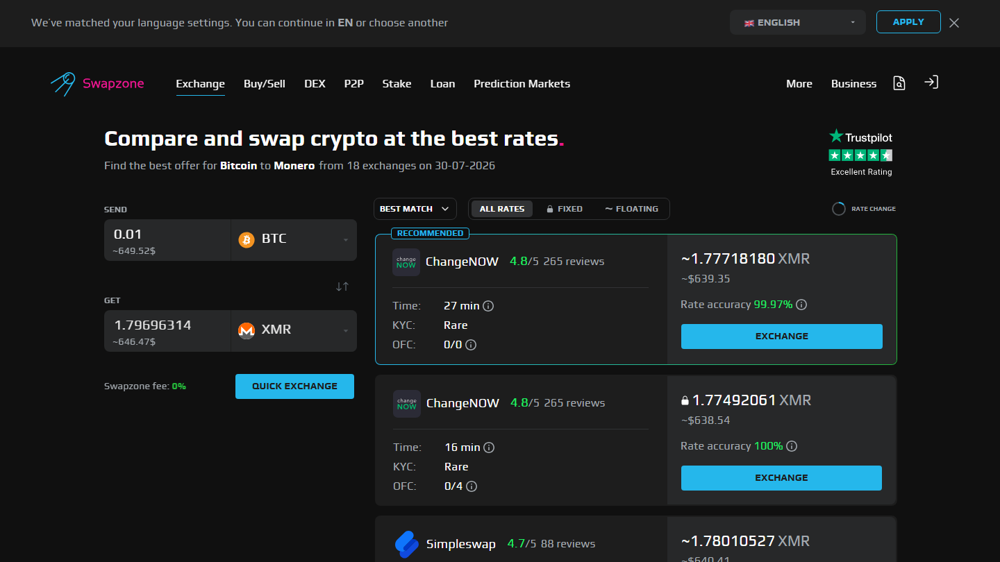

---
title: "BTC to TRX Exchange in 2026: 5 Fastest Services Compared"
slug: "/exchanges/btc-to-trx-exchange-2026"
meta_title: "BTC to TRX Exchange 2026: 5 Fastest Services Compared"
meta_description: "BTC to TRX is used for fast [USDT](https://tether.to/)-on-Tron settlements. 5 services compared for swap speed, rate, and no-KYC access in 2026."
primary_keyword: "BTC to TRX exchange"
schema: "Article + ItemList + FAQPage"
category: "exchanges"
last_reviewed: "2026-07-29"
---

# BTC to TRX Exchange in 2026: 5 Fastest Services Compared

BTC to TRX is an underserved pair that most comparison sites do not cover directly. The five services that handle it without registration in 2026 are [Swapzone](https://swapzone.io/), [ChangeNOW](https://changenow.io/), [SimpleSwap](https://simpleswap.io/), [StealthEX](https://stealthex.io/), and [LetsExchange](https://letsexchange.io/).

Most people swapping BTC to TRX are doing so to get TRX for USDT-TRC20 transactions. Sending USDT on the Tron network requires TRX for bandwidth and energy -- without it, transactions queue or fail. Holding a small TRX position (20 to 50 TRX covers most routine USDT sends) is cheaper than paying the fallback energy fees. The swap is practical, not speculative.

TRX network confirmation is fast. The bottleneck in this swap is the BTC confirmation on the send side, not the TRX delivery.

| Service | Speed | Fixed rate | Min BTC | KYC |
|---------|-------|------------|---------|-----|
| Swapzone | Varies by provider | Filter | Provider-set | None (aggregator) |
| ChangeNOW | 2-5 min + BTC confirm | Yes | Low | Threshold |
| SimpleSwap | 5-30 min | Yes | Low | None |
| StealthEX | 5-15 min | Yes | Low | None |

*Swapzone BTC→TRX, July 2026. TRX pairs have fewer active providers than BTC/ETH -- check availability directly.*

| LetsExchange | 5-20 min | Yes | Low | None |

**Live Screenshot (July 2026)**
File: `../media/live-swapzone-btc-trx-query.png`
Alt text: `Swapzone BTC to TRX live query July 2026`
Caption: `Swapzone BTC to TRX query reviewed July 2026 -- provider rates and availability at capture time.`

*Swapzone BTC to TRX query reviewed July 2026 -- provider rates and availability at capture time.*

## 5 BTC to TRX Services Reviewed (2026 List)

[Compare BTC to TRX rates on Swapzone](https://swapzone.io/) -- queries all providers simultaneously.

### Swapzone

**Our pick for:** Rate comparison across providers when you have not yet established which service consistently performs best for BTC to TRX at your amount.

Swapzone queries ChangeNOW, StealthEX, SimpleSwap, LetsExchange, and other partners for BTC to TRX simultaneously. Since this pair has fewer providers than BTC/ETH, the rate difference between providers is sometimes more pronounced -- making multi-provider comparison more valuable, not less.

**Best for:** First-time BTC to TRX swap where you want to see multiple quotes. Less useful once you have a preferred provider.

**Tradeoffs:** Rate is a quote from the selected provider -- execution conditions at deposit time apply.

**What users say**

**Positive**
> "Support helped me with failed swap (because I sent small amount of Litecoin). After 1,5 hours I got my Monero (XMR). I recommend this platform."
>
> -- Marcin, [Trustpilot](https://www.trustpilot.com/reviews/6a591e93a253790283802d7a)

**Critical**
> "I cannot recommend Swapzone as long as n.exchange is used as one of its CEX partners for swap execution. Transactions routed through n.exchange can become subject to lengthy AML/compliance reviews."
>
> -- Omer Onat, [Trustpilot](https://www.trustpilot.com/reviews/6a6f80f806aa7388e54514b5)

> **Coinwy Editorial -- My take:** BTC to TRX has fewer active providers than mainstream pairs -- which is exactly when aggregator comparison earns its value. Marcin's experience (partner resolved a failed swap in 1.5 hours) is the right baseline expectation for less-liquid pairs. Rate spread between providers on this pair can exceed 1%.

### ChangeNOW

**Our pick for:** Fastest BTC to TRX completion once the Bitcoin confirmation clears.

ChangeNOW processes the exchange side in 2 to 5 minutes. The total swap time adds the BTC confirmation time on top of that -- typically 10 to 60 minutes depending on your fee level and network state when you sent the BTC. Fixed rate available.

**Best for:** Speed priority. Situations where the BTC is already confirmed and you want TRX quickly.

**Tradeoffs:** KYC threshold exists. Single provider rate.

**What users say**

**Positive**
> "I did not received the swap from USDC (Base Chain) to USDT (BNB chain). Im very frustrated. Updated: I traced it and waiting for the refund. Thanks ChangeNOW for the clarification."
>
> -- RT, [Trustpilot](https://www.trustpilot.com/reviews/6a77ac36337348b14a51f5df) (, 2026-08)

**Critical**
> "My raven coin still hasn't been sent to my wallet. The transaction says complete, but my wallet is zero. I need to recover this is a lot of money z"
>
> -- Star seed galaxy, [Trustpilot](https://www.trustpilot.com/reviews/6a7a77fbc0cd6157248b48b2) (, 2026-08)

### SimpleSwap

**Our pick for:** Straightforward BTC to TRX without registration.

SimpleSwap handles the pair cleanly, no account required, fixed and floating rate available. Completion is 5 to 30 minutes from exchange side. TRX network delivery is fast once the swap executes.

**Best for:** Clean no-registration flow. Low-friction first swap.

**Tradeoffs:** Single provider rate.

**What users say**

**Positive**
> "I've found them to be very trustworthy. I made a mistake with a transaction and their service team were very responsive and did get my refunded sorted. It took a bit of time but I do understand they are busy people. The most important thing is, the money was safe and returned."
>
> -- Jeff Love, [Trustpilot](https://www.trustpilot.com/reviews/6a763f7b4f1dae8cb071ed43) (, 2026-08)

**Critical**
> "SimpleSwap took my funds, delayed for days, and never delivered my coins. Only after taking my money did they demand a surprise KYC verification to hold my crypto hostage. Support offered zero help, hiding behind robotic responses and fake technical issues."
>
> -- Mahmoud, [Trustpilot](https://www.trustpilot.com/reviews/6a76c53360be275f4bc80750) (, 2026-08)

### StealthEX

**Our pick for:** BTC to TRX at larger amounts without KYC ceiling.

StealthEX carries no upper limit for most pairs and requires no account. For users wanting more than a small TRX position -- for example, staking or bandwidth reserve management at scale -- StealthEX handles the size without identity verification.

**Best for:** Large BTC to TRX amounts. No-KYC priority.

**Tradeoffs:** Not the fastest. Compare on Swapzone first.

**What users say**

**Positive**
> "I had a swap from 5k usdt to eth. Apparently my risk level was too high for their liking, so they rejected my transfer and refunded me. I am giving 5 stars because at the same time they could have frozen my 5k and i would have to go through a rollercoaster to get it back and they were very honest. would recommend them"
>
> -- Tyler Boss, [Trustpilot](https://www.trustpilot.com/reviews/69769d8d67cca1053666b2c2) (, 2026-01)

**Critical**
> "The first time I used it, swapping a was easy. But after sending more, they locked my funds and asked for ID verification. I verified and now they are asking endless questions about where the money came from. My funds are still locked, will update when I know more. That funds would have given me a bigger boost on #GoIdbIoom # Iaboratories..."
>
> -- Salvatore, [Trustpilot](https://www.trustpilot.com/reviews/69aadb82786a5236e3380bf5) (, 2026-03)

### LetsExchange

**Our pick for:** BTC to TRX when TRX is not listed on the main aggregators' top-result providers.

LetsExchange lists 4,500-plus coins and includes TRX with reliable coverage. No registration, no KYC, fixed and floating rate. A useful fallback when other providers show limited availability for this pair.

**Best for:** Obscure pair availability. Fixed rate on BTC to TRX without account.

**Tradeoffs:** Rate breadth is narrower than Swapzone's multi-provider comparison.

## Why people swap BTC to TRX

The primary use case is USDT-TRC20 bandwidth. Sending USDT on Tron requires TRX for transaction resources. Without TRX in your wallet, the transaction either fails or Tron burns a fallback energy fee that costs more than simply holding a TRX reserve.

A 20 to 50 TRX reserve covers most routine USDT-TRC20 sends. Staking TRX gives you bandwidth and energy, reducing per-transaction costs further for high-volume Tron users.

This is not a speculative use case. Users swapping BTC to TRX are solving a practical infrastructure problem: keeping their USDT-TRC20 pipeline functional without paying elevated fallback fees.

If your goal after receiving TRX is USDT itself, the more efficient path is a direct USDT to BTC swap (or BTC to USDT). See the [USDT to BTC comparison](./06-usdt-to-btc-best-rate-2026.md) for that direction.

## What we checked

We confirmed that all 5 services listed offer BTC to TRX on their public swap interfaces at time of review in July 2026. Completion time estimates reflect the exchange-side processing time -- total swap time adds Bitcoin confirmation time, which varies by fee level and network congestion.

## What users actually say

Users who moved BTC and altcoin pairs like TRX through Swapzone describe swap times and outcomes.

> "Incredibly, I have tried to exchange using this swapzone and the results are very fast without difficulty, swapzone is one of the best swap alternatives with a 0% fee, this platform displays all detailed information, so..." -- [ArdhyansyaA](https://www.trustpilot.com/reviews/5eb4871b25e5d20a888faf67) (, 2020-05)

> "I had made a mistake of sending some ETH through the wrong network and the support team responded fast as heck and helped me get a full refund. Super grateful for them and this website. I'll keep coming back and lesson..." -- [mason frosty](https://www.trustpilot.com/reviews/60932164f9f4870a786fbc22) (, 2021-05)

> "I was skeptical at first to use this website because I had never heard of it before, but I decided to regardless. It was super fast and efficient. Cost me $30 overall kind of expensive but was the fastest method. Highly..." -- [Stan](https://www.trustpilot.com/reviews/627ceee9166eb7ecbf44b061) (, 2022-05)

*Based on 460 verified Trustpilot reviews. [See all Swapzone reviews on Trustpilot →](https://www.trustpilot.com/review/swapzone.io)*

**What Reddit says**

TRX exchange discussion on [r/Tronix](https://www.reddit.com/r/Tronix/) and [r/CryptoCurrency](https://www.reddit.com/r/CryptoCurrency/) focuses on TRX's primary use case: funding USDT-TRC20 gas fees. Most people buying TRX are not speculating on Tron itself -- they are getting a small TRX position to enable fee-free USDT transfers on the Tron network. The community advice for this use case is to use a no-KYC swap service for small TRX amounts rather than a CEX that requires identity verification for what is functionally a gas purchase.

> **Coinwy Editorial Team -- My take:** ArdhyansyaA's "0% fee" reflects how the non-custodial swap industry presents pricing: the margin is in the rate spread, not a visible line item. Swapzone shows the provider's rate directly so you can verify it against alternatives. The real warning on BTC to TRX is the same as any cross-network swap: TRX runs on the Tron network. Sending BTC to a Tron deposit address is a permanent loss. Confirm the network before you send.

## Frequently asked questions

**Why do I need TRX to send USDT on Tron?**
Tron uses a resource model where transactions consume bandwidth and energy. TRX holders can stake to get these resources for free, or spend TRX directly. Without TRX, Tron charges an energy fallback fee in TRX that is typically higher than holding a small TRX reserve.

**How much TRX do I need for USDT-TRC20 transactions?**
20 to 50 TRX covers most routine USDT sends. Users doing high-volume Tron activity should stake TRX for ongoing bandwidth rather than holding a pure reserve.

**Can I swap BTC to TRX without registration?**
Yes. Swapzone, SimpleSwap, StealthEX, and LetsExchange all support BTC to TRX without account creation. ChangeNOW also works without registration for standard amounts.

**What users say**

**Positive**
> "Gotta say these guys really excel as XMR-swappers - with good rates and middlish execution-times as per Trocador - and THEN they warn they may await 150 confirmations - but actually complete the swap after just 5 - so that's "exceeding customer-expectations" - and you can nicely track your swap even when you start it elsewhere, e.g. on Trocador."
>
> -- Martin Anantharaman, [Trustpilot](https://www.trustpilot.com/reviews/6a43e2d3c82ecb5f5482d41b) (, 2026-06)

