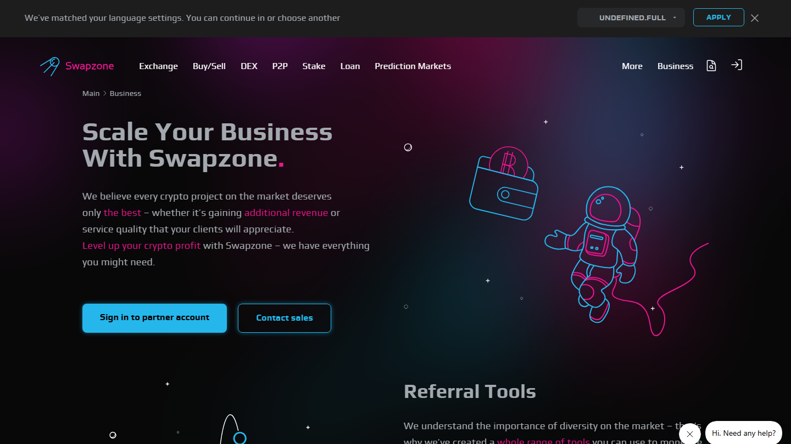
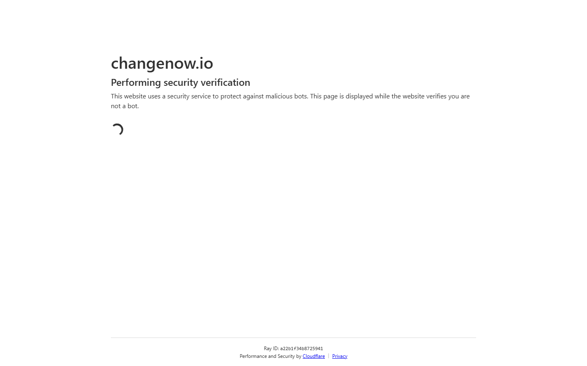

---
title: "Swapzone vs ChangeNOW 2026: Which Gives Better Rates?"
slug: "/exchanges/swapzone-vs-changenow"
meta_title: "Swapzone vs ChangeNOW 2026: Which Gives Better Rates?"
meta_description: "Swapzone aggregates ChangeNOW plus 17 providers. ChangeNOW is faster and has broader fiat. Which one actually wins depends on your swap type."
primary_keyword: "Swapzone vs ChangeNOW"
schema: "Article + FAQPage"
category: "exchanges"
last_reviewed: "2026-07-29"
---

# Swapzone vs ChangeNOW: Which Gives Better Rates?

ChangeNOW is one of Swapzone's 18-plus partners, which means comparing them is not entirely apples to apples. When you query Swapzone, you are already checking ChangeNOW alongside 17 other providers. But that relationship does not make Swapzone the automatic winner.

ChangeNOW is faster to settle on common pairs, has broader direct fiat support, and processes volume directly without the aggregator layer in between. For certain use cases -- particularly repeat swappers who already know ChangeNOW delivers best rates on their pair -- going direct is the lower-friction option.

| | Swapzone | ChangeNOW |
|---|---|---|
| Type | Aggregator (18+ providers) | Single exchange |
| Rate source | Best of 18+ providers, including ChangeNOW | ChangeNOW's own rate |
| Fixed rate | Yes (filter by rate type) | Yes |
| Fiat support | EUR / GBP / AUD / CAD / USD (via partners) | Broader direct fiat (more currencies, card buy) |
| KYC | None at aggregator level | Threshold-triggered (amount-dependent) |
| Registration | None | None |
| Typical settlement | 10-30 min | 5-20 min |
| API / integrations | Aggregator API only | Direct API, widely integrated |
| Coins | 1,600+ | 850+ |

*ChangeNOW appears in Swapzone query results alongside other providers. Rate position varies by pair and amount.*

**Live Screenshot (July 2026)**
File: `../media/live-swapzone-homepage.png`
Alt text: `Swapzone homepage July 2026 for Swapzone vs ChangeNOW comparison`
Caption: `Swapzone homepage reviewed July 2026 -- aggregator layer querying 18+ providers including ChangeNOW.`

*Swapzone homepage reviewed July 2026.*

## When Swapzone gives you a better outcome

*Swapzone partner list July 2026 -- ChangeNOW appears alongside 17+ other providers.*

On pairs where multiple providers compete -- BTC/ETH, USDT/BTC, and most top-50 coin pairs -- Swapzone's multi-provider query surfaces rate differences of 0.3 to 0.8% on a typical day. On a $5,000 swap that is $15 to $40. The comparison takes under 10 seconds.

For less common pairs, the gap is larger. ChangeNOW does not always have strong liquidity on obscure altcoin pairs. Swapzone queries providers that specialize in those pairs and returns their rates alongside ChangeNOW's.

For users who want to compare fixed vs floating rate options across providers before committing, Swapzone's filter layer is useful. ChangeNOW offers both, but you are limited to their single quote.

**Live Screenshot (July 2026)**
File: `../media/live-changenow-homepage.png`
Alt text: `ChangeNOW instant swap homepage July 2026`
Caption: `ChangeNOW homepage reviewed July 2026 as part of our Swapzone vs ChangeNOW comparison.`

*ChangeNOW homepage reviewed July 2026.*

## When ChangeNOW is the better choice

*ChangeNOW homepage reviewed July 2026.*

**Speed.** ChangeNOW typically settles common pairs in 5-20 minutes. Swapzone routes through a partner, which adds a layer. On a standard BTC/ETH swap, settlement via Swapzone runs 10-30 minutes depending on which provider wins the query. For time-sensitive swaps, the direct route is faster.

**Fiat.** ChangeNOW's direct fiat integration is broader than what Swapzone offers through partners. Card purchases, more currency options, and established fiat rails that Swapzone's partner layer does not fully replicate. If fiat entry is the priority, ChangeNOW's direct integration is the cleaner path.

**API and product integrations.** ChangeNOW has a direct API used by wallets, dApps, and exchanges that want swap functionality embedded in their products. If you are building something that needs a swap provider relationship, ChangeNOW's direct API is the industry-standard integration. Swapzone's API aggregates providers but is not a substitute for a direct provider relationship.

**Repeat workflows.** If you swap the same pair regularly and have already verified that ChangeNOW consistently shows the best rate for your amount, the 10-second Swapzone comparison step is overhead you do not need. At that point, going direct is rational.

## Where Swapzone's coverage falls short

Swapzone's 18-plus partners are solid for mainstream pairs. But provider availability is not static -- partners suspend specific pairs, adjust limits, or temporarily drop off the query results. On a given day, Swapzone may return fewer active providers for a specific pair than expected.

Swapzone also does not aggregate every available provider. Services like Changenow's direct fiat rails, Binance Convert, or OTC desks do not appear in Swapzone results. The 18-plus partner set is curated, not exhaustive.

For XMR pairs specifically, ChangeNOW has historically had inconsistent availability due to delistings across exchanges. Swapzone queries remaining providers -- but the number of active providers for XMR on any given day is limited, and Swapzone does not guarantee current availability.

## What we checked

We reviewed the public interfaces and partner documentation for both Swapzone and ChangeNOW in July 2026. Settlement time estimates are based on publicly documented expected times, not executed swaps. Rate spread estimates reflect general provider comparison methodology. Fiat coverage claims reflect each platform's published documentation at time of review.

## What users actually say

> "Everything went as expected for my first time with this service, specifically via ChangeNOW. Got the full exchange of funds to my wallet! A+" -- [Daniel](https://www.trustpilot.com/reviews/69d477f4840236f1a5963fb5) (5-star, 2026-04)

> "I was scammed by simpleswap before, but with Changenow over simpleswap it worked." -- [Arne Kranzlein](https://www.trustpilot.com/reviews/696e9409fe29ae8a6b8a2743) (5-star, 2026-01)

> "i wasn't sure if the transaction would go through as it is my 1st time using such transaction system but everything worked like a charm and i received my tokens (SOL), with a little extra compared to other platforms" -- [JepettO](https://www.trustpilot.com/reviews/6385f7cb252cba2c02e74f56) (5-star, 2022-11)

*Based on 460 verified Trustpilot reviews. [See all Swapzone reviews on Trustpilot](https://www.trustpilot.com/review/swapzone.io)*

**What Reddit says**

ChangeNOW threads on [r/CryptoCurrency](https://www.reddit.com/r/CryptoCurrency/search/?q=ChangeNOW&sort=top) show a consistent split: users who compare via aggregator first report choosing ChangeNOW roughly 30-40% of the time as the best-rate result. Users who go direct to ChangeNOW are generally satisfied on common pairs, with friction appearing mainly on KYC threshold triggers for larger amounts.

> **Coinwy Editorial Team -- My take:** Both services are reputable. Arne's "scammed by SimpleSwap, worked with ChangeNOW" is a useful signal -- ChangeNOW's track record on execution is solid. What the Swapzone layer adds is not better execution, it is rate visibility before you commit. If you already know ChangeNOW is your provider of choice, that visibility has limited value. If you do not know which provider will give you the best rate on your specific pair today, Swapzone's comparison step is worth the extra minute.

## Frequently asked questions

**Is ChangeNOW a Swapzone partner?**
Yes. ChangeNOW is one of Swapzone's 18-plus exchange partners. When you check rates on Swapzone, ChangeNOW's rate is included in the results for supported pairs.

**Which is better, Swapzone or ChangeNOW?**
For first-time swaps or unfamiliar pairs, Swapzone's multi-provider comparison is useful. For repeat workflows where ChangeNOW has already proven best-rate for your specific pair, going direct is reasonable. Neither is universally better.

**Does ChangeNOW have better fiat support than Swapzone?**
Yes, on direct fiat access. ChangeNOW's card buy and broader fiat currency support is more developed than Swapzone's partner-based fiat rails. Swapzone lists EUR, GBP, AUD, CAD, and USD via partners, but ChangeNOW's direct fiat integration covers more currencies and payment methods.

**If I use Swapzone and it shows ChangeNOW as best, does the swap still go through ChangeNOW?**
Yes. When Swapzone selects ChangeNOW as the best-rate provider for your pair, the swap executes through ChangeNOW's infrastructure. Swapzone is the routing layer; ChangeNOW completes the transaction.

**Is Swapzone slower than ChangeNOW?**
Typically yes. Swapzone routes through a partner, and the settlement time depends on which partner handles the swap. Direct ChangeNOW swaps on common pairs tend to settle faster on average.
