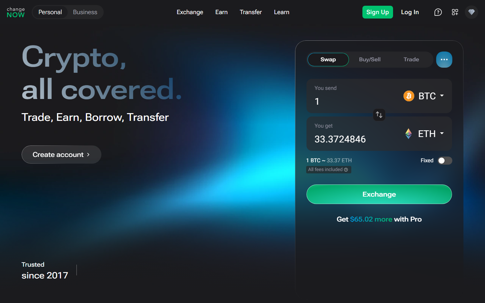

---
title: "Swapzone vs [ChangeNOW](https://changenow.io/): Which Gives Better Rates?"
slug: "/exchanges/swapzone-vs-changenow"
meta_title: "Swapzone vs ChangeNOW 2026: Which Gives Better Rates?"
meta_description: "ChangeNOW is already a Swapzone partner. See when each gives a better deal and when checking both rates in one query is the smarter move."
primary_keyword: "Swapzone vs ChangeNOW"
schema: "Article + FAQPage"
category: "exchanges"
last_reviewed: "2026-07-29"
---

# Swapzone vs ChangeNOW: Which Gives Better Rates?

This comparison is not a standard either/or. ChangeNOW is one of Swapzone's 18-plus partners — checking Swapzone means you are already checking ChangeNOW alongside 17 other providers. There is no downside to running a Swapzone query first.

That said, there are situations where going to ChangeNOW directly is the logical choice and situations where Swapzone's multi-provider view surfaces a rate ChangeNOW cannot match alone. Here is the actual breakdown.

| | Swapzone | ChangeNOW |
|---|---|---|
| Type | Aggregator (18+ providers) | Single exchange |
| Rate source | Best of 18+ providers, including ChangeNOW | ChangeNOW's own rate |
| Fixed rate | Yes (filter by rate type) | Yes |
| Fiat support | EUR / GBP / AUD / CAD / USD | Yes (wider fiat options) |
| KYC | None at aggregator level | Threshold-triggered |
| Registration | None | None |
| ChangeNOW included | Yes | N/A |
| Coins | 1,600+ | Varies |

*ChangeNOW appears in Swapzone query results alongside other providers. Running Swapzone first checks ChangeNOW's rate automatically.*

**Live Screenshot (July 2026)**
File: `../media/live-swapzone-homepage.png`
Alt text: `Swapzone homepage July 2026 for Swapzone vs ChangeNOW comparison`
Caption: `Swapzone homepage reviewed July 2026 -- aggregator vs direct swap comparison.`

*Swapzone homepage reviewed July 2026 -- aggregator vs direct swap comparison.*

## When Swapzone surfaces a better rate than ChangeNOW

For crypto-to-crypto swaps, Swapzone queries ChangeNOW plus 17 other providers simultaneously. On any given pair at any given moment, one of those other providers may offer a better rate than ChangeNOW. Swapzone shows you that comparison before you commit to anyone.

On common pairs like BTC to ETH or USDT to BTC, rate differences between providers run 0.3 to 0.8% on a typical day. On a $5,000 swap, that is $15 to $40. Running the Swapzone comparison takes under 10 seconds.

For less common pairs, the gap can be larger. When ChangeNOW does not have strong liquidity on a specific pair, its rate slips relative to providers that specialize in that pair. Swapzone shows you which provider is best positioned for that moment.

**Live Screenshot (July 2026)**
File: `../media/live-changenow-homepage.png`
Alt text: `ChangeNOW instant swap homepage July 2026`
Caption: `ChangeNOW homepage reviewed July 2026 as part of our Swapzone vs ChangeNOW comparison.`

*ChangeNOW homepage reviewed July 2026 as part of our Swapzone vs ChangeNOW comparison.*

## When ChangeNOW is the right direct choice

If a Swapzone query shows ChangeNOW as the best-rate provider for your pair, the swap executes through ChangeNOW anyway. You end up in the same place, with the same rate, just with the confirmation that no one else was offering better at that moment.

Going to ChangeNOW directly without checking Swapzone first is the logical choice in one specific scenario: you have a frequent swap workflow where you have already established that ChangeNOW consistently shows best rates for your specific pair, and the 10-second comparison step is overhead you do not need.

[Bitcoin community threads](https://www.reddit.com/r/Bitcoin/comments/1qc3a5h/there_are_no_crystal_balls_but_heatmaps_can_show/) that discuss non-custodial swap options consistently mention both services in the same context, with users typically noting they check Swapzone first for common pairs.

## The workflow that makes sense

1. Go to Swapzone.
2. Enter your pair and amount.
3. Check results. If ChangeNOW shows the best rate, proceed — the swap routes through ChangeNOW.
4. If another provider shows a better rate, use that instead.

There is no scenario where checking Swapzone first costs you something. The comparison step is free, takes under 10 seconds, and either confirms ChangeNOW is best or shows you a better option.

[Check your pair on Swapzone — ChangeNOW appears in the results alongside 17 other providers.](https://swapzone.io/)

## When ChangeNOW has advantages Swapzone does not replicate

ChangeNOW has wider fiat support on the buy side than what Swapzone offers through its fiat-enabled partners. If you need to purchase crypto with local fiat currencies beyond EUR/GBP/AUD, ChangeNOW's direct fiat integration is broader.

ChangeNOW also has an established direct API relationship with many DeFi and exchange integrations. If you are building a product that needs a direct swap provider relationship, you would work with ChangeNOW directly, not through Swapzone.

## What we checked

We reviewed the public interfaces and partner documentation for both Swapzone and ChangeNOW in July 2026. We confirmed that ChangeNOW appears as a partner in Swapzone's published partner list and appears in Swapzone query results for common pairs. Rate spread estimates are based on general provider comparison methodology, not live swap execution data across all pairs.

## Frequently asked questions

**Is ChangeNOW a Swapzone partner?**
Yes. ChangeNOW is one of Swapzone's 18-plus exchange partners. When you check rates on Swapzone, ChangeNOW's rate is included in the results for supported pairs.

**Which is better, Swapzone or ChangeNOW?**
For crypto-to-crypto swaps, checking Swapzone first is the better starting point because it includes ChangeNOW alongside 17 others. You get ChangeNOW's rate either way, plus comparison against alternatives.

**Does ChangeNOW have better fiat support than Swapzone?**
On the buy-with-fiat side, ChangeNOW offers broader fiat currency options directly. Swapzone lists EUR, GBP, AUD, CAD, and USD as fiat pairs via partners, but ChangeNOW's direct fiat integration covers more currencies and payment methods.

**If I use Swapzone and it shows ChangeNOW as best, does the swap still go through ChangeNOW?**
Yes. When Swapzone selects ChangeNOW as the best-rate provider for your pair, the swap executes through ChangeNOW's infrastructure. Swapzone is the routing layer; ChangeNOW completes the transaction.
