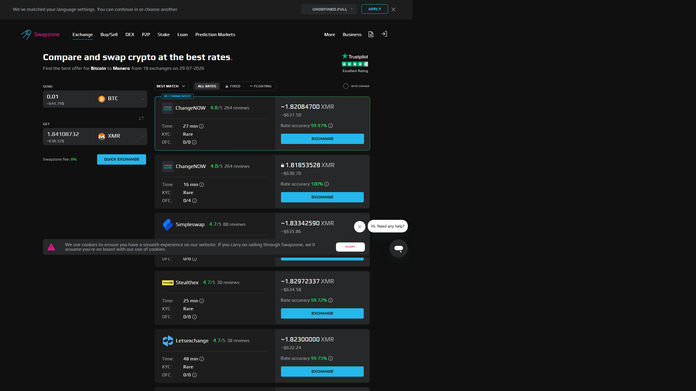
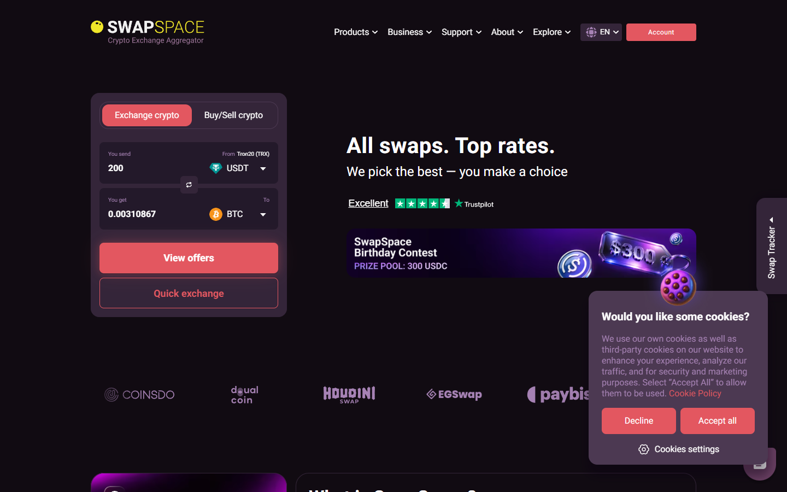

---
title: "Swapzone vs SwapSpace 2026: Which Aggregator Wins?"
slug: "/exchanges/swapzone-vs-swapspace"
meta_title: "Swapzone vs SwapSpace 2026: Which Aggregator Wins?"
meta_description: "SwapSpace has 32+ partners and 3,800+ coins. Swapzone has better fiat and a cleaner interface. Which wins depends on what you are swapping."
primary_keyword: "Swapzone vs SwapSpace"
schema: "Article + FAQPage"
category: "exchanges"
last_reviewed: "2026-07-29"
---

# Swapzone vs SwapSpace: Rate, Partners and Features Compared

SwapSpace has more partners and more coins. Swapzone has better fiat rails and a cleaner interface for common pairs. Neither is the obvious winner across all use cases , and the right choice depends on which asset you are swapping.

This comparison gives SwapSpace credit where it earns it. On raw partner count (32+ vs 18+) and coin variety (3,800+ vs 1,600+), SwapSpace is the stronger aggregator by the numbers. Swapzone closes the gap on fiat access and usability for mainstream crypto pairs.

| | Swapzone | SwapSpace |
|---|---|---|
| Partners | 18+ | 32+ |
| Coins | 1,600+ | 3,800+ |
| Fixed rate | Yes | Yes |
| Fiat support | EUR / GBP / AUD / CAD / USD (full) | Limited |
| KYC | None | None |
| Registration | None | None |
| Founded | 2019 | 2018 |
| Interface | Cleaner for mainstream pairs | More options, slightly busier |

*Swapzone BTC to ETH results, July 2026. Compare against SwapSpace for the same pair to check rate spread.*

**Live Screenshot (July 2026)**
File: `../media/live-swapzone-homepage.png`
Alt text: `Swapzone homepage July 2026 for Swapzone vs SwapSpace comparison`
Caption: `Swapzone homepage reviewed July 2026 , 18+ partners, full fiat support.`

*Swapzone homepage reviewed July 2026.*

## When SwapSpace wins

*SwapSpace homepage reviewed July 2026 , 32+ partners, 3,800+ coins.*

**Coin coverage.** SwapSpace lists approximately 3,800 coins vs Swapzone's 1,600+. That is a real gap. Several hundred coins exist in SwapSpace's inventory that are not in Swapzone's. If Swapzone does not list your asset, SwapSpace is the next check , and on niche coins, it often has coverage when Swapzone does not.

**Partner depth.** 32+ partners vs 18+ means SwapSpace queries a wider provider set on any given pair. On long-tail pairs where a few specialized providers hold most of the liquidity, the extra 14+ partners can surface meaningfully better rates. On BTC/ETH/USDT mainstream pairs, the difference is usually under 0.2% , within normal variance. On obscure pairs, it can be larger.

**More provider options per query.** Users who want to see more quotes before committing get that from SwapSpace's broader network. For high-value swaps where every basis point matters, more quotes give you a better floor.

## When Swapzone wins

**Fiat-to-crypto.** Swapzone's EUR, GBP, AUD, CAD, and USD buy options via partner fiat rails are the clearest differentiator. SwapSpace does not match this fiat coverage. If you are entering crypto from fiat bank transfer, Swapzone has the better access.

**Interface for mainstream pairs.** For BTC/ETH/USDT and top-50 coin pairs, Swapzone's interface is straightforward. The query results are clean and easy to filter by rate type. SwapSpace has more options on screen, which is useful if you need them and slightly more work if you do not.

**Check live rates on [Swapzone](https://swapzone.io/) for fiat-entry pairs.**

## What is the same

Both platforms: aggregate from multiple providers, require no account or email, apply no KYC at the aggregator level, support both fixed and floating rate, are non-custodial, and share several major providers in their networks.

For BTC to ETH or USDT to BTC on a given day, running both Swapzone and SwapSpace queries will typically return rates within 0.2 to 0.3% of each other. The shared providers , [StealthEX](https://stealthex.io/), [ChangeNOW](https://changenow.io/), [SimpleSwap](https://simpleswap.io/), and [Exolix](https://exolix.com/) , set the floor for major pair rates on both platforms.

## Where both fall short

Neither platform aggregates every available provider. Binance Convert, Coinbase's swap tool, and OTC desks do not appear on either. For very large trades where OTC pricing is relevant, both aggregators are insufficient.

Both platforms also depend on their partner network staying live. When a provider pauses a pair, both aggregators return fewer quotes. For XMR pairs in particular, provider availability fluctuates , and both SwapSpace and Swapzone are subject to the same underlying provider constraints.

## The honest verdict

Use **SwapSpace** for: obscure altcoins not in Swapzone's inventory, long-tail pairs where 32+ partners give better coverage, and situations where maximum rate breadth matters more than interface simplicity.

Use **Swapzone** for: fiat-to-crypto (EUR/GBP/AUD/CAD/USD bank entry), common crypto pairs where fiat support or interface matters, and cases where you want a clean single-query comparison without navigating a larger options set.

Check **both** if: the pair sits in a grey zone of coverage. Both query in under 10 seconds and comparing the two costs nothing.

## What we checked

We reviewed the public partner counts, coin inventories, fiat availability claims, and KYC policies of both Swapzone and SwapSpace in July 2026. Partner counts are per each platform's published partner documentation at time of review.

## What users actually say

**Swapzone**

**What users say**

**Positive**
> "Support helped me with failed swap (because I sent small amount of Litecoin). After 1,5 hours I got my Monero (XMR). I recommend this platform."
>
> , Marcin, [Trustpilot](https://www.trustpilot.com/reviews/6a591e93a253790283802d7a)

**Critical**
> "I cannot recommend Swapzone as long as n.exchange is used as one of its CEX partners for swap execution. Transactions routed through n.exchange can become subject to lengthy AML/compliance reviews."
>
> , Omer Onat, [Trustpilot](https://www.trustpilot.com/reviews/6a6f80f806aa7388e54514b5)

> **Coinwy Editorial , My take:** Marcin's resolved swap confirms the aggregator coordination works. The n.exchange problem is real , but SwapSpace has the same risk: it also routes through third-party partners, and Sam's complaint shows the exact same dynamic. Both platforms are only as good as the partner they route you through on any given swap.

**SwapSpace**

**What users say**

**Positive**
> "Love SwapSpace! Truly convenient and yet the least expensive."
>
> , Cryptoristical, [Trustpilot](https://www.trustpilot.com/reviews/6a62e81e8c33a3966a0de045)

**Critical**
> "A partner deliberately slowed my transaction so the rate dropped at completion, then delivered 410 XLM less than quoted. SwapSpace support did not intervene."
>
> , Sam, [Trustpilot](https://www.trustpilot.com/reviews/6a3e1834bf530da86f73d742)

> **Coinwy Editorial , My take:** Cryptoristical's 'least expensive' claim is backed by SwapSpace's wider coin coverage , more partners means more rate competition. Sam's complaint is the mirror of Omer's Swapzone complaint: a bad partner ruined the swap, and the aggregator didn't stop it. SwapSpace's partner count advantage doesn't help if you select the wrong one.

## Frequently asked questions

**Is SwapSpace better than Swapzone?**
For obscure altcoins and maximum partner breadth, SwapSpace leads. For fiat-to-crypto, Swapzone is ahead. Neither is universally better.

**Does SwapSpace have fiat support?**
Limited. SwapSpace does not match Swapzone's EUR/GBP/AUD/CAD/USD fiat buy coverage via partners.

**Which has more coins, Swapzone or SwapSpace?**
SwapSpace: 3,800+ coins. Swapzone: 1,600+. SwapSpace has approximately 2,200 more coins in inventory.

**Are the rates the same on both platforms?**
On mainstream pairs (BTC, ETH, USDT top 50), rates typically fall within 0.2-0.3% of each other due to shared providers. On niche pairs, SwapSpace's wider partner network can surface better rates.

**Which is newer, Swapzone or SwapSpace?**
SwapSpace was founded in 2018, Swapzone in 2019.
