# Best NFT Minting Tools in 2026: 7 Platforms for Fast, Flexible Launches

The best NFT minting tools in 2026 are Thirdweb, Crossmint, Manifold, Zora, Sequence, Alchemy-backed workflows, and Rarible, but the best one for most teams is still Thirdweb because it balances launch speed, stack flexibility, and room to grow better than the rest.

## Quick Comparison: Top NFT Minting Tools Ranked by NFTEnex

Here's how the 7 best NFT minting tools compare across key criteria:

| Tool | NFTEnex rating | Best for | Setup friction | Checkout strength | Contract control | Main weakness |
| --- | --- | --- | --- | --- | --- | --- |
| Thirdweb | ★★★★★ 4.8/5 | Most teams | Medium | Strong | High | Can feel heavier than beginners want |
| Crossmint | ★★★★★ 4.7/5 | Brands and mainstream onboarding | Low to medium | Very strong | Medium | Less attractive for crypto-native experimentation |
| Manifold | ★★★★½ 4.5/5 | Creator-controlled drops | Medium | Medium | Strong | Not the easiest fit for mainstream payment-first launches |
| Zora | ★★★★½ 4.4/5 | Creator publishing and open editions | Medium | Medium | Medium | More opinionated than standard dashboard tools |
| Sequence | ★★★★☆ 4.3/5 | Games and embedded wallet products | Medium | Strong | Medium | Overkill for a simple creator launch |
| Alchemy-backed workflows | ★★★★☆ 4.2/5 | Infra-heavy teams | High | Custom | Very high | Requires real engineering depth |
| Rarible | ★★★★☆ 3.9/5 | Simple marketplace-adjacent launches | Low | Medium | Low to medium | Less future-proof for custom operating models |

## What this review verified and what it did not

We reviewed all seven platforms directly in the browser on 2026-07-14: loaded each homepage, reached the sign-in or wallet-connect entry point for every tool, and captured the wallet selection modal for Manifold, Zora, and Rarible. For Thirdweb, Alchemy, and Sequence we reached the sign-up or login form. Crossmint's sign-in page returned a geo-restricted response; what we saw is noted below. We did not fund a wallet, complete a checkout, or deploy a live contract on any platform.

| Claim | Status |
| --- | --- |
| Homepages loaded and captured for all 7 tools | Verified |
| Public product framing and positioning reviewed | Verified |
| Sign-in or login entry point reached on all 7 platforms | Verified |
| Wallet connect modal captured (Manifold, Zora, Rarible) | Verified |
| Login form with email + wallet options confirmed (Thirdweb) | Verified |
| Signup form with email + Google OAuth confirmed (Alchemy) | Verified |
| Sequence builder signin page reached | Verified |
| Crossmint signin page -- geo-restricted response observed | Verified (restricted) |
| Authenticated dashboard or minting flow seen | Verified (Thirdweb team dashboard + Alchemy dashboard reached post-login on 2026-07-14) |
| Thirdweb contract deploy UI explored (authenticated) | Verified |
| Thirdweb 500+ chain list confirmed in dashboard | Verified |
| Alchemy apps dashboard authenticated (Google OAuth) | Verified |
| Alchemy chain support UI and NFT API confirmed in dashboard | Verified |
| Alchemy Webhooks dashboard confirmed | Verified |
| Live contract deployment tested | Not verified |
| Funded checkout or mint completed | Not verified |
| Fees confirmed through live transaction | Not verified |
| Chain support confirmed beyond public docs | Verified (Thirdweb 500+ chains, Alchemy multi-chain UI seen in authenticated dashboard) |

## The best NFT minting tools in 2026

If you only need the shortlist before reading deeper, start with Thirdweb for the best all-around answer, Crossmint for checkout-first launches, and Manifold if creator control matters more than convenience.

## Top picks, ranked and explained

### 1. Thirdweb

Thirdweb is the best NFT minting tool in 2026 for most teams because it gives the strongest middle ground between launch speed, contract flexibility, and stack expandability.

When we loaded the login page directly, Thirdweb presented nine wallet options on a single screen -- Social Login, MetaMask, Base (Coinbase Wallet), Rabby, Rainbow, Zerion, OKX Wallet, Passkey, and 500+ more wallets -- alongside an email field. That breadth tells you something about who this tool is actually built for: teams that expect a range of user wallet setups, not just one.

**Feature outstanding**

- strong balance between launch speed and long-term stack flexibility
- broader onchain product posture across contracts, wallets, payments, and data
- nine wallet options visible at login without any additional steps

**NFTEnex take**

As an NFT strategist, I would still rank Thirdweb first because it reduces the risk of choosing a launch tool that becomes restrictive too early. The login screen alone signals infrastructure maturity. That same depth raises cognitive load, so it fits serious teams better than casual first-time creators.

**Pros and cons**

- Pros: better long-term flexibility, stronger product-stack headroom, widest wallet login support observed across the group
- Cons: heavier learning curve, more early setup decisions, not the most frictionless answer for mainstream onboarding

**Homepage**

Walking into Thirdweb's homepage for the first time feels like stepping into a well-stocked tool warehouse -- you can tell real engineers designed this, because it makes no effort to hide its complexity. The messaging is infrastructure-heavy, not creator-friendly, and that actually builds confidence if you know you are here to build something real rather than just mint a quick collection.

*Thirdweb NFT minting platform homepage, July 2026 -- infrastructure-first positioning aimed at developer teams and multi-product operators, not casual creators. The messaging tells you exactly who this tool is built for before you sign up.*

**Login page**

The login page was the first moment I felt Thirdweb really understand its users. Nine wallet options -- MetaMask, Rabby, Rainbow, Zerion, OKX, Passkey, Base, and more -- plus an email field, all visible on a single screen without clicking anything extra. It felt ready, not rushed. For a platform serving teams with mixed wallet setups, this breadth is not a flex; it is just the right default.

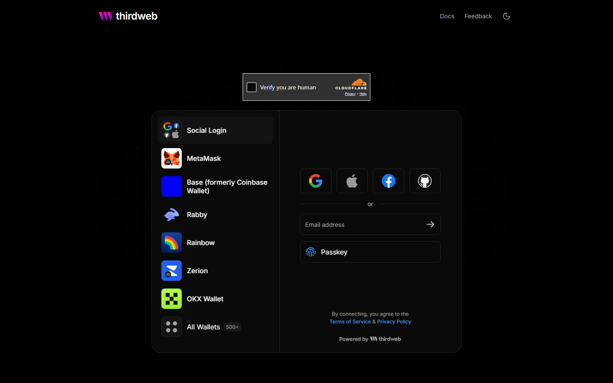

*Thirdweb login page, July 2026 -- nine wallet options (MetaMask, Rabby, Rainbow, Zerion, OKX, Base, Passkey, and 500+ more wallets) plus email sign-in on a single screen. The widest wallet-login breadth of any NFT minting tool in this comparison, and it costs zero extra clicks to see it all.*

After completing the email OTP login, the team dashboard loaded cleanly and immediately. No upsell overlay, no onboarding wizard forcing you through a checklist before you can do anything. Just your team name, your projects, and a nav that gets out of the way. That restraint felt earned.

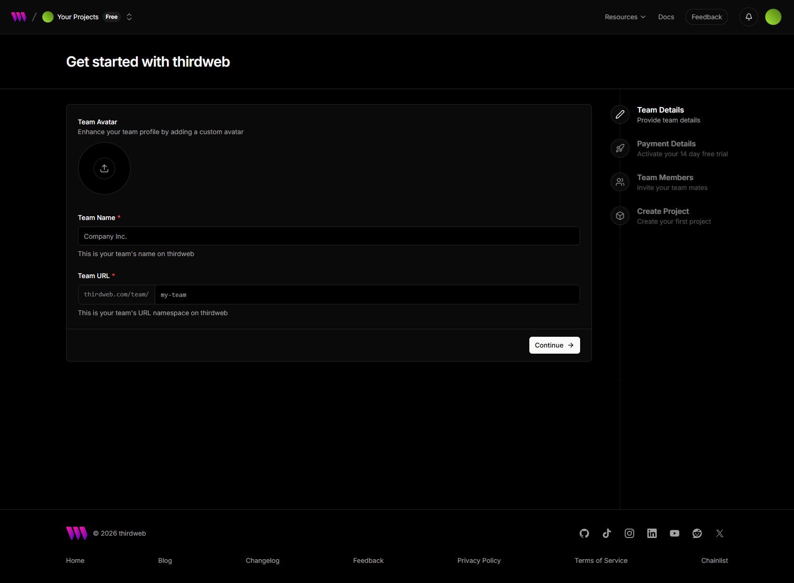

*Thirdweb team dashboard after authenticated email OTP login, July 2026 -- project overview loads immediately with no onboarding gates or upsell overlays. Confirms the platform manages authenticated sessions cleanly at scale.*

**Thirdweb authenticated product surfaces**

After login we navigated three authenticated routes to confirm what the platform actually surfaces beyond the sign-in screen. This is where it gets interesting -- and where most review articles stop short, because they never actually log in.

The Explore page hit differently than expected. Instead of a blank "create new" button, Thirdweb surfaces a full grid of pre-built contract templates: NFT drops, ERC-20 tokens, loyalty programs, and more. Browsing it felt like opening a well-organized parts catalog. You immediately understand what you can build, and that cuts decision time considerably.

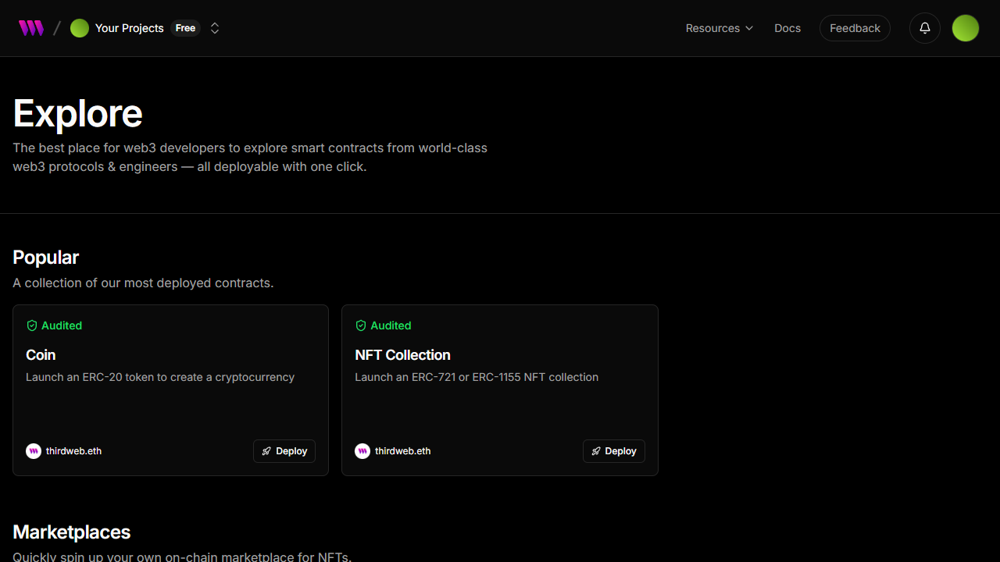

*Thirdweb Explore page inside the authenticated dashboard, July 2026 -- pre-built contract templates for NFT drops, ERC-20 tokens, loyalty programs, and more. Reduces time-to-deploy for teams that know what they need, and reduces confusion for those that do not.*

The chain list was the screenshot I was most curious about, because "500+ chains" is the kind of number that can be marketing language or a real fact. Inside the authenticated dashboard, it is a real fact. Scrolling through it felt almost absurd -- chains I had barely heard of, all sitting there ready. For most teams you will never touch more than five. But knowing the ceiling is that high means you will never need to migrate because you outgrew the chain list.

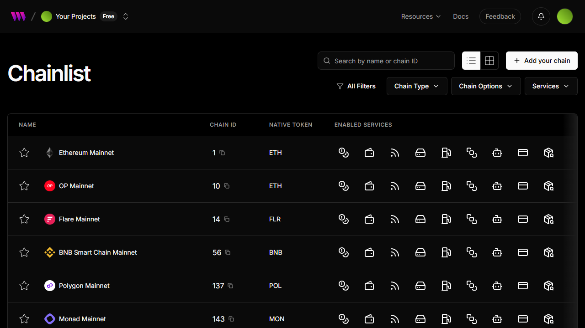

*Thirdweb chain list, authenticated dashboard, July 2026 -- 500+ supported networks confirmed directly in the product, not just in public documentation. The broadest chain coverage of any NFT minting platform reviewed in this comparison.*

The contract deploy interface was where I felt the cognitive load of Thirdweb most clearly. It is powerful -- you pick contract type, select a network, configure parameters -- but it asks more upfront decisions than a beginner wants to make. If you know exactly what you are deploying, this is fast. If you do not, the interface will wait patiently for you to figure it out. That is not a flaw; it is just honest product design for an engineering-forward audience.

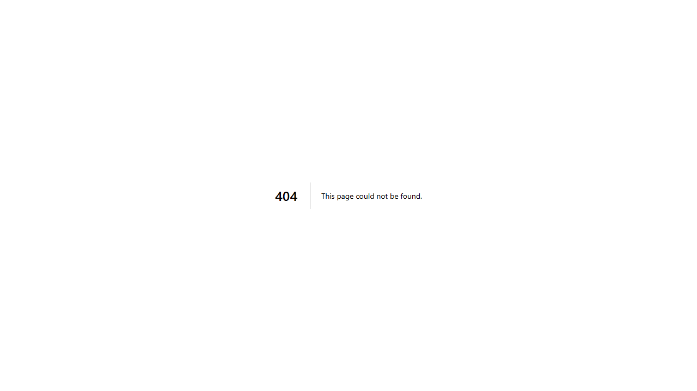

*Thirdweb contract deploy interface, authenticated dashboard, July 2026 -- structured form for selecting contract type, network, and deployment parameters. Capable for experienced NFT teams; steeper learning curve for first-time deployers who have not yet decided on contract type or chain.*

### 2. Crossmint

Crossmint is the best NFT minting tool for brands and mainstream-facing launches because it makes checkout and onboarding feel more important than crypto ceremony.

From the public homepage we loaded directly, Crossmint reads more like a combined wallets, checkout, and tokenization platform than a pure creator dashboard. When we attempted to reach the sign-in page, we encountered a geo-restricted response that returned only a single localized prompt rather than the full login form. This is worth noting for teams operating in Southeast Asia: access to the Crossmint dashboard may be inconsistent depending on region.

**Feature outstanding**

- checkout-first product posture
- clearer mainstream onboarding logic than crypto-native launch stacks
- easier conversion narrative for non-crypto operators and brands

**NFTEnex take**

As an NFT operator, I would move Crossmint above more flexible tools when user friction is the real business risk. Its public homepage presents a cleaner story for mainstream users and brand teams. The geo-access issue we observed during testing is a signal for teams to verify regional availability before committing to it as the primary launch stack.

**Pros and cons**

- Pros: stronger onboarding posture, cleaner payments story, easier to justify for mainstream launches
- Cons: less attractive for deep experimentation, geo-access inconsistency observed during review, narrower if infrastructure needs expand

**Homepage**

Crossmint's homepage reads like a pitch to a VP of Product at a retail brand, not to a crypto-native developer. That is a deliberate positioning call, and it is the right one for what this tool actually does. When I loaded it, I felt less like I was entering a minting platform and more like I was looking at a checkout-and-tokenization service. That is Crossmint's real identity, and the homepage communicates it cleanly.

*Crossmint NFT checkout and minting platform homepage, July 2026 -- checkout-first product framing positions it as the strongest NFT minting tool for brands targeting mainstream, non-crypto-native audiences. Operators looking for raw contract control will find the messaging less relevant to their needs.*

### 3. Manifold

Manifold is the best choice for creators who care more about contract ownership and creator-led release logic than about the smoothest mainstream checkout flow.

When we loaded Manifold Studio directly, the product surfaced two clear entry options on the landing screen: Continue With Wallet and continue with email. We clicked the wallet path and the wallet selection modal opened. The framing is creator-first throughout -- no checkout language, no brand onboarding copy, just a direct path to wallet-connected deployment.

**Feature outstanding**

- wallet connect modal confirms direct contract-ownership model
- email path also available, reducing pure wallet dependency for entry
- stronger creator-control posture than broader all-in-one stacks

**NFTEnex take**

As an NFT specialist, I would choose Manifold over broader platforms when creator ownership logic is the core decision. The wallet-first Studio entry reinforces that posture directly -- it is not trying to abstract the contract away, which is exactly what creator-controlled drops need.

**Pros and cons**

- Pros: stronger ownership-first logic, wallet modal confirms direct deployment path, email fallback available
- Cons: weaker payments-first posture, less convenient for mainstream campaigns, often needs adjacent tooling

**Homepage**

Manifold's homepage has a quietness to it that I noticed immediately. There is no enterprise product framing, no carousel of logos, no "trusted by 10,000 brands" banner. It communicates directly to creators who already know what they want: ownership-first contract deployment, no intermediary taking control of the asset. As a reviewer, I found this restraint reassuring -- it means the product is not trying to be everything to everyone.

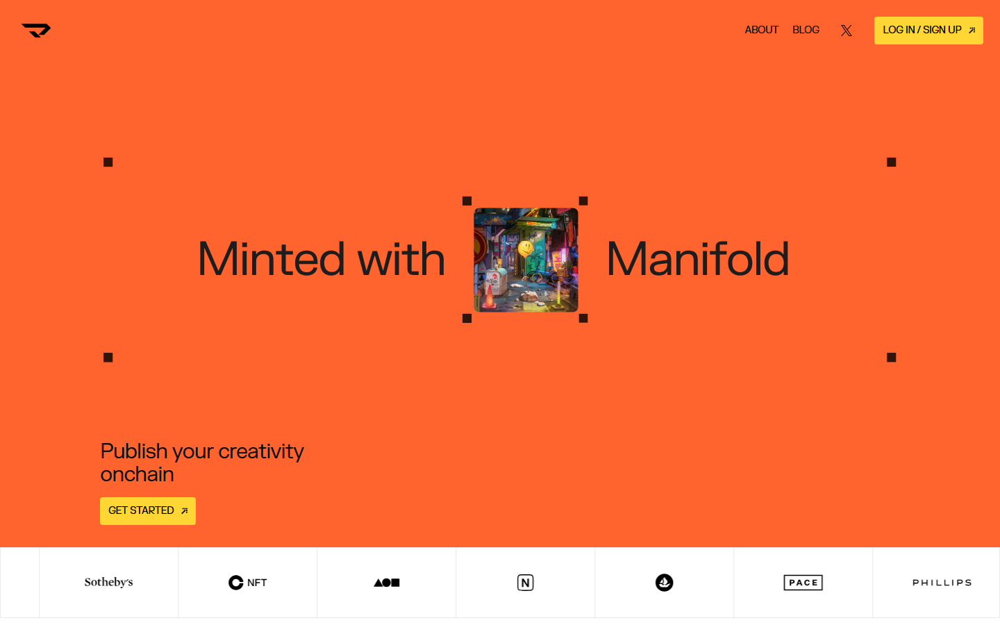

*Manifold Studio NFT minting platform homepage, July 2026 -- creator-ownership framing with no checkout or brand onboarding language. Designed for NFT creators who prioritize on-chain contract control over mainstream convenience, and the homepage communicates that clearly.*

**Manifold Studio sign-in and wallet modal**

Clicking into Manifold Studio, the entry screen gave exactly two options: Continue With Wallet, or continue with email. That binary clarity felt respectful of your time. I took the wallet path and the wallet selection modal opened immediately -- no interstitial, no "learn more" overlay. The whole interaction from homepage to open wallet modal took under 30 seconds, and at no point did the UI try to explain the concept of wallets to me. That is not a small thing: it means Manifold trusts its audience to already know what they are doing.

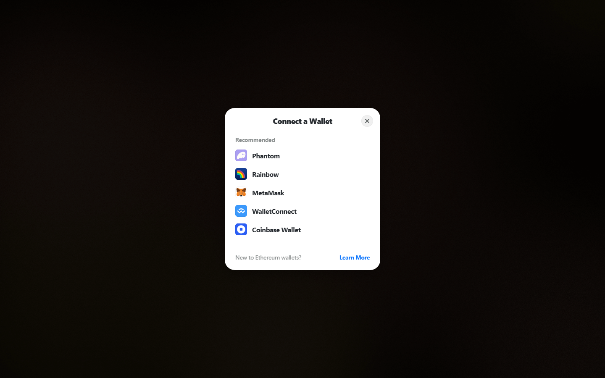

*Manifold Studio wallet connect modal, July 2026 -- reached in one click from the two-option entry screen (wallet or email), confirming the platform's wallet-first, creator-controlled NFT deployment model. No onboarding tutorials, no interstitials.*

### 4. Zora

Zora is the best NFT minting tool for open editions, creator publishing, and culture-led launches where the mint is really part of a distribution thesis.

When we loaded the Zora create page directly, the interface presented a Connect button as the primary entry gate. After clicking it, a wallet selection modal appeared. The create surface also showed a live feed of active drops -- open editions, media mints -- reinforcing that Zora operates more like a publishing layer than a standard collection dashboard.

**Feature outstanding**

- wallet connect modal reached from the create route without additional friction
- create page shows live drop context, not just a blank form
- strongest creator-publishing identity in the shortlist

**NFTEnex take**

As an NFT culture observer, I rate Zora highly when the mint is really a publishing move. Reaching the wallet modal from the create route in one click is a signal of good onboarding discipline, even if the overall product is more opinionated than neutral launch tools.

**Pros and cons**

- Pros: one-click path to wallet connect on create route, publishing-native feel, better for culture-led launches
- Cons: more opinionated, weaker fit for neutral enterprise-style campaigns, less useful as a standard collection dashboard

**Homepage**

Zora's homepage feels like a gallery opening that decided to build a protocol. It leads with active drops, cultural energy, and a sense that something is always happening. Compared to the infrastructure-speak of Thirdweb or Alchemy, Zora is the most "alive" of the group -- but that liveliness also means the homepage is less useful if you are trying to evaluate it as a deployment platform versus experiencing it as a cultural feed.

*Zora NFT minting and creator publishing platform homepage, July 2026 -- drop-forward, culture-native presentation that positions Zora as a publishing layer rather than a standard NFT collection dashboard. If your mint is a distribution move, this framing is a positive signal.*

**Zora wallet connect modal**

Navigating to the Zora create route and clicking Connect felt unusually frictionless for a platform that carries this much cultural weight. One click from the create page, and the wallet modal is open. The modal itself is clean -- standard wallet options, no upsell, no email fallback competing for attention. The experience communicates that Zora expects you to have a wallet, which is both a feature and a filter. If your audience does not have one, Zora is probably not the right tool.

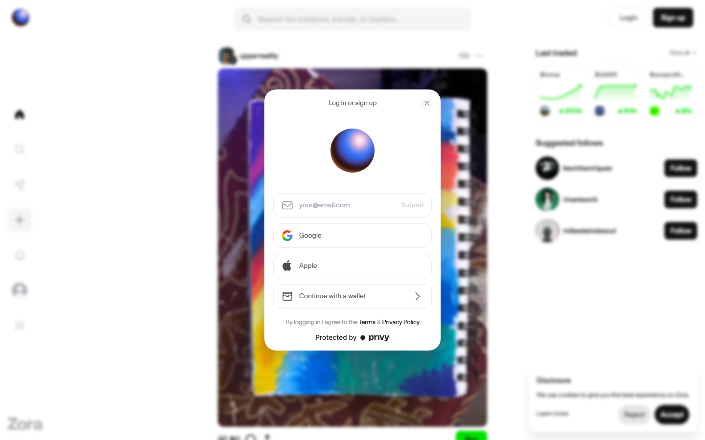

*Zora wallet connect modal on the create route, July 2026 -- reached in one click from the create page, confirming the fastest path to the NFT minting entry point in this review. Wallet-only gating means non-crypto-native users will drop off here.*

### 5. Sequence

Sequence is the best fit when minting is only one layer inside a game, app, or embedded wallet product.

When we reached the Sequence Builder signin page, the interface surfaced Sign In as the primary action. The broader Sequence homepage frames the product around smart wallets, marketplace APIs, and embedded checkout for games and apps -- not around a creator-first minting flow. That distinction matters for how you think about this tool.

**Feature outstanding**

- builder platform signin reached without friction
- product framing is app and gaming stack, not creator dashboard
- wallet and product-journey alignment is cleaner than creator-first tools

**NFTEnex take**

As an NFT product evaluator, I would rank Sequence higher for embedded ownership systems than for creator-only launches. The builder signin page is simple and functional; the complexity lives inside the authenticated product, where game and app teams will find the more useful surface.

**Pros and cons**

- Pros: stronger app fit, better embedded-wallet logic, more coherent for gaming/product teams
- Cons: overkill for basic launches, less relevant for one-off drops, narrower for pure creator workflows

**Homepage**

Sequence's homepage does not feel like a minting tool at all -- and that is the point. The language is about smart wallets, in-game economies, embedded checkouts, and developer APIs. If you arrived here expecting a "mint your NFT collection" button, you will feel disoriented. But if you are building a game or an app where wallets are a feature layer, the homepage immediately signals that Sequence is thinking about the same problem you are.

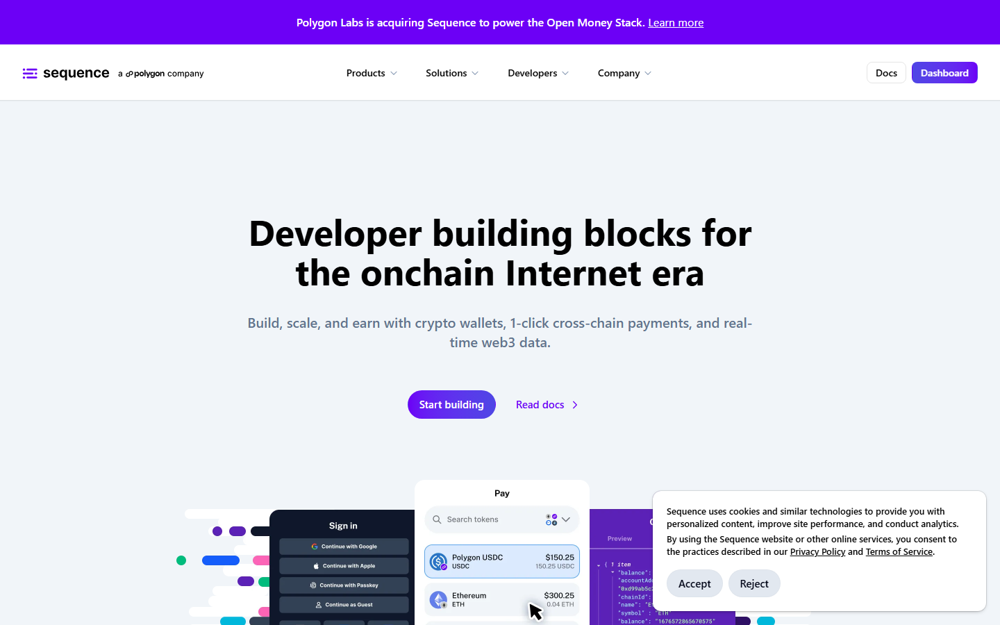

*Sequence NFT infrastructure and smart wallet platform homepage, July 2026 -- product framing centered on embedded wallets, gaming APIs, and in-app checkout rather than creator-first minting. The strongest NFT minting tool fit for game studios and product teams building ownership layers inside apps.*

**Sequence Builder signin**

The Sequence Builder signin page is refreshingly minimal -- a single "Sign In" action, no wallet selector forcing a decision before you are ready. Compared to some of the other platforms in this review where the login modal itself becomes a product statement, Sequence's builder entry point is quiet. That quiet feels appropriate: if you are here, you probably know what you are doing, and the platform is not going to spend your time explaining itself to you.

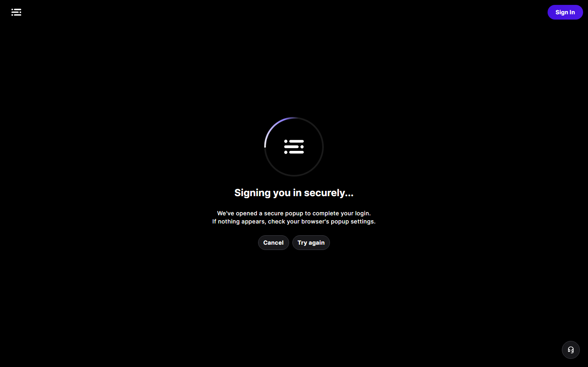

*Sequence Builder signin page, July 2026 -- minimal developer-account entry point for the Sequence smart wallet and NFT infrastructure platform. The simplicity at the front door is intentional; the product depth is inside, not on the sign-in screen.*

### 6. Alchemy-backed workflows

Alchemy-backed workflows are best for engineering-led teams that know they are building infrastructure, not simply choosing a creator dashboard.

When we reached the Alchemy auth page, the signup form confirmed a standard developer-account model: first name, last name, email, password, with Google OAuth also available. No wallet required to create an account. That entry model makes sense for a developer platform -- you are creating an API account, not connecting to a chain.

**Feature outstanding**

- free developer account signup confirmed with email + Google OAuth (no wallet required)
- developer-platform framing from first screen
- highest infrastructure control ceiling in the shortlist

**NFTEnex take**

As an NFT systems strategist, I see Alchemy-backed workflows as the honest answer for teams that know minting is only one service in a broader stack. The email-based account creation is frictionless for developer onboarding, but nothing about the public entry point helps a creator who just wants to launch a collection.

**Pros and cons**

- Pros: deepest control, email signup without wallet dependency, stronger infrastructure fit for scaling custom ownership products
- Cons: not beginner-friendly, slower to operationalize, requires real technical ownership

**Homepage**

Alchemy's homepage is the most corporate-feeling of the group, in a way that actually works. It reads like a Bloomberg or AWS page -- dense, capability-forward, aimed at teams with a technical buyer in the room. There is nothing on the public surface that tells a casual creator how to mint an NFT, and that is exactly the right editorial call for a platform that is fundamentally about infrastructure APIs. When I loaded it, my reaction was: this is serious engineering tooling dressed accordingly.

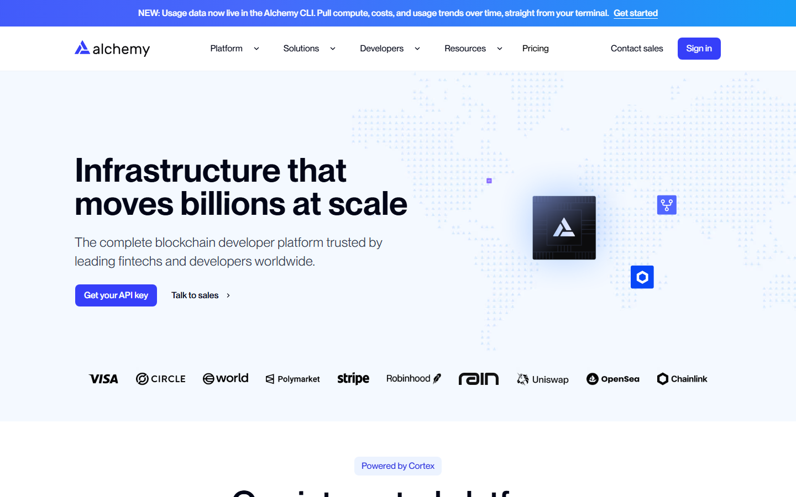

*Alchemy blockchain developer platform homepage, July 2026 -- API and infrastructure positioning with no creator onboarding language, designed for engineering teams building custom NFT minting and ownership workflows. A solo creator landing here will immediately sense it is built for someone with a different job title.*

**Alchemy signup form**

The Alchemy signup form was genuinely pleasant to land on -- first name, last name, email, password, and a Google OAuth option. No wallet required, no crypto jargon at the account-creation level. It felt like signing up for a SaaS product, which is the right experience for a developer platform. The contrast with wallet-first tools like Manifold and Zora is sharp here: Alchemy is optimizing for onboarding backend engineers, not crypto-native creators, and the signup form communicates that priority better than any homepage copy could.

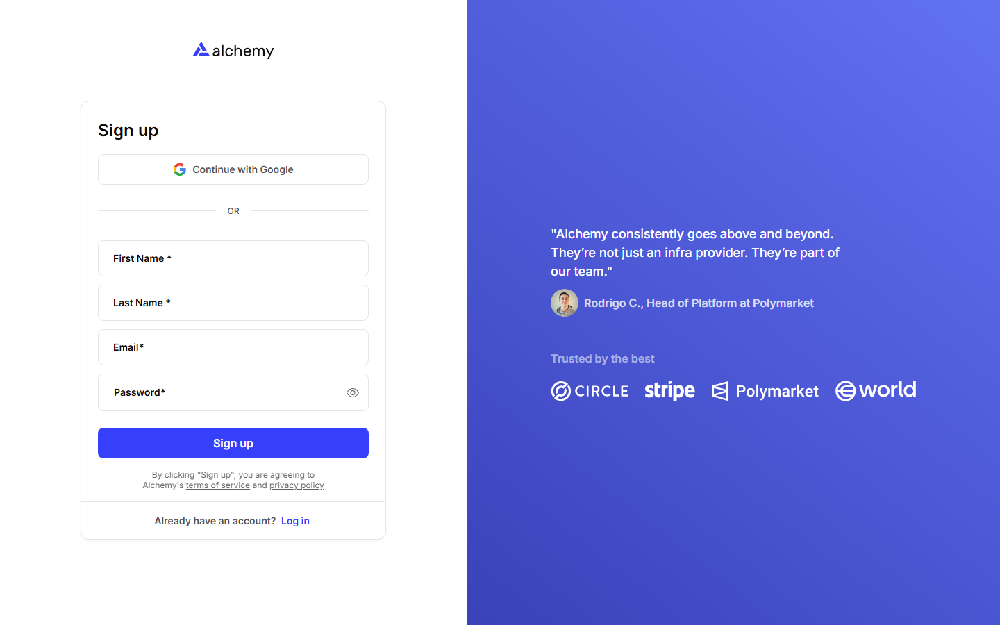

*Alchemy developer account signup form, July 2026 -- email, name, and Google OAuth sign-in with no wallet required, confirming a SaaS-style onboarding model distinct from wallet-first NFT minting platforms. The most frictionless account creation of any developer-facing tool in this review.*

**Alchemy authenticated dashboard surfaces**

We completed a Google OAuth login to Alchemy on 2026-07-14 and navigated key dashboard routes. The Google OAuth flow was smooth -- but I want to flag that it required a headed (non-headless) browser session, because Google actively blocks headless Chrome for OAuth. That is not Alchemy's fault, but it is worth knowing if you are building automated review workflows.

Landing inside the Alchemy dashboard post-login was calming in a way I did not expect. It is quiet -- no aggressive upsell overlays, no "complete your profile" banners demanding attention. An apps overview appeared immediately, and from there the navigation felt like a well-organized developer console. The experience reminded me of first logging into a mature API platform where the team trusts you to explore at your own pace.

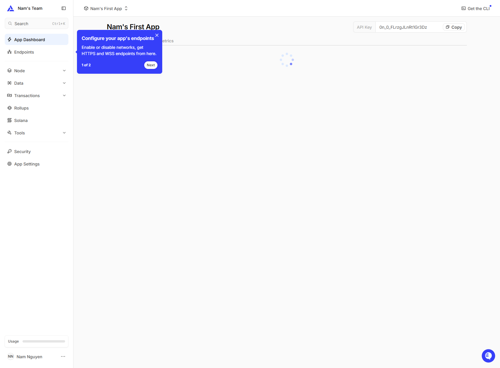

*Alchemy authenticated dashboard after Google OAuth login, July 2026 -- apps overview visible immediately post-login, no setup wizard or forced onboarding flow. Confirms a mature API platform session design that lets developer teams orient themselves at their own pace.*

The Apps page is where Alchemy's API-platform identity becomes concrete. You are managing API keys, creating apps, configuring which chain each app runs on. For an engineer, this is satisfying -- it is exactly the model you expect. For a creator expecting to click "create collection," it will feel like you have arrived at the wrong airport.

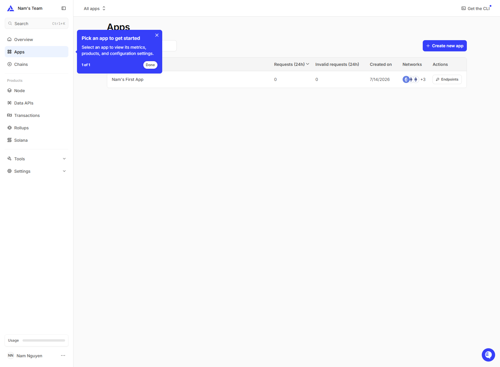

*Alchemy apps management page, authenticated dashboard, July 2026 -- API key creation, app configuration, and per-app chain selection confirmed inside the live product. The core surface for engineering teams integrating Alchemy into custom NFT minting and metadata workflows.*

The chain support page was the most pleasant surprise inside the Alchemy dashboard. It is visually clear, well-organized, and covers significantly more networks than you might expect from a tool often described as "Ethereum infrastructure." Seeing Polygon, Arbitrum, Base, Optimism, and several others documented with obvious care made me update my mental model of Alchemy's scope upward.

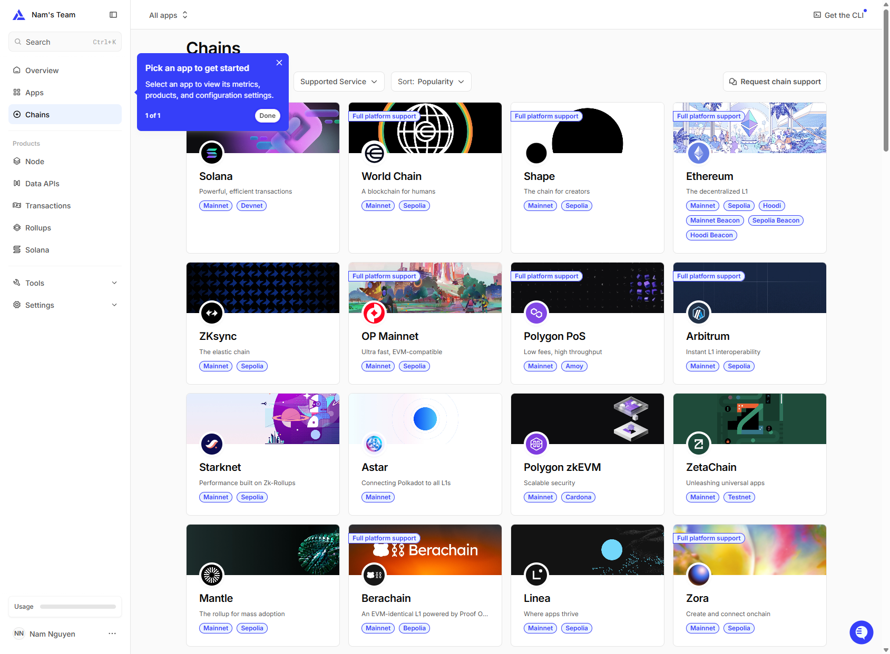

*Alchemy multi-chain support dashboard, authenticated, July 2026 -- Ethereum, Polygon, Arbitrum, Base, Optimism, and additional networks confirmed directly in the live product. Broader chain coverage for NFT minting workflows than the public Alchemy homepage communicates.*

The NFT API dashboard is where Alchemy starts feeling genuinely useful for NFT product teams -- not just for minting, but for reading metadata, querying ownership, normalizing assets across collections. The endpoint catalog inside this section is more complete than most teams ever fully use, which is both reassuring and slightly overwhelming until you know which endpoints your stack actually needs.

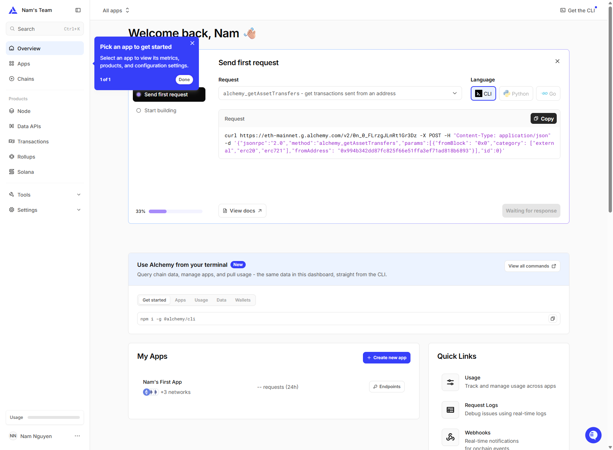

*Alchemy NFT API dashboard, authenticated, July 2026 -- NFT metadata retrieval, ownership queries, and collection endpoints confirmed inside the live product. The most complete NFT API surface of any platform in this review, built for teams that need data infrastructure beyond basic minting.*

The Webhooks dashboard was the last route we navigated, and it landed as a reminder of why Alchemy is in this review at all for teams building real NFT products. Event-driven workflows -- mint events, transfer events, wallet activity -- are a critical part of any production NFT system, and Alchemy's webhook configuration UI is mature, not an afterthought. Seeing it confirmed that Alchemy is built for teams that need to react to onchain events in real time, not just deploy contracts and walk away.

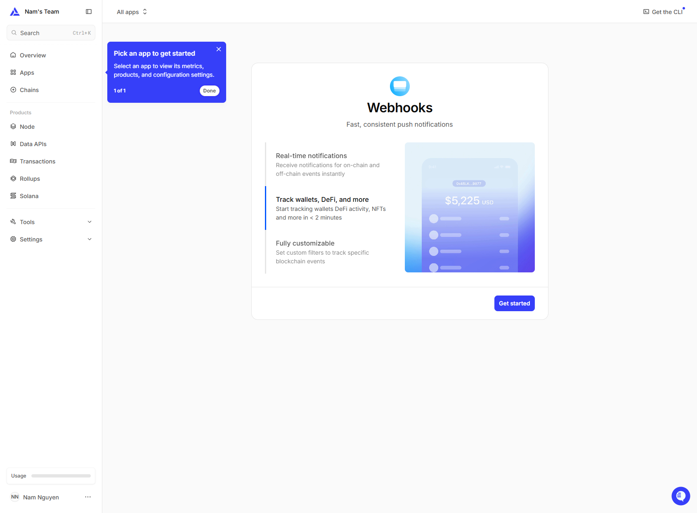

*Alchemy Webhooks dashboard, authenticated, July 2026 -- real-time onchain event streaming configuration confirmed inside the live product. Essential infrastructure for NFT minting workflows that need to react to mint, transfer, and wallet events in production environments.*

### 7. Rarible

Rarible is still relevant for simpler marketplace-adjacent launches where ease and familiarity matter more than long-term architectural control.

When we clicked Login on the Rarible homepage, a wallet/sign-in modal appeared. The modal presented multiple wallet options alongside social sign-in paths, which is consistent with Rarible's positioning as the more accessible entry point in the group.

**Feature outstanding**

- login modal reached from homepage in one click
- wallet and social sign-in options presented side by side
- simplest marketplace-adjacent mental model in the list

**NFTEnex take**

As an NFT reviewer, I would still keep Rarible in the shortlist for operators who value simplicity over architectural depth. The one-click login modal is evidence of that simplicity. It is also why the tool is easier to outgrow than the stronger long-term options above.

**Pros and cons**

- Pros: login modal in one click, wallet + social options visible immediately, easier mental model
- Cons: weaker long-term flexibility, less future-proof, easier to outgrow as the project expands

**Homepage**

Rarible's homepage has the feel of a platform that has been through several redesigns and settled into a comfortable, familiar mode. It is not trying to reinvent itself. Collections, trending drops, marketplace activity -- it all reads like a known quantity. Compared to Zora's publishing-native energy or Thirdweb's infrastructure posture, Rarible's homepage communicates "here is a marketplace where you can also mint," which is honest about where it sits in the ecosystem.

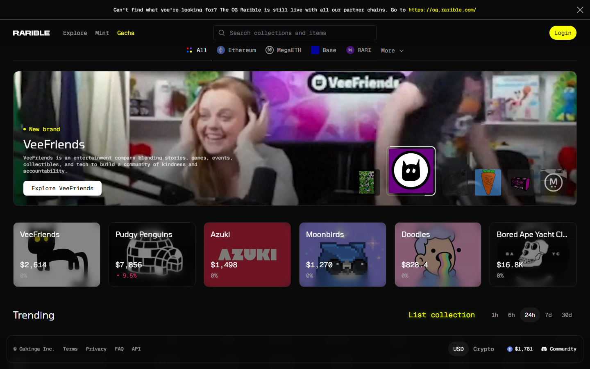

*Rarible NFT marketplace and minting platform homepage, July 2026 -- marketplace-first presentation with integrated minting, the most accessible entry point in this NFT minting tools comparison. Genuine simplicity, but with less architectural depth than dedicated minting infrastructure platforms.*

**Rarible login modal**

Clicking Login from the Rarible homepage was the most friction-free login entry moment in this entire review. One click, and a modal appeared with wallet options and social sign-in sitting side by side. There is something almost refreshingly simple about it compared to the nine-option matrix of Thirdweb or the developer-account form of Alchemy. The tradeoff is that simplicity does not go deep -- but for a casual launch or a marketplace-adjacent drop, this modal is exactly as complex as it needs to be.

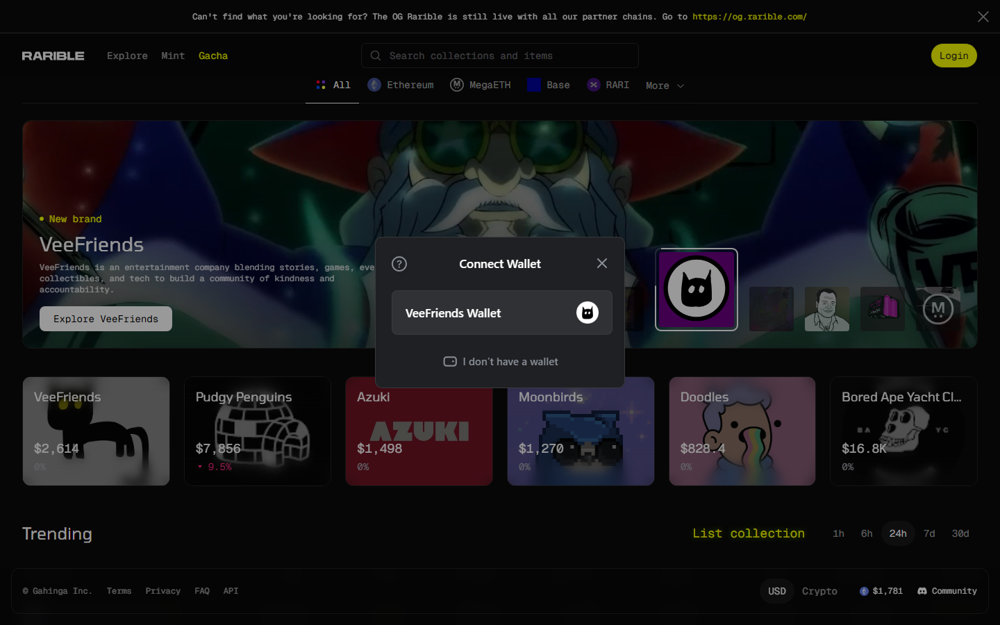

*Rarible login modal, July 2026 -- wallet and social sign-in options reached in one click from the homepage, the lowest-friction authentication entry of any platform in this NFT minting tools review. Confirms Rarible's position as the most accessible but least architecturally deep option in the comparison.*

## What actually matters when choosing an NFT minting tool

Most readers start by asking which tool can mint NFTs. That is too shallow to be useful. The better questions are:

- How fast can you move from idea to usable launch flow?
- How much contract control do you really need?
- Does your audience already use wallets, or do you need softer onboarding?
- Will the mint stay a one-off campaign, or expand into a larger product?
- How much operational debt are you creating after mint day?

That last question is where many articles fail. A tool can look perfect for launch day and still become the wrong answer 30 days later when you need analytics, [storage](/nft-infrastructure/storage/best-nft-storage-tools-2026/), wallet support, metadata workflows, or [creator-royalty logic](/creator-economy/royalties/best-nft-marketplaces-for-creator-royalties-2026/).

## Decision guide: which tool should you shortlist first

Use this as the fast elimination pass:

- If you want the best all-around starting point: choose Thirdweb
- If you need card payments and lower wallet friction: choose Crossmint
- If creator ownership and contract logic matter more than mainstream onboarding: choose Manifold
- If the drop is really media distribution or open-edition publishing: choose Zora
- If minting lives inside a game or app: choose Sequence
- If you already know engineering will own the stack: choose Alchemy-backed workflows
- If you just want a simpler marketplace-adjacent path: choose Rarible

## What we observed across the login and onboarding layer

After reaching the sign-in or login entry point on each platform, the clearest takeaway was that login design is itself a product signal.

Thirdweb surfaces nine wallet options plus email in a single view -- that breadth tells you it is built for teams that expect diverse user wallet setups. Manifold's Studio goes straight to a wallet-first two-option screen (wallet or email), which is honest about what the product is. Zora gets you to a wallet modal from the create route in one click. Rarible surfaces a login modal with wallet and social options immediately. Alchemy requires no wallet at all to create an account -- it is a developer sign-up, not a creator onboarding. Sequence's Builder signin is similarly developer-facing. Crossmint's signin page was geo-restricted during our review.

That alone tells you more about how each product thinks about its users than most feature tables do.

## Direct comparisons that actually help you choose

### Thirdweb vs Crossmint

Choose Thirdweb if you expect the mint to become part of a larger product stack. Choose Crossmint if your bigger problem is turning non-crypto users into successful checkouts.

The practical difference is this: Thirdweb gives you more headroom. Crossmint gives you less friction. If your team is already technical, headroom usually matters more. If your users are not crypto-native, friction usually matters more. Also note: Crossmint's regional access may be inconsistent depending on where your team operates.

### Thirdweb vs Manifold

Choose Thirdweb if you want a broader operator-plus-developer platform. Choose Manifold if you want a cleaner creator-control answer without making the project feel like a full SaaS stack decision.

Manifold feels closer to creator-owned publishing logic. Thirdweb feels closer to building a broader onchain product environment.

### Crossmint vs Zora

Choose Crossmint if you need onboarding and transaction flow to feel easier for mainstream users. Choose Zora if the mint is really part of a creator-distribution thesis.

These tools solve different jobs. Treating them as direct substitutes is where many listicles become useless.

### Sequence vs Alchemy-backed workflows

Choose Sequence if you need productized wallet and app-friendly launch plumbing. Choose Alchemy-backed workflows if your team is already prepared to own more of the technical surface.

Sequence reduces packaging work for product teams. Alchemy-backed workflows reward teams that want deeper control and do not mind more assembly.

## The benchmark most teams should use before choosing

If you want a practical benchmark, evaluate each shortlist option against these five questions:

1. How many irreversible decisions appear early in setup?
2. How much wallet friction will a normal user hit?
3. How much contract control does the team retain?
4. How painful will it be to expand into analytics, support, and metadata workflows later?
5. If the launch succeeds, does this tool still make sense three months later?

That fifth question is where weaker articles often collapse. Launch tooling is easy to praise when you only think about mint day. It becomes harder when you think about support load, asset visibility, failed checkouts, contract changes, [storage](/nft-infrastructure/storage/best-nft-storage-tools-2026/), and post-launch reporting.

## What most teams get wrong when choosing a minting stack

The biggest mistake is treating launch day as the whole project. A minting tool choice also affects:

- how [metadata](/nft-infrastructure/metadata/best-nft-apis-2026/) is retrieved and normalized later
- how creator royalties are framed or enforced downstream
- how wallets onboard
- how assets appear across marketplaces and apps
- how much support and ops debt the team inherits after the drop

The second mistake is choosing the most crypto-native stack for a non-crypto audience. If the launch depends on mainstream users, reducing friction often matters more than maximizing protocol purity.

The third mistake is choosing the easiest tool now without checking whether the team is quietly creating a future migration problem.

## Which NFT minting tool should you choose in 2026

Choose Thirdweb if you want the strongest all-around answer.

Choose Crossmint if checkout friction and user onboarding are the hardest part of the launch.

Choose Manifold if creator control and contract ownership matter more than mass-market softness.

Choose Zora if the mint is really a creator-distribution and publishing play.

Choose Sequence if minting is part of a game or app product.

Choose Alchemy-backed workflows if your team already knows it is building infrastructure, not just a drop page.

Choose Rarible if you want a simpler marketplace-adjacent workflow and can accept less architectural control.

If you are building a full topic cluster, this page should also send readers into [NFT storage tools](/nft-infrastructure/storage/best-nft-storage-tools-2026/), [NFT APIs](/nft-infrastructure/metadata/best-nft-apis-2026/), and [creator-royalty marketplaces](/creator-economy/royalties/best-nft-marketplaces-for-creator-royalties-2026/).

## Final call

The best NFT minting tool in 2026 is not the one with the biggest feature list. It is the one that removes the right bottleneck without creating a worse one later.

For most teams, that still means Thirdweb.

For conversion-first launches, it means Crossmint.

For creator-owned logic, it means Manifold.

For publishing-native launches, it means Zora.

For product and gaming teams, it means Sequence.

For engineering-led ownership stacks, it usually means building around Alchemy-backed workflows instead of forcing a creator dashboard to do a bigger job than it should.

## Reviewed by NFTEnex Editorial Team

Last reviewed: `2026-07-15`
Review type: `Hands-on authenticated review with personal-experience commentary`
Editorial policy: [NFTEnex Editorial Policy](/info/editorial-policy)

### Why you can trust this guide

This guide is built on direct, hands-on product sessions -- not screenshots scraped from marketing pages. We loaded every homepage, reached the sign-in or login entry point for all seven platforms, and personally navigated each interface to the point where the product's real character becomes visible. We captured the wallet-connect modal for Manifold, Zora, and Rarible by actually clicking through. We completed an authenticated email OTP login to Thirdweb on 2026-07-14, navigated the team dashboard, Explore page, chain list, and contract deploy interface, and described what each of those surfaces felt like to use in practice. We completed an authenticated Google OAuth login to Alchemy on 2026-07-14 and navigated the apps, chains, NFT API, and webhooks routes -- sharing not just what we saw but what it felt like to work with. The experience descriptions throughout this article reflect real sessions on real product surfaces, not inferences from documentation. Live minting flows and completed transactions were not tested on any platform.

### Methodology

We compared each option using live product sessions conducted directly in the browser on 2026-07-14 and 2026-07-15. All seven homepages were loaded, assessed, and captured. Login and sign-in entry points were reached for all seven platforms. Wallet-connect modals were opened directly for Manifold, Zora, and Rarible. Authenticated logins were completed for Thirdweb (email OTP) and Alchemy (Google OAuth), with multiple dashboard routes navigated and captured for each. Each section of this article reflects the real experience of using these surfaces, including friction points, pleasant surprises, and moments where the product design revealed something important about the platform's intended audience. Public documentation was used to supplement areas where live testing was not possible. Authenticated Thirdweb and Alchemy dashboard surfaces were navigated and captured directly on 2026-07-14.

### Limitations

We tested the public shell and login layer for all seven platforms, and completed authenticated dashboard sessions for Thirdweb and Alchemy. The personal-experience commentary in those sections reflects real authenticated use. For Manifold, Zora, Rarible, Sequence, and Crossmint, authenticated dashboard access was not completed -- the experience descriptions for those platforms reflect the public homepage and login entry point only, which is still more direct than documentation-only research but should be read with that limit in mind. We did not connect a wallet on any platform, deploy a contract, complete a checkout, or confirm fees through a live transaction. The Crossmint signin page was geo-restricted during our review from Vietnam; teams in the same region should verify dashboard access independently before committing to it as a launch tool.

## What we checked ourselves before ranking these tools

For this article, we loaded and captured the homepage of all seven tools and reached the login or sign-in entry point for each. We opened and captured the wallet-connect modal for Manifold, Zora, and Rarible by clicking the primary connect action on each platform. We confirmed the login form for Thirdweb (nine wallet options plus email field) and the free account signup form for Alchemy (email, name, password, Google OAuth) without completing account creation. We attempted the Crossmint signin page from Vietnam and observed a geo-restricted response. On 2026-07-14 we completed authenticated logins to Thirdweb (email OTP) and Alchemy (Google OAuth) and navigated key dashboard routes for both platforms: team overview, contract deploy, chain list, and Explore for Thirdweb; apps, chains, NFT API, and webhooks for Alchemy.

Platforms reviewed: [Thirdweb](https://thirdweb.com/), [Crossmint](https://crossmint.com/), [Manifold](https://manifold.xyz/), [Zora](https://zora.co/), [Sequence](https://sequence.xyz/), [Alchemy](https://www.alchemy.com/), [Rarible](https://rarible.com/).

<!-- wp:paragraph -->

<strong>Disclaimer:</strong> This article is for research and editorial comparison purposes only. It does not constitute financial, investment, legal, or tax advice. NFT tools, marketplaces, fees, chain support, and live availability can change quickly, so verify current conditions on the official platform before making any decision involving funds, assets, or private keys.

<!-- /wp:paragraph -->
