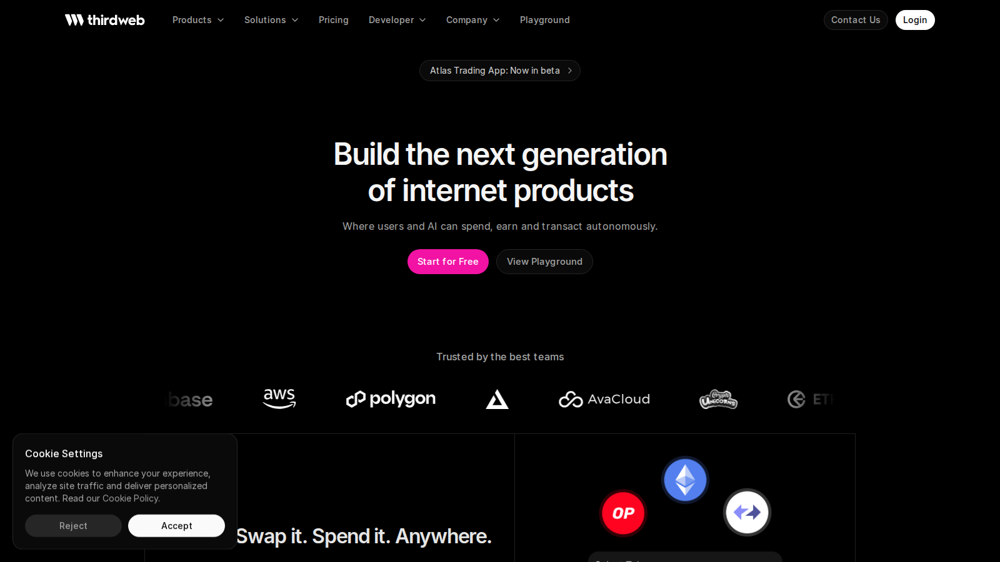
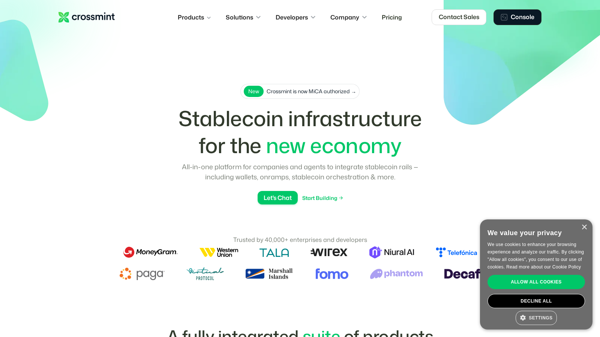
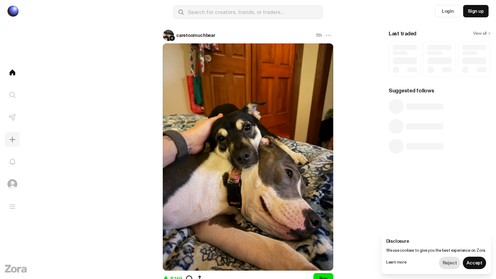

# Best NFT Minting Tools in 2026: 7 Platforms for Fast, Flexible Launches

If you want to launch an NFT collection in 2026, the best minting tool is not always the one with the most features. The best choice depends on whether you need a no-code drop, a branded checkout, deep developer control, or a stack that can scale into wallet, [storage](/nft-infrastructure/storage/best-nft-storage-tools-2026), and analytics workflows later.

The shortlist that makes the most sense in 2026 is Thirdweb, Crossmint, Manifold, Zora, Sequence, Alchemy-backed workflows, and Rarible's creator tooling. They do not solve the same problem, which is why most "best NFT minting tools" articles confuse readers by ranking everything as if it were interchangeable.

> Why you can trust this guide
>
> This draft is built from live ecosystem references and official product or documentation pages reviewed on 2026-07-10. Any fee, chain-support, checkout, or creator-control detail that may change is marked `[needs source]` for a final fact-lock pass before publication.

## The best NFT minting tools in 2026 are Thirdweb, Crossmint, Manifold, Zora, Sequence, Alchemy-backed workflows, and Rarible

For most teams, the best overall mix of speed and flexibility comes from Thirdweb. Crossmint is stronger if payment flow and mainstream onboarding matter more than crypto-native customization. Manifold still works well for creators who want control over smart contracts and storefront logic without turning the project into a full engineering build. Zora is the better fit for open-edition culture and creator-native distribution. Sequence is strongest when minting is part of a game or embedded wallet experience. Alchemy is less of a direct creator dashboard and more of an infrastructure layer, but it belongs in the conversation because many teams will build their minting flow on top of it. Rarible remains relevant for simpler creator workflows and marketplace-adjacent launches. `[needs source]`

Quick picks:

- Best for most teams: `Thirdweb`
- Best for mainstream checkout and payments: `Crossmint`
- Best for creator-controlled contracts: `Manifold`
- Best for open-edition culture and onchain creator distribution: `Zora`
- Best for game and embedded wallet environments: `Sequence`
- Best for infrastructure-heavy teams: `Alchemy-backed workflows`
- Best for simpler marketplace-linked launches: `Rarible`

## What we checked ourselves before ranking these tools

For this version of the article, we did not want to rely only on roundups and vendor copy, so we opened the live public product surfaces ourselves and captured the current creator-facing pages for Thirdweb, Crossmint, and Zora on 2026-07-10 using CloakBrowser.

That direct review does not replace a full logged-in mint test, and I do not want to blur that line. What it does give us is a real look at how each platform currently presents its launch flow, what kind of user it is speaking to, and how much complexity is visible before a team even creates a test collection. Any claim that depends on dashboard-only behavior, live checkout inside a mint, or post-mint asset handling is still marked `[needs source]` until the team runs a full collection test.

*Screenshot: our direct CloakBrowser capture of Thirdweb on 2026-07-10.*

*Screenshot: our direct CloakBrowser capture of Crossmint on 2026-07-10.*

*Screenshot: our direct CloakBrowser capture of Zora on 2026-07-10.*

The biggest difference we saw immediately was not feature count. It was posture. Thirdweb presented itself like infrastructure for teams that may grow into a broader stack. Crossmint looked more like a payments and onboarding bridge for mainstream users. Zora felt the most like a creator-publishing environment rather than a generic NFT vending machine. That difference matters because teams often choose a minting tool before they decide whether they are really launching a creator drop, a branded campaign, or a product layer.

## How we ranked NFT minting tools

The wrong way to judge a minting tool is to ask whether it can "mint NFTs." Nearly all serious tools can do that. The useful questions are:

- How much contract control do you get?
- How much developer work is required?
- Can non-crypto users pay with cards or familiar checkout methods?
- Does the stack support multiple chains?
- How cleanly does it connect to metadata, storage, wallet, and analytics workflows?
- Can a launch start small and still scale if the project grows?

That is why this list treats minting as part of a broader digital ownership pipeline rather than a one-click publishing step.

## Which minting tool is best for beginners, brands, and developer teams

Beginners usually need guardrails, templates, and less contract anxiety. That points them toward Thirdweb, Crossmint, or Rarible.

Brands and campaign teams usually care more about onboarding, checkout, and branded UX than they care about raw protocol purity. That pushes Crossmint, Sequence, and some Thirdweb setups higher.

Developer teams care about contract ownership, wallet integration, metadata handling, webhooks, and long-term flexibility. That is where Manifold, Alchemy-backed stacks, Thirdweb, and Zora become much more attractive.

The practical takeaway is simple: if you do not know whether you need a minting "tool" or minting "infrastructure," you are not ready to choose yet.

## Our direct editorial read after reviewing the live product flows

After opening these public launch surfaces ourselves, the clearest takeaway was that the best minting stack depends on what kind of friction you are trying to remove.

Thirdweb looked like the strongest option for teams that expect the mint to become part of a larger product later. Crossmint looked easier to explain to a non-crypto brand team because the value proposition is closer to onboarding and checkout. Zora looked more opinionated, but also more coherent, for creators who care about release culture and distribution identity rather than just spinning up a drop page as fast as possible.

That is the kind of balanced read I want this page to keep. A tool can be strong for one audience and still be the wrong answer for another. That is exactly what makes this a useful comparison instead of a vendor parade.

## Tool-by-tool review

### Thirdweb

Thirdweb is the most balanced option in this list because it can serve both non-technical operators and technical teams. Its main strength is not that it does one thing better than every competitor. Its strength is that it reduces the gap between a fast launch and a more custom stack later.

In the public flow we reviewed ourselves, Thirdweb immediately felt like the platform most comfortable with complexity. That is a strength if your team expects the mint to grow into memberships, game assets, or a fuller product stack. It is a weakness if you only want the shortest path between a concept and a lightweight drop.

Best for:

- teams that want speed without locking themselves into a toy workflow
- founders who need contracts, dashboards, and developer expansion in one place
- projects that may later expand into memberships, gaming assets, or tokenized access

Tradeoffs:

- if your main priority is mainstream checkout, Crossmint can be cleaner
- if your main priority is creator-first cultural distribution, Zora may feel more native
- if your team is new to NFT tooling, the extra range of options can feel like overhead before the real launch work begins

### Crossmint

Crossmint is strongest when minting needs to feel easy for users who do not already live in crypto wallets every day. That matters for brands, ticketing, loyalty, and onboarding flows where the "ownership" layer matters but wallet friction is still a conversion killer.

From the public product surface we reviewed, Crossmint felt more like an onboarding and payments company than a pure creator dashboard, and that is exactly why it ranks high here. If your biggest problem is reducing wallet friction for normal users, that framing is a feature. If your biggest problem is wanting contract-level experimentation, the same simplicity can become a limit.

Best for:

- consumer brands
- campaigns with card payments or simpler user onboarding
- teams trying to abstract away wallet complexity

Tradeoffs:

- it is not the first choice for teams that want maximum contract-level experimentation
- advanced crypto-native builders may outgrow it faster than they outgrow a more open stack
- if your launch needs to feel highly custom to crypto-native collectors, the smoother enterprise posture may not be enough on its own

### Manifold

Manifold remains a strong creator and contract-control choice because it starts from ownership and publishing logic rather than from a broad SaaS feature set. That is useful for artists, creator-led drops, and teams that care about provenance and direct contract relationships.

Best for:

- creator-led releases
- teams that want more direct contract ownership logic
- launches where artistic control matters more than mass onboarding convenience

Tradeoffs:

- it is not the smoothest path for mainstream payments-first launches
- some teams will still need adjacent tooling for broader campaign infrastructure

### Zora

Zora is best understood as part minting environment, part creator-distribution layer. It is especially useful when the launch is not only about selling a fixed collection, but also about building culture, open editions, or onchain media distribution.

After reviewing Zora's live public surface directly, our strongest impression was that it behaves less like a generic launch utility and more like a creator-publishing system. That makes it more opinionated than some alternatives, but also more coherent if the goal is cultural distribution rather than pure operational convenience.

Best for:

- open editions
- creator communities
- projects where cultural distribution matters as much as monetization

Tradeoffs:

- teams that want enterprise-like control panels may prefer more operationally structured tooling
- if you need the cleanest traditional onboarding, Zora is not always the easiest answer
- teams running a tightly controlled brand campaign may prefer a more neutral infrastructure layer

### Sequence

Sequence stands out when minting is only one part of a broader product. If the end state is a game, embedded wallet flow, or digital asset system inside an app, Sequence becomes more compelling than a creator-only minting dashboard.

Best for:

- gaming NFTs
- embedded wallet products
- projects where users should not feel like they are navigating a crypto-native flow

Tradeoffs:

- overkill for a simple artist drop
- less relevant if you only need a fast collection launch and nothing else

### Alchemy-backed workflows

Alchemy belongs in this article because many teams will not use a single "minting tool" at all. They will build a minting experience from infrastructure components. Alchemy's ecosystem pages on minting and analytics make it clear that the workflow landscape is broader than one dashboard choice. `[needs source]`

Best for:

- teams with in-house engineering
- projects that want to own more of the stack
- products that will need analytics, APIs, and multistage infrastructure later

Tradeoffs:

- not the shortest path for a solo creator
- requires more technical judgment than turnkey creator tools

### Rarible

Rarible stays relevant because some creators still want a path that sits closer to marketplace distribution and familiar creator tooling without building a custom launch stack.

Best for:

- lighter-weight creator launches
- teams that want simpler publishing flow
- operators who value ecosystem familiarity over deep architecture decisions

Tradeoffs:

- less attractive for highly customized launches
- less future-proof than a stack built around dedicated infra plus owned distribution

## What most teams get wrong when choosing a minting stack

The biggest mistake is treating launch day as the whole project. A minting tool choice also affects:

- how [metadata](/nft-infrastructure/metadata/best-nft-apis-2026) is stored and retrieved across apps
- how [creator royalties](/creator-economy/royalties/best-nft-marketplaces-for-creator-royalties-2026) are set or enforced `[needs source]`
- how wallets onboard
- how assets appear on marketplaces
- how easy it is to build reporting and support workflows later

The second mistake is choosing the most crypto-native stack for a non-crypto audience. If the project depends on mainstream users, lowering friction often matters more than maximizing protocol purity.

The third mistake is choosing the easiest tool without checking whether the team actually owns the contract logic, metadata path, and post-mint operating model.

## Which tool should you choose in 2026

Choose Thirdweb if you need the best overall middle ground.

Choose Crossmint if onboarding and payments are the hardest problem in your launch.

Choose Manifold if creator control and contract ownership matter most.

Choose Zora if your launch is really a creator-distribution play.

Choose Sequence if minting is part of a game or app product.

Choose an Alchemy-backed stack if you are building infrastructure, not just a drop page, especially if the product will later depend on [NFT APIs](/nft-infrastructure/metadata/best-nft-apis-2026), retrieval logic, or internal analytics layers.

Choose Rarible if you want a simpler creator workflow and can live with less architectural control.

If you are building a full topic cluster, this page should also feed readers into your broader [minting hub](/nft-infrastructure/minting), your guide to [NFT storage tools](/nft-infrastructure/storage/best-nft-storage-tools-2026), and your comparison of [creator-royalty marketplaces](/creator-economy/royalties/best-nft-marketplaces-for-creator-royalties-2026).

## What we still need to measure in the live mint test

To turn this page from a strong editorial comparison into a fully hands-on review, the next pass should run one real collection workflow across the shortlisted tools. That means timing how long it takes to move from account creation to a first test collection, recording how many steps appear before mint confirmation or checkout, and capturing how the asset appears inside a wallet or marketplace once the mint is complete `[needs source]`.

The key point is that the final publish version should replace vague adjectives such as "easy" or "fast" with measured observations. If the team says one flow is simpler, it should be able to show how long it took, what broke, and how many decisions had to be made before the mint succeeded.

| Tool | Test setup time | Time to first test mint | No-code depth | Checkout options | Contract control level | Best for |
|---|---|---|---|---|---|---|
| Thirdweb | `[needs live test]` | `[needs live test]` | High | `[needs source]` | High | Teams that may expand into a broader stack |
| Crossmint | `[needs live test]` | `[needs live test]` | Medium-High | `[needs source]` | Medium | Brands and mainstream onboarding |
| Manifold | `[needs live test]` | `[needs live test]` | Medium | `[needs source]` | High | Creator-led contract control |
| Zora | `[needs live test]` | `[needs live test]` | Medium | `[needs source]` | Medium | Creator publishing and open editions |
| Sequence | `[needs live test]` | `[needs live test]` | Medium | `[needs source]` | Medium-High | Game and embedded-wallet products |
| Alchemy-backed workflows | `[needs live test]` | `[needs live test]` | Low | `[needs source]` | High | Infrastructure-led teams |
| Rarible | `[needs live test]` | `[needs live test]` | Medium | `[needs source]` | Medium | Simpler creator launches |

## Editor source checklist

- verify which chains each platform currently supports
- verify card-payment and onboarding claims for Crossmint and Sequence
- verify contract ownership and creator-tool details for Manifold and Zora
- verify Alchemy ecosystem references and active tool listings
- verify current creator fee or royalty behavior where launch configuration affects earnings

## Recommended external links

- [Alchemy: NFT minting tools](https://www.alchemy.com/dapps/best/nft-minting-tools)
- [thirdweb](https://thirdweb.com/)
- [Crossmint](https://www.crossmint.com/)
- [Manifold](https://www.manifold.xyz/)
- [Zora](https://zora.co/)
- [Sequence](https://sequence.xyz/)
- [Rarible](https://rarible.com/)

## Media used in this draft

This version already uses original CloakBrowser captures stored in:

- `nftenex/media/thirdweb-home.png`
- `nftenex/media/crossmint-home.png`
- `nftenex/media/zora-home.png`

For the final publish version, the team should add one more layer of original evidence from the real test run: a logged-in dashboard screenshot, one mint setup screen, one checkout or mint confirmation screen, and one screenshot showing the minted asset inside a wallet or marketplace `[needs source]`.
