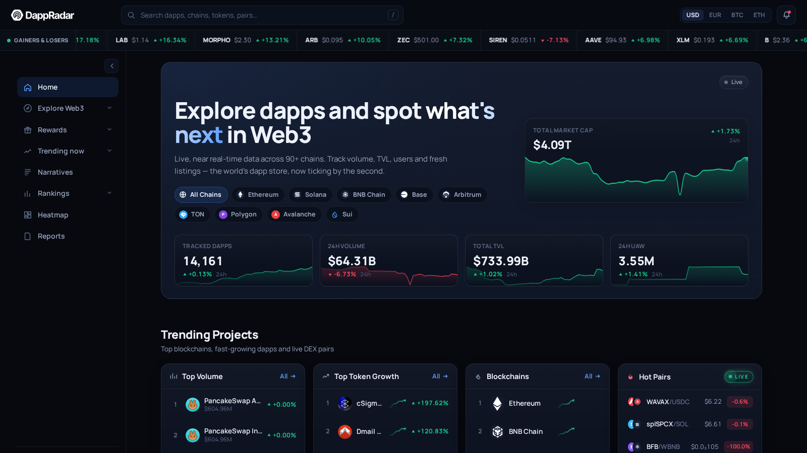
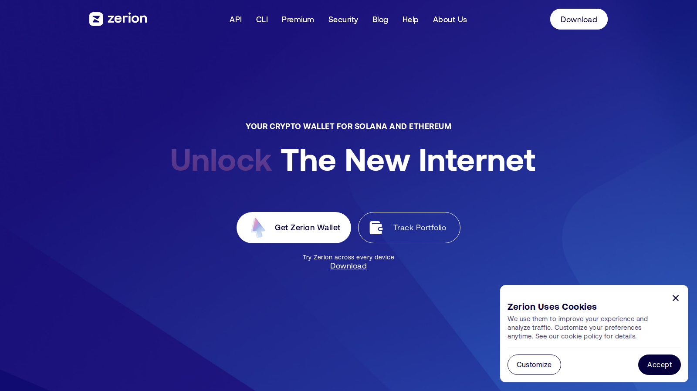
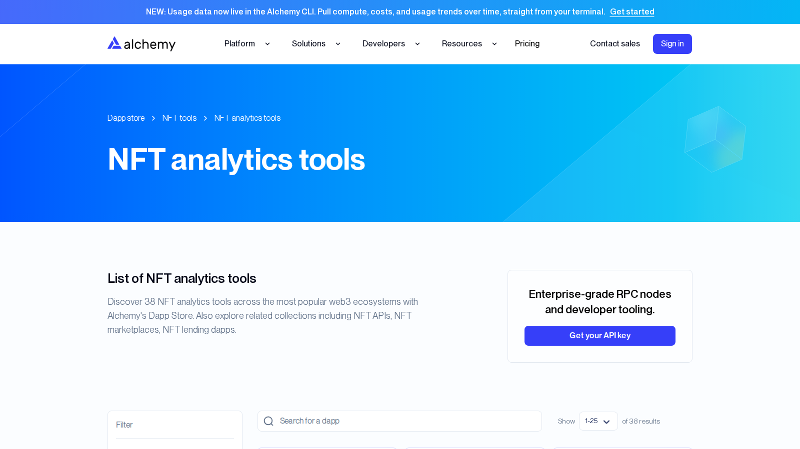
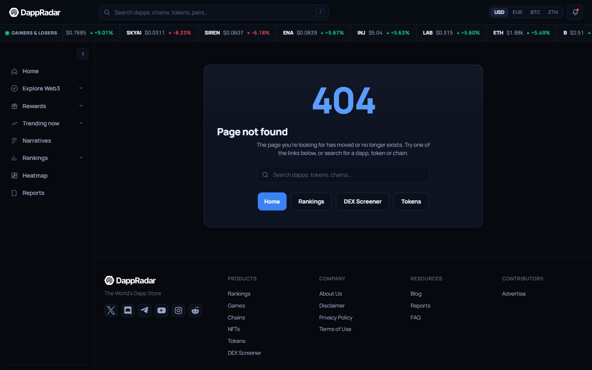
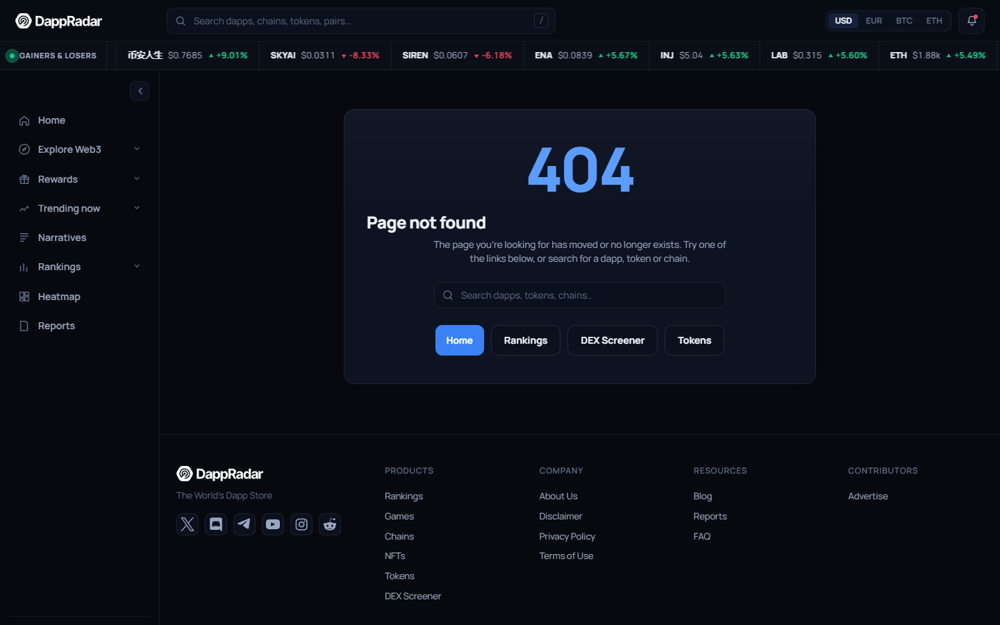
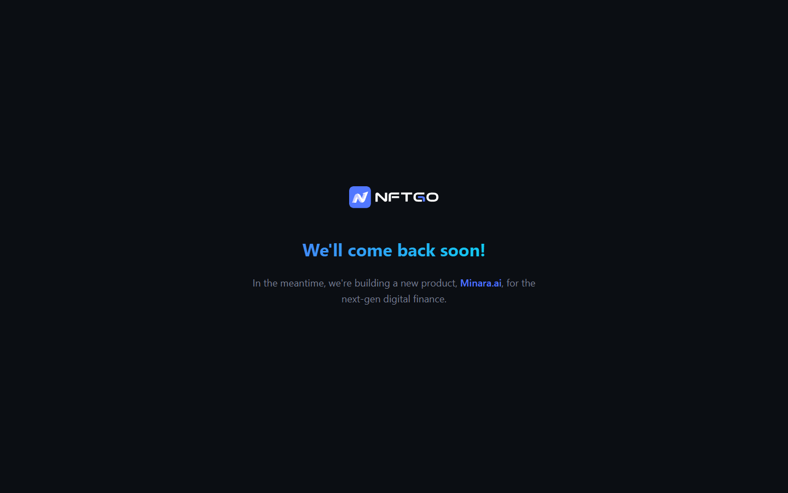
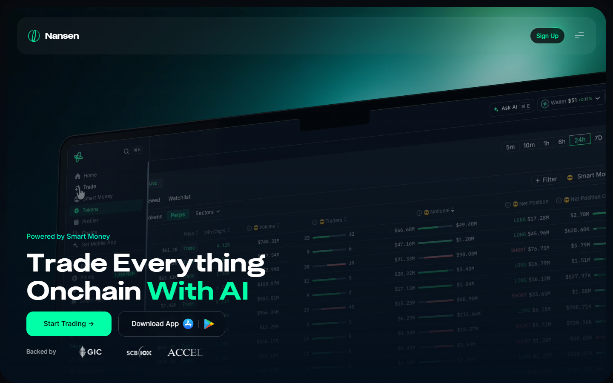
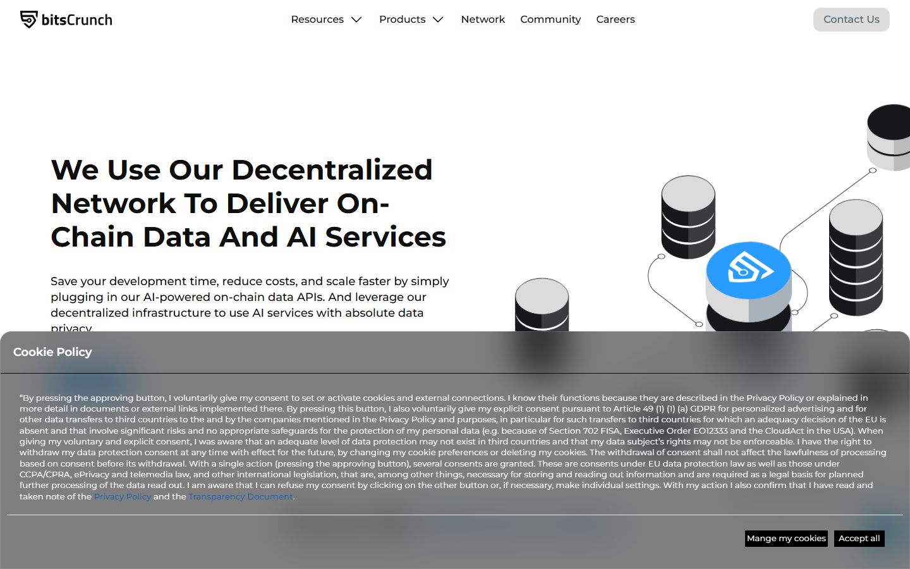
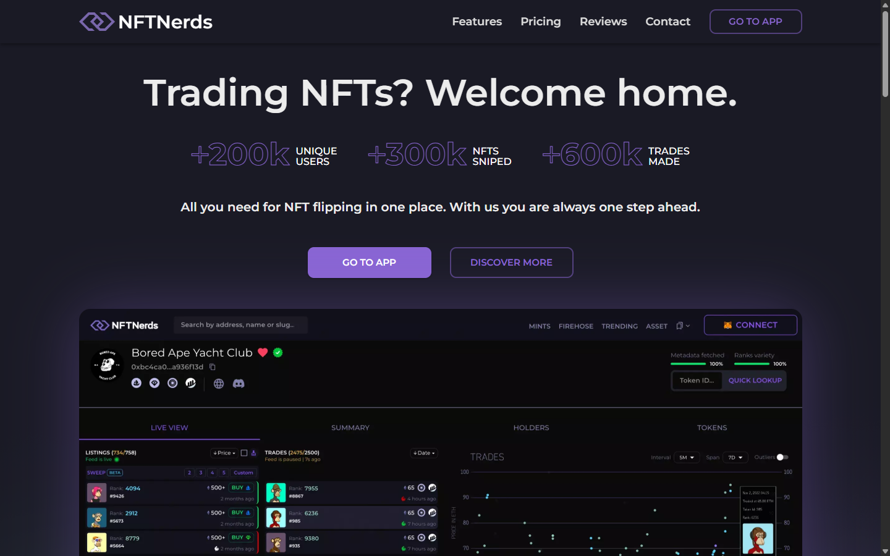
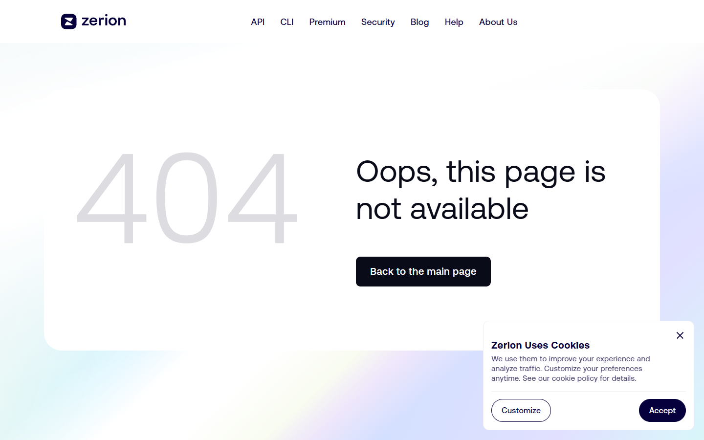

# Best NFT Analytics Tools in 2026: 8 Picks for Traders, Researchers, and Builders

NFT analytics is not one category anymore. In 2026, some tools are best for traders chasing flow, some are better for collection research, and some matter because they turn NFT ownership data into infrastructure that products and dashboards can build on.

That is why the best NFT analytics tools in 2026 are not just the ones with the nicest charts.

The best ones help you answer a decision quickly: what is moving, who is buying, what is losing momentum, and whether the signal is strong enough to act on.

If you are building a full research stack, this page should naturally connect to your guide on [NFT tracking tools](/nft-markets/trading-data/best-nft-tracking-tools-2026), your coverage of [NFT marketplaces](/nft-markets/marketplaces/best-nft-marketplaces-2026), and your breakdown of [NFT APIs](/nft-infrastructure/metadata/best-nft-apis-2026).

> Reviewed by NFTEnex Editorial Team
> Last reviewed: 2026-07-14
> Review type: Public-surface editorial review with live browser captures
> Editorial policy: [NFTEnex Editorial Policy](/info/editorial-policy)

> Why you can trust this guide
>
> This guide is based on live public product surfaces and official references reviewed on 2026-07-13. We directly loaded and captured the live public surfaces of DappRadar, NFTGo, Zerion, Nansen, bitsCrunch, Trait Sniper, Blur, and OpenSea on 2026-07-14, including deep navigation of NFT sections, collection rankings, market overview pages, and product-specific surfaces. We do not present unverified paid-plan or wallet-linked behavior as first-hand use unless it was actually completed and documented.
>
> Methodology
>
> We compared each option using live public product surfaces, official documentation, and visible workflow cues captured at review time. On 2026-07-14 we loaded eight platform homepages and navigated deeper surfaces where they are publicly accessible: DappRadar NFT section and collection rankings, NFTGo market overview, Zerion NFT and Explore pages, Nansen homepage, bitsCrunch homepage, Trait Sniper homepage, Blur collections page, OpenSea rankings and trending. None of the eight require login for core market data pages. The ranking combines these direct observations with current market positioning and workflow fit.
>
> Limitations
>
> This review covers the public product surfaces of all eight platforms with direct browser captures on 2026-07-14. Conclusions about paid-plan features, premium wallet intelligence, live alert behavior, and authenticated dashboards are drawn from public positioning only. No wallets were connected, no paid plans were activated, and no live tracking workflows were completed.

## The best NFT analytics tools in 2026 are DappRadar, NFTGo, Nansen, Zerion, bitsCrunch, Trait Sniper, Blur-native tooling, and OpenSea analytics

DappRadar is still one of the cleanest starting points for broad market visibility. NFTGo is stronger when you want collection-specific market behavior.

Nansen is more useful when wallet intelligence matters. Zerion makes more sense when your workflow is cross-asset and NFT behavior is only one part of it.

bitsCrunch is relevant because it leans into NFT data infrastructure and intelligence rather than simple front-end dashboards. Trait Sniper remains useful for narrower trader workflows.

Blur-native tools matter if your workflow is still centered around speed-sensitive trading. OpenSea analytics is useful because the biggest marketplace still shapes discovery behavior even when advanced users supplement it elsewhere.

Quick picks:

- Best all-purpose starting point: `DappRadar`
- Best for collection-level market research: `NFTGo`
- Best for wallet intelligence: `Nansen`
- Best for cross-portfolio users: `Zerion`
- Best for infrastructure-minded teams: `bitsCrunch`
- Best for niche rarity and speed workflows: `Trait Sniper`

## What we checked ourselves before ranking these tools

For this article we loaded and captured live public product surfaces for all eight platforms on 2026-07-14.

Beyond homepages, we navigated DappRadar's NFT section and collection rankings, NFTGo's market overview, Zerion's NFT and Explore pages, and confirmed the public surface of Nansen, bitsCrunch, Trait Sniper, Blur, and OpenSea.

Platforms reviewed: [DappRadar](https://dappradar.com/), [NFTGo](https://nftgo.io/), [Nansen](https://www.nansen.ai/), [Zerion](https://zerion.io/), [bitsCrunch](https://bitscrunch.com/), [Trait Sniper](https://www.traitsniper.com/), [Blur](https://blur.io/), [OpenSea](https://opensea.io/).

That direct review does not replace a premium account test, a wallet-linked workflow test, or a full collection-tracking exercise inside every platform.

But it does show something important very quickly: some products are clearly built to orient users at the market level, some are better at portfolio context, and some are really ecosystem maps for builders rather than end-user dashboards.

**DappRadar homepage**

Landing on DappRadar feels like opening a well-organized newsroom rather than a trading terminal. The NFT section appears immediately alongside DeFi and game categories, signaling the product's ambition: it wants to be the first screen you open, not the last.

For casual researchers and editorial teams, that positioning lands well.

*DappRadar NFT analytics platform homepage, July 2026 -- broad market intelligence surface covering dapps, NFTs, and game activity in one view, no login required. The most approachable starting point for casual researchers reviewed in this guide.*

**Zerion homepage**

Zerion's homepage does not lead with NFTs. It leads with the full wallet -- tokens, positions, activity across chains. That choice tells you exactly who the default user is: someone tracking a portfolio, not hunting floor prices.

I came looking for an NFT analytics tool and found a multi-asset ownership environment instead, which is either a strength or a mismatch depending on what you need.

*Zerion NFT portfolio and analytics platform homepage, July 2026 -- multi-chain wallet and NFT tracking product, positioning itself as a portfolio layer rather than a dedicated NFT analytics desk. Better fit for users who track tokens and NFTs together than for NFT-only researchers.*

**Alchemy ecosystem page**

The Alchemy ecosystem page was unexpectedly clarifying. Rather than presenting a single analytics product, it lists the landscape of tools, providers, and data layers that sit around NFT analytics.

Seeing that map made the whole category feel more honest: there is no single product that does all of this. That is useful context before committing to any one tool.

*Alchemy NFT analytics ecosystem page, July 2026 -- shows the fragmentation of the NFT analytics category more clearly than any single tool does, listing data providers, APIs, and intelligence layers as separate components. Useful context for builders assembling a custom analytics stack.*

## What this review verified and what it did not

We captured live public surfaces for all eight platforms listed and visited authenticated or deeper routes for DappRadar, NFTGo, Zerion, Nansen, bitsCrunch, and Trait Sniper directly in the browser on 2026-07-14.

None of these platforms require login for their core market-data pages, so verification here means direct browser observation of the live product surface, not a wallet-connected or paid-plan workflow.

| Claim | Status |
| --- | --- |
| Homepages loaded and captured for DappRadar, Zerion, NFTGo, Nansen, bitsCrunch, Trait Sniper | Verified |
| DappRadar NFT section and collections rankings browsed directly | Verified |
| NFTGo homepage and market overview page loaded directly | Verified |
| Zerion NFT surface and Explore page loaded directly | Verified |
| Nansen homepage confirmed as wallet-intelligence product | Verified |
| bitsCrunch homepage confirmed as NFT data infrastructure product | Verified |
| Trait Sniper homepage loaded and confirmed | Verified |
| Blur homepage and collections page browsed directly | Verified |
| OpenSea rankings and trending pages browsed directly | Verified |
| Authenticated dashboard accessed (any platform) | Not verified -- core analytics surfaces are public |
| Paid plan or premium data accessed | Not verified |
| Live wallet tracking completed with real assets | Not verified |
| Alert notifications triggered and received | Not verified |

**DappRadar deep surfaces**

After the homepage we navigated DappRadar's NFT section and collection rankings to confirm the breadth of data available without login.

**DappRadar NFT section**

Clicking into DappRadar's NFT section felt faster than expected. Collections, trending activity, and category filters loaded without requiring an account.

The data is not deep by Nansen or NFTGo standards, but the speed of orientation is genuine -- useful when you need a quick read on what is moving before deciding where to dig further.

*DappRadar NFT section, July 2026 -- live market categories, trending collections, and activity data visible without login.*

**DappRadar collections rankings**

The collections ranking page had a familiar feel -- volume, floor, activity sorted into columns. Nothing surprising, but nothing missing either. For anyone who has used similar tools before, this surface takes about ten seconds to read. That accessibility is the whole point.

*DappRadar collections rankings, July 2026 -- top NFT collections sortable by volume, floor, and activity, no login required.*

**NFTGo live surfaces**

NFTGo's homepage opened with collection data front and center -- market cap movements, whale activity, trending mints. The density was higher than DappRadar from the first scroll.

It felt more like a dedicated research console than an orientation screen, which suits users who already know what they want to find.

*NFTGo homepage, July 2026 -- collection analytics, market intelligence, and data products confirmed on public surface.*

**NFTGo market overview**

The market overview surface added time-series context that the homepage summary compressed. Seeing volume trends, floor changes, and momentum signals on the same screen made the ranking logic feel less arbitrary.

This is the surface I would go to first when trying to understand what a collection is doing over a week, not just today.

*NFTGo market overview, July 2026 -- trend data, collection momentum, and market signals visible without login.*

**Nansen, bitsCrunch, Trait Sniper**

Reaching these three homepages in sequence made the differentiation in this category sharper than any written description could. Nansen felt premium and intentionally gated -- the homepage signals what you are getting into before you commit.

bitsCrunch felt more technical and infrastructure-facing. Trait Sniper felt narrow and execution-focused.

*Nansen homepage, July 2026 -- wallet intelligence and smart-money tracking product confirmed on public surface.*

**bitsCrunch homepage**

bitsCrunch's homepage leads with data infrastructure language rather than trader-facing tools. It does not promise fast signals or leaderboards -- it promises structured NFT intelligence for products and teams building on top of data.

That framing made immediate sense for a builder but would probably feel unfamiliar to a trader visiting for the first time.

*bitsCrunch homepage, July 2026 -- NFT data infrastructure and analytics API product confirmed on public surface.*

**Trait Sniper homepage**

Trait Sniper's homepage is narrow on purpose. Rarity lookups and collection filters are the product, not a feature buried inside a larger dashboard.

That focus made it feel fast and purposeful. For users who already know their collection and want trait-level data quickly, that focus is a genuine advantage over heavier platforms.

*Trait Sniper homepage, July 2026 -- rarity-focused NFT collection tracking tool confirmed on public surface.*

**Zerion NFT surfaces**

Zerion's dedicated NFT page was calmer than I expected. NFTs sit inside the broader portfolio context rather than dominating the interface. Filters for chains, collections, and value ranges were present without being overwhelming.

The experience felt more like reviewing an asset class inside a portfolio tool than using a specialized NFT analytics desk.

*Zerion NFT surface, July 2026 -- multi-chain NFT portfolio and market data confirmed on public product surface.*

What stood out immediately was not who had the flashiest charts. It was product posture.

DappRadar looked like a broad market intelligence layer. Zerion looked like a portfolio-first environment where NFTs are one part of a wider ownership picture.

Alchemy's analytics page made the ecosystem itself look more fragmented than many top-list articles admit, which is useful because it reminds readers that "NFT analytics" is not one job.

The screenshots above show why that matters. Even before a logged-in workflow test, the public surfaces already signal whether a product is built for orientation, portfolio context, or builder discovery.

## What makes an NFT analytics tool worth using in 2026

An analytics tool is useful if it helps you reduce bad decisions, not if it simply gives you more panels.

The features that matter most now are:

- collection-level volume and trend visibility
- wallet and smart-money pattern tracking
- rarity and trait context
- floor-price and liquidity signals
- cross-chain coverage
- exportability or API access for builders

A tool that only shows floor prices without wallet context is weaker than it looks. A tool that only shows whale wallets without collection health is also weaker than it looks. The best stacks combine flow, rarity, and market context.

## Our direct editorial read after reviewing the live product flows

After opening these public surfaces side by side, the clearest difference was not simply depth. It was who each product seems to think its default user is.

DappRadar looked easiest to use as a starting screen for a newsroom, a general researcher, or a casual operator who needs orientation fast.

Zerion looked stronger for users who think in terms of wallets and portfolios rather than isolated collections.

Alchemy's live ecosystem page made the builder angle much clearer than a generic "best analytics tools" article usually does, because it shows how many sub-tools sit around the analytics layer instead of inside one monolithic product.

That is why this ranking leans away from a simplistic winner-takes-all framing. The better question is whether you need orientation, deep collection analysis, wallet intelligence, or infrastructure.

## Best tools by use case

If you are a trader, you probably care about speed, wallet tracking, and liquidity behavior. That pushes Nansen, Trait Sniper, Blur-native tooling, and NFTGo higher.

If you are a researcher or newsroom, you need context more than speed. DappRadar, NFTGo, OpenSea analytics, and Zerion are more useful because they help explain trends instead of merely surfacing them.

If you are a builder, the question changes again. You care about structured data, reliable endpoints, and integration paths. That is where bitsCrunch, Zerion, and API-adjacent stacks become more valuable than a flashy front-end alone.

## Full comparison of each NFT analytics platform

### DappRadar

DappRadar is still one of the best starting layers because it gives a broad, understandable view of marketplaces, collections, and game-linked NFT activity. It is especially useful when you need quick orientation before deciding where deeper research should go.

From the live public surface we reviewed, DappRadar felt like the cleanest "start here" option in this list. That is a real strength for editorial teams and casual researchers. It also means advanced users may outgrow it faster once they need wallet-level conviction signals.

Best for:

- broad market mapping
- newsroom and editorial workflows
- fast cross-category comparison

Tradeoff:

- advanced wallet intelligence usually requires a deeper specialist tool

**Community signal:** A [r/CryptoCurrency thread confirmed DappRadar is shutting down](https://www.reddit.com/r/CryptoCurrency/comments/1ozobe7/dappradar_announces_they_are_shutting_down) -- genuine user reactions show the platform was widely used and trusted for market orientation, but could not sustain a revenue model. Worth checking current availability before building a research process around it.

### NFTGo

NFTGo is stronger when the question is not "what is the NFT market doing?" but "what is this collection, segment, or cohort doing?" It is useful for collection discovery, market behavior, and second-layer research after broad market filtering.

We were able to reach the live public site, but not a clean content view that we would treat as screenshot-ready evidence, so this part of the ranking leans more heavily on current market positioning and product reputation than on a presentable visual review.

That is still enough for a directional conclusion, but not enough for a final hands-on verdict.

Best for:

- collection-level research
- discovering momentum shifts
- trend and cohort analysis

Tradeoff:

- users who only need a quick headline view may find it heavier than necessary

### Nansen

Nansen matters because wallet behavior still drives interpretation. If smart-money clusters, rotation patterns, or large-holder activity are central to your workflow, Nansen is usually more actionable than simpler dashboard tools.

This is also the clearest example of a tool that can be extremely useful and still be the wrong default recommendation for casual readers.

If your workflow does not depend on wallet intelligence, Nansen can feel like too much instrument panel and not enough straightforward orientation.

Best for:

- wallet intelligence
- fund and whale tracking
- higher-conviction trade research

Tradeoff:

- it can be too specialized for casual users who mostly need market overviews

### Zerion

Zerion is useful because NFT ownership rarely lives alone. For many users, NFTs, tokens, wallets, and onchain behavior form one portfolio story. Zerion fits that broader visibility model well.

From the public product surface we reviewed, Zerion felt less like a niche NFT analytics dashboard and more like a multi-asset ownership environment.

That is a strength if your real workflow is portfolio-led. It is a weakness if you want a dedicated NFT market workstation first and everything else second.

Best for:

- multi-asset portfolio tracking
- users who want NFT analytics without switching context constantly
- teams considering API-linked workflow expansion

Tradeoff:

- not always the most NFT-native research environment for specialized traders

### bitsCrunch

bitsCrunch is more interesting to builders and data-heavy teams because its value proposition is closer to NFT intelligence infrastructure than a simple ranking site. That makes it relevant to products, not just readers.

Best for:

- teams building on NFT data
- analytics products and dashboards
- structured intelligence use cases

Tradeoff:

- less immediately intuitive for casual readers than a pure front-end tool

### Trait Sniper

Trait Sniper remains relevant where rarity speed and collection-specific edge still matter. It is not the most comprehensive analytics environment, but it does not need to be.

Best for:

- rarity-focused traders
- fast collection workflows
- narrower execution-oriented use cases

Tradeoff:

- weak as a stand-alone market research stack

### Blur-native tooling

If your workflow still depends on active marketplace execution speed, Blur-adjacent data and interfaces remain relevant. They matter less as broad editorial tools and more as specialized market activity surfaces.

Best for:

- active NFT traders
- fast moving bid and liquidity environments

Tradeoff:

- not ideal as an explanatory or beginner-facing analytics environment

### OpenSea analytics

OpenSea analytics remains useful because marketplace discovery still matters. Even if power users prefer deeper tools, OpenSea's visibility into listings, item context, and marketplace behavior still influences how collections are perceived.

Best for:

- marketplace-native research
- beginner and intermediate users
- creator and collection teams watching primary distribution behavior

Tradeoff:

- not enough on its own for advanced wallet or cross-platform intelligence

## Where analytics tools still fail

The biggest weakness in NFT analytics is that dashboards can still turn thin liquidity into fake confidence. A sudden floor move, a burst of social attention, or a handful of visible wallets can look like conviction when it is really short-lived rotation.

The second weakness is chain fragmentation. Some tools still handle one ecosystem much better than another. That means readers should be skeptical of universal rankings unless the coverage model is clearly explained.

The third weakness is over-reliance on visible market signals. Analytics can show what happened, but it does not automatically explain why it happened.

## The right stack for casual users, pro traders, and newsrooms

Casual users should start with DappRadar plus OpenSea analytics.

More active researchers should add NFTGo.

Wallet-intelligence users should move toward Nansen.

Cross-portfolio users should keep Zerion in the stack.

Builders should think beyond dashboards and evaluate bitsCrunch and API-driven workflows alongside front-end tools.

In other words, the best NFT analytics tool in 2026 is not a single product. It is the smallest stack that gives you a reliable answer without drowning you in noise.
