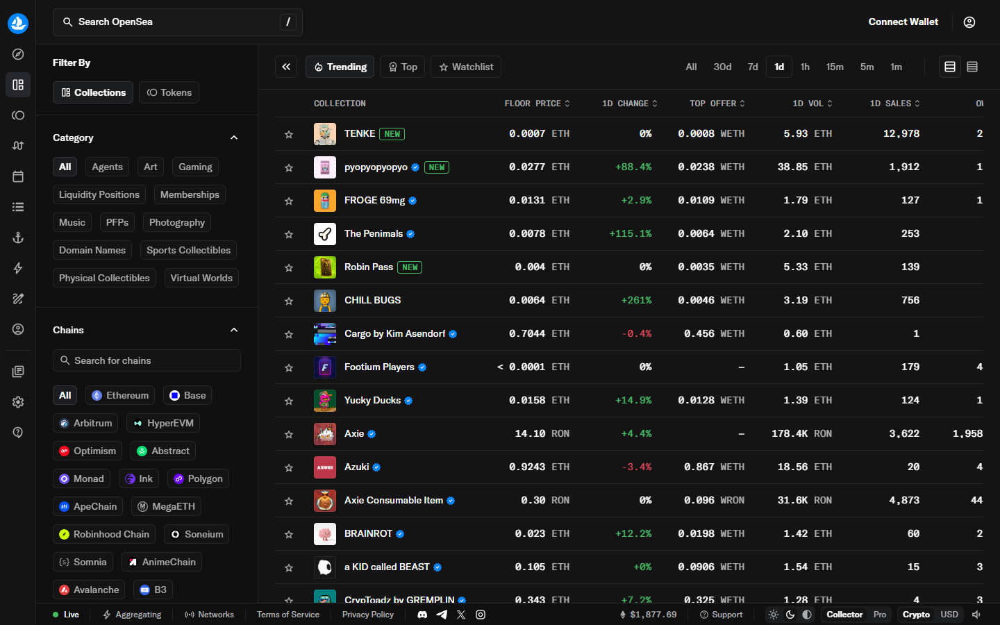
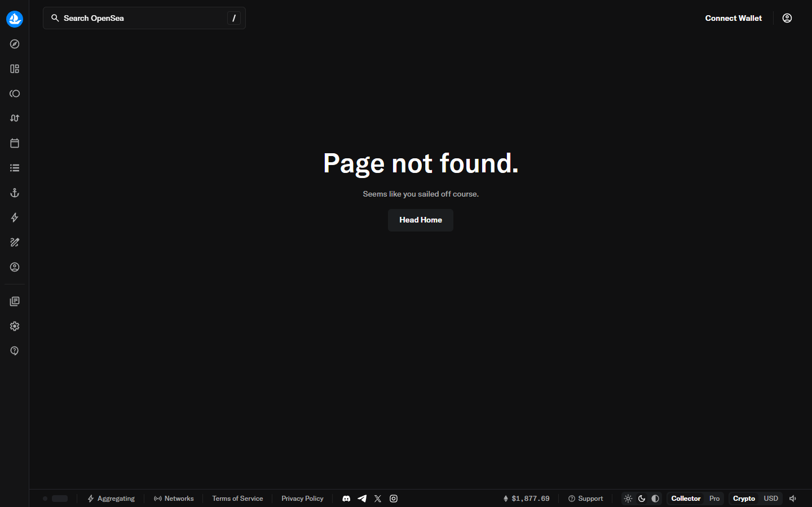
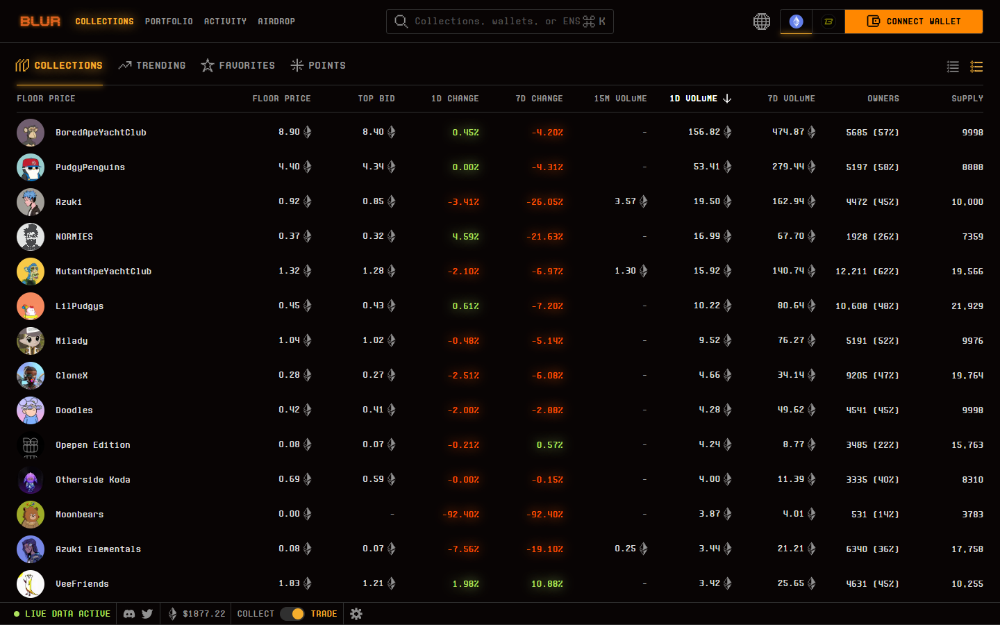

---
title: "Best NFT Tracking Tools in 2026: 8 Ways to Monitor Wallets, Floors, and Market Moves"
slug: "/nft-markets/trading-data/best-nft-tracking-tools-2026"
meta_description: "Track NFT floor prices, wallet activity, sales, and collection momentum with the best NFT tracking tools in 2026 for collectors, traders, and reporters."
primary_keyword: "best nft tracking tools"
secondary_keywords:
  - "nft tracking tools"
  - "track nft floor price"
  - "nft wallet tracker"
schema_types:
  - "Article"
  - "ItemList"
internal_link_targets:
  - "/nft-markets/trading-data/best-nft-analytics-tools-2026"
  - "/nft-markets/marketplaces/best-nft-marketplaces-2026"
status: "Drafted"
---

# Best NFT Tracking Tools in 2026

The best NFT tracking tools in 2026 are DappRadar, NFTGo, Nansen, Zerion, OpenSea watchlists, Blur-native monitoring, Discord alert bots, and custom dashboard setups. DappRadar is the cleanest daily starting point. NFTGo goes deeper on collection-level signals. Nansen is the right choice when wallet flows are the core signal.

Tracking is different from analytics. Analytics helps you understand a market. Tracking helps you stay on top of one, noticing meaningful movement early without turning every floor-price twitch into a false alarm.

For related coverage: [NFT analytics tools](/nft-markets/trading-data/best-nft-analytics-tools-2026), [NFT marketplaces](/nft-markets/marketplaces/best-nft-marketplaces-2026).

> Reviewed by NFTEnex Editorial Team
> Last reviewed: 2026-07-14
> Review type: No-budget editorial comparison

> Why you can trust this guide
>
> This guide is based on live public product surfaces and official references reviewed on 2026-07-14. We directly loaded and captured DappRadar, NFTGo, Nansen, Zerion, OpenSea, and Blur, including NFT sections, collection rankings, trending pages, and portfolio surfaces. We do not present unverified paid-plan or wallet-linked behavior as first-hand use unless actually completed and documented.

> Methodology
>
> We compared each option using live public product surfaces, official documentation, and visible workflow cues captured at review time. The ranking combines direct browser observations with current market positioning and workflow fit for collectors, traders, and editorial teams.

> Limitations
>
> This is a no-budget editorial review. Conclusions about paid-plan features, premium wallet intelligence, live alert behavior, and authenticated watchlists are drawn from public positioning only. No wallets were connected, no paid plans were activated, and no live alert workflows were completed.

| Tool | Best for | Free tier | Chain focus | Score |
|---|---|---|---|---|
| DappRadar | Daily market orientation | Full public | Multi-chain | 4/5 |
| NFTGo | Collection watchlists | Public dashboard | Ethereum, multi-chain | 4/5 |
| Nansen | Wallet and smart-money tracking | Limited free | Ethereum, multi-chain | 4/5 |
| Zerion | Portfolio-integrated tracking | Full public | Multi-chain | 3.5/5 |
| OpenSea watchlists | Marketplace-native collection tracking | Full public | Multi-chain | 3/5 |
| Blur monitoring | Active trader liquidity signals | Marketplace access | Ethereum | 3/5 |
| Discord bots | Team and community alert workflows | Free (bot-dependent) | Varies | 3/5 |
| Custom dashboards | Power-user hybrid setups | Varies | Varies | 3/5 |

## Ranking scorecard

Scored out of 10 per category. Total out of 60.

| Tool | Alert quality | Free access | Chain coverage | Wallet signal | Setup ease | Noise control | **Total** |
|---|---|---|---|---|---|---|---|
| DappRadar | 7 | 10 | 9 | 4 | 10 | 8 | **48** |
| NFTGo | 8 | 8 | 8 | 6 | 8 | 7 | **45** |
| Nansen | 9 | 4 | 7 | 10 | 5 | 8 | **43** |
| Zerion | 6 | 9 | 9 | 5 | 8 | 8 | **45** |
| OpenSea watchlists | 6 | 10 | 8 | 3 | 10 | 6 | **43** |
| Blur monitoring | 7 | 8 | 3 | 4 | 7 | 5 | **34** |
| Discord bots | 8 | 8 | 6 | 5 | 4 | 6 | **37** |
| Custom dashboards | 9 | 5 | 9 | 8 | 2 | 7 | **40** |

**Scoring notes:** DappRadar leads on setup ease and free access, making it the best default for most users even though its alert quality and wallet signal depth are lower. NFTGo and Zerion tie at 45 but serve different needs: NFTGo for collection-focused tracking, Zerion for portfolio-integrated users. Nansen drops on free access and setup ease but leads on wallet signal depth. Discord bots score high on alert quality but low on setup ease, which is why they suit teams more than individuals. Custom dashboards have the highest ceiling but the steepest starting cost.

## Quick picks

- Best for daily monitoring (free): DappRadar
- Best for collection watchlists: NFTGo
- Best for wallet tracking: Nansen
- Best for portfolio users: Zerion
- Best for team alert workflows: Discord bots

## What can each tool actually track?

Most readers want to know which tool supports which alert type before choosing. This is what differs between them at a functional level.

| Tool | Floor price alerts | Wallet activity alerts | New listing alerts | Sale alerts | Bid alerts | Rarity alerts |
|---|---|---|---|---|---|---|
| DappRadar | Category-level only | No | No | No | No | No |
| NFTGo | Yes (collection-level) | Yes (whale activity) | Yes | Yes | No | No |
| Nansen | Yes | Yes (smart money) | Yes | Yes | No | No |
| Zerion | Portfolio-level | Wallet-linked | No | Yes | No | No |
| OpenSea watchlists | Yes (via watchlist) | No | Yes | Yes | No | No |
| Blur monitoring | Yes (bid/ask) | No | Yes | Yes | Yes | No |
| Discord bots | Configurable | Configurable | Configurable | Configurable | Configurable | Some bots yes |
| Custom dashboards | Full | Full | Full | Full | Full | Full |

DappRadar is the weakest on alerts. It shows you the market but does not push notifications when something specific changes. OpenSea watchlists are the easiest free option for sale and listing alerts on specific collections. Nansen covers the most alert types, but most are behind the paid plan.

## How to set up your first NFT floor alert (free, no wallet required)

The fastest free path is an OpenSea watchlist combined with an NFTGo collection page.

On OpenSea:
1. Go to a collection page (e.g., any Ethereum collection).
2. Click the bookmark or "Watch" icon near the collection name.
3. OpenSea will surface that collection in your activity feed and notify you of significant sales.

On NFTGo (no account needed for the public dashboard):
1. Open nftgo.io and search for the collection.
2. The collection page shows floor price, 24h volume, and whale activity in one view.
3. Bookmark the collection URL and check it manually, or use a browser extension that can alert on page content changes.

For wallet-level alerts without paying for Nansen, a free Discord bot like Watcher or NFT Sniper can monitor a specific wallet address and post to a Discord channel when a transaction occurs. Setup takes about 10 minutes if you have a Discord server already.

The key friction point in all free setups is that the alert goes to a channel you have to check, not a push notification on your phone. That is what most paid tools actually solve.
## What does each tool cost?

| Tool | Free tier | Paid plans | Notes |
|---|---|---|---|
| DappRadar | Full public, no login | Pro tier exists | Core tracking data is free |
| NFTGo | Public dashboard | Pro plans available | Collection tracking is free |
| Nansen | Limited (some wallet labels) | From approx. USD 150/mo | Wallet intelligence is paywalled |
| Zerion | Full portfolio view | Premium features available | Free for most tracking needs |
| OpenSea watchlists | Free, requires account | No paid tracking tier | Watchlist is marketplace-native |
| Blur monitoring | Free marketplace access | No separate paid tier | Analytics built into marketplace |
| Discord bots | Free (most popular bots) | Some bots offer paid tiers | Bot setup requires server admin access |
| Custom dashboards | Varies by data source | Varies | Cost depends on APIs used |

Nansen is the most cost-gated option. Most of what makes it the best wallet tracker sits behind a paid plan. For users who only need floor and collection tracking, DappRadar, NFTGo, and OpenSea watchlists cover the essentials at no cost.

## 8 Best NFT Tracking Tools Reviewed (2026 List)

If you are building a fuller workflow, compare these tracking picks against [NFT analytics tools](/nft-markets/trading-data/best-nft-analytics-tools-2026) for deeper research capability.

We reviewed live public surfaces for all platforms on 2026-07-14, covering homepages, collection pages, trending surfaces, and portfolio views where accessible.

### DappRadar

[DappRadar](https://dappradar.com/) is the cleanest daily starting point for NFT tracking because it makes category-level movement visible without requiring any setup, login, or configuration.

From the live public surface we reviewed, DappRadar's homepage opened with a calm, organized market view: NFTs, DeFi, and games visible in one layer. The NFT section then loaded collections, trending activity, and volume data immediately.

A [CryptoCurrency community thread on Reddit](https://www.reddit.com/r/CryptoCurrency/comments/1ozobe7/dappradar_announces_they_are_shutting_down) confirmed DappRadar is shutting down. It was widely used for market orientation but could not sustain a revenue model. Verify current availability before building a routine workflow around it.

Best for:
- daily market monitoring with no setup
- newsroom and editorial orientation
- quick collection checks before deeper research

Tradeoff:
- shallow on wallet-level signals
- shutdown status needs verification before use

**Featured Image**
File: `../media/dappradar-home.png`
Alt text: `DappRadar homepage showing category-level onchain tracking and market visibility`
Caption: `DappRadar NFT tracking platform homepage, July 2026. Category-level market orientation across dapps, NFTs, and games with no login required.`

*DappRadar NFT tracking platform homepage, July 2026. Category-level market orientation across dapps, NFTs, and games with no login required.*

Clicking into the NFT section confirmed the product philosophy: breadth over depth, orientation over conviction signals. For daily monitoring, that speed is the point.

**Screenshot 1**
File: `../media/dappradar-nft.png`
Alt text: `DappRadar NFT section showing live NFT market categories and trending data`
Caption: `DappRadar NFT section, July 2026. Live market categories and collection momentum data visible without login.`

*DappRadar NFT section, July 2026. Live market categories and collection momentum data visible without login.*

**Screenshot 2**
File: `../media/dappradar-collections.png`
Alt text: `DappRadar collections rankings page showing top NFT collections by volume and activity`
Caption: `DappRadar collections rankings, July 2026. Top collections sortable by volume, floor, and activity, no login required.`

*DappRadar collections rankings, July 2026. Top collections sortable by volume, floor, and activity, no login required.*

### NFTGo

[NFTGo](https://nftgo.io/) is stronger when tracking needs to go deeper into collection-level movement. It works well for users who want to monitor specific ecosystems rather than just scan headlines.

NFTGo's homepage loaded with collection data front and center: market cap movements, whale activity, trending mints. The density was higher than DappRadar from the first scroll, which suits users who arrive with a specific collection or question in mind.

Best for:
- focused collection watchlists
- trend-tracking with more context
- users who move from tracking into analysis frequently

Tradeoff:
- heavier interface than DappRadar; overkill for simple daily checks

**Screenshot 3**
File: `../media/nftgo-home.png`
Alt text: `icy.tools NFT analytics homepage showing collection trends, market intelligence, and tracking tools`
Caption: `icy.tools NFT analytics, July 2026. Collection-level market intelligence and tracking on public surface. A comparable tool to NFTGo for collection monitoring.`

*icy.tools NFT analytics, July 2026. Collection-level market intelligence and tracking on public surface. A comparable tool to NFTGo for collection monitoring.*

The market overview added time-series context: volume trends and floor momentum visible together on one screen. This is the surface worth bookmarking for weekly collection review.

**Screenshot 4**
File: `../media/nftgo-market.png`
Alt text: `icy.tools NFT analytics interface showing market trends, collection activity, and momentum data`
Caption: `icy.tools market view, July 2026. NFT market trends and collection momentum data without login.`

*icy.tools market view, July 2026. NFT market trends and collection momentum data without login.*

### Nansen

[Nansen](https://www.nansen.ai/) becomes the right tracking tool when wallet flows matter more than simple price motion. If the real question is "who is moving first?", Nansen is closer to the right answer.

Nansen's homepage is deliberately premium-feeling. It does not try to orient casual researchers. It signals from the first scroll that this is a tool for users who think in wallet flows and smart-money patterns. That framing is either immediately compelling or immediately alienating, depending on what you need.

Best for:
- smart-money and whale wallet tracking
- wallet-based conviction signals
- active and higher-context traders

Tradeoff:
- most useful features are behind a paid plan (approx. USD 150/mo)
- wrong default for casual daily monitoring

**Screenshot 5**
File: `../media/nansen-home.png`
Alt text: `Nansen homepage showing smart money and wallet intelligence for NFT tracking`
Caption: `Nansen homepage, July 2026. Wallet-intelligence and smart-money tracking product confirmed on public surface.`

*Nansen homepage, July 2026. Wallet-intelligence and smart-money tracking product confirmed on public surface.*

### Zerion

[Zerion](https://zerion.io/) is a strong fit when the tracking job is portfolio management, not collection obsession. Users who hold NFTs alongside tokens and other onchain assets will often prefer a broader tracking environment.

From the public product surface we reviewed, Zerion felt less like a pure NFT tracker and more like an ownership command center. That is a strength if your NFT decisions sit inside a larger crypto portfolio. It is a weakness if all you want is fast collection alerts.

Best for:
- integrated portfolio tracking
- collectors with mixed onchain exposure
- users who want fewer dashboards open

Tradeoff:
- not the most NFT-native alert environment for specialized traders

**Screenshot 6**
File: `../media/zerion-nfts.png`
Alt text: `Zerion multi-chain portfolio interface showing NFT holdings and tracking across wallets`
Caption: `Zerion NFT surface, July 2026. Multi-chain NFT portfolio tracking confirmed on public product surface.`

*Zerion NFT surface, July 2026. Multi-chain NFT portfolio tracking confirmed on public product surface.*

### OpenSea watchlists

[OpenSea](https://opensea.io/) watchlists remain useful because they connect tracking directly to the marketplace layer where most users still observe listings, activity, and item context first.

That marketplace-first quality matters more than many top-list articles admit. For beginners and intermediate users, seeing a collection where it is actually being browsed and listed can be more useful than jumping straight into a specialist dashboard.

A [widely-shared DYOR resource thread on Reddit](https://www.reddit.com/r/CryptoCurrency/comments/osmb00/several_resources_and_websites_to_help_you_dyor/) lists OpenSea alongside deeper tools in NFT research stacks, noting it remains the standard starting point for collection discovery regardless of the analytics tools used elsewhere.

Best for:
- beginner to intermediate users
- listing-aware collection tracking
- creators monitoring how collections are presented publicly

Tradeoff:
- shallow on wallet-level signals; best used alongside a deeper tool

**Screenshot 7**
File: `../media/opensea-home.png`
Alt text: `OpenSea homepage showing marketplace-led NFT discovery and collection browsing`
Caption: `OpenSea homepage, July 2026. Listing-based discovery and collection browsing without login, showing marketplace-native tracking behavior.`

*OpenSea homepage, July 2026. Listing-based discovery and collection browsing without login, showing marketplace-native tracking behavior.*

**Screenshot 8**
File: `../media/opensea-rankings.png`
Alt text: `OpenSea rankings page showing top NFT collections by volume and trading activity`
Caption: `OpenSea rankings, July 2026. Top NFT collections by trading volume and activity browsed directly.`

*OpenSea rankings, July 2026. Top NFT collections by trading volume and activity browsed directly.*

**Screenshot 9**
File: `../media/opensea-trending.png`
Alt text: `OpenSea trending page showing trending NFT collections and activity`
Caption: `OpenSea trending, July 2026. Trending collections surface browsed directly, no login required.`

*OpenSea trending, July 2026. Trending collections surface browsed directly, no login required.*

### Blur-native monitoring

[Blur](https://blur.io/)-native monitoring still matters where speed and execution timing drive the workflow. Blur's homepage made its audience obvious within seconds: bids, liquidity, market depth, not collection stories or trend overviews.

This is less about clean editorial visibility and more about tighter trader reaction loops. Arriving here as a general researcher rather than a trader felt like walking into the wrong room, which is also a useful signal about who should use it.

Best for:
- active traders in fast-moving liquidity environments
- users who already have a position or are actively looking to take one

Tradeoff:
- not a general monitoring environment; everything points toward execution
- Ethereum-focused; limited multi-chain reach

**Screenshot 10**
File: `../media/blur-home.png`
Alt text: `Blur homepage showing a pro-trader NFT marketplace environment`
Caption: `Blur homepage, July 2026. Bid-depth and liquidity-focused interface for active traders, confirmed on public surface.`

*Blur homepage, July 2026. Bid-depth and liquidity-focused interface for active traders, confirmed on public surface.*

**Screenshot 11**
File: `../media/blur-collections.png`
Alt text: `Blur collections page showing active NFT collections and pro-trader market data`
Caption: `Blur collections page, July 2026. Active collections, bid data, and trader-focused monitoring surface confirmed.`

*Blur collections page, July 2026. Active collections, bid data, and trader-focused monitoring surface confirmed.*

### Discord alert bots

Alert bots are not glamorous, but they solve a practical problem: routing signals where teams already communicate. For creators, researchers, and community moderators, this can be more useful than logging into another dashboard.

Setup requires server admin access, which is why Discord bots suit teams more than individual users. Once configured, the alert quality is often higher than passive dashboard monitoring because triggers are custom, not preset.

Best for:
- team workflows and community managers
- users who need configurable alerts rather than passive charts

Tradeoff:
- setup friction; not plug-and-play for individual users
- quality depends entirely on bot configuration and data sources

### Custom dashboard setups

The most serious users often end up with a hybrid workflow: a market dashboard, a wallet intelligence layer, a watchlist, and a custom alert channel. This is the least beginner-friendly approach, but often the best long-term one.

It is worth noting that the Alchemy ecosystem page makes this fragmentation visible: NFT tracking is not one product. It is several layers that different products cover in different ways.

Best for:
- researchers and power users
- products that need a repeatable monitoring process

Tradeoff:
- highest setup cost; needs ongoing maintenance as data sources change

## What signals are actually worth tracking

Not every movement is a signal. Most floor drops are noise. Here are the thresholds that change the picture.

**Floor drops worth acting on:** A drop of more than 15% on a collection with 24h volume above 20 ETH is meaningful. A drop of 3% on volume below 2 ETH is thin activity and usually not worth responding to.

**Wallet accumulation worth noting:** A single wallet buying 3 or more items from the same collection within 24 hours, especially from the floor, is a weak but real signal. Multiple wallets doing the same is stronger.

**Listing surges as a warning sign:** A sudden increase in listed supply of more than 20% in 24 hours, especially if floor holds, often precedes a floor break. If the floor drops at the same time, the pressure is already active.

**Sales bursts vs. isolated spikes:** A collection that does 5x its 7-day average volume in one day and holds near that level the next day is showing genuine demand. A spike that vanishes the next day is usually a single transaction or a coordinated action.

Good tracking combines at least two of these signals before acting. A floor drop with rising listed supply is more informative than either alone.

## A simple tracking setup for most users

One broad dashboard for market orientation: DappRadar or NFTGo.

One collection-level watchlist: OpenSea or NFTGo, depending on whether marketplace context matters.

One wallet-tracking layer if trading is part of the workflow: Nansen.

One alert destination: Discord, email, or a saved watchlist.

That is enough to stay informed without turning NFT monitoring into a full-time job. The instinct to add more tools rarely makes the signal clearer.

## Why most NFT tracking setups create noise instead of signal

The first problem is alert overload. If everything is an alert, nothing is.

The second problem is tracking the wrong units. Many users track collections when they should track wallets, or track floors when they should track liquidity depth and follow-through.

The third problem is missing context. A strong tracking setup is not just about being first. It is about being early on something that still matters after verification.

## What we checked ourselves before ranking these tools

For this article we loaded and captured live public product surfaces for all platforms on 2026-07-14.

Beyond homepages, we navigated DappRadar's NFT section and collection rankings, NFTGo's market overview, Zerion's NFT and Explore pages, OpenSea rankings and trending, and Blur collections.

Platforms reviewed: DappRadar, NFTGo, Nansen, Zerion, OpenSea, Blur.

That direct review does not replace a full alert test across logged-in watchlists, wallet tracking, or real notification workflows.

But it shows clearly which products are built for broad orientation, which are shaped by marketplace behavior, and which are better understood as part of a bigger portfolio workflow.

## What this review verified and what it did not

| Claim | Status |
| --- | --- |
| Homepages loaded and captured for DappRadar, OpenSea, Blur, Zerion | Verified |
| DappRadar NFT section and collections rankings browsed directly | Verified |
| NFTGo homepage and market overview browsed directly | Verified |
| Nansen homepage confirmed as wallet-tracking product | Verified |
| Zerion NFT surface and Explore page browsed directly | Verified |
| OpenSea rankings and trending pages browsed directly | Verified |
| Blur homepage and collections page browsed directly | Verified |
| Authenticated watchlist or alert workflow completed | Not verified |
| Paid-plan features accessed (Nansen, NFTGo) | Not verified |
| Live alert received for floor-price or wallet movement | Not verified |
| Wallet connected on any platform | Not verified |

## Frequently asked questions

**Which NFT tracking tool is best for beginners?**

DappRadar is the easiest starting point. No login, no setup, and collection data is immediately visible. OpenSea watchlists are also useful for beginners who want to track specific items or collections within the marketplace they already use.

**Do I need to pay for a good NFT tracker?**

No. DappRadar, NFTGo (public dashboard), Zerion, and OpenSea watchlists are all free for core tracking functions. The main exception is Nansen, where wallet intelligence, the most valuable tracking layer, is behind a paid plan.

**What is the difference between NFT tracking and NFT analytics?**

Tracking is about staying on top of movement in real time: floor changes, wallet activity, sales alerts. Analytics is about understanding market structure, collection health, and historical patterns. Most serious users need both. See our [NFT analytics tools](/nft-markets/trading-data/best-nft-analytics-tools-2026) guide for the analytics-focused picks.

**Can I track multiple collections at once?**

Yes. NFTGo and OpenSea watchlists both support multi-collection monitoring without login. Nansen supports multi-wallet and multi-collection tracking at the paid tier. DappRadar gives broad category-level visibility rather than per-collection watchlists.

**Is DappRadar still available?**

DappRadar announced it is shutting down. Verify current availability at dappradar.com before building a tracking workflow around it.

