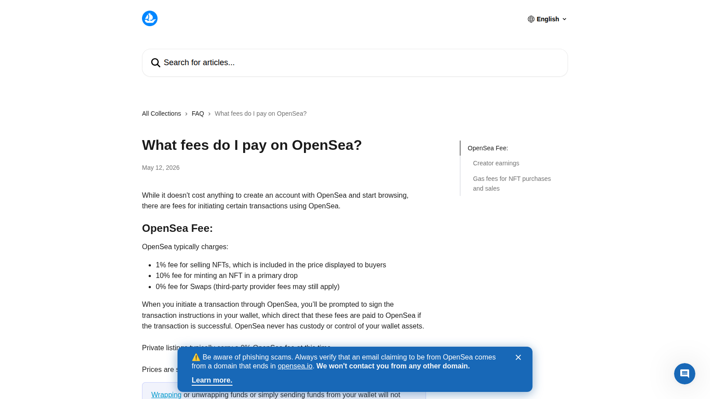
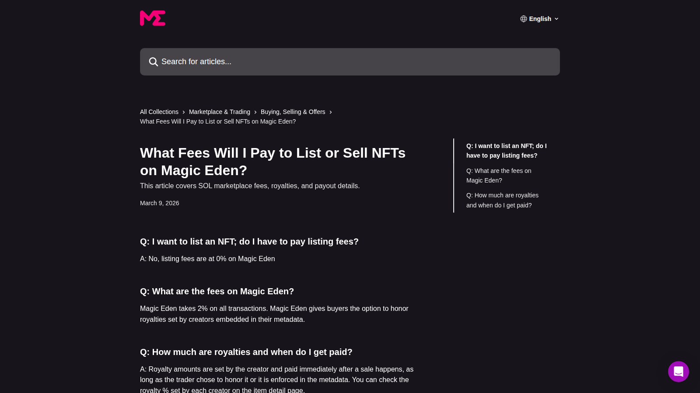

# Best NFT Marketplaces for Creator Royalties in 2026: Where Artists Still Have the Best Terms

Creator royalties are still one of the most misunderstood parts of NFT infrastructure. In 2026, the question is not just whether a marketplace "supports royalties." The real question is how creator earnings are configured, when they are enforced, and what tradeoffs creators accept in exchange for liquidity and distribution.

That means the best NFT marketplace for creator royalties is not always the marketplace with the loudest creator messaging. It is the one whose fee model, policy logic, and audience fit your release strategy. This article also needs to work as a cluster bridge into [NFT royalties](/creator-economy/royalties), [NFT marketplaces for artists](/creator-economy/artists/best-nft-marketplaces-for-artists-2026), and the broader [best NFT marketplaces](/nft-markets/marketplaces/best-nft-marketplaces-2026) conversation.

> Why you can trust this guide
>
> This guide is based on live marketplace help-center documentation and current platform references reviewed on 2026-07-10. Because creator-earnings rules and fee settings can change, readers should verify any workflow-critical policy detail against the latest official help article before acting.

## The best NFT marketplaces for creator royalties in 2026 are Magic Eden, OpenSea, Zora, Manifold-powered storefronts, and Rarible

Magic Eden and OpenSea remain essential because they still shape the practical marketplace environment creators must navigate. Zora is more attractive when creators want a culture-first, creator-native distribution model. Manifold-powered storefronts are strong when the team wants more direct control over the selling environment and creator relationship. Rarible remains relevant for creators who want a simpler marketplace-linked workflow.

The key point is that no creator should assume royalties behave the same way everywhere. Marketplace settings, collection configuration, operator logic, and trading paths can all affect what creators actually earn.

Quick picks:

- Best mainstream marketplace to compare against: `OpenSea`
- Best alternative with strong creator attention: `Magic Eden`
- Best for creator-native distribution logic: `Zora`
- Best for greater direct control: `Manifold-powered storefronts`
- Best simpler marketplace workflow: `Rarible`

## What we checked ourselves before ranking these marketplaces

For this article, we reviewed the live fee and help documentation that [OpenSea](https://support.opensea.io/en/articles/8867091-what-fees-do-i-pay-on-opensea) and [Magic Eden](https://help.magiceden.io/en/articles/5858632-what-fees-will-i-pay-to-list-or-sell-nfts-on-magic-eden) publish publicly, because royalty discussions become vague very quickly when they are built only from old Twitter arguments and secondhand summaries.

That direct review does not answer every question a creator might have. It does not replace a live collection test across multiple chains or a full resale-path audit. But it does give us a much cleaner basis for judgment, because we can compare the way the major marketplaces currently explain fees, creator earnings, and selling conditions in their own language.

*OpenSea fee documentation captured during our July 2026 review of creator-royalty marketplaces.*

*Magic Eden fee documentation captured during our July 2026 review of creator-royalty marketplaces.*

What stood out immediately was that a creator-royalty comparison should never start with ideology. It should start with the practical surfaces creators actually depend on: fee pages, help documentation, collection setup rules, and where the marketplace puts the burden of clarity. If a platform cannot explain its economics cleanly, it is already creating friction for the people it claims to help.

## What creator royalties actually mean in 2026

Creator royalties are recurring payments intended to send a portion of secondary-market activity back to the creator or project. In theory, that sounds simple.

In practice, royalties now sit at the intersection of:

- marketplace fee policy
- smart contract design
- enforcement tools
- user routing behavior
- collection strategy

That is why a royalty conversation is really a marketplace design conversation. A creator is not only choosing a payout setting. They are choosing what kind of market they want to participate in.

## Our direct editorial read after reviewing the live fee surfaces

After reviewing the public fee documentation directly, the clearest difference was not just price. It was how much operational confidence each marketplace gives a creator before the creator ever launches.

OpenSea still feels like the baseline reference because creators, collectors, and media already understand it as the mainstream comparison point. Magic Eden feels more like the marketplace you have to measure against if active trading conditions and alternative ecosystem reach matter to the project. Neither one automatically "wins" the royalty conversation, because the right choice depends on whether the creator values reach, clarity, control, or enforceability most.

That is why I would not frame this article as "which marketplace is most creator-friendly" in a generic sense. The better framing is: which marketplace creates the least mismatch between your royalty expectations and the market behavior you are likely to face.

## Which marketplace works best for artists, brands, and collection teams

Artists usually need three things: discoverability, a clear creator story, and a payout structure that does not become confusing once secondary trading begins.

Brands often care less about royalties as recurring art income and more about control, user journey, and commercial clarity. That can push them toward storefront-based models or platforms that support cleaner onboarding.

Collection teams care about audience size, liquidity, and long-term trading behavior. For them, royalty strategy is inseparable from market structure. A high royalty setting that kills distribution may not be better than a lower-friction model that keeps the market active.

## Royalty policy comparison by marketplace

### Magic Eden

Magic Eden matters because creators still have to take it seriously when thinking about secondary trading reach. It has enough market relevance that its fee and royalty behavior can shape launch strategy, not just optimization.

From the help-center surface we reviewed directly, Magic Eden feels like a marketplace that has to be read operationally, not emotionally. That is a strength because creators can inspect how the platform describes fees and selling conditions in concrete terms. It is also a reminder that creator economics have to be checked in the exact environment where users will actually trade.

Best for:

- teams that want a major marketplace in the decision set
- projects that care about active trading environments
- creators who need to compare royalty posture against liquidity realities

Watch for:

- exact current fee structure
- how creator settings are described in current help-center language
- whether policy differences vary by chain or product surface

### OpenSea

OpenSea still matters because it remains a default reference point for many creators, collectors, and readers. Its support documentation makes it a must-cover platform in any creator royalty article.

From the public fee documentation we reviewed, OpenSea still feels like the clearest mainstream benchmark in this category. That does not automatically make it the best creator-royalty answer for every project, but it does make it the comparison point that most readers can understand without extra explanation.

Best for:

- mainstream comparison baseline
- creators who need familiar marketplace reach
- teams that want predictable user understanding

Watch for:

- current marketplace fees
- any updated creator earnings behavior
- collection-level configuration details

### Zora

Zora works better when the creator wants a model built around distribution, onchain publishing, and creator identity rather than simply marketplace volume. It can be a stronger fit for creators who want community and release logic to matter as much as resale mechanics.

The reason Zora stays high in this article is not because it looks like a fee-maximization tool. It stays high because some creators care more about publishing logic and creator identity than about plugging into the most familiar resale surface.

Best for:

- creator-led releases
- open-edition or media-native projects
- teams prioritizing cultural distribution

### Manifold-powered storefronts

Manifold storefront logic appeals to creators who do not want royalties to depend entirely on third-party marketplace framing. It makes more sense when direct control and owned customer relationship matter more than generic marketplace discoverability.

This is the clearest example of a tool that may be better for creator control and still worse for raw marketplace convenience. That tradeoff should be explicit, not hidden.

Best for:

- direct creator storefronts
- teams that want more control over contract and sales flow
- projects that expect repeat releases

### Rarible

Rarible is relevant when a creator wants a simpler marketplace-linked option and does not need a highly custom operating model from day one.

Best for:

- smaller creator launches
- simpler workflow needs
- creators who want a known marketplace framework without building a deeper stack

## The tradeoff between enforceability, liquidity, and creator upside

This is the core issue that many "best royalty marketplace" articles hide.

Higher creator control does not automatically mean better outcomes.

A marketplace or stack that looks creator-friendly on paper may underperform if:

- buyers avoid it
- liquidity fragments
- trading routes bypass creator-preferred environments

At the same time, a marketplace with strong volume is not automatically the best royalty choice if the creator has little clarity on what gets enforced and what does not.

Creators should decide what they care about most:

- maximum reach
- stronger payout alignment
- tighter brand control
- cleaner onboarding
- long-term community ownership

In practice, the strongest royalty choice is often the one that matches the creator's actual release strategy, not the one with the most aggressive creator talking points.

## The best choice if royalties are your top priority

If royalties are your top priority, start by deciding whether you want:

- a large marketplace environment
- a creator-native distribution platform
- a controlled storefront model

Then choose the marketplace that aligns with that strategy.

For broad-market relevance, you still need OpenSea and Magic Eden in the comparison.

For creator-native positioning, Zora is stronger.

For direct control, Manifold-powered storefronts are more attractive.

For simpler marketplace convenience, Rarible still has a place.

The best marketplace for creator royalties in 2026 is the one whose incentives still make sense after the first resale, not just at mint.
