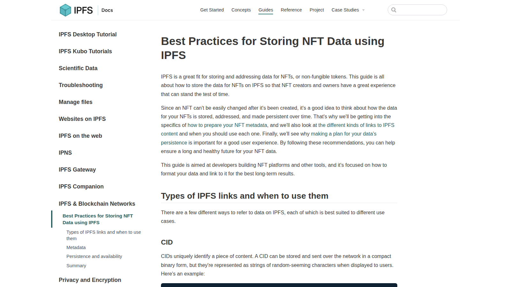
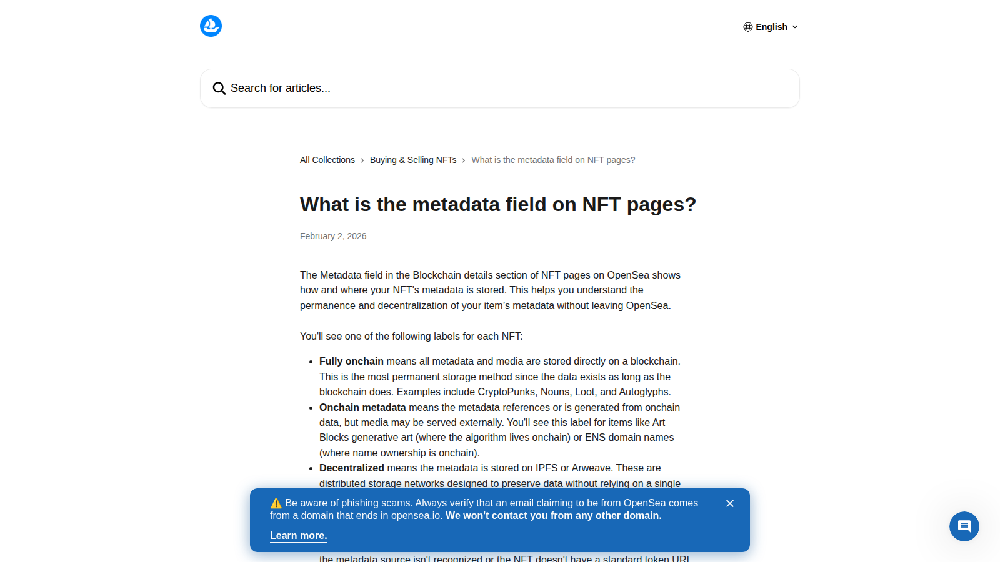
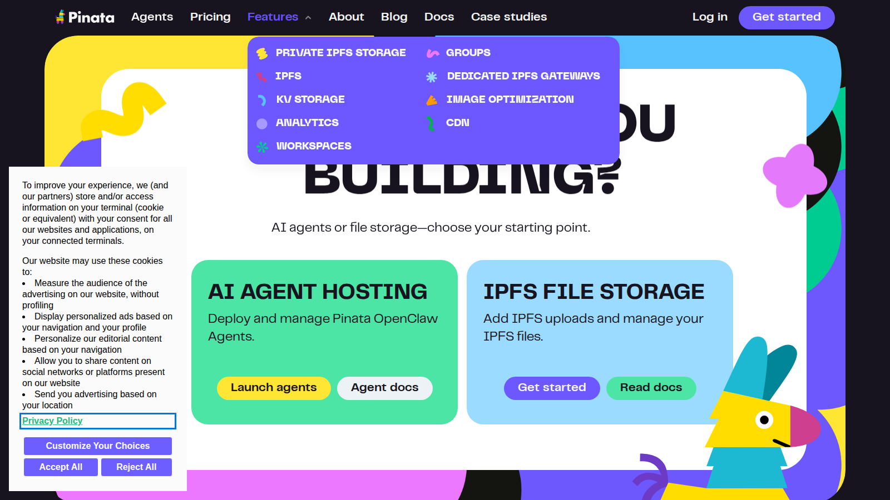

# Best NFT Storage Tools in 2026: IPFS, Arweave, and the Best Options for Permanent Metadata

NFT ownership breaks down quickly if the media and metadata layer is weak. In 2026, the best NFT storage tool is not just the one that uploads files. It is the one that gives creators a more durable path for images, metadata, and long-term retrieval.

That is why NFT storage has moved back to the center of the conversation. OpenSea now exposes more metadata context on NFT pages, and IPFS documentation still makes clear that how data is stored matters as much as the token itself. If you are building a full ownership stack, this page should also connect naturally to [NFT minting tools](/nft-infrastructure/minting/best-nft-minting-tools-2026), [NFT APIs](/nft-infrastructure/metadata/best-nft-apis-2026), and a deeper explainer on [NFT metadata](/nft-ecosystem/guides/nft-metadata-explained-2026).

> Reviewed by NFTEnex Editorial Team
> Last reviewed: 2026-07-13
> Review type: No-budget editorial comparison
> Editorial policy: [NFTEnex Editorial Policy](/editorial-policy)

> Why you can trust this guide
>
> This guide is based on live public product surfaces and official references reviewed on 2026-07-13. We directly checked the public positioning, visible workflow framing, and documentation shown in this article. We do not present unverified logged-in behavior, live checkout results, or completed onchain actions as first-hand use unless they were actually completed and documented.
>
> Methodology
>
> We compared each option using live public product surfaces, official documentation, and visible workflow cues captured at review time. In this version, the ranking prioritizes clarity, workflow posture, and fit for different user types over private dashboard claims we could not verify directly.
>
> Limitations
>
> This is a no-budget editorial review, not a fully funded end-to-end product test. Where a conclusion would require a live transaction, paid plan, logged-in dashboard, or wallet-funded workflow, we treat that as a limitation and avoid overstating direct experience.

## The best NFT storage tools in 2026 are Pinata, Arweave-based options, Filebase, Lighthouse, self-managed IPFS pinning workflows, and selected NFT.Storage alternatives

Pinata remains one of the clearest storage choices for teams that want a managed IPFS workflow. Arweave-based tools are stronger when permanence is the central value proposition. Filebase is useful for teams that want object-storage familiarity around decentralized data workflows. Lighthouse is relevant in Web3-native storage conversations. Self-managed IPFS pinning still matters for teams that want more control. NFT.Storage alternatives belong in the conversation, but any specific provider status should be verified before publication because product availability and ownership can change.

Quick picks:

- Best managed IPFS workflow: `Pinata`
- Best permanence-first angle: `Arweave-based storage`
- Best object-storage-like feel: `Filebase`
- Best for control-heavy teams: `self-managed IPFS pinning`

## What we checked ourselves before ranking these storage options

For this article, we reviewed the live [IPFS documentation for NFT data](https://docs.ipfs.tech/how-to/best-practices-for-nft-data/), [OpenSea's metadata-field help article](https://support.opensea.io/en/articles/13355231-what-is-the-metadata-field-on-nft-pages), and the current public product surface for [Pinata](https://pinata.cloud/) on 2026-07-10.

That direct review does not replace a full storage implementation test with uploads, pinned content, retrieval failures, and multi-gateway fallback checks. But it is enough to surface the most important distinction that many weak articles miss: NFT storage is not a branding question. It is an operational trust question.

**Featured Image**
File: `../media/ipfs-nft-data.png`
Alt text: `IPFS documentation page covering best practices for storing NFT data`
Caption: `IPFS documentation captured during our July 2026 review of NFT storage practices.`

*IPFS documentation captured during our July 2026 review of NFT storage practices.*

**Screenshot 1**
File: `../media/opensea-metadata.png`
Alt text: `OpenSea Help Center page explaining the metadata field on NFT pages`
Caption: `OpenSea metadata documentation captured during our July 2026 review of NFT storage and retrieval signals.`

*OpenSea metadata documentation captured during our July 2026 review of NFT storage and retrieval signals.*

**Screenshot 2**
File: `../media/pinata-home.png`
Alt text: `Pinata homepage showing managed file storage for decentralized workflows`
Caption: `Pinata homepage captured during our July 2026 review of NFT storage platforms.`

*Pinata homepage captured during our July 2026 review of NFT storage platforms.*

What stood out immediately was that the storage conversation becomes much clearer once you look at the places where storage actually shows up in practice. IPFS docs frame the protocol side. OpenSea's metadata page shows how marketplaces surface storage context to users. Pinata shows how managed storage tools package that complexity into a workflow normal teams can actually use.

The screenshots above show the same storage problem from three angles: protocol guidance, marketplace visibility, and managed workflow packaging. That visual difference is not cosmetic. It tells you where responsibility really sits.

## The safest way to store NFT metadata in 2026

The safest approach is still the one that assumes marketplaces, wallets, and explorers will outlive any single hosting shortcut.

That usually means:

- storing metadata in a decentralized or durable environment
- keeping media references stable
- avoiding one fragile centralized upload path
- documenting how files are pinned, mirrored, or retrievable

The token is only the ownership pointer. If the data behind that pointer is unstable, the ownership story gets weaker fast.

## Our direct editorial read after reviewing the storage surfaces

After reviewing these live surfaces side by side, the clearest difference was not simply protocol versus product. It was responsibility.

IPFS makes it obvious that content-addressing is only part of the answer. OpenSea's metadata view makes it obvious that storage choices become visible to users later. Pinata makes it obvious why managed workflows stay relevant: most teams do not want to become storage operators just to keep a collection usable.

That is why the best storage decision is rarely the most ideological one. It is the one that gives a creator or team the strongest long-term retrieval story without creating an operations burden they will not actually maintain.

## IPFS vs Arweave vs managed storage

IPFS is useful because it is content-addressed and widely integrated into NFT workflows. But IPFS alone is not enough if no one is reliably pinning the data.

Arweave is appealing because permanence is part of the pitch. That makes it attractive for collections where long-term cultural or archival durability matters more than flexible upload iteration.

Managed storage tools sit between the two extremes. They help teams use decentralized storage without becoming their own storage infrastructure team.

The real decision is not IPFS versus Arweave in the abstract. It is whether you need:

- flexibility
- permanence
- operational simplicity
- lower ongoing maintenance burden

## Best storage tools by creator and team use case

### Pinata

Pinata is the strongest mainstream answer for many teams because it makes IPFS workflows more manageable without forcing creators to operate too much infrastructure themselves.

From the public product surface we reviewed, Pinata looked like the clearest example of a storage tool trying to make decentralized file workflows operationally normal. That is a strength if your team wants a managed path. It is a weakness only if your standard for trust requires more direct control than a managed layer can offer.

Best for:

- creators and teams that want a familiar workflow
- projects using IPFS but needing smoother operations
- launches that need practical setup speed

### Arweave-based options

Arweave is most compelling when the collection story depends on permanence. It fits projects that want to make a stronger claim about long-term storage durability.

This is the category that sounds strongest in theory, but still needs to be judged by actual workflow, cost tolerance, and how permanent the team truly needs the media strategy to be.

Best for:

- archival and permanence-heavy collections
- teams with stronger long-term preservation goals
- projects where "digital ownership" includes durable media presence

### Filebase

Filebase appeals to teams that want a storage experience closer to standard object-storage logic while still building around decentralized file systems and related workflows.

Best for:

- teams comfortable with cloud-storage patterns
- operators building repeatable media pipelines
- projects that need a more operational storage posture

### Lighthouse

Lighthouse belongs in the conversation because Web3-native teams often want storage tooling that fits better with decentralized app workflows than generic storage products do.

Best for:

- Web3-native builders
- teams that want more composable decentralized storage logic

### Self-managed IPFS pinning

Self-managed IPFS pinning is not for everyone, but it is still the right answer for teams that care most about direct control, redundancy design, and independence from any single third-party workflow.

This is also where many teams overestimate themselves. Control sounds attractive until someone has to own retrieval policy, redundancy, and monitoring long after mint day.

Best for:

- technically capable teams
- serious archival planning
- products where storage policy is part of trust

## What breaks NFT media and metadata over time

The biggest failure mode is assuming the mint transaction solves permanence by itself.

It does not.

The more common breakdowns are:

- metadata hosted in a weak or temporary location
- media pinned inconsistently
- untracked dependency on one provider
- unclear retrieval policy if tooling changes later

This is exactly why NFT storage should not be treated as an afterthought under "tech setup." It is part of the ownership promise.

## The best storage setup for long-term digital ownership

If you want the simplest strong setup, use a managed IPFS workflow such as Pinata and document the retrieval path clearly.

If permanence matters most, seriously evaluate Arweave-based storage.

If your team thinks like product operators, not just creators, Filebase and self-managed IPFS can make more sense.

If your collection promises durable digital ownership, the storage layer should be strong enough that your ownership claim still makes sense years later.
